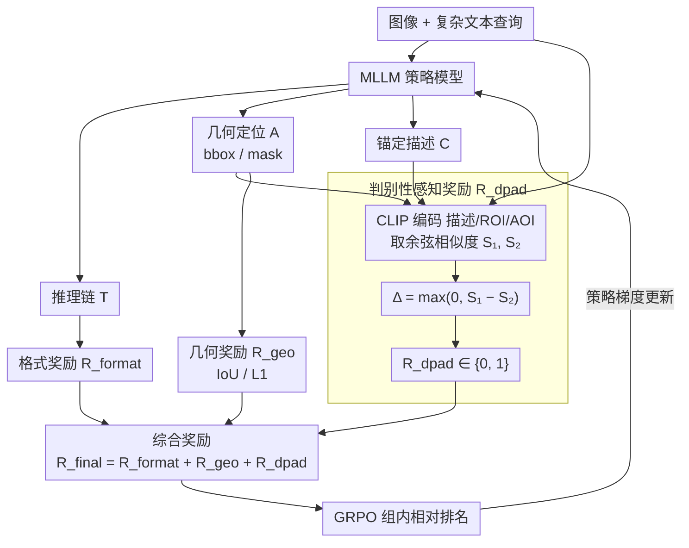

# DPAD: Discriminative Perception via Anchored Description for Reasoning Segmentation

**会议**: CVPR 2026  
**arXiv**: [2603.04002](https://arxiv.org/abs/2603.04002)  
**代码**: [https://github.com/mrazhou/DPAD](https://github.com/mrazhou/DPAD)  
**领域**: 推理分割  
**关键词**: [推理分割, 强化学习, GRPO, 判别性感知, CLIP, 锚定描述, 奖励设计]  

## 一句话总结
针对推理分割(RS)中RL+GRPO训练的geometric reward无法约束reasoning chain是否聚焦目标unique attributes的问题，提出DPAD方法：MLLM生成reasoning chain+geometric localization+anchored description，引入基于CLIP的Discriminative Perception Reward比较description与ROI/AOI的相似度差异，迫使caption更具判别性从而间接约束推理链聚焦目标，ReasonSeg上cIoU提升3.09%且推理链长度减少42%。

## 背景与动机
推理分割(Reasoning Segmentation, RS)要求模型根据复杂的文本查询(涉及推理、常识、世界知识等)来分割目标。与传统referring segmentation只需理解指代表达不同，RS需要模型经过多步推理才能确定目标对象。近期工作借鉴LLM领域的RL+GRPO训练策略来提升MLLM的推理分割能力，使用geometric reward(如IoU、L1距离)来引导模型生成更准确的分割结果。然而geometric reward只衡量最终分割的几何精度，无法判断推理过程(reasoning chain)的质量——模型可能通过冗长发散的推理链碰巧得到正确答案，也可能推理聚焦于无关上下文而非目标本身。

## 核心问题
RL+GRPO中geometric reward(IoU/L1)仅评估分割结果的几何正确性，无法判断reasoning chain是否真正聚焦于目标对象vs游离于无关上下文→导致"divergent verbose chain"现象：推理链越来越长、内容越来越发散，但geometric质量无法进一步提升。需要一种reward信号来显式约束推理过程的判别性——确保模型关注的是让目标与其他对象区分开的unique attributes。

## 方法详解

### 整体框架
DPAD 针对 RL+GRPO 训练推理分割时的盲点：几何奖励（geometric reward，IoU/L1）只看最终分割准不准，管不了推理链（reasoning chain）是不是真的聚焦目标，于是推理链越拉越长、越来越发散却换不来更好的分割。DPAD 在 GRPO 框架上做两处扩展：输出端让 MLLM 在推理链 $T$ 和几何定位 $A$ 之外，额外吐一段锚定在目标视觉属性上的**锚定描述**（anchored description）$C$；奖励端在几何奖励之外加一个基于 CLIP 的**判别性感知奖励**（Discriminative Perception Reward）$R_{dpad}$，用它逼描述变得有判别性，从而间接把推理链摁回到目标的独有属性（unique attributes）上。

### 关键设计

**1. 锚定描述（Anchored Description）：把推理链的内部理解外化成可评估的文本**

推理过程本身没法直接打分，DPAD 让 MLLM 把输出扩成三件套：推理链 $T$（多步推理）、几何定位 $A$（bbox 或 mask 坐标）、以及锚定描述 $C$（锚定在目标视觉属性上的描述性文本）。之所以叫"锚定"，是因为这段描述被要求去描述模型自己定位 $A$ 框出来的那个目标。它是连接推理链和判别奖励的桥——把推理链里"我理解到了什么"显式写成一句话，于是可以用 CLIP 去衡量这句话到底抓没抓住目标。

**2. 判别性感知奖励（Discriminative Perception Reward）：用 ROI 对 AOI 的相似度差逼出判别性**

核心思路是：一段好的描述应该贴着目标区域、而不像在描述整张图——因为它讲的该是目标的独有属性，不是全图的通用特征。具体用 CLIP 文本编码器取描述 $C$ 的特征 $V_C$，视觉编码器分别取目标区域（ROI，由真值框裁出的图像块）和全图（AOI，整张图）的特征 $V_{ROI}, V_{AOI}$，算两个余弦相似度并取其正向差：

$$S_1 = \text{Sim}(V_C, V_{ROI}), \quad S_2 = \text{Sim}(V_C, V_{AOI}), \quad \Delta = \max(0, S_1 - S_2)$$

$$R_{dpad} = \begin{cases} 1 & \Delta > 0 \\ 0 & \text{otherwise} \end{cases}$$

若描述只说"图里有个物体"，$V_C$ 跟 ROI、AOI 都差不多，$\Delta \approx 0$、reward=0；若描述了"红色条纹的椅子"这种独有属性，$V_C$ 会更贴 ROI，$\Delta > 0$、reward=1。要拿到这个奖励，推理链就不得不聚焦目标的独有属性，推理链质量被间接约束。用相对差 $S_1 - S_2$ 而非绝对阈值，还省去了校准相似度绝对数值的麻烦、更鲁棒。

**3. 综合奖励与 GRPO 优化**

三种奖励合成最终信号 $R_{final} = R_{format} + R_{geo} + R_{dpad}$：$R_{format}$ 确保输出遵循"推理 + 定位 + 描述"的格式（用正则校验 `<think>/<answer>/<caption>` 标签和 JSON 字段，缺它格式会乱、其他奖励算不出来），$R_{geo}$ 基于 IoU/L1 评估几何精度，$R_{dpad}$ 评估描述的判别性。优化用 GRPO——对同一查询采样 $G$ 个候选，按组内相对排名估计策略梯度更新 MLLM，其中 CLIP 作为奖励模型的一部分全程冻结、不参与梯度。

### 损失函数 / 训练策略
训练走标准 RL 流程，GRPO 采样组大小为 $G$ 做组内相对排名，CLIP 冻结充当奖励模型，训练数据用 ReasonSeg 训练集。

## 实验关键数据

| 方法 | cIoU | gIoU | 推理链长度 |
|------|------|------|-----------|
| 基线(仅R_geo) | baseline | baseline | 1.0× |
| DPAD (R_geo + R_dpad) | **+3.09%** | 提升 | **0.58×(-42%)** |

- ReasonSeg验证集上cIoU提升3.09%，同时reasoning chain长度减少42%
- Description提供了额外的可解释性——可视化检查模型"看到了什么"
- 与其他RL-based RS方法对比，DPAD在保持competitive geometric性能的同时显著提升了推理效率

### 消融实验要点
- R_dpad是关键：移除R_dpad后退回到纯geometric reward的baseline水平，推理链再次变得冗长发散
- Anchored description必不可少：没有description就无法计算R_dpad，且description本身也约束了模型的输出结构
- ROI vs AOI对比的设计优于只用ROI相似度：仅用S_1>threshold作为reward时效果不如Δ=S_1-S_2的对比设计，因为后者是相对判别性
- R_format对训练稳定性重要：移除后输出格式混乱导致其他reward无法正确计算
- CLIP作为reward model的选择是合理的：替换为其他VL模型效果类似

## 亮点
- 精准诊断了RL+GRPO训练RS模型时geometric reward的盲点——无法约束推理质量导致divergent verbose chain
- R_dpad的设计巧妙且经济：利用现成的CLIP模型，不增加训练参数，计算开销极低
- S_1-S_2的对比判别性设计比绝对阈值更鲁棒——不需要校准相似度的绝对数值
- Anchored description同时服务于两个目的：(1)作为R_dpad的计算媒介；(2)作为可解释性输出供用户理解模型推理
- 推理链长度减少42%意味着推理时间也相应缩短，实用价值高

## 局限与展望
- R_dpad是二值奖励(0/1)，丢失了判别性程度的连续信号，可探索smooth reward如R_dpad=σ(α·Δ)
- GT box用于计算V_ROI，部署时需用predicted box替代，可能引入噪声
- CLIP的视觉-语言对齐能力限制了R_dpad的上限——对于CLIP无法良好区分的细粒度差异，R_dpad可能失效
- 仅在ReasonSeg上验证，未扩展到其他RS benchmark(如GranDf等)
- 未探索更丰富的description结构(如multi-attribute描述)对R_dpad的影响

## 与相关工作的对比
- **vs PixelLM/LISA等直接训练RS模型**: 这些方法用SFT(监督微调)训练，生成reasoning chain但缺乏RL优化，推理质量取决于训练数据。DPAD用RL+GRPO优化且通过R_dpad显式约束推理质量。
- **vs R1-Seg/Seg-Zero等RL-based方法**: 这些方法也用GRPO但仅有geometric reward，存在divergent verbose chain问题。DPAD引入R_dpad从推理过程质量角度补充了reward信号。
- **vs 通用RL reward设计(如outcome-based vs process-based)**: R_dpad可视为一种轻量级的process reward——虽未直接评估每步推理，但通过description间接约束了推理过程的聚焦度。

## 启发与关联
- **idea**: R_dpad的ROI vs AOI对比范式可推广到其他视觉grounding任务——任何需要模型"解释它看到了什么"的场景都可以用类似的判别性奖励
- **idea**: 将R_dpad扩展为连续值reward并加入reasoning chain长度惩罚，构建更完善的reward模型
- **idea**: Anchored description可作为训练数据的质量过滤器——如果一个样本的description无法获得R_dpad=1，可能是该样本的query ambiguous
- 与EReCu中MNP的多线索质量度量S_mc有共通之处——都是用独立于主任务的信号来评估中间结果质量

## 评分
- 新颖性: ⭐⭐⭐⭐⭐ 精准诊断geometric reward盲点，R_dpad设计简洁有效
- 实验充分度: ⭐⭐⭐ 仅ReasonSeg一个benchmark，可扩展
- 写作质量: ⭐⭐⭐⭐ 问题动机阐述清晰，方法逻辑链完整
- 对我的价值: ⭐⭐⭐⭐⭐ RL reward设计范式具有广泛迁移价值，anchored description思路可复用

<!-- RELATED:START -->

## 相关论文

- [\[CVPR 2026\] Fast Reasoning Segmentation for Images and Videos](fast_reasoning_segmentation_for_images_and_videos.md)
- [\[CVPR 2026\] Beyond Text: Visual Description Assembly by Probabilistic Model for CLIP-based Weakly Supervised Semantic Segmentation](beyond_text_visual_description_assembly_by_probabilistic_model_for_clip-based_we.md)
- [\[CVPR 2026\] SegCompass: Exploring Interpretable Alignment with Sparse Autoencoders for Enhanced Reasoning Segmentation](segcompass_exploring_interpretable_alignment_with_sparse_autoencoders_for_enhanc.md)
- [\[CVPR 2026\] VIRST: Video-Instructed Reasoning Assistant for SpatioTemporal Segmentation](virst_video-instructed_reasoning_assistant_for_spatiotemporal_segmentation.md)
- [\[CVPR 2026\] Towards Context-Aware Image Anonymization with Multi-Agent Reasoning](towards_context-aware_image_anonymization_with_multi-agent_reasoning.md)

<!-- RELATED:END -->
