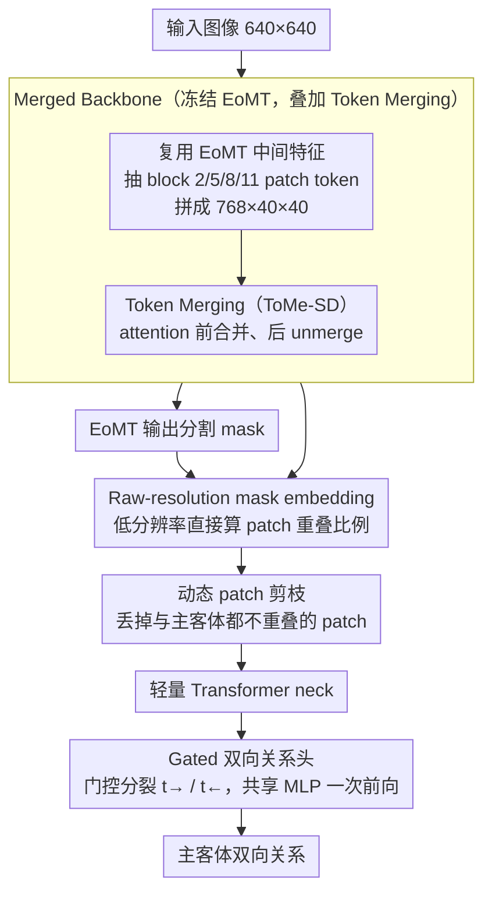

# DSFlash: Comprehensive Panoptic Scene Graph Generation in Realtime

**会议**: CVPR 2026  
**arXiv**: [2603.10538](https://arxiv.org/abs/2603.10538)  
**代码**: 待确认（作者声明 acceptance 后公开）  
**领域**: 场景图生成 / 视觉场景理解  
**关键词**: panoptic scene graph generation, real-time inference, bidirectional relation prediction, token pruning, low-latency  

## 一句话总结
DSFlash 通过合并分割与关系预测 backbone、双向关系预测头、动态 patch 剪枝等策略，将全景场景图生成速度提升至 RTX 3090 上 56 FPS，同时在 PSG 数据集上达到 mR@50=30.9 的 SOTA 性能。

## 背景与动机
场景图（Scene Graph）将图像结构化为节点（实例）和边（关系），在 VQA、推理、图像描述等任务中有广泛应用。现有 PSGG 方法几乎不关注延迟，一次推理往往数百毫秒，难以部署到边缘设备或实时系统。DSFormer 虽达到 SOTA 性能但推理耗时 458 ms，且使用两个独立 backbone（MaskDINO + ResNet），资源浪费严重。本文的核心洞察是：两阶段方法可以通过共享 backbone 特征、减少前向次数、剪枝无关 token 等手段实现极低延迟，同时不损失甚至提升场景图质量。

## 核心问题
如何在不牺牲场景图质量的前提下，让全景场景图生成达到实时级别的推理速度？

## 方法详解

### 整体框架
DSFlash 要解决的是全景场景图生成（PSGG）几乎没人管延迟的问题——SOTA 的 DSFormer 一次推理 458 ms，还用了 MaskDINO + ResNet 两个独立 backbone，浪费严重。它的核心判断是：两阶段方法完全可以靠共享 backbone 特征、减少前向次数、剪掉无关 token 把延迟压到实时，而且不掉点。具体是第一阶段用冻结的 EoMT（Encoder-only Mask Transformer）分割模型提 mask 与特征，第二阶段直接复用 EoMT 的中间特征（从 block 2/5/8/11 抽 patch token 拼成 768×40×40），用 mask embedding 编码主客体位置，过一个轻量 Transformer neck 后由关系头一次前向输出双向关系；backbone 内部还叠了 ToMe-SD token merging 进一步压低注意力开销。

### 关键设计

**1. Merged Backbone：复用 EoMT 特征，砍掉一次 backbone 前向**

两阶段方法的最大浪费是分割和关系预测各用一个 backbone。DSFlash 不再单独跑关系 backbone，而是把已经为出分割 mask 而运行的 EoMT 拿来兼用——从它的 block 2/5/8/11（L 版为 5/11/17/23）抽 patch token，沿通道维拼成 768×40×40 的特征张量直接喂给后续模块，省掉一整次 backbone 前向；同时用 EoMT 替换又慢又重的 MaskDINO，分割质量相当但延迟低得多。EoMT 全程冻结，训练只训 neck 和 head，单张 GTX 1080 不到 24 小时就能训完，分割训练也可彻底外包到更大数据集上。

**2. Raw-resolution Masks：低分辨率直接算重叠，省掉插值往返**

mask 要"贴"进 patch token，靠的是每个 patch 被主客体 mask 覆盖的面积比例。DSFormer 的做法是把 EoMT 输出的 160×160 mask logits 双线性上采样到原图分辨率再算覆盖比例，插值很贵。DSFlash 注意到最终只需要 13×13 的 patch 粒度，于是干脆在低分辨率上直接算重叠比例，省掉这一次昂贵的上采样。

**3. Mask-based Dynamic Patch Pruning：零开销剪掉无关 token**

进 neck 的 patch token 越多越慢。与主客体 mask 都不重叠的 patch 拿不到上面那个覆盖比例 embedding，对判定这对实例的关系几乎没贡献。DSFlash 在 mask embedding 阶段顺手把这些零重叠 patch 丢掉再送进 neck；由于重叠比例本来就要算，识别该剪的 patch 几乎零额外开销。又因为最终预测只看 classification token，neck 能吃变长的 token 序列。

**4. Gated Bidirectional Prediction：一次前向出双向关系**

一对 mask $(S_0, S_1)$ 之间的关系有方向，原 DSFormer 要跑两次前向分别预测 $S_0 \to S_1$ 和 $S_1 \to S_0$（因为 mask embedding 不对称，正反顺序得各编码一次）。DSFlash 把编码特征 $x$ 经 sigmoid 门控 $g$ 分裂成 $t_\to = g \odot x$ 和 $t_\leftarrow = (1-g) \odot x$ 两支（借鉴 GRU 门控），再过同一个共享 MLP 关系头分别出两个方向，一次前向拿到双向预测、参数量几乎不变。为防止模型偷懒利用"PSG 里正向标注是反向 3 倍"这种数据偏置，训练时额外翻转 mask 顺序做第二次前向，用 MSE consistency loss（Eq. 7）约束翻转后中间特征互换（$z_\to = z'_\leftarrow$），逼模型对输入顺序等变；这份额外监督还顺带把 mR@50 从 25.0 提到 28.8。

**5. Token Merging（ToMe-SD）：给老 GPU 再省一刀**

这是一项叠加在 backbone 上的正交优化：在每个 attention 层之前用 ToMe-SD 合并相似 token、attention 之后再 unmerge 还原，降低注意力计算量；选 ToMe-SD 而非原版 ToMe，是因为它会把 token 解合并回来，更好地保住 backbone 的分割能力。这一招在老旧 GPU 上尤其明显——GTX 1080 上延迟从 230 ms 降到 173 ms。

### 损失函数 / 训练策略
- 关系分类：Binary Cross Entropy
- 双向一致性：MSE consistency loss（Eq. 7），约束翻转输入后中间特征应交换
- DeiT III 风格数据增强（随机翻转、颜色抖动、灰度/模糊/solarization 三选一）
- AdamW，lr=1e-5，cosine schedule + warmup，梯度裁剪 norm≤1，训练 20 epoch
- 每 5 个正样本采 1 个负样本

## 实验关键数据

| 方法 | mR@50 | 延迟 (ms) | 参数量 |
|------|-------|-----------|--------|
| DSFormer | 30.70 | 458 | 330M |
| REACT | 19.00 | 19 | 43M |
| HiLo-L | 19.08 | 427 | 230M |
| **DSFlash-L** | **30.90** | 50 | 340M |
| DSFlash-B* | 28.50 | 23 | 116M |
| DSFlash-S* | 25.05 | **18** | **40M** |

- DSFlash-L 在 mR@50 上超越 DSFormer（30.9 vs 30.7），延迟仅为其 1/9
- DSFlash-S* 仅 40M 参数、18ms 延迟（56 FPS），性能仍优于 REACT 和 HiLo

### 消融实验要点
- 统一 backbone 将延迟从 458ms 降至 41ms（-91%），但 mR@50 从 30.7 降至 25.0
- 高效 mask embedding：延迟 37ms（-10%），mR@50 不变
- 门控双向预测：延迟 29ms（-22%），mR@50 从 25.0 提至 28.8（额外监督信号带来性能提升）
- 跳过 mask 上采样：延迟 23ms（-21%），mR@50=28.5（轻微下降）
- mR@50 与分割模型的 Panoptic Quality 相关系数高达 0.99

## 亮点
- 实现了首个真正实时的全景场景图生成系统，GTX 1080 上也能以 ~6 FPS 运行
- 双向关系预测设计精巧，通过一次前向同时输出两个方向，还借助 consistency loss 提升质量
- 整体设计简洁实用：冻结 backbone + 轻量 neck + 共享 head，训练成本极低
- 对评估协议的严谨态度值得肯定：严格遵循 SingleMPO 避免多 mask 膨胀 R@k

## 局限与展望
- Backbone 冻结意味着关系预测无法反向影响特征提取，可能限制上限
- PSG 数据集偏小（49k 图像），在更大数据集上的表现未知
- 低分辨率 mask 对小目标的分割精度可能不足
- 双向预测共享 MLP head，可能在谓词方向性强的关系上有信息混淆
- 作者提到主客体混淆是常见失败模式，可考虑对比学习解决

## 与相关工作的对比
- vs DSFormer：继承其 mask embedding 和 strictly decoupled 思想，但通过 backbone 合并和双向预测将延迟降低 9×
- vs REACT：REACT 用 YOLOv8 做 bbox 检测而非全景分割，DSFlash 在 PSGG 设定下性能高出 12 个 mR@50 点
- vs HiLo：一阶段方法，性能（19.08 mR@50）远逊于 DSFlash，延迟也更高

## 启发与关联
- 冻结 backbone + 复用中间特征的思路可以推广到其他两阶段视觉任务
- 双向预测 + consistency loss 的设计思路可借鉴到检测中的方向关系建模
- 动态 patch 剪枝利用任务先验（mask 覆盖）实现零开销加速，适用于类似的 mask-conditioned 架构

## 评分
- 新颖性: ⭐⭐⭐⭐ 双向预测和 mask-based 剪枝在 PSGG 中是新的，系统级优化很到位
- 实验充分度: ⭐⭐⭐⭐ 多 GPU 延迟评估、详尽消融、公平评估协议
- 写作质量: ⭐⭐⭐⭐ 结构清晰，图表丰富，对评估问题的讨论很有价值
- 价值: ⭐⭐⭐⭐ 将 PSGG 带入实时领域，实用性强，对资源受限场景特别有意义

<!-- RELATED:START -->

## 相关论文

- [\[CVPR 2025\] Learning 4D Panoptic Scene Graph Generation from Rich 2D Visual Scene](../../CVPR2025/segmentation/learning_4d_panoptic_scene_graph_generation_from_rich_2d_visual_scene.md)
- [\[ECCV 2024\] OpenPSG: Open-set Panoptic Scene Graph Generation via Large Multimodal Models](../../ECCV2024/segmentation/openpsg_open-set_panoptic_scene_graph_generation_via_large_multimodal_models.md)
- [\[ICCV 2025\] SPADE: Spatial-Aware Denoising Network for Open-vocabulary Panoptic Scene Graph Generation](../../ICCV2025/segmentation/spade_spatial-aware_denoising_network_for_open-vocabulary_panoptic_scene_graph_g.md)
- [\[CVPR 2026\] GenMask: Adapting DiT for Segmentation via Direct Mask Generation](genmask_adapting_dit_for_segmentation_via_direct_mask_generation.md)
- [\[CVPR 2026\] CA-LoRA: Concept-Aware LoRA for Domain-Aligned Segmentation Dataset Generation](ca-lora_concept-aware_lora_for_domain-aligned_segmentation_dataset_generation.md)

<!-- RELATED:END -->
