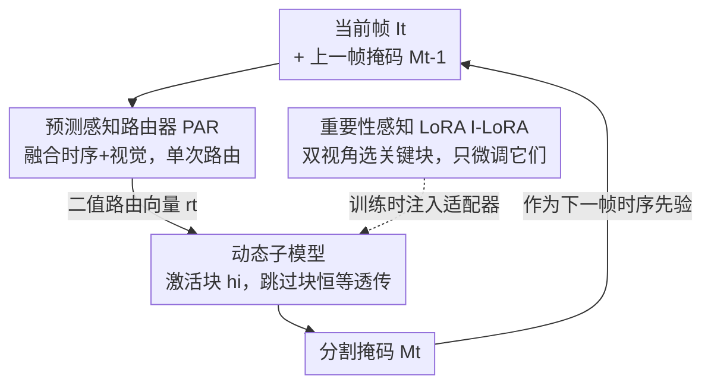

# Efficient Video Object Segmentation and Tracking with Recurrent Dynamic Submodel

**会议**: CVPR 2026  
**论文**: [CVF Open Access](https://openaccess.thecvf.com/content/CVPR2026/html/Tang_Efficient_Video_Object_Segmentation_and_Tracking_with_Recurrent_Dynamic_Submodel_CVPR_2026_paper.html)  
**代码**: 待确认  
**领域**: 视频目标分割  
**关键词**: 视频目标分割, 动态网络, SAM2加速, 块跳过, LoRA微调  

## 一句话总结
针对 SAM2 这类视频分割大模型推理太慢的问题，本文用一个"预测感知路由器"（吃上一帧分割掩码 + 当前帧视觉特征）为每一帧只激活一个子模型块集合，再用"重要性感知 LoRA"只微调最关键的块，在 DAVIS 2017 上实现 1.3× 真实加速、性能仅掉 <0.4%，且只训练 3% 参数。

## 研究背景与动机
**领域现状**：视频目标分割与跟踪（VOST）的 SOTA 越来越依赖 SAM2 这类视觉基础模型——它们零样本泛化强、跟踪稳，但计算开销巨大，难以在资源受限场景实时部署。

**现有痛点**：为了减负，已有两条路都走不通。第一条是**静态剪枝**（SlimSAM、PBD），一次性砍掉固定通道或块，对所有帧一视同仁；但视频里不同任务、不同片段、甚至不同帧偏好的"关键块"是不一样的——论文图 1(a) 显示，两个剪枝率相同的静态模型整体精度接近，逐帧表现却差异巨大，说明"一刀切"必然在某些帧上踩雷。第二条是**动态网络**（AdaViT、DyT），为每个块配一个轻量路由器、根据中间特征决定是否激活；理论 FLOPs 是降下来了，但每块都要算一次路由，这些路由开销叠加起来反而让实际推理更慢（图 1(b)：理论省了、实测却变慢）。

**核心矛盾**：静态法忽略了视频的时序异质性，动态法的"密集路由"（dense routing，每个中间阶段都配路由器）把理论加速吃光了。更深一层，两类方法的剪枝准则 / 路由特征都是从图像模型搬来的，把视频当成"一堆独立图像"，**完全没用上相邻帧之间的时序相关性**——而 SAM2 本身的记忆机制恰恰说明"上一帧的预测是当前帧的强先验"。

**本文目标**：(1) 让块的选择随帧自适应，但路由开销要小到能换来真实加速；(2) 把时序先验显式喂给路由决策；(3) 适配这个动态架构时尽量少训练参数。

**切入角度**：作者观察到 SAM2 的分割是条件在历史帧记忆上的（$M_t = D(E(I_t, M_{t-1}))$），上一帧的掩码 $M_{t-1}$ 天然指明了"目标在哪、长什么样"，是免费的时序路由信号；同时块的重要性其实是不均匀的，存在一个跨样本普遍更重要的"核心块子集"。

**核心 idea**：**用单个"预测感知路由器"替代每块一个的密集路由器**——它融合上一帧掩码与当前帧特征，一次性输出整个模型的块激活方案；再用重要性感知 LoRA 只在核心块上注入可训练参数，把动态架构的适配成本也压到最低。

## 方法详解

### 整体框架
RDS（Recurrent Dynamic Submodel）在冻结的 SAM2 编码器上加两个轻量组件。推理时，对每一帧 $I_t$：先把当前帧 patch 嵌入 $X_t$ 与上一帧分割掩码 $M_{t-1}$ 融合成时序-视觉联合特征 $Y_t$，送进一个**单一**预测感知路由器 PAR，输出一个长度为 $L$（SAM2 有 $L=48$ 个编码块）的二值路由向量，决定这一帧激活哪些块、跳过哪些块——被跳过的块直接用恒等映射透传特征。这样每帧实际只跑一个"子模型"，且因为只算一次路由，省下的 FLOPs 能真正转化为墙钟加速。训练侧则配一个**重要性感知 LoRA（I-LoRA）**：先离线找出全模型里最关键的一批块，只给这些块注入 LoRA 适配器，连同路由器一起联合微调，其余权重全冻。

整体是"单路由器选块 → 子模型前向 → 输出掩码反过来当下一帧路由先验"的循环结构，故名 *Recurrent* Dynamic Submodel。

### 关键设计

**1. 预测感知路由器（PAR）：把上一帧掩码当时序先验，用单个路由器一次定全模型**

针对的痛点是动态法"每块一个路由器"的开销吃光加速、以及所有方法都无视时序先验。PAR 的输入是两路：当前帧 patch 嵌入 $X_t \in \mathbb{R}^{H\times W\times C}$ 和上一帧二值掩码 $M_{t-1} \in \{0,1\}^{H\times W\times 1}$，先用两个不同卷积分别处理再加权融合：

$$Y_t = F(X_t, M_{t-1}) = \alpha \cdot f(M_{t-1}) + g(X_t)$$

其中 $\alpha$ 是可学习标量，$f$、$g$ 是对齐维度并抽取信息的卷积。融合特征 $Y_t$ 经过"卷积 + 平均池化 + 线性投影"组成的路由器 $\phi$，得到原始 logits $l_t \in \mathbb{R}^L$，即 $l_t = \phi(Y_t)$。

为了让离散的"激活/跳过"决策能端到端训练，作者用 Straight-Through Estimator（STE）配 Bernoulli 采样。logits 先过 sigmoid，再用目标激活比 $\beta\in(0,1]$ 做归一化，得到每个块的连续激活概率：

$$\tilde{w}^i_t = \min\!\left(\frac{\beta \cdot L \cdot \sigma(l^i_t)}{\sum_{j=1}^{L}\sigma(l^j_t)},\ 1.0\right)$$

这个归一化的妙处在于——它在数学上**天然把期望激活块数约束到约 $\beta L$ 个**，所以训练时只要固定 $\beta$ 就能严格控制目标算力，**不需要**传统动态网络那种难调的稀疏惩罚 loss。此外有一小撮"关键块集合 $K$"无论路由器怎么判都永久保活，以保证基础特征抽取和稳定性；其余块的二值决策 $r^i_t$ 由 $\text{Bernoulli}(\tilde{w}^i_t)$ 采样：

$$r^i_t = \begin{cases} 1, & i \in K \\ \tilde{r}^i_t \sim \text{Bernoulli}(\tilde{w}^i_t), & \text{否则} \end{cases}$$

第 $i$ 块的特征传播则是激活就过块、跳过就恒等透传：$X^{i+1}_t = r^i_t \cdot h_i(X^i_t) + (1-r^i_t)\cdot X^i_t$。反向传播时把离散采样近似成恒等（$\partial \mathcal{L}/\partial \tilde{w}^i_t \approx \partial \mathcal{L}/\partial r^i_t$）。和旧法的本质区别：**整模型只算一次路由**，把路由延迟从密集路由的 ~17.2 ms 砍到 ~0.5 ms（见表 4），这才是"理论省 = 实际快"的关键。

**2. 重要性感知 LoRA（I-LoRA）：双视角找核心块，只给它们注入适配器**

针对的痛点是适配这个动态架构如果全量微调或给所有块加 LoRA，训练成本仍然高。作者的观察是：动态激活本身就揭示了"块的重要性不均匀，存在跨样本更关键的核心子集"，那干脆只微调这些核心块。重要性从两个互补视角度量：

- **全局重要性** $I^i_G$：衡量去掉该块对最终输出 J&F 分数的影响，$I^i_G = \mathbb{E}[\text{J\&F}(O) - \text{J\&F}(O^i)]$，其中 $O$、$O^i$ 是带/不带第 $i$ 块的输出，越大说明这块对结果越关键。
- **局部重要性** $I^i_L$：衡量该块对特征的"改造量"，用输入输出特征的余弦相似度反向定义，$I^i_L = 1 - \mathbb{E}\!\left[\frac{\langle X^i, X^{i+1}\rangle}{\|X^i\|\cdot\|X^{i+1}\|}\right]$；相似度越低说明这块做了越显著的变换、越在干"实活"。

然后对全局/局部各自降序排名 $r_G(i)$、$r_L(i)$，用排名聚合 $s(i) = -(r_G(i)+r_L(i))$ 选块，最终微调块集合 $H = K \cup \text{TopIdx}_{K_{sel}-|K|}(s)$。对 $H$ 里的每个块，在 MHSA 的 $W_Q,W_K,W_V,W_O$ 和 MLP 的 $W_U,W_D$ 全部投影矩阵上注入 LoRA（$W' = W_0 + BA$，$B\in\mathbb{R}^{d\times r}, A\in\mathbb{R}^{r\times k}, r\ll\min(d,k)$），只训这些适配器 + 路由器，其余冻结。这一设计和 PAR 互补：PAR 让推理变快，I-LoRA 让"教会动态架构"这件事也变便宜。消融（表 7）证明全局或局部单用都次优，双视角组合最好。

**3. 两阶段训练 + 随机/确定双评估：用归一化概率替代稀疏惩罚**

训练分两步：(i) **I-LoRA 识别**——切出训练集一小部分，用原始 SAM2 主干跑推理，按上面的双视角重要性定位核心块并插入 LoRA；(ii) **动态组件微调**——联合微调路由器和 LoRA 适配器。关键点是前面 $\tilde{w}^i_t$ 的归一化已经内在地把激活率约束到约 $\beta$，所以训练时固定 $\beta$ 就能精确控目标复杂度，省掉了传统动态法那套敏感的稀疏惩罚项。推理默认用**随机评估**（$i\notin K$ 时按 $\text{Bernoulli}(\tilde{w}^i_t)$ 采样，更贴合训练目标）；为确定性部署则改用阈值化（$\tilde{w}^i_t \ge \tau$ 则激活，默认 $\tau=0.5$，在验证集标定），把它当作部署近似。

## 实验关键数据

### 主实验
在 SAM2 主干上对比四类主流加速策略（静态剪枝 SlimSAM/PBD、动态 token 剪枝 DyT、动态块跳过 AdaViT），DAVIS 2017：

| 方法 | 可训练参数(M) | 训练集占比 | FLOPs(G)↓ | FPS↑ | J&F↑ |
|------|------|------|------|------|------|
| SAM2（原始） | 224 | 100% | 819 | 29.8 | 90.0 |
| SlimSAM | 147 | >5% | 547 | 33.4 | 87.8 |
| PBD | 7.6 | <0.03% | 500 | 39.8 | 85.6 |
| DyT | 20.5 | <0.03% | 629 | 22.3 | 90.2 |
| AdaViT | 9.6 | <0.03% | 528 | 26.3 | 88.3 |
| **RDS（本文）** | **7.6** | **<0.03%** | **500** | **38.2** | **89.6** |

关键看点：DyT 虽然 J&F 最高（90.2），但 FPS 只有 22.3——比原始 SAM2 还慢，正是密集路由开销吃光了加速；RDS 用最少的可训练参数（7.6M，仅 3%）和极少训练数据，把 FPS 提到 38.2（1.3× 加速），J&F 仅掉 0.4，落在性能-速度的 Pareto 前沿。

跨模型迁移（只在 DAVIS 2017 上微调动态组件，直接插到 SAMURAI/SAM2Long/SAM2 上）：

| 模型 | 配置 | DAVIS J&F | SA-V G | YTVOS | FPS |
|------|------|------|------|------|------|
| SAM2 | 原始 | 90.0 | 78.5 | 88.5 | 29.8 |
| SAM2 | w/ RDS₀.₆ | 89.6 | 74.3 | 86.0 | 38.2 (1.3×) |
| SAM2 | w/ RDS₀.₅ | 87.6 | 70.1 | 85.2 | 41.5 (1.4×) |
| SAMURAI | 原始 | 90.1 | 78.8 | 88.3 | 28.5 |
| SAMURAI | w/ RDS₀.₆ | 90.1 | 74.7 | 85.6 | 35.7 (1.3×) |
| SAM2Long | 原始 | 90.2 | 81.0 | 88.4 | 15.8 |
| SAM2Long | w/ RDS₀.₆ | 90.0 | 76.8 | 86.7 | 18.4 (1.2×) |

无需任务专门重训，RDS 在三个模型上都能保住 DAVIS 精度并稳定提速，VOT 基准（表 2，SAMURAI on LaSOT/TrackingNet/GOT-10k）也呈同样趋势：RDS₀.₅ 把 FPS 推到 38.6（1.4×），AUC 仅小幅下降。

### 消融实验
| 配置 | 关键结果 | 说明 |
|------|---------|------|
| 单路由器 vs 密集路由 | 路由延迟 17.2ms → 0.5ms | 总延迟从 31.1ms 降到 14.5ms，真加速来源（表 4） |
| 路由器输入：图像 only | 受背景干扰物影响掉点 | 缺时序先验"看错目标"（图 7） |
| 路由器输入：掩码 only | 跟不上外观变化 | 缺当前视觉信息 |
| 路由器输入：融合（本文） | J&F 最佳 | 时序先验+视觉特征协同 |
| I-LoRA：local only | 88.7 | 单视角次优（表 7） |
| I-LoRA：global only(per-block) | 89.2 / ~3h | 精度高但慢 |
| I-LoRA：双视角(per-block) | **89.6** / ~3h | 完整版最优 |
| I-LoRA：双视角(block-group) | 89.4 / ~48min(4×) | 分组近似，4× 提速仅掉 0.2 |
| 路由器记忆 Mₜ₋₁ vs Mₜ₋₁..ₜ₋₄ | 89.6 vs 89.4 | 只用最近一帧掩码就够 |
| 运动鲁棒性 1× vs 6×下采样 | 89.6 vs 88.7 | ~4FPS 大帧间位移下仅掉 0.9 |

### 关键发现
- **真加速的命门是路由次数而非 FLOPs**：表 4 把延迟拆开看得很清楚——密集路由的块计算其实只要 13.9ms，但路由本身吃掉 17.2ms；单路由器把路由压到 0.5ms，这才让"理论省"兑现成"实测快"。DyT 在主表里 J&F 最高却 FPS 最低，正是反面教材。
- **时序先验既必要又"短记忆即可"**：图 7 显示图像 only 会被背景干扰物带偏、掩码 only 跟不上外观变化，融合才最好；而表 5 表明把历史掩码从 $M_{t-1}$ 扩到 $M_{t-1}\cup\dots\cup M_{t-4}$ 几乎没增益——上一帧掩码已是足够的路由先验。
- **块激活与深度基本无关**（图 9）：激活是高度选择性的，并不偏向浅层或深层，佐证了"重要块是稀疏分布的核心子集"这一前提。

## 亮点与洞察
- **把"加速没兑现"的病根诊断到路由开销上**：很多动态网络论文止步于报 FLOPs，本文直接拿墙钟延迟拆账（表 4），并据此把"每块路由"改成"单次路由"，是少见的对"理论 vs 实际"差距动真格的设计。
- **归一化概率自带算力约束，省掉稀疏 loss**：$\tilde{w}^i_t$ 的归一化让期望激活块数 ≈ $\beta L$，固定 $\beta$ 即可控算力——把通常需要反复调权重的稀疏惩罚项变成一个直观超参，复现友好。
- **"上一帧预测当路由信号"是几乎零成本的时序利用**：SAM2 的记忆机制本就产出 $M_{t-1}$，拿来当路由先验不增加额外推理，思路可迁移到任何带掩码/框输出的视频任务的动态推理上。
- **双视角重要性 + 分组近似**：global（对输出的影响）补 local（对特征的改造量）的盲区，block-group 版再换来 4× 选块提速、精度只掉 0.2，是个实用的工程折中。

## 局限与展望
- 动态组件**只在 DAVIS 2017 上微调**，虽展示了向 SAMURAI/SAM2Long 的迁移，但更大规模数据上的微调收益作者自己也"邀请社区探索"，说明当前训练数据偏小。
- 表 3 可见 **SA-V 上的 G 指标掉得比 DAVIS 明显**（如 SAM2 78.5→74.3 @RDS₀.₆），在更长、更复杂的视频上跳块的代价不可忽视，论文主推的"<0.4% 掉点"主要成立于 DAVIS。⚠️ 跨数据集的掉点幅度差异较大，不宜只看 DAVIS 下结论。
- 永久保活块集合 $K$ 的选取、随机评估与确定性阈值评估之间的差距，论文给的细节有限；确定性部署的 $\tau$ 需在验证集标定，迁移到新域时的稳定性待验证。
- 改进方向：把时序先验从"上一帧掩码"扩展为更结构化的运动/记忆表示，或让 $\beta$ 在视频内随帧自适应（难帧多激活、易帧少激活），可能进一步逼近 Pareto 前沿。

## 相关工作与启发
- **vs 静态剪枝（SlimSAM / PBD）**：它们一次性砍固定结构、对所有帧一视同仁，无法应对逐帧偏好不同的关键块；RDS 每帧自适应选块，相同算力预算下精度更高（图 6），代价是引入路由器但开销极小。
- **vs 动态块跳过 / token 剪枝（AdaViT / DyT）**：它们用密集路由（每块/每阶段一个路由器），理论省 FLOPs 但路由开销让实测变慢甚至负加速；RDS 用单路由器一次定全模型，把路由延迟降两个量级，是"真加速"的关键差异。
- **vs 普通 LoRA / 全量微调**：标准 LoRA 给所有块加适配器、全量微调更贵；I-LoRA 只在双视角选出的核心块上注入适配器（图 8），训练时间和显存大幅下降，性能匹配甚至超过全量微调。
- **泛化性**：作者在 DINOv3 上的补充实验表明框架不绑定 SAM2，可推广到不同视觉基础模型。

## 评分
- 新颖性: ⭐⭐⭐⭐ 单路由器 + 时序掩码先验 + 双视角 I-LoRA 的组合切中"动态网络理论快、实际慢"的真痛点，思路扎实
- 实验充分度: ⭐⭐⭐⭐ VOS/VOT 多基准 + 跨模型迁移 + 丰富消融（路由延迟拆账、输入消融、运动鲁棒性），但主结论偏重 DAVIS
- 写作质量: ⭐⭐⭐⭐ 动机—机制—验证链条清晰，公式与图表配合到位
- 价值: ⭐⭐⭐⭐ 给 SAM2 系列做即插即用加速、训练成本极低，实际部署价值高

<!-- RELATED:START -->

## 相关论文

- [\[CVPR 2026\] InterRVOS: Interaction-Aware Referring Video Object Segmentation](interrvos_interaction-aware_referring_video_object_segmentation.md)
- [\[CVPR 2026\] SDDF: Specificity-Driven Dynamic Focusing for Open-Vocabulary Camouflaged Object Detection](sddf_specificity-driven_dynamic_focusing_for_open-vocabulary_camouflaged_object.md)
- [\[CVPR 2026\] RAVEN: Radar Adaptive Vision Encoders for Efficient Chirp-wise Object Detection and Segmentation](raven_radar_adaptive_vision_encoders_for_efficient_chirp-wise_object_detection_a.md)
- [\[CVPR 2026\] CaptionFormer: Unified Segmentation, Tracking, and Captioning for Spatio-Temporal Objects](captionformer_unified_segmentation_tracking_and_captioning_for_spatio-temporal_o.md)
- [\[CVPR 2026\] Reinforcing Video Object Segmentation to Think before it Segments](reinforcing_video_object_segmentation_to_think_before_it_segments.md)

<!-- RELATED:END -->
