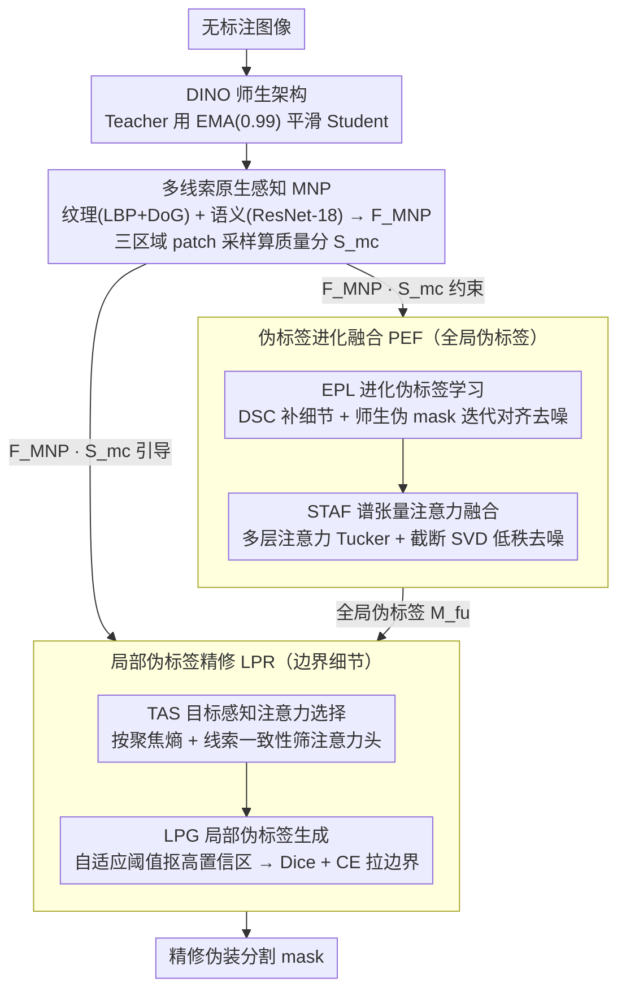

# EReCu: Pseudo-label Evolution Fusion and Refinement with Multi-Cue Learning for Unsupervised Camouflage Detection

**会议**: CVPR 2026  
**arXiv**: [2603.11521](https://arxiv.org/abs/2603.11521)  
**代码**: [GitHub](https://github.com/JSLiam94/EReCu)  
**领域**: 无监督伪装目标检测 / 图像分割  
**关键词**: unsupervised camouflaged object detection, pseudo-label evolution, multi-cue perception, teacher-student, spectral attention fusion

## 一句话总结

提出EReCu统一框架，在DINO师生架构上通过多线索原生感知（MNP）提取纹理+语义先验引导伪标签进化融合（PEF），结合局部伪标签精修（LPR）恢复边界细节，首次统一伪标签引导和特征学习两大UCOD范式，在4个COD数据集上全面SOTA。

## 研究背景与动机

**领域现状**：伪装目标检测（COD）因目标与背景高度相似而极具挑战。全监督方法依赖昂贵的像素级标注，限制数据集规模和生态多样性。无监督COD（UCOD）目前有两种范式：伪标签引导和特征学习。

**现有痛点**：

1. 伪标签引导范式（如UCOS-DA、UCOD-DPL）过度依赖高维嵌入而忽视原生图像线索，导致边界溢出和语义漂移
2. 特征学习范式（如SdalsNet、EASE）缺乏显式伪标签监督，产生模糊边界和细节丢失
3. 两种范式各有致命缺陷且尚未被统一——语义可靠性和纹理保真度被孤立优化

**核心矛盾**：伪标签引导解决"在哪里"但边界不准，特征学习解决"长什么样"但定位模糊——两者互补但现有方法无法同时利用。

**本文目标** 构建一个让伪标签可靠性和特征保真度通过互反馈环路协同进化的统一UCOD框架。

**切入角度**：从原始图像中提取多线索原生感知（纹理+语义），同时约束伪标签的语义进化和局部细节精修。

**核心 idea**：用原生图像线索同时驱动伪标签的全局进化和局部精修，实现语义-感知协同进化。

## 方法详解

### 整体框架

EReCu 想把 UCOD 的两条路线——"伪标签引导"擅长定位但边界糊，"特征学习"细节好但定位飘——拧成一个互相喂数据的闭环。整套系统挂在 DINO 的师生架构上：Teacher 用 EMA（动量 0.99）从 Student 缓慢平滑出一个稳定版本，Student 则一轮轮把分割 mask 越磨越细。

一张无标注图像进来后，先由 MNP 从**原始像素**而非高维嵌入里抠出纹理和语义两类原生线索，并算出一个衡量"mask 切得准不准"的质量分 $S_{\text{mc}}$；这个线索和质量分接着兵分两路，一路喂给 PEF 去驱动全局伪标签的进化融合，一路喂给 LPR 去修边界细节。PEF 内部又分两步——EPL 让师生分支在迭代里互相去噪、STAF 把多层注意力做谱融合压噪；LPR 则从 Teacher 的注意力头里挑出聚焦干净的那些，生成局部伪标签把边界补回来。MNP 同时约束这两路，使语义可靠性和纹理保真度在同一个回路里协同上升。

### 关键设计

**1. 多线索原生感知（MNP）：从原图纹理里找伪装的破绽**

前作的通病是只盯着 backbone 的高维嵌入做伪标签，可嵌入早就把"目标和背景长得像"这件事抹平了，于是边界溢出、语义漂移。MNP 反其道而行，回到原始图像上找线索：用 LBP + DoG 抽低层纹理特征 $F_{\text{text}}$，再用一个冻结的 ResNet-18 抽中层语义特征 $F_{\text{sem}}$，拼成 $F_{\text{MNP}} = \mathcal{C}(F_{\text{text}}, F_{\text{sem}})$。

光有特征还不够，关键是把它变成能监督 mask 质量的信号。MNP 按当前 mask 把图切成内部 $R_i$、边界 $R_s$、外部 $R_o$ 三个区域，在三者之间随机采 $K\times K$ 的 patch、跑 $N$ 轮，算修正余弦相似度并聚合成质量分

$$S_{\text{mc}} = (D_{\text{io}} + D_{\text{is}} + S_{\text{so}}) / 3$$

对应的约束损失就是 $\mathcal{L}_{\text{MNP}} = 1 - S_{\text{mc}}$。直觉是：哪怕伪装得再像，原图里内部和外部的纹理仍有细微但可区分的差异，逼着内/外低相似、内/边有过渡，就能把 mask 往真边界上拉；随机 patch 采样则是为了应对伪装目标形状不规则、固定网格采不准的问题。

**2. 伪标签进化融合（PEF）：让浅层细节和深层语义在迭代里互相纠错**

伪标签如果只取某一层的输出，要么有语义没细节、要么有细节没语义。PEF 用 EPL 和 STAF 两个机制解决这件事。EPL（进化伪标签学习）先把 Student 浅层特征过一层深度可分离卷积（DSC）补回空间细节得到 $M_s^{\text{dsc}}$，再让 Student、Teacher 两个分支各自语义池化出伪 mask $M_s^p$、$M_t^p$，然后迭代地把 $M_s^{\text{dsc}}$ 同时往两个伪 mask 上对齐、并叠加多线索约束：

$$M_s^{\text{dsc}(r+1)} = \arg\min\big[\mathcal{L}_D(M_s^{\text{dsc}}, M_s^p) + \mathcal{L}_D(M_s^{\text{dsc}}, M_t^p) + \mathcal{L}_{\text{MNP}}\big]$$

Dice 损失负责对齐、$\mathcal{L}_{\text{MNP}}$ 负责把进化方向锚在原生线索上，浅层细节和深层语义就在这一轮轮 $\arg\min$ 里互相去噪。

STAF（谱张量注意力融合）解决另一半问题：单层注意力图噪声大，简单加权又会糊掉结构。它把 Student 三个层级（1/3、2/3、最终层）的注意力图堆成三阶张量 $\mathcal{T}_s \in \mathbb{R}^{3 \times C \times HW}$，做 Tucker 分解加截断 SVD 只保留前 $t$ 个主谱成分，得到低秩近似 $A_s^{\text{fu}} = P_t \Sigma_t Q_t^\top$，再线性投影 + Sigmoid 输出融合预测 $M_s^{\text{fu}}$。低秩近似天然把高频注意力噪声当成次要成分丢掉，却保住了跨层共享的语义和结构，复杂度只有 $\mathcal{O}(r^2 d)$，比逐元素融合轻得多。

**3. 局部伪标签精修（LPR）：用注意力头的空间多样性把边界补回来**

全局伪标签擅长框住目标中心，却常把边界和纹理细节漏掉。LPR 的洞察是 Teacher 不同注意力头其实各看各的区域，这种空间多样性正好能用来做局部修补。它分 TAS 和 LPG 两步。TAS（目标感知注意力选择）先给 Teacher 每个头算一个聚焦熵 $E_k$，只留下既聚焦得够干净（$E_k < \tau_e$）、又和原生线索一致（$S_{\text{mc}}(\hat{A}_k, F_{\text{MNP}}) > \tau_s$）的头——两个阈值都可学习、初始 0.5，相当于自动筛掉发散或跑偏的注意力头。

LPG（局部伪标签生成）再对选中的每个头用自适应阈值 $\tau_k = \mu_{A_k} + \alpha \cdot \sigma_{A_k}$（$\alpha > 1$ 可学习）抠出高置信区域，拼成局部伪标签 $P_k$，用 Dice + CE 损失把前面 STAF 出的 $M_s^{\text{fu}}$ 往这些精细边界上拉。这样全局负责"在哪里"、局部负责"边在哪"，两级伪标签各司其职。

### 损失函数 / 训练策略

总损失 = EPL Dice损失（学生DSC mask与学生/教师伪mask对齐）+ $\mathcal{L}_{\text{MNP}}$（多线索约束）+ LPR Dice+CE损失（融合预测与局部伪标签对齐）。训练25 epoch，batch 32，AdamW + 余弦退火，AMP混合精度。Backbone：DINO-ViT-S/8。训练集：CAMO-Train（1000）+ COD10K-Train（3040），无标注。V100-SXM2 32GB。

## 实验关键数据

### 主实验

**UCOD方法对比（4个COD数据集）**

| 方法 | 类型 | CHAMELEON $S_m$↑ | CAMO $S_m$↑ | COD10K $S_m$↑ | NC4K $S_m$↑ |
|------|------|-----------|----------|-----------|----------|
| FOUND | UOS | .7161 | .6913 | .6783 | .7459 |
| UCOS-DA | UCOD | .6715 | .6581 | .6334 | .7189 |
| UCOD-DPL | UCOD | .7287 | .7013 | .7090 | .7538 |
| SdalsNet | UCOD | .7236 | .6971 | .6967 | .7386 |
| **EReCu** | **UCOD** | **.7321** | **.7027** | **.7221** | **.7583** |

### 消融实验

**模块组合消融（CAMO / COD10K $S_m$↑）**

| MNP | EPL | STAF | LPR | CAMO | COD10K |
|-----|-----|------|-----|------|--------|
| ✓ | ✓ | ✓ | ✓ | **.7027** | **.7221** |
| ✗ | ✓ | ✓ | ✓ | .6887 | .7111 |
| ✓ | ✗ | ✗ | ✓ | .6758 | .7038 |
| ✓ | ✓ | ✓ | ✗ | .6895 | .7109 |
| ✗ | ✗ | ✗ | ✗ | .6376 | .6400 |

### 关键发现

- 全模块组合在4个数据集的所有主要指标上均达到UCOD SOTA
- PEF（含EPL+STAF）贡献最大：移除后CAMO $S_m$ 下降2.69%（.7027→.6758）
- MNP + EPL组合获得最大互补增益，验证原生线索对伪标签进化的关键引导作用
- 单/双模块性能明显低于三/四模块联合，证实各模块强互补性
- DINO基线（无任何模块）：CAMO $S_m = .6376$，全模块提升+.0651

## 亮点与洞察

- 将伪标签引导和特征学习两种UCOD范式统一到协同进化框架，概念上简洁有力
- MNP的三区域（内/边/外）patch采样余弦度量 $S_{\text{mc}}$ 设计巧妙，可复用于其他无监督分割任务的mask质量评估
- STAF用Tucker分解+SVD对多层注意力做谱融合，轻量优雅（$\mathcal{O}(r^2d)$），是多尺度特征聚合的新方案
- TAS中注意力熵+多线索一致性的双条件选择机制，泛化性强

## 局限与展望

- 部分数据集/指标提升偏小（如CAMO $S_m$ 仅+.0014），在MAE指标上COD10K比UCOD-DPL持平
- 仅在DINO-ViT-S/8上验证，未探索DINOv2或更大scale backbone
- MNP中纹理描述子（LBP, DoG）为手工设计，可探索学习化替代
- 多路损失+Tucker/SVD+EMA的训练开销不小
- 未讨论多实例伪装场景的处理能力

## 相关工作与启发

- **vs UCOD-DPL**：同为师生动态伪标签，UCOD-DPL忽略原生图像线索致边界溢出，EReCu引入MNP提供原生感知引导 + STAF替代简单加权聚合
- **vs SdalsNet**：自蒸馏注意力位移做前背景分离但缺乏伪标签监督致细节模糊，EReCu兼具双重优势
- **vs FOUND**：FOUND用背景优先范式推断前景，但粗粒度边界不适合高相似度伪装场景
- **启发**：$S_{\text{mc}}$ 度量可用于主动学习中估计无标注样本的mask质量；伪标签进化+原生线索引导范式可迁移到无监督显著性检测和医学图像分割

## 评分

- 新颖性: ⭐⭐⭐⭐ 统一两种UCOD范式的思路好，各模块设计有亮点，但组合感较强
- 实验充分度: ⭐⭐⭐⭐ 4个数据集+完整消融+可视化+开源代码，部分提升偏小
- 写作质量: ⭐⭐⭐⭐ 框架图清晰，公式完整，逻辑连贯
- 价值: ⭐⭐⭐⭐ UCOD方向SOTA且开源，$S_{\text{mc}}$ 度量和STAF融合方案可复用

<!-- RELATED:START -->

## 相关论文

- [\[ECCV 2024\] Learning Camouflaged Object Detection from Noisy Pseudo Label](../../ECCV2024/segmentation/learning_camouflaged_object_detection_from_noisy_pseudo_label.md)
- [\[CVPR 2026\] FCL-COD: Weakly Supervised Camouflaged Object Detection with Frequency-aware and Contrastive Learning](fcl-cod_weakly_supervised_camouflaged_object_detection_with_frequency-aware_and_.md)
- [\[CVPR 2026\] Love Me, Love My Label: Rethinking the Role of Labels in Prompt Retrieval for Visual In-Context Learning](love_me_love_my_label_rethinking_the_role_of_labels_in_prompt_retrieval_for_visu.md)
- [\[AAAI 2026\] Guideline-Consistent Segmentation via Multi-Agent Refinement](../../AAAI2026/segmentation/guideline-consistent_segmentation_via_multi-agent_refinement.md)
- [\[NeurIPS 2025\] Towards Robust Pseudo-Label Learning in Semantic Segmentation: An Encoding Perspective](../../NeurIPS2025/segmentation/towards_robust_pseudo-label_learning_in_semantic_segmentation_an_encoding_perspe.md)

<!-- RELATED:END -->
