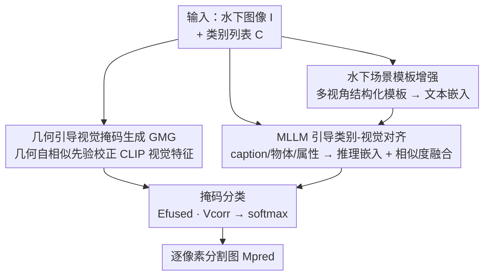

# Exploring the Underwater World Segmentation without Extra Training

**会议**: CVPR 2026  
**论文**: [CVF Open Access](https://openaccess.thecvf.com/content/CVPR2026/html/Li_Exploring_the_Underwater_World_Segmentation_without_Extra_Training_CVPR_2026_paper.html)  
**代码**: https://github.com/LiBingyu01/Earth2Ocean  
**领域**: 语义分割 / 开放词汇分割  
**关键词**: 水下分割, 开放词汇, training-free, CLIP, MLLM 推理  

## 一句话总结
针对水下场景缺数据、缺模型的困境，本文一方面造了首个细粒度水下开放词汇分割数据集与基准（AquaOV255 / UOVSBench），另一方面提出 training-free 框架 Earth2Ocean——用几何自相似先验修正 CLIP 视觉特征、再用 MLLM 推理增强文本嵌入，无需任何水下训练就把陆地 VLM 迁到水下，平均 mIoU 提升 6+。

## 研究背景与动机
**领域现状**：水下生物（鱼、珊瑚、无脊椎动物等）的分割对生态监测、生物多样性评估很重要，但现有分割数据集和模型几乎都是为陆地 / 通用场景做的。水下方向要么数据集类别极少（USIS10K 只有 10 类，很多基准干脆把所有水生生物统一标成"fish"），要么模型是闭集训练、依赖在少量类别上做大量预训练，pipeline 又重又只能认预定义类。

**现有痛点**：把陆地预训练的视觉-语言模型（CLIP、BLIP）直接搬到水下会同时撞上两堵墙。其一是**视觉特征墙**：水下成像有颜色衰减、光散射、低能见度、纹理模糊，CLIP 末层视觉特征本就偏全局、空间局部性差，到水下更不可靠，分割掩码很糊。其二是**语义对齐墙**：CLIP / BLIP 在陆地上 zero-shot 识别很强，但分不清视觉上相近的水下物种（论文 Fig.5 显示 MLLM 在 USIS16K / AquaOV255 / MAS3K 上的分类准确率比 CLIP 各 backbone 高一大截），文本嵌入和水下视觉特征之间存在系统性错位。

**核心矛盾**：要"开放词汇 + 实用"，就不能为每个水下场景重新训练（成本高、类别被锁死）；但不训练的话，陆地 VLM 的视觉特征和语义对齐又都不适配水下。

**本文目标**：(1) 补上细粒度、多类别的水下分割数据与统一基准；(2) 做一个**完全 training-free** 的框架，把陆地 VLM 直接迁到水下而不需任何额外水下训练。

**切入角度**：作者观察到水下成像虽然颜色 / 纹理退化严重，但**几何结构信息相对稳定**（论文 Fig.7/8a 验证），所以可以用一个几何编码器（geometric-DINO）的自相似图当作"空间结构先验"去校正 CLIP 视觉特征；同时**MLLM 比 VLM 更会看水下图**，可以把它的推理结果（caption / 物体 / 属性）注入文本嵌入来补语义对齐。

**核心 idea**：用"几何先验校正视觉 + MLLM 推理增强文本"这两个 training-free 模块，分别堵住视觉特征墙和语义对齐墙，零训练把陆地 VLM 变成水下分割器。

## 方法详解

### 整体框架
给定输入图像 $I \in \mathbb{R}^{H\times W\times 3}$ 和一组文本类别 $C=\{c_1,\dots,c_T\}$，目标是输出稠密分割图 $M_{pred}\in\mathbb{R}^{T\times H\times W}$，给每个像素分配最语义兼容的类别。整个 Earth2Ocean 是一条**双分支并行、末端融合**的 training-free 流水线：视觉侧由 **GMG** 把 CLIP 末层视觉特征用几何自相似先验校正成更局部、更贴合水下结构的视觉特征 $V_{corr}$；文本侧由 **CSA** 把类别列表先经"水下场景模板"扩展、再用"MLLM 推理嵌入"做相似度引导融合，得到富含水下语义、与视觉对齐的文本特征 $E_{fused}$；最后 **Mask Classification** 把两者做通道维线性投影 + softmax 得到逐像素预测。三个模块全程参数冻结，没有任何水下训练。

### 关键设计

**1. 几何引导视觉掩码生成（GMG）：用稳定的几何自相似先验救回退化的水下视觉特征**

这一块针对"视觉特征墙"。CLIP 末层视觉嵌入偏全局，水下成像退化又让它更糊，直接拿来分割边界很乱。GMG 的关键洞察是：水下颜色 / 纹理退化严重，但**几何结构相对稳定**，所以用一个几何编码器（geometric-DINO）的特征做"空间先验"去校正 CLIP。具体地，先取 CLIP 前 $L-1$ 层得到视觉嵌入 $V=\text{CLIP}_{1:L-1}(I)\in\mathbb{R}^{N\times C}$（$N=H\cdot W$）；几何编码器输出多尺度几何特征，取最后一层（最抽象、语义最丰富，论文 Fig.6 验证）$G_{L_g}$，reshape 成 $\hat G$ 后算几何相似度图：

$$S = \hat{G}^\top \hat{G} \in \mathbb{R}^{(H_gW_g)\times(H_gW_g)}$$

再做去均值、缩放、阈值化来强化判别区域、压掉弱相关，转成几何引导的注意力：

$$\tilde S = \gamma(S - \beta\bar S),\qquad \tilde S_{ij}=\begin{cases}\tilde S_{ij}, & \tilde S_{ij}\ge 0\\ -\infty, & \tilde S_{ij}<0\end{cases},\qquad A=\text{Softmax}(\tilde S)$$

其中 $\bar S$ 是 $S$ 所有元素的均值，$\beta$（默认 1.2）控制中心化、$\gamma$（默认 3.0）控制缩放。把 CLIP 视觉嵌入插值成 $V'$ 对齐几何图分辨率后，用这个注意力做校正：$V_{corr}=A\cdot V'$。等于让稳定的几何结构去给不稳定的语义视觉特征"重新分配空间注意力"，掩码因此更贴合水下物体的真实结构。注意这里负值被置 $-\infty$ 再 softmax，相当于把弱 / 负相关位置直接屏蔽，只让结构上确实相关的区域互相增强。

**2. 水下场景模板增强（CSA-模板）：用结构化多视角模板把"这是水下"的环境语义注进文本嵌入**

这是 CSA 的前半部分，针对"语义对齐墙"里的**场景上下文缺失**。普通 OVS 用 "a photo of {category}" 这种陆地味模板，完全没告诉模型"目标在水下"。作者设计了一套结构化模板，从**物体外观、场景上下文、环境条件、交互关系、尺度变化**等多个方面增强语义，每个类别生成 $T$ 个模板，动态地把目标类别填进去，编码得到水下感知文本嵌入 $E_t^1\in\mathbb{R}^{T\times N\times C}$，再对所有模板取平均得到每类一条的表示 $E_t\in\mathbb{R}^{T\times C}$。直白说就是用多视角的"水下化"提示词替掉单一陆地模板，让文本侧先带上低光照、水体环境这些先验，再去和视觉匹配——这一步是纯文本侧、零成本的语义补丁。

**3. MLLM 引导类别-视觉对齐（CSA-推理 + 相似度融合）：让 MLLM 看图说话，把实例级属性语义对齐回文本嵌入**

模板增强补了"场景"，但没解决"类别语义和视觉特征错位"——CLIP / BLIP 分不清长得像的水下物种。作者引入 MLLM 推理：给定输入图，提示 MLLM 输出 (1) 简短 caption、(2) 从类别集里挑出的物体列表、(3) 每个物体的属性（颜色 / 形状 / 大小）。例如对斑马鱼会产出 `{"Objects":["Zebrafish"], "Attributes":{"Zebrafish":["silver","striped","small"]}}`。把物体+属性套进模板 "A photo of {Objects} that have attributes {Attributes} underwater."，用 CLIP 文本编码器编成**推理感知嵌入** $E_r\in\mathbb{R}^{1\times C}$，它携带了实例级、富属性、领域相关的语义。

然后用**相似度引导融合**把 $E_r$ 注回模板嵌入 $E_t$：两者先 L2 归一化，算余弦相似度 $s=E_t^{norm}\cdot {E_r^{norm}}^\top\in\mathbb{R}^{T\times 1}$，再按相似度定权重并阈值过滤：

$$w=\min(s, w_{max})\odot(s\ge\tau)$$

最后一步矩阵运算得到融合嵌入：

$$E_{fused}=\frac{E_t+w\cdot E_r}{\lVert E_t+w\cdot E_r\rVert_2}$$

其中 $w_{max}$（默认 0.5）封顶单条推理嵌入的贡献、$\tau$（默认 0.5，消融里 0.1 最优）过滤掉相似度太低的类别——只有和当前图像推理语义确实相关的类别才被增强，避免把无关类别也"对齐"过去。这样得到的文本嵌入既有水下场景模板的通用语义、又有 MLLM 给的实例级属性，零训练就显著拉近了文本-视觉匹配。

> ⚠️ 论文将 MLLM 推理信息预先编码成 JSON 并在 init 阶段离线注入 CLIP 文本编码器，所以推理时无需实时跑 MLLM，端到端速度仍快——这是它能"既准又快"的工程关键。

### 损失函数 / 训练策略
**无训练**。整条流水线参数全部冻结（CLIP 视觉/文本编码器、几何编码器、MLLM 都不微调），不引入任何可学习参数、不在水下数据上训练。最终掩码由融合文本特征与校正视觉特征的线性投影 + softmax 直接得到：$M=E_{fused}\cdot V_{corr}^\top$，$M_{pred}=\text{softmax}(M)$。默认超参 $\beta=1.2,\gamma=3.0,w_{max}=0.5,\tau=0.5$，全部实验在单张 RTX 4090 上完成，基于 MMSegmentation。

## 实验关键数据

### 主实验
在 UOVSBench（6 个水下数据集：DUT-USEG / MAS3K / SUIM / USIS10K / USIS16K / AquaOV255）上对比此前 training-free OVS 方法，三种 backbone 全部刷新 SOTA。下表取 6 数据集**平均 mIoU**（aAcc/mAcc 同步领先）：

| Backbone | 指标 | 之前最佳 | Earth2Ocean | 提升 |
|----------|------|----------|-------------|------|
| ViT-B/16 | 平均 mIoU | 29.56 (CorrCLIP) | **34.32** | +4.76 |
| ViT-L/14 | 平均 mIoU | 37.33 (CorrCLIP) | **44.00** | +6.67 |
| ViT-H/14 | 平均 mIoU | 41.26 (CorrCLIP) | **49.67** | +8.41 |
| ViT-H/14 | 平均 aAcc | 61.75 | **68.17** | +6.42 |
| ViT-H/14 | 平均 mAcc | 55.98 | **64.89** | +8.91 |

可以看到 backbone 越大增益越明显（B/16 +4.76 → H/14 +8.41），说明该框架能更好地榨取更强视觉表示的价值。在单数据集上提升尤其大，例如 ViT-L/14 在 USIS16K 上 mIoU 从 32.13（Trident）跳到 45.13。

### 消融实验
组件消融（6 数据集平均，ViT-B/16）逐步叠加，每个模块都正向贡献：

| 配置 | aAcc | mIoU | mAcc | 说明 |
|------|------|------|------|------|
| Baseline | 34.30 | 15.31 | 25.86 | 裸 CLIP |
| w/ GMG | 46.92 | 27.98 | 42.16 | 几何校正视觉，mIoU +12.67 |
| w/ GMG + UWprompt | 49.93 | 30.81 | 46.62 | 加水下模板，+2.83 |
| w/ GMG + UWprompt + CSA | **54.34** | **34.32** | **49.84** | 再加 MLLM 对齐，+3.51 |

### 关键发现
- **GMG 贡献最大**：单加 GMG 就把 mIoU 从 15.31 拉到 27.98（+12.67），印证"几何先验校正视觉特征"是水下迁移最核心的一招；水下场景模板和 MLLM 对齐各再贡献约 +2.8 / +3.5。
- **超参稳健**：$\gamma$ 在 1.0–6.0、$w_{max}$ 在 0.1–1.0 范围内 mIoU 波动都很小（$\gamma$ 几乎不动）；但 $\beta$ 不能太大——$\beta=3.2$ 时 aAcc 直接崩到 6.14、mIoU 1.44，说明去均值中心化强度是个敏感点（过度中心化会把相似度图打乱）。⚠️ 正文称 $\tau=0.1$ 最优，但默认设置写的是 $\tau=0.5$，两处略有出入，以原文为准。
- **长尾友好**：在 AquaOV255 细粒度 255 类按分类学/常见度分组评测里，Earth2Ocean 在 less common / special 类别提升尤其明显，说明 MLLM 推理对稀有、难辨水下物种的对齐帮助大。
- **效率可用**：MLLM 信息离线预编码进文本编码器，推理时不需实时跑 MLLM，mIoU-FPS 权衡（Fig.2b.2）显示其在保持高 mIoU 的同时推理仍高效，适合真实部署。

## 亮点与洞察
- **"几何稳、语义糊"是水下迁移的题眼**：作者抓住"水下颜色/纹理退化但几何结构稳定"这个物理观察，用几何自相似当注意力先验去校正语义视觉特征，比一味做图像增强（WaterGAN 那一路）更对症——这是整篇最巧的一刀，也是消融里贡献最大的模块。
- **把 MLLM 当"离线语义标注器"而非在线推理器**：MLLM 推理结果预编码成 JSON 注入 CLIP 文本编码器，既拿到了 MLLM 的强语义、又不背上它的推理延迟，是 training-free 框架里"既要准又要快"的可复用工程范式。
- **相似度引导融合避免污染**：用 $w=\min(s,w_{max})\odot(s\ge\tau)$ 只让相关类别吸收推理嵌入，这种"按需注入、阈值门控"的融合方式可迁移到任何"用实例级先验增强类别原型"的开放词汇任务。
- **数据集本身是硬贡献**：AquaOV255（255 类、2 万+ 图）+ UOVSBench（6 数据集统一 OV 格式）把水下分割从"全标 fish"推到细粒度开放词汇，填了真实空白。

## 局限与展望
- **依赖外部 MLLM 与几何编码器质量**：CSA 的对齐上限取决于 MLLM 看水下图的能力、GMG 取决于几何编码器特征；在 MLLM 也认不出的极端罕见物种上，性能天花板受限（论文未充分讨论 MLLM 误判时的连锁影响）。
- **超参 $\beta$ 敏感**：$\beta=3.2$ 直接崩盘说明几何相似度图的中心化强度需要小心调，跨数据集是否需重调 $\beta$ 论文没给跨域稳健性结论。⚠️
- **逐图调用 MLLM 的标注成本**：虽然推理时离线注入很快，但每张测试图都要先过一遍 MLLM 生成 caption/属性，大规模部署时这部分预处理开销和准确性仍是隐性成本。
- **改进思路**：可探索把几何先验和 MLLM 推理做联合门控（让几何不确定区域更多依赖语义、反之亦然），或对 MLLM 输出做置信度过滤以抑制错误属性注入。

## 相关工作与启发
- **vs ProxyCLIP / CorrCLIP / Trident（DINO/SAM 引导的 training-free OVS）**：它们也用视觉基础模型（DINO/SAM）注入空间先验，但都是陆地场景设定且只校正视觉、不处理水下语义错位；本文同时在视觉侧（几何校正）和文本侧（MLLM 对齐）双管齐下，且专门面向水下退化，三种 backbone 全面超过它们。
- **vs MaskCLIP / SCLIP / ClearCLIP（纯 CLIP 注意力重构）**：这一路靠改 CLIP 自注意力提空间保真度，本文则额外引入外部几何先验和 MLLM 推理，在水下这种 CLIP 特征本就不可靠的场景增益更大。
- **vs USIS10K / MASNet 等闭集水下分割**：它们要在少量类别上重训、被锁死在预定义类；Earth2Ocean 完全 training-free 且开放词汇，实用性和可扩展性更强。

## 评分
- 新颖性: ⭐⭐⭐⭐ 几何先验校正 + MLLM 离线注入的 training-free 水下迁移组合很扎实，但两块基石（DINO 类几何先验、MLLM 推理增强文本）各有渊源，属巧妙整合而非全新机制。
- 实验充分度: ⭐⭐⭐⭐⭐ 6 数据集 × 3 backbone 全面对比 + 组件/超参消融 + 细粒度长尾分析，证据链完整。
- 写作质量: ⭐⭐⭐⭐ 框架清晰、公式齐全，但 $\tau$ 默认值与"最优值"叙述有小出入，细节需对照原文。
- 价值: ⭐⭐⭐⭐⭐ 同时交付首个细粒度水下 OV 数据集/基准和零训练实用框架，对水下生态监测落地价值高。

<!-- RELATED:START -->

## 相关论文

- [\[CVPR 2026\] Direct Segmentation without Logits Optimization for Training-Free Open-Vocabulary Semantic Segmentation](direct_segmentation_without_logits_optimization_for_training-free_open-vocabular.md)
- [\[CVPR 2026\] BiPA: Bilevel Prompt Adaptation for Underwater Instance Segmentation](bipa_bilevel_prompt_adaptation_for_underwater_instance_segmentation.md)
- [\[CVPR 2026\] PEARL: Geometry Aligns Semantics for Training-Free Open-Vocabulary Semantic Segmentation](pearl_geometry_aligns_semantics_for_training-free_open-vocabulary_semantic_segme.md)
- [\[CVPR 2026\] SegCompass: Exploring Interpretable Alignment with Sparse Autoencoders for Enhanced Reasoning Segmentation](segcompass_exploring_interpretable_alignment_with_sparse_autoencoders_for_enhanc.md)
- [\[CVPR 2026\] Live Interactive Training for Video Segmentation](live_interactive_training_for_video_segmentation.md)

<!-- RELATED:END -->
