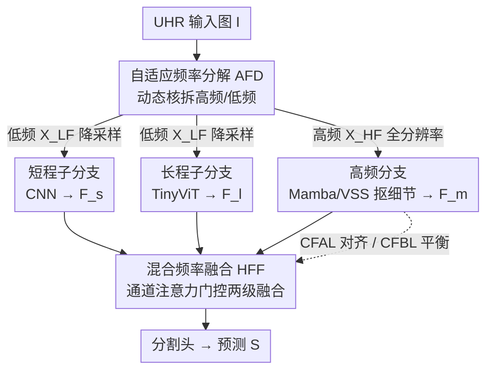

# F2Net: A Frequency-Fused Network for Ultra-High Resolution Remote Sensing Segmentation

**会议**: CVPR 2026  
**论文**: [CVF Open Access](https://openaccess.thecvf.com/content/CVPR2026/html/Chen_F2Net_A_Frequency-Fused_Network_for_Ultra-High_Resolution_Remote_Sensing_Segmentation_CVPR_2026_paper.html)  
**代码**: https://github.com/easm002/F2Net  
**领域**: 遥感分割 / 超高分辨率分割  
**关键词**: 超高分辨率遥感, 频域分解, 多分支网络, 语义分割, 梯度平衡  

## 一句话总结
F2Net 把超高分辨率（UHR）遥感图像在频域上拆成高频和低频分量分路处理——高频分支保全分辨率抠边界细节、低频分支降采样后再分短程/长程两个子分支抠语义，用一个混合频率融合模块（HFF）整合三路特征，并配两个跨频损失稳住多分支训练，在 DeepGlobe / Inria Aerial 上分别拿到 80.22 / 83.39 mIoU 的 SOTA。

## 研究背景与动机
**领域现状**：UHR 遥感图像（通常超过 4K，DeepGlobe 是 2448×2448、Inria 是 5000×5000）比常规分割模型设计时面向的 256×256 输入大了约 100 倍，无法整张喂进网络。早期做法只有两条路：**整图降采样**（省内存但丢掉边界、纹理这些细节）或**切 patch 逐块处理**（保住局部结构但割裂全局上下文）。

**现有痛点**：近年的主流是多分支架构（GLNet、ISDNet、SGNet 等），用一个全局分支看降采样的整图、一个局部分支看高分辨率 patch，试图同时兼顾全局语义和局部细节。但这类方法有两个硬伤：（1）**推理冗余、计算贵**——比如 GLNet 处理一张 UHR 图要跑约 200 个 patch；（2）**训练时分支间梯度冲突**——多个分支联合优化，梯度幅度天然不平衡，导致某条分支主导优化、特征对不齐。

**核心矛盾**：现有多分支方法都依赖**空间维度的划分**（裁剪 / patch），这会破坏目标的完整性（一条横穿森林的细长农田、一条连续的河道会被切碎），并且分支异构带来的梯度失衡没人专门管。

**切入角度**：作者换了个维度——不在空间上切，而在**频域**上切。高频分量天然对应边界、纹理这些需要全分辨率才能保住的细节；低频分量对应语义丰富但空间冗余的内容，降采样也不太掉信息。频域分解能"同时建模细节和全局上下文，且不引入空间伪影"。

**核心 idea**：用动态频率分解把 UHR 图拆成高/低频，分路用最合适的骨干处理（高频用擅长长序列建模的 SSM/Mamba 保全分辨率，低频降采样后用 CNN+ViT 双子分支），再用注意力门控融合，并显式对齐跨频语义、平衡跨频梯度。

## 方法详解

### 整体框架
F2Net 是一个三分支的频率感知网络。输入一张 UHR 图 $I \in \mathbb{R}^{H\times W\times C}$，先经一个 **自适应频率分解（AFD）** 模块拆成高频分量 $X^{HF}$ 和低频分量 $X^{LF}$。**高频分支**在全分辨率上用基于状态空间模型（Mamba/VSS）的多阶段编码器抠结构细节，输出 $F_m$；**低频分支**先降采样，再裂成两个互补子分支——短程子分支（CNN，抓局部纹理）输出 $F_s$、长程子分支（TinyViT，抓全局依赖）输出 $F_l$。三路特征送进 **混合频率融合（HFF）** 模块：先把两个低频子分支融成 $F_{sl}$，再把 $F_{sl}$ 和高频 $F_m$ 二次融合成统一表征，交给分割头出预测。训练上额外挂两个损失：**跨频对齐损失（CFAL）** 让高/低频分支在语义层一致，**跨频平衡损失（CFBL）** 让各分支梯度幅度均衡。

### 关键设计

**1. 自适应频率分解（AFD）：用内容自适应的动态核就地把图拆成高/低频**

直接对全图用一个固定低通核做频率分离行不通——图像不同区域的信号频率差异很大，统一的核抓不住空间上变化的高频细节。AFD 先用 $1\times1$ 卷积做跨通道理解得到 $X=\mathrm{Conv}_{1\times1}(I) \in \mathbb{R}^{H\times W\times D}$，再沿通道维均匀切成 $N$ 组（实现里 $N=8$），对每组 $X_n$ **逐像素动态生成低通滤波核**：$W^{LF}_n = \mathrm{Softmax}(\mathrm{Conv}(X_n)) \in \mathbb{R}^{H\times W\times k^2}$，softmax 沿 $k^2$ 维做、保证权重非负且和为 1（这才是合法的低通行为）。高通核则由单位核相减得到：$W^{HF}_n = \mathbf{1}_{k\times k} - W^{LF}_n$。两组核分别对各自特征做深度卷积 $X^{LF}_n = X_n * W^{LF}_n$、$X^{HF}_n = X_n * W^{HF}_n$，最后通道拼接重组成 $X^{LF}, X^{HF}$。关键在于核是**随空间位置和内容变化的**，比 Gaussian 滤波、Laplacian 金字塔这类固定分解更能根据局部上下文分配频率重点——消融里 AFD 的 80.22 mIoU / 15.4 FPS 明显优于 Laplacian 金字塔的 78.1 / 9.8 和裸输入的 74.2。

**2. 频率感知的三分支异构骨干：每条频率用最合适的网络**

不同频率分量的最优处理方式不同，这个设计就是按频率特性对症下药。**高频分支**保全分辨率（因为细节对分辨率高度敏感），用 SSM——它在长序列建模上表现好，正好适配高分辨率特征图的长 token 序列；具体是卷积 embedding 后过多个 VSS block，每个 block 是 LayerNorm → SS2D（捕空间依赖、带残差 $Z^{(l)}_{SS2D}=Z^{(l-1)}+\mathrm{SS2D}(\cdot)$）→ FFN 残差，阶段间降采样扩感受野，输出 $F_m$。**低频分支**降采样省算力，再分两路：短程子分支用 DeepLabv3（ResNet18 骨干）抓局部纹理 $F_s$，长程子分支用 6 层 ViT-tiny 补 CNN 受限的感受野、抓全局语义 $F_l$。消融（Table 3）证明三路确有协同：单分支平均约 71–72.5 mIoU，三分支齐上到 80.22，比最好的双分支组合还高 3.5 个点。

**3. 混合频率融合（HFF）：通道注意力门控的两级层次融合**

异构分支的特征存在冗余或错位的通道，直接拼接/相加融不好。HFF 先对两个低频子分支各算通道注意力 $A_s=\sigma(\mathrm{MLP}(\mathrm{Pool}(F_s)))$、$A_l=\sigma(\mathrm{MLP}(\mathrm{Pool}(F_l)))$，再建跨分支关系矩阵 $M=\sigma(A_s A_l^\top) \in \mathbb{R}^{C_s\times C_l}$，把跨分支交互信息回注到各自注意力 $\tilde{A}_s=\sigma(\mathrm{MLP}_s(M)+A_s)$、$\tilde{A}_l=\sigma(\mathrm{MLP}(M)+A_l)$，最后加权各分支并用两个 $1\times1$ 卷积投到统一通道维做加和 $F_{sl}=\mathrm{Conv}(\tilde{A}_s\cdot F_s)+\mathrm{Conv}(\tilde{A}_l\cdot F_l)$。融好的低频 $F_{sl}$ 再经第二个 HFF 和高频 $F_m$ 融合成最终表征。这种频率门控的自适应对齐而非简单合并是涨点关键——Table 6 里 HFF 的 80.22 远超 Concat(76.1)、Add(74.6)、ASPP(77.3)，甚至比计算量爆炸的 Cross-attention(72.4, 93.8 GFLOPs) 更好且更省（60.8 GFLOPs）。

**4. 双跨频损失（CFAL + CFBL）：一个管语义一致、一个管梯度平衡**

高频和低频分支在表征和语义抽象上天然不对称，不加约束会有两个问题。其一是**语义不一致**：同一个目标在两条分支里被编码成不同表征，融合时打架。CFAL 用对称 KL 散度逼它们在语义层收敛：$L_{CFAL}=\frac{1}{2}[D_{KL}(F_{sl}\|F_m)+D_{KL}(F_m\|F_{sl})]$，让同一类物体不管在哪条频率分支都表征一致。其二是**梯度失衡**：异构分支反传时梯度幅度差异大，优化会偏袒某条分支。CFBL 显式正则各分支梯度范数 $L_{CFBL}=\sum_\Theta |G_\Theta - \bar{G}|$，其中 $G_\Theta=\|\nabla_\Theta L_{CE}\|_2$ 是某分支参数对交叉熵损失的梯度幅度、$\bar{G}$ 是全分支均值，逼任一分支都别主导学习动态。总损失是 $L=\lambda_1 L_{CFAL}+\lambda_2 L_{CFBL}+\lambda_3 L_{CE}$（实现取 $\lambda_1=\lambda_2=0.1, \lambda_3=1$）。消融（Table 5）显示二者互补：CE only 77.35，+CFBL 到 78.80（稳梯度），+CFAL 到 79.20（对齐语义），两个齐上 80.22。

### 损失函数 / 训练策略
总损失为三项加权和 $L=\lambda_1 L_{CFAL}+\lambda_2 L_{CFBL}+\lambda_3 L_{CE}$，权重 $\lambda_1=\lambda_2=0.1$、$\lambda_3=1$。短程子分支用 DeepLabv3 + 定制 ResNet18，长程子分支用 6 层 ViT-tiny，骨干均 ImageNet-1K 预训练；Mamba 骨干基于 VMamba-Tiny-M2（四阶段深度 [2,2,4,2]、基通道 64）。优化器 SGD（momentum 0.9，初始 lr $1\times10^{-3}$，多项式衰减 power 0.9），batch size 8，DeepGlobe 训 80k 次迭代、Inria Aerial 训 40k，在 DGX-1（Tesla V100）上跑。

## 实验关键数据

### 主实验
两个 UHR 基准上均拿 SOTA。DeepGlobe（七类地物，排除 unknown）上 F2Net 是唯一突破 80 mIoU 的方法；Inria Aerial（二值建筑掩码）上同样领先。

| 数据集 | 指标 | F2Net | 之前最佳 | 提升 |
|--------|------|-------|----------|------|
| DeepGlobe | mIoU | **80.22** | BPT 76.60 | +3.62 |
| DeepGlobe | F1 | **87.09** | BPT 85.7 | +1.39 |
| Inria Aerial | mIoU | **83.39** | RUE 79.00 | +4.39 |
| Inria Aerial | F1 | **91.19** | ISDNet 86.35 | +4.84 |

效率上 DeepGlobe 达 24.30 FPS（在有 FPS 报告的方法里第三快，仅次于 RUE 44.38 和 ISDNet 27.70），内存 2767 MB；Inria 上 5.50 FPS、5534 MB。作者把这定位成 UHR 下刻意做的精度-效率折中。

### 消融实验
分支组合消融（DeepGlobe，Table 3）最能说明三路协同：

| 配置 | mIoU | 说明 |
|------|------|------|
| 仅高频 | 72.5 | 全分辨率 + Mamba，单分支最强 |
| 仅短程 | 71.3 | 降采样 CNN，丢边界 |
| 仅长程 | 71.9 | 降采样 ViT，丢边界 |
| 高频+短程 | 76.7 | 局部纹理补频率特征 |
| 高频+长程 | 76.5 | 全局语义补频率特征 |
| 三分支全开 | **80.22** | 比最好双分支再 +3.5 |

其余消融：分辨率上高频分支极度敏感（降到 1/2、1/4 分别掉 5.1、7.4 mIoU），而低频两路较鲁棒（1/4→1/8 省 23% 内存只掉 3.72%）；损失上 CFBL/CFAL 互补（见上）；融合上 HFF 80.22 完胜各种 baseline；分解上 AFD 80.22/15.4FPS 优于 Laplacian 金字塔 78.1/9.8FPS。

### 关键发现
- **三路协同非线性增益**：任意单分支约 71–72.5，三路齐上 80.22，远超线性叠加预期，说明频率细节、局部纹理、全局语义三者是互补而非冗余。
- **全分辨率只对高频必要**：高频分支降分辨率掉点剧烈（最高 -7.4），低频两路降采样几乎无损——这正当化了"高频保全分辨率、低频降采样省算力"的核心设计取舍。
- **两个损失分工明确**：CFBL 单独 +1.45（稳梯度）、CFAL 单独 +1.85（对齐语义），合起来 +2.87，互补不重叠。
- **HFF 优于 Cross-attention**：朴素跨注意力反而最差（72.4，93.8 GFLOPs，过拟合冗余相关），频率门控的轻量融合更对路。

## 亮点与洞察
- **把空间切分换成频域切分**，绕开了 patch/裁剪破坏目标完整性的老问题——一条横穿森林的细长农田、一条连续河道不会被切碎，这是定性结果里相对 GLNet/FCtL 的明显优势。
- **按频率特性分配骨干**很巧：高频要全分辨率→用擅长长序列的 SSM/Mamba；低频可降采样→CNN 抓局部、ViT 抓全局。每条路都用在刀刃上，而非一套骨干硬扛所有频率。
- **CFBL 用梯度范数差做正则**是可迁移的 trick：任何异构多分支/多模态联合训练遇到梯度失衡，都能借这个"逼各分支梯度幅度向均值靠拢"的思路稳训练。
- **动态内容自适应核做频率分解**比固定 Gaussian/Laplacian 更灵活，且更快（15.4 vs 9.8 FPS），说明可学习的逐像素低通核既保细节又省算。

## 局限与展望
- **内存开销不小**：Inria 上 5534 MB，作者自己承认是 UHR 下"刻意的精度-效率折中"；且训练时受 16GB GPU 约束，低频分支分辨率被限制到原图一半（Table 4 里 1/2 短长程那行直接 OOM 没跑出来），说明扩展性受显存掣肘。
- **只在两个数据集验证**：DeepGlobe（7 类自然地物）和 Inria（二值建筑）覆盖面有限，对城市精细类别、多类建筑材质等更复杂 taxonomy 的泛化没验证。
- **梯度稳定性证据放在补充材料**：CFBL 真正的梯度范数比、稳定化效果只在 supplementary 给，正文只有最终 mIoU，⚠️ 其稳训机制的定量证据需看补充。
- **可改进方向**：把频域分解从两段（高/低）推广到多频带、或让 $\lambda$ 权重随训练自适应，可能进一步提升融合质量；高频分支的 Mamba 也可探索更省显存的变体来缓解内存瓶颈。

## 相关工作与启发
- **vs 多分支 UHR 方法（GLNet / ISDNet / SGNet / BPT）**：它们在**空间**上分全局/局部分支、靠 patch 或上下文聚合，推理冗余（GLNet 约 200 patch/图）且分支梯度冲突；F2Net 在**频域**上分支、整图同时建模、不切 patch，DeepGlobe 上比 BPT +3.62、比 SGNet +4.78。
- **vs 频域表示方法（小波分解 / 自适应频率滤波 / FFC / DCT）**：以往频域工作多用固定变换分高低频，且很少处理 UHR 下多频率融合的融合策略与训练稳定性问题；F2Net 用可学习的动态核分解，并专门用 HFF + 双跨频损失解决融合与稳训，把频域方法系统性地搬进了 UHR 遥感这个"关键但尚未充分探索"的场景。
- **vs Transformer 分割（SegFormer / Mask2Former）**：纯 Transformer 靠自注意力建长程依赖但在 UHR 下内存吃紧、且 DeepGlobe 上 mIoU 仅 63 左右；F2Net 把 ViT 只用在降采样的低频长程子分支，避免在全分辨率上跑昂贵注意力。

## 评分
- 新颖性: ⭐⭐⭐⭐ 把 UHR 分割从"空间切分"范式转到"频域分支"范式，配动态分解 + 跨频损失，思路成体系且少见。
- 实验充分度: ⭐⭐⭐⭐ 两基准 SOTA + 五张消融（分支/分辨率/损失/融合/分解）证据链完整，但仅两个数据集、稳训关键证据在补充材料。
- 写作质量: ⭐⭐⭐⭐ 动机—方法—实验逻辑清晰，公式给得齐，frequency-aware 主线贯通。
- 价值: ⭐⭐⭐⭐ UHR 遥感分割实用涨点明显（mIoU +3.6~+4.4），频域分支 + 梯度平衡损失对其他异构多分支任务有迁移价值。

<!-- RELATED:START -->

## 相关论文

- [\[CVPR 2026\] RDNet: Region Proportion-Aware Dynamic Adaptive Salient Object Detection Network in Optical Remote Sensing Images](rdnet_region_proportion-aware_dynamic_adaptive_salient_object_detection_network_.md)
- [\[CVPR 2026\] SGMA: Semantic-Guided Modality-Aware Segmentation for Remote Sensing with Incomplete Multimodal Data](sgma_semantic-guided_modality-aware_segmentation_for_remote_sensing_with_incompl.md)
- [\[CVPR 2026\] Task-Oriented Data Synthesis and Control-Rectify Sampling for Remote Sensing Semantic Segmentation](task-oriented_data_synthesis_and_control-rectify_sampling_for_remote_sensing_sem.md)
- [\[CVPR 2026\] Test-Time Multi-Prompt Adaptation for Open-Vocabulary Remote Sensing Image Segmentation](test-time_multi-prompt_adaptation_for_open-vocabulary_remote_sensing_image_segme.md)
- [\[CVPR 2026\] ReSAM: Refine, Requery, and Reinforce: Self-Prompting Point-Supervised Segmentation for Remote Sensing Images](resam_refine_requery_and_reinforce_self-prompting_point-supervised_segmentation_.md)

<!-- RELATED:END -->
