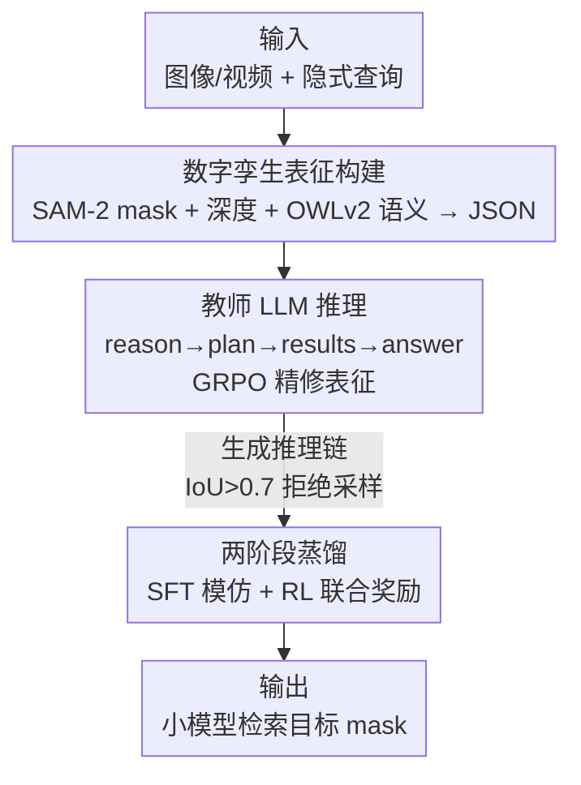

# Fast Reasoning Segmentation for Images and Videos

**会议**: CVPR 2026  
**论文**: [CVF Open Access](https://openaccess.thecvf.com/content/CVPR2026/html/Shen_Fast_Reasoning_Segmentation_for_Images_and_Videos_CVPR_2026_paper.html)  
**代码**: 未开源（论文未给出仓库链接）  
**领域**: 推理分割 / 语义分割  
**关键词**: 推理分割, 数字孪生表征, 知识蒸馏, 强化学习, 边缘部署  

## 一句话总结
FastReasonSeg 把"看图"和"推理"彻底拆开——先用 SAM-2/深度/检测把场景压成结构化的数字孪生 JSON，再让小 LLM 只在这个 JSON 上做多步推理来检索目标 mask；配合"教师生成推理链 → 学生 SFT + RL 双阶段蒸馏"，让 0.6B 的小模型在四个图像/视频推理分割基准上反超参数量 20× 的模型，同时跑到 7.79 FPS、只占 2.1GB 显存。

## 研究背景与动机
**领域现状**：推理分割（reasoning segmentation）让模型能响应隐式文本查询——例如"分割那个用来装热饮的物体"而不是给定"杯子"这个固定类别——是具身智能体在开放环境里识别物体的基础能力。主流做法如 LISA、VISA 把多模态大模型和分割解码器用特殊的 `<SEG>` token 缝在一起，靠 token 触发 mask 生成。

**现有痛点**：这类端到端方法动辄数十亿参数，显存和算力都超出了具身智能体实际部署的边缘设备能力。另一条路 JiT 用"数字孪生表征"+ LLM API 规划做零样本推理，但依赖外部 API 调用，网络延迟和连通性又把实时性打没了。直接训练小模型也不行——多步推理能力通常只在 LLM 超过某个参数阈值后才"涌现"。

**核心矛盾**：蒸馏本是压缩模型的现成办法，但现有蒸馏只对齐"输出预测"和"中间特征"，**根本没把推理链本身传过去**。更糟的是，端到端架构里感知和推理是耦合的：视觉 token 化把连续的时空关系切成离散 token，制造信息瓶颈、把几何和时序依赖打碎，让推理能力更难蒸馏。

**切入角度**：作者注意到"在数字孪生表征上做推理"这个新范式恰好能解耦感知与推理——如果把场景先转成保留语义/空间/时序关系的结构化中间表示，推理过程就变得**显式且可迁移**，小模型能拿到和大模型一样丰富的信息，却不必直接吞高维视觉输入。

**核心 idea**：用数字孪生表征当"感知-推理"之间的结构化中间层，让小 LLM 只在结构化 JSON 上推理；再用"教师生成推理链 → 学生双阶段蒸馏"把多步推理能力完整搬到小模型上。

## 方法详解

### 整体框架
FastReasonSeg 的目标是用蒸馏把推理分割的算力需求压下来。整条流水线分三块：先把图像/视频（静态图当作 $T=1$ 的单帧视频处理）用一组视觉基础模型转成**数字孪生表征**——一个结构化 JSON，记录每个实例的 mask、深度统计、语义标签；然后训练一个 8B **教师 LLM**，让它学会在这个 JSON 上做显式推理、必要时调工具动态精修表征，最后从 JSON 里检索出目标实例的 mask；再通过**两阶段蒸馏**（SFT + RL）把教师的多步推理能力搬到 1.7B / 0.6B 的学生小模型上。关键在于：学生模型自始至终**不碰原始视觉 token**，只在数字孪生 JSON 上推理，这是它能做小又保住推理能力的根本原因。

### 关键设计

**1. 数字孪生表征：把高维视觉压成可推理的结构化 JSON**

针对"视觉 token 化打碎时空依赖、信息瓶颈让推理难蒸馏"这个痛点，作者不让 LLM 直接吃视觉 token，而是先用三个互补的视觉基础模型把场景抽成一份结构化 JSON。第一路用 SAM-2 生成实例 mask $M^{(t)} = \{m_i^{(t)}\}_{i=1}^{N(t)}$，提供逐物体的空间信息；第二路用 DepthAnything2 产出稠密深度图 $Z^{(t)}$，并对每个实例在其 mask 内统计深度——均值 $\mu_i^{(t)} = \frac{1}{|m_i^{(t)}|}\sum_{p \in m_i^{(t)}} Z^{(t)}(p)$ 和方差，用来支持"谁在前、谁更近"这类空间推理；第三路用 OWLv2 给出语义标签 $l_i^{(t)}$、置信度和边界框，把视觉观测和"物体功能/概念"连起来。三路汇成时刻 $t$ 的数字孪生表征：

$$D^{(t)} = \Big\{\, i : \{\,\text{mask}: m_i^{(t)},\ \text{depth\_stats}: d_i^{(t)},\ \text{mean\_depth}: \mu_i^{(t)},\ \text{semantic\_label}: l_i^{(t)}\,\}\ \text{for } i=1,\dots,N^{(t)} \,\Big\}$$

整段视频则是 $D = \{D^{(1)}, \dots, D^{(T)}\}$。这样一来推理被建立在"保留了语义/空间/时序关系的结构化表示"上，而不是碎片化的视觉 token——消融里把它换回直接视觉 token，平均 J 从 0.760 暴跌到 0.588，是全篇贡献最大的一块。

**2. 教师 LLM：显式推理链 + 工具调用动态精修表征**

数字孪生表征是预构建的、可能缺信息，所以需要一个会"按需补算"的推理器。教师 LLM（Qwen3-8B）被训练成产出一段结构化 rollout：先在 `<reason>` 里分析查询和 $D$ 中已有信息的关系、判断信息够不够；若不够，就在 `<plan>` 里生成一个修订计划 $P = \{(tool_i, args_i)\}_{i=1}^K$——每个工具-参数对指定一类计算操作（如实例尺寸计算、空间关系分析）；检测到 `</plan>` 时自回归生成**暂停**，执行计划得到精修后的表征 $D'$，包进 `<results>`；最后在 `<answer>` 里通过 mask 路径/标识符指出目标实例。完整 rollout 形如：

$$Y = \begin{cases} [R]_{\text{think}} \,\|\, [S]_{\text{answer}} & \text{若 } P = \varnothing \\ [R]_{\text{think}} \,\|\, [P]_{\text{revise}} \,\|\, [D']_{\text{results}} \,\|\, [S]_{\text{answer}} & \text{若 } P \neq \varnothing \end{cases}$$

教师用 GRPO 强化学习训练，规则奖励 $R(Y) = R_{\text{format}}(Y) + R_{\text{accuracy}}(Y)$：格式奖励检查 `<reason>/<plan>/<results>/<answer>` 四对 token 是否齐全且顺序正确（对 +0.5、错 −0.5）；准确率奖励按预测 mask 与 GT 的 IoU 判定，IoU>0.5 给 1、否则 0（沿用 SegZero 的设计）。这一步动态精修很关键——消融里用"静态数字孪生（不调工具精修）"，平均 J 从 0.760 掉到 0.699。

**3. 两阶段蒸馏：SFT 学结构 + RL 保推理质量**

小 LLM 直接微调拿不到泛化的推理能力，所以蒸馏拆成顺序两阶段。**第一阶段 SFT**：教师对所有训练样本 $\{(Q_j, D_j)\}$ 生成推理链 $\{Y_j^{teacher}\}$，并做**拒绝采样**——只保留预测 IoU>0.7 的推理链，让学生用标准监督目标去复刻教师的结构化输出格式和推理模式。但纯监督的学生面对分布外场景会吃力，于是**第二阶段 RL**：学生自己生成 rollout $Y^{student}$，用一个三项联合奖励训练

$$R_{\text{total}}(Y^{student}) = R_{\text{format}}(Y^{student}) + R_{\text{accuracy}}(Y^{student}) + \gamma \cdot R_{\text{reasoning}}(Y^{student}, Y^{teacher})$$

其中格式、准确率两项沿用教师训练的定义；新增的**推理奖励** $R_{\text{reasoning}}$ 用 LLM-as-judge（GPT-4o）把学生的推理链和教师的对比，零样本评估逻辑一致性、完整性、准确性，给 0~1 的分（$\gamma=0.5$）。两阶段缺一不可：消融里"只 RL 不 SFT"平均 J 仅 0.669、"只 SFT 不 RL"0.716，都低于完整的 0.760；去掉教师引导（同时砍掉推理和格式奖励）更是掉到 0.677。

### 损失函数 / 训练策略
全程用 LoRA（rank $r=64$, $\alpha=128$）在 8×RTX 4090 上训练，梯度累积步长 64、有效 batch 512，FP16 混合精度适配 24GB 显存。教师 GRPO 学习率 $4\times10^{-5}$，10% 线性 warm-up + 余弦退火；蒸馏 SFT 用 AdamW、学习率 $5\times10^{-5}$、weight decay 0.01、训 3 epoch；RL 蒸馏沿用 GRPO 配置并加入推理奖励（$\gamma=0.5$），LLM-judge 用 GPT-4o（temperature 0.3、max 512 token）。训练数据为 RefCOCOg + ReasonSeg/ReVOS 训练集；教师 Qwen3-8B，学生 Qwen3-1.7B / 0.6B。

## 实验关键数据

### 主实验
四个基准：视频 JiTBench、RVTBench，图像 ReasonSeg、LLM-Seg40K。视频用区域相似度 J 和轮廓精度 F，图像用 gIoU / cIoU。

JiTBench 视频推理分割（区域相似度 J，各难度等级平均）：

| 方法 | 参数 | Level 1 | Level 2 | Level 3 |
|------|------|---------|---------|---------|
| VISA-13B | 13B | 0.507 | 0.431 | 0.384 |
| CoReS-13B | 13B | 0.509 | 0.429 | 0.391 |
| JiT (GPT-4o, API) | API | 0.792 | 0.766 | 0.747 |
| **FastReasonSeg-8B** | 8B | **0.809** | **0.782** | **0.761** |
| FastReasonSeg-1.7B-Distill | 1.7B | 0.784 | 0.758 | 0.738 |
| FastReasonSeg-0.6B-Distill | 0.6B | 0.760 | 0.733 | 0.714 |

图像推理分割（ReasonSeg + LLM-Seg40K，gIoU / cIoU）：

| 方法 | 参数 | ReasonSeg 短查询 gIoU | ReasonSeg 长查询 gIoU | LLM-Seg40K gIoU |
|------|------|----------------------|----------------------|-----------------|
| CoReS-13B | 13B | 0.565 | 0.621 | 0.474 |
| JiT (GPT-4o, API) | API | 0.618 | 0.683 | 0.485 |
| **FastReasonSeg-8B** | 8B | **0.746** | **0.812** | **0.641** |
| FastReasonSeg-1.7B-Distill | 1.7B | 0.721 | 0.787 | 0.618 |
| FastReasonSeg-0.6B-Distill | 0.6B | 0.696 | 0.762 | 0.595 |

关键看点：0.6B 蒸馏版在 JiTBench 上（J 0.760/0.733/0.714）就已**全面反超 VISA-13B、CoReS-13B 这些参数量 20× 的模型**；8B 教师在长查询 gIoU 上比之前最好的 JiT(GPT-4o) 高出 0.129。

效率对比（每帧）：

| 方法 | 总参数(B) | 显存(GB) | 延迟(ms) | 吞吐(FPS) |
|------|-----------|----------|----------|-----------|
| LISA-13B | 14.0 | 28.0 | 1128.9 | 0.89 |
| JiT-7B | 8.6 | 17.2 | 39914.7 | 0.03 |
| FastReasonSeg-8B | 8.2 | 18.5 | 892.5 | 1.12 |
| FastReasonSeg-1.7B-Distill | 1.9 | 4.2 | 245.7 | 4.07 |
| **FastReasonSeg-0.6B-Distill** | **0.8** | **2.1** | **128.4** | **7.79** |

0.6B 版只占 2.1GB 显存、7.79 FPS，相比 agent 范式 JiT（0.03 FPS，外部 API 调用是延迟元凶）是数量级的提速。

### 消融实验
JiTBench 上对 FastReasonSeg-1.7B-Distill 逐组件消融（平均 J）：

| 配置 | 平均 J | 说明 |
|------|--------|------|
| Full Model | 0.760 | 完整模型 |
| w/o DT（换直接视觉 token） | 0.588 | 去掉数字孪生表征，暴跌 0.172 |
| w/o DT 精修（静态表征） | 0.699 | 不调工具动态精修 |
| w/o 两阶段（只 RL） | 0.669 | 跳过 SFT |
| w/o RL（只 SFT） | 0.716 | 跳过 RL 阶段 |
| w/o 推理奖励 | 0.736 | 砍掉 $R_{\text{reasoning}}$ |
| w/o 格式奖励 | 0.691 | 砍掉 $R_{\text{format}}$ |
| w/o 教师引导 | 0.677 | 同时砍推理+格式奖励 |
| 教师换 3B | 0.702 | 教师容量不够，蒸出来的学生也变弱 |
| 教师不做 RL | 0.709 | 教师只 SFT，学生上限被拉低 |

### 关键发现
- **数字孪生表征是绝对核心**：换回直接视觉 token 平均 J 掉 0.172，是所有消融里最大跌幅，直接验证了"解耦感知与推理"的价值。
- **格式奖励比推理奖励更关键**：去掉格式奖励掉到 0.691，比去掉推理奖励（0.736）跌得更狠——说明结构化 rollout 的 token 框架本身就在约束推理路径。
- **教师质量决定学生天花板**：教师换小（3B）或不做 RL，蒸出来的 1.7B 学生分别只有 0.702 / 0.709，印证了"先把大模型训强、再蒸"这条路径的必要性。
- 另有图表显示三路数字孪生组件（mask / 深度 / 语义）逐一加入时 J 单调上升，三者互补缺一不可。

## 亮点与洞察
- **把"推理链"当作蒸馏的一等公民**：以往蒸馏对齐 logits/特征，这篇直接让教师吐出 `<reason>/<plan>/<results>/<answer>` 的显式推理链，再用 LLM-as-judge 给学生的推理质量打分——把"会不会推理"变成可监督、可奖励的目标，这是它能把小模型推理能力保住的关键。
- **结构化中间表示规避了"小模型吃不下高维视觉"的难题**：让 LLM 只在 JSON 上操作，等于把感知外包给冻结的视觉基础模型，小 LLM 专注它擅长的符号推理——这个"感知/推理分工"思路可迁移到任何需要小模型做空间推理的任务。
- **工具调用 + 自回归暂停做动态精修**：推理中途遇到信息不足就生成 plan、暂停生成去执行、把结果回插，这种"边推理边补算"的机制比一次性喂全信息更省、更灵活。

## 局限与展望
- 作者承认：当前实现依赖**预构建**的数字孪生表征，离线算好再推理；真正实时场景需要在线构建+精修这些结构化中间表示，是明确的未来方向。
- ⚠️（自己观察）整个表征质量被 SAM-2 / DepthAnything2 / OWLv2 三个上游模型的精度卡死——若 OWLv2 漏检或标错语义，下游 LLM 再会推理也救不回来，论文没有分析这种级联误差。
- RL 蒸馏的推理奖励依赖 GPT-4o 当 judge，引入了对闭源 API 的训练期依赖，也让"推理质量"的判定标准不完全透明、难以复现。
- ⚠️ 论文未给出代码仓库，复现需自行搭建三路视觉基础模型 + 两阶段蒸馏流程，工程量不小。

## 相关工作与启发
- **vs LISA / VISA（端到端 `<SEG>` token）**：它们把 MLLM 和分割解码器缝死、靠特殊 token 触发 mask，参数量大且感知推理耦合；本文用数字孪生 JSON 解耦二者，0.6B 就反超它们的 13B 版本。
- **vs JiT（agent + 数字孪生）**：JiT 同样用数字孪生表征但靠 LLM API 在线规划，延迟高达 ~40000ms/帧、实时性差；本文把推理能力蒸进本地小模型，7.79 FPS 可边缘部署，相当于"把 JiT 的 agent 智能离线化"。
- **vs SegZero / CoReS（解耦式 RL 分割）**：本文继承了 SegZero 的 IoU 奖励设计，但额外引入教师推理链蒸馏 + 推理质量奖励，把"解耦架构"从单模型训练推进到"大教师→小学生"的知识迁移范式。

## 评分
- 新颖性: ⭐⭐⭐⭐⭐ 首次把"推理链"作为蒸馏目标 + 数字孪生表征解耦感知推理，让 0.6B 反超 13B，范式清晰。
- 实验充分度: ⭐⭐⭐⭐⭐ 四个图像/视频基准 + 详尽的逐组件消融 + 完整效率对比，证据链扎实。
- 写作质量: ⭐⭐⭐⭐ 方法和动机讲得清楚，rollout token 设计和奖励定义到位；个别符号排版略乱。
- 价值: ⭐⭐⭐⭐⭐ 把推理分割从"云端大模型"拉到"边缘实时可部署"，对具身智能落地有直接价值。

<!-- RELATED:START -->

## 相关论文

- [\[CVPR 2026\] DPAD: Discriminative Perception via Anchored Description for Reasoning Segmentation](discriminative_perception_via_anchored_description_for_reasoning_segmentation.md)
- [\[CVPR 2026\] VIRST: Video-Instructed Reasoning Assistant for SpatioTemporal Segmentation](virst_video-instructed_reasoning_assistant_for_spatiotemporal_segmentation.md)
- [\[CVPR 2026\] SegCompass: Exploring Interpretable Alignment with Sparse Autoencoders for Enhanced Reasoning Segmentation](segcompass_exploring_interpretable_alignment_with_sparse_autoencoders_for_enhanc.md)
- [\[CVPR 2026\] ReSAM: Refine, Requery, and Reinforce: Self-Prompting Point-Supervised Segmentation for Remote Sensing Images](resam_refine_requery_and_reinforce_self-prompting_point-supervised_segmentation_.md)
- [\[CVPR 2026\] Towards Context-Aware Image Anonymization with Multi-Agent Reasoning](towards_context-aware_image_anonymization_with_multi-agent_reasoning.md)

<!-- RELATED:END -->
