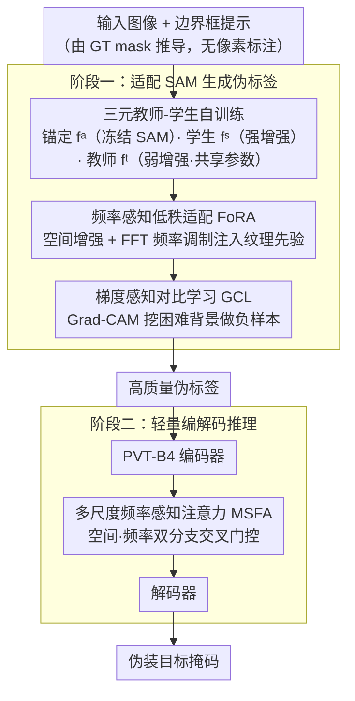

# FCL-COD: Weakly Supervised Camouflaged Object Detection with Frequency-aware and Contrastive Learning

**会议**: CVPR 2026 Findings  
**arXiv**: [2603.22969](https://arxiv.org/abs/2603.22969)  
**代码**: 无  
**领域**: 图像分割  
**关键词**: Camouflaged Object Detection, Weakly Supervised, SAM, Frequency-aware LoRA, Contrastive Learning

## 一句话总结

提出 FCL-COD 框架，通过频率感知低秩适配（FoRA）将伪装场景知识注入 SAM、梯度感知对比学习（GCL）增强前背景特征分离、多尺度频率注意力（MSFA）提炼边界敏感特征，在仅使用边界框标注的弱监督设定下超越了全监督 SOTA 方法。

## 研究背景与动机

伪装目标检测（COD）要求识别与背景高度相似的目标，面临四大挑战：

**全监督方法**依赖像素级标注，成本高昂且可能忽略目标整体结构特征

**弱监督方法**的性能与全监督差距显著
3. 基于 SAM 的方法在伪装场景中存在特定问题：
    - (a) 非伪装目标响应——错误检测非目标物体
    - (b) 局部响应——只检测目标的一部分
    - (c) 极端响应——过大或过小的检测区域
    - (d) 缺乏精细边界感知

本文系统性地针对这四个问题分别设计了对应的解决方案。

## 方法详解

### 整体框架

两阶段框架：
- **阶段一**：采用三元教师-学生自训练架构适配 SAM，结合 FoRA 和 GCL 生成高质量伪标签
- **阶段二**：使用伪标签训练轻量级 PVT-B4 编码-解码器，嵌入 MSFA 模块实现高效推理

### 关键设计

1. **三元教师-学生自训练 (Triadic Teacher-Student Self-training)**:

    - 维护三个编码器：锚定编码器 $f^a$（冻结的原始 SAM，保留预训练知识）、学生编码器 $f^s$（强增强输入）、教师编码器 $f^t$（弱增强输入，与学生共享参数）
    - 学生-教师损失：Focal Loss + Dice Loss 指导学生学习教师的伪标签
    - 锚定损失：防止学生和教师偏离预训练 SAM 知识过远，抑制伪标签误差累积
    - 输入提示为边界框（由 GT mask 的 bbox 推导，不使用像素级标注）

2. **频率感知低秩适配 (FoRA)**:
   解决非伪装目标响应问题。在标准 LoRA 的编码器-解码器路径间插入级联变换：
    - **空间增强 $\mathcal{S}_{spa}$**：通过 1×1, 3×3, 5×5 多尺度卷积聚合 + 残差连接捕获多尺度上下文
    - **频率调制 $\mathcal{S}_{fre}$**：FFT → 频域 3×3 卷积 → IFFT，在频域中建模伪装场景的高频纹理差异
    - 前向传播：$h = W_0 x + W_d \mathcal{S}_{fre}(\mathcal{S}_{spa}(W_e x))$
    - 核心思想：伪装目标与背景在空间域极为相似，但在频率域存在可区分的细微纹理差异

3. **梯度感知对比学习 (GCL)**:
   解决局部响应和极端响应问题。关键创新在于采样策略：
    - 利用教师特征图的 Grad-CAM 导出梯度激活图 $G^t$
    - 构建梯度加权背景掩码 $\tilde{m}_0 = \hat{m}_0 \odot G^t$，聚焦于容易与前景混淆的困难背景区域
    - 通过 masked average pooling 构建学生/教师分支的前景实例原型和背景原型
    - 正样本对：同一实例的学生-教师表示；负样本：其他实例 + 梯度加权背景原型
    - InfoNCE 对比损失推开前景与困难背景的表示距离

4. **多尺度频率感知注意力 (MSFA)**:
   解决缺乏精细边界感知问题。插入在阶段二编码器和解码器之间：
    - 双分支设计：空间分支 $\mathcal{M}_{spa}$（堆叠 3×3 卷积）+ 频率分支 $\mathcal{M}_{fre}$（FFT→1×1 卷积→IFFT）
    - 三通道注意力 $\mathcal{T}$：用一个域的多尺度特征门控另一个域的特征
    - 三个尺度（S/M/L）的空间和频率特征交叉门控后级联融合

### 损失函数 / 训练策略

**阶段一总损失**：
$$\mathcal{L} = \mathcal{L}_{st}^{dice} + \lambda_1 \mathcal{L}_{anchor} + \lambda_2 \mathcal{L}_{GCL} + \lambda_3 \mathcal{L}_{st}^{focal}$$

最优超参：$\lambda_1$=0.50, $\lambda_2$=1.00, $\lambda_3$=20

**阶段二损失**：BCE + 余弦退火的不确定性感知损失

训练环境：2×NVIDIA H20 GPU，PVT-B4 编码器，SGD（lr=1e-3, momentum=0.9），60 epochs

## 实验关键数据

### 主实验

与全监督和弱监督方法对比（SAM-H backbone）：

| 方法 | 监督 | CAMO-MAE↓ | CAMO-$S_m$↑ | COD10K-MAE↓ | COD10K-$S_m$↑ |
|------|------|-----------|-------------|-------------|-------------|
| SARNet | 全监督 | 0.046 | 0.874 | 0.021 | 0.885 |
| CamoFormer-P | 全监督 | 0.046 | 0.872 | 0.023 | 0.869 |
| HitNet | 全监督 | 0.055 | 0.849 | 0.023 | 0.871 |
| SAM-COD | 弱(B) | 0.062 | 0.837 | 0.028 | 0.842 |
| **FCL-COD(H)** | **弱(B)** | **0.050** | **0.862** | **0.022** | **0.878** |

FCL-COD 在弱监督设定下不仅大幅超越 SAM-COD（MAE 降低 0.012），还**超越了多个全监督方法**（ZoomNet、CamoFormer-R 等）。

不同 SAM 规模的结果：

| Backbone | CAMO-MAE↓ | COD10K-MAE↓ | NC4K-MAE↓ |
|----------|-----------|-------------|-----------|
| FCL-COD(SAM-B) | 0.060 | 0.027 | 0.041 |
| FCL-COD(SAM-L) | 0.054 | 0.022 | 0.034 |
| FCL-COD(SAM-H) | 0.050 | 0.022 | 0.033 |

### 消融实验

逐步消融各组件贡献（COD10K, $E_m$↑）：

| FoRA | GCL | MSFA | COD-Train $E_m$ | CHAMELEON $E_m$ | COD10K $E_m$ |
|------|-----|------|-----------------|-----------------|--------------|
| ✗ | ✗ | ✗ | 0.959 | 0.927 | 0.919 |
| ✓ | ✗ | ✗ | 0.963 | 0.928 | 0.923 |
| ✓ | ✓ | ✗ | 0.969 | 0.947 | 0.926 |
| ✓ | ✓ | ✓ | — | **0.954** | **0.938** |

FoRA 提升伪标签质量→GCL 进一步强化前背景分离→MSFA 在推理阶段提炼边界。

FoRA 子消融：空间增强和频率调制各自贡献 +0.001-0.002 $E_m$，联合使用 +0.004。
GCL 子消融：标准 CL 提升 +0.005，加入梯度感知再提升 +0.001。

### 关键发现

- **频域信息是区分伪装目标的关键**：伪装场景在空间域极为相似，但频率域的纹理差异可被利用
- Grad-CAM 引导的困难负样本挖掘比随机采样更有效
- 多尺度空间-频率交叉门控比单分支设计性能更优
- 方法还可扩展到弱监督显著性目标检测（SOD），同样优于全监督方法

## 亮点与洞察

1. **问题分解极为系统化**：SAM 在伪装场景的四类失败模式（非伪装响应/局部/极端/边界粗糙）分别对应 FoRA/GCL/GCL/MSFA 的设计，逻辑清晰
2. **频率域先验的多层次利用**：FoRA 在特征适配阶段注入频率先验，MSFA 在推理阶段利用频率分支提炼边界，形成完整的频率感知体系
3. **弱监督超越全监督**的结果非常强劲，说明 SAM 的强先验 + 正确的适配方式可以弥补标注信息的不足
4. **两阶段设计的工程合理性**：阶段一用大 SAM 生成高质量伪标签，阶段二用轻量级模型推理，兼顾精度和效率

## 局限与展望

- 训练时 bbox 提示来源于 GT mask，实际应用中 bbox 的获取方式需进一步讨论
- 推理时需两阶段（伪标签生成 + 轻量检测器），整体流程略复杂
- CHAMELEON 数据集（仅 76 张）上的评估可能存在统计波动
- 未讨论视频伪装目标检测或实例级伪装目标检测的扩展

## 相关工作与启发

- FoRA 的空间-频率级联设计可推广到其他需要细粒度纹理区分的 LoRA 适配任务
- 梯度感知负样本挖掘策略对任何需要困难负样本的对比学习场景都有参考价值
- SAM + 轻量适配 + 伪标签训练的范式可迁移到其他弱监督密集预测任务

## 评分

- 新颖性: ⭐⭐⭐⭐ — FoRA 和 GCL 的设计有新意，频率域先验的系统性利用是亮点
- 实验充分度: ⭐⭐⭐⭐⭐ — 四个数据集 + 细致的组件消融 + 超参分析 + 定性可视化 + SOD 扩展
- 写作质量: ⭐⭐⭐⭐ — 问题分解清晰，但符号略多
- 价值: ⭐⭐⭐⭐ — 弱监督超全监督的结果令人印象深刻，具有实际应用价值

<!-- RELATED:START -->

## 相关论文

- [\[CVPR 2026\] Frequency-Aware Affinity for Weakly Supervised Semantic Segmentation](frequency-aware_affinity_for_weakly_supervised_semantic_segmentation.md)
- [\[ECCV 2024\] Frequency-Spatial Entanglement Learning for Camouflaged Object Detection](../../ECCV2024/segmentation/frequency-spatial_entanglement_learning_for_camouflaged_object_detection.md)
- [\[CVPR 2026\] Weakly-Supervised Referring Video Object Segmentation through Text Supervision](wsrvos_weakly_supervised_rvos.md)
- [\[CVPR 2026\] Beyond Appearance: Camouflaged Object Detection via Geometric Structure](beyond_appearance_camouflaged_object_detection_via_geometric_structure.md)
- [\[CVPR 2026\] Hierarchical Action Learning for Weakly-Supervised Action Segmentation](hierarchical_action_learning_for_weakly-supervised_action_segmentation.md)

<!-- RELATED:END -->
