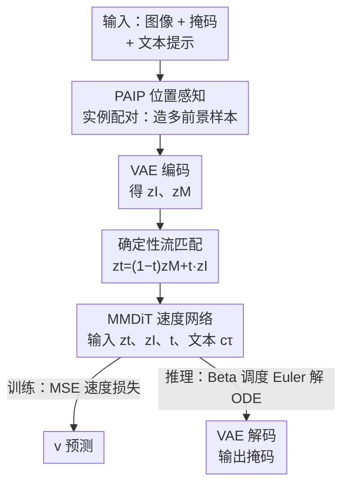

# FlowDIS: Language-Guided Dichotomous Image Segmentation with Flow Matching

**会议**: CVPR 2026  
**arXiv**: [2605.05077](https://arxiv.org/abs/2605.05077)  
**代码**: https://github.com/Picsart-AI-Research/FlowDIS （有）  
**领域**: 图像分割 / 流匹配生成 / 语言引导  
**关键词**: 二分图像分割（DIS）、流匹配、语言可控、实例配对、确定性生成

## 一句话总结
FlowDIS 把高精度二分图像分割（DIS）重新表述成一个**流匹配**问题——直接学一个时间相关的速度场把「图像分布」搬运到「掩码分布」，用确定性 ODE 取代扩散模型从噪声去噪的随机过程；再配上 PAIP 实例配对训练策略增强语言可控性，在 DIS5K 全部测试集刷新 SOTA，仅 1 步推理就比次优的 LawDIS 在 DIS-TE 上 $F_\beta^\omega$ 高约 5.5%、MAE 低约 43%。

## 研究背景与动机
**领域现状**：DIS（Dichotomous Image Segmentation）是评测「类别无关、像素级超高精度前景分割」的标准任务，数据集是 DIS5K。主流做法分两类：一类把分割当逐像素二分类，用 ResNet / Swin 等分类骨干（IS-Net、BiRefNet、MVANet）；另一类受生成模型启发，把分割套进 DDPM 框架，借用预训练文生图（T2I）扩散先验做「图像条件下的掩码生成」（DiffDIS、LawDIS）。

**现有痛点**：分类骨干是为「预测整图类别」优化的，缺少前景级的细粒度语义，复杂细节图上掉点，多物体场景里还容易认错前景。而扩散式方法虽然引入了丰富语义先验，却有个根本错配——分割是**确定性的稠密预测**（必须精确对上 GT），扩散却是**从高斯噪声去噪的随机过程**。这种错配导致：训练收敛慢（动辄几万步），去噪的随机性还会把细边界搞糊、搞偏。

**核心矛盾**：要想用上生成大模型的语义先验，又不想要扩散「从噪声生成」带来的随机性和慢收敛——「生成先验」和「确定性分割」之间存在张力。

**本文目标**：(1) 找一个既能复用预训练生成模型、又天然确定的分割表述；(2) 在多物体真实场景下做到可靠的语言可控分割。

**切入角度**：作者注意到流匹配（Flow Matching）是比扩散更一般的框架——它学的是任意两个分布之间的连续映射，参考分布 $p_1$ **不必是高斯**。那就让 $p_1$ 直接是图像分布、$p_0$ 是掩码分布，于是分割变成「把图像确定性地搬运到它的掩码」，训练和采样全程确定，扩散只是它把 $p_1$ 设成高斯的特例。

**核心 idea**：用「图像→掩码的确定性流匹配传输」代替「从噪声去噪生成掩码」，再用 PAIP 配对造多前景样本来撑起语言可控性。

## 方法详解

### 整体框架
FlowDIS 基于流匹配框架，把 RGB 图像看作参考分布 $p_1$、二值掩码看作目标分布 $p_0$，训练一个速度网络 $v_\theta$ 学习沿直线插值路径从图像搬运到掩码的速度场。训练时：一个 batch 的 (图像, 掩码, 提示词) 三元组先经 **PAIP** 选择性地两两混合成多前景样本；混合后的图像和掩码用 VAE 编码进潜空间得到 $z^I$、$z^M$；按时间步 $t\sim p(t)$ 在两者间做线性插值得到中间潜变量 $z_t$；文本提示经 CLIP+T5 编码成 token $c_\tau$，连同 $z_t$、图像潜变量 $z^I$、时间步 $t$ 一起喂给 MMDiT 速度预测模型，损失就是预测速度与真值速度的 MSE。推理时：从 $z_1=z^I$ 出发，用 Euler 法沿 Beta 调度的时间网格迭代求解概率流 ODE 到 $z_0$，再用 VAE 解码器还原成掩码。

### 关键设计

**1. 确定性流匹配分割：让图像直接「流」成掩码，而不是从噪声去噪**

针对扩散式 DIS「随机过程 vs 确定性分割」的根本错配。流匹配学一个时间相关速度场 $v_\theta(x,t)$，沿轨迹把参考分布 $p_1$ 的样本搬到目标分布 $p_0$；常用的条件流是两端样本的线性插值 $x_t=(1-t)x_0+tx_1$，对应的真值速度恒为 $v=x_1-x_0$。FlowDIS 的关键一步是把 $p_1$ 设成图像分布、$p_0$ 设成掩码分布：图像 $I$ 和掩码 $M$ 都经 VAE 编码成 $z^I,z^M$，潜空间轨迹

$$z_t=(1-t)z^M+t\,z^I,\quad t\in[0,1]$$

网络学预测速度 $z^I-z^M$。推理时直接从图像潜变量 $z_1=z^I$ 出发反解概率流 ODE 即得掩码，**全程没有任何随机噪声**。这样既复用了大生成模型的语义先验，又恢复了分割该有的确定性——收敛极快（消融显示只要 1K 迭代就超过训练了 36K 步的 LawDIS），边界也不会被随机去噪搞糊

**2. 图像潜变量通道拼接条件：每一步推理都能看到干净原图**

流匹配中间潜变量 $z_t$ 是图像和掩码的混合，越靠近 $z_0$（掩码端）图像信号越弱，多步推理时细节容易丢。作者把图像潜变量 $z^I$ 直接**通道拼接**到速度网络输入上，保证 $v_\theta$ 每一步都能访问到完整的干净图像信号，损失变为

$$\mathcal{L}(\theta)=\mathbb{E}_{z^I,z^M,t}\big[\|v_\theta(z_t,z^I,t,c_\tau)-(z^I-z^M)\|_2^2\big]$$

工程上，为接入这个额外条件，他们扩展了 transformer 第一层线性层的输入通道、新权重初始化为零（零初始化保证起步时不破坏预训练行为）。附录消融（Tab.5）证实加上这个 $z^I$ 条件后所有指标都稳定提升

**3. PAIP 位置感知实例配对：用合成多前景场景撑起语言可控性**

标准 DIS 训练集基本是单前景图，直接做提示词引导训练学不会可靠的语言可控——模型见不到「一张图里多个物体、按提示选其中一个」的样本。PAIP 在每个 mini-batch 内为每个参考三元组 $(I_j,M_j,\tau_j)$ 随机配一个配对三元组 $(I_k,M_k,\tau_k)$，把后者的前景拼进参考图，合成一张含两个主体的新图 $I_{\text{mix}}$。拼接是「位置感知」的：先算参考前景的最小外接框 $B_j$，再找紧贴 $B_j$、面积最大且不重叠的矩形区域 $R_j^{\max}$ 作为放置区；因 $R_j^{\max}$ 常比 $B_j$ 小，就沿共享边对参考图做**反射填充**（填充量等于 $R_j^{\max}$ 对侧边长，把放置区翻倍），再把配对前景裁剪、保持长宽比缩放、Alpha 混合放进去。关键的监督构造是：掩码从集合 $\{\hat{M}_j\,\text{AND}\,(\hat{M}_k)^c,\ \hat{M}_k,\ \hat{M}_j\,\text{OR}\,\hat{M}_k\}$ 里随机选一个，文本则对应地从 $\{\tau_j,\ \tau_k,\ \text{“}\tau_j\text{ and }\tau_k\text{”}\}$ 里选——这样「提示词」和「目标掩码」严格绑定，逼模型真正按语言去选物体，而不是无视提示输出固定前景

**4. Beta 时间步调度：训练偏向难的大 $t$，推理非均匀采样**

为让流匹配既好训又好采，作者用 Beta 分布同时调控训练与推理。训练时时间步 $t\sim\mathrm{Beta}(2.5,1)$，把采样偏向更大的 $t$ 值——这里预测更难（离掩码端更远、混合信息更复杂），相当于把训练算力压到最吃力的区段。推理时用 Beta CDF 的逆函数把等距网格 $q$ 映射成非均匀时间网格 $t_i=F^{-1}_{\text{Beta}}(q_i;\alpha,\beta)$（同样 $\alpha=2.5,\beta=1$），在轨迹关键段做更密的采样，少数几步 Euler 就拿到高质量掩码（1 步即 SOTA，2 步更好）

### 损失函数 / 训练策略
- **基模型**：以 FLUX.1-Schnell（一个 MMDiT 流匹配模型）的预训练权重初始化；文本编码器用 CLIP + T5。
- **训练目标**：预测速度与真值速度 $z^I-z^M$ 的 MSE（式 8，含文本与图像潜变量条件）。
- **超参**：batch size 32，训练 10,000 迭代（8×A100 约 1.8 天）；AdamW，初始学习率 $5\times10^{-5}$，在第 512/2048/4096/8192 步各减半。
- **推理**：Euler 解概率流 ODE，输出 RGB 掩码后取三通道均值转灰度并 clip 到 $[0,1]$。

## 实验关键数据

数据集 DIS5K（5,470 张高分辨率图-掩码对），训练用 DIS-TR（3,000），DIS-VD（470）/ DIS-TE（2,000，按前景复杂度分 TE1–TE4 各 500）只做测试；所有方法在 $1024\times1024$ 分辨率评测。指标：$F_\beta^\omega\uparrow$、$F_\beta^{mx}\uparrow$、$\mathcal{M}\downarrow$（MAE）、$\mathcal{S}_\alpha\uparrow$、$E_\phi^{mn}\uparrow$。

### 主实验（DIS-TE 1-4 合并集 与 DIS-VD）

| 测试集 | 方法 | $F_\beta^\omega\uparrow$ | $F_\beta^{mx}\uparrow$ | $\mathcal{M}\downarrow$ | $\mathcal{S}_\alpha\uparrow$ | $E_\phi^{mn}\uparrow$ |
|--------|------|------|------|------|------|------|
| DIS-TE(1-4) | LawDIS25（次优） | 0.884 | 0.918 | 0.030 | 0.916 | 0.947 |
| DIS-TE(1-4) | **FlowDIS (1-step)** | 0.933 | 0.958 | 0.017 | 0.951 | 0.971 |
| DIS-TE(1-4) | **FlowDIS (2-step)** | **0.938** | **0.959** | **0.016** | **0.951** | **0.973** |
| DIS-VD | LawDIS25（次优） | 0.884 | 0.917 | 0.030 | 0.917 | 0.949 |
| DIS-VD | **FlowDIS (2-step)** | **0.938** | **0.958** | **0.014** | **0.953** | **0.974** |

DIS-TE(1-4) 上 1 步 FlowDIS 相对 LawDIS：$F_\beta^\omega$ 从 0.884→0.933（约 +5.5%），$\mathcal{M}$ 从 0.030→0.017（约 −43%），与摘要一致。最难子集 DIS-TE4 上 2 步 FlowDIS $F_\beta^\omega$ 达 0.919，亦显著领先 LawDIS 的 0.884。

### 消融实验（均在 DIS-VD，2 步推理，除非特别说明）

| 配置 | $F_\beta^\omega\uparrow$ | $F_\beta^{mx}\uparrow$ | $\mathcal{M}\downarrow$ | 说明 |
|------|------|------|------|------|
| denoising FM（从高斯噪声） | 0.883 | 0.916 | 0.025 | $z_1$ 设为高斯噪声 |
| **deterministic FM（本文）** | **0.938** | **0.958** | **0.014** | $z_1=z^I$ 图像端 |
| w/o language guidance | 0.901 | 0.926 | 0.027 | 不给文本 |
| **w/ language guidance** | **0.937** | **0.956** | **0.015** | 给文本 |

PAIP 专项（DIS-VD-Complex 为用 PAIP 构造的多物体复杂场景测试集，与 DIS-VD 等量）：

| 测试集 | 配置 | $F_\beta^{mx}\uparrow$ | $\mathcal{M}\downarrow$ | $\mathcal{S}_\alpha\uparrow$ |
|--------|------|------|------|------|
| DIS-VD-Complex | w/o PAIP | 0.783 | 0.063 | 0.831 |
| DIS-VD-Complex | **w/ PAIP** | **0.960** | **0.014** | **0.955** |
| DIS-VD（简单场景） | w/o PAIP | 0.956 | 0.015 | 0.952 |
| DIS-VD（简单场景） | w/ PAIP | 0.958 | 0.014 | 0.953 |

### 关键发现
- **确定性表述是最大功臣**：把 $z_1$ 从高斯噪声换成图像端，$F_\beta^\omega$ 从 0.883→0.938、MAE 从 0.025→0.014，印证「分割该用确定性流匹配」的核心论断。
- **收敛速度碾压**：仅 1K 迭代就超过训练 36K 步的 LawDIS（Fig.4），确定性表述同时换来训练效率。
- **PAIP 只在该发力处发力**：复杂多物体场景 $F_\beta^{mx}$ 0.783→0.960（巨幅提升），简单单物体场景几乎不变（0.956→0.958）——说明它精准补上了「语言可控」短板而不损害常规精度。附录在 COCO 衍生集上 $F_\beta^\omega$ 0.327→0.511，同样验证语言可控性增益。
- **语言引导提供语义线索**：加文本后 $F_\beta^\omega$ 0.901→0.937，帮助消解多前景歧义。

## 亮点与洞察
- **「换参考分布」这一步极其巧妙**：扩散是流匹配里 $p_1$=高斯的特例，那把 $p_1$ 换成图像分布，分割就天然确定了——一个观念上的小改动，换来收敛快一个数量级 + 边界更清，是典型「换个表述把难题变简单」。
- **PAIP 把「语言可控」拆成可监督的信号**：核心不是简单贴图，而是「掩码集合 ↔ 提示词集合」严格配对（AND/OR/补 三种掩码对应 单/单/联合 三种文本），逼模型学到「提示词决定选哪个物体」，这套合成监督思路可迁移到任何「按语言选区域」的引用分割任务。
- **零初始化扩展输入通道**复用预训练大模型时不破坏原有行为，是接入新条件的稳妥工程范式。
- **Beta 调度一鱼两吃**：同一组 $(\alpha,\beta)$ 既在训练把算力压到难区段，又在推理做非均匀密采样，少步即高质量。

## 局限与展望
- **依赖大生成基模型**：以 FLUX.1-Schnell + CLIP + T5 起步，参数量和显存远高于轻量分类骨干方法，部署成本高，作者未讨论小模型版本。
- **语言提示需外部 VLM 生成**：训练/评测的 caption 由 GPT-4V / GPT-4o-mini 生成，引入对闭源模型的依赖，提示质量与可复现性受其影响。
- **PAIP 评测部分用自造基准**：DIS-VD-Complex、COCO 衍生集都是作者用 PAIP 思路构造的，与训练分布同源，语言可控性的「绝对水平」仍需更独立的第三方多前景基准佐证 ⚠️。
- **改进方向**：探索蒸馏到轻量速度网络、把 PAIP 扩展到三前景及以上的更复杂指代、以及在医学/遥感等领域分割上验证确定性流匹配的迁移性。

## 相关工作与启发
- **vs LawDIS / DiffDIS（扩散式 DIS）**：他们把分割当「图像条件下从高斯噪声去噪生成掩码」，随机过程与确定性分割错配、收敛慢、边界易糊；FlowDIS 用确定性流匹配直接做图像→掩码传输，1 步即超过它们训练 36K 步的结果，语言可控性也更强（LawDIS 常对不同提示输出几乎相同结果）。
- **vs BiRefNet / MVANet / PDFNet（判别式分类骨干）**：他们靠双边参考、多视角融合、深度完整性先验等结构强化细节，但缺生成大模型的语义先验且无语言可控；FlowDIS 借生成先验在 $F_\beta^\omega$、MAE 上大幅领先，并额外提供文本可控分割能力。
- **vs GenPercept（扩散微调做稠密预测）**：同样想借生成先验，但仍在扩散/去噪范式内；FlowDIS 指出流匹配的确定性表述对稠密预测更自然，实证性能更优。

## 评分
- 新颖性: ⭐⭐⭐⭐⭐ 把 DIS 重述为「图像→掩码确定性流匹配」，并用 PAIP 把语言可控性变成可监督信号，观念清晰且原创。
- 实验充分度: ⭐⭐⭐⭐ DIS5K 全测试集 + 多组消融（FM 表述/语言/PAIP/zI 条件）+ 收敛曲线齐全；语言可控基准偏自造，略减一星。
- 写作质量: ⭐⭐⭐⭐⭐ 动机推导（扩散错配→流匹配确定性）层层递进，方法与图示清晰。
- 价值: ⭐⭐⭐⭐⭐ 在高精度分割上刷新 SOTA 且收敛极快，确定性流匹配范式对稠密预测有广泛启发，代码开源。

<!-- RELATED:START -->

## 相关论文

- [\[CVPR 2026\] Universal 3D Shape Matching via Coarse-to-Fine Language Guidance](universal_3d_shape_matching_via_coarse-to-fine_language_guidance.md)
- [\[CVPR 2026\] High-Precision Dichotomous Image Segmentation via Depth Integrity-Prior and Fine-Grained Patch Strategy](high-precision_dichotomous_image_segmentation_via_depth_integrity-prior_and_fine.md)
- [\[ICCV 2025\] LawDIS: Language-Window-based Controllable Dichotomous Image Segmentation](../../ICCV2025/segmentation/lawdis_language-window-based_controllable_dichotomous_image_segmentation.md)
- [\[CVPR 2026\] PR-MaGIC: Prompt Refinement Via Mask Decoder Gradient Flow For In-Context Segmentation](pr-magic_prompt_refinement_via_mask_decoder_gradient_flow_for_in-context_segment.md)
- [\[CVPR 2026\] Differentiable Laplacian Matrix Guided Superpixel Segmentation](differentiable_laplacian_matrix_guided_superpixel_segmentation.md)

<!-- RELATED:END -->
