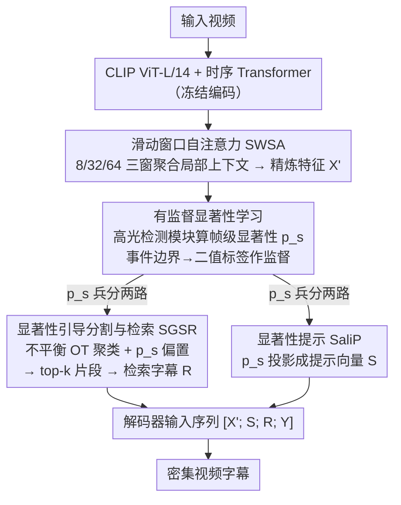

# Follow the Saliency: Supervised Saliency for Retrieval-augmented Dense Video Captioning

**会议**: CVPR 2026  
**arXiv**: [2603.11460](https://arxiv.org/abs/2603.11460)  
**代码**: [GitHub](https://github.com/ermitaju1/STaRC)  
**领域**: 分割  
**关键词**: 密集视频描述, 显著性学习, 检索增强, 时序分割, 最优传输

## 一句话总结

提出 STaRC 框架，通过有监督的帧级显著性学习统一驱动检索（显著性引导分割+检索）和描述生成（显著性提示注入解码器），显著提升密集视频描述(DVC)任务中的时序对齐和字幕质量。

## 研究背景与动机

密集视频描述(DVC)需要在长视频中检测多个事件并为每个事件生成自然语言描述，与单句视频描述有本质区别。近年来，检索增强方法通过从外部数据库检索相关字幕来增强解码器的事件理解能力，取得了良好效果。

然而，检索操作依赖于视频分割——将帧聚类形成片段——分割质量直接影响字幕生成质量。现有方法在时序分割上存在明显缺陷：
- **HiCM2**：使用均匀采样构成固定长度片段，无法适应变长事件
- **Sali4Vid**：基于帧间相似度变化推导边界，但显著性是通过时间戳启发式推导的，未经过有监督学习

作者通过相关性分析验证了一个关键发现：**片段质量指标（Recall@0.5、Mean IoU、Matched Segments）的提升与下游 DVC 指标（CIDEr、METEOR）呈强正相关**。当片段边界更贴近真实事件边界时，检索到的字幕更相关，解码器获得的上下文信息更准确。这一发现明确指出需要一个能改善片段与真实事件对齐的框架。

## 方法详解

### 整体框架

STaRC 想解决的是：密集视频描述里"检索增强"这一步严重依赖视频分割，而分割边界一旦和真实事件对不齐，检索来的字幕就不相关、解码器拿到的上下文就被污染。论文的破题点是让**同一个帧级显著性分数**贯穿全流程——既用它把帧切成贴合事件的片段去检索，又把它当提示喂给解码器。整体怎么转：输入视频先经冻结的 CLIP ViT-L/14 提空间嵌入、时序 Transformer 编码，再过一层滑动窗口自注意力精炼成帧特征 $X'$；高光检测模块在 $X'$ 上打出有监督的帧级显著性分数 $p_s$；这个分数随后兵分两路，一路驱动显著性引导分割与检索(SGSR)挑出 top-k 片段做检索，一路作为显著性提示(SaliP)注入解码器生成字幕。关键是显著性的标签不用额外标注——直接由 DVC 已有的事件边界转化而来。

### 关键设计

**1. 滑动窗口自注意力(SWSA)：在打显著性分之前先给每帧补足局部时序上下文**

直接在 CLIP 帧特征上预测显著性会偏噪声，因为单帧缺乏"它周围在发生什么"的信息。SWSA 用三个不同尺度的滑动窗口 $\{w_1, w_2, w_3\}$（大小 8、32、64）在帧序列上做局部自注意力，把邻域信息聚合进每一帧；窗口重叠的位置按被覆盖次数取平均，再经残差连接得到精炼特征 $X'$。之所以用多尺度而非单一窗口，是因为不同动作的时间跨度差异大——小窗口抓瞬时动作、大窗口抓持续事件；而整个模块刻意不引入可学习参数，既省开销又避免在这一步过拟合。

**2. 有监督显著性学习：把 DVC 的事件边界标注"免费"变成帧级显著性监督**

这是全文的核心创新。此前 Sali4Vid 的显著性是靠时间戳启发式推导的，从没真正学过；STaRC 改用一个高光检测模块，结合局部帧特征 $X'$ 与注意力池化得到的全局视频特征 $X'_g$，算出每帧的显著性分数：

$$P_s(x'_n) = \frac{(x'_n \mathbf{W}_1^\top)(x'_{n_g} \mathbf{W}_2^\top)^\top}{\sqrt{D}}$$

监督信号则来自一个简单转换：把落在事件边界内的帧标为 1、其余标为 0，作为二值标签，再用 listwise softmax 损失让被标注的帧在整段视频的 softmax 竞争中拿到更高概率。这样无需任何新标注，DVC 数据集里现成的事件边界就成了显著性的真值。

**3. 显著性引导分割与检索(SGSR)：用最优传输聚类代替启发式分割，并让显著帧主导分片**

检索质量受制于分割，而均匀采样或相似度阈值这类启发式切法既不适应变长事件、也用不上显著性信息。SGSR 改用最优传输(OT)聚类：定义 $K$ 个可学习锚点当语义原型，把帧分配到锚点上形成片段，并从两处注入显著性。一是在帧侧施加不平衡 OT，用 $p_s$ 当帧边际分布的软约束，即在目标里加一项 KL 散度 $\gamma D_{\text{KL}}(\mathbf{T}^\top \mathbf{1}_K \| p_s)$，让显著帧分到更多传输质量；二是把 $p_s$ 直接当偏置写进代价矩阵 $C^k_{nj} = (1 - \text{cos}(x^s_n, a_j)) - \mu p_{s_n}$，使显著帧优先被分配。聚出片段后，按对齐分数 $\mathcal{S}_{\text{OT}}$ 与长度正则 $\mathcal{S}_{\text{len}}$ 的乘积排序取 top-k 去检索字幕，并用显著性加权平均池化构建片段表示——显著帧在片段向量里权重更高，检索因此更聚焦真正的事件帧。

**4. 显著性提示(SaliP)：把显著性显式注入解码器输入，而不是隐式乘进特征里**

Sali4Vid 的做法是把显著性当作权重直接乘到视频特征上，这种隐式注入容易被后续编码稀释。SaliP 换成显式方案：用一个可学习线性层把帧级显著性分数投影成提示向量 $S$，再与帧特征 $X'$、检索嵌入 $R$、转录文本 $Y$ 拼成统一输入序列 $T_{in} = [X'; S; R; Y]$。这样解码器在自回归生成字幕时，能通过注意力直接读到"哪些帧语义更重要"，把描述对齐到关键帧上。

### 一个完整示例

以一段多步骤的烹饪视频为例，走一遍这个统一显著性如何串起三步：

- **精炼**：视频帧先过 CLIP + 时序 Transformer，再经 SWSA 的 8/32/64 三窗聚合，得到带局部上下文的帧特征 $X'$。
- **打分**：高光检测模块给每帧算 $p_s$——"切洋葱""下锅翻炒"这类动作帧拿到高显著性，镜头切换、空台面这类过渡帧分数被压低。
- **分割+检索**：SGSR 用 $K$ 个锚点做不平衡 OT，$p_s$ 同时作帧边际软约束和代价偏置，于是高分动作帧被优先聚进片段、并主导片段向量；按对齐分×长度正则排序选出 top-$k$（论文取 $k=10$）片段，去字幕库检索相关描述 $R$。
- **生成**：SaliP 把同一份 $p_s$ 投影成提示 $S$，拼进 $[X';S;R;Y]$ 喂给解码器；生成"Add the chopped onions to the pan"这句时，注意力正好落在"下锅"那几帧上。

整条链路里，分割、检索、字幕三步读的是**同一个**显著性分数，这正是它能保持时序一致的原因。（上述具体帧的高低分为示意，⚠️ 以原文为准。）

### 损失函数 / 训练策略

- 总损失：$\mathcal{L}_{\text{total}} = \mathcal{L}_{\text{CE}} + \lambda \mathcal{L}_{\text{saliency}}$
- 训练时解码器使用原始帧特征 $X$（细粒度文本对齐），推理时使用精炼特征 $X'$（丰富时序上下文）
- 基于 Vid2Seq 预训练模型（1.8M 视频-文本对），先按原始配置预训练，再微调 10 个 epoch
- 学习率 1e-5，线性预热 + 余弦衰减，单卡 A6000，batch size 4
- YouCook2: $\lambda=6.0$; ViTT: $\lambda=2.0$

## 实验关键数据

### 主实验

| 数据集 | 指标 | STaRC | Sali4Vid (之前SOTA) | 提升 |
|--------|------|-------|---------------------|------|
| YouCook2 | CIDEr | 80.53 | 75.80 | +4.73 |
| YouCook2 | METEOR | 13.86 | 13.54 | +0.32 |
| YouCook2 | SODA_c | 10.73 | 10.28 | +0.45 |
| YouCook2 | BLEU_4 | 6.75 | 6.35 | +0.40 |
| YouCook2 | F1 (定位) | 34.34 | 33.61 | +0.73 |
| ViTT | CIDEr | 56.04 | 53.87 | +2.17 |
| ViTT | METEOR | 10.49 | 10.05 | +0.44 |

STaRC 在 YouCook2 和 ViTT 上大多数指标达到 SOTA。

### 消融实验

| 配置 | CIDEr | METEOR | 说明 |
|------|-------|--------|------|
| Baseline (Vid2Seq) | 66.29 | 12.41 | 无显著性组件 |
| + SGSR | 76.94 | 13.60 | 仅改善分割 +10.65 |
| + SaliP | 78.74 | 13.75 | 仅注入提示 +12.45 |
| SGSR + SaliP (完整) | 80.53 | 13.86 | 两者互补 +14.24 |
| 去掉 SWSA | 75.82 | 13.23 | 特征精炼有益 |
| k-means 分割 | 75.63 | 13.34 | OT 显著优于 k-means |
| Adaptive clustering | 78.19 | 13.69 | OT 优于自适应聚类 |

### 关键发现

- SGSR 和 SaliP 各自独立有效，组合后进一步提升，验证了统一显著性设计的互补性
- 滑动窗口大小 8, 32, 64 的三窗口配置最优；过大窗口反而损害性能
- 检索数量 $p=10$ 效果最佳，过少信息不足，过多引入噪声
- 显著性提示质量很重要：高斯噪声替代会显著降低性能，零向量替代也不如真实显著性分数

## 亮点与洞察

1. **"免费"监督信号**：将 DVC 数据集现有的事件边界标注直接转化为帧级显著性标签，无需额外标注成本，这个思路非常巧妙且实用
2. **统一信号设计**：同一个显著性分数同时服务于检索（SGSR）和生成（SaliP），确保了分割和字幕生成之间的时序一致性
3. **最优传输 + 显著性偏置**：在 OT 框架中通过帧边际约束和代价矩阵偏置双重注入显著性，理论基础扎实
4. **训练-推理特征不对称**：训练用原始特征保证文本对齐精度，推理用精炼特征提供更丰富上下文，设计巧妙

## 局限与展望

- 依赖 Vid2Seq 的 1.8M 预训练，未与非预训练方法做公平对比（虽然分组展示了）
- ViTT 上 F1 定位指标(44.34)低于 Sali4Vid(46.58)和 HiCM2(45.98)，说明在短标签数据上分割未必更优
- SWSA 模块无可学习参数，与可学习的局部注意力对比实验缺失
- 显著性标签为硬二值标签，未考虑事件边界附近的渐变过渡，可能引入边界噪声

## 相关工作与启发

- Sali4Vid 首先发现时序重要帧利于检索和描述生成，但其显著性是启发式的——STaRC 的贡献在于将其变为可学习的有监督信号
- OT 聚类来自 ASOT，STaRC 的创新在于引入显著性偏置和不平衡帧侧约束
- 高光检测模块借鉴 QD-DETR 和 EASeg 等工作的做法，适配到 DVC 场景
- 统一信号的思路可推广到其他需要分割+生成协同的多模态任务

## 评分

- 新颖性: ⭐⭐⭐⭐ 将显著性学习统一到检索和生成两个通道的思路清晰且有效
- 实验充分度: ⭐⭐⭐⭐ 组件消融、超参分析、定性对比全面；但跨数据集泛化测试不足
- 写作质量: ⭐⭐⭐⭐ 动机清晰（相关性分析图很有说服力），结构紧凑
- 价值: ⭐⭐⭐⭐ DVC 领域的实质性进展，统一显著性范式有推广潜力

<!-- RELATED:START -->

## 相关论文

- [\[CVPR 2026\] M4-SAM: Multi-Modal Mixture-of-Experts with Memory-Augmented SAM for RGB-D Video Salient Object Detection](m4-sam_multi-modal_mixture-of-experts_with_memory-augmented_sam_for_rgb-d_video_.md)
- [\[CVPR 2026\] ROSE: Retrieval-Oriented Segmentation Enhancement](rose_retrieval-oriented_segmentation_enhancement.md)
- [\[CVPR 2026\] CaptionFormer: Unified Segmentation, Tracking, and Captioning for Spatio-Temporal Objects](captionformer_unified_segmentation_tracking_and_captioning_for_spatio-temporal_o.md)
- [\[ICCV 2025\] Beyond Single Images: Retrieval Self-Augmented Unsupervised Camouflaged Object Detection](../../ICCV2025/segmentation/beyond_single_images_retrieval_self-augmented_unsupervised_camouflaged_object_de.md)
- [\[CVPR 2026\] Frequency-Aware Affinity for Weakly Supervised Semantic Segmentation](frequency-aware_affinity_for_weakly_supervised_semantic_segmentation.md)

<!-- RELATED:END -->
