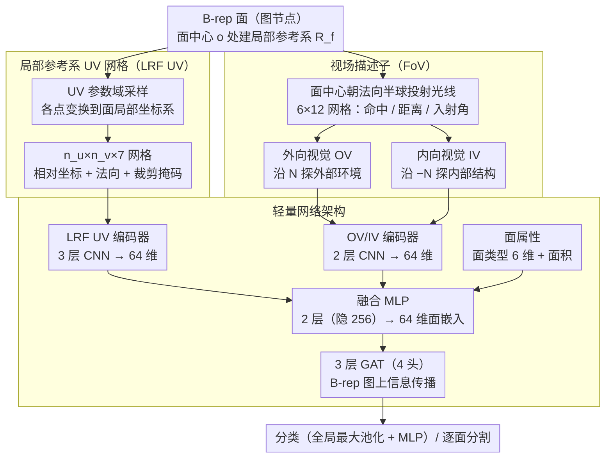

# FoV-Net: Rotation-Invariant CAD B-rep Learning via Field-of-View Ray Casting

**会议**: CVPR 2026  
**arXiv**: [2602.24084](https://arxiv.org/abs/2602.24084)  
**代码**: [GitHub](https://github.com/UGent-CVAMO/fovnet)  
**领域**: 分割  
**关键词**: CAD B-rep 学习, 旋转不变性, 光线投射, 图注意力网络, 3D 分割

## 一句话总结

提出 FoV-Net，首个在 CAD B-rep 学习中同时捕获局部表面几何和全局结构上下文的旋转不变框架，通过局部参考系 UV 网格(LRF UV)和视场光线投射(FoV)描述子实现了在任意 $\mathbf{SO}(3)$ 旋转下的鲁棒分类和分割。

## 研究背景与动机

CAD 边界表示(B-rep)为图结构，面为节点、共享边为连接，天然适合 GNN 处理。现有 B-rep 学习方法的核心挑战在于设计既能捕获局部表面几何又能编码全局结构上下文的描述子。

UV-Net 开创性地将 UV 参数域采样为网格，存储全局坐标系下的绝对坐标 $(x,y,z)$ 和法向量 $(n_x, n_y, n_z)$，成为后续许多方法的基础。然而这种依赖全局坐标的方式带来了严重的**旋转敏感性**问题。作者的实验揭示了一个惊人的现象：

> 在对齐基准上准确率超过 95% 的模型，在任意 $\mathbf{SO}(3)$ 旋转下可能**崩塌至 10%**。

这在实际制造流水线中是不可接受的——CAD 模型来自不同来源，分析必须对任意朝向鲁棒。旋转增强虽能部分缓解但无法覆盖所有旋转且有计算成本。更重要的是，即使在对齐数据上，旋转不变性对分割任务也至关重要：面在不同位置的变化可能导致虚假的位姿关联，在小数据场景下损害泛化能力。

## 方法详解

### 整体框架

FoV-Net 想解决的是：怎么给 B-rep 的每个面算出一个**既懂自身几何、又懂周围结构，且在任意旋转下纹丝不动**的描述子。它的做法是给每个面配两套互补的输入——一套只看面自己的局部表面形状（LRF UV 网格），一套用光线投射去"看"这个面周围有什么（FoV 网格）。两套描述子各由一个轻量 CNN 抽成特征向量，再和面的基本属性（类型、面积）拼起来，过一个 MLP 融合成统一的面嵌入。把每个面的嵌入挂到 B-rep 图的节点上（面为节点、共享边为连接），最后用 3 层图注意力网络(GAT)在图上传播信息，得到分类或逐面分割结果。关键在于：两套描述子的坐标和方向都定义在**面自己的局部坐标系**里，所以整个模型对全局朝向天然免疫。

### 关键设计

**1. 局部参考系 UV 网格(LRF UV)：把局部几何从全局位姿里解耦出来**

UV-Net 那一脉的方法把 UV 参数域采样成网格，再存全局坐标系下的绝对坐标 $(x,y,z)$ 和法向量——这正是旋转一来就崩盘的根源，因为整个零件转个角度，所有坐标全变了。FoV-Net 的改法是：不存全局坐标，改存**面局部坐标系里的相对坐标**。具体地，在面中心 $\mathbf{o}$ 处建一组正交基——法向量 $\mathbf{N}$、U 方向切向量投影归一化得到的 $\mathbf{U}$、以及 $\mathbf{V} = \mathbf{N} \times \mathbf{U}$，组成旋转矩阵 $\mathbf{R}_f$，然后把网格上每个采样点 $\mathbf{p}$ 变换到局部系：

$$\mathbf{p}' = \mathbf{R}_f^\top (\mathbf{p} - \mathbf{o})$$

无论整个零件怎么转，同一个面相对自己的参考系是不动的，所以变换后得到的描述子完全一致。最终每个面是一个 $n_u \times n_v \times 7$ 的张量（相对坐标 3 维 + 法向量 3 维 + 裁剪掩码 1 维）。之所以在 B-rep 上做 LRF 比在点云上靠谱，是因为 B-rep 面本身就带着面片的参数化离散和一个明确的参考方向，不像点云那样要从带噪邻域里现算 LRF、还常常前后不一致。

**2. 视场(FoV)描述子：用光线投射把丢掉的结构上下文捞回来**

LRF UV 解决了旋转问题，但代价是只看得见面自己、看不见周围——一个面孤立地长什么样，远不足以判断它在零件里扮演什么角色。FoV 的思路是借计算机图形学里的光线投射：站在面中心 $\mathbf{o}$ 朝法向半球发射一束光线，按仰角和方位角离散成网格（默认 $6 \times 12$，对应 15° 和 30° 的步长），每条光线记三个量——是否命中、到交点的距离、以及光线方向与命中处表面法向的点积（编码入射角）。因为光线的原点和方向都定义在局部参考系里，它们会跟着面一起旋转，所以这套"环顾四周"的描述子同样旋转不变，而且因为只关心相对距离，还天然平移不变。

这里再分两个方向各投一遍：**外向视觉(OV)** 沿 $\mathbf{N}$ 探测面外部的环境，**内向视觉(IV)** 沿 $-\mathbf{N}$ 探测实体内部——对水密实体，内向光线几乎必然密集相交，能给出非常丰富的内部距离信息。举个直观的例子：一个嵌在槽里的平面，它的外向光线很快撞到槽壁、距离很短，内向光线则一路穿过实体材料，两组距离的对比就把"这是个凹槽底面"这件事编码进了描述子。OV 和 IV 一外一内互补，合起来才是这个面完整的 3D 上下文。

**3. 轻量网络架构：刻意做小，并砍掉收益微弱的边特征**

三套输入各配一个小 CNN 抽特征：OV/IV 编码器是 2 层 CNN（$32 \to 64$ 通道）接全局平均池化、线性投影到 64 维，方位轴上用圆形填充来处理角度的周期性；LRF UV 编码器是 3 层 CNN（$32 \to 64 \to 128$）接全局平均池化到 64 维；面属性则是独热的面类型(6 维) 加面积，共 7 维。三路特征拼接后过一个 2 层融合 MLP（隐藏维 256）压成 64 维面嵌入，再交给 3 层、4 头的 GAT 在 B-rep 图上做信息传播。值得一提的是模型刻意省掉了边特征——消融显示加上边特征的增益极小，省掉它换来更低的计算开销，对一个面向工业流水线的方法来说是合算的取舍。

### 损失函数 / 训练策略

- 分类：全局最大池化 + 2 层 MLP 分类头
- 分割：面嵌入直接送入逐面预测头
- 优化器：Adam (lr=0.001, batch size 64)，早停策略 (patience 30)
- 单卡 NVIDIA RTX A5000(24GB)，每组实验重复 5 次取均值±标准差

## 实验关键数据

### 主实验

| 数据集 | 任务 | 指标 | FoV-Net (旋转) | FoV-Net (原始) | UV-Net (旋转) | AAGNet (旋转) |
|--------|------|------|----------------|----------------|---------------|---------------|
| SolidLetters | 分类 | Acc% | **96.35** | 96.35 | 8.94 | 14.03 |
| TraceParts | 分类 | Acc% | **100.00** | 100.00 | 45.67 | 91.33 |
| Fusion360 | 分割 | Acc% | **91.72** | 91.72 | 69.13 | 79.85 |
| Fusion360 | 分割 | IoU% | **73.81** | 73.81 | 37.07 | 53.42 |
| MFCAD++ | 分割 | Acc% | **99.33** | 99.33 | 35.44 | 80.13 |
| MFCAD++ | 分割 | IoU% | **97.81** | 97.81 | 18.79 | 64.70 |

FoV-Net 旋转前后性能完全一致；UV-Net 在 SolidLetters 上从 97.10% 崩塌到 8.94%。

### 消融实验

| 配置 | SolidLetters Acc% | 说明 |
|------|-------------------|------|
| FoV-Net 完整 | 96.35 | LRF UV + FoV 互补 |
| 仅 FoV 网格 | 95.79 | 结构上下文信息丰富 |
| 仅 LRF UV | 94.39 | 局部几何也很强 |
| 仅 OV | 92.92 | 外部视觉 |
| 仅 IV | 93.40 | 内部视觉略优于外部 |
| 仅面属性 | 70.68 | 简单属性不够 |
| 仅拓扑 | 37.72 | 图结构远远不够 |

### 关键发现

- FoV 网格和 LRF UV 高度互补，组合优于任一单独使用
- 即使很小的 FoV 分辨率（如 $4 \times 2$）也能产生有效特征；但单条光线($1 \times 1$)崩塌至 75%
- **数据效率惊人**：FoV-Net 在 MFCAD++ 上仅用 50 个样本即达 80% 准确率，UV-Net 需要约 10000 个样本
- 旋转增强虽提升旋转鲁棒性，但代价是整体性能下降——FoV-Net 避免了这种权衡

## 亮点与洞察

1. **问题揭示力度强**：首次系统量化了 B-rep 学习中旋转敏感性的严重程度，95%→10% 的崩塌极具冲击力
2. **光线投射用于描述子构建**：将计算机图形学的经典技术创造性地引入 B-rep 学习，利用 CAD 内核的精确求交能力，从面中心观察周围结构
3. **内/外双视觉互补**：外向光线探测环境、内向光线探测内部结构，两者组合提供完整的 3D 上下文
4. **B-rep 面的 LRF 优势**：B-rep 面天然提供参数化和参考方向，LRF 构建比点云简单得多且更可靠
5. **数据效率**：在工业 CAD 领域（知识产权限制数据可用性），低数据需求是重要优势

## 局限与展望

- 光线投射基于 PythonOCC CAD 内核（CPU），仅支持 CPU 并行化，未利用 GPU 加速
- 当前实验聚焦于中等复杂度的单零件 B-rep，更大装配体的可扩展性待验证
- FoV 网格使用等角 3D→2D 映射，存在类似地理投影的极点畸变，球面 CNN 可能提供更均匀的方向参数化
- 未处理 UV 轴翻转/交换带来的歧义性（UV-Net 通过 D2 等变卷积缓解）
- 省略了边特征，在 B-rep 生成等边特征是关键的任务中可能受限

## 相关工作与启发

- UV-Net 开创了 UV 网格范式但未解决旋转问题——FoV-Net 通过 LRF 转换彻底解决
- 点云旋转不变方法（如 LRF + 全局上下文组合）的思路被成功迁移到 B-rep 域
- 光线投射在 CAD 领域已有工具可达性估计的应用，FoV-Net 将其扩展为通用的面描述子
- FoV 描述子在对比学习预训练和无监督 CAD 检索中有很大潜力

## 评分

- 新颖性: ⭐⭐⭐⭐⭐ 首个旋转不变的 B-rep 学习框架，光线投射描述子的思路非常新颖
- 实验充分度: ⭐⭐⭐⭐⭐ 四个数据集、分类+分割、旋转/原始对比、详细消融、数据效率分析
- 写作质量: ⭐⭐⭐⭐⭐ 问题揭示有力，可视化清晰，结构严谨
- 价值: ⭐⭐⭐⭐⭐ 解决了 B-rep 学习中长期存在的旋转敏感性问题，工业应用前景广阔

<!-- RELATED:START -->

## 相关论文

- [\[CVPR 2026\] Pointer-CAD: Unifying B-Rep and Command Sequences via Pointer-based Edges & Faces Selection](pointer-cad_unifying_b-rep_and_command_sequences_via_pointer-based_edges_faces_s.md)
- [\[CVPR 2026\] Unified Spherical Frontend: Learning Rotation-Equivariant Representations of Spherical Images from Any Camera](unified_spherical_frontend_learning_rotation-equivariant_representations_of_sphe.md)
- [\[CVPR 2026\] Learning Cross-View Object Correspondence via Cycle-Consistent Mask Prediction](learning_cross-view_object_correspondence_via_cycle-consistent_mask_prediction.md)
- [\[CVPR 2026\] PRUE: A Practical Recipe for Field Boundary Segmentation at Scale](prue_a_practical_recipe_for_field_boundary_segmentation_at_scale.md)
- [\[CVPR 2026\] XSeg: A Large-scale X-ray Contraband Segmentation Benchmark for Real-World Security Screening](xseg_a_large-scale_x-ray_contraband_segmentation_benchmark_for_real-world_securi.md)

<!-- RELATED:END -->
