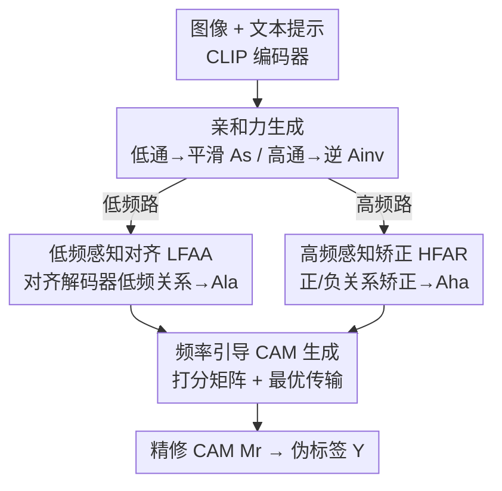

# Frequency-Aware Affinity for Weakly Supervised Semantic Segmentation

**会议**: CVPR 2026  
**论文**: [CVF Open Access](https://openaccess.thecvf.com/content/CVPR2026/html/Yang_Frequency-Aware_Affinity_for_Weakly_Supervised_Semantic_Segmentation_CVPR_2026_paper.html)  
**代码**: 有（原文标注 "Code is available here"，未给明确仓库链接）  
**领域**: 弱监督语义分割  
**关键词**: 弱监督语义分割, CAM 精修, 频域亲和力, 最优传输, CLIP  

## 一句话总结
针对 ViT 自注意力作为低通滤波器导致亲和力（affinity）只能扩散物体内部、丢失边界的问题，本文提出双频感知框架 DFA：用低频亲和力对齐物体内部语义、用高频（逆）亲和力矫正物体边界，再用基于最优传输的频率引导 CAM 生成把"生成 + 精修"合并成一步，在 PASCAL VOC（val 79.3% mIoU）和 MS COCO（val 51.5%）上刷新单阶段弱监督分割 SOTA。

## 研究背景与动机
**领域现状**：弱监督语义分割（WSSS）只用图像级标签训练，靠类激活图（CAM）给出像素级定位、产生伪标签来监督分割头。但原始 CAM 只激活物体最判别的局部区域（比如鸟身体而非整只鸟），监督信号稀疏。主流补救手段是用 ViT / CLIP 自注意力构造 patch token 之间的亲和力矩阵，把判别区域的激活沿语义一致的方向扩散开，从而扩大物体覆盖、提升伪标签质量。

**现有痛点**：ViT 的自注意力机制本质上是一个**低通滤波器**，会对 token 特征做平滑。这种平滑会压制对应细粒度细节（物体边界、类间区分）的高频信号，使得到的亲和力被低频成分主导。结果是：亲和力能在物体内部均匀区域传播语义，却无法精修复杂的边界——精修后的 CAM 内部激活完整了，但边界过激活、漫进背景。

**核心矛盾**：低频亲和力（来自低通滤波）擅长内部、烂在边界；而高频亲和力（来自高通滤波）恰好相反——它能保留边界激活、显著抑制背景噪声，但缺了低频语义先验就维持不住物体内部的连贯激活，且自身还残留背景噪声关系，无法直接用于精修。两类亲和力**强弱互补**，但没人把它们正确地统一起来。

**本文目标**：把这两种互补亲和力各自"提纯"成可直接使用的频率感知形式，并在合适的监督下融合，既保内部一致又保边界精度；同时简化掉传统"先粗 CAM、再多步精修"的复杂流水线。

**切入角度**：作者明确把自注意力视为低通滤波器、把它在频域的谱反演视为高通滤波器，从而一次拿到 smoothed affinity 与 inverse affinity 两路。再借解码器特征天然能分解出低/高频成分，分别给两路亲和力提供监督信号。

**核心 idea**：用"低频对齐内部 + 高频矫正边界 + 最优传输一步出图"替代"单一平滑亲和力 + 多步精修"，让 CAM 同时具备内部完整与边界精确。

## 方法详解

### 整体框架
DFA 是一个**单阶段、仅需图像级监督**的框架。输入是一张图与 C 个类别的文本提示，经冻结的 CLIP（ViT-B/16）图像/文本编码器得到 patch token 特征 $F\in\mathbb{R}^{d\times hw}$ 和文本特征 $T_f\in\mathbb{R}^{C\times d}$。框架先从自注意力（低通）抽取平滑亲和力 $A_s$、从其频域反演（高通）抽取逆亲和力 $A_{inv}$；两路各经一个 MLP 变为可学习。随后 **LFAA 模块**把 $A_s$ 对齐到解码器低频特征关系上得到低频感知亲和力 $A_{la}$（强化内部一致），**HFAR 模块**借高频特征关系、伪标签和移位窗口识别正/负关系来矫正 $A_{inv}$ 得到高频感知亲和力 $A_{ha}$（强化边界）。最后 **FG CAM 生成模块**把 $A_{la}$、$A_{ha}$ 与图文相似度融成一个打分矩阵，在最优传输（OT）优化下把 token 特征分配给目标类，**一步**生成精修后的 CAM，伪标签由此导出。

### 关键设计

**1. 双路频域亲和力生成：把自注意力拆成低通 + 高通互补两路**

传统方法只用一条 ViT 自注意力（低通）做亲和力，结果被低频成分主导、边界丢失。本文从同一个注意力出发同时拿到两路互补信号。先用 query-key 点积得到标准注意力 $W=\mathrm{Softmax}\!\left(\frac{QK^{\mathrm T}}{\sqrt d}\right)$；再把 $W$ 经傅里叶变换搬到频域，从全通滤波器 $\mathbb{I}$ 中减去它、做逆变换得到高通的逆注意力：

$$W_{inv}=\mathcal{F}^{-1}\big(\mathbb{I}-\mathcal{F}(W)\big)$$

两个注意力经 MLP 后仍非对称，再用 Sinkhorn 归一化后对称化为亲和力：

$$A_s=\tfrac{1}{2}\big(\mathrm{Norm}(W')+\mathrm{Norm}(W')^{\mathrm T}\big),\quad A_{inv}=\tfrac{1}{2}\big(\mathrm{Norm}(W'_{inv})+\mathrm{Norm}(W'_{inv})^{\mathrm T}\big)$$

$A_s$（smoothed affinity）抓物体主体结构关系，$A_{inv}$（inverse affinity）抓边界细节关系。这一步的巧妙在于：高频路不是另训一个分支，而是低频路在频域上的**谱反演**，几乎零额外参数就拿到互补视角。

**2. 低频感知对齐 LFAA：用解码器低频关系当老师，把稀疏内部关系补稠密**

平滑亲和力 $A_s$ 因过度平滑导致 token 同质化，内部语义关系稀疏。LFAA 让 $A_s$ 去对齐一个更稠密的分布——来自训练中解码器特征的低频关系。具体地，按 FFR 把解码器 patch 特征 $F_d$ 变到频域、用区域比例掩掉高频成分、逆变换得低频特征 $F_{ld}$，它代表物体结构信息，恰好和以低频为主的 $A_s$ 对应；低频特征关系为 $S_l=\mathrm{Sigmoid}(F_{ld}^{\mathrm T}F_{ld})$。

由于解码器训练中持续更新，早期关系不可靠，作者用**选择性对齐**只迁移最自信、最稠密的关系：构造掩码 $M_d^{i,j}=1$ 当且仅当 $S_l^{i,j}>\alpha$（$\alpha$ 为由 $A_s$ 与 $S_l$ 之差累加得到的质量值）。然后把 $S_l$ 当 teacher，用带掩码的 KL 散度对齐损失把稠密分布知识蒸给 $A_s$：

$$\mathcal{L}_a=\frac{1}{\sum_{i,j}M_d^{i,j}}\sum_{i,j}M_d^{i,j}\,\tilde S_l^{i,j}\log\frac{\tilde S_l^{i,j}}{\tilde A_s^{i,j}}$$

其中 $\tilde S_l$、$\tilde A_s$ 是行 softmax 归一化后的分布。在 $\mathcal{L}_a$ 引导下 $A_s$ 逐渐逼近稠密分布、把关键语义关系从无关关系中区分出来，refine 成低频感知亲和力 $A_{la}$，从而增强物体内部的一致与连贯。

**3. 高频感知矫正 HFAR：用伪标签 + 高频关系 + 移位窗口给逆亲和力去噪**

逆亲和力 $A_{inv}$ 虽含边界关系，但残留大量背景及语义无关的噪声关系，不能直接用。HFAR 的目标是**增强正关系、抑制负关系**。它用解码器分解出的高频特征 $F_{hd}$（由总特征减去低频得到，代表边界细节）算高频关系 $S_h=\mathrm{Sigmoid}(F_{hd}^{\mathrm T}F_{hd})$，再结合伪标签 $Y$ 作为交叉条件挑选可靠关系：

$$M_+^{i,j}=\begin{cases}1,& S_h^{i,j}>\overline{S_h}\ \text{且}\ Y^i=Y^j\\0,&\text{否则}\end{cases}\qquad M_-^{i,j}=\begin{cases}1,& S_h^{i,j}\le\overline{S_h}\ \text{且}\ Y^i\neq Y^j\\0,&\text{否则}\end{cases}$$

即"高频关系强且同类"判为可靠正关系，"高频关系弱且异类"判为可靠负关系。对于 $S_h$ 与 $Y$ 不一致而仍然模糊的关系，作者再加一个**移位窗口**：利用相邻 patch 的结构一致性，若一个模糊关系的窗口邻域内关系强正，则把它也判为正并强化（细节在补充材料）。最后用矫正损失把正关系拉向 1、负关系压向 0：

$$\mathcal{L}_r=\frac{1}{\sum_{i,j}M_+^{i,j}}\sum_{i,j}M_+^{i,j}\big(1-A_{inv}^{i,j}\big)+\frac{1}{\sum_{i,j}M_-^{i,j}}\sum_{i,j}M_-^{i,j}A_{inv}^{i,j}$$

经此 $A_{inv}$ 被 refine 成高频感知亲和力 $A_{ha}$，精确捕获边界信息。

**4. 频率引导 FG CAM 生成：用打分矩阵 + 最优传输把"生成 + 精修"合并成一步**

传统 CLIP-WSSS 先用 Grad-CAM / patch-text 对齐出粗 CAM，再用亲和力多步精修甚至迭代后处理，复杂且跨阶段误差累积。本文把"图像 token 特征 $F$ 分配给文本特征 $T_f$"建模为一个最优传输（OT）问题，并把常规代价矩阵换成由两路频率感知亲和力构成的**打分矩阵**：

$$O^{i,c}=\lambda_l\sum_{j=1}^{hw}A_{la}^{i,j}S^{j,c}+\lambda_h\bar A_{ha}^{i}$$

其中 $S\in\mathbb{R}^{hw\times C}$ 是图文相似度图，$\bar A_{ha}$ 是经 max-sum 归一化后的高频亲和力，$\lambda_l,\lambda_h$ 平衡两路。打分矩阵融合了三要素：目标类、低频关系、高频关系——分数高意味着该 token 既含强目标类信息，又被可靠的低/高频关系支持，优先在 OT 计划中被分配。为把更多 token 引向目标类，还对文本分布加了目标类边际约束 $v=\mathrm{Softmax}(x),\ x_c=\sum_i S^{i,c}$。最终求解 OT 计划：

$$T^{*}=\arg\max_{T}\sum_{i,c}T^{i,c}O^{i,c},\quad \text{s.t.}\ T\mathbf{1}_C=\tfrac{1}{hw}\mathbf{1}_{hw},\ T^{\mathrm T}\mathbf{1}_{hw}=v$$

用 Sinkhorn 距离快速优化得到概率转移矩阵 $T^*$，再 max 归一化生成 CAM：$M_r^{i,c}=T^{*\,i,c}/\max(T^{*,:,c})$。这一步同时保证内部一致（$A_{la}$）、类间可分（图文相似度）、边界精确（$A_{ha}$），把生成与精修压成单步，省掉复杂后处理。

### 损失函数 / 训练策略
总目标融合分割损失、分布对齐损失、关系矫正损失：

$$\mathcal{L}_{DFA}=\mathcal{L}_{seg}+\lambda_1\mathcal{L}_a+\lambda_2\mathcal{L}_r$$

实现上用冻结 CLIP ViT-B/16 + 轻量 transformer 解码头，AdamW 优化，输入裁到 $320\times320$，窗口大小 $r=9$；打分矩阵中 $\lambda_l=1,\ \lambda_h=0.1$，总权重 $\lambda_1=0.1,\ \lambda_2=0.2$。VOC 用 batch 4 训 3 万步，COCO 用 batch 8 训 8 万步，学习率 1e-4、权重衰减 1e-2；推理用 Dense CRF + 多尺度（1.0/1.2/1.5）。

## 实验关键数据

### 主实验
CAM 种子（Seed）与伪标签（Mask）质量对比，PASCAL VOC train split：

| 方法 | 监督 | Backbone | Seed | Mask |
|------|------|----------|------|------|
| CLIP-ES (CVPR'23) | I+L | RN101 | 70.8 | 75.0 |
| ToCo (CVPR'23) | I | ViT-B | 71.6 | 72.2 |
| POT (CVPR'25) | I+L | RN50 | 75.0 | 79.3 |
| ExCEL (CVPR'25) | I+L | ViT-B | 78.0 | - |
| **Ours (DFA)** | I+L | ViT-B | **79.1** | **80.8** |

最终分割 mIoU 对比（VOC val/test 与 COCO val）：

| 方法 | 类型 | Backbone | VOC val | VOC test | COCO val |
|------|------|----------|---------|----------|----------|
| PSDPM (CVPR'24) | 多阶段 | RN101 | 74.1 | 74.9 | 47.2 |
| POT (CVPR'25) | 多阶段 | RN50 | 76.1 | 76.7 | 47.9 |
| WeCLIP (CVPR'24) | 单阶段 | ViT-B | 76.4 | 77.2 | 47.1 |
| ExCEL (CVPR'25) | 单阶段 | ViT-B | 78.4 | 78.5 | 50.3 |
| **Ours (DFA)** | 单阶段 | ViT-B | **79.3** | **79.8** | **51.5** |

DFA 在 CAM 质量上比上一代 SOTA ExCEL 高 1.1%；最终分割相比多阶段 PSDPM 在 VOC val / COCO val 分别领先 5.2% / 4.3%，且单阶段、无需复杂后处理。

### 消融实验
各模块有效性（VOC train，M 为 CAM mIoU%；E(⊙) 为传统逐元素乘精修）：

| # | $A_s$ | $A_{inv}$ | $A_{la}$ | $A_{ha}$ | E(⊙) | FG | M |
|---|------|------|------|------|------|------|------|
| 0 | ✓ | | | | ✓ | | 64.8 |
| 1 | ✓ | ✓ | | | ✓ | | 67.2 |
| 2 | | | ✓ | | ✓ | | 75.1 |
| 3 | | | ✓ | ✓ | ✓ | | 77.9 |
| 4 | | | ✓ | ✓ | | ✓ | **79.1** |

### 关键发现
- **逆亲和力确有互补价值**：#0→#1 仅把 $A_{inv}$ 加进传统精修就涨 2.4%（64.8→67.2），印证高频边界关系是有用补充。
- **对齐 + 矫正是涨点主力**：换成 refine 过的 $A_{la}+A_{ha}$（#3）相比 #1 大涨到 77.9%，说明两个监督损失把粗亲和力提纯成精确关系是关键。
- **FG CAM 生成优于传统精修**：#3→#4 用 OT 打分矩阵替换逐元素乘精修，再涨 1.2%（77.9→79.1），证明把生成与精修统一成一步比传统多步精修更有效、还省掉误差累积。
- 可视化上 DFA 同时改善低频亲和力的密度/显著性、并矫正逆亲和力，CAM 内部连贯且边界清晰，缓解低通的过激活。

## 亮点与洞察
- **把自注意力当低通、谱反演当高通**：用一行频域减法 $\mathbb{I}-\mathcal{F}(W)$ 就从同一注意力派生出互补的高频亲和力，几乎零额外参数，思路干净，可迁移到任何依赖注意力亲和力的任务（如弱监督检测、共显著）。
- **解码器自带"频率老师"**：低/高频特征关系来自正在训练的解码器，省掉额外网络就给两路亲和力提供监督，且 teacher 随训练变强，是一种自蒸馏式的频域监督。
- **把 CAM 生成重写成 OT 分配**：用打分矩阵替换代价矩阵、加目标类边际约束，把"粗图 + 多步精修"压成单步 Sinkhorn 求解，既提质又提效——这种"用 OT 统一生成与精修"的范式对其它伪标签生成任务有借鉴意义。

## 局限与展望
- 框架依赖冻结 CLIP（ViT-B/16）作编码器，性能与 CLIP 的图文对齐质量绑定，换更弱编码器或开放域类别时的表现未验证。
- HFAR 的移位窗口正负关系判定细节放在补充材料，正文未给完整算法；其对窗口大小 $r=9$ 的敏感性与对噪声伪标签的鲁棒性缺乏正文消融（⚠️ 以原文/补充材料为准）。
- 频域分解依赖"区域比例掩高频"等阈值/超参（$\alpha$、$\lambda_l/\lambda_h$、$\lambda_1/\lambda_2$），跨数据集是否需重调、对不同物体尺度是否稳健未深入分析。
- 作者展望探索更强的 WSSS CAM 生成方式；可进一步把双频思路扩展到多类别重叠、小目标密集等更难场景。

## 相关工作与启发
- **vs ViT 自注意力亲和力（如 AFA / ToCo）**：它们只用低通的平滑亲和力扩散激活，内部好、边界差；DFA 额外引入高频逆亲和力并分别监督，补齐边界短板。
- **vs CLIP-ES / ExCEL**：同为 CLIP-WSSS，但它们仍走"Grad-CAM / patch-text 粗图 + 精修"路线；DFA 用 OT 打分矩阵把生成与精修合并成单步，CAM 质量超 ExCEL 1.1%。
- **vs POT / DHR（OT-WSSS）**：POT 用相似度边际约束把特征分到类原型、DHR 用 OT 平衡类间区域；DFA 的不同在于把**频率感知亲和力**塞进 OT 的打分矩阵，让传输同时受低/高频关系引导，而非只靠相似度。
- **vs PCSS / FFR（频域 WSSS）**：它们用相位集中或频域正则缓解捷径学习；DFA 把频域用在"构造互补亲和力"上，落点不同。

## 评分
- 新颖性: ⭐⭐⭐⭐⭐ 把自注意力低通/谱反演高通互补 + OT 打分矩阵统一生成精修，视角新且自洽。
- 实验充分度: ⭐⭐⭐⭐ VOC/COCO 双基准刷 SOTA、消融逐项拆清，但缺窗口大小与鲁棒性正文消融。
- 写作质量: ⭐⭐⭐⭐ 动机—互补性—三模块逻辑清晰，公式完整；部分关键细节下放补充材料。
- 价值: ⭐⭐⭐⭐⭐ 单阶段、无复杂后处理即刷新 WSSS SOTA，OT 统一范式对伪标签生成有迁移价值。

<!-- RELATED:START -->

## 相关论文

- [\[CVPR 2026\] Leveraging Class Distributions in CLIP for Weakly Supervised Semantic Segmentation](leveraging_class_distributions_in_clip_for_weakly_supervised_semantic_segmentati.md)
- [\[CVPR 2026\] Beyond Text: Visual Description Assembly by Probabilistic Model for CLIP-based Weakly Supervised Semantic Segmentation](beyond_text_visual_description_assembly_by_probabilistic_model_for_clip-based_we.md)
- [\[CVPR 2026\] FCL-COD: Weakly Supervised Camouflaged Object Detection with Frequency-aware and Contrastive Learning](fcl-cod_weakly_supervised_camouflaged_object_detection_with_frequency-aware_and_.md)
- [\[AAAI 2026\] SSR: Semantic and Spatial Rectification for CLIP-based Weakly Supervised Segmentation](../../AAAI2026/segmentation/ssr_semantic_and_spatial_rectification_for_clip-based_weakly_supervised_segmenta.md)
- [\[CVPR 2026\] Hierarchical Action Learning for Weakly-Supervised Action Segmentation](hierarchical_action_learning_for_weakly-supervised_action_segmentation.md)

<!-- RELATED:END -->
