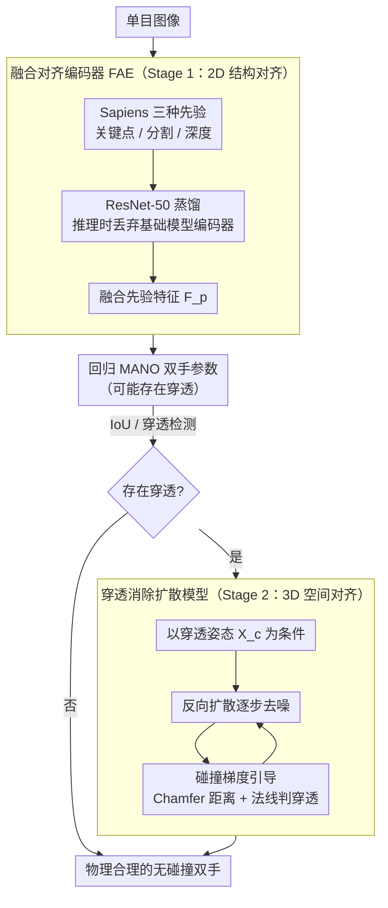

# From 2D Alignment to 3D Plausibility: Unifying Heterogeneous 2D Priors and Penetration-Free Diffusion for Occlusion-Robust Two-Hand Reconstruction

**会议**: CVPR 2026  
**arXiv**: [2503.17788](https://arxiv.org/abs/2503.17788)  
**代码**: [项目页](https://gaogehan.github.io/A2P/)  
**领域**: 分割 / 3D手部重建  
**关键词**: 双手重建, 2D先验融合, 扩散模型, 穿透消除, 遮挡鲁棒

## 一句话总结

将双手重建解耦为 2D 结构对齐（融合关键点/分割/深度先验）和 3D 空间交互对齐（穿透消除扩散模型），在 InterHand2.6M 上 MPJPE 达到 5.36mm，大幅超越 SOTA。

## 研究背景与动机

单目图像双手重建面临两大核心挑战：(1) 复杂姿态和严重遮挡导致 **2D-3D 对应关系模糊**，现有方法缺乏有效的结构引导；(2) 双手交互场景中频繁出现 **手部穿透**（interpenetration），现有方法没有专门的去穿透机制。

尽管视觉基础模型（如 Sapiens）在关键点检测、分割、深度估计方面表现优异，但直接微调这些大模型代价高昂，且 2D 先验在遮挡下不完全可靠。同时，扩散模型虽可建模交互先验，但需要准确的观测对齐才能避免退化。

作者的核心洞察是：**2D 对齐和 3D 对齐需要分治处理**——先用异构 2D 先验对齐结构，再用生成模型在 3D 空间中消除穿透。

## 方法详解

### 整体框架

两阶段 pipeline：Stage 1 为 2D 多模态先验对齐，将关键点、分割、深度三种基础模型特征融合后指导手部参数回归；Stage 2 为 3D 穿透消除扩散模型，将穿透的双手姿态映射到物理合理的无碰撞配置。两阶段之间用 IoU / 穿透检测做门控——只有真正发生穿透的样本才进入 Stage 2 扩散，避免对无碰撞结果做冗余推理。

### 关键设计

1. **融合对齐编码器（Fusion Alignment Encoder, FAE）**：核心是用一个轻量 ResNet-50 编码器在训练时蒸馏来自 Sapiens 基础模型的三种先验特征（关键点 $\mathbf{F}_k$、分割 $\mathbf{F}_s$、深度 $\mathbf{F}_d$）。融合特征 $\mathbf{F}_p = \text{Proj}(\mathbf{F}_k, \mathbf{F}_s, \mathbf{F}_d)$ 通过可学习投影层统一。FAE 用 MSE 损失对齐 $\mathbf{F}_{fa}$ 和 $\mathbf{F}_p$。**推理时移除所有基础模型编码器**，实现 encoder-free 部署——保持多先验精度的同时大幅降低计算开销。这一"训练时蒸馏、推理时丢弃"的策略非常巧妙。

2. **穿透消除扩散模型（Two-Hand Penetration-Free Diffusion Model）**：基于 Transformer 架构的扩散模型，以穿透的双手 MANO 参数 $\mathbf{X}_c$ 为条件，学习从穿透姿态到无碰撞姿态的生成映射。训练数据通过两种方式构造：(a) 低性能模型预测的穿透结果；(b) 对 GT 施加微小噪声直到穿透发生。扩散损失为 $\mathcal{L}_{diffusion} = \|\mathbf{X}_0 - \mathcal{D}(\mathbf{X}_t, \mathbf{X}_c)\|_2$。推理时先做 IoU 和穿透检测，仅对确实存在穿透的样本启动扩散（减少不必要的推理开销）。

3. **碰撞梯度引导（Collision Gradient Guidance）**：在反向扩散的每一步引入碰撞梯度引导。具体地，从 $\mathbf{X}_{t-1}$ 经 DDIM 采样得到 $\hat{\mathbf{X}}_0$，通过 MANO 模型获取网格顶点，用混合距离-方向准则检测碰撞：先计算 Chamfer 距离 $\mathbf{N}_{ij} = |\mathbf{V}_{t-1}^i - \mathbf{V}_c^j|^2$ 筛选近邻顶点对，再用法线余弦相似度 $\cos(\theta_{ij})$ 判断穿透。碰撞损失使用 GMoF 鲁棒函数，通过梯度下降更新 $\hat{\mathbf{X}}_0 = \hat{\mathbf{X}}_0 - \lambda(\delta_i \mathcal{L}_{collision})$。

### 损失函数 / 训练策略

- **手部回归损失** $\mathcal{L}_{hand}$：L1 距离监督 MANO 参数、3D/2.5D 关节坐标、3D 相对平移
- **先验对齐损失** $\mathcal{L}_{prior}(\mathbf{F}_p, \mathbf{F}_{fa})$：MSE 蒸馏 FAE
- **总损失** $\mathcal{L}_{total} = \mathcal{L}_{hand} + \mathcal{L}_{prior}$
- 扩散模型单独训练，MDM 风格扩散过程，1000 步噪声、余弦调度
- 训练硬件 4×A100，AdamW 优化器，lr=1e-4，batch size=48

## 实验关键数据

### 主实验

| 数据集 | 指标 | 本文 | 之前SOTA (4DHands) | 提升 |
|--------|------|------|----------|------|
| InterHand2.6M | MRRPE (mm) | **21.60** | 24.58 | -2.98 |
| InterHand2.6M | MPJPE (mm) | **5.36** | 7.49 | -2.13 |
| InterHand2.6M | MPVPE (mm) | **5.58** | 7.72 | -2.14 |
| HIC | MPJPE (mm) | **6.67** | 9.32 | -2.65 |
| HIC | MPVPE (mm) | **6.93** | 9.93 | -3.00 |

### 消融实验

| 配置 | MPJPE | MPVPE | 说明 |
|------|---------|------|------|
| Baseline | 7.77 | 7.93 | 无额外先验 |
| + Key Points | 6.48 | 6.72 | 2D 关键点先验 |
| + Segmentation | 6.19 | 6.34 | 分割先验叠加 |
| + Depth Prior | 5.74 | 5.98 | 深度先验，Z 方向显著提升 |
| + Penetration-Free Diffusion | **5.36** | **5.58** | 完整模型 |

### 关键发现

- 三种 2D 先验对 XY 和 Z 维度的提升互补：关键点主力 XY，深度主力 Z
- 扩散模型在 IH（交互手）场景效果更为显著
- 在 HIC 数据集（未见数据）上仍大幅超越 SOTA，说明方法泛化性好
- 训练集仅使用少量数据集，远少于 4DHands（3 类双手 + 9 类单手数据集）

## 亮点与洞察

- **训练时蒸馏、推理时丢弃**的 FAE 设计是本文最优雅的贡献——以零额外推理开销获得多先验的结构引导
- 穿透检测使用距离+法线双重准则，比纯距离阈值更鲁棒
- 将去穿透建模为条件生成任务（而非后处理优化），更好地建模了可行交互的流形
- IoU 检测门控避免了对非穿透样本的冗余扩散推理

## 局限与展望

- FAE 依赖 Sapiens 基础模型质量，其在极端遮挡下的先验可能不可靠
- 极端运动模糊下额外 2D 信息可能变得不可靠，作者自己也指出未来可引入时序处理缓解
- 扩散模型在推理时引入额外延迟，虽有 IoU 门控，实时性仍受限（完整模型 18 FPS vs 无扩散 56 FPS）
- 仅针对双手场景，未扩展到手-物交互或全身重建
- 碰撞检测基于网格顶点，精度受网格分辨率限制

## 相关工作与启发

- **WHAM/TRAM**：全身重建中使用 2D 先验的先驱工作，本文将这一思路首次引入双手场景
- **InterHandGen**：扩散先验用于双手生成，但仅作为正则化项；本文直接建模去穿透映射，穿透体积从0.76降至0.11，穿透距离从0.04降至0.01
- **BUDDI**：双人重建中使用扩散先验，本文将类似思路微型化到双手级别
- **Zuo et al.**：用VAE捕获交互先验，但依赖CNN提取交互特征，缺乏强几何约束
- 启发：FAE 的"训练蒸馏-推理丢弃"范式可推广到其他需要多模态先验但追求轻量推理的任务（如人体姿态、手物交互）

## 评分

- 新颖性: ⭐⭐⭐⭐ 首次统一三种异构 2D 先验于双手重建，穿透消除扩散建模新颖
- 实验充分度: ⭐⭐⭐⭐ 三个数据集评估，消融完整，定性对比清晰
- 写作质量: ⭐⭐⭐⭐ 逻辑清晰，两阶段动机阐述充分
- 价值: ⭐⭐⭐⭐ 对双手重建领域具有显著推动作用，FAE 设计范式可推广

<!-- RELATED:START -->

## 相关论文

- [\[CVPR 2026\] Making Training-Free Diffusion Segmentors Scale with the Generative Power](making_training-free_diffusion_segmentors_scale_with_the_generative_power.md)
- [\[ECCV 2024\] PartSTAD: 2D-to-3D Part Segmentation Task Adaptation](../../ECCV2024/segmentation/partstad_2d-to-3d_part_segmentation_task_adaptation.md)
- [\[AAAI 2026\] EAGLE: Episodic Appearance- and Geometry-Aware Memory for Unified 2D-3D Visual Query Localization](../../AAAI2026/segmentation/eagle_episodic_appearance-_and_geometry-aware_memory_for_unified_2d-3d_visual_qu.md)
- [\[CVPR 2025\] Robust 3D Shape Reconstruction in Zero-Shot from a Single Image in the Wild](../../CVPR2025/segmentation/robust_3d_shape_reconstruction_in_zero-shot_from_a_single_image_in_the_wild.md)
- [\[ICML 2026\] Geometry-Preserving Unsupervised Alignment for Heterogeneous Foundation Models](../../ICML2026/segmentation/geometry-preserving_unsupervised_alignment_for_heterogeneous_foundation_models.md)

<!-- RELATED:END -->
