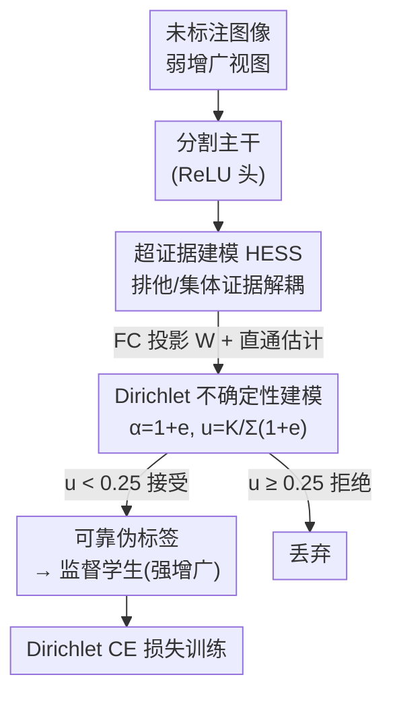

# From Softmax to Dirichlet: Evidential Learning for Semi-supervised Semantic Segmentation

**会议**: CVPR 2026  
**论文**: [CVF Open Access](https://openaccess.thecvf.com/content/CVPR2026/html/Mai_From_Softmax_to_Dirichlet_Evidential_Learning_for_Semi-supervised_Semantic_Segmentation_CVPR_2026_paper.html)  
**代码**: 无  
**领域**: 半监督语义分割  
**关键词**: 证据学习, Dirichlet分布, 不确定性估计, 伪标签筛选, 教师-学生框架

## 一句话总结
针对半监督分割中 softmax 置信度因网络过自信而无法可靠筛选伪标签的问题，本文用证据学习把每像素的类概率建模成 Dirichlet 分布、直接得到原则化的不确定性，并进一步提出 HESS 解耦"排他证据"与"集体证据"，作为即插即用模块接到 UniMatch/UniMatch V2 上，在 Pascal/Cityscapes/COCO 三个基准的低标注设定下稳定涨点（最难的 1/16 划分上最高 +2.3% mIoU）。

## 研究背景与动机

**领域现状**：半监督语义分割（S4）的主流范式是"伪标签 + 一致性正则"装进教师-学生框架：教师对弱增广视图出伪标签，学生在强增广视图上去拟合这些伪标签。框架成败完全取决于伪标签质量——选进训练的伪标签对不对，直接决定了性能上界。

**现有痛点**：当前占主导的筛选方式是 softmax 分数过滤，即取 softmax 输出的最大值 $s_{ij}^u=\max\sigma(f_T(\cdot))$，只保留高于高阈值（如 0.95）的伪标签，背后假设是"高 softmax 分数 ⟺ 低预测不确定性"。但神经网络存在众所周知的**过自信**问题：softmax 分数和伪标签真实准确率的相关性并不强。作者实测在第一个 epoch，softmax 分数与伪标签准确率的 Pearson 相关只有 0.79；即便在分数 >0.95 的最高置信桶里，伪标签准确率也只有 0.81。这意味着大量错误伪标签被当成"高置信"放进训练，污染了后续学习。

**核心矛盾**：softmax 输出本质上只是类概率 $p$ 的一个**点估计** $\hat p=\sigma(f(x))$，它给的是"哪一类最可能"，但**根本没有量化这个预测有多不确定**。靠一个点估计去当不确定性用，自然不可靠。

**本文目标**：找一种能**显式建模**预测不确定性的方式来筛伪标签，而不是间接借用 softmax 分数。直接上贝叶斯推断（变分推断、MC dropout、深度集成）虽然能给不确定性，但都要多次随机前向或训多个模型，开销大、慢。

**切入角度**：作者改用**证据学习（Evidential Learning）**——它根植于 Dempster-Shafer 证据理论，是贝叶斯推断的高效替代，能在单次前向里给出与贝叶斯相当的不确定性量化。

**核心 idea**：跳出 softmax 的单点类概率，转而用一个**关于类概率的高阶分布**（Dirichlet）来刻画"所有可能 softmax 输出"的分布，从分布的统计性质直接读出不确定性；再进一步解耦排他证据与集体证据（HESS），把跨类的结构性不确定性也纳入，让不确定性估计更准。

## 方法详解

### 整体框架

整个方法是对经典 S4 教师-学生框架的一处"外科手术"：**把分割网络末端的 softmax 层换成 ReLU 激活层**，使输出非负、解释为"证据" $e$；证据进一步参数化成 Dirichlet 分布，从分布算出一个有界的不确定性 $u\in[0,1)$，用它（而不是 softmax 分数）来过滤教师的伪标签。在此基础上，作者把单层的"证据"升级为"超证据（hyper-evidence）"：网络先吐出对应**类子集**的超证据 $e^H$，再经一个全连接层投影回单类证据 $e$，这样既能表达"只支持某一类"的排他证据，也能表达"同时支持多类"的集体证据。训练时把交叉熵换成 Dirichlet 期望下的 CE 损失。

HESS 是即插即用的：它不改教师-学生的整体结构，只换掉输出头和损失，因此能直接接到 UniMatch、UniMatch V2 等现成框架上。

### 关键设计

**1. 从 Softmax 到 Dirichlet：用类概率的后验分布读出不确定性**

这一步直击"softmax 只是点估计、不量化不确定性"的痛点。作者把网络输出重新解释为模型从数据里收集到的**证据** $e=[e_1,\dots,e_K]$（每类一个非负值，表示"支持把样本判给该类"的程度），用 ReLU 保证非负。在类概率 $p$ 上放一个**均匀 Dirichlet 先验** $p_{\text{prior}}\sim\mathrm{Dir}(p;\mathbf{1})$（$\alpha=[1,\dots,1]$ 时单纯形上密度处处相等，是最无信息的先验），证据则构成一个关于 $p$ 的多项式似然 $P(x\mid p)=\frac{e_0!}{\prod_i e_i!}\prod_{i=1}^K p_i^{e_i}$。

Dirichlet 是多项分布的共轭先验，所以由贝叶斯定理 $P(p\mid x)\propto P(x\mid p)P(p)$ 得到的后验**仍是 Dirichlet**，且参数恰好是 $p\mid x\sim\mathrm{Dir}(p;\mathbf{1}+e)$。这个结论很符合直觉：证据越积越多，类概率分布就越往主导类集中，含糊样本则分布更平。有了后验，不确定性就能直接从它的统计性质读出来——作者用先验与后验浓度之和的比值作为不确定性：

$$u=\frac{\sum_{i=1}^K \alpha_i^{\text{prior}}}{\sum_{i=1}^K \alpha_i^{\text{posterior}}}=\frac{K}{\sum_{i=1}^K(1+e_i)}$$

证据越多 $u$ 越小，且因证据非负，$u$ 严格落在 $[0,1)$，是个天然有界、便于设阈值的量。换成证据不确定性后，它与伪标签准确率的 Pearson 相关从 softmax 的 0.79 提升到 **0.86**，说明这个量确实更能反映伪标签对不对。这一版框架作者称作 ESS（Evidential S4）。

**2. HESS（Hyper-Evidence）：解耦排他证据与集体证据，让跨类结构性不确定性也被看见**

ESS 已经不错，但它只建模了**排他证据**（exclusive evidence，只支持单个类的证据），忽略了**集体证据**（collective evidence，同时支持多个类的跨类结构线索）。作者举的例子很到位：当模型看到"车轮"这种视觉模式时，它同时支持"truck"和"bus"——这种类子集间共享的不确定性，只靠逐类、孤立的排他证据是刻画不全的，会让不确定性估计失真。

HESS 的做法是把证据升级为**超证据** $e^H$：每个 $e^H$ 对应类集合 $Y$ 的一个**子集** $R$，按子集大小天然区分两种证据：

$$e^H:=\begin{cases}\text{排他证据},& |R|=1\\\text{集体证据},& |R|>1\end{cases}$$

实现上，网络先把特征激活成超证据，再学一个全连接层 $W$ 把超证据投影到 $K$ 个单类。$W$ 编码了"超证据 ↔ 类"的归属关系，用单位阶跃函数 $H(\cdot)$ 来读出第 $i$ 个超证据对应的类子集 $R_i=\{j\mid H(W_{i,j})=1,\ j\in Y\}$。由于 $H(\cdot)$ 不可导，作者借用 VQ-VAE 的**直通估计（straight-through estimator）**：前向用 $H(W)$、反向按 $W$ 传梯度（即 $W+\mathrm{sg}(H(W)-W)$，$\mathrm{sg}$ 为停梯度），保持端到端可训。最后把超证据按下式映射回单类证据，再用 Eq.(8) 算不确定性：

$$e_i=\sum_j \frac{\mathbb{I}(i\in R_j)}{|R_j|}\,e^H_j$$

即每个超证据按其覆盖的类数 $|R_j|$ 均摊给所属各类。这样集体证据被显式纳入，证据感知更完整，不确定性更准——相关性在 ESS 的基础上进一步提升，消融里 1/16 划分从 ESS 的 76.9% 再涨到 77.5% mIoU。

**3. Dirichlet 期望交叉熵损失：让分布上每一点都拟合真值**

既然输出不再是 $p$ 的点估计而是一个分布估计，训练目标也要相应改写：作者要求估计出的类概率分布上**每一个点**都和真值一致，即最小化 CE 损失在 Dirichlet 下的期望 $\min\ \mathbb{E}_{p\sim\mathrm{Dir}(p;1+e)}\big[-\sum_i y_i\log p_i\big]$。借助 Dirichlet 积分的解析性质，这个期望可写成闭式：

$$\ell_{ce}^{dir}=\sum_{j=1}^K y_j\left(\psi\Big(\sum_{i=1}^K\alpha_i\Big)-\psi(\alpha_j)\right)$$

其中 $\psi(\cdot)$ 是 Digamma 函数。把监督损失 Eq.(1) 和一致性正则 Eq.(2) 里的标准 $\ell_{ce}$ 都替换为 $\ell_{ce}^{dir}$，整个证据学习框架就闭环了。这条损失是分布级监督，与前面把输出当分布、用浓度比读不确定性的设定一脉相承，而不是简单在 softmax 上换个公式。

### 损失函数 / 训练策略
总损失沿用教师-学生的 $\mathcal{L}=\mathcal{L}_{sup}+\mathcal{L}_{reg}$，但两项的逐像素交叉熵都换成上面的 $\ell_{ce}^{dir}$；伪标签筛选从"softmax 分数 $>0.95$"改为"不确定性 $u<0.25$"。教师网络可与学生相同，也可取学生的 EMA。UniMatch V1 用 ResNet-101 + DeepLabv3+、SGD；UniMatch V2 用 DINOv2-S + 简化 DPT、AdamW，均沿用各自基线的弱/强增广，做到公平对比。

## 实验关键数据

### 主实验

在 Pascal / Cityscapes / COCO 三个基准、多种标注划分、两种主干（ResNet-101 与 DINOv2-S）上，把 HESS 接到 UniMatch 与 UniMatch V2 上均稳定涨点，越是低标注设定提升越大。

| 数据集 | 划分 | 基线 | 基线+HESS | 提升 |
|--------|------|------|-----------|------|
| Pascal (HQ) | 1/16 (92) | UniMatch 75.2 | 77.5 | +2.3 |
| Pascal (HQ) | 1/16 (92) | UniMatch V2 79.0 | 80.9 | +1.9 |
| Cityscapes | 1/16 (186) | UniMatch 76.7 | 78.0 | +1.3 |
| Cityscapes | 1/16 (186) | UniMatch V2 80.6 | 81.8 | +1.2 |
| COCO | 1/512 (232) | UniMatch 31.9 | 33.8 | +1.9 |
| COCO | 1/512 (232) | UniMatch V2 39.3 | 41.4 | +2.1 |

（mIoU %；HESS 在所有划分上都不掉点，低标注下增益最明显。）

### 消融实验

| 配置 | mIoU (1/16) | mIoU (1/4) | 说明 |
|------|-------------|------------|------|
| Baseline (UniMatch) | 75.2 | 78.8 | softmax 分数过滤 |
| + ESS | 76.9 | 79.5 | 只用排他证据的 Dirichlet 不确定性 |
| + HESS | 77.5 | 80.0 | 解耦排他+集体证据，完整模型 |

阈值敏感性（Pascal classic, 1/16, ResNet-101）：

| 过滤方式 | 阈值扫描 | 最优阈值 / mIoU |
|----------|----------|------------------|
| softmax 分数 | 0.85 / 0.90 / 0.95 / 0.98 / 0.99 → 73.9 / 73.8 / 75.2 / 75.2 / 73.9 | 0.95 → 75.2 |
| 不确定性 $u$ | 0.10 / 0.20 / 0.25 / 0.30 / 0.40 → 74.1 / 77.1 / 77.5 / 77.3 / 74.5 | 0.25 → 77.5 |

### 关键发现
- **HESS 比 ESS 还多涨约 0.6%（1/16 上 76.9→77.5）**，说明"集体证据"不是锦上添花——把跨类共享的不确定性显式建模出来，确实让伪标签选得更准。
- **不确定性筛选全面优于 softmax 分数筛选**：即便给 softmax 调到最优阈值 0.95 也只有 75.2，而不确定性在 0.25 时达 77.5，且 $u$ 与伪标签准确率的相关性（0.86）显著高于 softmax（0.79）。
- **越缺标注，HESS 越管用**：COCO 1/512、Pascal 1/16 这些最难设定下增益最大（+1.9~2.3%），印证"把不可靠伪标签挡在门外"在监督极稀时回报最高。
- 可视化（Fig. 5）显示，证据不确定性的高值区域与错误伪标签区域高度吻合，而 $1-\text{softmax}$ 几乎标不出错误区域。

## 亮点与洞察
- **把"换 softmax 为 Dirichlet"做成即插即用模块**：只改输出头（softmax→ReLU 证据）+ 损失（CE→Dirichlet 期望 CE）+ 筛选量（分数→不确定性），不动教师-学生主体，就能挂到任意 SSS 框架上——这是它能在 V1/V2 上都涨点的工程价值。
- **"超证据"这一抽象很妙**：用类子集 $R$ 的大小天然区分排他/集体证据，再用一个 FC + 直通估计把高阶证据投影回单类证据，既扩了表达力又不破坏原证据学习框架的闭式不确定性公式。
- **不确定性有界 $[0,1)$ 的设计很实用**：浓度比的形式让阈值（0.25）有直观语义、跨数据集也好迁移，比 softmax 分数那种需要逐场景调高阈值（0.95）的脆弱性强。
- 思路可迁移：任何"靠置信度筛样本/伪标签"的半监督、噪声标签、主动学习场景，都能考虑用 Dirichlet 证据不确定性替换 softmax 置信度。

## 局限与展望
- **集体证据的可解释性偏弱**：超证据到类子集的映射由 FC 权重经阶跃函数隐式学得，论文没给出学到的子集 $R$ 是否真对应"truck/bus 共享车轮"这类语义结构的定量验证，类子集的实际质量存疑（⚠️ 以原文为准）。
- **超证据数量与计算开销**：类子集理论上有 $2^K-1$ 个，论文用固定数量的超证据投影，但未充分讨论在 COCO（81 类）这种大类别数下超证据如何选取/扩展，可扩展性有待说明。
- **阈值仍需调**：不确定性阈值 0.25 是经验最优，0.10/0.40 时明显掉点（74.x），说明它对阈值并非完全鲁棒，跨任务可能仍要微调。
- **改进方向**：可让超证据的类子集结构自适应数据/类别共现，或把不确定性阈值做成训练中自适应（随伪标签质量演化）的动态量。

## 相关工作与启发
- **vs softmax 分数过滤（UniMatch/AugSeg/CorrMatch 等）**：他们靠 softmax 最大值设高阈值（0.95）筛伪标签，受过自信拖累、相关性仅 0.79；本文用 Dirichlet 后验显式建模不确定性，相关性 0.86、筛选更可靠，且作为模块直接叠加在 UniMatch 上再涨点。
- **vs 经典贝叶斯不确定性（变分推断 / MC dropout / 深度集成）**：它们能给不确定性但要多次随机前向或训多个模型，开销大；证据学习单次前向即得原则化不确定性，更适合 SSS 这种逐像素、大体量的场景。
- **vs 经典证据学习（仅排他证据，如 EDL）**：以往证据方法只对互斥类建模排他证据，忽略类子集间的集体证据；本文的 HESS 显式解耦二者，把类子集歧义带来的不确定性也估准。

## 评分
- 新颖性: ⭐⭐⭐⭐ 把证据学习引入半监督分割并提出超证据解耦排他/集体证据，视角新颖、动机扎实。
- 实验充分度: ⭐⭐⭐⭐ 三基准两主干多划分全覆盖 + 相关性/阈值/可视化分析，但超证据子集质量缺直接验证。
- 写作质量: ⭐⭐⭐⭐ 从 softmax→Dirichlet→hyper-evidence 推导清晰，公式与动机衔接顺畅。
- 价值: ⭐⭐⭐⭐ 即插即用、低标注下增益显著，对依赖伪标签置信度的半监督方法有普适借鉴意义。

<!-- RELATED:START -->

## 相关论文

- [\[CVPR 2026\] Spatial-SAM: Spatially Consistent 3D Electron Microscopy Segmentation with SDF Memory and Semi-Supervised Learning](spatial-sam_spatially_consistent_3d_electron_microscopy_segmentation_with_sdf_me.md)
- [\[AAAI 2026\] S5: Scalable Semi-Supervised Semantic Segmentation in Remote Sensing](../../AAAI2026/segmentation/s5_scalable_semi-supervised_semantic_segmentation_in_remote_sensing.md)
- [\[CVPR 2026\] Hierarchical Action Learning for Weakly-Supervised Action Segmentation](hierarchical_action_learning_for_weakly-supervised_action_segmentation.md)
- [\[CVPR 2026\] Frequency-Aware Affinity for Weakly Supervised Semantic Segmentation](frequency-aware_affinity_for_weakly_supervised_semantic_segmentation.md)
- [\[CVPR 2026\] Leveraging Class Distributions in CLIP for Weakly Supervised Semantic Segmentation](leveraging_class_distributions_in_clip_for_weakly_supervised_semantic_segmentati.md)

<!-- RELATED:END -->
