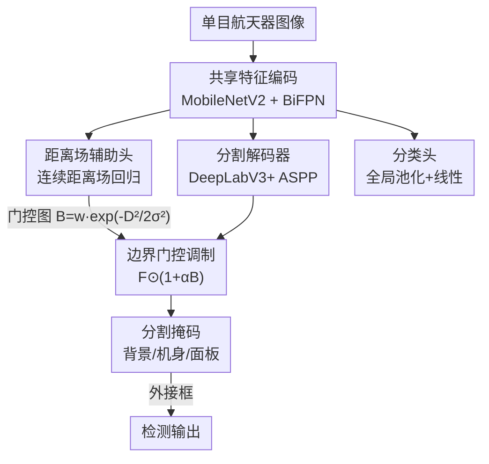

# GABI: Geometry-Aware Boundary Integration for Spacecraft Segmentation

**会议**: CVPR2026  
**arXiv**: [2606.00886](https://arxiv.org/abs/2606.00886)  
**代码**: 待确认  
**领域**: 图像分割  
**关键词**: 航天器分割, 距离场, 边界感知, 多任务学习, 轻量化感知  

## 一句话总结
GABI 给一个轻量卷积分割网络挂上一个「距离场预测」辅助头，用连续距离场提供稠密几何监督、并用它构造一张边界门控图去调制分割特征，让模型在太空极端光照下学到既懂纹理又懂几何的特征——在 SPARK 基准上把基线 AP 提升至多 5%，跨域泛化时 AP 提升超过 50%，且模型比 Transformer 小近 3~10 倍。

## 研究背景与动机
**领域现状**：自主航天器（在轨服务 OOS、主动碎片清除 ADR）依赖单目相机做感知，航天器分割是下游位姿估计、3D 态势感知的前置任务。主流做法是把轻量骨干（MobileNet / EfficientNet）配上强分割头（DeepLabV3+ 的 ASPP、SegFormer 的 MiT 编码器），在地面数据集上拼像素级精度。

**现有痛点**：太空成像极端——没有大气散射、光照剧烈变化，会产生强阴影、镜头光晕；背景从白天地球到深空黑幕不等。航天器分割本质是「纹理任务」，同一块太阳能板在不同光照下外观差异极大，纯纹理特征训练出来的网络一换航天器、一换数据集就崩，鲁棒性与泛化几乎没人系统研究过。

**核心矛盾**：像素级交叉熵损失只盯单个像素的对错，会误判图像拓扑（topology），在边界、薄结构（天线、板附件）处出洞、不连续；而航天器恰恰是「刚性模块化结构 + 平面/柱面 + 锐利边缘」，几何信息高度规整却没被用上。地面任务里加几何监督的做法（二值边界、距离变换）大多只盯**局部边界**精度，没把几何当成跨域不变的归纳偏置。

**本文目标**：在不显著增加模型复杂度（要满足星载算力约束）的前提下，注入一个几何归纳偏置，让分割在不同航天器、不同光照下都结构一致、可泛化。

**切入角度**：观察到二值边界只编码「边界在哪」，而**连续距离场**编码「每个像素离最近边界多远」——后者描述的是全局结构关系，对遮挡、噪声更鲁棒。作者赌：让网络同时学纹理和这种全局几何场，能拿到跨域不变的特征。

**核心 idea**：用「连续距离场回归」作为辅助任务对分割特征做几何正则，再把预测出的距离场反过来当边界门控信号去放大分割解码器在边界附近的响应。

## 方法详解

### 整体框架
GABI 是一个**多任务编码器–解码器**架构：输入单目航天器图像，共享骨干提取特征后分出三条监督——分割、分类、距离场。MobileNetV2 骨干吐出 P2–P5 多尺度特征金字塔，喂进 BiFPN 做双向（自顶向下 + 自底向上）跨尺度融合；融合特征一路进 DeepLabV3+ 风格的分割解码器（ASPP 聚合多尺度上下文），输出「背景 / 机身 / 太阳能板」三类像素预测，另一路经全局池化 + dropout + 线性层做航天器型号分类。关键的增量在于：再挂一个**距离场预测头**，把编码特征上采样回估计每个像素到最近边界的距离；预测出的距离场不仅自身受监督，还被送进一个**边界门控块**去调制分割解码器特征，形成「几何预测 → 反哺分割」的闭环。最后检测框直接由分割掩码外接得到，所以分割质量提升会直接带动检测。

### 关键设计

**1. 连续距离场辅助监督：用「每像素离边界多远」代替「边界在哪」**

痛点是纯像素交叉熵会误判图像拓扑、在薄结构和边界处出洞，而过往几何监督多用二值边界图，只编码边界位置、信息稀疏。GABI 改用从掩码边界算出的**连续距离场**：对图像域每个像素，计算到最近掩码边界的欧氏距离并裁剪到上限 $d_{\max}$，只在边界邻域内（半径 $r$）作为有效区域学习。网络用一串卷积 + 双线性插值（接 ReLU 与 BatchNorm）上采样回预测距离场 $\hat{D}$。距离场损失用归一化后的 L1 回归：

$$\mathcal{L}_{\text{DF}}=\lVert\hat{\mathcal{D}}_{n}-\mathcal{D}_{n}\rVert_{1},\quad \mathcal{D}_{n}=-\log\!\left(\frac{\mathcal{D}}{r}\right)$$

之所以有效：距离场描述的是每个像素与轮廓的空间关系，是一个稠密、全局的几何表示，能让网络捕捉航天器组件的整体结构而非只盯局部边界，从而对遮挡、噪声和光照变化更鲁棒——这正是跨域泛化的来源

**2. 边界门控调制：把预测出的距离场反哺给分割特征**

光让距离场作为旁路辅助任务还不够，作者要让几何信息真正流回分割主干。设分割解码器特征图为 $\mathbf{F}$，用预测距离场 $\hat{D}$ 构造一张高斯门控图 $B=w\exp\!\left(-\frac{\hat{D}^{2}}{2\sigma^{2}}\right)$，其中 $w$ 控制门控强度、$\sigma$ 控制高斯衰减速率——离边界越近门控值越大。再以残差式调制特征：

$$\mathbf{F}_{\text{gate}}=\mathbf{F}\odot(1+\alpha\mathbf{B})$$

$\odot$ 为逐元素乘、$\alpha$ 控制边界调制强度。这一机制类似 Gated-SCNN 的注意力图：在预测边界附近放大特征响应，逼分割解码器聚焦高频结构线索，同时 $(1+\alpha B)$ 的残差形式保证非边界区域仍保留全局上下文不被抹掉

**3. 三任务联合优化：分割 / 分类 / 距离场共享主干**

航天器感知本身是多任务的（分类、检测、分割），GABI 把它们整合进一个共享编码器、加权求和的目标：

$$\mathcal{L}_{\text{total}}=\lambda_{\text{DF}}\mathcal{L}_{\text{DF}}+\lambda_{\text{seg}}\mathcal{L}_{\text{seg}}+\lambda_{\text{cls}}\mathcal{L}_{\text{cls}}$$

分割是主任务（像素级交叉熵 $\mathcal{L}_{\text{seg}}=-\frac{1}{|\Omega|}\sum_{\Omega}\log p_{S_{\text{gt}}}$），分类用交叉熵 $\mathcal{L}_{\text{cls}}=-\sum_c y_c\log p_c$，距离场用上面的 L1 回归。共享主干让几何与纹理特征互相约束：距离场任务给主干注入几何归纳偏置，分类任务帮主干学到型号无关的语义，最终用极小的参数增量（GABI-v2 比基线只多 0.3M 参数）换来结构一致性。检测则不单独训练，直接从分割掩码外接框得到，因此分割越好检测越好

## 实验关键数据

### 主实验（SPARK 数据集，AP 越高越好）
SPARK 2026 数据集由 Unreal Engine 生成，含 10 个航天器型号，每个 6000 训练 / 2000 评测图，部分含强镜头光晕。指标为机身（Body）/ 太阳能板（Panel）分别的 mAP（IoU 0.50–0.95 步长 0.05 平均）。

| 模型 | 参数 | FLOPs | Body mAP | Panel mAP |
|------|------|-------|----------|-----------|
| BL-v3s（基线） | 2.7 M | 4.8 G | 88.5 | 68.6 |
| **GABI-v3s** | 2.8 M | 8.6 G | **89.2** | **73.1** |
| BL-v2（基线） | 3.9 M | 20.5 G | 91.4 | 71.8 |
| **GABI-v2** | 4.2 M | 34.5 G | **91.9** | **76.1** |
| SegFormer-b0 | 3.7 M | 44.0 G | 74.1 | 74.8 |
| SegFormer-b1 | 13.7 M | 86.6 G | 85.2 | 77.2 |

在域内验证集上，加距离场监督让面板（Panel）mAP 从 68.6 → 73.1（+4.5）、79.8/66.4 的高 IoU 阈值都明显提升；机身（Body）因本就接近饱和（AP50 ≈ 99.8）只小幅提升。GABI-v2 以 4.2M 参数即逼平甚至超过 13.7M 的 SegFormer-b1。

### 泛化实验（SPARK 留出未见航天器）
留出 Soho、Proba3ocs 两个训练中未见的航天器，考验几何泛化。

| 模型 | Soho-Body mAP | Soho-Panel mAP | Proba3ocs-Panel mAP |
|------|---------------|----------------|---------------------|
| BL-v3s | 29.3 | 01.4 | 60.8 |
| **GABI-v3s** | **42.3** | **12.3** | **69.1** |
| BL-v2 | 36.4 | 11.7 | 64.4 |
| **GABI-v2** | **45.8** | **24.3** | **74.4** |

未见航天器上提升最猛：Soho 这种特殊几何，基线面板 mAP 仅 1.4，GABI-v3s 拉到 12.3、GABI-v2 拉到 24.3（数量级提升，对应摘要「AP 提升 >50%」量级）；机身 mAP 也普遍 +9~13。

### 跨域实验（SPE3R 数据集，前景提取）
SPE3R 含 100 个航天器型号、亮度对比度差异更大、自阴影严重。评测前景提取（机身+面板合并），同时报 F1 避免高 IoU 来自过预测。

| 模型 | Apollo mAP | Apollo IoU | lro mAP | lro IoU |
|------|-----------|-----------|---------|---------|
| BL-v3s | 25.1 | 54.0 | 38.5 | 62.1 |
| **GABI-v3s** | **54.4** | **75.2** | **56.9** | **75.0** |
| BL-v2 | 29.2 | 57.6 | 46.3 | 64.7 |
| **GABI-v2** | **58.6** | **76.8** | **69.1** | **81.2** |
| SegFormer-b1 | 60.9 | 76.8 | 66.1 | 79.4 |

跨域是最能体现几何先验价值的设定：轻量 GABI-v3s（≈2.8M）的 IoU/F1 已落在比它重约 10 倍的 SegFormer-b1 的 5% 以内；重型 GABI-v2（≈4.2M，比 SegFormer-b1 轻近 3 倍）在多数型号上反超 Transformer。

### 关键发现
- **几何监督在「难」的地方收益最大**：机身本就好分（AP50 近 100）几乎不涨，真正大涨的是薄/复杂结构（面板、未见几何、跨域），印证距离场补的是结构一致性而非通用精度。
- **越泛化越值钱**：域内只「marginally improve」，但未见航天器和跨域数据集上提升从个位数百分点跳到数量级——几何先验本质是跨域不变量。
- **极小代价**：GABI-v2 相对基线只多 0.3M 参数即换来跨 Transformer 的性能，符合星载算力约束。

## 亮点与洞察
- **把「距离场」从损失项升级成可反哺的特征调制信号**：多数工作只把距离场当辅助回归监督，GABI 让预测出的距离场再生成门控图回流分割特征（$\mathbf{F}\odot(1+\alpha B)$），形成预测—反哺闭环，这是它比纯多任务更狠的地方。
- **「域内不涨、跨域猛涨」是一条很有说服力的证据链**：它直接说明提升来自几何归纳偏置（跨域不变）而非简单拟合，比单看一个 benchmark 的 SOTA 数字更可信。
- **残差式门控 $(1+\alpha B)$ 的小心思**：用「1 + 调制」而非直接乘 $B$，保证非边界区全局上下文不被门控抹零，可迁移到任何「想强化局部又不想丢全局」的特征调制场景。
- **几何先验思路可迁移**：凡是目标具规整刚性几何（工业件、建筑、遥感）、又面临光照/纹理域偏移的分割任务，都可借「连续距离场 + 门控反哺」注入结构先验。

## 局限性 / 可改进方向
- **依赖目标几何规整**：方法吃的是航天器「平面/柱面 + 锐利边缘」的强结构先验，对柔性、无明显轮廓或高度变形的目标，距离场的几何归纳偏置可能失效。
- **门控/距离场超参较多**：$w,\sigma,\alpha,d_{\max},r,\lambda$ 一堆超参，论文未给系统敏感性分析，星上部署时调参成本不明。
- **缺正式消融**：正文以「基线 vs GABI」对比近似消融，但没有把「距离场辅助头」与「边界门控块」拆开单独评估，无法判断闭环反哺相对纯辅助监督到底贡献多少。
- **检测为掩码外接框**：检测完全依附分割，遇到分割碎裂/过预测时检测框会一并出错，缺独立检测纠错能力。
- **FLOPs 近乎翻倍**：GABI 相对基线参数只增一点，但 FLOPs 几乎翻倍（如 v3s 4.8G→8.6G），星载实时性需进一步验证。

## 相关工作与启发
- **vs Gated-SCNN**：Gated-SCNN 用二值边界/形状流引导主分割流并加对偶正则；GABI 借了它的门控注意力思想，但把信号源换成更稠密的连续距离场，且服务于跨域几何鲁棒而非单纯边界锐化。
- **vs SEMEDA / 二值边界类**：这类方法在特征空间做语义边界感知损失，只改善局部边界；GABI 用距离场提供超出边界的全局上下文，目标是结构一致性与泛化。
- **vs 多任务关键点/位姿的航天器分割（[25]）**：那类工作额外学位姿、关键点注入 2D/3D 几何并做在线域精化；GABI 更轻、只加一个距离场头，用极小代价拿几何先验，定位星载约束下的性价比方案。
- **vs SegFormer（Transformer 基线）**：SegFormer 靠层级 MiT 编码器堆容量；GABI 证明在数据稀缺、跨域的航天器场景，给轻量卷积网注入几何先验比单纯加大 Transformer 容量更划算（更小且跨域更稳）。

## 评分
- 新颖性: ⭐⭐⭐⭐ 把连续距离场从辅助监督升级为可反哺分割特征的门控信号，切入太空这一独特域
- 实验充分度: ⭐⭐⭐⭐ 域内/未见几何/跨域三档泛化设计严谨，但缺模块级正式消融
- 写作质量: ⭐⭐⭐⭐ 动机与几何先验论证清晰，公式完整
- 价值: ⭐⭐⭐⭐ 星载约束下用极小参数代价换跨域鲁棒，对航天器自主感知实用性强

<!-- RELATED:START -->

## 相关论文

- [\[CVPR 2026\] PRUE: A Practical Recipe for Field Boundary Segmentation at Scale](prue_a_practical_recipe_for_field_boundary_segmentation_at_scale.md)
- [\[CVPR 2026\] VGGT-Segmentor: Geometry-Enhanced Cross-View Segmentation](vggt-segmentor_geometry-enhanced_cross-view_segmentation.md)
- [\[CVPR 2026\] GeoMotion: Rethinking Motion Segmentation via Latent 4D Geometry](geomotion_rethinking_motion_segmentation_via_latent_4d_geometry.md)
- [\[AAAI 2026\] EAGLE: Episodic Appearance- and Geometry-Aware Memory for Unified 2D-3D Visual Query Localization](../../AAAI2026/segmentation/eagle_episodic_appearance-_and_geometry-aware_memory_for_unified_2d-3d_visual_qu.md)
- [\[CVPR 2026\] GeCo: Geometry-Consistent Regularization for Domain Generalized Semantic Segmentation](geco_geometry-consistent_regularization_for_domain_generalized_semantic_segmenta.md)

<!-- RELATED:END -->
