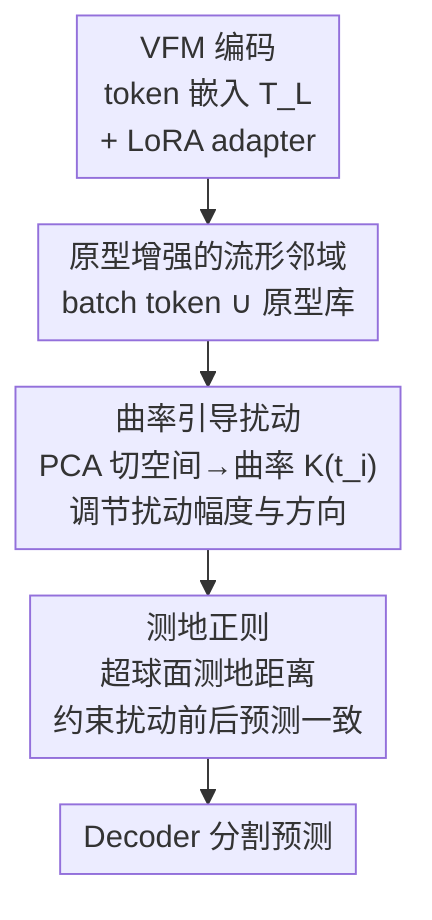

# GeCo: Geometry-Consistent Regularization for Domain Generalized Semantic Segmentation

**会议**: CVPR 2026  
**论文**: [CVF Open Access](https://openaccess.thecvf.com/content/CVPR2026/html/Zang_GeCo_Geometry-Consistent_Regularization_for_Domain_Generalized_Semantic_Segmentation_CVPR_2026_paper.html)  
**代码**: https://github.com/DZhaoXd/GeCo  
**领域**: 3D视觉 / 域泛化分割  
**关键词**: 域泛化语义分割, 视觉基础模型, 参数高效微调, 曲率引导扰动, 测地正则  

## 一句话总结
GeCo 针对"用 PEFT 适配视觉基础模型（VFM）做域泛化语义分割时会过拟合源域、破坏预训练几何结构"的问题，提出**曲率引导扰动**（按 token 局部流形复杂度调节扰动强度/方向）+ **测地正则**（在概率单纯形的超球面上约束预测一致性），在闭集与开集 DGSS 上只用 4.7M 可训练参数就刷到 SOTA。

## 研究背景与动机
**领域现状**：域泛化语义分割（DGSS）只在源域训练、要泛化到没见过的目标域。近年主流是把 DINOv2 / EVA02 / CLIP 这类视觉基础模型（VFM）当 backbone，再用参数高效微调（PEFT，如 LoRA / Rein / FADA）插入轻量 adapter 适配分割任务。

**现有痛点**：作者发现一个反直觉现象——PEFT 适配会让 VFM 的表征"退化"。adapter 容易过拟合到源域统计量和已见类边界上，表现为两个纠缠的维度：**域偏置（domain bias）**——外观变化（白天→夜晚、晴→雪）一来就掉点；**语义僵化（semantic rigidity）**——对已知类强加过度自信的边界，开集场景下把未知物体硬塞进已知类。换句话说，VFM 预训练学到的丰富表征在下游被"压扁"进了一个窄的源域子空间。

**核心矛盾**：一个自然的缓解手段是**扰动正则**——往 adapter 输出的表征里注入噪声，扩大探索的特征区域、降低过自信边界。但作者通过可视化（Fig. 2）发现：VFM 的 token 在预训练后本身就有**类一致、空间连贯**的几何组织（同类 token 聚成簇、相邻位置 token 相似），这是它泛化能力的来源。**随机高斯噪声会无差别地破坏这套几何结构**，导致语义漂移（semantic drift）和不稳定的边界，反而损害泛化。

**本文目标**：要做的扰动既要"扩大表征多样性"，又要"尊重预训练几何"——既不能不扰动（探索不足、欠拟合），也不能乱扰动（破坏流形结构）。

**核心 idea**：把 token 嵌入空间看作一个非欧流形，**用局部曲率来量化"哪里该多扰、哪里该少扰"**，并在预测端用**测地距离**（而非欧氏/KL）来约束扰动前后的一致性，让整套微调"沿着流形几何往下游任务外推"，而不是粗暴地重构表征空间。

## 方法详解

### 整体框架
GeCo 是一个"结构尊重式"的 VFM 微调框架，作用在 LoRA adapter 上。给定输入图像，VFM 编码器把它切成 patch、过 L 层 transformer（每层 MHSA + MLP，adapter 插在 `attn.qkv / attn.proj / mlp.fc1 / mlp.fc2`），得到 token 嵌入 $T_L=\{t_1,\dots,t_N\}$。GeCo 不直接拿 adapter 输出去预测，而是在 token 空间做两件事再喂给 decoder：

1. **构建局部流形 + 算曲率**：把当前 batch 的 token 和一个**原型库**拼起来作为局部邻域，用 PCA 估计每个 token 的切空间，再算它偏离切平面的程度作为**曲率代理** $K(t_i)$。
2. **曲率引导扰动**：曲率大（语义边界、复杂区）→ 小扰动、且扰动限制在切平面内（保细节）；曲率小（平坦、同质区）→ 大扰动、且允许沿法向外探（促探索）。
3. **测地正则**：把扰动前后 token 的预测 $p_i,p_i'$ 映到超球面，用**测地距离**约束二者一致，避免扰动引发语义漂移。

三步串成一条 pipeline：原型增强邻域 → 曲率 → 几何对齐扰动 → 测地一致性。

### 关键设计

**1. 原型增强的流形邻域构建：给"算曲率"备足上下文**

要按局部几何复杂度调扰动，前提是能可靠估计每个 token 的局部流形结构，而**单个 batch 里的 token 样本太少、局部几何不够丰富**。GeCo 引入一个**原型库** $B=\{\mu_1^c,\dots,\mu_{M_c}^c\}$，每个原型 $\mu_i^c\in\mathbb{R}^d$ 表示类别 $c$ 的一种语义变体，把扩展流形定义为 $M_{proto}=T_L\cup B$。对当前 batch 中的 token $t_i$，它的邻域同时从 batch token 和原型里按距离阈值 $\eta$ 取：$N_{proto}(t_i)=\{t_j\in T_L:\|t_i-t_j\|_2\le\eta\}\cup\{\mu_k^c\in B:\|t_i-\mu_k^c\|_2\le\eta\}$。这样邻域既反映**局部**（同 batch 邻居）又反映**全局**（跨样本的类语义）关系，让后续曲率估计不至于因 batch 太小而失真。

**2. 曲率引导扰动：按局部弯曲程度决定"扰多大、往哪扰"**

这是 GeCo 的核心，直接对应"既要探索又要保结构"的矛盾。做法分两步——先算曲率，再用曲率同时调制扰动的**幅度**和**方向**。

曲率怎么算：在邻域 $N_{proto}(t_i)$ 上做 PCA。先构造差向量矩阵 $X_i$（每行是 $t_j-t_i$），算协方差 $\Sigma_i=\frac{1}{|N_{proto}(t_i)|}X_i^\top X_i$，特征分解后取前 $k$ 个特征向量 $\{e_1,\dots,e_k\}$ 张成**切空间** $T_{t_i}(M_{proto})$（流形在 $t_i$ 处的局部线性近似）。曲率定义为邻域点偏离切平面的归一化均方距离：

$$K(t_i)=\frac{1}{|N_{proto}(t_i)|}\sum_{t_j\in N_{proto}(t_i)}\frac{\|t_j-\mathrm{Proj}_{T_{t_i}}(t_j)\|_2^2}{\|t_j-t_i\|_2^2+\delta}$$

其中投影 $\mathrm{Proj}_{T_{t_i}}(t_j)=t_i+\sum_{r=1}^k\langle t_j-t_i,e_r\rangle e_r$，$\delta$ 是数值稳定项。除以 $\|t_j-t_i\|^2$ 是为了去掉邻域尺度的影响，得到**无量纲、尺度不变**的曲率代理——它衡量"流形相对切几何弯得多厉害"，而非绝对位移。作者特意没去算真正的黎曼曲率（需要全局统计流形与度量张量，对 VFM 这种数据依赖、高度非线性的嵌入不可行），而是用切空间偏差做**轻量局部近似**。

幅度：与曲率**成反比**，$\epsilon_i=\dfrac{\alpha}{1+K(t_i)}$（$\alpha$ 控总强度）。高曲率（语义边界）扰动小，保住判别细节；低曲率（平坦区）扰动大，鼓励探索。

方向：高曲率区把扰动**限制在切平面内**（$v_h\in T_{t_i}(M_{proto}),\|v_h\|_2=1$）以保语义一致；低曲率区允许**越出切平面**、掺入法向量做适度正交探索 $v_l=v_o+\beta n_i$，其中 $n_i=t_i-\mathrm{Proj}_{T_{t_i}}(t_i)$。最终扰动后的 token 为 $t_i'=t_i+\epsilon_i v\odot\Delta t_i$（$\odot$ 是 Hadamard 积，$\Delta t_i$ 是 adapter 的输出）。这样扰动是**几何对齐**的：在保住预训练 token 拓扑的同时做结构一致的探索，区别于随机噪声的无差别破坏。

**3. 测地正则：在概率单纯形的"曲面"上约束预测一致性**

曲率引导扰动只扩了表征多样性，**没管决策几何**——扰动可能把特征推离预训练流形、引发语义漂移。常规做法是用欧氏或 KL 距离约束扰动前后预测一致，但这些度量**隐含假设预测空间是平的**，忽略了概率分布本身的曲率（同样的数值置信度变化，在单纯形不同位置对应的语义差异并不相等）。

理想上应该沿 VFM 头诱导的内在预测流形做约束，但该流形由多层非线性隐式定义、度量张量无法解析求出。GeCo 用一个**超球面代理空间**来近似：通过平方根映射把概率向量映到超球面（既保概率分布几何又算得快）。设 $p_i=\mathrm{softmax}(z_i)$、$p_i'=\mathrm{softmax}(z_i')$ 为扰动前后预测，定义测地距离为它们在超球面上的角分离：

$$d_{geo}(p_i,p_i')=\arccos\left(\sum_{c=1}^C\sqrt{p_i^{(c)}p_i'^{(c)}}\right)$$

正则损失取平方测地距离 $L_{geo}=\mathbb{E}_{t_i}[d_{geo}^2(p_i,p_i')]$（平方是为了优化平滑、避开奇点）。它为什么比欧氏更好？对 $L_{geo}$ 求导可得一个"几何诱导的自适应缩放"梯度，由两个乘性因子组成：① **全局角项** $\frac{\theta}{\sin\theta}$（$\theta=d_{geo}$），两个分布已对齐（$\theta\approx0$）时接近 1，角差越大梯度越大，专门**放大漂移严重的预测**的更新；② **类局部调制项** $\sqrt{p_i'^{(c)}}/\sqrt{p_i^{(c)}}$，对扰动后置信度相对变大的类给更强梯度，对被持续压制的类给更弱梯度。两项合起来产生一个**校准且曲率感知**的梯度场：稳定在流形上的预测只被轻推，模糊/不一致的区域被沿测地线拉回——这正是欧氏惩罚（只看预测空间的线性差、分不清流形曲率与置信结构）做不到的，从而更忠实地保住预训练几何、提升域偏移与语义变化下的鲁棒性。

### 损失函数 / 训练策略
adapter 用 LoRA，插到每个 ViT block 的 `attn.qkv / attn.proj / mlp.fc1 / mlp.fc2`，曲率引导扰动与测地正则直接作用在这些 adapter 上。训练目标 = 分割主损失 + 测地正则 $L_{geo}$（约束扰动前后预测的测地一致性）。整套方法只引入很少的可训练参数（4.7M），且本身**不依赖任何显式 OOD 建模**，开集实验里只是叠加一个 RPL 目标 + COCO mask 作伪 OOD 辅助数据。

## 实验关键数据

### 主实验
跨多个 VFM backbone 的闭集 DGSS（GTA5 → Cityscapes + BDD + Mapillary，平均 mIoU）：GeCo 用最少参数拿最高均值。

| Backbone | 方法 | 可训练参数 | Citys. | BDD | Map. | Avg. |
|----------|------|-----------|--------|-----|------|------|
| DINOv2-L | Rein | 2.99M | 66.4 | 60.4 | 66.1 | 64.3 |
| DINOv2-L | FADA | 11.65M | 68.2 | 61.9 | 68.1 | 66.1 |
| DINOv2-L | FisherTune | 15.21M | 68.2 | 63.3 | 68.0 | 66.5 |
| DINOv2-L | **GeCo** | **4.70M** | **68.5** | **64.6** | **69.9** | **67.7** |
| EVA02-L | tqdm | 304.20M | 68.9 | 59.2 | 70.1 | 66.1 |
| EVA02-L | FADA | 11.65M | 66.7 | 61.9 | 66.1 | 64.9 |
| EVA02-L | **GeCo** | **4.70M** | 67.8 | **62.8** | 68.4 | **66.3** |
| CLIP-L | FisherTune | 15.21M | 59.2 | 57.5 | 61.0 | 59.2 |
| CLIP-L | **GeCo** | **4.70M** | **61.0** | **59.3** | **62.8** | **61.0** |

跨域恶劣天气（Cityscapes → ACDC，DINOv2-L，mIoU）和开集 DGSS（Cityscapes → ACDC-POC + MUAD）：

| 任务 / 数据集 | 对比基线 | 关键指标 | GeCo |
|---------------|----------|----------|------|
| ACDC（雾/夜/雨/雪 All） | Rein 77.6 / SoMA 74.4 | All mIoU | **78.7** |
| ACDC Night | Rein 70.6 | mIoU | **73.0** |
| ACDC-POC | Rein+RPL 92.6 / 0.32 / 61.6 | AP↑ / FPR95↓ / mIoU↑ | **93.5 / 0.29 / 64.7** |
| MUAD | Rein+RPL 51.8 / 20.7 / 37.7 | AP↑ / FPR95↓ / mIoU↑ | **58.6 / 15.1 / 41.5** |

开集上 MUAD 提升最明显（AP ↑6.8%、FPR95 ↓5.6%，相比 Rein+RPL），说明 GeCo 的特征空间更可分、更几何稳定，能更好地防止未知区域塌缩进已见类。

### 消融实验
组件分析（GTA5 → Citys.+BDD+Map. 平均 mIoU；CGP=曲率引导扰动，GBR=测地正则，RP=高斯随机扰动）：

| 配置 | EVA02-L Avg. | DINOv2-L Avg. | 说明 |
|------|-------------|---------------|------|
| Full Fine-tuning | 61.0 | 61.8 | baseline |
| RP + MSE | 64.0 | 62.8 | 随机扰动+欧氏一致性，提升有限 |
| CGP + MSE | 65.3 | 65.7 | 换成曲率引导扰动，全域上涨 |
| RP + GBR | 64.3 | 64.1 | 随机扰动+测地正则 |
| **GeCo (CGP+GBR)** | **66.3** | **67.7** | 完整模型最高 |

即插即用性（GeCo 叠加到现有 adapter 方法，DINOv2-L）：叠到 Rein 上 +1.7/+2.3/+2.1（均值 +2.0），叠到更强的 FADA 上仍稳定 +0.3~0.5，证明 GeCo 模型无关、可与现有 adapter 框架组合。

### 关键发现
- **RP+MSE 比 full fine-tuning 提升有限**，印证了"随机扰动+欧氏一致性会扭曲 VFM 预训练几何、导致特征更新错位"这一核心观察——验证了动机不是空谈。
- **CGP 是涨点主力**：从 RP+MSE 换成 CGP+MSE，DINOv2-L 上 62.8 → 65.7，说明几何感知扰动能在不破坏表征流形的前提下产生有意义的变化。
- **GBR 锦上添花并稳化**：在 CGP 之上加测地正则把 DINOv2-L 推到 67.7，沿测地相干方向约束特征更新进一步稳定适配。
- **越难的域收益越大**：BDD（最易过拟合源域统计量）、ACDC 的夜/雨（视觉线索退化最严重）、MUAD（OOD 与源域差异最大）上提升最显著，说明 GeCo 在分布严重损坏时更稳。

## 亮点与洞察
- **把"扰动正则"从欧氏空间搬到流形几何**：核心 insight 是 VFM 的泛化力藏在预训练 token 的几何组织里，所以扰动必须"尊重几何"。用切空间偏差做轻量曲率代理（绕开不可行的黎曼度量），是个工程上很务实的近似。
- **曲率反比扰动 + 方向按几何分流**很优雅：高曲率（边界）少扰、限切平面保细节；低曲率（平坦）多扰、掺法向促探索——一条规则同时管住"探索 vs 保结构"。
- **测地正则的梯度分析**给出了"为什么有效"的机理：$\theta/\sin\theta$ 全局角项 + 类局部调制项构成自适应、曲率感知的梯度场，专门放大漂移、轻推稳定预测。这套"概率单纯形是弯的、不能用欧氏度量"的论证可迁移到其他需要预测一致性约束的任务（半监督、知识蒸馏、一致性正则）。
- **参数效率高**：4.7M 可训练参数干翻 15M（FisherTune）甚至 304M（full / VLTSeg），且即插即用能给 Rein/FADA 再加 2 个点。

## 局限与展望
- **原型库的构建与维护**论文正文交代较略：原型怎么初始化/更新、$M_c$ 取多大、对结果敏感度如何，笔记里看不到细节（⚠️ 以原文/附录为准）。原型库本质引入了额外的全局记忆，在类数多或长尾场景下可能成为瓶颈。
- **超参不少**：扰动强度 $\alpha$、法向贡献 $\beta$、邻域阈值 $\eta$、切空间维度 $k$，正文未给完整敏感性分析，落地时调参成本待评估。
- **曲率估计依赖 PCA + 邻域**，在 batch 小或邻域稀疏时切空间估计可能不稳；复杂度与 token 数、邻域大小相关，超高分辨率/密集 token 下的开销值得关注。
- **只在分割上验证**：方法本身是通用的 VFM PEFT 正则，能否迁移到检测、深度估计等其他密集预测任务、或非 ViT backbone，留待后续。

## 相关工作与启发
- **vs 随机扰动正则（RP / naive perturbation）**：他们往表征注入各向同性高斯噪声扩大探索区域，但无视预训练几何、破坏 token 拓扑导致语义漂移；GeCo 用曲率把扰动幅度/方向与局部流形复杂度绑定，做"结构尊重式"扰动。消融里 RP+MSE 几乎不涨就是直接对照。
- **vs Rein / FADA / SoMA 等 VFM adapter 方法**：它们聚焦"怎么设计更好的 adapter"调制特征；GeCo 与这条线**互补**——不改 adapter 结构，而是在 adapter 输出上加几何一致的扰动+正则，因此能即插即用叠到 Rein/FADA 上再涨点（Table 6）。
- **vs 用欧氏/KL 做预测一致性约束的方法**：它们隐含假设预测空间是平的；GeCo 论证概率单纯形是弯曲流形，用超球面测地距离做约束，梯度自适应放大漂移、忠实保住预训练几何。
- **vs 开集 OOD 检测方法（RPL / Mask2Anomaly / RbA）**：多数显式建模异常、易把域引起的外观偏移误判为 anomaly；GeCo 本身不做显式 OOD 建模，靠更可分、几何稳定的特征空间天然抑制"未知塌缩进已知"，叠加 RPL 后在 ACDC-POC/MUAD 上全面领先。

## 评分
- 新颖性: ⭐⭐⭐⭐⭐ 把流形曲率引入 VFM 扰动正则、并用超球面测地距离约束预测一致性，视角新且自洽。
- 实验充分度: ⭐⭐⭐⭐⭐ 三个 backbone × 闭集/开集/恶劣天气多 benchmark + 组件消融 + 即插即用，覆盖全面。
- 写作质量: ⭐⭐⭐⭐ 动机—机制—梯度分析层层递进，但原型库与超参细节交代偏略。
- 价值: ⭐⭐⭐⭐⭐ 参数高效、即插即用、闭集开集双优，对 VFM 域泛化落地很实用。

<!-- RELATED:START -->

## 相关论文

- [\[AAAI 2026\] Do We Need Perfect Data? Leveraging Noise for Domain Generalized Segmentation](../../AAAI2026/segmentation/do_we_need_perfect_data_leveraging_noise_for_domain_generalized_segmentation.md)
- [\[CVPR 2026\] PEARL: Geometry Aligns Semantics for Training-Free Open-Vocabulary Semantic Segmentation](pearl_geometry_aligns_semantics_for_training-free_open-vocabulary_semantic_segme.md)
- [\[AAAI 2026\] Causal-Tune: Mining Causal Factors from Vision Foundation Models for Domain Generalized Semantic Segmentation](../../AAAI2026/segmentation/causal-tune_mining_causal_factors_from_vision_foundation_mod.md)
- [\[CVPR 2026\] Phrase-Instance Alignment for Generalized Referring Segmentation](phrase-instance_alignment_for_generalized_referring_segmentation.md)
- [\[CVPR 2026\] Selective, Regularized, and Calibrated: Harnessing Vision Foundation Models for Cross-Domain Few-Shot Semantic Segmentation](selective_regularized_and_calibrated_harnessing_vision_foundation_models_for_cro.md)

<!-- RELATED:END -->
