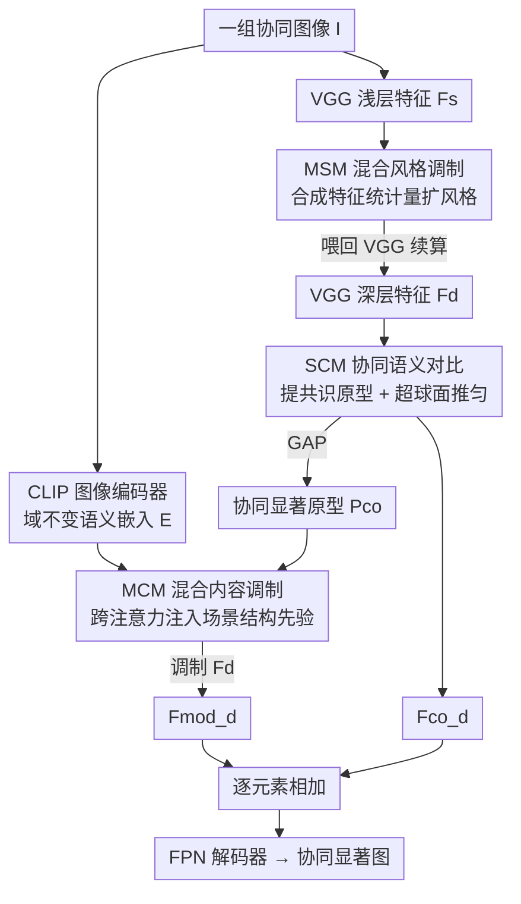

# Generalizable Co-Salient Object Detection via Mixed Content-Style Modulation

**会议**: CVPR 2026  
**论文**: [CVF Open Access](https://openaccess.thecvf.com/content/CVPR2026/html/Guo_Generalizable_Co-Salient_Object_Detection_via_Mixed_Content-Style_Modulation_CVPR_2026_paper.html)  
**代码**: 未公开  
**领域**: 协同显著性检测 / 分割  
**关键词**: 协同显著目标检测, 域泛化, 内容-风格调制, CLIP语义嵌入, 风格增强

## 一句话总结
本文提出 CoMCS，用「内容调制 + 风格调制」双管齐下提升协同显著目标检测（CoSOD）在未见域上的泛化能力：用 CLIP 语义嵌入注入域不变的场景结构先验（MCM），用特征统计量合成扩展训练域风格（MSM），再用均匀性损失把原型在超球面上推开（SCM），在 CoCA 等四个 benchmark（含自建的未见域数据集 UND）上全面超越 17 个 SOTA。

## 研究背景与动机

**领域现状**：协同显著目标检测（CoSOD）的任务是从一组相关图像里找出"共同出现的显著物体"。主流做法都遵循三步——预训练 encoder（VGG-16 / PVT-v2）抽多级特征（深层富含内容语义、浅层富含纹理颜色风格），网络聚合这些特征提取"共识（consensus）"线索，再送进 U-Net / FPN 解码器输出协同显著图。其中如何抽取高质量共识是模型的胜负手。

**现有痛点**：这套在固定训练集上做监督学习的范式，到了真实开放场景就泛化崩盘，根因有二。其一是**语义内容过拟合**：模型只认识训练集里出现过的类别，遇到未见类别会张冠李戴——论文给的例子是模型把见过的"香蕉"错认成未见协同物体"牛油果"的共显著目标。其二是**风格过拟合**：二值标签监督让模型记住了训练集特有的纹理/色调模式，测试域与源域风格差距大时，共识特征里夹带的域特定风格会直接拉垮预测质量。

**核心矛盾**：现有域泛化（DG）方法要么只扩风格多样性、要么同时优化内容和风格特征，但它们都**缺乏对训练集之外内容信息的感知**——面对未见类别和未见风格时无能为力。而关键观察是：内容信息和风格信息可以被神经网络同时编码、且能在保留语义内容的前提下单独编辑风格。

**本文目标**：把"内容"和"风格"两条线分别调制，让模型既能感知未见类别的语义结构、又能见识更宽的风格分布，从而把分布漂移问题拆成两个可单独求解的子问题。

**核心 idea**：用 CLIP 提供的域不变多类语义嵌入去调制内容、用合成特征统计量去增广风格——"内容调制学场景结构先验，风格调制扩源域分布"，再用对比模块把原型在超球面上推匀以消除未见域的表征歧义。

## 方法详解

### 整体框架

CoMCS 是一个双分支网络：一条 **VGG-16** 分支抽多级图像特征 $F=\{F_s, F_m, F_d\}$（$F_s$ 浅层富风格、$F_d$ 深层富内容），一条 **CLIP-ViT-B/32** 分支把同一批图像编码成域不变的多类语义嵌入 $E$。三个核心模块串在这两条分支上协同工作：浅层特征 $F_s$ 先进 **MSM** 合成新风格得到 $F^{style}_s$ 再喂回 VGG；深层特征 $F_d$ 进 **SCM** 得到协同增强特征 $F^{co}_d$，经全局平均池化（GAP）得到协同显著原型 $P_{co}$；随后 $E$ 与 $P_{co}$ 一起进 **MCM**，跨注意力输出富上下文原型 $P_{con}$，再去调制 $F_d$ 得到 $F^{mod}_d$。最后把 $F^{co}_d$ 和 $F^{mod}_d$ 逐元素相加送进 FPN 解码器出预测。训练用 uniform + BCE + IOU 三损失监督；**MSM 只在训练时启用**，推理时去掉。

### 关键设计

**1. MCM 混合内容调制：用 CLIP 语义嵌入注入域不变的场景结构先验**

这一模块专治"语义内容过拟合"——模型只认识训练集类别、把未见物体认错。做法是把跨注意力建在两种原型之间：query $Q$ 来自协同显著原型 $P_{co}$（只编码了见过的协同内容），key/value $K,V$ 来自 CLIP 给的多类语义嵌入 $E$（编码了整个场景的域不变概念知识）。跨注意力让 $P_{co}$ 去"查询"场景里各类物体的语义关系：

$$\text{Attention}(Q,K,V)=\text{Softmax}\!\left(\frac{QK^\top}{\sqrt{d_k}}\right)V,\quad P_{con}=\text{Attention}(Q,K,V)+Q$$

得到的富上下文原型 $P_{con}$ 再与深层特征 $F_d$ 逐元素相乘得到 $F^{mod}_d$。妙处在于：不同类别间的语义关系本身是域不变的（如未见协同物"牛油果"与干扰物"柠檬"的关联在各个域都成立），所以借 CLIP 的概念知识，模型能把"场景结构"——谁和谁该一起出现、谁是干扰——这种跨域稳定的先验补进来，从而在未见域里更准地过滤干扰物。论文的特征图可视化显示，加了 MCM 后场景结构被高亮、干扰物被压下去。

**2. MSM 混合风格调制：合成特征统计量在源域内造出新风格**

这一模块专治"风格过拟合"——训练集纹理/色调模式被死记，换域就崩。它只动浅层特征 $F_s$（风格信息集中在这里）。先按通道在空间维上算一阶（均值 $\mu$）和二阶（标准差 $\sigma$）统计量，它俩共同刻画风格；再算这两个统计量在 batch 内 $N$ 个特征图上的方差 $S^2_\mu, S^2_\sigma$，用方差度量当前 batch 的"风格离散度"。然后据此注入随机扰动生成新风格统计量：

$$\mu_{random}(F_s)=\mu(F_s)+w\,\epsilon_\mu S^2_\mu,\quad \sigma_{random}(F_s)=\sigma(F_s)+w\,\epsilon_\sigma S^2_\sigma,\quad \epsilon_\mu,\epsilon_\sigma\sim\mathcal{N}(0,1)$$

其中 $w$ 是控制噪声幅度的缩放因子。接着用从 $\text{Beta}(\alpha,\alpha)$ 采样的混合系数 $\lambda$ 把随机风格与原风格插值成 $\gamma^{(new)}, \beta^{(new)}$，最后用 AdaIN 把新风格贴回原特征：$\text{MSM}(x)=\beta^{(new)}\frac{F_s-\mu(F_s)}{\sigma(F_s)}+\gamma^{(new)}$。训练时以概率 $p$ 随机决定是否施加新风格。这样做的逻辑是：用"统计量离散度"来标定扰动幅度，能在源域风格的"周边"合成出合理的新风格（t-SNE 可视化显示新风格把原风格的覆盖范围扩开了），相当于免费造出更宽的训练域分布，让模型对域漂移更鲁棒。

**3. SCM 协同语义对比模块：提共识原型 + 用均匀性损失把原型在超球面推匀**

这一模块负责从一组图像里抽出高质量"共识"、并消除未见域里的表征歧义。它先用卷积把深层特征 $F_d$ 变换、reshape 后算组内图像两两相似度的相关图 $S\in\mathbb{R}^{NHW\times NHW}$，在 $H\times W$ 维上取相似度最高的向量、再在 $N$ 维上平均，得到编码组内协同信息的主原型 $P_{pr}$。接着做一次自适应调整 $P_{ad}=P_{pr}\odot\text{Sigmoid}(\text{Conv}(P_{pr}))$，把调整后的协同原型当卷积核去卷 $F_d$ 得协同特征，再与 $F_d$ 逐元素相乘得到增强协同特征 $F^{en}_d$。关键的泛化抓手是均匀性损失：

$$L_{Uni}(P_1,P_2;t)=\log e^{-t\left(1-\frac{P_1\cdot P_2}{\lVert P_1\rVert\,\lVert P_2\rVert}\right)}$$

它把不同组协同特征的语义嵌入 $P_1, P_2$ 在超球面上互相推开，保证学到的原型均匀分布。这一步直接缓解了"未见域里协同物体表征模糊"的问题——原型分得越开，不同类别越不易混淆（t-SNE 显示加 SCM 后同类簇更紧凑）。⚠️ 模块名为"Semantic Contrast"，但论文未显式给出常规 InfoNCE 式对比损失，对比效果主要由上述 uniform loss 体现，细节以原文为准。

### 损失函数 / 训练策略

总损失是 uniform、BCE、IOU 三者加权：$L_{all}=\lambda_1 L_{Uni}+\lambda_2 L_{BCE}+\lambda_3 L_{IOU}$。其中 BCE/IOU 是常规分割监督，uniform loss 负责超球面均匀分布。训练 200 epoch，Adam（lr=1e-4、weight decay=1e-4、$\beta_1$=0.9、$\beta_2$=0.999），图像 resize 到 224×224，训练用两类一批、推理单类一组，单卡 RTX 4090。训练集沿用 CoCo-SEG + DUTS-class 组合。

## 实验关键数据

### 主实验

三个常规 benchmark 上与 17 个近四年 SOTA 对比（↑ 越大越好、MAE ↓ 越小越好），CoMCS 在全部指标上取得最优或并列最优；在最难的 CoCA 上相比次优有 $S_\alpha$+0.9%、$E^{max}_\phi$+1.2%、$F^{max}_\beta$+0.9% 的提升：

| 数据集 | 指标 | CoMCS | 次优(方法) | 提升 |
|--------|------|-------|-----------|------|
| CoCA | $S_\alpha$ | 0.747 | 0.747 (IPPO) | 持平最优 |
| CoCA | $F^{max}_\beta$ | **0.649** | 0.644 (IPPO) | +0.5% |
| CoCA | $E^{max}_\phi$ | **0.821** | 0.816 (ASCoD) | +0.5% |
| CoSOD3k | $S_\alpha$ | **0.857** | 0.856 (MCCL) | +0.1% |
| CoSal2015 | $F^{max}_\beta$ | **0.896** | 0.893 (ICSM) | +0.3% |
| CoSal2015 | $E^{max}_\phi$ | **0.929** | 0.927 (MCCL) | +0.2% |

未见域数据集 UND（自建，从 CoCA/CoSOD3k/CoSal2015 选 50 组未见类别图像、共 290 类）上优势更明显——这是论文主打的泛化战场：

| 数据集 | 指标 | CoMCS | 次优 | 提升 |
|--------|------|-------|------|------|
| UND | $S_\alpha$ | **0.856** | 0.834 (MCCL) | +2.2% |
| UND | $F^{max}_\beta$ | **0.830** | 0.803 (GCoNet+) | +2.7% |
| UND | $E^{max}_\phi$ | **0.908** | 0.892 (GCoNet+) | +1.6% |
| UND | MAE | **0.051** | 0.059 (GCoNet+) | -0.8% |

### 消融实验

三模块逐个累加（CoCA 上 $S_\alpha$ / $F^{max}_\beta$，以及 UND 上 $S_\alpha$）：

| 配置 | CoCA $S_\alpha$ | CoCA $F^{max}_\beta$ | UND $S_\alpha$ | 说明 |
|------|------|------|------|------|
| baseline | 0.662 | 0.492 | — | 无任何模块 |
| +SCM | 0.724 | 0.608 | 0.786 | 共识+超球面推匀，提升最大 |
| +SCM+MCM | 0.743 | 0.636 | 0.847 | 内容调制补场景结构先验 |
| +SCM+MCM+MSM (Full) | **0.747** | **0.649** | **0.856** | 风格增强收尾 |

### 关键发现

- **SCM 贡献最大**：在 CoCA 上单加 SCM 就把 $S_\alpha$ 从 0.662 拉到 0.724（+6.2%）、$F^{max}_\beta$+11.6%，说明高质量共识提取 + 原型均匀分布是泛化的地基。
- **MCM 在干扰多的数据集上收益更大**：CoCA（干扰物多）加 MCM 后 $S_\alpha$+1.9%、$F^{max}_\beta$+2.8%，而在干扰少的 CoSOD3k 上只 +1.3% / +0.4%——印证 MCM 的价值正是"靠场景结构先验过滤干扰物"。
- **MSM 全程稳定加分**：在 CoCA 上 +1.1% $S_\alpha$，连干扰少的 CoSal2015 也有 +1.0%，说明风格增广是普惠型增益。在 UND 上三模块叠加把 $S_\alpha$ 从 0.786 推到 0.856，跨域增益最显著。

## 亮点与洞察

- **把"内容"和"风格"显式解耦再分别调制**，是这篇最干净的设计哲学：内容线借 CLIP 域不变语义补未见类别感知，风格线靠特征统计量扰动扩源域分布，两条线互不打架且都对准了泛化的两大病根。
- **用 batch 内统计量方差来标定风格扰动幅度**很巧——不是凭空加高斯噪声，而是让扰动量级跟着"当前 batch 风格有多分散"自适应缩放，造出的新风格落在源域风格的合理邻域，这个 trick 可迁移到任何需要 feature-level 风格增广的域泛化任务。
- **借 CLIP 当"场景知识外援"**而非重训语义分类器，绕开了 CoSOD 缺类别标注的难题；MCM 的跨注意力把"协同原型查询场景语义关系"这件事做成了即插即用的内容调制器。

## 局限与展望

- **依赖 CLIP 的概念覆盖度**：MCM 的域不变先验完全来自 CLIP 的多类语义嵌入，若未见物体落在 CLIP 训练分布之外（罕见/专业领域类别），场景结构先验可能失效——论文未讨论这种情形。
- **backbone 偏老**：为公平对比沿用 VGG-16 + CLIP-ViT-B/32，未见域的绝对指标是否受限于 VGG 表征能力、换更强 backbone 收益如何，文中没给。
- **三损失权重 $\lambda_1,\lambda_2,\lambda_3$ 与 MSM 的施加概率 $p$、缩放因子 $w$、Beta 分布的 $\alpha$** 等超参敏感性缺乏分析，复现时这些是隐藏雷区。⚠️ SCM 命名含"Contrast"但对比项主要由 uniform loss 承担，机制细节建议对照原文与公开代码（目前未公开）确认。

## 相关工作与启发

- **vs GCoNet+ / MCCL（CoSOD SOTA）**：它们在固定训练集上靠对比学习/类别标签提共识，强在 in-domain，但未显式处理未见类别与未见风格；CoMCS 用 MCM+MSM 把泛化当一等公民，UND 上对它俩分别 +2.7% $F^{max}_\beta$ / +2.2% $S_\alpha$。
- **vs 通用域泛化（DG）方法**：传统 DG 要么只扩风格（feature extension）、要么内容风格一起优化，但缺训练集外的内容感知；CoMCS 的差异在于借 CLIP 引入域不变语义、把内容调制和风格调制拆开各管一摊，更贴合 CoSOD"需要识别未见协同类别"的特性。

## 评分
- 新颖性: ⭐⭐⭐⭐ 内容/风格双调制 + 借 CLIP 注入域不变场景先验的组合在 CoSOD 泛化方向上较新，但 MSM 的统计量风格增广、AdaIN、跨注意力均为成熟组件的拼装。
- 实验充分度: ⭐⭐⭐⭐ 4 个 benchmark + 自建 UND、对比 17 个 SOTA、三模块消融齐全；但超参敏感性与更强 backbone 的分析缺位。
- 写作质量: ⭐⭐⭐⭐ 动机—方法—实验链条清晰、可视化到位；个别公式（uniform loss、SCM 对比机制）表述略糙需对照原文。
- 价值: ⭐⭐⭐⭐ 把 CoSOD 推向开放域泛化的实用框架，UND 数据集与"内容/风格分治"思路对后续工作有参考价值。

<!-- RELATED:START -->

## 相关论文

- [\[CVPR 2026\] TF-SSD: A Strong Pipeline via Synergic Mask Filter for Training-free Co-salient Object Detection](tf-ssd_a_strong_pipeline_via_synergic_mask_filter_for_training-free_co-salient_o.md)
- [\[CVPR 2026\] Uncertainty-Aware Modality Fusion for Unaligned RGB-T Salient Object Detection](uncertainty-aware_modality_fusion_for_unaligned_rgb-t_salient_object_detection.md)
- [\[CVPR 2025\] Visual Consensus Prompting for Co-Salient Object Detection](../../CVPR2025/segmentation/visual_consensus_prompting_for_co-salient_object_detection.md)
- [\[CVPR 2026\] M4-SAM: Multi-Modal Mixture-of-Experts with Memory-Augmented SAM for RGB-D Video Salient Object Detection](m4-sam_multi-modal_mixture-of-experts_with_memory-augmented_sam_for_rgb-d_video_.md)
- [\[ECCV 2024\] Self-supervised Co-salient Object Detection via Feature Correspondences at Multiple Scales](../../ECCV2024/segmentation/self-supervised_co-salient_object_detection_via_feature_correspondences_at_multi.md)

<!-- RELATED:END -->
