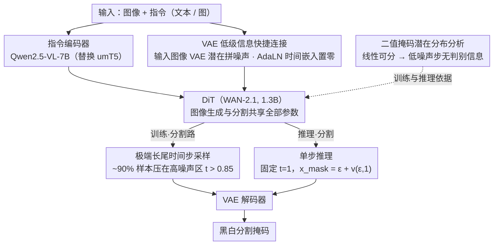

# GenMask: Adapting DiT for Segmentation via Direct Mask Generation

**会议**: CVPR 2026  
**arXiv**: [2603.23906](https://arxiv.org/abs/2603.23906)  
**代码**: 无  
**领域**: 分割  
**关键词**: 扩散变换器, 分割掩码生成, 时间步采样策略, 单步推理, 生成式分割

## 一句话总结

本文提出 GenMask，将 DiT 直接训练为生成黑白分割掩码（与生成彩色图像共用同一模型），通过发现二值掩码的 VAE 潜在表示是线性可分的特殊性质，设计了针对分割的极端长尾时间步采样策略，实现了单步推理即可产出分割结果，在 referring 和 reasoning 分割基准上达到 SOTA。

## 研究背景与动机

1. **领域现状**：文本引导分割是计算机视觉中的核心任务。利用预训练生成模型（如扩散模型）做分割已成为热门方向。现有方法通常将预训练扩散模型作为骨干网络，通过提取去噪或扩散逆过程中的隐藏特征，再送入可训练的任务特定解码器来获取分割掩码。
2. **现有痛点**：这些方法都属于对扩散模型的"间接使用"，存在两个核心问题：(a) **表示不匹配** — 扩散模型预训练目标是建模 VAE 特征的低级分布，而分割需要紧凑的语义级标签预测；(b) **管线复杂** — 需要设计精巧的间接特征提取管线（如扩散逆过程、激活聚合等），增加流程复杂度并限制适配性能。
3. **核心矛盾**：根本问题在于"间接适配"范式——用生成模型提特征再训分割头，而不是让生成模型直接生成分割结果。作者认为分割应当直接以生成方式训练。
4. **本文目标** (a) 如何让 DiT 直接生成分割掩码而非间接提取特征？(b) 如何在同一模型中同时处理图像生成和分割两种截然不同的任务？(c) 如何解决二值掩码与自然图像在 VAE 潜在空间中分布差异巨大的问题？
5. **切入角度**：作者发现了一个关键事实——二值分割掩码的 VAE 潜在表示具有尖锐分布、对噪声鲁棒、且线性可分的特殊性质。这与自然图像的平滑、易被噪声扰动的潜在表示截然不同。基于此发现，可以设计不同的训练策略来统一两者。
6. **核心 idea**：通过为分割掩码设计极端长尾的时间步采样策略（集中在高噪声区域），使 DiT 能在同一生成目标下同时学会生成彩色图像和黑白分割掩码，推理时仅需单步前向传播即可输出掩码。

## 方法详解

### 整体框架

GenMask 想做的事很反直觉：不再把扩散模型当"特征提取器"，而是让它像生成一张彩色图一样，**直接生成一张黑白分割掩码**。整套管线建在预训练的 WAN-2.1 DiT（1.3B 参数）之上，用 Qwen2.5-VL-7B 替换原本的 umT5，让指令编码器既能读图也能读文本指令。训练时分割数据和图像生成数据以 1:1 混合喂进**完全相同**的一个 DiT——两条任务共享每一个参数，唯一的区别只藏在"时间步怎么采样"上。分割那一路还会把输入图像的 VAE 潜在表示拼到 DiT 输入里，补上文本编码器拿不到的纹理、颜色这类低级线索。最终推理时，分割不走多步去噪，而是固定在纯噪声那一步、一次前向就吐出掩码。

整篇方法的逻辑闭环是被一个"发现"串起来的：先观察到二值掩码在 VAE 空间里线性可分，推出低噪声步骤对分割没用，于是把训练全压到高噪声区，最后顺理成章地只用高噪声那一步做推理。下面四个设计点就沿着这条链展开。

### 关键设计

**1. 二值掩码的潜在分布分析：找到分割能"白嫖"生成模型的物理依据**

方法能成立的全部前提，是作者先回答了一个问题：分割掩码和自然图像在 VAE 空间里到底有什么不一样？三组实验给出了答案。其一，对自然图像加高强度噪声会把内容彻底打烂，但对二值掩码加同样的噪声，目标的全局位置和大致形状仍然认得出——掩码天生抗噪。其二，把 $N$ 张掩码的 VAE 表示 $\mathbf{X} \in \mathbb{R}^{N \times hw \times d}$（$d=16$）用 PCA 压到一维 $\mathbf{Y} = \mathbf{X}\mathbf{W}$，降维后的结果竟然和原始掩码几乎一样，说明掩码在 VAE 空间里是**线性可分**的。其三，用 SVM 去分这些潜在表示，只有把噪声加到很强时，这种线性可分性才崩。结论很关键：对掩码来说，低、中噪声的去噪步骤几乎不携带分割信息，真正有学习价值的判别信号只在高噪声区。这就把"该在哪些时间步训练分割"从拍脑袋变成了有据可依。

**2. 分割专用的极端长尾时间步采样策略：把训练算力全压到高噪声区**

既然只有高噪声步骤对分割有用，再用图像生成那套均衡的时间步采样就是浪费。图像生成沿用 logit-normal 采样，强调中间噪声水平、峰值只有 1.6%；分割则换成一条专门设计的长尾分布

$$p(t) = \frac{2a^2 t}{(t^2 + a^2)^2}, \quad a = 0.05$$

它把约 90% 的训练样本砸在高噪声区（$t > 0.85$），峰值达到 13%，是生成任务的整整 8 倍。实现上不需要拒绝采样，直接用逆变换 $t = \sqrt{\frac{u}{1-u}} \cdot a$（$u \sim \mathcal{U}(0,1)$）就能从均匀分布抽出这条长尾。这样一来，分割学习被精准地集中在掩码"判别信息密度最高"的那段噪声上，而图像生成那一路完全不受影响——同一个生成目标、同一套架构，靠一条采样曲线就把两个任务分开了。

**3. 单步推理：训练时是生成，推理时却是确定性判别**

训练既然几乎全发生在高噪声步，低噪声区对掩码预测的贡献就可以忽略，那推理也没必要老老实实跑多步去噪。GenMask 干脆把时间步固定在 $t=1$（纯噪声），一次前向算出速度场再加回噪声即得掩码：

$$x_{\text{mask}} = \epsilon + v(\epsilon, 1)$$

再过一遍 VAE 解码器就是最终结果。这一步很妙的地方在于：它的使用模式——确定性、单次前向——和传统那些精心设计的分割解码器**一模一样**，却没有改 DiT 任何架构、也没有加一个分割专用参数。一个纯粹用生成目标训出来的模型，推理时自然表现得像个判别器，这种"训练生成、推理判别"的对偶性正是本文最有意思的地方。

**4. VAE 低级信息快捷连接：把 VLM 看不见的纹理颜色补回来**

指令编码器换成 VLM 后带来一个副作用：VLM 擅长抓高级语义，却对像素级的纹理、颜色连通性不敏感，而分割恰恰要靠这些低级线索去抠精确边界。GenMask 的补法是把输入图像的 VAE 潜在表示和随机采样的噪声拼在一起送进 DiT；同时在 AdaLN 层里把这份 VAE 表示对应的时间嵌入设为零，等于告诉模型"这部分是完全干净、无噪声的真实图像"。消融实验显示，一旦去掉这个 VAE 输入，分割性能会大幅下降——可见对密集预测来说，光有语义远远不够，低级信息是刚需。

### 损失函数 / 训练策略

分割任务用 VAE 空间里的 MSE 损失，因为它和 DiT 原始的生成训练目标最一致，还省掉了反向传播穿过 VAE 解码器的开销。作者也试过 BCE 变体：直接在 RGB 空间算 BCE 要让梯度穿过 VAE 解码器，效率很低；改用一个线性层替代解码器再算 BCE 能缓解，但性能仍不及 MSE。其余设置上，CFG（classifier-free guidance）只用在图像生成、分割不用；分割与生成数据 1:1 混合，全局 batch size 1024，约 8000 iterations 收敛。

## 实验关键数据

### 主实验

**Referring Segmentation（oIoU）：**

| 方法 | RefCOCO test A / B | RefCOCO+ test A / B | RefCOCO-g val / test |
|------|-------------------|--------------------|--------------------|
| LISA | 79.1 / 72.3 | 70.8 / 58.1 | 67.9 / 70.6 |
| GLaMM | 83.2 / 76.9 | 78.7 / 64.6 | 74.2 / 74.9 |
| **GenMask** | **83.3 / 79.4** | **78.7 / 68.1** | **75.6 / 76.5** |

**Reasoning Segmentation（ReasonSeg）：**

| 方法 | Val gIoU | Val cIoU | Test gIoU | Test cIoU |
|------|---------|---------|----------|----------|
| LISA* (微调) | 52.9 | 54.0 | 47.3 | 34.1 |
| **GenMask** | **51.1** | **50.9** | **52.3** | **45.8** |

GenMask 在 Test 集上显著超越 LISA*（+5.0 gIoU, +11.7 cIoU），说明生成式分割对推理分割的泛化能力更强。

### 消融实验

**采样策略参数 $a$ 的影响（RefCOCO mIoU/oIoU）：**

| $a$ 值 | RefCOCO | RefCOCO+ | RefCOCO-g |
|--------|---------|----------|-----------|
| 0.05（极端长尾）| 82.2/81.3 | 75.8/73.5 | 77.7/76.0 |
| 0.1 | 78.1/77.6 | 69.3/68.1 | 73.7/72.3 |
| 0.5（接近均匀）| 66.0/66.0 | 52.7/53.3 | 57.5/56.6 |

**其他消融：**

| 配置 | RefCOCO mIoU | 说明 |
|------|-------------|------|
| 有生成数据混合训练 | 82.2 | 完整模型 |
| 无生成数据 | 81.0 | 混合生成数据有正向收益 |
| 有 VAE 输入 | 82.2 | 完整模型 |
| 无 VAE 输入 | 显著下降 | 低级信息对分割至关重要 |
| MSE 损失 | 82.2 | 最优 |
| BCE 损失 | 78.1 | 需反向传播穿 VAE，优化困难 |
| BCE + 线性层 | 81.3 | 缓解但仍不及 MSE |

### 关键发现

- **采样策略是核心**：$a$ 从 0.05 到 0.5，RefCOCO+ mIoU 从 75.8 暴跌到 52.7（-23.1），说明极端长尾采样对分割成功至关重要
- **混合训练有正向收益**：加入生成数据不仅不干扰分割，反而带来 +1.2 mIoU 提升，暗示生成建模与分割的差距可能比想象中小
- **MSE > BCE**：MSE 与 DiT 原始目标最一致，无需额外适配
- VAE 低级信息快捷连接对像素级预测不可或缺

## 亮点与洞察

- **深刻的分布分析驱动方法设计**：发现二值掩码 VAE 表示的线性可分性是全文最关键的洞察。基于此设计采样策略，逻辑链条完整："掩码低噪声下线性可分 → 低噪声步骤无用 → 集中训练在高噪声 → 推理只需高噪声一步"
- **极简的统一架构**：最令人惊叹的是 GenMask 不修改 DiT 任何架构，不加任何分割特定参数，同一个模型同时做图像生成和分割。这证明了生成目标与判别任务可以完美统一
- **单步推理的优雅性**：从纯生成目标训练出来的模型，推理时行为却完全等同于传统确定性分割解码器。这种"训练时是生成，推理时是判别"的对偶性非常有趣，可迁移到其他需要密集预测的任务
- 生成数据对分割的正向迁移效果，暗示了"生成能力 ↔ 理解能力"之间更深层的联系

## 局限与展望

- **模型规模较大**：DiT 1.3B + VLM 7B 的组合在推理时资源消耗大，尽管单步推理已很高效
- **推理分割依赖两阶段**：需要先让 VLM 生成精炼描述再送入 DiT，多了一步且引入 VLM 推理延迟
- **训练数据格式受限**：当前仅支持二值掩码，如何扩展到语义分割（多类别）和实例分割尚不明确
- **VAE 瓶颈**：受限于 VAE 的空间分辨率（通常 8x 下采样），精细边界预测可能受限
- 未来可以探索将更多视觉理解任务（深度估计、关键点检测）统一到同一生成框架中

## 相关工作与启发

- **vs LISA**：LISA 将分割作为 LLM 的下游任务，需要额外的 SAM 解码器。GenMask 直接在 DiT 中生成掩码，架构更统一，在 ReasonSeg test 上 cIoU 超出 11.7 个百分点
- **vs 扩散特征提取方法 (DiffSegmenter等)**：这些方法从扩散模型中间层提取特征做分割，属于"间接使用"。GenMask 直接让扩散模型生成掩码，消除了特征提取管线的复杂性
- **vs UNINEXT-L**：UNINEXT-L 在一些指标上接近 GenMask，但它专门设计了复杂的统一架构。GenMask 无需架构修改即达到可比性能

## 评分

- 新颖性: ⭐⭐⭐⭐⭐ 二值掩码线性可分性的发现及由此导出的采样策略设计极其优雅
- 实验充分度: ⭐⭐⭐⭐ 消融实验全面验证了每个设计选择，但缺少与更多2D分割方法的对比
- 写作质量: ⭐⭐⭐⭐⭐ 从发现到设计的逻辑链条非常清晰，可视化直观
- 价值: ⭐⭐⭐⭐⭐ 证明了生成模型可以直接做分割的范式可行性，对统一视觉理解与生成有重要意义

<!-- RELATED:START -->

## 相关论文

- [\[CVPR 2026\] Direct Segmentation without Logits Optimization for Training-Free Open-Vocabulary Semantic Segmentation](direct_segmentation_without_logits_optimization_for_training-free_open-vocabular.md)
- [\[CVPR 2026\] Concept-Aware LoRA for Domain-Aligned Segmentation Dataset Generation](concept-aware_lora_for_domain-aligned_segmentation_dataset_generation.md)
- [\[CVPR 2026\] SAMTok: Representing Any Mask with Two Words](samtok_representing_any_mask_with_two_words.md)
- [\[CVPR 2026\] VideoMaMa: Mask-Guided Video Matting via Generative Prior](videomama_mask-guided_video_matting_via_generative_prior.md)
- [\[CVPR 2026\] CA-LoRA: Concept-Aware LoRA for Domain-Aligned Segmentation Dataset Generation](ca-lora_concept-aware_lora_for_domain-aligned_segmentation_dataset_generation.md)

<!-- RELATED:END -->
