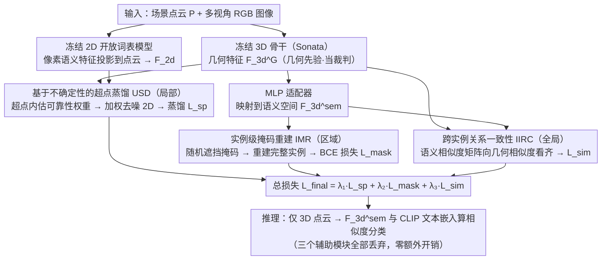

# GeoGuide: Hierarchical Geometric Guidance for Open-Vocabulary 3D Semantic Segmentation

**会议**: CVPR 2026  
**arXiv**: [2603.26260](https://arxiv.org/abs/2603.26260)  
**代码**: 无  
**领域**: 分割  
**关键词**: 开放词表3D语义分割, 几何先验, 2D到3D蒸馏, 超点聚合, 实例级一致性

## 一句话总结

本文提出 GeoGuide，一个层次化几何引导的开放词表 3D 语义分割框架，通过基于不确定性的超点蒸馏、实例级掩码重建和跨实例关系一致性三个互补模块，利用预训练3D模型的几何先验来纠正 2D 到 3D 知识蒸馏中的几何偏差，在 ScanNet v2 上达到 64.8 mIoU 的 SOTA 性能。

## 研究背景与动机

1. **领域现状**：开放词表 3D 语义分割旨在分割训练集以外的任意类别。由于3D点-文本配对数据稀缺，主流方法通过从预训练的 2D 开放词表模型（如 CLIP、LSeg、OpenSeg）向 3D 模型蒸馏知识来实现。两种主要范式是"2D-to-3D 蒸馏"（通过几何对应将像素级特征投影到点云上对齐）和"点-文本对齐"（通过对比学习对齐 3D 特征与文本嵌入）。
2. **现有痛点**：两种范式本质上都训练 3D 模型复制 2D 模型的特征表示，存在两个核心问题：(a) **限制了内在 3D 几何学习** — 将 3D 特征对齐到 2D 表示空间，抑制了 3D 几何结构的学习；(b) **继承 2D 预测错误** — 2D 模型容易因遮挡和视角变化产生错误的物体掩码（如图1所示），3D 模型继承这些错误后学到了不正确的分割模式。
3. **核心矛盾**：如何在 2D-to-3D 知识蒸馏过程中有效保留内在的 3D 几何信息？直接融入预训练 3D 特征并不一定能改善性能，因为不同模态之间的异构监督信号会在训练中引入不稳定性。
4. **本文目标**：从三个层面解决几何-语义一致性问题：(a) **超点内一致性** — 同一超点内的点应共享语义标签，但 2D 投影常导致不一致；(b) **实例内一致性** — 单视角 2D 预测仅覆盖部分实例，导致 3D 空间中实例语义碎片化；(c) **跨实例关系一致性** — 多视角特征聚合引入同类实例间的特征分布漂移。
5. **切入角度**：预训练 3D 模型（如 Sonata）已经在大规模点云数据上学到了强几何先验——同类物体具有相似的几何表示。关键是如何在蒸馏过程中利用这些先验来纠正 2D 层面的错误。
6. **核心 idea**：利用预训练 3D 模型的几何先验，通过三层级（超点、实例、跨实例）的几何-语义一致性建模来引导 2D-to-3D 蒸馏过程，确保蒸馏出的 3D 特征既保留几何结构又具备开放词表语义能力。

## 方法详解

### 整体框架

给定场景点云 $\mathbf{P} \in \mathbb{R}^{N \times 3}$ 和多视角 RGB 图像 $\mathcal{I}$，GeoGuide 并行提取两类特征：(1) 冻结的预训练 3D 骨干提取几何特征 $\mathbf{F}_{3d}^G \in \mathbb{R}^{N \times C_1}$；(2) 冻结的 2D 开放词表分割模型提取像素级语义特征 $\mathbf{F}_{2d}^M$。通过相机参数建立 2D-3D 对应关系，将 2D 特征投影到点云得到 $\mathbf{F}_{2d} \in \mathbb{R}^{N \times C}$。3D 几何特征通过轻量级 MLP 适配器映射到相同语义空间得到 $\mathbf{F}_{3d}^{\text{sem}}$。三个层次化模块（USD、IMR、IIRC）从局部到全局引导蒸馏过程。推理时仅需 3D 点云输入，丢弃所有辅助模块。

### 关键设计

三个模块对应蒸馏偏差的三个尺度——超点（局部）、实例（区域）、跨实例（全局），共同点是都拿冻结的预训练 3D 几何特征当"裁判"，去校正投影过来的 2D 语义特征。

**1. 基于不确定性的超点蒸馏（USD）：先用几何把不可靠的 2D 投影压下去，再做蒸馏**

2D 特征沿相机射线投影到点云时，遮挡和边界模糊处会带来大量错误标签，而超点内的点本该共享同一语义，传统均值池化会把这些错误一并平均进去、反而放大偏差。USD 的做法是先按法线把点云切成超点 $\{Q_i\}_{i=1}^{N_Q}$，在每个超点内分别对 3D 几何特征和 2D 语义特征均值池化得到超点级特征 $\mathbf{S}_{3d}^G$、$\mathbf{S}_{2d}$；接着把"超点级与点级特征之差"拼接起来送进 MLP，预测每个点的 2D 特征可靠性权重 $\mathcal{W} = \text{MLP}(\text{concat}[(\mathbf{S}_{3d}^G - \mathbf{F}_{3d}^G); (\mathbf{S}_{2d} - \mathbf{F}_{2d})])$。用这组权重对超点内的 2D 特征做加权池化，得到去噪后的超点语义特征 $\overline{\mathbf{S}}_{2d}$，最后在超点级和点级分别用余弦相似度蒸馏损失 $\mathcal{L}_{sp}$ 对齐。之所以有效，是因为"几何上偏离超点共识"的点往往正是 2D 预测出错的点——用 3D 几何先验来估这个不确定性，等于让模型在蒸馏前先把噪声特征的话语权调低，保留真正有判别力的部分。

**2. 实例级掩码重建（IMR）：从残缺掩码重建完整实例，逼同一实例的点学到相同语义**

超点和单视角 2D 预测往往只覆盖一个实例的局部，导致同一物体在 3D 空间里语义被切得支离破碎。IMR 借一个"挖空再补全"的自监督任务来对抗这种碎片化：先用类别无关的 3D 实例分割得到掩码 $\{M_i\}_{i=1}^{N_M}$，把每个掩码随机遮挡一部分变成不完整掩码 $\overline{M}_i$，从语义特征 $\mathbf{F}_{3d}^{\text{sem}}$ 中索引这部分点并池化、过线性层得到掩码特征 $\overline{\mathbf{F}}_i^{\text{mask}}$，再让它和全局 $\mathbf{F}_{3d}^{\text{sem}}$ 算余弦相似度并经 sigmoid 预测出完整掩码 $\hat{M}_i = \text{sigmoid}(\cos(\overline{\mathbf{F}}_i^{\text{mask}}, \mathbf{F}_{3d}^{\text{sem}}))$，用 BCE 损失 $\mathcal{L}_{\text{mask}}$ 约束它逼近原始掩码。要想从一半的点重建出整个实例，模型只能逼着同一实例内所有点的语义特征足够相似——这正是把"实例拓扑完整"这条约束直接写进了特征空间。

**3. 跨实例关系一致性（IIRC）：让语义相似度矩阵向几何相似度矩阵看齐**

多视角特征聚合会让同类实例之间的语义分布漂移，而预训练 3D 模型本来保证"同类物体几何表示相似"这条先验，可它在 2D-to-3D 蒸馏里不会自动延续下来。IIRC 把这条先验显式搬进来当监督：先把每个实例掩码内的 3D 几何特征和语义特征分别聚合成掩码级嵌入 $\mathbf{F}_{\text{mask}}^G$、$\mathbf{F}_{\text{mask}}^{\text{sem}}$，算出几何和语义两套成对相似度矩阵

$$\mathbf{P}_{\text{sim-m}}^G = \mathbf{F}_{\text{mask}}^G {\mathbf{F}_{\text{mask}}^G}^T, \quad \mathbf{P}_{\text{sim-m}}^{\text{sem}} = \mathbf{F}_{\text{mask}}^{\text{sem}} {\mathbf{F}_{\text{mask}}^{\text{sem}}}^T$$

超点级同样算一套，再用 MSE 把语义相似度拉向几何相似度：$\mathcal{L}_{\text{sim}} = \text{MSE}(\mathbf{P}_{\text{sim-m}}^G, \mathbf{P}_{\text{sim-m}}^{\text{sem}}) + \text{MSE}(\mathbf{P}_{\text{sim-sp}}^G, \mathbf{P}_{\text{sim-sp}}^{\text{sem}})$。这样约束的不是单个实例的特征，而是"实例两两之间的关系结构"——几何上相近的实例对，语义上也得相近，从而把 3D 预训练里那张几何关系网原样保留进蒸馏后的语义空间，挡住跨实例的语义漂移。

### 损失函数 / 训练策略

总损失：$\mathcal{L}_{\text{final}} = \lambda_1 \mathcal{L}_{\text{sp}} + \lambda_2 \mathcal{L}_{\text{mask}} + \lambda_3 \mathcal{L}_{\text{sim}}$

推理时仅需 3D 点云输入，使用适配器输出 $\mathbf{F}_{3d}^{\text{sem}}$ 与 CLIP 文本嵌入计算相似度进行分类。三个辅助模块全部丢弃，不增加推理开销。

## 实验关键数据

### 主实验

**开放词表 3D 语义分割（mIoU / mAcc）：**

| 方法 | ScanNet v2 mIoU | nuScenes mIoU | Matterport3D mIoU |
|------|----------------|--------------|-------------------|
| OpenScene (LS) | 54.2 | 36.7 | 43.4 |
| SAS (stage1) | 59.2 | 45.4 | 46.3 |
| SAS (stage2) | 61.9 | 47.5 | 48.6 |
| **GeoGuide (SAS*)** | **64.8** | **50.3** | **51.9** |

GeoGuide 在 ScanNet v2 上超出 SAS(stage1) +5.6 mIoU，在 nuScenes 上超出 +4.9 mIoU。

**长尾场景评估（Matterport3D）：**

| 方法 | K=21 mIoU | K=40 mIoU | K=80 mIoU | K=160 mIoU |
|------|----------|----------|----------|-----------|
| OpenScene (OS) | 41.1 | 33.4 | 18.1 | 8.9 |
| DMA (OS) | 45.1 | 37.9 | 19.7 | 9.4 |
| **GeoGuide (OS)** | **47.7** | **38.5** | **22.0** | **11.6** |

### 消融实验

| 模块 | ScanNet v2 mIoU | mAcc | 说明 |
|------|----------------|------|------|
| Full model | 53.4 | 74.8 | 使用 OpenSeg 特征 |
| w/o USD | 下降 | 下降 | 超点内一致性丧失 |
| w/o IMR | 下降 | 下降 | 实例级一致性丧失 |
| w/o IIRC | 下降 | 下降 | 跨实例关系约束缺失 |

**初步实验（验证框架设计动机）：**

| 方法 | mIoU (OpenSeg) | mAcc (OpenSeg) |
|------|---------------|---------------|
| OpenScene（训练整个3D网络）| 47.5 | 70.7 |
| 冻结3D骨干+MLP适配器 | 50.4 | 75.2 |

冻结预训练 3D 骨干+轻量级适配器即可提升 +2.9 mIoU，但对不同 2D 模型效果不一致（LSeg 下略降），说明朴素蒸馏会破坏 3D 预训练学到的几何先验。

### 关键发现

- **三个模块的互补性**：USD 处理局部超点一致性、IMR 处理实例内完整性、IIRC 处理跨实例关系，分别从微观到宏观层面解决蒸馏偏差
- **跨 2D 模型的鲁棒泛化**：无论使用 LSeg、OpenSeg 还是 SAS 特征，GeoGuide 都能一致提升性能，说明方法解决的是本质的几何不一致问题而非依赖特定 2D 特征
- **mIoU 和 mAcc 同步提升**：表明方法不仅改善了分割覆盖度，还提升了每类预测精度，几何一致性建模帮助网络学到了更判别性和类别特定的特征
- 长尾场景下 GeoGuide 性能退化幅度最小，归功于 IIRC 模块维持了同类实例间的语义一致性

## 亮点与洞察

- **"保护几何先验"的核心洞察**：不是让 3D 模型完全学 2D 特征，而是冻结预训练 3D 骨干、仅训练轻量适配器。同时通过三个模块在蒸馏过程中主动保护和利用几何先验。这种"保守蒸馏"策略值得在其他跨模态迁移场景中借鉴
- **层次化一致性建模**：从超点（局部）→ 实例（区域）→ 跨实例（全局）的三层一致性设计形成了完整的局部到全局语义对齐机制。每一层都有明确的动机和互补作用
- **推理时零额外开销**：所有三个辅助模块仅在训练时使用，推理时完全丢弃。这使得 GeoGuide 在推理效率上与 OpenScene 等基础方法完全相同，实用性很强
- 不确定性引导的加权聚合思路可推广到任何需要融合多源可能有噪声特征的场景

## 局限与展望

- **依赖类别无关实例分割质量**：IMR 和 IIRC 模块的效果受3D实例分割（Mask3D等）的准确性限制
- **未使用自蒸馏策略**：SAS 等方法通过费时的自蒸馏可进一步提升性能，GeoGuide 未采用这一策略但仍超越了 SAS
- **超点和实例的过分割/欠分割问题**：超点的质量直接影响 USD 模块，在几何模糊区域可能出现不当分组
- **跨域泛化**：虽做了 ScanNet→Matterport3D 的跨域实验，但室内到室外的大跨度迁移仍有挑战
- 可以探索更强的 3D 预训练模型（如 PointMAE v2）以获得更好的几何先验

## 相关工作与启发

- **vs OpenScene**：OpenScene 直接训练整个 3D 网络对齐 2D 多视角特征，会破坏几何先验。GeoGuide 冻结 3D 骨干并利用几何先验引导蒸馏，在 ScanNet v2 上以 OpenSeg 特征超出 +5.9 mIoU
- **vs SAS**：SAS 集成多个 2D 开放词表模型减少单一模型偏差，但仍忽略 3D 几何结构。GeoGuide 在使用相同 2D 特征时进一步提升 +5.6 mIoU（ScanNet v2），且不需要费时的自蒸馏
- **vs GGSD**：GGSD 采用 mean-teacher 框架增强蒸馏，但仍缺乏显式几何约束。GeoGuide 通过层次化几何-语义一致性取得更全面的改善
- 该工作启示：在跨模态蒸馏中，目标模态的预训练先验不应被丢弃，而应作为蒸馏过程的"教师"来使用

## 评分

- 新颖性: ⭐⭐⭐⭐ 三层级几何一致性建模设计合理，但单个模块的技术新颖性有限
- 实验充分度: ⭐⭐⭐⭐⭐ 三大基准+长尾+跨域评估，消融完整，初步实验验证动机充分
- 写作质量: ⭐⭐⭐⭐ 动机推导清晰，模块设计逻辑连贯，图表信息量大
- 价值: ⭐⭐⭐⭐ 在开放词表3D分割中引入层次化几何约束的方向有重要意义，不使用自蒸馏即超SOTA实用性强

<!-- RELATED:START -->

## 相关论文

- [\[CVPR 2026\] Semantic Alignment in Hyperbolic Space for Open-Vocabulary Semantic Segmentation](semantic_alignment_in_hyperbolic_space_for_open-vocabulary_semantic_segmentation.md)
- [\[CVPR 2026\] MARIS: Marine Open-Vocabulary Instance Segmentation](maris_marine_open-vocabulary_instance_segmentation.md)
- [\[CVPR 2026\] HOPS: Hierarchical Open-vocabulary Part Segmentation with Attention-Aware Filtering and Affinity-Guided Enhancement](hops_hierarchical_open-vocabulary_part_segmentation_with_attention-aware_filteri.md)
- [\[CVPR 2026\] Universal 3D Shape Matching via Coarse-to-Fine Language Guidance](universal_3d_shape_matching_via_coarse-to-fine_language_guidance.md)
- [\[CVPR 2026\] The Power of Prior: Training-Free Open-Vocabulary Semantic Segmentation with LLaVA](the_power_of_prior_training-free_open-vocabulary_semantic_segmentation_with_llav.md)

<!-- RELATED:END -->
