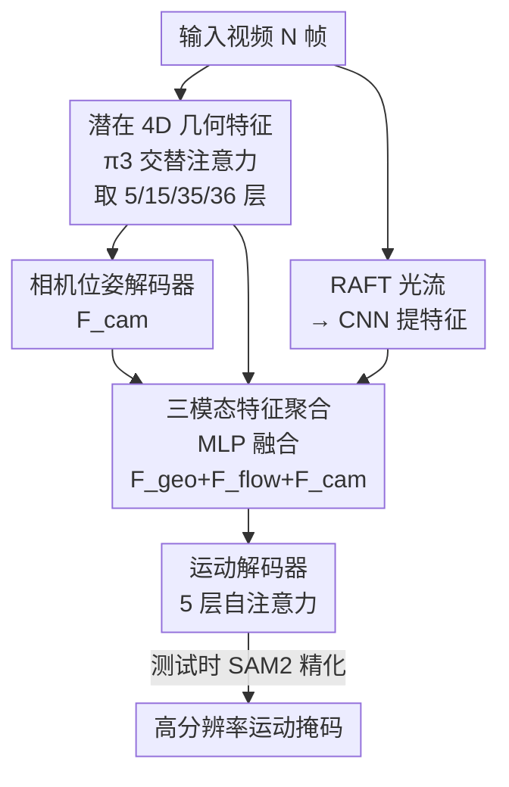

# GeoMotion: Rethinking Motion Segmentation via Latent 4D Geometry

**会议**: CVPR 2026  
**论文**: [CVF Open Access](https://openaccess.thecvf.com/content/CVPR2026/html/He_GeoMotion_Rethinking_Motion_Segmentation_via_Latent_4D_Geometry_CVPR_2026_paper.html)  
**代码**: https://github.com/zjutcvg/GeoMotion  
**领域**: 运动分割 / 视频理解  
**关键词**: 运动分割, 4D几何先验, 前馈模型, 光流, π3重建  

## 一句话总结
GeoMotion 把运动分割从"显式估计相机位姿与点对应 + 迭代优化"重新表述为"直接从预训练 4D 重建模型（π3）的潜在几何特征里前馈解码运动掩码"，靠一个特征聚合模块 + 5 层自注意力解码器，单次前馈就把物体运动从相机运动里解耦出来，在多个零样本基准上达到 SOTA，且每帧 0.31s，比迭代优化方法快 20 倍以上。

## 研究背景与动机
**领域现状**：运动分割（motion segmentation）要把视频里"自身在动的物体"从"相机运动带来的整体位移"里分离出来。主流做法依赖显式运动线索——光流（optical flow）或点轨迹（point trajectory）——先估出相机运动和点对应，再据此推断哪些区域是独立运动的前景。

**现有痛点**：这些显式线索本身就脏。光流在弱纹理、遮挡、大幅相机运动下不可靠，且感受野只有相邻几帧、对长时运动和遮挡敏感；点轨迹会漂移。更要命的是这些方法都是**多阶段串行管线**，前一阶段的噪声会一路累积到后面。为了对抗误差累积，近期工作（RoMo 用对极约束 + SAM2 迭代精化掩码，SegAnyMotion 用点轨迹作 prompt 迭代分割）引入**逐场景迭代优化**——精度上去了，但每帧要 6~8 秒，没法实际部署。

**核心矛盾**：迭代优化方法陷入一个两难——要么直接用脏的中间表示（光流/对应/对极约束）导致误差累积，要么靠昂贵的迭代优化去补救误差。二者都绕不开"显式估计中间几何量"这一步。

**本文目标**：能不能像视觉分割、深度估计、3D/4D 重建那样，把运动分割也做成**纯前馈**？即不算显式对应、不迭代，单次前向就出运动掩码。

**切入角度**：作者观察到，人之所以能轻松感知运动物体，源于对 3D 场景几何和时空关系的强理解。而近期的前馈 4D 重建模型（DUSt3R、VGGT、π3）在大规模数据上预训练后，其**特征层里已经隐式编码了相机位姿和运动感知的几何先验**——既然这些"潜在 4D 几何特征"已经包含了解耦运动所需的信息，那运动分割的难点就从"估计几何"退化成了"如何把这些表征解码成运动掩码"。

**核心 idea**：绕过显式对应估计，直接在预训练 4D 重建模型（π3）的潜在特征上施加注意力解码，让模型隐式地把物体运动和相机运动解耦——用"读懂几何先验"代替"重新算几何"。

## 方法详解

### 整体框架
GeoMotion 是一个端到端前馈框架，输入一段 $N$ 帧的视频，输出每帧的运动掩码 $M \in [0,1]^{H \times W}$（每个像素属于运动物体的概率）。整条管线只有两个模块：**特征聚合模块**负责把三种互补特征（潜在 4D 几何、光流、相机位姿）融成统一的时空表征；**运动解码模块**用 5 层自注意力直接从融合特征里"读出"哪些是动的物体。训练时把预训练骨干全部冻结，只学解码器；推理时再用 SAM2 把低分辨率的粗掩码细化成高分辨率结果。整个设计的精髓是"简洁"——没有任何迭代优化，所有重活都交给预训练的几何先验。

### 关键设计

**1. 用潜在 4D 几何特征替代显式几何估计：让模型"读懂"而非"重算"**

这一设计直击"中间表示脏 + 误差累积"的痛点。作者不再去显式估计相机位姿、点对应或对极约束，而是把预训练 4D 重建模型 π3 当成几何先验的"特征库"。具体地，先用 DINOv2 抽每帧特征，再送入 π3 的**交替注意力**（alternating attention，view-wise 注意力捕捉单帧内部结构、global 注意力捕捉跨帧时空一致性）作为视觉几何骨干（VGB），得到潜在 4D 几何特征 $F_\text{geo}$。这些特征天然编码了场景结构、3D 几何和相机位姿信息——而这些恰恰是解耦物体运动与相机运动所需的全部。骨干用 π3 原版的 36 层交替注意力，全程冻结，无需微调。

关键洞察在于**多层特征融合**：作者把浅层（更靠近 DINO、偏图像级语义/物体级结构）和深层（逐层累积的高层上下文与几何结构）拼起来用。实测发现经验性地选第 5、15、35、36 层拼接（concatenation）效果最好——浅层提供物体边界与外观，深层提供全局几何，二者结合才得到鲁棒的潜在 4D 表征。

**2. 三模态特征聚合：几何 + 光流 + 相机位姿的互补融合**

光流提供的是"相机运动 + 物体运动"的复合像素级信号，本身分不清谁是谁；4D 几何先验提供全局结构但缺局部细粒度运动；相机位姿则直接刻画了需要被"减掉"的背景运动。三者高度互补，因此作者把它们融成一个统一时空表征。用 RAFT 算光流再经 CNN 得到局部光流特征 $F_\text{flow}$；用 π3 自带的相机位姿解码器（接在 VGB 最后两层之后）得到相机位姿特征 $F_\text{cam}$。三模态通过一个简单的 MLP 拼接融合：

$$\mathbf{F}_\text{fuse} = \mathrm{MLP}([\mathbf{F}_\text{geo}; \mathbf{F}_\text{flow}; \mathbf{F}_\text{cam}])$$

为什么有效：消融显示三者各有不可替代的贡献——相机特征负责"压住"全局背景运动（+6.3），浅层特征在运动信号弱/模糊时靠物体级结构识别连贯区域（+4.5），光流补充稠密的局部像素运动（+6.8）。把全局几何、相机动态、局部像素运动统一进同一个时空表征后，模型才能不靠显式对应匹配就把动态区域分割出来。（⚠️ 三模态的具体对齐拼接细节论文放在补充材料，正文未展开。）

**3. 运动解码器 + π3 置信解码器初始化：用几何预训练参数加速收敛**

融合特征送进运动解码模块——结构极简，就是 5 层标准 self-attention（Multi-Head Attention + Norm + FFN + 残差），最后接一个轻量 MLP 头输出掩码。它直接从融合表征里"感知"动态物体，靠跨帧多帧注意力把时序信息也用上。

这里有个巧妙的初始化设计：作者的训练数据相比 π3 预训练用的大规模 4D 数据小得多，从头随机初始化解码器容易训不稳。注意到 π3 里有个**置信解码器**（confidence decoder），原本是基于重建残差预测每像素可靠性的——它已经学到了对几何有意义的参数化。于是作者直接用置信解码器的预训练权重来初始化运动解码器。Figure 5 显示：用 π3 参数初始化比随机初始化收敛更快（更少 epoch 达到同样 IoU）、最终精度也更高，说明大规模 4D 场景预训练提供的几何先验对运动估计同样受益。

### 损失函数 / 训练策略
掩码解码器对每帧预测 $M \in [0,1]^{H \times W}$，由对应的二值真值掩码 $M_\text{gt}$（运动物体=1，背景=0）监督。训练目标在 $N$ 帧上组合 Focal Loss 和 Dice Loss：

$$\mathcal{L} = \sum_{t=1}^{N} \left( \lambda_1 \mathcal{L}_\text{focal}(M^t, M_\text{gt}^t) + \lambda_2 \mathcal{L}_\text{dice}(M^t, M_\text{gt}^t) \right)$$

Focal Loss 让模型聚焦难分像素（小目标、模糊、部分遮挡的运动物体），Dice Loss 缓解前景-背景类别不平衡、优化预测与真值的空间重叠。$\lambda_1 = \lambda_2 = 0.5$。训练用 Adam，学习率 5e-5，15 个 epoch，4 张 RTX 5090，每 batch 16 帧、center-crop 后 resize 到 $518 \times 518$；每个 epoch 对每段视频随机重采样帧以增加多样性。

## 实验关键数据

### 主实验
在五个零样本运动分割基准上对比（所有评测集训练时未见）。GeoMotion 在不用迭代优化的高效方法里几乎全面最优，且推理速度接近最快的光流方法。

| 方法 | 迭代优化 | DAVIS2016-M (J&F) | DAVIS2016 (J&F) | SegTrackV2 (J) | 每帧耗时 |
|--------|:----:|:----:|:----:|:----:|:----:|
| OCLR-TTA | 是 | 78.5 | 78.8 | 72.3 | 1.25s |
| RoMo | 是 | - | - | 67.7 | 8.34s |
| SegAnyMotion | 是 | 89.5 | 90.9 | 76.3 | 6.44s |
| RCF-Stage1 | 否 | 77.3 | 78.5 | 76.7 | - |
| ABR | 否 | 72.0 | 72.5 | 76.6 | 0.28s |
| **GeoMotion (本文)** | 否 | **83.9** | **84.7** | **77.3** | 0.31s |

GeoMotion 在 DAVIS2016-M 上 83.9 J&F、DAVIS2016 上 84.7，分别超过第二好的非迭代方法 RCF-Stage1 达 +6.6 / +6.2；还超过迭代方法 OCLR-TTA（DAVIS2016-M 上 +5.4）。耗时 0.31s/帧，与 ABR(0.28s)、OCLR-flow(0.20s) 同档，而 SegAnyMotion / RoMo 要 6.44s / 8.34s——精度-效率权衡极佳。唯一明显劣势是 FBMS-59（72.5 J vs ABR 81.9）：ABR 靠显式外观精化，在运动微弱、边界主要由外观显著性定义的场景占优，而 GeoMotion 这类几何驱动方法此时倾向输出保守、不完整的掩码（SegAnyMotion 在 FBMS-59 上也类似偏弱，印证了这一点）。

与 3D/4D 重建类方法对比（按 Easi3R 协议，输出均经 SAM2 精化），GeoMotion 大幅领先：

| 方法 | DAVIS2016 JM | DAVIS2017 JM | DAVIS-All JM |
|--------|:----:|:----:|:----:|
| MonST3R | 64.3 | 56.4 | 51.9 |
| VGGT4D | 69.2 | 60.0 | 54.8 |
| Easi3R-monst3r | 70.7 | 67.9 | 63.1 |
| **GeoMotion** | **84.5** | **81.1** | **74.8** |

相比第二好的 Easi3R-monst3r，JM 分别 +13.8 / +16.2 / +11.7。这些重建方法要么依赖显式光流（DUSt3R、MonST3R），要么是 post-hoc 注意力适配，凸显了 GeoMotion"运动感知学习"架构在隐式解耦上的优势。

### 消融实验

**特征聚合模态消融**（DAVIS2017，baseline = 仅用 VGB 最后两层）：

| 配置 | J&F | 说明 |
|------|:----:|------|
| Baseline | 67.9 | 仅潜在几何 |
| + Cam | 74.2 | 相机位姿 +6.3，压制全局背景运动 |
| + Flow | 74.7 | 光流 +6.8，稠密局部运动 |
| + Shallow | 72.4 | 浅层特征 +4.5，物体级结构 |
| + Cam + Flow | 80.2 | 两模态组合 |
| **All** | **81.4** | 三模态全融合，最优 |

**数据规模消融**（逐步加数据集）：从仅 HOI4D（DAVIS2016-M 67.9 J）开始，加 Dynamic Replica 跳到 75.1（+7.2），再加 OmniWorld-motion / YTVOS18-m / GOT-Motion 一路到 83.5 J——五个数据集全用时性能单调上升，说明框架可扩展性强、能吃下更大更多样的数据。

### 关键发现
- **三模态缺一不可且互补**：相机位姿贡献最大（压背景运动），光流次之（局部细粒度），浅层特征在运动弱时兜底；任意两两组合都不如三者全开。
- **预训练初始化是免费午餐**：直接复用 π3 置信解码器权重初始化运动解码器，收敛更快、终点更高，几乎零成本地把大规模 4D 预训练的几何归纳偏置迁移过来。
- **几何驱动 vs 外观驱动有适用边界**：在运动微弱、边界靠外观显著性的场景（FBMS-59）反而是外观精化的 ABR 占优——GeoMotion 此时会输出保守掩码，是其几何先验路线的固有 trade-off。

## 亮点与洞察
- **"重述问题"比"优化问题"更值钱**：把运动分割从"估几何 + 迭代修"重新表述成"解码已有几何先验"，一句 insight 就把整条多阶段迭代管线砍成单次前馈，速度 20 倍以上提升——这是典型的"换框架而非堆模块"的胜利。
- **冻结骨干 + 只学薄解码器**的范式很可复用：当存在强力预训练几何/视频基础模型时，下游任务往往不需要重新估计底层量，只需学一个轻量解码头去"读"先验特征。这套思路可迁移到深度补全、相机定位、动态区域检测等任何"显式估计很贵但先验已隐含"的任务。
- **多层特征拼接（5/15/35/36）**的经验选择揭示了 4D 重建骨干的层级语义：浅层=物体/外观，深层=全局几何，运动分割恰好两者都要——这对怎么"薅"重建基础模型的中间特征有参考价值。

## 局限与展望
- 作者承认在运动微弱、边界由外观显著性主导的场景（如 FBMS-59）会输出保守、不完整的掩码，明显弱于显式外观精化的 ABR——几何先验路线对"弱运动强外观"场景天生不友好。
- ⚠️ 依赖链较长：性能强绑定于 π3 的几何先验质量 + RAFT 光流 + SAM2 后处理，任一上游模型的失效（如 π3 在极端动态下重建崩坏）都可能拖累结果，论文未充分分析这种级联脆弱性。
- 三模态聚合的具体对齐/拼接细节被放进补充材料，正文只给了一个 MLP 拼接公式，复现时这部分可能是隐藏难点。
- 改进思路：把 SAM2 精化也吸收进端到端训练（目前是测试时外挂），或为"弱运动"场景显式补一路外观分支，缓解 FBMS-59 这类掉点。

## 相关工作与启发
- **vs RoMo / SegAnyMotion（迭代优化）**：它们靠对极约束/点轨迹 + SAM2 迭代精化提鲁棒性，每帧 6~8 秒；本文完全前馈、0.31 秒/帧，精度可比甚至更好（SegAnyMotion 在高容量下仍领先，但代价是 20 倍耗时）。区别在于本文绕过了显式中间估计这一误差源。值得注意：本文测试时用 SAM2 精化的方式与 RoMo 的最终精化相同，但不同于 SegAnyMotion 把 SAM2 当迭代 prompt 用。
- **vs Easi3R / VGGT4D（前馈重建）**：它们是 training-free 的注意力适配或继承静态先验的 post-hoc 方法，语义感知有限、复杂运动下常分错物体；本文显式学了一个运动解码器并融入光流+相机位姿，DAVIS 上 JM 大幅领先（+11.7~+16.2）。
- **vs ABR（外观精化）**：ABR 强在外观显著性主导的场景（FBMS-59），本文强在几何/运动复杂的场景（SegTrackV2、DAVIS），两者代表"外观驱动 vs 几何驱动"的互补路线。

## 评分
- 新颖性: ⭐⭐⭐⭐ 把运动分割重述为"解码 4D 几何先验"、首个能匹敌迭代优化方法的前馈范式，insight 干净有力，但模块本身（π3 骨干 + 注意力解码 + 多模态 MLP 融合）多为现成组件的巧妙组装。
- 实验充分度: ⭐⭐⭐⭐ 五个零样本基准 + 与运动线索/重建两类方法对比 + 三类消融（模态/数据规模/初始化），覆盖全面；但 FBMS-59 弱项与上游级联脆弱性分析略浅。
- 写作质量: ⭐⭐⭐⭐ 动机推导清晰、"为什么前馈可行"讲得透，架构图与层级特征可视化到位；三模态聚合细节外放补充材料稍影响自足性。
- 价值: ⭐⭐⭐⭐ 把 6~8 秒/帧压到 0.31 秒且保 SOTA，为实时运动分割与动态 4D 场景理解开了一条可部署的前馈路线，工程价值高。

<!-- RELATED:START -->

## 相关论文

- [\[CVPR 2026\] Moving Border Ownership for Event-based Motion Segmentation](moving_border_ownership_for_event-based_motion_segmentation.md)
- [\[CVPR 2026\] VGGT-Segmentor: Geometry-Enhanced Cross-View Segmentation](vggt-segmentor_geometry-enhanced_cross-view_segmentation.md)
- [\[CVPR 2026\] Rethinking Box Supervision: Bias-Free Weakly Supervised Medical Segmentation](rethinking_box_supervision_bias-free_weakly_supervised_medical_segmentation.md)
- [\[CVPR 2026\] GeCo: Geometry-Consistent Regularization for Domain Generalized Semantic Segmentation](geco_geometry-consistent_regularization_for_domain_generalized_semantic_segmenta.md)
- [\[CVPR 2026\] PEARL: Geometry Aligns Semantics for Training-Free Open-Vocabulary Semantic Segmentation](pearl_geometry_aligns_semantics_for_training-free_open-vocabulary_semantic_segme.md)

<!-- RELATED:END -->
