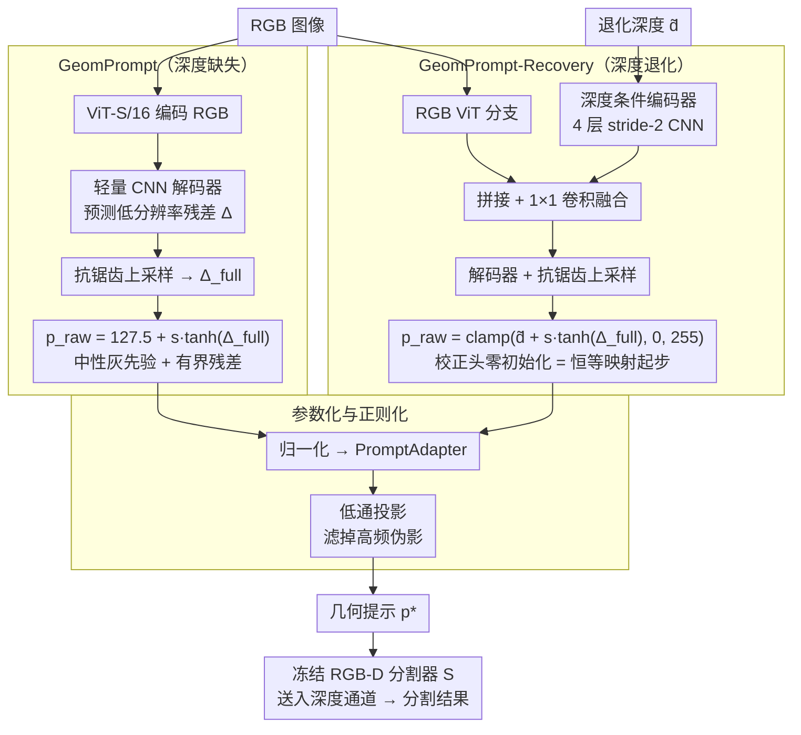

# GeomPrompt: Geometric Prompt Learning for RGB-D Semantic Segmentation Under Missing and Degraded Depth

**会议**: CVPR 2026  
**arXiv**: [2604.11585](https://arxiv.org/abs/2604.11585)  
**代码**: [https://geomprompt.github.io](https://geomprompt.github.io)  
**领域**: 语义分割  
**关键词**: RGB-D语义分割, 深度缺失, 模态鲁棒性, 几何提示, 轻量适配

## 一句话总结
GeomPrompt 为冻结的 RGB-D 分割模型学习轻量的几何提示模块，从 RGB 合成任务驱动的深度代理信号（无深度监督），在深度缺失时提升 6.1 mIoU，在深度退化时提升最高 3.6 mIoU。

## 研究背景与动机

**领域现状**：RGB-D 语义分割通过融合深度信息提升性能，但实际部署中深度传感器经常失效、不完整或噪声严重（反射/透明表面、传感器故障等）。

**现有痛点**：(1) 深度作为特权信息蒸馏到 RGB 仍需深度监督；(2) 单目深度估计作为代理需要额外模型且目标是重建深度而非优化分割；(3) 缺乏直接针对"深度缺失/退化时如何维持分割性能"的轻量解决方案。

**核心矛盾**：RGB-D 分割器期望深度输入提供几何先验，但部署时深度可能不可用或不可靠。关键问题是：能否学习一个"足够好"的几何信号来满足分割器，而不需要真正重建深度？

**核心 idea**：学习"任务驱动的几何提示"而非"重建深度"——只用分割损失训练提示生成模块，让它自动发现对分割最有用的几何信号。

## 方法详解

### 整体框架
GeomPrompt 要解决的是这样一件事：一个已经训好的 RGB-D 分割模型期望深度通道里有几何先验，可一旦部署时深度缺失或被噪声污染，它就没法正常工作。本文的做法不是去修分割器，而是在它前面挂一个轻量模块，把"该送进深度通道的东西"现场生成出来——分割器骨干始终冻结、一个参数都不动。

整条流水线根据场景分两种：深度**完全缺失**时，GeomPrompt 模块只看 RGB 就合成一张"几何提示图"顶替深度；深度**退化但还在**时，GeomPrompt-Recovery 模块在原始退化深度上预测一个校正残差、修掉对分割有害的部分。无论哪条路径，生成的提示都要先经过归一化、PromptAdapter 和低通投影，整理成"看起来像正常深度"的样子，再喂进冻结分割器的深度通道。整个模块只用分割损失端到端训练，没有任何深度监督。

### 关键设计

**1. GeomPrompt：深度缺失时，从 RGB 合成"任务驱动的几何提示"而非重建深度**

最直接的痛点是深度没了，但分割器又离不开它。一个自然的想法是接一个单目深度估计器把深度补出来，但深度估计的目标是"还原真实几何"，和"让分割更准"并不是一回事——估出来的深度对重建是最优的，对分割未必。GeomPrompt 索性绕开重建：用一个 ViT-S/16 编码 RGB 特征，再接一个轻量 CNN 解码器预测一张低分辨率残差图，抗锯齿上采样回全分辨率，最后以中性灰 127.5 作为先验、叠加一个有界残差 $s \cdot \tanh(\cdot)$ 得到几何提示。关键在于它**只用分割损失训练**，没有任何深度真值监督，所以这张图会自动收敛到"对分割最有用的几何信号"，而不必是物理意义上正确的深度。这就把深度估计器与分割器目标不一致的问题从根上消掉了。

**2. GeomPrompt-Recovery：深度退化时，只修有害的部分，从恒等映射出发学残差**

深度退化和完全缺失是两种情况：退化深度往往大部分仍然有用，只有局部（反射面、空洞、量化噪声）会误导分割，没必要推倒重来。GeomPrompt-Recovery 用双路径处理——一条 RGB ViT 分支提供语义上下文，一条轻量深度条件编码器（4 层 stride-2 CNN）读入退化深度本身，两路特征拼接融合后预测一个有界校正残差：

$$p_{raw} = \text{clamp}\big(\tilde{d} + s \cdot \tanh(\Delta_{full}),\ 0,\ 255\big)$$

其中 $\tilde{d}$ 是退化深度输入。这里最关键的一步是**校正头零初始化**：训练开始时 $\Delta_{full}=0$，整个模块就是恒等映射、原样透传退化深度，之后才在分割损失驱动下逐步学会"哪里该改、改多少"。这样模型不会一上来就破坏本来有用的深度，只把学习预算花在真正有害的局部修正上。

**3. 参数化与正则化：把提示约束在分割器"认得出"的输入空间里**

前两个模块解决了"生成什么"，但还有个隐患：分割器是在正常深度图上训练的，如果生成的提示带高频伪影、幅度乱跳，分割器照样处理不好。GeomPrompt 用一组约束把提示牢牢按在合理空间内——残差经 $\tanh$ 限幅保证幅度有界；缩放因子 $s$ 随训练渐进放大，早期残差很小、避免训练初期剧烈扰动；再加 TV 平滑正则压制空间抖动、L1 幅度正则鼓励"够用就好"的小修改，最后用低通投影滤掉高频伪影。这些约束合起来让提示始终"看起来像深度"，分割器才能像对待真实深度那样正确消费它。

### 损失函数 / 训练策略
总损失为分割损失加两项正则：

$$\mathcal{L} = \mathcal{L}_{seg}(\text{OHEM CE}) + \lambda_{tv}\, \mathcal{L}_{tv}(p_{raw}) + \lambda_\delta\, \|\Delta\|_1$$

分割项用 OHEM 交叉熵聚焦难样本，$\mathcal{L}_{tv}$ 是提示图的 TV 平滑项，$\|\Delta\|_1$ 约束残差幅度。训练 GeomPrompt-Recovery 时会随机合成多种深度退化（空间丢失、量化、噪声），让恢复模块见过各种破坏方式。

## 实验关键数据

### 主实验

| 设置 | 模型 | 基线(RGB-only) | + GeomPrompt | 提升 |
|------|------|---------------|-------------|------|
| 深度缺失 | DFormer | 43.8 mIoU | 49.9 mIoU | +6.1 |
| 深度缺失 | GeminiFusion | 47.2 mIoU | 50.2 mIoU | +3.0 |
| 深度退化(严重) | DFormer | 45.x mIoU | +3.6 mIoU | 改善 |

### 消融实验

| 配置 | mIoU | 延迟 | 说明 |
|------|------|------|------|
| GeomPrompt | 49.9 | 7.8ms | 轻量高效 |
| Depth Anything V2 | 50.1 | 38.3ms | 类似精度但慢 5x |
| Metric3Dv2 | 49.6 | 71.9ms | 更慢且精度不如 |
| 中性灰填充 | 43.8 | 0ms | 基线 |

### 关键发现
- GeomPrompt 以 7.8ms 延迟达到与 38.3ms 的 Depth Anything V2 竞争性的精度，效率优势明显
- 任务驱动的几何提示不需要是精确深度图——分割器只需要"足够好"的几何先验
- 零初始化+渐进缩放的训练策略对稳定性至关重要

## 亮点与洞察
- **范式转换**：从"估计深度"到"生成对任务有用的几何信号"，省去了深度监督和额外预训练
- **即插即用**：可应用于任何冻结的 RGB-D 分割器，无需修改骨干

## 局限与展望
- 需要为每个分割器分别训练 GeomPrompt
- 极端退化下的恢复能力有限
- 未来可探索跨分割器通用的几何提示

## 相关工作与启发
- **vs Depth Anything V2**: 通用深度估计目标与分割目标不完全一致，GeomPrompt 直接优化分割
- **vs 特权信息蒸馏**: 蒸馏方法修改骨干权重，GeomPrompt 完全不动骨干

## 评分
- 新颖性: ⭐⭐⭐⭐ "任务驱动的几何提示"视角新颖
- 实验充分度: ⭐⭐⭐⭐ 缺失+退化两种设置都有评估
- 写作质量: ⭐⭐⭐⭐⭐ 动机极其清晰，参数化设计细致
- 价值: ⭐⭐⭐⭐ 对机器人/嵌入式感知有实际价值

<!-- RELATED:START -->

## 相关论文

- [\[CVPR 2026\] Heuristic Self-Paced Learning for Domain Adaptive Semantic Segmentation under Adverse Conditions](heuristic_self-paced_learning_for_domain_adaptive_semantic_segmentation_under_ad.md)
- [\[CVPR 2026\] GeoGuide: Hierarchical Geometric Guidance for Open-Vocabulary 3D Semantic Segmentation](geoguide_hierarchical_geometric_guidance_for_open-vocabulary_3d_semantic_segment.md)
- [\[CVPR 2026\] REL-SF4PASS: Panoramic Semantic Segmentation with REL Depth Representation and Spherical Fusion](rel-sf4pass_panoramic_semantic_segmentation_with_rel_depth_representation_and_sp.md)
- [\[AAAI 2026\] SAM-DAQ: Segment Anything Model with Depth-guided Adaptive Queries for RGB-D Video Salient Object Detection](../../AAAI2026/segmentation/sam-daq_segment_anything_model_with_depth-guided_adaptive_queries_for_rgb-d_vide.md)
- [\[CVPR 2026\] Love Me, Love My Label: Rethinking the Role of Labels in Prompt Retrieval for Visual In-Context Learning](love_me_love_my_label_rethinking_the_role_of_labels_in_prompt_retrieval_for_visu.md)

<!-- RELATED:END -->
