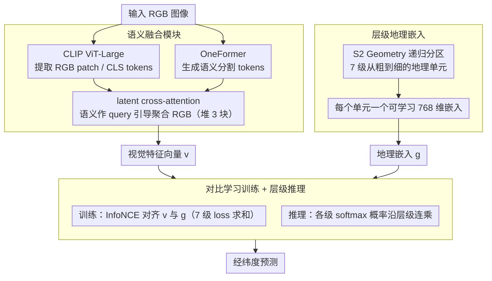

# GeoSURGE: Geo-localization using Semantic Fusion with Hierarchy of Geographic Embeddings

**会议**: CVPR 2026  
**arXiv**: [2510.01448](https://arxiv.org/abs/2510.01448)  
**代码**: 无  
**领域**: 图像检索与定位  
**关键词**: 视觉地理定位、语义融合、层级地理嵌入、对比学习、跨注意力

## 一句话总结
GeoSURGE 提出层级地理嵌入和语义融合模块，将全球图像地理定位问题建模为视觉表征与学习得到的地理表征之间的匹配，在 5 个基准的 25 项指标中取得 22 项 SOTA。

## 研究背景与动机

**领域现状**：全球视觉地理定位旨在仅凭图像视觉内容确定其在地球上的位置。现有方法主要分为两类：基于检索的方法（将查询图像与大规模地理标记图像库比对）和基于分类的方法（将地球表面离散化为地理单元并训练分类器）。近年 GeoCLIP 用 GPS 坐标代替图像参考、Img2Loc 和 G3 引入大视觉语言模型进一步提升了性能。

**现有痛点**：基于检索的方法在推理时需要大规模相似度搜索，计算开销大；基于分类的方法必须在空间分辨率和全球覆盖度之间取舍。更根本地，GPS 坐标的维度太低，很难学到表达力强的地理表征。GeoCLIP 用 Random Fourier Features 缓解了一部分问题，但低维 GPS 表征仍是瓶颈。

**核心矛盾**：地理坐标（经纬度）本质上是二维标量，难以承载丰富的地理语义；同时图像的外观特征易受光照、天气、视角变化影响，单一 RGB 特征的鲁棒性不够。

**本文目标** (1) 如何让地理表征本身具有足够高的表达力，使得不同尺度的地理区域都有可区分的特征？(2) 如何让视觉表征更鲁棒，融合场景语义信息来补足外观特征的不足？

**切入角度**：作者观察到分类方法的地理单元概念可以和检索方法结合——不把地理单元当离散标签，而是为每个单元学一个可训练的嵌入向量；同时利用语义分割提供的场景结构信息来补充 RGB 外观特征。

**核心 idea**：用层级可学习地理嵌入代替低维 GPS 坐标作为地理表征，用语义分割与 RGB 的 latent cross-attention 融合代替纯外观特征。

## 方法详解

### 整体框架
GeoSURGE 的输入是一张 RGB 图像，输出是其在地球上的经纬度预测。系统包含两大核心组件：(1) 地理表征——通过 S2 Geometry 将地球表面递归划分为多层级的地理单元，每个单元学习一个嵌入向量，形成层级分布式地理表征；(2) 视觉表征——用 CLIP ViT 提取 RGB 特征，同时用 OneFormer 生成语义分割图，通过 latent cross-attention 将两者融合为一个鲁棒的视觉特征向量。训练使用 InfoNCE 对比学习目标对齐视觉-地理特征对；推理时在层级中逐级匹配，将各级概率乘积作为最终预测。

### 关键设计

**1. 层级地理嵌入：让每个地理区域自己积累一套视觉特征，而不是用一对低维 GPS 坐标硬扛**

经纬度只是两个标量，表达力天然有限，GeoCLIP 之所以要叠 Random Fourier Features，本质上就是在给这个低维表征"补维度"。GeoSURGE 干脆换个思路：用 Google S2 Geometry 把地球表面投影到立方体六个面，再递归细分成地理单元——某个单元一旦包含超过 $\tau_{max}$ 个训练样本就继续分裂，少于 $\tau_{min}$ 的则直接排除。通过把 $\tau_{max}$ 从 25000 一路降到 500，得到 7 级从粗到细的分区。每个分区里的每个单元都对应一个**可学习的 768 维嵌入向量**，训练时由对比学习直接跟图像特征对齐。这样一来，一个区域的嵌入会在训练中"吸收"落在该区域内所有图像的视觉信息，自然形成比 GPS 坐标丰富得多的地理表征；各层级的嵌入独立学习以保持多样性，粗粒度提供高置信度、细粒度提供高分辨率，二者互补。

**2. 语义融合模块：用语义分割引导 RGB 特征聚合，而不是把语义当成另一路独立特征拼上去**

RGB 外观特征对光照、天气、视角都很敏感，而语义分割给出的场景结构（建筑、植被、道路）要稳定得多，还能顺手标出那些不利于定位的区域（行人、车辆），相当于隐式地把噪声框出来。模块先用 CLIP ViT-Large（冻结除最后几层外的参数）提取 RGB 的 patch tokens 和 CLS token，再用 OneFormer 生成 ADE20K 语义分割图并线性投影成语义 tokens。关键在于融合方式：语义 tokens 当 query、RGB tokens 当 key 和 value 做 latent multi-headed cross-attention（latent 形式降低了显存开销），再接 MLP + 残差 + LayerNorm，这样的 fusion block 串行堆 3 个以逐层细化融合特征，最后取融合后的 CLS token、过 LayerNorm 和线性投影得到视觉特征向量。让语义当 query 而非 value，意味着语义信息只负责"选择性地引导" RGB 该聚合哪些 patch，而不是直接替代外观——这比简单拼接两路特征更能保留 RGB 的判别力。

**3. 对比学习训练 + 层级推理：把视觉特征和地理嵌入拉到同一空间，再用逐级相乘的方式做多尺度定位**

训练时，每个样本既有融合后的视觉 CLS token $\mathbf{v}$，又有真值位置对应的地理嵌入 $\mathbf{g}$，用 InfoNCE 把正确配对的余弦相似度顶上去：

$$\mathcal{L}_i = -\log \frac{\exp(\mathbf{v}_i^\top \mathbf{g}_i / \tau)}{\sum_j \exp(\mathbf{v}_i^\top \mathbf{g}_j / \tau)}$$

完整训练目标是 7 个层级各自 loss 之和（温度 $\tau$ 每级独立、初始化为 0.07）。推理时对每一级都算查询图像与该级所有嵌入的 softmax 概率；对最细粒度的某个单元，把它在各父级上的概率连乘起来作为最终得分。这等于做了一次递进式的地理搜索——粗级先压缩搜索范围、给出高置信度的大致区域，细级再在其中挑出高分辨率的具体单元，比单一尺度的硬分类既稳又准。

### 损失函数 / 训练策略
使用 AdamW 优化器，初始学习率 0.0001，权重衰减 0.0001，有效 batch size 1024。每个 epoch 进行学习率衰减（gamma=0.5），早停策略（4 个 epoch 无改善停止）。温度参数初始化为 0.07，每个层级独立。8 块 A6000 GPU 训练 21 小时。使用 Ten Crop 方法平均预测。

## 实验关键数据

### 主实验

| 数据集 | 指标(1km) | GeoSURGE | GeoCLIP | PIGEOTTO | G3/GPT-4V |
|--------|-----------|----------|---------|----------|-----------|
| IM2GPS | 街道级 | **27.0** | 16.5 | 11.8 | - |
| IM2GPS | 大陆级 | **93.2** | 88.6 | 91.1 | - |
| IM2GPS3k | 街道级 | **17.2** | 14.1 | 10.9 | 16.6 |
| IM2GPS3k | 大陆级 | **87.6** | 83.8 | 84.4 | 84.7 |
| YFCC26k | 街道级 | **17.8** | 11.6 | 10.1 | - |
| GWS15k | 大陆级 | **80.8** | 74.1 | 84.7† | - |

在 5 个数据集 25 项指标中取得 22 项 SOTA。在排除 LVLM 方法的情况下，25 项全部最优。

### 消融实验

| 配置 | YFCC26k 1km | YFCC26k 25km | GWS15k 1km | GWS15k 25km |
|------|-------------|--------------|------------|-------------|
| Full (7级层级) | 17.8 | 31.5 | 1.0 | 4.6 |
| 5级层级 | 11.1 | 30.0 | 0.4 | 3.5 |
| 1级层级 | 8.9 | 27.5 | 0.1 | 3.1 |
| 3个融合块 | 17.8 | 31.5 | 1.0 | 4.6 |
| 无融合 | 13.8 | 30.4 | 0.6 | 4.6 |

### 关键发现
- 层级深度对细粒度指标（街道/城市级）影响最大：7 级 vs 1 级在 YFCC26k 1km 上相差约 2 倍（17.8 vs 8.9）
- 语义融合模块在 YFCC26k 1km 上提供约 36.5% 的相对提升（13.8→17.8）
- 地理嵌入（检索目标）在层级和扁平设置下都一致优于分类目标，证明嵌入和层级是互补的
- LVLM 方法在细粒度定位上有优势（可能来自大规模预训练中对标志性特征的记忆），但 GeoSURGE 在中粗粒度定位上全面胜出

## 亮点与洞察
- 将分类方法的地理单元和检索方法的特征匹配统一起来的设计非常巧妙。不把单元当标签而是当可学习嵌入，让每个区域"自动积累"其视觉特征，兼得两种范式的优点
- 语义分割作为 cross-attention 的 query 而非独立的第二表征是一个有意义的视角。语义不直接参与特征表达，而是作为结构性信号指导 RGB 特征的聚合，这种"引导而非替代"的思路可迁移到其他多模态融合任务
- 在 GWS15k（全球均匀分布）上性能提升最为显著，说明方法的泛化性好

## 局限与展望
- 依赖 OneFormer 进行语义分割预处理，增加了推理开销（数十万图像的处理）
- 分区方案固定使用 S2，没有探索自适应分区或数据驱动分区对性能的影响
- 缺少对不同视觉骨干网络（如 ViT-H、DINOv2）的探索
- 面对训练数据稀疏的地理区域（如海洋附近的小岛），参考图像距离真值可达 800+ km，说明数据覆盖仍是根本瓶颈

## 相关工作与启发
- **vs GeoCLIP**: 同样使用 CLIP 骨干和对比学习，但 GeoCLIP 直接嵌入 GPS 坐标（用 Random Fourier Features），GeoSURGE 用可学习的地理单元嵌入，避免了低维 GPS 的信息损失。相同骨干和数据下 GeoSURGE 全面胜出
- **vs Img2Loc/G3**: 这些方法借助 GPT-4V 的大规模知识进行 RAG 定位，在街道级有优势（可能来自对地标的记忆），但 GeoSURGE 在中粗粒度上更强
- **vs TransLocator**: TransLocator 在并行的语义和 RGB 骨干间做重复融合，GeoSURGE 用 latent cross-attention 更高效且效果更好

## 评分
- 新颖性: ⭐⭐⭐⭐ 层级嵌入+语义融合的组合设计有新意，但各组件并非全新
- 实验充分度: ⭐⭐⭐⭐⭐ 5 个基准数据集 + 详细消融 + 定性分析，非常全面
- 写作质量: ⭐⭐⭐⭐ 逻辑清晰，结构规范
- 价值: ⭐⭐⭐⭐ 在全球视觉定位领域建立了新的 SOTA 基线

<!-- RELATED:START -->

## 相关论文

- [\[CVPR 2026\] SouPLe: Enhancing Audio-Visual Localization and Segmentation with Learnable Prompt Contexts](souple_enhancing_audio-visual_localization_and_segmentation_with_learnable_promp.md)
- [\[CVPR 2026\] REL-SF4PASS: Panoramic Semantic Segmentation with REL Depth Representation and Spherical Fusion](rel-sf4pass_panoramic_semantic_segmentation_with_rel_depth_representation_and_sp.md)
- [\[CVPR 2026\] LoD-Loc v3: Generalized Aerial Localization in Dense Cities using Instance Silhouette Alignment](lod-loc_v3_generalized_aerial_localization_in_dense_cities_using_instance_silhou.md)
- [\[CVPR 2026\] Uncertainty-Aware Modality Fusion for Unaligned RGB-T Salient Object Detection](uncertainty-aware_modality_fusion_for_unaligned_rgb-t_salient_object_detection.md)
- [\[CVPR 2026\] Metric-Guided Feature Fusion of Visual Foundation Models for Segmentation Tasks](metric-guided_feature_fusion_of_visual_foundation_models_for_segmentation_tasks.md)

<!-- RELATED:END -->
