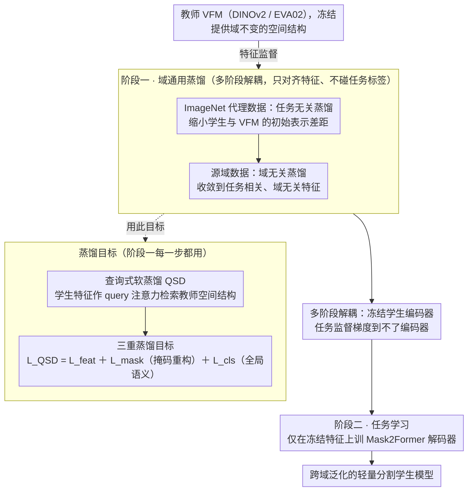

# GKD: Generalizable Knowledge Distillation from Vision Foundation Models for Semantic Segmentation

**会议**: CVPR 2026  
**arXiv**: [2603.02554](https://arxiv.org/abs/2603.02554)  
**代码**: [https://github.com/Younger-hua/GKD](https://github.com/Younger-hua/GKD)  
**领域**: 语义分割 / 知识蒸馏 / 域泛化  
**关键词**: 知识蒸馏, 视觉基础模型, 域泛化分割, DINOv2, 多阶段蒸馏

## 一句话总结

提出 GKD 框架，通过将表示学习与任务学习解耦的多阶段蒸馏（先学通用特征 → 冻结编码器 → 再训任务头）+ 查询式软蒸馏机制（QSD），从 VFM 中蒸馏出具有跨域泛化能力的轻量学生模型，在 F2L 设置下平均 mIoU 提升 +10.6%，F2F +1.9%。

## 研究背景与动机

**领域现状**：知识蒸馏（KD）广泛用于语义分割模型压缩——从大教师模型蒸馏出轻量学生模型。传统 KD 方法（CWD/Af-DCD/CIRKD 等）专注于保留源域精度，在域内表现不错。VFM（DINOv2/EVA02）作为通用特征提取器 + 轻量解码器的范式已被广泛采用。

**现有痛点**：传统 KD 只关注源域（in-domain）精度，忽视了跨域泛化（domain generalization）能力。这一问题在 VFM 时代尤为严重——VFM 本身具有强泛化能力，但通过传统 KD 蒸馏后，学生模型的泛化能力反而下降。实验显示传统单阶段 KD 甚至可能**损害**学生泛化，部分方法弱于无蒸馏 baseline。

**核心矛盾**：单阶段 KD 中存在**优化冲突**——任务损失驱动学生拟合源域特异性决策边界，蒸馏损失鼓励学生逼近教师的域不变表示。两个梯度方向矛盾，导致训练不稳定（loss 曲线振荡）和泛化退化。这意味着"KD 压缩了容量但损害了鲁棒性"。

**本文目标** 从 VFM 蒸馏出紧凑模型时，在压缩模型的同时**保留甚至提升**跨域泛化能力。两个评估设置：F2F（VFM→小VFM，如 DINOv2-L→DINOv2-B）和 F2L（VFM→本地模型，如 DINOv2-B→ViT-S）。

**切入角度**：表示学习与任务学习**不应耦合**。先让学生纯粹学习教师的域通用表示（不接触任务标签），然后冻结编码器只训练任务头。

**核心 idea**：解耦表示学习与任务学习——第一阶段纯特征蒸馏获取域通用表示，第二阶段冻结编码器训练任务头，配合 QSD 选择性检索教师空间知识。

## 方法详解

### 整体框架

GKD 想回答一个尴尬的问题：明明 VFM 自己泛化很强，为什么把它蒸馏进小模型后泛化反而塌了？作者的判断是「表示学习」和「任务学习」被搅在一起害的，于是把整个流程掰成前后两段。**阶段一是域通用蒸馏**，又分两步走：先在代理数据集 ImageNet 上做任务无关蒸馏，把学生和 VFM 之间巨大的初始表示差距先缩小；再切到源域上做域无关蒸馏，学到与任务相关但不依赖具体域的特征——这两步全程只对齐特征、完全不碰任务标签，且都用查询式软蒸馏（QSD）这套蒸馏目标。**阶段二是任务学习**，此时把学生编码器整个冻住，只在它的特征上训练 Mask2Former 解码器来做分割。这样任务监督的梯度永远到不了编码器，已经学好的泛化表示就不会被源域标签带偏。

### 关键设计

**1. 多阶段解耦：让特征蒸馏和任务监督各自占用不同训练阶段，互不干扰**

单阶段 KD 的病根在于优化冲突——任务损失逼着学生去拟合源域特有的决策边界，蒸馏损失却要它逼近教师的域不变表示，两个梯度方向打架，作者在诊断里直接看到单阶段的 loss 曲线一直振荡（Fig.3b），泛化随之退化。GKD 的做法是把这两件事彻底拆到不同阶段。阶段一第一步在 ImageNet 上蒸馏，$\min_{\theta_s} \mathbb{E}_{x_P \sim D_P}[\mathcal{L}_{QSD}(\mathcal{F}_{\theta_t}(x_P), \mathcal{F}_{\theta_s}(x_P))]$，学到任务无关的通用视觉表示；第二步切到源域继续蒸馏，$\min_{\theta_s} \mathbb{E}_{x_S \sim D_S}[\mathcal{L}_{QSD}(\mathcal{F}_{\theta_t}(x_S), \mathcal{F}_{\theta_s}(x_S))]$，把表示收敛到域无关的任务相关特征。到阶段二才冻结编码器 $\theta_s$、只训练解码器 $\theta_h$：$\min_{\theta_h} \mathbb{E}[\mathcal{L}(\mathcal{H}_{\theta_h}(\mathcal{F}_{\theta_s}(x_S)), y_S)]$。拆开之后 loss 曲线平滑收敛，消融也证实这是最大的那块收益——单阶段 MSE 46.4 直接跳到两阶段 MSE 53.1（+6.7 mIoU），远超任何换蒸馏损失带来的零点几个点。

**2. 查询式软蒸馏（QSD）：让学生主动检索教师的空间关系，而不是逐点临摹激活值**

VFM 真正值钱的不是某个像素的激活大小，而是它域不变的空间结构（论文用 PCA 可视化佐证），而传统逐点 MSE 只对齐局部数值、把这种全局关系丢掉了。QSD 改成把学生特征 $v_s \in \mathbb{R}^{B \times N \times C_s}$ 当成 query，去注意力检索教师的全部空间特征 $v_t$：先算注意力 $W = \varphi(v_s) \cdot v_t^\top$，再重构学生特征 $v_s' = \sigma(\varphi(v_s) \cdot v_t^\top) \cdot \phi(v_s)$，最后用 MSE 把重构结果对齐到教师 $\mathcal{L}_{feat} = \|v_s' - v_t\|_2^2$，其中 $\varphi, \phi$ 是线性投影。这一步的好处是学生不再被强行按住去复刻每个局部激活，而是通过 attention 把教师的关系结构内化进来——训练出来的注意力矩阵呈强对角线（保住空间对应）外加一些离对角响应（选择性聚合语义相关的位置），正好对应「保留结构 + 按需聚合」这两件想要的事。

**3. 三重蒸馏目标：从空间特征、掩码重构、全局语义三个层面一起逼近教师**

光对齐完整输入的空间特征还不够，作者把蒸馏目标拆成三项加权求和 $\mathcal{L}_{QSD} = \alpha \mathcal{L}_{feat} + \beta \mathcal{L}_{mask} + \gamma \mathcal{L}_{cls}$（三者权重默认均为 1.0）。$\mathcal{L}_{feat}$ 就是上面 QSD 在完整输入上的空间特征蒸馏；$\mathcal{L}_{mask}$ 把输入随机掩码后再要求学生重构教师的完整特征，逼它学会从残缺信息推断全局——这与 DINOv2 的 MIM 思路一脉相承，能把 VFM 平时藏着的知识逼出来；$\mathcal{L}_{cls}$ 则蒸馏 CLS token，把全局语义的一致性传给学生。三者互补：mask 管「从局部补全整体」的能力，CLS 管「整张图语义对齐」，feat 管「逐位置的结构」。消融里去掉 $\mathcal{L}_{mask}$ 掉 0.6、去掉 $\mathcal{L}_{cls}$ 掉 0.1，说明掩码项是这三项里更实打实的那个。

### 损失函数 / 训练策略

蒸馏阶段：AdamW，lr=5e-4，weight decay 0.05。F2L 设置：ImageNet 100 epochs（batch 512, 224×224）+ 源域 300 epochs（batch 128, 512×512）。F2F 设置：直接源域 300 epochs。任务阶段：Mask2Former，lr=1e-5（backbone冻结）/1e-4（decoder），40K iterations，batch 4，crop 512×512。

## 实验关键数据

### 主实验——F2L 设置（DINOv2-B → ViT-S）

| 方法 | GTAV→Citys | GTAV→BDD | GTAV→Map | Avg | 提升 |
|------|-----------|---------|---------|-----|------|
| Stu baseline (DeiT-S) | 34.9 | 33.8 | 42.8 | 37.2 | - |
| +Vanilla KD | 45.0 | 44.2 | 49.9 | 46.4 | +9.2 |
| +G2SD | 45.2 | 45.9 | 52.3 | 47.8 | +10.6 |
| +Proteus | 47.4 | 44.6 | 50.2 | 47.4 | +10.2 |
| **+GKD** | **54.9** | **49.8** | **57.8** | **54.1** | **+16.9** |

### 消融实验（GTAV→Citys+BDD+Map Avg, DINOv2-B→ViT-S）

| 配置 | mIoU | 说明 |
|------|------|------|
| 单阶段 MSE | 46.4 | 传统 KD baseline |
| 两阶段 MSE | 53.1 | +6.7，证实解耦至关重要 |
| 两阶段 QSD | 54.1 | +1.0，QSD 优于 MSE |
| 单阶段 QSD | 48.8 | 即使用 QSD，单阶段仍远弱于两阶段 |
| 去掉 $\mathcal{L}_{mask}$ | 53.5 | 掩码蒸馏贡献 +0.6 |
| 去掉 $\mathcal{L}_{cls}$ | 54.0 | CLS 蒸馏贡献有限 +0.1 |

### 关键发现

- **多阶段解耦是最大贡献**：单阶段→两阶段提升 +6.7 mIoU，远超任何蒸馏方法改进
- **1/16 标签效率惊人**：F2L 设置下 GKD 仅用 1/16 标签达到 51.4 mIoU，超越 Af-DCD 全量标签的 47.1
- **F2F 也有效**：DINOv2-L→DINOv2-B Avg 58.8→59.8（+1.0），DINOv2-B→DINOv2-S 53.9→55.6（+1.7）
- PCA 可视化证实 GKD 蒸馏后学生特征的空间结构与 DINOv2 教师高度一致

## 亮点与洞察

- **首次系统性诊断 KD 的泛化瓶颈**：发现传统 KD 甚至可能损害学生泛化能力，这一发现本身就有重要价值。以往所有 KD 工作都只关注源域精度
- **多阶段解耦简洁有效**：先学通用特征 → 冻结编码器 → 训任务头，理念清晰且实验验证效果显著。这一范式可推广到任何 VFM 下游适配场景
- **F2L 场景的巨大优势**：+10.6% 平均提升意味着 ImageNet 预训练的小模型几乎追上 VFM 的泛化能力
- **标签效率的实践意义**：1/16 标签超过传统 KD 全量标签，对标注资源有限的实际部署场景价值重大

## 局限与展望

- 需要额外的 ImageNet 预蒸馏阶段（100 epochs），增加了训练时间和计算成本
- 仅验证了 ViT 架构，CNN 学生模型（ResNet/MobileNet）能否受益未知
- 冻结编码器做任务学习可能限制源域精度上限——实际上 GKD 的源域精度（GTAV mIoU）有时不如传统 KD
- 仅关注语义分割，全景分割、实例分割、目标检测等更复杂任务待验证
- 不同 VFM 教师（DINOv2 vs EVA02）的泛化传递效率差异原因未深入分析

## 相关工作与启发

- **vs 传统分割 KD（CWD/Af-DCD/CIRKD）**：这些方法仅关注源域精度，在跨域评估中全面落后 GKD，部分甚至弱于无蒸馏 baseline
- **vs VFM 蒸馏（G2SD/Proteus/TinyMIM）**：这些方法采用"通用→特定"范式（任务学习阶段仍耦合蒸馏），GKD 是"通用→冻结→任务"范式（彻底隔离蒸馏和任务学习）
- **vs DGSS 方法（FisherTune/CrossEarth）**：GKD 从蒸馏角度解决泛化问题，与域泛化方法互补
- "蒸馏时解耦表示学习和任务学习"的原则可推广到所有 VFM 下游适配场景——linear probe 本质上就是冻结编码器

## 评分

- 新颖性: ⭐⭐⭐⭐ 多阶段解耦不全新，但 QSD 和泛化导向的蒸馏诊断视角是新颖的
- 实验充分度: ⭐⭐⭐⭐⭐ 5 个基准、F2F/F2L 双设置、多 VFM、标签效率、多源域扩展，极其全面
- 写作质量: ⭐⭐⭐⭐⭐ 动机诊断→方法设计→验证的逻辑链完美，Fig.3 的 loss 曲线对比直观有力
- 价值: ⭐⭐⭐⭐⭐ 解决了 VFM 蒸馏中被忽视的泛化问题，对实际部署有重要指导意义

<!-- RELATED:START -->

## 相关论文

- [\[CVPR 2026\] Selective, Regularized, and Calibrated: Harnessing Vision Foundation Models for Cross-Domain Few-Shot Semantic Segmentation](selective_regularized_and_calibrated_harnessing_vision_foundation_models_for_cro.md)
- [\[AAAI 2026\] Causal-Tune: Mining Causal Factors from Vision Foundation Models for Domain Generalized Semantic Segmentation](../../AAAI2026/segmentation/causal-tune_mining_causal_factors_from_vision_foundation_mod.md)
- [\[CVPR 2026\] Unlocking 3D Affordance Segmentation with 2D Semantic Knowledge](unlocking_3d_affordance_segmentation_with_2d_semantic_knowledge.md)
- [\[CVPR 2026\] Metric-Guided Feature Fusion of Visual Foundation Models for Segmentation Tasks](metric-guided_feature_fusion_of_visual_foundation_models_for_segmentation_tasks.md)
- [\[CVPR 2026\] Towards Robust Multi-Modal Semantic Segmentation with Teacher-Student Framework and Hybrid Prototype Distillation](towards_robust_multi-modal_semantic_segmentation_with_teacher-student_framework_.md)

<!-- RELATED:END -->
