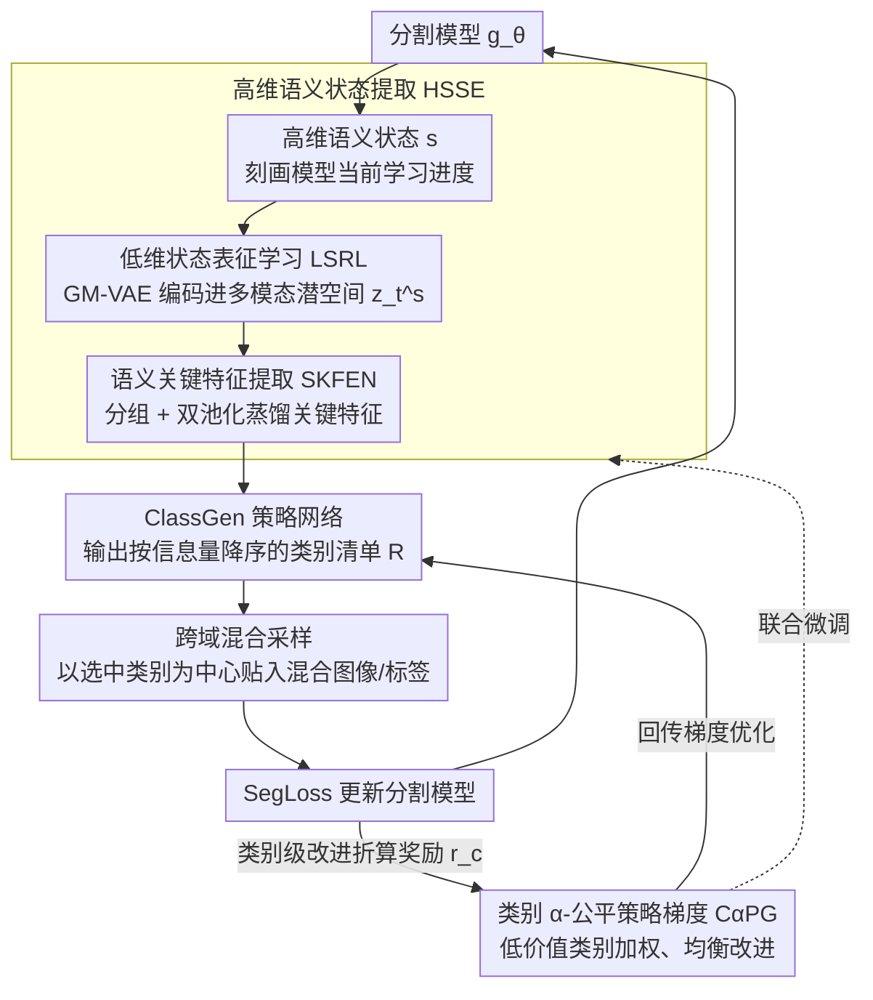

# Heuristic Self-Paced Learning for Domain Adaptive Semantic Segmentation under Adverse Conditions

**会议**: CVPR 2026  
**arXiv**: [2603.24322](https://arxiv.org/abs/2603.24322)  
**代码**: 无  
**领域**: 语义分割 / 域适应  
**关键词**: 无监督域适应, 语义分割, 课程学习, 强化学习, 恶劣天气

## 一句话总结

本文将无监督域适应中的类别课程学习重新定义为强化学习的序贯决策问题，提出 HeuSCM 框架，通过高维语义状态感知和类别公平策略梯度实现自主学习课程规划，在 ACDC、Dark Zurich 和 Nighttime Driving 上达到 SOTA（72.9 mIoU）。

## 研究背景与动机

**领域现状**：无监督域适应语义分割（UDA-SS）是自动驾驶环境感知的核心技术，用于将清晰天气下训练的模型迁移到恶劣天气（雾、雨、夜间）场景。主流方法采用风格迁移缓解域差异，同时通过课程学习（CL）或困难类挖掘（HCM）应对类别不均衡。

**现有痛点**：现有的CL和HCM方法存在根本性范式缺陷：(1) 难度评估依赖**固定人工设计指标**（如预测不确定性、置信度），用一维标量来描述模型高维动态的认知状态；(2) 学习路径由**人工设计规则**驱动（如"从易到难"或"全部聚焦困难类"），无法适应模型不断变化的内部状态。这种"规定式范式"在面对恶劣天气这样的复合问题时会导致类别偏差——某些类别被过度关注而其他类别学习不足。

**核心矛盾**：模型训练过程是一个高维、动态、非单调的演化过程。试图用固定、一维、人工定义的标量来静态规划这个学习路径是本质上不合理的。CL的"从易到难"会忽略当前模型真正需要的类别，HCM的"全部困难类"则缺乏类间均衡。

**本文目标**：从"设计课程"转向"学习课程"——让Agent基于模型当前状态自主发现最优学习轨迹，而非依赖人类先验假设。

**切入角度**：受强化学习启发，将课程学习建模为序贯决策问题——Agent在每个训练步骤观察模型状态，自主决定哪些类别最具信息量，以这些类别为中心进行跨域混合采样。

**核心 idea**：提出自主课程调度器，包含高维状态编码器感知模型学习状态和类别公平策略梯度确保均衡改进，实现真正的自适应类别课程学习。

## 方法详解

### 整体框架

这篇论文想解决的是：恶劣天气下的域适应分割里，"先学哪些类、后学哪些类"这条课程到底该怎么排。传统做法把课程写死成人工规则（从易到难、或一味盯困难类），而 HeuSCM 把课程排程交给一个强化学习 Agent，让它边训练边根据模型当前状态自己决定。

整条流水线是一个闭环：每个训练步先从分割模型里抽出一份高维语义状态 $\mathbf{s}$（刻画模型此刻"学到哪了"），交给高维语义状态提取网络（HSSE）处理成决策特征——先由 GM-VAE 压进低维潜空间得到 $z_t^s$，再由 SKFEN 蒸馏出真正反映学习进度的关键特征；策略网络 ClassGen 拿这份特征输出一张按信息量降序排好的类别清单 $R$，指导跨域混合采样把这些类别"贴"进混合图像与标签；分割模型在混合数据上用 SegLoss 更新，更新带来的类别级改进又被折算成奖励回传，由类别 $\alpha$-公平策略梯度（C$\alpha$PG）驱动策略下一轮做更好的排程。整个循环贯穿训练始终，课程随模型状态持续自我调整。

### 关键设计

**1. 低维状态表征学习（LSRL）：用 GM-VAE 把高维状态压成多模态潜空间，而不是一个标量**

传统 CL/HCM 用预测不确定性这一个标量来概括模型的认知状态，丢掉了类间耦合、特征空间漂移这些高维信息，自然没法支撑细粒度的课程决策。本文改用一个两阶段的高维语义状态提取网络（HSSE）来刻画"模型学到哪了"——本设计是它的第一阶段「低维状态表征学习（LSRL）」，第二阶段 SKFEN 见下一点。LSRL 用高斯混合 VAE（GM-VAE）把高维状态 $\mathbf{s}$ 编码进紧凑潜空间，离散分量 $q_\psi(c|\mathbf{s})$ 负责捕获"模型当前处于哪种学习模式"，连续潜变量 $q_\psi(\mathbf{z}|\mathbf{s},c)$ 在该模式下编码具体状态，训练目标是最大化变分下界

$$\mathcal{L}_{GM\text{-}VAE} = \mathbb{E}_{q_\psi(c|\mathbf{s})}\big[\mathbb{E}_{q_\psi(\mathbf{z}|\mathbf{s},c)}[\log p_\theta(\mathbf{s}|\mathbf{z})] - \text{KL}(q_\psi(\mathbf{z}|\mathbf{s},c) \,\|\, p(\mathbf{z}|c))\big] - \text{KL}(q_\psi(c|\mathbf{s}) \,\|\, p(c)).$$

之所以用混合高斯而非单峰，是因为模型在适应雾、雨、夜间这些不同条件时本身可能落在不同的"学习模式"上，单峰分布会把这些模式糊成一团。GM-VAE 先无监督预训练，之后冻结解码器、只保留编码器做高维→低维映射，并随策略网络一起联合微调，使潜状态持续对齐到与奖励相关的类别输出。

**2. 语义关键特征提取网络（SKFEN）：从已降维的潜空间里再筛一遍，只留对决策有用的维度**

作为 HSSE 的第二阶段，潜空间虽然维度低了，但里面仍混着大量对"该选哪些类"无关的冗余信息，直接喂给策略网络会稀释有效信号。SKFEN 分两步提纯：先用 1×1 → 5×5 深度可分离 → 1×1 的卷积组合做特征融合与交互建模，把通道扩展后切成 $G$ 组；每组分别走 max pooling 和 average pooling，从"峰值"和"均值"两个统计角度各看一眼，拼接后过 3×3 卷积融合，再加残差连接得到精炼特征 $z_{out}$。用分组 + 双池化的好处是同一份潜表征被从不同视角各抽一次，既保留显著激活又保留整体趋势，让最终交给策略的特征更贴近"学习状态"这件事本身。

**3. 类别 $\alpha$-公平策略梯度（C$\alpha$PG）：把公平性写进优化目标，逼策略照顾落后类别**

如果按标准 RL 去最大化总回报 $J_{sum}$，策略会本能地往"已经学得好、回报高"的类别上堆资源，形成马太效应、把类别不均衡越拉越大——这正是 HCM 一味盯困难类却仍偏科的根源。C$\alpha$PG 先给每个类别定义价值函数

$$V_c^\pi(s) = \mathbb{E}_\pi\Big[\sum_{k=0}^{\infty}\gamma^k r_c(t+k)\,\big|\,S_t=s\Big],$$

其中类别级奖励 $r_c(t)$ 同时看可迁移性（源域/目标域特征的余弦相似度）和可区分性（目标域里该类与其他类的分离度）。关键改动是把优化目标从求和换成 $\alpha$-公平目标 $J_F(\pi) = \sum_{c=1}^{C} \frac{1}{1-\alpha}\big(V_c^\pi(s)\big)^{1-\alpha}$，对应的策略梯度用公平加权优势 $\tilde{A}_\alpha$，权重 $w_c(s_t) = V_c^\pi(s_t)^{-\alpha}$ 与类别当前价值成反比——价值越低的类别拿到越大的权重。这一项把"多 Agent 公平性"的思路搬到了单 Agent 多类别场景，等于在梯度里直接给落后类别加码，从而把改进摊匀到所有类别上，而不是让强者愈强。

### 一个完整示例

设想 Cityscapes → ACDC 夜间适应训练进行到中段，分割模型对 road、car、building 这些大类已经学得不错，但对 fence、pole、traffic sign 这些细长稀有类仍然很弱。这一步里：HSSE 抽出当前状态 $\mathbf{s}$，GM-VAE 判断模型落在"夜间细类欠学"这一模式上并给出 $z_t^s$，SKFEN 把其中和"哪些类还没收敛"相关的维度提纯出来；ClassGen 据此排出一张清单，把 fence、pole、traffic sign 顶到前列。跨域混合采样随即以这几类为中心，把源域里这些类别的像素块贴进目标域夜间图，生成混合样本去训练分割模型。更新后，这几类的可迁移性/可区分性都涨了一点，奖励回传——但因为 road、car 这些已经高价值的类别权重 $w_c$ 被压低、fence/pole 这些低价值类别权重被抬高，策略不会因为大类回报高就回头去刷大类，而是继续把注意力留在仍落后的细类上，直到它们也追上来。这就是"学习课程"相对"设计课程"的差别：排课依据是模型此刻真实的欠缺，而非人写死的难易顺序。

### 损失函数 / 训练策略

- 分割损失：$\mathcal{L}_{seg} = \lambda_1 \mathcal{L}_{CE}(g_\theta(x_s), y_s) + \lambda_2 \mathcal{L}_{CE}(g_\theta(\mathcal{X}_{mix}^T), \mathcal{Y}_{mix}^R)$，其中 $\lambda_1 = \lambda_2 = 1.0$
- GM-VAE重建损失：$\mathcal{L}_{recon} = \mathbb{E}_{\mathbf{s}_t}[\|\mathbf{s}_t - p_\theta(\text{Enc}_\psi(\mathbf{s}_t))\|^2]$，用于微调时保持潜空间结构
- 策略优化：最大化公平目标 $J_F(\pi)$，使用 AdamW 优化器
- 在 Cityscapes → ACDC 上训练 60k 迭代，1024×1024 crop，NVIDIA A800 GPU

## 实验关键数据

### 主实验（Cityscapes → ACDC test）

| 方法 | Backbone | mIoU |
|------|----------|------|
| DeepLab-v2 (source only) | DeepLab-v2 | 38.0 |
| Refign | DeepLab-v2 | 48.0 |
| VBLC | DeepLab-v2 | 47.8 |
| **HeuSCM (Ours)** | DeepLab-v2 | **58.7** |
| HRDA (source only) | HRDA | 68.0 |
| CoDA | HRDA | 72.6 |
| ACSegFormer | HRDA | 72.7 |
| **HeuSCM (Ours)** | HRDA | **72.9** |

### 消融实验（ACDC val, HRDA backbone）

| 配置 | mIoU | 提升 | 说明 |
|------|------|------|------|
| Baseline (Refign) | 71.1 | +0.0 | 无HSCM |
| + LSRL only | 72.2 | +1.1 | 低维状态表征贡献最大 |
| + SKFEN only | 71.7 | +0.6 | 关键特征蒸馏有效 |
| + C$\alpha$PG only | 71.6 | +0.5 | 公平策略梯度有效 |
| + LSRL + SKFEN | 72.3 | +1.2 | 状态感知协同效果好 |
| + LSRL + C$\alpha$PG | 72.0 | +0.9 | 状态+公平组合有效 |
| + 全部三个（完整模型） | **72.7** | **+1.6** | 三个模块互补 |

### 关键发现

- 在 DeepLab-v2 backbone 上提升最为显著（+10.7 mIoU），说明HeuSCM对弱backbone的提升更大
- 在 HRDA 这种强backbone上仍然取得 72.9 mIoU 的SOTA，超越 CoDA（72.6）和 ACSegFormer（72.7）
- Dark Zurich 上达到 52.8 mIoU，Nighttime Driving 上达到 59.3 mIoU，证明在不同夜间场景下的泛化性
- HCSP（课程采样策略）可以作为即插即用模块替换现有硬类挖掘方法的采样策略，在 GTA5→Cityscapes 上也有效

## 亮点与洞察

- **范式转变的洞察非常锐利**：从"设计课程"到"学习课程"的理念shift，揭示了现有CL/HCM方法的根本局限——人类无法有效地为高维动态过程设计最优路径
- **$\alpha$-公平策略梯度设计精巧**：将多Agent公平性概念迁移到单Agent多类场景，通过反比权重机制自然地解决类别偏差问题
- **GM-VAE对学习状态的建模**：用混合高斯捕获多模态学习状态的思路值得借鉴——模型在适应不同天气条件时确实可能处于不同的"学习模式"

## 局限与展望

- 三阶段训练（GM-VAE预训练→联合微调→分割训练）增加了实现复杂度和训练开销
- SKFEN的具体架构设计（分组数G、扩展维度n等）可能需要针对不同场景调整
- 当前的reward设计假设源域和目标域特征可以在同一空间中比较，对于极端域差距场景可能不够鲁棒
- 未来可以扩展到其他域适应任务（如目标检测、实例分割）以验证框架的通用性

## 相关工作与启发

- **vs CoDA**: CoDA也做从易到难的域适应，但用的是人工设计的课程（先简单域再困难域），而HeuSCM完全自主学习课程顺序
- **vs ACSegFormer**: 达到相似性能但方法正交——ACSegFormer改进分割架构，HeuSCM改进训练策略，理论上可以组合使用
- **vs CoPT**: CoPT用prompt tuning做条件适应，HeuSCM用RL做课程学习，两者关注不同层面的适应机制
- 将RL范式引入训练策略优化（而非模型本身）的思路，可迁移到active learning、数据选择等相关问题

## 评分

- 新颖性: ⭐⭐⭐⭐⭐ "学习课程"的范式转变、GM-VAE状态编码和$\alpha$-公平策略梯度都是创新贡献
- 实验充分度: ⭐⭐⭐⭐⭐ 三个backbone、三个基准、详细消融、泛化验证，非常全面
- 写作质量: ⭐⭐⭐⭐ 动机阐述非常清晰，方法部分公式较密集需要反复阅读
- 价值: ⭐⭐⭐⭐ 对域适应中的课程学习提出了优雅的新范式，但具体实现复杂度较高

<!-- RELATED:START -->

## 相关论文

- [\[ECCV 2024\] FREST: Feature Restoration for Semantic Segmentation under Multiple Adverse Conditions](../../ECCV2024/segmentation/frest_feature_restoration_for_semantic_segmentation_under_multiple_adverse_condi.md)
- [\[CVPR 2026\] Masked Representation Modeling for Domain-Adaptive Segmentation](mrm_masked_representation_modeling_domain_adaptive.md)
- [\[CVPR 2026\] GeomPrompt: Geometric Prompt Learning for RGB-D Semantic Segmentation Under Missing and Degraded Depth](geomprompt_rgbd_segmentation.md)
- [\[CVPR 2026\] Seeing Beyond: Extrapolative Domain Adaptive Panoramic Segmentation](seeing_beyond_extrapolative_domain_adaptive_panoramic_segmentation.md)
- [\[CVPR 2026\] Low-Data Supervised Adaptation Outperforms Prompting for Cloud Segmentation Under Domain Shift](low_data_supervised_adaptation_outperforms_prompting_for_cloud_segmentation.md)

<!-- RELATED:END -->
