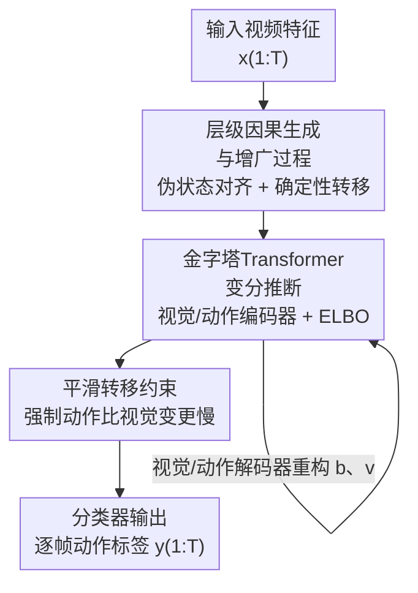

# Hierarchical Action Learning for Weakly-Supervised Action Segmentation

**会议**: CVPR 2026  
**论文**: [CVF Open Access](https://openaccess.thecvf.com/content/CVPR2026/html/Huang_Hierarchical_Action_Learning_for_Weakly-Supervised_Action_Segmentation_CVPR_2026_paper.html)  
**代码**: https://github.com/DMIRLAB-Group/HAL （有）  
**领域**: 视频理解 / 弱监督动作分割  
**关键词**: 弱监督动作分割, 因果表示学习, 层级隐变量, 可识别性, 平滑约束

## 一句话总结
HAL 利用「低层视觉特征变化快、高层动作语义变化慢」这一时间尺度不对称性，构造层级因果生成过程并配上一个平滑转移约束，让模型在只用动作转录（transcript）的弱监督下学到可识别的高层动作隐变量，从而缓解过分割、在 Breakfast / CrossTask / Hollywood / GTEA 四个基准上刷新弱监督动作分割 SOTA。

## 研究背景与动机
**领域现状**：弱监督动作分割只给「有序的动作列表」（transcript，如 `take→crack egg→pour milk`），而不给逐帧标注，目标却是输出逐帧动作标签。主流做法分两类：迭代两阶段方法（如 ISBA、TASL）先粗估伪标签再反复对齐细化；单阶段方法（如 ATBA、2by2）端到端直接把转录和视频帧对齐。

**现有痛点**：这些方法几乎都建立在**视觉层表征**之上。视频里相邻帧的外观会频繁抖动（光照、视角、手部遮挡等），而模型把这些视觉波动误当成动作切换，导致**过分割（over-segmentation）和噪声边界**——论文 Figure 1(a) 给的 CrossTask 例子里，"倒牛奶"过程中的视觉变化被切成了好几个假边界。

**核心矛盾**：动作的真实语义其实是**少数几个关键转移**组织起来的、跨多个抽象层级的结构；但视觉特征的快变和动作语义的慢变被混在同一层里建模，没有显式约束时二者纠缠，高层语义被低层抖动带跑。

**本文目标**：把"快变视觉"和"慢变动作"显式分层，并保证学到的高层动作变量是**可识别的（identifiable）**而非任意纠缠的表示，再用它去做分割。

**切入角度**：作者观察到一个可利用的归纳偏置——**时间尺度不对称**：低层视觉隐变量逐帧快速变化，高层动作隐变量演化缓慢、捕捉稳定语义。慢变的动作变量天然能抹平视觉抖动、抑制过分割。

**核心 idea**：构造一个「高层潜动作支配低层视觉动力学」的**层级因果生成过程**，并用一个**平滑转移约束**强制高层动作比低层视觉变得更慢，从而把动作变量从视觉波动中解耦出来、做到理论可识别，再拿可识别的高层动作去分割。

## 方法详解

### 整体框架
HAL 的输入是 $T$ 帧视频特征 $X=[x_1,\dots,x_T]$，输出是逐帧动作标签序列 $\hat Y=[\hat y_1,\dots,\hat y_T]$，训练时只有有序转录 $A=[a_1,\dots,a_M]$ 可用。整条管线分两层隐变量：视觉隐变量 $v_{1:T}$（快变）和动作隐变量 $c_{1:T'}$（慢变，$T'\le T$）。

方法先在**生成侧**把原始因果图改造成「增广生成过程」——因为真实动作变量个数比视觉变量少，没法直接套现成的等长 backbone，于是引入**伪状态（pseudo-states）**把动作变量补到和视觉变量一样长，并把伪状态之间的转移设成**确定性**的（不引入额外噪声，所以补出来的几个伪状态仍代表同一个动作，保住"动作变慢"的先验）。然后在**推断侧**用一个金字塔 Transformer 骨干提特征、配视觉/动作两个编码器和两个解码器做变分自编码，最后用平滑转移约束把"动作变慢"这个先验真正灌进隐空间，再接分类器出分割结果。

### 关键设计

**1. 层级因果生成与增广过程：用伪状态+确定性转移把"动作变慢"写进生成图**

痛点是：动作变量天然比视觉变量少（一个动作覆盖很多帧），而现成的序列 backbone 要求等长输入，没法直接照搬"一个高层动作支配多个低层视觉变量"的原始生成图。论文先写出原始生成过程：观测 $x_t=g(v_t)$ 由可逆混合函数从视觉变量生成；视觉变量 $v_{t,i}=f_i^v(\mathrm{Pa}_d(v_{t,i}),\mathrm{Pa}_h(v_{t,i}),\epsilon_{t,i}^v)$ 同时依赖**时延父节点** $\mathrm{Pa}_d$（局部时序依赖）和**层级父节点** $\mathrm{Pa}_h$（稳定的高层动作上下文）；而动作变量 $c_{t,i}=f_i^c(\mathrm{Pa}_d(c_{t,i}),\epsilon_{t,i}^c)$ 只依赖自己的时延父节点。

增广的关键在于：在动作序列里插入**伪状态**把它补到和视觉序列等长，并把伪状态间的转移设成**确定性**的。其精妙之处是——确定性转移不引入外生噪声 $\epsilon$，因此一段随机转移 $c_{t-1}\to c_{t+2}$ 被改写成混合形式 $c_{t-1}\dashrightarrow c_t\dashrightarrow c_{t+1}\to c_{t+2}$（$\dashrightarrow$ 是确定性、$\to$ 是随机），中间这几个伪状态 $c_t,c_{t+1}$ 因为没带新信息，可被视作**同一个潜动作**。这样既把动作和视觉对齐到等长（能复用现成 backbone），又在结构上保住了"动作演化更慢"的先验，为后面的可识别性证明铺路。

**2. 金字塔 Transformer + 变分推断：在特征层把视觉/动作两层隐变量解出来**

有了等长的层级生成图，还需要一个能同时抽取两层隐变量的推断网络。HAL 在特征层做变分自编码：先用视觉 Transformer 骨干 $\phi$ 把 $x_{1:T}$ 编成低维特征 $b_{1:T}$，再分别用视觉编码器 $\psi$、动作编码器 $\eta$ 推出 $\hat v_{1:T}=\psi(b_{1:T})$、$\hat c_{1:T}=\eta(\hat v_{1:T})$，并用视觉解码器 $\kappa$、动作解码器 $\xi$ 做重构 $\hat b_{1:T}=\kappa(\hat v_{1:T})$、$\hat v_{1:T}'=\xi(\hat c_{1:T})$。训练目标是该层级结构对应的 ELBO：

$$ELBO=\underbrace{\mathbb{E}_{q(v_{1:T}|b_{1:T})}\log p(b_{1:T}|v_{1:T})}_{\mathcal{L}_r}-\underbrace{\Big(D_{KL}(q(v_{1:T}|b_{1:T})\|p(v_{1:T}))+D_{KL}(q(c_{1:T}|v_{1:T})\|p(c_{1:T}))\Big)}_{\mathcal{L}_{KL}}$$

其中 $\mathcal{L}_r$ 是重构项、$\mathcal{L}_{KL}$ 是两层隐变量各自的 KL 项。之所以用**金字塔**式（pyramidal）transformer，是要在多个时间尺度上抓依赖：低层抓快变视觉、高层抓慢变动作，这恰好对应数据本身的多层级结构，比单层隐结构（如 CtrlNS）更能容纳多尺度的时序因子。

**3. 平滑转移约束 $\mathcal{L}_s$：把"动作变化必须慢于视觉"做成可优化的损失**

光有层级网络，模型并不会自动学到"动作慢、视觉快"——需要一个显式约束把这个归纳偏置压进隐空间，这正是 HAL 区别于以往平滑方法的核心。注意它约束的是**隐动作变量**，而非像 Gaussian/Boundary Smoothing 那样平滑**预测标签**。具体先对两层隐变量做 L2 归一化到同尺度 $\overline v_{1:T}=L2(v_{1:T})$、$\overline c_{1:T}=L2(c_{1:T})$，再算相邻帧的逐步变化量 $\Delta\overline V=\{|\overline v_2-\overline v_1|,\dots\}$、$\Delta\overline C=\{|\overline c_2-\overline c_1|,\dots\}$，然后：

$$\mathcal{L}_s=\underbrace{\mathrm{ReLU}\Big(\sum_{t=1}^{T-1}\mathbf{w}_c\Delta\overline C-\sum_{i=1}^{T-1}\mathbf{w}_v\Delta\overline V\Big)}_{\textbf{(i)}}+\underbrace{\delta\sum_{t=1}^{T-1}\mathbf{w}_c\Delta\overline C}_{\textbf{(ii)}}$$

权重 $\mathbf{w}_c=\mathrm{SoftMAX}(\Delta\overline C)$、$\mathbf{w}_v=\mathrm{SoftMAX}(\Delta\overline V)$ 让变化大的位置更受关注。两项的分工很清晰：**项 (i)** 是一个 ReLU 闸门，只有当动作变化量超过视觉变化量（$\sum\mathbf{w}_c\Delta\overline C-\sum\mathbf{w}_v\Delta\overline V>0$，即动作"变得比视觉还快"，违反先验）时才产生惩罚，强制动作演化慢于视觉；**项 (ii)** 由超参 $\delta$ 控制，对动作的快速变化整体加罚，进一步鼓励动作在时间上平滑一致。这一项是后面实验里贡献边界质量（IoU/IoD）的主要来源。

### 损失函数 / 训练策略
总损失把分割分类损失、ELBO 和平滑约束三者组合：

$$\mathcal{L}_{total}=\mathcal{L}_y-\alpha\cdot ELBO+\beta\cdot\mathcal{L}_s$$

其中 $\mathcal{L}_y$ 沿用 ATBA 的分割损失，$\alpha,\beta$ 是权衡超参。理论侧，论文在温和假设（密度有界连续、线性算子单射、正密度、雅可比非奇异）下证明：匹配 5 个连续帧 $\{x_{t-2},\dots,x_{t+2}\}$ 的联合分布即可块级识别 $(v_t,c_t)$（双层结构比单层多需要 $x_{t-2},x_{t+2}$ 两个观测），再借助"引入独立噪声把随机转移转成确定性转移"的技巧，进一步证明高层动作 $c_t$ 单独块级可识别——即估计的 $\hat c_t$ 只含真值 $c_t$ 的信息。

## 实验关键数据

### 主实验
四个基准（Breakfast / CrossTask / Hollywood Extended / GTEA），指标为 MoF（逐帧准确率）、MoF-Bg（去背景）、IoU、IoD。下面合并最有代表性的 Breakfast 与 CrossTask 结果（HAL vs 强基线 ATBA / CtrlNS）：

| 数据集 | 指标 | HAL（本文） | ATBA | CtrlNS | 说明 |
|--------|------|------|------|--------|------|
| Breakfast | MoF | **56.3±1.3** | 53.9±1.2 | — | +2.4 |
| Breakfast | IoU | **42.6±1.9** | 41.1±0.7 | — | 边界更准 |
| Breakfast | IoD | **62.4±2.5** | 61.7±1.1 | — | — |
| CrossTask | MoF | **54.0±0.8** | 50.6±1.3 | 54.0±0.9 | 与 CtrlNS 持平 |
| CrossTask | MoF-Bg | **35.0±1.1** | 31.3±0.7 | — | +3.7 |
| CrossTask | IoU | **21.6±0.4** | 20.9±0.4 | 15.7±0.5 | 大幅领先 CtrlNS |

在 Hollywood 上 HAL 取得最高 IoU(33.4)/IoD(56.8)/MoF-Bg(41.9)，仅 MoF 略低于 CtrlNS；在 GTEA 上 HAL 全指标最优（MoF 45.2、IoU 25.6、IoD 49.2）。作者指出 CrossTask 的 IoD、Hollywood 的 MoF 略弱，是因为这两个数据集背景场景更复杂多样，对背景建模更难。HAL 的增益**主要来自平滑约束 $\mathcal{L}_s$** 带来的高层动作时序一致性，从而提升与真值的对齐（IoU/IoD）。

### 消融实验（Breakfast split 1，Table 5）

| 配置 | MoF | IoU | IoD | 说明 |
|------|------|------|------|------|
| 基线（无任何附加项） | 53.3 | 40.1 | 58.7 | 起点 |
| 仅 $\mathcal{L}_r$ | 54.3 | 38.4 | 61.6 | MoF↑ 但 IoU↓：过重视重构致段落膨胀 |
| 仅 $\mathcal{L}_s$ | 54.6 | 40.3 | 61.6 | 平滑约束单独已涨点 |
| 仅 $\mathcal{L}_{KL}$ | 54.5 | **42.0** | 61.0 | KL 单项对 IoU 帮助最大 |
| 仅 $\delta$ 项 | 53.9 | 41.1 | 59.4 | 平滑项 (ii) 单独有效 |
| Full（全部） | **56.6** | **42.6** | **62.1** | 各项协同最优 |

### 关键发现
- **各组件都正向、且协同**：$\mathcal{L}_r,\mathcal{L}_s,\mathcal{L}_{KL},\delta$ 单开都能在基线上涨 MoF，全开时三项指标同时达到最高（56.6/42.6/62.1），说明它们不是冗余而是互补。
- **重构项是把双刃剑**：单独加 $\mathcal{L}_r$（Exp.2）会让模型过度强调特征重构，分割段落"膨胀"，IoU 反而从 40.1 掉到 38.4——必须靠 $\mathcal{L}_{KL}$ 和 $\mathcal{L}_s$ 把它拉回来。
- **高层动作变量更可分**：T-SNE 可视化显示，HAL 的高层动作变量比低层视觉变量聚类更紧致、也比 ATBA 的表示更密集，印证了"高层动作更稳定、更贴合真值分割"的假设，从表示层面解释了为何能抑制过分割。
- **MoF 持平但 IoU/IoD 领先**：HAL 在 MoF 上常与 ATBA/CtrlNS 接近，但 IoU/IoD 明显更好——说明它的优势不在"猜对多少帧"，而在**边界更准、段落更连贯**，这正是慢变动作变量抹平视觉抖动的直接体现。

## 亮点与洞察
- **把"时间尺度不对称"当成可识别性的杠杆**：动作慢、视觉快本是常识观察，但作者把它形式化成"确定性 vs 随机转移"的因果结构，进而换来理论可识别性保证——这是从一个朴素直觉走到严格证明的漂亮一跃。
- **伪状态+确定性转移的对齐技巧很巧**：用"不带噪声的确定性转移"把少量动作变量补成等长序列，既不破坏"动作变慢"的先验，又让现成等长 backbone 直接可用，是工程与理论的双赢。
- **约束加在隐变量而非标签上**：以往平滑方法平滑的是预测标签（治标），HAL 平滑的是隐动作变量（治本），把先验灌进表示层，因此对边界质量（IoU/IoD）提升更直接。
- **可迁移**：这套"层级隐变量 + 慢变约束 + 可识别性"的范式不限于动作分割，作者也指出可延伸到视频生成；任何存在"快变观测/慢变语义"的时序任务（如手势识别、行为预测、传感器序列）都能借鉴。

## 局限与展望
- **背景复杂场景仍偏弱**：在 CrossTask 的 IoD、Hollywood 的 MoF 上略逊于对手，作者归因于背景多样性，说明背景建模仍是短板。
- **依赖较强的理论假设**：可识别性证明依赖密度有界连续、线性算子单射、雅可比非奇异等假设，且需要"每个动作块至少有两个视觉子节点"，真实视频未必严格满足，理论保证与实际之间存在缝隙。
- **5 帧局部窗口**：识别性建立在匹配 5 个连续帧的联合分布上，对跨度更长、节奏更慢的动作转移，这种局部窗口是否足够捕捉慢变动力学，论文未充分讨论。
- **超参较多**：$\alpha,\beta,\delta$ 以及 softmax 权重等需要调，论文未给敏感性分析，复现时的调参成本可能不低。
- **改进思路**：可考虑自适应窗口长度、显式背景类建模、或把平滑约束做成可学习的（而非固定 $\delta$）以适配不同数据集的动作节奏。

## 相关工作与启发
- **vs ATBA（单阶段 transcript 对齐 / 边界平滑）**：ATBA 在视觉特征上找关键动作转移并平滑**预测边界**，HAL 沿用其分割损失 $\mathcal{L}_y$，但把平滑约束移到**隐动作变量**上，并加层级因果建模，因而在 IoU/IoD 上稳定超过 ATBA。
- **vs CtrlNS（转移稀疏的因果时序模型）**：CtrlNS 也用转移稀疏/独立噪声恢复隐动力学，但**只有单层隐结构**，无法刻画多层时序因子；HAL 是双层层级结构，CrossTask 的 IoU 上 21.6 vs 15.7 大幅领先。
- **vs Gaussian / Boundary Smoothing**：这些方法平滑的是输出标签，HAL 平滑的是归一化后的隐变量变化量，从表示层面解耦快慢动力学，是"治本"而非"治标"。
- **vs 非线性 ICA / 因果表示学习（TDRL、LEAP 等）**：HAL 把这条线的可识别性理论从单层隐变量推广到"高层动作支配低层视觉"的双层层级，并落到弱监督动作分割这个具体任务上，是因果表示学习在视频理解上的一次有理论保证的落地。

## 评分
- 新颖性: ⭐⭐⭐⭐⭐ 把"动作慢/视觉快"形式化为层级因果生成 + 可识别性证明，视角与理论都新。
- 实验充分度: ⭐⭐⭐⭐ 四基准全覆盖、消融拆到每个损失项，但缺超参敏感性分析、背景复杂场景仍偏弱。
- 写作质量: ⭐⭐⭐⭐ 动机—方法—理论—实验链条清晰，公式与图配合到位；理论部分较密、对非因果背景读者门槛偏高。
- 价值: ⭐⭐⭐⭐ 在弱监督动作分割上刷 SOTA，且"层级隐变量+慢变约束"范式可迁移到更广的时序任务。

<!-- RELATED:START -->

## 相关论文

- [\[CVPR 2026\] Frequency-Aware Affinity for Weakly Supervised Semantic Segmentation](frequency-aware_affinity_for_weakly_supervised_semantic_segmentation.md)
- [\[CVPR 2026\] Leveraging Class Distributions in CLIP for Weakly Supervised Semantic Segmentation](leveraging_class_distributions_in_clip_for_weakly_supervised_semantic_segmentati.md)
- [\[CVPR 2026\] Rethinking Box Supervision: Bias-Free Weakly Supervised Medical Segmentation](rethinking_box_supervision_bias-free_weakly_supervised_medical_segmentation.md)
- [\[CVPR 2026\] LaDy: Lagrangian-Dynamic Informed Network for Skeleton-based Action Segmentation via Spatial-Temporal Modulation](lady_lagrangian-dynamic_informed_network_for_skeleton-based_action_segmentation_.md)
- [\[ICCV 2025\] Joint Self-Supervised Video Alignment and Action Segmentation](../../ICCV2025/segmentation/joint_self-supervised_video_alignment_and_action_segmentation.md)

<!-- RELATED:END -->
