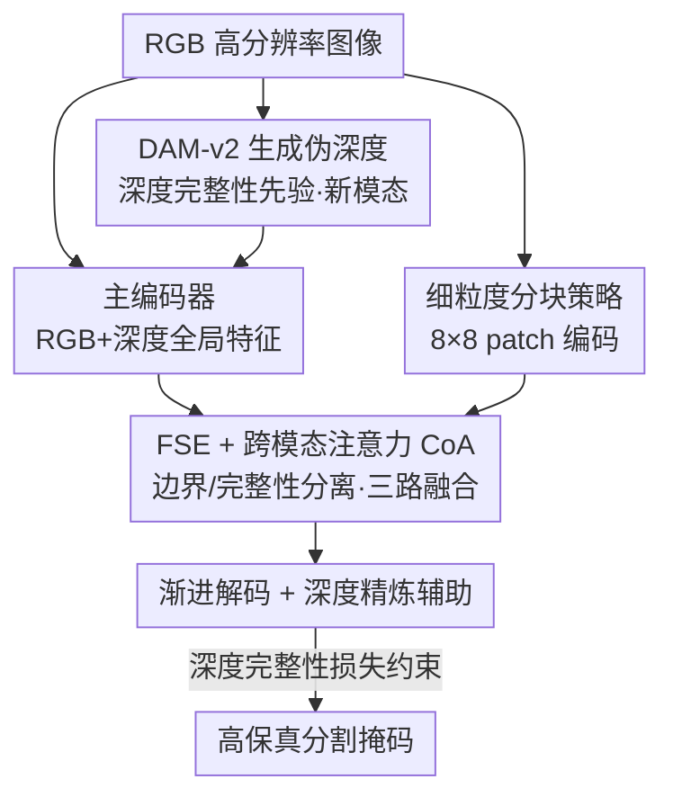

# High-Precision Dichotomous Image Segmentation via Depth Integrity-Prior and Fine-Grained Patch Strategy

**会议**: CVPR 2026  
**论文**: [CVF Open Access](https://openaccess.thecvf.com/content/CVPR2026/html/Liu_High-Precision_Dichotomous_Image_Segmentation_via_Depth_Integrity-Prior_and_Fine-Grained_Patch_CVPR_2026_paper.html)  
**代码**: https://tennine2077.github.io/PDFNet.github.io/ （有）  
**领域**: 二分图像分割 / 高精度分割  
**关键词**: 二分图像分割, 伪深度先验, 跨模态注意力, 细粒度分块, 高分辨率分割

## 一句话总结
针对高精度二分图像分割（DIS）"非扩散模型快但语义弱、扩散模型准但又大又慢"的两难，本文发现深度图里完整目标呈现"低方差、内部平滑、边界锐利"而背景呈"高方差混乱"，把它命名为**深度完整性先验**，用现成单目深度估计模型（DAM-v2）产出伪深度作为新模态，配合跨模态融合网络 PDFNet、深度完整性损失和 8×8 细粒度分块策略，在 DIS-VD 上以不到扩散方法一半的参数量取得 $F^{max}_\beta=0.915$ 的 SOTA。

## 研究背景与动机
**领域现状**：二分图像分割（Dichotomous Image Segmentation, DIS）要从高分辨率图像里像素级地抠出结构精细的前景目标（细到镂空、毛发、栅栏缝隙），是比普通显著性检测更苛刻的任务。研究分两条路线：非扩散派（CNN / Transformer，如 IS-Net、MVANet、BiRefNet）和扩散派（GenPercept、DiffDIS）。

**现有痛点**：非扩散方法轻量（10M–300M）、快（FPS>3），但卡在一个根本矛盾上——感受野放大去抓全局结构时，细节建模能力就被削弱；感受野收紧去保住局部细节时，全局结构又抓不准。结果是语义弱、缺乏稳定的空间先验，分割图频繁出现误检/漏检（把沙发的花纹错当目标、把目标的连续内部抠破）。扩散方法靠数十亿图像预训练的强生成先验把一致性做上去了，但代价是参数量爆炸（>865M）、推理极慢（FPS<1），实际部署不可行。

**核心矛盾**：精度和效率之间的 trade-off。要破局，需要一个**任务自适应的先验**，同时满足三点：易获取（能从现成可靠模型低成本拿到）、高性能（小参数、快推理）、强引导（能清楚区分目标和背景）。

**切入角度**：作者观察到一个被忽略的几何事实——在深度图里，一个完整目标因为表面连续，呈现"低方差、内部平滑、边界处深度突变锐利"的区域；而背景由分布在不同深度的破碎表面拼成，呈"高方差、混乱"的模式（论文 Fig.1 实测：GT 区域的深度方差显著低于背景和全图）。这正好满足强引导。而 DIS 数据里本没有深度图，于是作者想到用现成的单目深度估计模型 DAM-v2 直接生成**伪深度**——既易获取（DAM-v2-Base 跑 >10 FPS）又便宜。

**核心 idea**：把深度引入 DIS 当作**第一个新模态**，用"深度完整性先验"（depth integrity-prior）替代昂贵的扩散生成先验，来给分割提供结构引导——既拿到强语义，又保住非扩散范式的轻量与速度。

## 方法详解

### 整体框架
PDFNet（Prior-guided Depth Fusion Network）的输入是高分辨率 RGB 图像 $I\in\mathbb{R}^{B\times3\times H\times W}$，先用冻结的 DAM-v2 生成归一化伪深度图 $D\in\mathbb{R}^{B\times1\times H\times W}$（范围 $[0,1]$）；输出是高保真分割掩码。中间走一个多分支编码 + 渐进式精炼解码的结构：

- **多分支特征提取**：主编码器同时抽取 RGB 视觉特征 $\{F^v_i\}$ 和深度特征 $\{F^d_i\}$，提供全局空间语境；另起一条并行的分块分支，把输入切成 64 个 patch（$8\times8$）重排成大 batch，由专门的 patch 编码器抽细节特征 $\{F^p_i\}$，再重组回高分辨率序列，负责高保真细节。
- **FSE 精炼解码**：解码器每一级嵌入一个 Feature Selection and Extraction（FSE）模块，依据上一级预测分析"边界 / 完整性"线索，用跨模态注意力（CoA）把三路特征动态融合。
- **深度精炼辅助任务**：另起一个轻量深度解码器做伪深度重建，作为正则，逼共享编码器学到对分割和深度都有利的细粒度表征。
- 全程深监督，各级预测渐进上采样融合浅层特征得到最终掩码。

### 关键设计

**1. 深度完整性先验：把"完整目标=低方差深度区"变成可用的免费空间引导**

这是全文的地基，针对的就是非扩散方法"语义弱、空间先验不稳"的痛点。作者的关键观察是：一个真实完整的物体表面是连续的，所以在深度图里它是一片**低方差、内部平滑、边界锐利**的区域；背景则由不同深度的破碎面拼成，是**高方差、混乱**的。论文在 DIS-TR 上实测，GT 区域内的深度方差显著低于背景和全图，证明这个先验是普适且可判别的。由于 DIS 本身没有深度数据，作者用现成的单目深度模型 DAM-v2 直接生成伪深度——这是 DIS 领域**第一次把深度作为模态引入**。之所以有效，是因为它一举满足"易获取（off-the-shelf、>10 FPS）、低成本、强引导"三条标准，用几乎零代价的几何线索替代了扩散模型几十亿参数的生成先验。

**2. FSE 模块 + 跨模态注意力：边界/完整性分离 + 三路特征互补融合**

分块编码器靠限制感受野把细节抠出来，但代价是丢了上下文连接，patch 之间各管各的。FSE（Feature Selection and Extraction）就是来补这个洞的。它先对上一级预测 $P_{i+1}$ 做"边界-完整性分离"：平均池化得 $P_{p_{i+1}}=\text{AvgPool}(P_{i+1})$，绝对差超过阈值 $\tau=0.1$ 处置 1 得到边界图 $B_i$（放大边缘梯度），再用 $S_i=\text{ReLU}(P_{i+1}-B_i)$ 抑制边界、得到聚焦目标内部连续区的完整性图。$B_i$ 按 64 个 patch 切开，凡含边界的 patch 打分 $Bd_i=1$，从而选择性增强"含目标边界"的那些块。

融合则靠跨模态注意力 CoA（基于 cross-attention，含 RMSNorm 归一化 + SwiGLU FFN + 残差）。它把边界打分和完整性图当作软权重注入对应模态，再把局部细节、深度结构逐步并进全局视觉语境：

$$FN^{p*}_i = \text{CoA}(FP^p_i\odot(1+Bd_i),\; FP^{vd}_i),\quad FN^{d*}_i = \text{CoA}(FP^d_i\odot(1+S_i),\; FP^{vp}_i)$$

$$FN^{v1*}_i = \text{CoA}(F^{v*}_i, FN^{p*}_i),\quad FN^{v2*}_i = \text{CoA}(FN^{v1*}_i, FN^{d*}_i)$$

最后残差更新视觉/分块/深度三路特征。它有效的原因是：用预测得到的边界/完整性显式地告诉网络"该把注意力放在哪些含边界的 patch、哪些是内部连续区"，让分块分支重新拿回上下文，又让深度的结构约束动态融进全局语境。

**3. 深度完整性损失：用伪深度的均值和梯度直接约束掩码一致性**

光把深度当输入还不够，作者把"完整性先验"也写进损失，专治误检/漏检。它由两部分平均而成 $l_{inte}=(l_v+l_g)/2$。**深度稳定性约束** $l_v$ 基于一个统计直觉：目标区内深度应高度一致。先算 GT 掩码区均值 $\mu=\sum(D\odot M)/\sum M$，再用像素深度偏离 $\text{diff}=(D-\mu)^2$ 自适应加权交叉熵——一个深度偏离很大却被错误纳入的假阳（FP）会被重罚，一个深度和均值一致却被漏掉的假阴（FN）也被重罚鼓励纳入：

$$l_v = \mathbb{E}[-\log P_y \odot (\text{diff}\odot(\text{FP}-\text{FN})+\text{FN})]$$

其中 $P_y=P\odot M+(1-P)\odot(1-M)$ 表示像素预测是否正确。**深度连续性约束** $l_g$ 则利用"目标边界往往对应深度梯度突变"，用 Sobel 算子算深度梯度 $|G_x|+|G_y|$ 给高梯度处的分割错误加权：$l_g=\mathbb{E}[-\log P_y\odot(|G_x|+|G_y|)]$。两者合起来逼模型用深度线索学到结构连贯的表征，把目标内部和边界区分得更干净。消融显示该损失加到 MAGNet、CPNet 上也都能涨点，说明它是模型无关的通用约束。

**4. 细粒度分块策略：把 MVANet 的 2×2 扩到 8×8，并自适应选块**

DIS 是高分辨率任务，细节是命门。前作 MVANet 用 $2\times2=4$ 个 patch 做多视角输入，但 patch 一多它就崩（$3\times3$ 掉到 0.803、$4\times4$ 掉到 0.707），因为它没有保住全局上下文。本文把分块加密到 $8\times8=64$，并配合 FSE 的自适应选块只增强含边界的 patch、抑制非目标区。关键在于 PDFNet 有一条全分辨率主分支托住全局语境，分块分支只负责"在受限感受野里抠局部细节"，两者互补，所以加密 patch 不仅不崩反而越来越好——在 64 块达到峰值（$F^{max}_\beta=0.915$）；到 256 块（$16\times16$）才因感受野过窄、丢失捕捉细边所需的语境而回落。

### 损失函数 / 训练策略
分割监督沿用主流组合 $l=l_{wBCE}+l_{wIoU}+l_{SSIM}/2+l_{inte}$（加权 BCE + 加权 IoU + SSIM + 本文深度完整性损失）；深度精炼分支用尺度不变对数误差 $l_{SILog}$ 监督。整体损失对各级深监督加权：

$$L = l_f + \lambda_1\sum_{i=1}^{5}l^i_f + \lambda_2\cdot\Big(l_{SILog}+\lambda_1\sum_{i=1}^{5}l^i_{SILog}\Big),\quad \lambda_1=0.5,\;\lambda_2=0.1$$

骨干用 ImageNet-21K 预训练的 Swin-B，输入 resize 到 $1024^2$，AdamW、学习率 $1\times10^{-5}$、batch=1、100 epoch，单卡 RTX-4090。

## 实验关键数据

### 主实验
在 DIS-5K（5,470 图、225 类，含 DIS-TR/VD/TE1-4）上对比，五项标准指标 $F^{max}_\beta$、$F^w_\beta$、$E^m_\phi$、$S_\alpha$、$M$（除 MAE $M$ 越低越好外都越高越好）。下表为 DIS-VD 与 DIS-TE(ALL) 关键结果，参数列含外部深度生成器：

| 方法 | 模态 | 参数量 | DIS-VD $F^{max}_\beta$ | DIS-TE(ALL) $F^{max}_\beta$ | $M$↓ |
|------|------|--------|------|------|------|
| MVANet | RGB | 93M | .904 | .908 | .035 |
| BiRefNet | RGB | 215M | .897 | .900 | .035 |
| GenPercept（扩散） | RGB | 865M+84M | .877 | .875 | .036 |
| DiffDIS（扩散） | RGB | 865M+84M | .908 | .911 | .027 |
| CPNet | RGB-D | 216M+335M | .892 | .893 | .035 |
| **PDFNet-L** | RGB-D | 94M+335M | **.915** | **.915** | **.030** |

PDFNet-L 在 DIS-TE(ALL) 上比 MVANet 在五项指标分别提升 0.7%、1.5%、0.6%、1.2%、0.5%，并在多项指标上**用不到扩散方法一半的参数（94M+335M vs 865M+84M）追平甚至超过 DiffDIS**。FPS 上 PDFNet-S/B/L 为 5.7/4.5/3.9（含深度生成），远快于 DiffDIS 的 0.8。即使最轻的 PDFNet-S（94M+24M）在 DIS-VD 也达 .909，已超过所有非扩散方法。

### 消融实验
组件消融（仅在 DIS-VD，$S$=完整性图，$Bd$=分块边界打分，FSE 模块，Depth 模态）：

| 配置 | $F^{max}_\beta$ | $M$↓ | FPS | 说明 |
|------|------|------|------|------|
| Baseline（裸 encoder-decoder + 8×8） | .841 | .057 | 7.30 | 起点 |
| + Depth | .872 | .044 | 4.53 | 加深度模态，最大单项跳变 +0.031 |
| + FSE | .885 | .043 | 6.27 | 加 FSE 选块融合 |
| + $S$ + $Bd$ + Depth | .903 | .036 | 6.04 | 三者协同 |
| + $S$ + $Bd$ + FSE + Depth（full） | **.907** | .032 | 3.93 | 完整模型（未加深度损失） |

深度损失消融（Table 3）：加 $l_{SILog}$ 升到 .909，加 $l_{inte}$ 升到 .912，两者并用达 .915，说明深度精炼与 $l_{inte}$ 互补、单用增益小于合用。

分块数消融（Table 5）：

| 配置 | $F^{max}_\beta$ | FPS |
|------|------|------|
| MVANet 2×2 | .904 | 6.53 |
| MVANet 4×4 | .707 | 6.36 |
| PDFNet 1×1 | .907 | 7.23 |
| PDFNet 4×4 | .911 | 6.50 |
| **PDFNet 8×8** | **.915** | 6.04 |
| PDFNet 16×16 | .910 | 3.38 |

### 关键发现
- **深度模态贡献最大**：Baseline 加上 Depth 单步从 .841 → .872（+0.031），是所有组件里跳变最猛的，印证"深度完整性先验"是性能主引擎。
- **细粒度分块只在有全局主分支托底时才成立**：MVANet 一加密分块就崩（4×4 掉到 .707），PDFNet 因为有全分辨率主分支保住语境，反而 8×8 达峰；超过 64 块后感受野过窄又回落——这是和前作最有意思的分水岭。
- **$l_{inte}$ 是模型无关的通用约束**：加到 MAGNet（.867→.870）、CPNet（.892→.895）、PDFNet（.907→.912）上都涨点。
- **对伪深度质量鲁棒**：换 DAM-Small / DAM-v2-S/B/L / DepthPro 不同深度生成器（24M 到 1B），$F^{max}_\beta$ 在 .904–.917 间小幅波动，说明方法不依赖某个特定深度模型。
- **泛化到 HRSOD**：在 HRSOD-TE / UHRSD-TE 上 PDFNet-L 也全面超过 PGNet、InSPyReNet、BiRefNet，证明框架可迁移到相近的高分辨率显著性任务。

## 亮点与洞察
- **把"几何完整性"包装成可免费获取的先验**：核心洞察"完整目标在深度图里=低方差平滑区"很直觉但此前没人在 DIS 里用，且用伪深度绕开了"DIS 没有深度数据"的硬约束——这是典型的"换个模态把强先验白嫖过来"的巧思。
- **用扩散方法一半的参数追平 SOTA**：证明强先验不必靠几十亿参数的生成模型，几何线索 + 轻量融合就能逼近，对实际部署是实打实的价值。
- **深度完整性损失可直接搬到别的分割模型**：它只依赖伪深度的均值和 Sobel 梯度，是一个即插即用的正则项，消融已验证在 MAGNet/CPNet 上有效，迁移成本极低。
- **"主分支保全局 + 分块抠细节"的分工范式**：解释了为何 MVANet 加密分块会崩而本文不会，这个"全分辨率托底 + 受限感受野补细节"的搭配思路可迁移到其他高分辨率密集预测任务。

## 局限与展望
- **依赖外部深度估计器**：伪深度由 DAM-v2 离线生成，虽对生成器质量鲁棒，但整条管线多挂了一个深度模型，PDFNet-L 的 FPS（3.9）实际比纯非扩散的 MVANet（6.5）低不少；轻量化深度生成或端到端联合训练是可改进方向。
- **先验在"薄/透明/无明显深度落差"目标上可能失灵**：深度完整性先验假设目标与背景有可分的深度结构，对玻璃、薄片、贴墙海报这类深度上与背景几乎一致的目标，先验提供的引导会变弱，论文未专门分析这类失败案例。
- **batch=1、单卡训练**：训练配置偏保守，方法在更大 batch / 多卡下的表现与稳定性未知。
- **未与扩散方法做严格同口径精度对比的边界讨论**：论文已诚实指出 DiffDIS 用了"度量前二值化"会压低 $F^{max}_\beta$/$S_\alpha$、抬高其他指标，跨范式的精度高低需带此 caveat 看待。

## 相关工作与启发
- **vs MVANet（多视角分块）**：MVANet 用 $2\times2$ 多视角 patch 喂入，但缺全局主分支，分块一加密就崩。本文保留全分辨率主分支托底、把分块加密到 $8\times8$ 并自适应选块，既拿到细节又不丢上下文——在 DIS-VD 上 .915 vs .904。
- **vs BiRefNet（双边参考）**：BiRefNet 把整图编码、再把 patch 重输入解码器，仍是纯 RGB 单模态；本文引入深度模态 + 完整性损失，用结构先验补足 RGB 语义弱的短板。
- **vs DiffDIS / GenPercept（扩散范式）**：扩散派靠 Stable Diffusion 的生成先验拿一致性，但参数 >865M、FPS<1。本文证明用伪深度的几何先验 + 轻量跨模态融合，能以 <50% 参数追平 DiffDIS，给"不靠扩散也能高精度"提供了路线。
- **vs CPNet / MAGNet（RGB-D SOD）**：它们做的是显著性检测、且多依赖真实深度或重型双模块。本文面向更严苛的 DIS，用伪深度 + 完整性先验损失，且该损失反过来也能给 CPNet/MAGNet 涨点，说明贡献不局限于自家网络。

## 评分
- 新颖性: ⭐⭐⭐⭐⭐ DIS 领域首次引入深度模态，"深度完整性先验"洞察清晰且把它系统落成输入/损失/分块三处机制。
- 实验充分度: ⭐⭐⭐⭐⭐ DIS-5K 全子集对比 + 多组消融 + 跨深度生成器鲁棒性 + HRSOD 泛化，覆盖很全。
- 写作质量: ⭐⭐⭐⭐ 动机—观察—方法链条清楚，公式齐整；少数符号（FSE 内 CoA 多式）较密集，初读需对照图。
- 价值: ⭐⭐⭐⭐⭐ 用半数参数追平扩散 SOTA、损失可即插即用迁移，对高精度分割的实用部署有实打实意义。

<!-- RELATED:START -->

## 相关论文

- [\[CVPR 2026\] FlowDIS: Language-Guided Dichotomous Image Segmentation with Flow Matching](flowdis_language-guided_dichotomous_image_segmentation_with_flow_matching.md)
- [\[CVPR 2026\] CDICS: Delving Into Fine-Grained Attribute for In-Context Segmentation via Compositional Prompts and Phased Decoupling](cdics_delving_into_fine-grained_attribute_for_in-context_segmentation_via_compos.md)
- [\[CVPR 2026\] Training-Free Open-Vocabulary Camouflaged Object Segmentation via Fine-Grained Object Binding and Adaptive Hybrid Prompt](training-free_open-vocabulary_camouflaged_object_segmentation_via_fine-grained_o.md)
- [\[CVPR 2026\] CompetitorFormer: Mitigating Query Conflicts for 3D Instance Segmentation via Competitive Strategy](competitorformer_mitigating_query_conflicts_for_3d_instance_segmentation_via_com.md)
- [\[ICCV 2025\] LawDIS: Language-Window-based Controllable Dichotomous Image Segmentation](../../ICCV2025/segmentation/lawdis_language-window-based_controllable_dichotomous_image_segmentation.md)

<!-- RELATED:END -->
