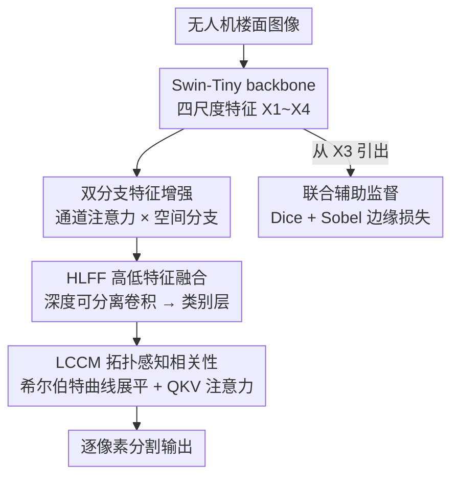

# Hilbert Curve-Based Attention Enabling Topology-Preserving Image Tensor Representation for Semantic Segmentation Network

**会议**: CVPR 2026  
**论文**: [CVF Open Access](https://openaccess.thecvf.com/content/CVPR2026/html/Xu_Hilbert_Curve-Based_Attention_Enabling_Topology-Preserving_Image_Tensor_Representation_for_Semantic_CVPR_2026_paper.html)  
**代码**: https://github.com/mumu-k/TPSegformer  
**领域**: 语义分割  
**关键词**: 建筑缺陷分割、希尔伯特曲线、拓扑保持、自注意力、无人机巡检

## 一句话总结
针对无人机拍摄的建筑表面缺陷分割，本文提出 TPSegformer，在解码器的注意力计算前用**希尔伯特曲线**而非传统行优先展开把二维特征压成一维序列，从而在降维时保住像素的空间邻接关系，再配合双分支特征增强、高低分辨率融合和 Dice+边缘联合辅助监督，在自建 BD3 缺陷数据集上拿到 80.77% mIoU / 90.22% Acc。

## 研究背景与动机
**领域现状**：语义分割在自动驾驶、医学影像里已经很成熟，主流做法是用强 backbone（CNN / Transformer）提多尺度特征，再用解码器逐级上采样恢复分辨率，近年还普遍引入自注意力来建模长程依赖。

**现有痛点**：把这套方法搬到**无人机楼面缺陷巡检**上却很吃力。建筑表面材质杂（石材、抹灰）、结构复杂、光照视角剧烈变化，导致裂缝、剥落、苔藓这些交织的缺陷容易被误分——比如某些光照下石材纹理长得像裂缝，直接被当成裂缝检出。而且这类方法引入自注意力时，几乎都用**行优先（row-major）遍历**把特征图展平成序列，行末跳到下一行行首会让原本相邻的像素在一维序列里被拉到很远，破坏空间连续性，削弱模型对结构的感知。

**核心矛盾**：注意力需要把二维特征"拉直"成一维序列来算相关性，但**拉直这一步本身就会摧毁二维拓扑**——相邻像素被打散，缺陷边界这种对邻接关系最敏感的结构最先遭殃。已有把希尔伯特曲线引入分割的工作（Zheng et al.）只是换了遍历方式，既没系统比较不同曲线，也缺对注意力影响的理论分析。

**本文目标**：做一个又轻、又准的缺陷分割网络，重点是在注意力降维阶段**保住空间拓扑**，同时兼顾多尺度融合和类间相关性建模。

**切入角度**：作者注意到空间填充曲线（space-filling curve）天生就是为"一维↔多维映射时保持局部连续"设计的。希尔伯特曲线相比 Z-order、行优先，能让一维序列里相邻的点在二维空间中也尽量相邻。

**核心 idea**：用希尔伯特曲线代替行优先遍历来完成注意力前的二维→一维降维，让"拉直"不再破坏拓扑，再把它嵌进一个轻量解码器 TPDecoder 里。

## 方法详解

### 整体框架
TPSegformer 整体是「Swin-Tiny backbone 提多尺度特征 → 双分支增强 → 高低分辨率融合生成类别层 → 拓扑保持的类间相关性计算 → 输出」。输入是无人机拍的楼面 RGB 图，输出是裂缝 / 剥落 / 苔藓 / 抹灰 / 石材五类的逐像素分割。

backbone 用 Swin Transformer-Tiny，输出四个尺度的特征 $X_1\in\mathbb{R}^{B\times C\times128\times128}$ 到 $X_4\in\mathbb{R}^{B\times C\times16\times16}$。解码端（TPDecoder）分两段：**特征增强段**用双分支分别强化语义和空间信息并相乘融合；**解码预测段**先用 HLFF 把高低分辨率特征融合并生成"类别层"（每个通道对应一个类），再用 LCCM 在这些类别层之间算注意力相关性——而 LCCM 内部的降维就是希尔伯特曲线发挥作用的地方。此外从 backbone 的 $X_3$ 引一条辅助监督分支，用 Dice+边缘联合损失帮 backbone 学到更清晰的边界。

### 关键设计

**1. 希尔伯特曲线拓扑保持降维：让"拉直特征"不再打散邻接像素**

这是全文的核心。LCCM 要在类别层之间算自注意力，就得把二维特征图 $(x,y)$ 映射成一维索引 $h$。论文对比三种映射：行优先 $R(x,y)=x\cdot W + y$（公式 6）、Z-order $Z(x,y)=\sum_k[\mathrm{bit}(x,k)2^{2k}+\mathrm{bit}(y,k)2^{2k+1}]$（公式 7）、希尔伯特曲线 $H(x,y)=\sum_{k=0}^{n-1}2^{2k}f_k(\mathrm{bit}(x,k),\mathrm{bit}(y,k))$（公式 5），三者都把 $[0,2^n-1]^2$ 的坐标映到 $[0,2^{2n}-1]$ 的一维索引。

为什么希尔伯特更好？论文定义了一个**局部性损失（locality loss）**来量化"拉直时丢了多少空间连续性"：

$$L_{local}=\sum_{i=1}^{N-1}\lVert p(i)-p(i+1)\rVert_2$$

其中 $p(i)$ 是第 $i$ 个像素在原二维空间的坐标。也就是把展平后**序列里相邻**的两个像素在**二维里的实际距离**全加起来——值越小说明一维相邻就尽量二维也相邻，拓扑保得越好。行优先在每行末尾要跳回下一行行首，跳跃距离很大，损失最高；希尔伯特曲线递归地用 U 形局部填满每个子块，序列相邻几乎总是二维相邻，损失最低（见实验 Table 1，order=7 时行优先 2064766、Z-order 139774、希尔伯特仅 16383）。代价是希尔伯特的索引计算更慢，但论文把它只用在低分辨率特征图（16×16/32×32）上，时间开销可接受。

**2. 双分支特征增强：补回 backbone 丢掉的局部纹理**

backbone 逐级下采样后细粒度细节会丢，对缺陷边界这种小结构尤其致命。作者在 ECANet 的基础上加了一条空间分支：通道分支沿用 ECANet，先全局平均池化得到通道描述子 $z_c=\frac{1}{H\cdot W}\sum_{i,j}X_c(i,j)$，再过一维卷积和 Sigmoid 得到通道权重 $w=\omega(\mathrm{Conv1D}(z))$；空间分支用 $3\times3$ 卷积 + ReLU + BN 抽局部纹理边缘 $F_s=\mathrm{BN}(\mathrm{ReLU}(\mathrm{Conv}_{3\times3}(X)))$。两者逐元素相乘 $X_{out}=F_s\odot w$ 融合，让网络既保留全局语义又强化局部结构。相比单纯通道注意力，多出来的空间分支专门补那些通道注意力会忽略的纹理/边缘细节。

**3. HLFF + LCCM 双模块解码：先轻量融合多尺度，再在类别层间建相关性**

解码预测段由两个模块组成。**HLFF（高低特征融合）** 把低分辨率特征 $X_l$ 上采样到高分辨率 $X_h$ 尺寸、沿通道拼成 $X_{cat}\in\mathbb{R}^{B\times(C_1+C_2)\times H_1\times W_1}$，为了轻量用**深度可分离卷积**（$3\times3$ depthwise 抽空间 + $1\times1$ pointwise 压通道），再用一个 $3\times3$ 卷积生成"类别层"——每个输出通道对应一个缺陷类别。**LCCM（轻量相关性计算）** 把 HLFF 输出经三条并行卷积得到 $Q,K,V$，各自经设计 1 的希尔伯特降维后，$Q$ 与 $K$ 算类间相似度、Softmax 归一化、用 $V$ 加权，再经通道扩展和 Sigmoid 得到注意力权重，逐元素调制类别层得到最终输出。这一步的意义是**显式建模缺陷类别之间的依赖**（比如剥落常伴随苔藓），缓解类间混淆，而降维放在拓扑保持的前提下做，注意力算出来的相关性才不会因为像素被打散而失真。

**4. 联合辅助监督：用 Dice + 边缘损失从中间层就拽住边界**

为增强中间特征判别力，作者从 Swin 最后一阶段的 $X_3$ 引一条轻量 FCN Head 辅助分支，双线性上采样回原分辨率后用**联合辅助损失** $L_{aux}=\lambda_{dice}L_{Dice}+\lambda_{edge}L_{Edge}$ 监督。Dice 损失 $L_{Dice}=1-\frac{2\sum p_i g_i}{\sum p_i^2+\sum g_i^2+\delta}$ 缓解类别不平衡（缺陷像素占比小）；边缘损失用 Sobel 算子提预测和真值的梯度幅值再算 $L1$ 距离 $L_{Edge}=\gamma\cdot\lVert\nabla p-\nabla g\rVert_1$，专门拽边界定位。这条辅助监督只在训练时用，等于显式逼着 backbone 在中间层就学到结构和边界信息，稳定训练。

### 损失函数 / 训练策略
主分支用交叉熵 + 上述联合辅助损失。实验用 RTX 4090，AdamW（初始学习率 $6\times10^{-5}$，$\beta=(0.9,0.999)$，weight decay 0.01），位置编码和归一化层设 0 weight decay，解码器参数给 10× 学习率倍率加速收敛。联合损失最优配置为 $\lambda_{dice}=0.5$、$\lambda_{edge}=1.0$。

## 实验关键数据

### 主实验
自建 BD3 缺陷分割数据集（裂缝/剥落/苔藓三类缺陷 + 抹灰/石材两类材质，5:1:1 划分），对比六个代表性分割网络：

| 方法 | 裂缝 | 剥落 | 苔藓 | 抹灰 | 石材 | mIoU | ACC |
|------|------|------|------|------|------|------|-----|
| CCNet | 53.86 | 81.21 | 60.03 | 94.83 | 70.90 | 72.17 | 82.53 |
| SegFormer | 50.60 | 72.49 | 57.35 | 95.99 | **93.72** | 74.03 | 86.43 |
| BiSeNetV2 | 45.11 | 65.43 | 58.70 | 94.43 | 78.00 | 68.33 | 77.50 |
| PIDNet | 55.90 | 78.60 | 55.37 | 95.07 | 79.71 | 72.93 | 84.27 |
| DSNet | 48.17 | 64.73 | 32.81 | 93.22 | 78.73 | 63.53 | 80.91 |
| **TPSegformer** | **59.98** | **91.11** | **72.58** | **96.71** | 83.44 | **80.77** | **90.22** |

TPSegformer 在 mIoU、ACC 和四个类别上全面领先，比最强竞争者高出明显幅度；唯一在石材类输给 SegFormer（93.72 vs 83.44），但 SegFormer 整体不稳定。在跨域的 Dacl10k 数据集（19 类、多材质多缺陷）上 TPSegformer 仍达 44.27% mIoU / 60.32% Acc，泛化能力强于六个对手。

### 消融实验

| 配置 | mIoU(%) | ACC(%) | 说明 |
|------|---------|--------|------|
| 行优先展平 | 75.58 | 86.37 | 拓扑破坏最严重 |
| Z-order 展平 | 77.89 | 88.00 | 居中 |
| **希尔伯特曲线** | **79.49** | **89.51** | 拓扑保持最好（+3.9 mIoU vs 行优先） |

backbone 适配性（Table 5）：Swin 系列最好（Swin-T 79.49 → Swin-L 81.37），HRNet 次之，ResNet 最弱；Swin-Tiny 已逼近更大的 HRNet/ResNet 变体，效率-精度平衡好。联合辅助损失超参（Table 6）：$\lambda_{dice}=0.5,\lambda_{edge}=1.0$ 时最优（80.77/90.22），不加辅助损失基线为 79.49/89.51。

### 关键发现
- **拓扑保持直接决定分割精度**：仅把行优先换成希尔伯特展平（其他不变），mIoU 从 75.58 涨到 79.49（+3.9），证实"拉直时保住邻接"对注意力建模实打实有用。
- **希尔伯特的代价是计算更慢**（Table 2，128×128 时 0.13s vs 行优先 0.01s），但局部性损失低一个量级（Table 1），作者用"只在低分辨率特征上用"来权衡。
- **类别表现两极**：剥落类提升最大（91.11 vs 次高 81.21），裂缝/苔藓也明显领先；说明高低融合 + 类间相关性对纹理交织的缺陷帮助最大。注意力热图也显示 SEM→HLFF→LCCM 逐级把注意力收敛到缺陷边界。

## 亮点与洞察
- **把"空间填充曲线"这个老工具用对了地方**：注意力降维这一步常被当成无害的 reshape，本文指出它其实在悄悄破坏拓扑，并用希尔伯特曲线修复——视角很巧，且用 locality loss 给了可量化的理论支撑（不是只贴个曲线名）。
- **locality loss 是个可复用的小指标**：任何"二维→一维"的展平操作（不限于分割注意力，点云序列化、图像 token 化都适用）都能用它评估拓扑损失，迁移成本几乎为零。
- **轻量化贯穿始终**：深度可分离卷积做融合、Swin-Tiny 做 backbone、希尔伯特只用在低分辨率，整体是冲着无人机端部署去的，不是堆算力刷点。

## 局限与展望
- **数据集偏窄**：核心结论建立在自建的 BD3 重构数据集上（仅三类缺陷两类材质），虽然 Dacl10k 上验证了泛化，但绝对精度（44.27 mIoU）说明跨域仍有较大差距。
- **希尔伯特降维的开销随分辨率快速上升**，论文只能限制在低分辨率特征用；如果要在高分辨率上算注意力，索引计算成本会成为瓶颈，缺少 GPU 端高效实现的讨论。
- **创新点相对集中**：除希尔伯特展平外，双分支增强（基于 ECANet）、HLFF、辅助损失多是成熟模块的组合，核心新意主要在曲线选择这一点上。
- **缺少对希尔伯特曲线阶数/特征图尺寸非 $2^n$ 时如何处理的说明**，实际特征图边长不总是 2 的幂，padding/裁剪策略未交代（⚠️ 以原文为准）。

## 相关工作与启发
- **vs Zheng et al.（首个把希尔伯特引入分割注意力）**: 他们只是换了遍历方式，没系统比较不同曲线、也没分析对注意力的影响；本文补上了三种曲线（行优先/Z-order/希尔伯特）的理论（locality loss）+ 实验（消融）双重对比，把"为什么是希尔伯特"讲清楚了。
- **vs SegFormer / PIDNet / DDRNet 等高效分割网络**: 它们靠多尺度上采样或边缘监督提精度，但都用行优先展开注意力、忽略拓扑；本文在融合+辅助监督之外多了拓扑保持这一维，复杂纹理缺陷上更稳。
- **vs ECANet**: 本文在其纯通道注意力上加空间分支，把"只看通道"扩成"通道×空间"，补回边界纹理细节。

## 评分
- 新颖性: ⭐⭐⭐⭐ 把空间填充曲线对注意力降维的拓扑影响讲透并量化，切入点新；但其余模块多为成熟组件组合。
- 实验充分度: ⭐⭐⭐⭐ 主对比+三种曲线消融+backbone适配+损失超参+跨域 Dacl10k+无人机实拍都做了，较完整；数据集规模偏小。
- 写作质量: ⭐⭐⭐⭐ 动机-方法-实验逻辑顺畅，公式和图配套；个别符号（如非 $2^n$ 尺寸处理）交代不全。
- 价值: ⭐⭐⭐⭐ 无人机建筑缺陷巡检是有实际落地需求的场景，locality loss 视角可迁移到其他展平任务。

<!-- RELATED:START -->

## 相关论文

- [\[CVPR 2026\] Towards High-Quality Image Segmentation: Improving Topology Accuracy by Penalizing Neighbor Pixels](towards_high-quality_image_segmentation_improving_topology_accuracy_by_penalizin.md)
- [\[CVPR 2026\] SAQN: Semantic-based Adaptive Query Network for 3D Referring Expression Segmentation](saqn_semantic-based_adaptive_query_network_for_3d_referring_expression_segmentat.md)
- [\[CVPR 2026\] REL-SF4PASS: Panoramic Semantic Segmentation with REL Depth Representation and Spherical Fusion](rel-sf4pass_panoramic_semantic_segmentation_with_rel_depth_representation_and_sp.md)
- [\[CVPR 2026\] Masked Representation Modeling for Domain-Adaptive Segmentation](mrm_masked_representation_modeling_domain_adaptive.md)
- [\[CVPR 2026\] MARSS: Radar Semantic Segmentation via Modular Attention and State Space Models](marss_radar_semantic_segmentation_via_modular_attention_and_state_space_models.md)

<!-- RELATED:END -->
