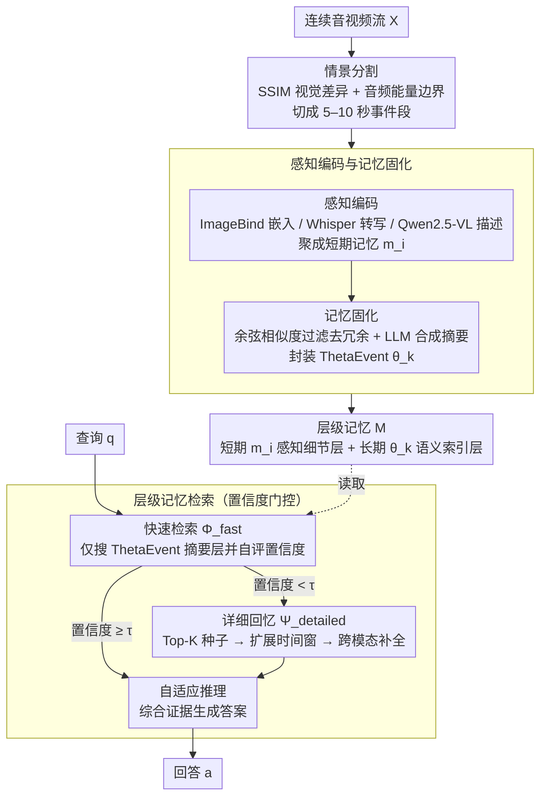

# HippoMM: Hippocampal-inspired Multimodal Memory for Long Audiovisual Event Understanding

**会议**: CVPR 2026  
**arXiv**: [2504.10739](https://arxiv.org/abs/2504.10739)  
**代码**: [https://github.com/linyueqian/HippoMM](https://github.com/linyueqian/HippoMM)  
**领域**: 图像分割  
**关键词**: 海马体认知架构, 多模态记忆, 长视频理解, 跨模态关联, 情景记忆

## 一句话总结

HippoMM 将海马体的三大认知机制——模式分离（情景分割）、记忆固化（语义压缩）和模式补全（层级检索）——映射为计算架构，用于长音视频的情景记忆和跨模态关联回忆，在自建基准 HippoVlog 上达到 78.2% 准确率并比检索增强基线快 5 倍。

## 研究背景与动机

1. **领域现状**：当前多模态模型在长视频理解上面临三大挑战：(1) 无法高效记忆持续数小时的连续内容；(2) 不能从部分感官线索（如一个声音）重建完整体验；(3) 无法从短暂感知中提取持久性的抽象知识。人类海马体天然解决了这三个问题。

2. **现有痛点**：现有方法要么通过扩大模型规模或设计复杂架构来处理长视频（如 VideoLLaMA、Qwen2.5-Omni），但缺乏显式的记忆机制。这些模型只能处理预分段的片段，无法从连续流中形成情景记忆或做跨模态模式补全（如听到掌声回忆起当时的画面）。

3. **核心矛盾**：现有基准（如 MLVU、Video-MME）测试的是对已呈现内容的理解能力，而非记忆形成和关联回忆能力。缺乏评估跨模态关联回忆的测试标准。

4. **本文目标** (a) 如何从连续音视频流中构建情景记忆？(b) 如何实现跨模态模式补全（一个模态的线索触发另一个模态的回忆）？(c) 如何在精度和效率之间取得平衡？

5. **切入角度**：生物海马体通过齿状回（DG）的模式分离、CA3 的自联想模式补全和 CA1 的记忆固化解决了上述问题。作者将这三种机制直接映射为算法实现。

6. **核心 idea**：将海马体"分割-固化-检索"的认知流程映射为"内容自适应分段 → 相似性过滤压缩 → 置信度门控层级检索"的计算架构，实现长音视频的情景记忆理解。

## 方法详解

### 整体框架

HippoMM 想解决的核心问题是：让模型像人一样把数小时的连续音视频"记住"，并能从一个片面线索（一段掌声、一个名字）反向回忆起当时的完整画面。它把整条流水线拆成两段，正好对应人脑记忆的"写入"与"读取"。第一段是**记忆形成**：把连续音视频流 $X$ 切成离散事件，逐段编码成多模态表示，再压缩掉冗余、提炼出语义索引，最终落成一个层级记忆结构 $M$——底层是保留感知细节的短期记忆对象 $m_i$，上层是高度浓缩的长期语义索引 ThetaEvent $\theta_k$。第二段是**层级记忆检索**：来一个查询 $q$，先在浓缩的语义层快速找答案，只有当模型对答案没把握时才下沉到感知细节层做精细回忆（这一步支持跨模态补全），最后用自适应推理把检索到的证据综合成回答。整套设计直接对应海马体齿状回（DG）的模式分离、CA1 的记忆固化和 CA3 的模式补全三个功能区。

### 关键设计

**1. 情景分割：让事件边界由内容决定，而不是固定窗口切刀**

长视频处理最常见的做法是按固定时长（比如每 10 秒）切片，但这种切刀会把一个连续事件拦腰斩断，也会把毫不相干的两个场景塞进同一段——后续不管怎么编码都救不回来。HippoMM 改成由内容本身触发边界：视觉上用 SSIM 衡量相邻帧的差异 $d_v(F_t, F_{t-1}) = 1 - \text{SSIM}(F_t, F_{t-1})$，差异冲过阈值 $\tau_v$ 就断开（镜头切换、场景转移）；音频上用分贝级能量 $d_a(a_t) = -20\log_{10}(\sqrt{\frac{1}{N}\sum a_i^2})$ 监测，能量跌破 $\tau_a$ 说明出现了静音或停顿，也作为边界。两路信号共同把流切成约 5–10 秒一段，这个尺度刻意贴近人类感知事件的时间粒度。因为边界落在语义真正变化的地方，每段都是一个完整的"情景单元"，在时间理解任务 NQA 上比 VideoLLaMA 2 高出 46%。

**2. 感知编码与记忆固化：先多模态编码，再按相似度过滤压成 ThetaEvent**

切好的片段如果原样全存，存储和检索都会被海量冗余拖垮。HippoMM 分两步处理。编码这一步对每段并行跑三个专用模型：ImageBind 产出 1024 维的跨模态嵌入 $\mathbf{E}_i$（用于相似度搜索），Whisper 转写语音 $\mathcal{T}_a$，Qwen2.5-VL 生成视觉描述 $\mathcal{T}_v$，三者聚合成一个 ShortTermMemory 对象 $m_i = \{\mathbf{E}_i, \mathbf{T}_i, \mathbf{C}_i, t_{s,i}, t_{e,i}\}$，保留时间戳与原始细节。固化这一步则做减法：对每段算出平均嵌入 $\mathbf{v}_i$，只有当它与已存的所有记忆都足够不像时才保留，

$$K = \{\, i \mid \forall j \in K,\ j < i \Rightarrow \cos(\mathbf{v}_i, \mathbf{v}_j) < \gamma \,\},\quad \gamma = 0.85$$

相似度超过 $\gamma$ 的片段被判为重复、直接丢弃。这一步刻意模仿 CA3 只激活 2–5% 神经元的稀疏性，把记忆压到很小的规模。保留下来的片段再由 LLM（Qwen2.5-VL）把多模态内容合成一句简洁的文本"要旨" $\mathbf{S}_{\theta_k}$，连同嵌入一起封装成 ThetaEvent 对象。这种"嵌入 + 文本摘要"的双重表示正是关键：嵌入支撑快速向量检索，文本要旨支撑 LLM 推理，二者各管一条检索路径，对应的就是 CA1 把感知细节固化为抽象语义的功能。

**3. 层级记忆检索：置信度门控的双路径，加跨模态模式补全**

读取记忆时，"视频主题是什么"和"掌声响起时屏幕上是什么"是两类截然不同的查询——前者只需扫一眼语义摘要，后者却要精确定位时间并跨模态对齐。HippoMM 用一个置信度闸门把两者分开。任何查询先走快速检索 $\Phi_{\text{fast}}$：只在 ThetaEvent 摘要层搜索，由 Qwen2.5-VL 给出答案并自评置信度；只要置信度过得了阈值 $\tau = 0.75$ 就直接返回。一旦置信度不够，才升级到详细回忆 $\Psi_{\text{detailed}}$。详细回忆的真正创新是**跨模态模式补全**：它先用查询线索在目标模态里找到种子片段

$$\mathbf{S}_{\text{query}} = \text{TopK}\big(\text{sim}(q_{\text{embed}}, \{\mathbf{v}_k\}),\ k\big),$$

再围绕这些种子向两侧扩展时间窗 $\mathbf{W} = \{[t_{s,k} - \delta,\ t_{e,k} + \delta]\}$，最后在这个扩展窗口里去捞另一个模态的信息 $\mathbf{S}_{\text{target}}$。它依赖的假设很朴素却很好用——"同一时刻出现的声音和画面属于同一情景"，于是时间共现就成了天然的跨模态关联线索。这套按需升级的设计兼顾了效率和精度：简单语义问题在摘要层秒答，只有真正需要精细定位的问题才付出详细回忆的代价（消融显示去掉快速检索后准确率几乎不变，但响应时间从 6.39s 拉长到 19.54s）。

### 一个完整示例：回答"掌声响起时屏幕上是什么"

拿一个跨模态绑定问题走一遍，能看清三个模块怎么串起来。假设一段 682 分钟的 vlog 已经被分割并固化成若干 ThetaEvent。

- **快速检索先试**：系统在 ThetaEvent 摘要层搜"掌声 + 屏幕画面"，但摘要是高度浓缩的语义要旨，里面只写了"会场鼓掌"，答不出屏幕上的具体内容，自评置信度只有约 0.6，低于阈值 $\tau = 0.75$。⚠️ 此处置信度数值为示意，以原文为准。
- **升级到详细回忆**：以"掌声"为查询线索，在音频模态里取 Top-$k$ 个种子片段——命中含掌声能量峰值的那一段，时间戳约 $t_s$=12:30、$t_e$=12:38。
- **扩展时间窗 + 跨模态捞取**：围绕种子向两侧各扩 $\delta$ 秒得到窗口 $[12:30-\delta,\ 12:38+\delta]$，再到**视觉**模态里检索落在这个窗口内的描述，捞出"演讲者站在台上，身后屏幕显示获奖名单"。
- **自适应推理收尾**：把音频种子（掌声）和视觉证据（获奖名单屏幕）交给 LLM 综合，输出"屏幕上是获奖名单"。

整个过程里候选范围一路收缩：全量 ThetaEvent → 含掌声的少数音频种子 → 一个扩展时间窗 → 窗口内重叠的视觉片段，最终锁定答案。这正是详细回忆不可替代的原因——消融里去掉它，跨模态绑定准确率从 70.8% 直接跌到 39.2%。

## 实验关键数据

### 评测基准 HippoVlog

为了专门考查记忆形成与关联回忆（而非对已呈现内容的理解），作者自建了 HippoVlog：25 个日常 vlog 共 682 分钟，1000 个手动验证的问题，覆盖 4 类记忆功能——跨模态绑定（$T_{V \times A}$）、听觉检索（$T_A$）、视觉检索（$T_V$）和语义推理（$T_S$）。标注者间一致性高达 Cohen's $\kappa = 0.975$。

### 主实验

在 HippoVlog 基准上的性能对比：

| 方法 | A+V | A | V | S | 平均准确率 | 响应时间 |
|------|-----|---|---|---|----------|---------|
| VideoRAG | 63.6% | 67.2% | 41.2% | 84.8% | 64.2% | 112.5s |
| Ola | 72.4% | 85.6% | 57.6% | 84.0% | 74.9% | 79.4s |
| GPT-5 | 72.0% | 73.2% | 45.6% | 88.0% | 69.7% | - |
| VideoLLaMA 3 | - | - | 70.8% | 75.2% | 73.0% | 58.3s |
| **HippoMM** | **70.8%** | **81.6%** | **66.8%** | **93.6%** | **78.2%** | 20.4s |

HippoMM 准确率最高，且比 VideoRAG 快 5 倍以上。

### 消融实验

| 配置 | 平均准确率 | 响应时间 | 说明 |
|------|----------|---------|------|
| HippoMM (完整) | **78.2%** | 20.4s | 全部组件 |
| w/o Detailed Recall | 61.2% (-17.0) | 6.39s | 去掉详细回忆影响巨大 |
| w/o Fast Retrieval | 74.6% (-3.6) | 19.54s | 去掉快速检索，速度变慢 |
| w/o Adaptive Reasoning | 76.8% (-1.4) | 11.2s | 去掉自适应推理 |
| EOR-only (仅嵌入检索) | 71.1% (-7.1) | - | 不用 LLM 推理也有 71% |
| 用 Qwen2.5-14B 替代 GPT-4o | 70.8% (-7.4) | 15.7s | 小模型仍有竞争力 |
| SAM (朴素认知基线) | 30.3% | - | 简单 Hebbian 关联完败 |

### 关键发现

- **Detailed Recall 是最关键组件**：去除后准确率暴降 17%，尤其跨模态绑定（从 70.8% 跌至 39.2%）和视觉检索（从 66.8% 跌至 48.0%）影响最大，说明精细颗粒度的跨模态模式补全不可或缺
- **Fast Retrieval 主要贡献效率而非精度**：去除后准确率只降 3.6%，但响应时间几乎不变（因为所有查询都走详细路径了）
- 即使用小模型（Qwen2.5-14B）替代 GPT-4o，仍有 70.8% 的准确率，说明**认知架构本身**驱动了效果，而非依赖特定大模型的能力
- 朴素 Hebbian 自联想基线 SAM 仅 30.3%，证明简单的认知映射不够，需要结构化的架构设计
- 在时间理解任务 NQA 上，HippoMM 达到 73.1%，比 VideoLLaMA 2 提升 46%

## 亮点与洞察

- **认知科学指导的系统设计**：不是简单套用"bio-inspired"概念，而是将海马体三个功能区（DG-CA3-CA1）的具体计算原语映射为算法模块，每个映射都有明确的功能对应和实验验证
- **跨模态模式补全的时间窗口机制**巧妙利用了时间共现作为关联线索——"同一时间出现的声音和画面属于同一情景"，这个简单假设在实践中非常有效
- **置信度门控的双路径检索**避免了总是做全量检索的开销，语义简单的问题直接在摘要级别回答，只有复杂查询才触发精细回忆
- **ThetaEvent 双表示设计**桥接语义和感知——嵌入用于快速相似度搜索，文本摘要用于 LLM 推理，指针回到原始数据用于详细回忆

## 局限与展望

- 记忆形成阶段处理时间为 5.09 小时（25 个 vlog），在实时系统中不可行
- 分割 / 固化的阈值（$\tau_v, \tau_a, \gamma$）需要手动调优
- 跨模态关联依赖时间共现假设，对于时间上不重叠但语义相关的内容可能失败
- 仅测试了日常 vlog 类视频，对于其他类型（讲座、电影、监控）的泛化性未验证
- 依赖多个外部模型（ImageBind、Whisper、Qwen2.5-VL、GPT-4o），系统复杂度高

## 相关工作与启发

- **vs VideoRAG**: VideoRAG 直接做检索增强，缺乏显式记忆结构。HippoMM 通过情景记忆组织更高效（5× 加速）且更准确（+14% 准确率）
- **vs MA-LMM**: MA-LMM 引入了长视频的记忆库但仍是单模态思维。HippoMM 独特整合了模式分离、固化和跨模态模式补全三种机制
- **vs HippoRAG**: HippoRAG 做文本检索的海马体映射，HippoMM 扩展到了连续音视频理解和跨模态关联

## 评分

- 新颖性: ⭐⭐⭐⭐⭐ 从认知科学原理出发设计多模态记忆架构，跨模态模式补全机制新颖且有效
- 实验充分度: ⭐⭐⭐⭐ 消融详尽，自建基准有价值，但外部基准评估有限
- 写作质量: ⭐⭐⭐⭐ 生物映射解释清楚，但系统流程偏复杂
- 价值: ⭐⭐⭐⭐ 提出了一种有原则的长视频理解范式，自建基准可推动跨模态记忆研究

<!-- RELATED:START -->

## 相关论文

- [\[NeurIPS 2025\] Robust Ego-Exo Correspondence with Long-Term Memory](../../NeurIPS2025/segmentation/robust_ego-exo_correspondence_with_long-term_memory.md)
- [\[NeurIPS 2025\] PARTONOMY: Large Multimodal Models with Part-Level Visual Understanding](../../NeurIPS2025/segmentation/partonomy_large_multimodal_models_with_part-level_visual_understanding.md)
- [\[ICCV 2025\] SAM2Long: Enhancing SAM 2 for Long Video Segmentation with a Training-Free Memory Tree](../../ICCV2025/segmentation/sam2long_enhancing_sam_2_for_long_video_segmentation_with_a.md)
- [\[CVPR 2026\] PixDLM: A Dual-Path Multimodal Language Model for UAV Reasoning Segmentation](pixdlm_uav_reasoning_segmentation.md)
- [\[CVPR 2026\] SGMA: Semantic-Guided Modality-Aware Segmentation for Remote Sensing with Incomplete Multimodal Data](sgma_semantic-guided_modality-aware_segmentation_for_remote_sensing_with_incompl.md)

<!-- RELATED:END -->
