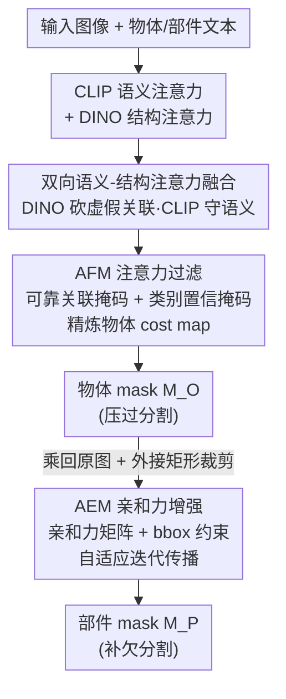

# HOPS: Hierarchical Open-vocabulary Part Segmentation with Attention-Aware Filtering and Affinity-Guided Enhancement

**会议**: CVPR 2026  
**论文**: [CVF Open Access](https://openaccess.thecvf.com/content/CVPR2026/html/Li_HOPS_Hierarchical_Open-vocabulary_Part_Segmentation_with_Attention-Aware_Filtering_and_Affinity-Guided_CVPR_2026_paper.html)  
**代码**: https://github.com/TJU-IDVLab/HOPS  
**领域**: 开放词汇分割 / 部件分割  
**关键词**: 开放词汇部件分割, CLIP-DINO 融合, 注意力过滤, 亲和力传播, 过分割/欠分割

## 一句话总结
HOPS 用一套「CLIP 语义 ⊗ DINO 结构」的双向注意力融合，分两阶段把开放词汇部件分割（OVPS）做对：第一阶段用 AFM 过滤掉物体级的过分割，第二阶段用 AEM 把弱激活的小部件迭代「长」满，在 Pascal-Part-116 / ADE20K-Part-234 / PartImageNet 上全面刷新 SOTA。

## 研究背景与动机

**领域现状**：开放词汇部件分割（OVPS）要求模型不仅能切分训练见过的部件，还能泛化到未见过的部件类别（既包括已知物体的新部件如「狗肚子」，也包括全新物体的部件如「熊猫头」）。主流做法是把开放词汇语义分割（OVSS）模型迁移过来——靠 CLIP 等视觉-语言模型（VLM）的跨模态语义对齐来定位部件，代表工作 PartCLIPSeg（基于 CLIPSeg）、PartCATSeg（基于 CAT-Seg）。

**现有痛点**：作者把现有 OVPS 方法的失败系统地拆成两个互不冲突、且常常共存的毛病：

- **物体过分割（object over-segmentation）**：CLIP 的训练目标是全局图文对齐，而非像素级对应，所以它的跨模态相似度图空间精度差、激活会「漫」到目标物体之外。比如分割「牛」时，因为牛和草地在训练数据里频繁共现，CLIP 会在草地上给出高响应，把无关区域也圈进 mask。
- **部件欠分割（part under-segmentation）**：CLIP 对细粒度部件的感知很弱。论文用一组相似度图（Fig. 2）展示：CLIP 对「猫」整体能很好激活，但对「头」这种小部件几乎不响应；即便给出「cat head」这种物体-部件联合 prompt，CLIP 仍然只盯着整只猫。只有当激活被**限制在物体区域内**时，CLIP 才能正确点亮部件。

**核心矛盾**：CLIP 在「语义对齐」上强、在「空间结构」上弱；而单纯靠监督训练去补结构（论文 Tab. 1 的对照实验）虽然能在 seen 类上降低过分割，却会**削弱 CLIP 本身的零样本泛化能力**，反而让 unseen 类的过分割更严重。也就是说，过分割不能靠堆监督硬解。

**切入角度**：作者注意到 DINO 这个自监督模型恰好补上了 CLIP 的短板——它没有文本监督，注意力天然聚焦在形状、边界、物体拓扑这类结构线索上。于是核心假设是：**把 CLIP 的语义注意力和 DINO 的结构注意力做双向约束融合**，让 DINO 替 CLIP 砍掉「语义相关但结构无关」的虚假关联，让 CLIP 替 DINO 守住语义相关性。

**核心 idea**：用同一套「双向语义-结构注意力融合」分别落到两个阶段——物体阶段用它做注意力过滤（AFM）压过分割，部件阶段用它构建亲和力矩阵做响应传播（AEM）补欠分割，串成层级化的 HOPS 框架。

## 方法详解

### 整体框架

HOPS 是一个**两阶段层级框架**，建立在 CAT-Seg 的 cost aggregation 之上，两阶段共享同一套 CLIP、DINO 和 decoder，只是用不同的聚合模块。

第一阶段做**物体分割**，为后续部件分割提供空间约束。CLIP 和 DINO 各自抽视觉特征，CLIP 图像特征与「物体类别」文本特征算余弦相似度得到初始物体级 cost map $S_1 \in \mathbb{R}^{N \times C_1}$（$N$ 为 patch 数，$C_1$ 为物体类别数）。把 CLIP 和 DINO 的逐层自注意力矩阵 $A_{\text{CLIP}}, A_{\text{DINO}} \in \mathbb{R}^{L \times N \times N}$ 送进 **AFM**，过滤掉漫出去的激活，得到精炼后的 $S_1^{\text{ref}}$；再经卷积成 cost embedding、DINO 特征做结构引导、空间+类别聚合、上采样多尺度融合，由预测头输出物体 mask $M_O$。

第二阶段在每个物体类别的预测区域内做**部件分割**。先把 $M_O$ 乘回输入图，只保留目标物体，再按物体最小外接矩形做自适应裁剪——这一步去掉背景噪声、放大物体面积，专门增强细粒度感知。然后算部件级 cost map $S_2$，送进 **AEM**：它用同样的双向融合得到亲和力矩阵，在 bounding-box 范围内迭代把强响应往弱激活区域传播，最终输出部件 mask $M_P$。训练用 BCE 损失，总损失为物体和部件两路的加权和。

### 关键设计

**1. 双向语义-结构注意力融合：让 CLIP 和 DINO 互相纠错**

这是 AFM 和 AEM 共用的底座，直接对着「CLIP 空间精度差、漫出物体」这个痛点。单看 CLIP 自注意力，它会捕捉「语义相关但结构无关」的 patch 对（牛↔草地）；单看 DINO 又只懂结构、丢了语义。融合分两个方向做：用 DINO 约束 CLIP，把 DINO 归一化后的注意力逐元素乘到 CLIP 上，滤掉结构上对不上的关联——

$$A_{\text{CLIP}\leftarrow\text{DINO}}^{(l)} = A_{\text{CLIP}}^{(l)} \odot \text{Softmax}\!\left(A_{\text{DINO}}^{(l)}\right);$$

再用 CLIP 约束 DINO，以 $A_{\text{CLIP}}^{(l)}$ 的均值为阈值，只保留 DINO 中「既结构一致又语义相关」的 patch 对：

$$A_{\text{DINO}\leftarrow\text{CLIP}}^{(l)} = A_{\text{DINO}}^{(l)} \odot \mathbb{I}\!\left(A_{\text{CLIP}}^{(l)} > \operatorname{Mean}(A_{\text{CLIP}}^{(l)})\right).$$

两个方向按系数 $\alpha$ 加权得到语义-结构注意力 $A = \alpha\, A_{\text{CLIP}\leftarrow\text{DINO}} + (1-\alpha)\, A_{\text{DINO}\leftarrow\text{CLIP}}$。它有效的关键在于「双向」：任何一个方向单独用都会偏科，互相做掩码才能同时守住语义相关性和结构一致性。

**2. AFM 注意力过滤：用可靠关联 + 类别置信压物体过分割**

光有融合注意力还不够——单层注意力本身噪声大、不稳定。AFM（受 TagCLIP 启发）再叠两道筛子来精炼物体 cost map。第一道是**跨层一致性的可靠关联掩码** $M_A$：对每层，patch 对 $(i,j)$ 的注意力超过该层均值 $\mu^{(l)}$ 才算「显著关联」，只有在至少 $y$ 层都显著关联的 patch 对才记为可靠（$M_A(i,j)=1$），借跨层投票滤掉偶发的虚假高注意力。第二道是**类别置信掩码** $M_{\text{conf}}(c)$：某 patch 对类别 $c$ 的得分超过所有 patch 的均值才标 1，用来压制弱语义区域的干扰。最终在语义-结构注意力、可靠关联掩码、类别置信掩码三者共同约束下精炼初始 cost map：

$$S_1^{\text{ref}}(c) = \frac{1}{|L|}\sum_{l\in L}\left(M_A \odot A^{(l)} \odot M_{\text{conf}}(c)\right)\cdot S_1(c).$$

这一步既在目标物体区内增强激活、又在无关区压低假响应，所以能把 mOSI（过分割指标）实打实降下来。值得一提的是 AFM **不引入任何额外可训练参数**。

**3. AEM 亲和力增强：用迭代传播 + 自适应停步补部件欠分割**

部件欠分割的根源是「初始部件响应只点亮目标的局部、强度又弱」。AEM 的思路是把强响应顺着亲和力「长」满整个部件。它先用和 AFM 同样的双向融合得到语义-结构注意力 $A'$，逐层平均成亲和力矩阵 $A_{\text{aff}} \in \mathbb{R}^{N\times N}$，作为响应传播的导向。给定初始部件 cost map $S_2$，按阈值 $\gamma$ 得初始部件 mask $\tilde{M}_P(c)=\mathbb{I}[S_2(c) > \gamma]$。

直接用 $\tilde{M}_P(c)$ 当传播区会漏掉弱激活区，所以 AEM 给每个最大连通分量取**最小外接矩形**生成 bounding-box 掩码 $B(c)$，把传播范围扩到「更可能是部件」的区域、同时挡住往无关区的外溢。框内迭代传播定义为：

$$S_2^{\text{enh},t}(c) = B^{t-1}(c) \odot A_{\text{aff}} \cdot S_2^{\text{enh},t-1}(c).$$

最妙的是**自适应迭代停步**：每轮算一个「迭代增益」（第 $t$ 轮部件 mask 内平均响应减去第 $t-1$ 轮），$\text{Gain}(t)>0$ 说明这轮还在有效增强、就继续；$\text{Gain}(t)\le 0$ 说明传播饱和或开始引入噪声、该停了。但对小部件直接停会「早停」——它们初始 mask 小、早期轮次就可能 $\text{Gain}\le 0$ 却还没长够。于是加一个**小部件补偿**：当 $\text{Gain}(t)\le 0$ 时算当前部件 mask 与物体 mask 的相对面积比 $\text{Ratio}(t,c)$，若 $\le\sigma$（确实是小部件）就额外多迭代一次（每个部件只补一次），否则终止、取上一轮结果为最终增强。AEM 同样**零额外训练参数**。

### 损失函数 / 训练策略
两阶段都用 BCE 分割损失：物体路 $\mathcal{L}_O=\sum_{c}\text{BCE}(M_O(c),G_O(c))$，部件路 $\mathcal{L}_P=\sum_{c}\text{BCE}(M_P(c),G_P(c))$，总损失 $\mathcal{L}=\lambda_{\text{obj}}\mathcal{L}_O + \lambda_{\text{part}}\mathcal{L}_P$。HOPS 建在 CAT-Seg 上，沿用其训练策略，对 CLIP 和 DINO 都做微调（注意力融合本身不增参数）。

## 实验关键数据

为量化两类毛病，作者自定义了两个指标：**OSI（Over-Segmentation Index）** = 预测 mask 超出真值的部分占预测面积的比例（越高过分割越严重）；**USI（Under-Segmentation Index）** = 真值中未被预测覆盖的部分占真值面积的比例（越高欠分割越严重）。mOSI/mUSI 为其均值，h-IoU 为 seen/unseen mIoU 的调和均值。

### 主实验

Pascal-Part-116 零样本部件分割（节选对比，越高越好除 mOSI/mUSI 外）：

| 方法 | Seen | Unseen | h-IoU | mOSI ↓ | mUSI ↓ |
|------|------|--------|-------|--------|--------|
| CAT-Seg（baseline） | 36.80 | 23.39 | 28.60 | 31.38 | 60.58 |
| PartCLIPSeg | 43.91 | 23.56 | 30.67 | 31.51 | 53.75 |
| PBAPS | 45.32 | 42.72 | 43.98 | 33.10 | 42.18 |
| PartCATSeg（前 SOTA） | 52.62 | 40.51 | 45.77 | 29.57 | 37.79 |
| **HOPS（本文）** | **54.77** | **44.81** | **49.29** | **23.46** | **31.62** |

相比前 SOTA PartCATSeg，HOPS 在 seen/unseen 上 mIoU 分别 +2.15% / +4.30%，h-IoU 达 49.29%，同时 mOSI、mUSI 各降 6.11% / 6.17%——说明过分割和欠分割是被**同时**压住的。在更难的 ADE20K-Part-234 上 h-IoU +3.23%（mOSI/mUSI 各降 2.93%/5.64%），在主打「跨物体同部件」泛化的 PartImageNet 上 h-IoU 达 59.08。跨数据集上 PartImageNet (OOD) 的 unseen mIoU 达 45.08%，远超 CAT-Seg 的 19.83% 和 PartCATSeg 的 40.17%。

### 消融实验

AFM 各组件（PartImageNet，Tab. 7，首行为不带 AFM）：

| 语义-结构注意力 | 可靠关联掩码 | 类别置信掩码 | h-IoU | mOSI ↓ | mUSI ↓ |
|:---:|:---:|:---:|------|--------|--------|
| | | | 56.37 | 24.92 | 32.76 |
| ✓ | | | 57.02 | 22.85 | 32.18 |
| ✓ | ✓ | | 57.86 | 21.74 | 31.52 |
| ✓ | | ✓ | 58.03 | 20.91 | 31.33 |
| ✓ | ✓ | ✓ | **59.08** | **19.08** | **30.90** |

AEM 各组件（PartImageNet，Tab. 8，第二行为只在初始部件 mask 内传播）：

| 语义-结构注意力 | BBox 约束 | 自适应迭代 | h-IoU | mUSI ↓ |
|:---:|:---:|:---:|------|--------|
| | | | 56.61 | 34.24 |
| ✓ | | | 57.15 | 33.18 |
| ✓ | ✓ | | 57.78 | 31.76 |
| ✓ | | ✓ | 57.57 | 32.41 |
| ✓ | ✓ | ✓ | **59.08** | **30.90** |

### 关键发现
- **过分割不能靠堆监督**：问题分析的 Tab. 1 显示，纯监督训练（CLIP-train）在 seen 类降 mOSI 19.55%，但在 unseen 类反而 mIoU 更低、mOSI 更高——监督会牺牲 CLIP 的零样本泛化。AFM 在带不带监督两种设置下都能降过分割，证明它走的是正确的「注意力过滤」路线而非堆数据。
- **AFM 里两道掩码分工明确**：类别置信掩码（row 4）对降 mOSI 贡献更大（专门滤无关区域），可靠关联掩码（row 3）更强化物体内 pixel 关联、主要降 mUSI；三件套全开才最优，互补性明显。
- **AEM 里 bounding-box 是关键约束**：对比「只用初始 mask 传播」（仅 +0.54 h-IoU），加 bbox 后涨幅明显更大；单开自适应迭代不加 bbox（row 4，mUSI 32.41）也不如加 bbox（row 3，mUSI 31.76），说明直接拿初始部件 mask 当传播区会漏掉目标区域。
- **零额外参数**：AFM、AEM 都不引入可训练参数，提升完全来自注意力的过滤与传播机制本身。

## 亮点与洞察
- **一套机制解两个对偶问题**：过分割（多圈了）和欠分割（少圈了）看似相反，作者用同一个「双向语义-结构注意力融合」底座，分别做成「过滤」（AFM 减）和「传播」（AEM 加）两种用法，结构上很优雅，也解释了为什么两个指标能被同时压低。
- **DINO⊗CLIP 的双向互相掩码**很值得迁移：不是简单 concat 或加权，而是「DINO 用乘法砍 CLIP 的虚假关联、CLIP 用阈值守住 DINO 的语义」，这种「让两个 frozen 模型互相当对方的正则」的思路，可以搬到任何「一个强语义 + 一个强结构」的双模型组合里。
- **自适应迭代 + 小部件补偿**是个接地气的工程巧思：用「迭代增益是否转负」当停步信号避免过度传播糊掉，再用面积比专门给小部件「续一命」防早停——直击「小部件初始响应弱、容易被提前判死」的真实失败模式。
- **OSI / USI 两个诊断指标**把抽象的「分割不准」量化成「多圈 vs 少圈」，让消融能看清每个模块到底在治哪个病，这种把失败模式指标化的做法对方法论很有借鉴价值。

## 局限与展望
- **强依赖物体阶段的正确性**：部件分割完全在物体 mask 内进行，第一阶段若把物体框错或漏掉，第二阶段无从补救——是典型的级联误差，论文未深入分析物体 mask 错误时的部件表现。
- **多超参需要调**：阈值 $\gamma$、面积比阈值 $\sigma$、融合系数 $\alpha$、跨层投票数 $y$ 等都是关键超参，正文未给敏感性分析（称在补充材料），实际部署到新数据可能需要重调。
- **迭代传播的开销**：AEM 对每个部件类别做自适应迭代，部件多、图大时推理成本会上升，论文未报告推理速度/显存对比。
- **仍基于 frozen CLIP 的天花板**：方法是在 CLIP 弱空间感知的前提下「打补丁」，若换更强的像素级 VLM，AFM/AEM 的增益是否还这么大值得验证。

## 相关工作与启发
- **vs PartCATSeg**：两者都引入 DINO 做结构引导，但 PartCATSeg 是把 DINO 特征 concat 进 cost embedding 当 query/key（单向、特征级）；HOPS 是在**注意力级做双向互相掩码融合**，且分别用于过滤（AFM）和传播（AEM）两个阶段，因此能同时压过分割和补欠分割，h-IoU 在三个数据集上均超过它。
- **vs PartCLIPSeg**：PartCLIPSeg 靠解析物体-部件名构造通用部件嵌入 + 注意力控制来强化小部件激活；HOPS 不改 prompt 工程，而是从「CLIP 空间精度差」的根因下手，用结构注意力直接精炼 cost map，泛化（unseen）优势更明显。
- **vs PBAPS / 层级范式**：PBAPS 等同样「先物体后部件」，但仍受困于初始部件响应弱、覆盖不全；HOPS 的 AEM 用亲和力矩阵把弱响应迭代「长」满，正是补上了层级范式留下的这个缺口。
- **vs CAT-Seg（baseline）**：HOPS 继承其 cost aggregation 但额外叠了 AFM/AEM 两个零参数模块，h-IoU 在 Pascal-Part-116 上从 28.60 提到 49.29，说明增益主要来自这两个机制而非更大的网络。

## 评分
- 新颖性: ⭐⭐⭐⭐ 「双向 CLIP⊗DINO 互相掩码 + 同一底座做过滤/传播两用」组合新颖，但底层仍是注意力融合 + 迭代传播的拼装。
- 实验充分度: ⭐⭐⭐⭐ 三个标准数据集 + 两个跨数据集设置 + AFM/AEM 逐组件消融，且自定义 OSI/USI 验证机制，较扎实；缺超参敏感性与推理开销。
- 写作质量: ⭐⭐⭐⭐ 问题分析（过/欠分割）→ 机制 → 实验逻辑清晰，图示到位；部分公式排版较密。
- 价值: ⭐⭐⭐⭐ 在 OVPS 三 benchmark 全面刷新 SOTA 且零额外参数，DINO⊗CLIP 双向融合思路对相关任务有迁移价值。

<!-- RELATED:START -->

## 相关论文

- [\[NeurIPS 2025\] LangHOPS: Language Grounded Hierarchical Open-Vocabulary Part Segmentation](../../NeurIPS2025/segmentation/langhops_language_grounded_hierarchical_open-vocabulary_part_segmentation.md)
- [\[CVPR 2026\] Frequency-Aware Affinity for Weakly Supervised Semantic Segmentation](frequency-aware_affinity_for_weakly_supervised_semantic_segmentation.md)
- [\[CVPR 2026\] GeoGuide: Hierarchical Geometric Guidance for Open-Vocabulary 3D Semantic Segmentation](geoguide_hierarchical_geometric_guidance_for_open-vocabulary_3d_semantic_segment.md)
- [\[CVPR 2026\] PCA-Seg: Revisiting Cost Aggregation for Open-Vocabulary Semantic and Part Segmentation](pca-seg_revisiting_cost_aggregation_for_openvocabulary_semantic_and_part_segmentat.md)
- [\[CVPR 2026\] ReAttnCLIP: Training-Free Open-Vocabulary Remote Sensing Image Segmentation via Re-defined Attention in CLIP](reattnclip_training-free_open-vocabulary_remote_sensing_image_segmentation_via_r.md)

<!-- RELATED:END -->
