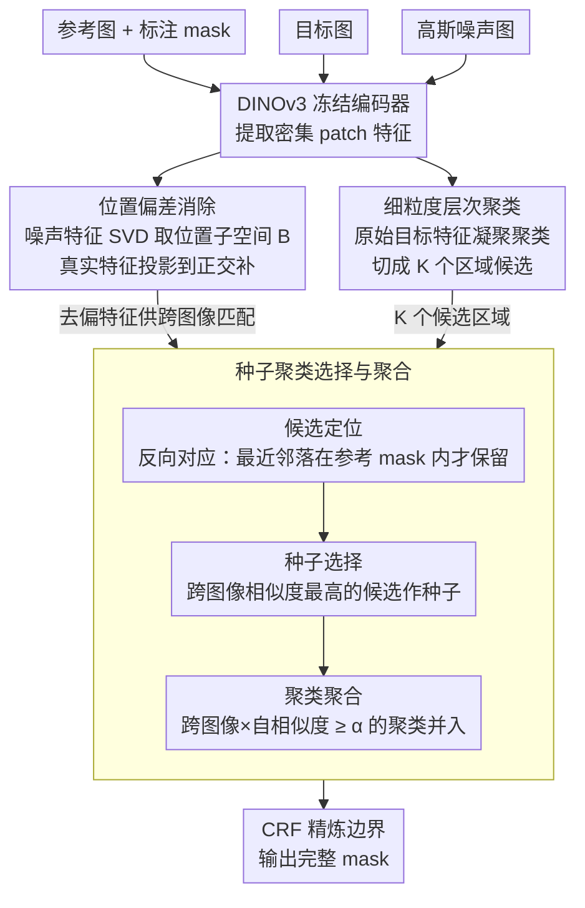

# INSID3: Training-Free In-Context Segmentation with DINOv3

**会议**: CVPR 2026  
**arXiv**: [2603.28480](https://arxiv.org/abs/2603.28480)  
**代码**: [GitHub](https://visinf.github.io/INSID3)  
**领域**: 分割  
**关键词**: 上下文分割, DINOv3, 无训练, 自监督, 位置偏差校正

## 一句话总结

提出INSID3，一种仅依赖冻结DINOv3特征的无训练上下文分割方法，通过位置偏差消除、细粒度聚类和种子聚类聚合三阶段pipeline，在语义/部件/个性化分割任务上以单一自监督骨干网络超越了依赖SAM或微调的方法，平均mIoU提升+7.5%。

## 研究背景与动机

上下文分割（In-Context Segmentation, ICS）旨在给定一个标注示例后分割目标图像中的任意概念（物体、部件、个性化实例）。现有方法分为两类路线：

1. **微调路线**（如SegIC、DiffewS）：在VFM上训练分割解码器或微调扩散模型，域内效果好但泛化差
2. **无训练路线**（如Matcher、GF-SAM）：组合DINOv2+SAM，泛化能力强但架构复杂、计算开销大

核心矛盾在于：现有方法都依赖某种形式的分割先验（SAM预训练或下游微调），无法真正实现"纯自监督"分割。

DINOv3作为最新的纯自监督VFM，通过大规模数据+模型缩放和Gram anchoring目标函数，产生了具有强空间结构的密集局部特征。本文核心idea：**DINOv3的密集自监督特征本身就蕴含语义匹配和分割能力**，无需任何解码器、微调或模型组合。

## 方法详解

### 整体框架

INSID3要回答的问题很直接：给一张带标注的参考图和一张目标图，能不能只靠冻结的 DINOv3 特征、不训任何解码器就把目标图里同一个概念抠出来。整条 pipeline 全程不更新一个参数，分三步走：先把 DINOv3 特征里那层"位置噪声"洗掉，让跨图像匹配变干净；再把目标图自身切成一堆语义连贯的小区域候选；最后借参考图的标注找到候选里哪些属于目标概念、并把它们拼成完整 mask。三步之间靠两套特征分工——洗过的去偏特征专管跨图像比对，原始特征专管图像内部聚类。

### 关键设计

**1. 位置偏差消除：把"同位置=同物体"的虚假信号洗掉**

作者先发现了一个反直觉的现象：两张毫不相干的图，DINOv3 在相同空间位置上的特征居然会强匹配——也就是说特征里掺了一份只跟"patch 在图里的坐标"有关、跟内容无关的信号，跨图像匹配时它会制造大量假对应。怎么把这份信号单独估出来？办法很巧：往编码器喂一张纯高斯噪声图 $\mathbf{I}^{noise} \sim \mathcal{N}(0,1)$，它没有任何语义内容，提出来的特征几乎只剩位置信号。对这些噪声特征做 SVD，取前 $s$ 个右奇异向量当作"位置子空间"的基 $\mathbf{B}$，再把真实特征投影到这个子空间的正交补里就把位置成分减掉了：

$$\tilde{\mathbf{F}} = \mathbf{F}(\mathbf{1}_D - \mathbf{B}\mathbf{B}^\top)$$

关键是这层去偏只用在跨图像匹配那一路，图像内部聚类反而保留原始特征——因为在同一张图里，位置信息是有用的先验。$s=500$ 时效果稳定，而且这个修正不止对分割有用，在 SPair-71k 语义对应任务上也能带来 +0.9~6.6 PCK 的提升，说明它修的是 DINOv3 特征本身的通病。

**2. 细粒度层次聚类：把目标图切成语义连贯的区域候选**

光有干净特征还不够，得先把目标图分解成一块块"可能是某个概念"的候选区域，后面才好挑。这里作者用凝聚（层次）聚类对原始目标特征 $\mathbf{F}^t$ 自底向上逐步合并相邻相似的 patch，得到 $K$ 个互不重叠的空间区域 $\{\mathcal{G}_1, ..., \mathcal{G}_K\}$。之所以不用 K-means，是因为它要预先指定聚类数，开放世界里根本不知道目标图里有几个概念；DBSCAN 又在高维特征空间不稳。凝聚聚类只需一个相似度阈值 $\tau$ 就能自然顺着 DINOv3 本就平滑的空间结构切分，$\tau=0.6$ 在"切到部件级"和"切到物体级"之间取了个折中。

**3. 种子聚类选择与聚合：先锁定再生长出完整 mask**

切出来的候选里大部分是背景或干扰物，得借参考图的标注把属于目标概念的那些挑出来——而且单挑一个候选往往只覆盖物体最显著的一小块（比如只框到狗头），还要把剩下的身体补回来。这一步分三段衔接。先做**候选定位**：用反向对应，对每个目标 patch 去参考图找最相似的 patch，只有当它的最近邻恰好落在参考 mask 内部，才把这个目标 patch 算作候选，由此筛出候选聚类集 $\mathcal{C}_{cand}$。再做**种子选择**：在去偏特征空间里算每个候选聚类原型和参考区域原型的跨图像相似度 $s_k^{cross}$，分最高的那个聚类就是种子 $\mathcal{G}^*$。最后做**聚类聚合**：把跨图像相似度和图像内自相似度 $s_k^{intra}$ 相乘成综合分数 $S_k = s_k^{cross} \cdot s_k^{intra}$，凡是 $S_k \geq \alpha$ 的聚类全部并进来，让种子从"最显著的一块"长成完整区域。

这里两个设计很关键。反向对应等于把参考图里的非标注区域当成隐式负样本——某个目标 patch 虽然长得像目标，但如果它的最近邻落在参考背景而非 mask 内，就会被剔掉，这在个性化分割里特别管用，能把"长得像但不是那只"的干扰实例区分开。乘法组合则保证被并进来的聚类既要语义上对得上参考概念（$s_k^{cross}$ 高），又要结构上和种子连成一体（$s_k^{intra}$ 高），任一项低都进不来。

### 一个完整示例

以个性化分割为例（PerMIS 任务，从一群相似实例里抠出指定那只）：参考图标注了"我家这只狗"，目标图里站着三只外形接近的狗。pipeline 先用去偏特征把目标图凝聚聚类成约十几个候选区域（三只狗的头/身/腿、草地、栅栏…）。候选定位时，三只狗的 patch 都和参考图狗身长得像，但反向对应一查——只有真正对应的那只，patch 的最近邻落进了参考 mask，另两只狗的最近邻多落在参考图背景上而被剔除，于是 $\mathcal{C}_{cand}$ 收敛到目标狗的几块。种子选择挑出 $s_k^{cross}$ 最高的一块（往往是最具辨识度的狗头）作为 $\mathcal{G}^*$。最后聚合把狗身、狗腿这些既像参考概念、又和狗头自相似度高的聚类并进来，CRF 精炼边界后输出完整的狗 mask——全程没有训练，没有 SAM。

### 损失函数 / 训练策略

INSID3 完全无训练，不涉及任何损失函数或训练过程。推理时用 CRF 做 mask 后处理精炼，输入图像统一 resize 到 1024×1024。

## 实验关键数据

### 主实验

| 数据集 | 指标 | INSID3 | 之前SOTA (GF-SAM) | 提升 |
|--------|------|--------|-------------------|------|
| LVIS-92i（语义） | mIoU | 41.8% | 35.2% | +6.6 |
| COCO-20i（语义） | mIoU | 57.6% | 58.7% | -1.1 |
| ISIC（皮肤病变） | mIoU | 54.4% | 48.7% | +5.7 |
| Chest X-Ray | mIoU | 78.8% | 51.0% | +27.8 |
| iSAID（遥感） | mIoU | 52.1% | 47.1% | +5.0 |
| PASCAL-Part（部件） | mIoU | 50.5% | 44.5% | +6.0 |
| PACO-Part（部件） | mIoU | 38.7% | 36.3% | +2.4 |
| PerMIS（个性化） | mIoU | 67.0% | 54.1% | +12.9 |
| **9数据集平均** | mIoU | **55.1%** | 47.6% | **+7.5** |

参数量对比：INSID3仅304M vs GF-SAM 945M（3×更少）

### 消融实验

| 配置 | COCO mIoU | PASCAL-Part mIoU | 说明 |
|------|-----------|------------------|------|
| 阈值化相似度图 | 44.2% | 35.4% | 无聚类基线 |
| 粗聚类(τ=0.5)无聚合 | 50.6% | 31.1% | 适合物体级 |
| 细聚类(τ=0.6)无聚合 | 42.8% | 36.2% | 适合部件级 |
| 聚类+跨图像聚合 | 54.6% | 48.5% | 仅cross相似度 |
| 聚类+跨图像+自相似度聚合 | **57.6%** | **50.5%** | 完整方法 |

### 关键发现

- DINOv3存在系统性的位置偏差：相同空间位置的特征在不相关图像间产生虚假匹配，该偏差可能源自Gram anchoring训练目标
- 位置去偏在语义对应任务SPair-71k上通用有效，DINOv3-Large上+1.4~2.2 PCK
- 微调方法SegIC在域内COCO达76.1% mIoU，但跨域大幅下降（如iSAID仅46.1%），而INSID3在所有domain上保持稳定

## 亮点与洞察

- 极简主义设计哲学：单一冻结自监督backbone就能完成上下文分割，无需解码器、微调或模型组合
- 揭示了DINOv3位置偏差问题并给出了简单有效的解决方案（噪声图像SVD），该修正策略可泛化到语义对应等其它任务
- 反向对应机制巧妙利用参考图像中的未标注区域作为负样本，有效解决个性化分割中的干扰实例问题

## 局限与展望

- COCO-20i上仍略低于GF-SAM（57.6% vs 58.7%），在域内数据上自监督特征可能不如SAM的mask先验
- 依赖DINOv3-Large（需1024×1024输入），计算成本仍然较高
- 聚类阈值τ和聚合阈值α需要跨任务固定，可能不是所有场景的最优选择
- 未探索多示例（few-shot）场景的扩展

## 相关工作与启发

- **vs GF-SAM**: GF-SAM将DINOv2匹配点作为prompt输入SAM，丢弃了大部分密集特征信息；INSID3在统一空间内完成匹配和分割
- **vs SegIC**: SegIC通过训练分割解码器获得强域内性能，但泛化受限于训练分布
- **vs DINOv2**: DINOv2的位置偏差比DINOv3弱得多，可能因为DINOv3的Gram anchoring目标无意中放大了空间相关性

## 评分

- 新颖性: ⭐⭐⭐⭐ 首次证明纯自监督VFM可直接用于无训练上下文分割，位置偏差发现和修正很有价值
- 实验充分度: ⭐⭐⭐⭐⭐ 9个数据集覆盖语义/部件/个性化分割，消融全面，还泛化验证了语义对应任务
- 写作质量: ⭐⭐⭐⭐ 动机清晰，方法简洁，图表直观，论证链完整
- 价值: ⭐⭐⭐⭐ 对VFM特征理解和上下文分割领域都有重要启发，极简设计理念值得推广

<!-- RELATED:START -->

## 相关论文

- [\[CVPR 2026\] B³-Seg: Camera-Free, Training-Free 3DGS Segmentation via Analytic EIG and Beta-Bernoulli Bayesian Updates](b3-seg_camera-free_training-free_3dgs_segmentation_via_analytic_eig_and_beta-ber.md)
- [\[CVPR 2026\] Looking Beyond the Window: Global-Local Aligned CLIP for Training-free Open-Vocabulary Semantic Segmentation](looking_beyond_the_window_global-local_aligned_clip_for_training-free_open-vocab.md)
- [\[CVPR 2026\] The Power of Prior: Training-Free Open-Vocabulary Semantic Segmentation with LLaVA](the_power_of_prior_training-free_open-vocabulary_semantic_segmentation_with_llav.md)
- [\[CVPR 2026\] PEARL: Geometry Aligns Semantics for Training-Free Open-Vocabulary Semantic Segmentation](pearl_geometry_aligns_semantics_for_training-free_open-vocabulary_semantic_segme.md)
- [\[CVPR 2026\] Direct Segmentation without Logits Optimization for Training-Free Open-Vocabulary Semantic Segmentation](direct_segmentation_without_logits_optimization_for_training-free_open-vocabular.md)

<!-- RELATED:END -->
