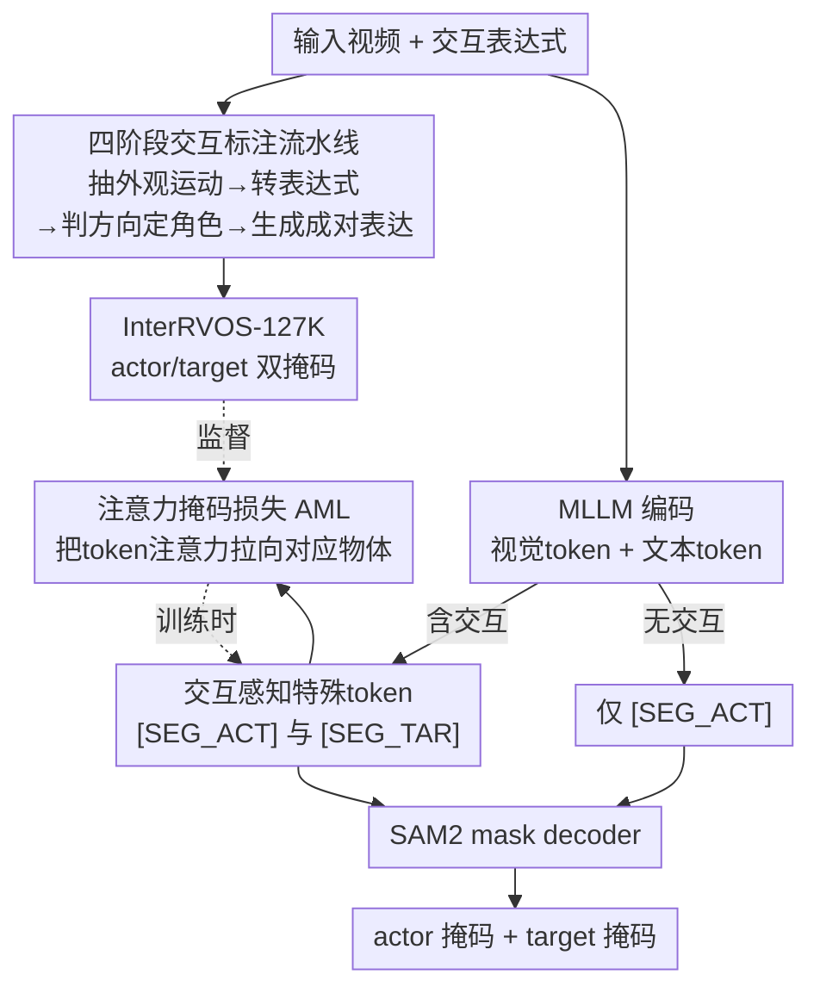

# InterRVOS: Interaction-Aware Referring Video Object Segmentation

**会议**: CVPR 2026  
**论文**: [CVF Open Access](https://openaccess.thecvf.com/content/CVPR2026/html/Jin_InterRVOS_Interaction-Aware_Referring_Video_Object_Segmentation_CVPR_2026_paper.html)  
**领域**: 视频理解 / 指代分割  
**关键词**: 指代视频对象分割, 交互建模, actor-target, 多模态大模型, 注意力监督

## 一句话总结
本文把"指代视频对象分割"（RVOS）从只分割被指代主体（actor）扩展成同时分出 actor 和 target 两个交互角色的新任务 InterRVOS，配套构建了 12.7 万条带 actor-target 双掩码标注的数据集 InterRVOS-127K，并提出 MLLM 架构 ReVIOSa，用两个角色专属 `[SEG_ACT]`/`[SEG_TAR]` token 加注意力掩码损失（AML）显式建模交互方向，在新基准上全面超过现有方法。

## 研究背景与动机

**领域现状**：RVOS 给定一句自然语言表达式，要在视频里把对应物体分割出来。从早期的外观对齐，到 MeViS 引入纯运动线索、ReVOS 引入推理式分割，这条线一直在往"更细粒度的时序运动 + 更复杂的视频-语言对齐"走。

**现有痛点**：但几乎所有方法都只盯着"被指代的那个主体"。当表达式明确描述了一个**交互**——比如"A 把手伸向 B"——里面其实有两个角色：施动者 A（actor）和受动者 B（target）。现有方法只分出 A，把 B 直接忽略掉。可很多视频事件的语义恰恰由"谁对谁做了什么"定义，而不是单个物体自身的运动。

**核心矛盾**：交互天然带**角色方向性（role directionality）**——"A 推 B"和"B 推 A"分割结果应该不同，A、B 的语义角色是**非对称**的。而标准 RVOS 的输出只有一个掩码（或把所有相关物体并成一个 union），结构上就没法表达这种非对称的双角色关系；现有数据集也只标了 actor，根本没有 target 的掩码监督。

**本文目标**：把任务重定义为"从一句交互表达式里**分别**分出 actor 和 target 两个掩码"，并显式建模二者的角色方向；同时解决"没有数据"和"模型没有角色表示"两个落地障碍。

**切入角度**：作者观察到，要让模型区分角色，得在两个层面动手——数据层面要有 actor/target 分开的掩码标注；模型层面要给每个角色一个专属的、可被监督的表示锚点。

**核心 idea**：在 MLLM 里用两个角色专属特殊 token（`[SEG_ACT]`、`[SEG_TAR]`）代替单一的 `[SEG]` token 来分别提示 actor 和 target，再用注意力掩码损失把每个 token 的视觉注意力直接拉到它对应的物体区域上。

## 方法详解

本文有两块缺一不可的工作：一是**怎么造出带 actor-target 标注的数据**（InterRVOS-127K，四阶段自动标注流水线），二是**模型怎么吃下并区分两个角色**（ReVIOSa = 角色专属 token + 注意力掩码损失）。下面先给鸟瞰，再拆关键设计。

### 整体框架

数据侧：基于 VidOR 视频，先用 SAM2 给所有物体预算 mask track，然后用 GPT-4o + LLaMA-70B 跑四阶段流水线——抽单物体外观/运动 → 转成指代表达式（相似运动可合并）→ 检测交互并判定方向、指派 actor/target → 生成富含交互语义的表达式（互换角色生成成对正/反向表达），最终得到 12.7 万条表达式、每条带 actor 和 target 两套掩码。

模型侧（ReVIOSa）：视频帧经视觉编码器 + 文本一起喂进 LLaVA 式 MLLM；MLLM 根据表达式是否含交互，动态输出一个或两个特殊 token；`[SEG_ACT]`/`[SEG_TAR]` 的末层隐状态投影成 SAM2 mask decoder 的 prompt，分别解出 actor、target 掩码；训练时额外用 AML 把这两个 token 在特定层-头上的视觉注意力监督到对应物体区域。

### 关键设计

**1. InterRVOS 任务与 InterRVOS-127K 数据集：让"交互双角色"第一次有了监督信号**

痛点很直接：要训模型区分 actor/target，就得有分开标注的掩码，可现有 RVOS 数据集（A2D、Ref-DAVIS、MeViS、ReVOS、Ref-SAV）全是 actor-only，没有 target。作者基于带关系标注的 VidOR 视频，设计了一条四阶段全自动流水线：**阶段 1** 用 SAM2 预先算好每个物体的 mask track，独立抽取每个物体的外观与运动描述；**阶段 2** 把这些转成指代表达式，运动模式相似的多个物体可选择性合并成多指代表达；**阶段 3** 检测物体间是否存在交互、判定方向性，若是单向交互就指派 actor 与 target（同时生成"Object 0 touching Object 1"和"Object 1 being touched by Object 0"这样的正反向句），双向交互则生成对称表达；**阶段 4** 融合类别级与外观级线索，通过互换 actor/target 角色批量生成成对的富交互表达式。最终得到 8738 视频、35247 物体、127236 条表达式，平均每视频 4.03 物体、含 17604 条交互表达；评测集 738 视频 / 5048 表达由人工逐条校正。它是首个显式标注 actor 与 target 双掩码的 RVOS 数据集（见 Tab.1 的 Actor-Target 列只有它打勾），用大规模 + 自动化解决了"无监督可学"的根本缺口。

**2. 交互感知特殊 token（`[SEG_ACT]` / `[SEG_TAR]`）：给非对称角色各一个显式表示锚点**

标准 MLLM-RVOS（VideoLISA、Sa2VA 等）只有一个 `[SEG]` token，输出天然只能是单角色（actor），结构上无法表达"谁施动、谁受动"的非对称。本文引入两个角色专属 token：MLLM 在回答里输出 `"Sure, it's [SEG_ACT] and [SEG_TAR]"`，取这两个 token 在末层的隐状态 $\tilde{h}_{act}$、$\tilde{h}_{tar}$，各自经同一投影层映射到 SAM2 的 prompt 嵌入空间：

$$p_{act} = \text{MLP}_{seg}(\tilde{h}_{act}), \quad p_{tar} = \text{MLP}_{seg}(\tilde{h}_{tar})$$

再分别送进 mask decoder 得到 $\hat{M}_{act} = F_{dec}(v_{seg}, p_{act})$ 和 $\hat{M}_{tar} = F_{dec}(v_{seg}, p_{tar})$。关键在于**动态决定 token 数**：推理时模型先判断表达式是否含交互，含交互才同时吐两个 token，否则只吐 `[SEG_ACT]` 退化成普通 RVOS。这样两个 token 充当各自角色的"语义锚点"，让模型把 actor、target 当成有区别的参与者来表示，从单角色分割升级成角色感知分割——这是表达非对称关系的结构前提。

**3. 注意力掩码损失 AML：直接监督 token "看哪"，把角色表示钉到正确物体上**

光有两个 token 还不够——得保证每个 token 真的去"看"它对应的物体，而不是注意力散乱。作者先做了动机验证（Fig.6a）：`[SEG_ACT]` token 对真值掩码区域的注意力越强，分割 $\mathcal{J}\&\mathcal{F}$ 越高，二者明显正相关。于是把这件事变成显式监督：MLLM 生成特殊 token 时每层每头都会产生自注意力矩阵，从中抽出"特殊 token（query）到所有视觉 token"的权重，reshape 成时空注意力图 $A^{(l,h)} \in [0,1]^{T'\times P\times P}$；用 resize 到 patch 分辨率的真值二值掩码 $G'$ 做 BCE 监督：

$$L_{AML} = \sum_{r\in\{act,tar\}} \sum_{(l,h)\in\mathcal{H}} \text{BCE}\!\left(A_r^{(l,h)}, G'_r\right)$$

其中表达式只含 actor 时 target 项自动略去。**层-头怎么选**也是设计点：作者按"该层 token 对视觉 token 的注意力强度"挑出一组 $\mathcal{H}$——分析发现不同层视觉注意力差异大，把 AML 加在视觉注意力高的 top-3 层（L22/L23/L21）远好于 bottom-3 层（L09/L08/L07），其中 Layer 22 单独贡献 +2.4 $\mathcal{J}\&\mathcal{F}$。AML 与角色 token 互补：token 给出角色身份，AML 把这个身份"钉"到正确视觉区域，从而学出更有判别力的角色表示。

### 损失函数 / 训练策略

总损失为分割损失 + 注意力掩码损失 + 文本损失：

$$L_{total} = L_{seg} + \lambda_{AML}\cdot L_{AML} + \lambda_{text}\cdot L_{text}$$

其中 $L_{seg} = \sum_{r\in\{act,tar\}} L_{CE}(\hat{M}_r, M_r) + L_{Dice}(\hat{M}_r, M_r)$（含交互时算两套掩码，否则只算 actor），$L_{text}$ 是预测答案的交叉熵。实现上以 InternVL-2.5 为基座、仅做 LoRA 微调，分割端用 SAM2 且只微调 decoder、冻结图像编码器；$\lambda_{AML}=\lambda_{text}=1.0$，训练 10 epoch、batch 128，1B/4B 两个规模分别在 4×RTX3090（12h）/4×A6000（16h）上训练。

## 实验关键数据

### 主实验

在 InterRVOS-127K 的三个评测设定（InterRVOS-Actor、InterRVOS-Target、标准 RVOS）上对比（指标 $\mathcal{J}\&\mathcal{F}$）：

| 方法 | Actor | Target | RVOS |
|------|-------|--------|------|
| Referformer | 59.5 | — | 52.6 |
| VISA-7B | 57.7 | — | 49.8 |
| VideoLISA-3.8B | 68.2 | — | 61.7 |
| Sa2VA-1B | 71.3 | — | 57.0 |
| Sa2VA-4B | 71.0 | — | 59.5 |
| **ReVIOSa-1B** | 73.3 | 67.4 | 62.0 |
| **ReVIOSa-4B** | **74.5** | **68.3** | **64.5** |

关键点：现有方法**无法做 Target 设定**（结构上只能出 actor），这正凸显新任务的必要性；ReVIOSa 不仅在 Actor 上领先，连标准 RVOS 也比同规模 Sa2VA 高（4B：64.5 vs 59.5），说明角色专属监督对常规指代分割也有正迁移。

### 消融实验

在 InterRVOS-127K 评测集（$\mathcal{J}\&\mathcal{F}$）逐组件消融：

| 配置 | 角色token | AML | J&F | 说明 |
|------|-----------|-----|-----|------|
| (i) baseline | ✗ | ✗ | 57.0 | 单 `[SEG]` |
| (ii) | ✗ | ✓ | 58.5 | 仅加 AML（+1.5） |
| (iii) | ✓ | ✗ | 59.6 | 仅加角色 token（+2.6） |
| (iv) Full | ✓ | ✓ | **62.0** | 两者互补，最佳 |

另有零样本实验（Tab.4）：把 VISA-7B/VideoLISA/Sa2VA-4B 用改写 prompt 强行去分 target，$\mathcal{J}\&\mathcal{F}$ 只有 19.2/13.1/24.2，全面崩溃，证明现有模型不具备交互方向理解能力。

### 关键发现
- **角色 token 比 AML 贡献更大**（+2.6 vs +1.5），但二者互补——单独加都涨、合起来从 57.0 冲到 62.0，说明"语义角色分离"与"注意力区域对齐"是两条不冗余的路径。
- **AML 加在哪层很关键**：top-3 高视觉注意力层（L22/23/21）远胜 bottom-3 层，Layer 22 单层 +2.4，印证了"token 越依赖视觉信息的层越值得监督"的假设。
- **数据集本身有强迁移性**：把同一 baseline 模型分别在 ReVOS / Ref-SAV / InterRVOS-127K 上训练，再零样本测 MeViS、Ref-YouTube-VOS、Ref-DAVIS，InterRVOS-127K 训出来的全面最高（如 Ref-YouTube-VOS 61.2 vs ReVOS 57.5），说明这套自动标注数据质量过硬。

## 亮点与洞察
- **把"交互"显式拆成 actor/target 双角色并带方向性**，是对 RVOS 任务定义的一次干净扩展：不是分割更多物体，而是建模"谁对谁"的非对称关系，填了视频-语言细粒度理解里一个被忽视的洞。
- **用注意力图当显式监督对象**很巧妙：先用相关性分析（注意力越准、分割越好）找到可优化的量，再把它变成 BCE 损失，还顺手做了层-头选择——是"先诊断再下药"的范例，这个"监督 special token 注意力到 GT 区域"的思路可迁移到任何用 special token 提示分割/检测的 MLLM。
- **全自动四阶段流水线 + 角色互换生成成对正反向表达**，在没有人工逐帧标注的前提下造出 12.7 万条带方向的交互数据，且训出的模型迁移性反超人工数据集，对"如何低成本造关系类视频数据"很有参考价值。

## 局限与展望
- **数据依赖 GPT-4o/LLaMA-70B 自动标注**，训练集未经人工校正（仅评测集校正），交互方向判定和角色指派的错误率、长尾交互类型的覆盖度未充分量化，可能存在系统性偏差。
- **只建模成对（actor-target）二元交互**，对"一对多 / 多对多 / 多步链式"交互（如"A 把球传给 B，B 再踢向 C"）如何扩展未讨论，双 token 设计是否能优雅推广到 N 个角色存疑。
- **AML 的层-头选择依赖在特定基座（InternVL-2.5）上的注意力分析**，换基座是否需要重新做选择协议、能否自动化选层，论文未给通用方案。
- 评测仍主要在自建 InterRVOS-127K 上，交互角色区分的标注一致性与跨数据集泛化还需更多外部基准验证。

## 相关工作与启发
- **vs 标准 RVOS（Referformer / MeViS-LMPM / Sa2VA）**：它们只分 actor，单 `[SEG]` token，结构上做不了 target；本文用双角色 token 显式表达非对称关系，且在标准 RVOS 上也不掉反升。
- **vs 推理式 RVOS（VISA / ReVOS）与 GCG**：这些扩展了表达式复杂度（推理、名词短语 grounding），但仍把分割当单对象/名词定位问题，不建模交互方向；InterRVOS 的核心差异是"角色方向性"这一维度。
- **vs 视频场景图 / 物体交互数据集（VidOR / ActionGenome / STAR / MOMA）**：它们用封闭的谓词集和模板化关系描述，缺乏自然语言的多样性与组合性；InterRVOS-127K 用开放式自然语言交互表达 + 双掩码标注，把"关系标注"和"指代分割"接上了。

## 评分
- 新颖性: ⭐⭐⭐⭐⭐ 把 RVOS 扩成带方向性的 actor-target 双角色任务，是干净且被忽视的新问题，配套数据+模型+评测协议一整套。
- 实验充分度: ⭐⭐⭐⭐ 主结果/消融/零样本/迁移/AML 层分析都做了且自洽，但训练数据未人工校正、仅二元交互，外部基准略少。
- 写作质量: ⭐⭐⭐⭐⭐ 动机递进清晰，方法图文对应，AML 的"诊断→设计"逻辑讲得很透。
- 价值: ⭐⭐⭐⭐ 任务定义、数据集、注意力监督思路都可复用，对细粒度视频-语言理解有明确推动。

<!-- RELATED:START -->

## 相关论文

- [\[CVPR 2026\] Long-RVOS: A Comprehensive Benchmark for Long-term Referring Video Object Segmentation](long-rvos_a_comprehensive_benchmark_for_long-term_referring_video_object_segment.md)
- [\[CVPR 2026\] DeRVOS: Decoupling Consistent Trajectory Generation and Multimodal Understanding for Referring Video Object Segmentation](dervos_decoupling_consistent_trajectory_generation_and_multimodal_understanding_.md)
- [\[CVPR 2026\] Weakly-Supervised Referring Video Object Segmentation through Text Supervision](wsrvos_weakly_supervised_rvos.md)
- [\[CVPR 2026\] Towards Streaming Referring Video Segmentation via Large Language Model](towards_streaming_referring_video_segmentation_via_large_language_model.md)
- [\[CVPR 2026\] Structure-Aware Representation Distillation for Tiny-Dense Object Segmentation](structure-aware_representation_distillation_for_tiny-dense_object_segmentation.md)

<!-- RELATED:END -->
