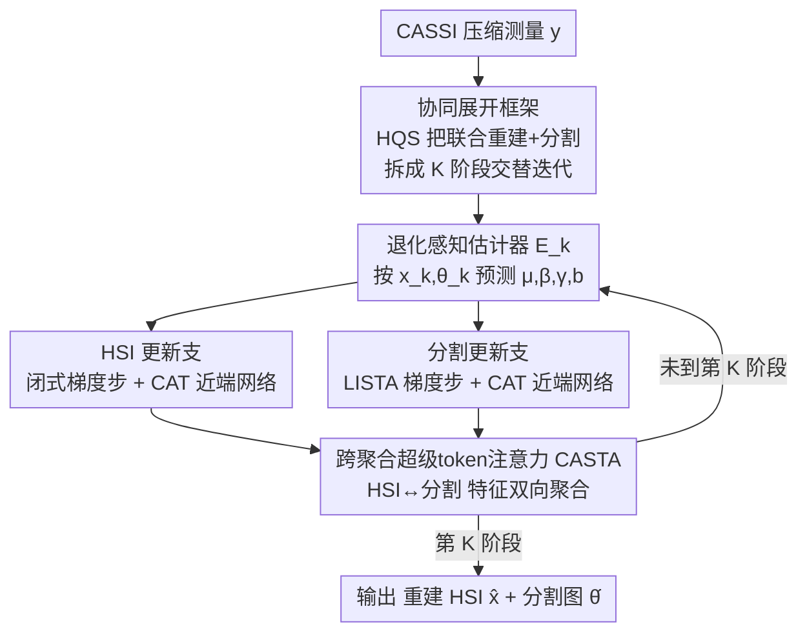

# Joint Spectral Image Reconstruction and Semantic Segmentation with Cooperative Unfolding

**会议**: CVPR 2026  
**论文**: [CVF Open Access](https://openaccess.thecvf.com/content/CVPR2026/html/He_Joint_Spectral_Image_Reconstruction_and_Semantic_Segmentation_with_Cooperative_Unfolding_CVPR_2026_paper.html)  
**代码**: https://github.com/zjhe02/CRSDUN  
**领域**: 语义分割 / 高光谱成像 / 深度展开网络  
**关键词**: CASSI、高光谱重建、语义分割、深度展开、超级token注意力

## 一句话总结
针对压缩感知高光谱成像（CASSI）下游做语义分割时"先重建再分割"两阶段管线误差累积、且割裂了两任务互补线索的问题，本文提出首个协同重建-分割深度展开网络 CRSDUN，把 HSI 重建与分割统一进一个半二次分裂（HQS）优化框架交替求解，并用跨聚合超级token注意力（CASTA）在两条分支间双向传递像素级与语义级表征，在仿真和真实 CASSI 数据上重建与分割双双取得 SOTA 且算力更省。

## 研究背景与动机

**领域现状**：编码孔径快照光谱成像（CASSI）用一块编码掩膜加色散棱镜，把 3D 光谱数据立方体 $X\in\mathbb{R}^{H\times W\times C}$ 压成单张 2D 测量 $y$，凭单次曝光换来高时间分辨率，正成为遥感、材料分析、医学诊断里主流的高光谱（HSI）采集方式。要在 CASSI 上做语义分割，常规做法是两阶段：先用一个预训练重建网络从测量恢复 HSI，再接一个预训练分割网络出语义图。

**现有痛点**：CASSI 反演本身是病态问题，重建残留的伪影会在两阶段管线里**逐级传播放大**（error accumulation），分割网络拿到的是带噪输入，错误被进一步放大；论文 Fig. 6/7 里两阶段方法在真假葡萄、相近颜色的柠檬/香蕉上都出现明显误分割。更本质的问题是，管线把重建和分割当成两个**互不通气**的独立任务，丢掉了它们之间的互补线索。

**核心矛盾**：HSI 重建和语义分割其实是一对强相关、相互增益的密集像素预测任务——二者都依赖同一份空间-光谱表征。重建网络的职责是从压缩测量里**解码**出信息丰富的表征，分割网络则能把这种表征直接**编码**成语义；结构语义可以反过来指导空间-光谱恢复（让重建更聚焦目标区域），而恢复出的细节又能提升分割精度。两阶段把它们隔开，等于让两个本可互喂的模型各自闭门造车。

**本文目标**：拆成两个子问题——(1) 如何把重建与分割塞进**同一个可优化的展开框架**里并行交替求解，而非串行级联；(2) 如何在每一阶段让两条分支**双向交换表征**，真正做到互相增益。

**切入角度**：作者从"协同视角"重新审视 CASSI 重建与分割的学习范式，观察到二者对空间-光谱表征的共同依赖，于是引入双向表征交互。

**核心 idea**：用一个统一的协同展开网络 CRSDUN，把 HSI 重建变量 $x$ 与分割图变量 $\theta$ 写进同一个带隐式联合正则项的优化目标，按 HQS 交替更新，并在每一阶段用 CASTA 让像素级（HSI）与语义级（分割）特征互相聚合，实现"重建帮分割、分割帮重建"的双赢。

## 方法详解

### 整体框架
CRSDUN 的输入是单张 CASSI 压缩测量 $y$，输出是重建好的高光谱立方体 $\hat{x}$ 和逐像素语义分割图 $\hat{\theta}$。它的骨架是一个 $K$ 阶段（论文用 3 和 5 阶段）的深度展开网络：先把"联合重建+分割"写成一个统一优化问题，再用半二次分裂（HQS）把它分解成可迭代的子问题，每一次迭代就对应展开网络的一个 stage。

关键在于每个 stage 内部不是只更新一个变量，而是**交替**地先更新 HSI $x$、再更新分割图 $\theta$：HSI 这一支走"梯度下降步（闭式解）+ 近端网络"，分割那一支走"LISTA 梯度下降步 + 近端网络"，两支的近端网络都用同一种结构——跨聚合 Transformer（CAT）。CAT 内部的 CASTA 模块负责把 HSI 特征和分割特征**互相喂**：重建分支借分割的语义线索聚焦目标，分割分支借 HSI 的像素细节区分物体。此外每个 stage 的优化超参（$\mu,\beta,\gamma,b$）不是手工固定，而是由一个退化感知估计器 $E_k$ 根据上一阶段的 $x_k,\theta_k$ 动态预测。

### 关键设计

**1. 协同展开框架：把重建和分割塞进同一个优化目标交替求解**

两阶段管线最大的毛病是重建、分割各自为政、误差还会串行累积。本文的破解办法是从优化角度把两者统一：在第 $k{+}1$ 次迭代，联合优化问题写成

$$\{x^{k+1},\theta^{k+1}\}=\arg\min_{x,\theta}\tfrac12\|y-Ax\|_2^2+\tfrac12\|x-\Phi\theta\|_2^2+\mu P(x,\theta),$$

其中 $A$ 是 CASSI 的感知矩阵，$\Phi$ 是所有像素共享的光谱字典，$\theta$ 是向量化的分割图，$P(x,\theta)$ 是连接 HSI 与分割图的**隐式联合正则项**——正是这一项把两个任务"焊"在一起。第二项 $\|x-\Phi\theta\|_2^2$ 来自模型化分割（每个像素谱 $\approx$ 字典原子的稀疏组合 $\Phi\theta$），它让重建结果与分割语义彼此约束。

求解时按 HQS 框架交替：**先更新 HSI**，引入辅助变量 $z$，$z$ 子问题是二次型、有闭式解 $z^{k+1}=\tilde{x}^k+A^\top(y-A\tilde{x}^k)\oslash(1+\beta+\mathrm{Diag}(AA^\top))$（$\tilde{x}^k=\tfrac{\beta x^k+\Phi\theta^k}{1+\beta}$，可见分割图 $\theta^k$ 直接进入了重建的梯度步），再用近端算子 $x^{k+1}=\mathrm{prox}_{\mu/\beta\cdot P}(z^{k+1},\theta^k)$ 求 $x$ 子问题；**再更新分割图** $\theta$，同样 HQS 拆出 $\ell_1$ 正则的最小二乘子问题与近端子问题。这样每个 stage 内 $x$ 和 $\theta$ 互为输入、相互增益，而非串行单向传递。

**2. LISTA 化的分割更新与退化感知超参估计：让稀疏求解可学、超参随阶段自适应**

分割图理想下每像素只属一类、是 one-hot 的，因此对 $\theta$ 跨通道加 $\ell_1$ 稀疏正则，分解 $P=\|\theta\|_1+Q(x,\theta)$。$\theta$ 的 $\ell_1$ 子问题本可用 ISTA 软阈值迭代求解：$\xi^{k+1}=\mathrm{soft}_{t\mu}(\xi^k-t(\Phi^\top(\Phi\xi^k-x^{k+1})+\gamma(\xi^k-\theta^k)))$，但固定字典 $\Phi$ 收敛慢、适应性差。本文借 LISTA 思路把它替换成可学：$\xi^{k+1}=\mathrm{soft}_b(S\xi^k+Wx^{k+1}+\gamma\theta^k)$，其中 $S\approx I-t(\Phi^\top\Phi+\gamma I)$、$W\approx t\Phi^\top$、$b\approx t\mu$ 都由网络学（$S,W$ 用两个无偏置 $1\times1$ 卷积、跨阶段共享，$b$ 是可学参数），近似误差交给训练吸收，收敛更快也更贴数据。

更巧的是，HQS 里那堆惩罚/正则系数 $\mu,\beta,\gamma,b$ 不再手调，而由每个 stage 的**退化感知估计器** $E_k$ 现场预测：$\{\mu_k,\beta_k,\gamma_k,b_k\}=E_k(x_k,\theta_k)$。它以上一阶段的重建与分割状态为输入，让优化步长随退化程度逐阶段自适应，避免固定超参在病态反演里水土不服。

**3. 跨聚合 Transformer CAT 与超级token注意力 CASTA：两任务双向交换表征的核心枢纽**

前两个设计搭好了交替优化的骨架，但"重建帮分割、分割帮重建"具体怎么发生，全靠近端网络里的 CASTA。CAT 是一个非对称 U-Net：编码端，重建支用捕捉谱内相关的 SSRB（含窗口光谱自注意力 WSSA），分割支用 Swin-Transformer Block；解码端两支都换成跨聚合超级token注意力块（CASTAB），其核心就是 CASTA。

CASTA 接收 HSI 特征 $X\in\mathbb{R}^{H\times W\times C}$ 和分割特征 $\Theta\in\mathbb{R}^{H\times W\times C}$，分三步。**(a) 跨聚合超级token采样**：先用分割特征自适应池化初始化超级token $S=\mathrm{AdaPooling2d}(\Theta)\in\mathbb{R}^{\frac Hh\times\frac Ww\times C}$（语义先验在此注入），再算超级token与 HSI 像素级特征的空间相关矩阵 $Q=\mathrm{Softmax}(SX^\top/\sqrt{C})$，并用列归一化后的 $\hat Q$ 把像素特征加权聚合进超级token $S=\hat Q X$——这一步就是"跨任务聚合"，让语义网格去归纳像素细节。**(b) 超级token内多头自注意力**：在数量很少的超级token上做 MHSA $\mathrm{Attn}(S)=\mathrm{Softmax}(q(S)k(S)^\top/\sqrt d)v(S)$，以极低代价建模长程语义关系。**(c) 上采样回像素域**：$X\ \text{or}\ \Theta=\mathrm{reshape}(Q^\top\mathrm{Attn}(S))$，把精炼后的语义信息融回像素特征，输出增强的 HSI 或分割特征。

为什么有效：论文 Fig. 2 的注意力可视化显示，把语义信息引入重建后模型更聚焦物体而非背景；把像素级信息引入分割后模型对不同物体的注意力更均衡、不会过度盯住单个物体。消融里去掉跨聚合（CA）会让 CASTA 退化成普通超级token注意力 STA，重建/分割双双掉点——这正说明双向表征交互（而非各自的注意力）才是涨点来源，也佐证了式 (8) 里联合正则项 $P(x,\theta)$ 的价值。

### 损失函数 / 训练策略
总损失是重建项 + 分割项，且采用多阶段监督——每个 stage 的输出都被约束：

$$L=\sum_{k=1}^{K}\lambda_{\text{stage}}^{K-k}\big(\|\hat{x}^k-x\|_2^2+\lambda_{ce}L_{ce}(\hat{\theta}^k,\theta)\big),$$

重建用 MSE、分割用交叉熵 $L_{ce}$，$\lambda_{\text{stage}}=0.7$、$\lambda_{ce}=10^{-4}$。优化器 Adam（$\beta_1=0.9,\beta_2=0.999$）+ 余弦退火，初始学习率 0.0004，训 500 epoch。

## 实验关键数据

### 主实验
仿真数据集 FVgNET（317 张 HSI，真/假果蔬盆栽，28 谱段，23 类，50 张测试），与多种两阶段方法（"+Seg"表示重建网络后串接 SwinTransformer 做分割）对比：

| 方法 | PSNR(dB) | mIoU(%) | Params(M) | FLOPs(G) |
|------|---------|---------|-----------|----------|
| MST++ +Seg (CVPRW'22) | 32.39 | 77.91 | 3.10 | 45.61 |
| RCUMP-9stg +Seg (TIP'24) | 38.35 | 85.66 | 14.3 | 152.1 |
| SSR-6stg +Seg (CVPR'24) | 38.20 | 87.27 | 6.91 | 108.1 |
| SSR-9stg +Seg (CVPR'24) | 39.50 | 85.74 | 10.3 | 161.0 |
| **CRSDUN-3stg (Ours)** | 39.35 | 90.11 | 4.02 | 59.49 |
| **CRSDUN-5stg (Ours)** | **39.88** | **92.33** | 6.73 | 99.07 |

CRSDUN-5stg 比 SSR-9stg/SSR-6stg/RCUMP-9stg 在 PSNR 上分别高 0.38/1.68/1.53 dB、mIoU 上高 6.59/5.06/6.67 个百分点，且算力更低；CRSDUN-3stg 在参数/FLOPs 持平或更少的情况下，重建与 SSR-9stg 相当、mIoU 至少高 2.84 个百分点。真实自建 CASSI 系统（真假葡萄场景）上，CRSDUN-3stg 能正确区分真假葡萄、相近颜色的柠檬与香蕉，而 SSR-3stg+Seg 被混淆。

### 消融实验

协同展开框架的逐项拆解（baseline-1 为纯重建展开网+每阶段单独 Swin 更新分割）：

| 配置 | PSNR(dB) | mIoU(%) | Params(M) | FLOPs(G) | 说明 |
|------|---------|---------|-----------|----------|------|
| baseline-1 | 37.33 | 84.31 | 3.96 | 60.41 | 无协同 |
| +Eq.(13) | 37.90 | 86.08 | 3.96 | 60.68 | 分割图进入重建梯度步 |
| +LISTA | 38.03 | 86.55 | 3.96 | 60.91 | 分割梯度步换 LISTA |

跨聚合（CA）机制消融（CRSDUN-3stg）：

| 配置 | PSNR(dB) | mIoU(%) | 说明 |
|------|---------|---------|------|
| 仅重建支用 CA | 39.26 | 85.49 | 分割掉点明显 |
| 仅分割支用 CA | 38.60 | 89.81 | 重建掉点 |
| 重建+分割均用 CA | **39.35** | **90.12** | 完整 CASTA |

阶段数影响：K=2/3/5/7/9 时 PSNR 单调升（37.25→40.35），但 mIoU 在 5 阶段最高（92.33），更深反而下降——重建越多 stage 越好，分割则会因网络复杂、收敛变难甚至引入额外误差而退化。故折中取 3/5 阶段。

### 关键发现
- **协同框架几乎零代价涨点**：把分割图引入重建梯度步（式 13）单项就 +0.57 dB PSNR、+1.77% mIoU，再加 LISTA 又 +0.13 dB、+0.47%，而相比 baseline-1 几乎不增参数、仅多 0.5 GFLOPs——增益来自任务间信息互通而非堆参数。
- **跨聚合（CA）是双向的、缺一不可**：去掉重建支 CA，分割 mIoU 从 90.12 掉到 85.49；去掉分割支 CA，重建 PSNR 从 39.35 掉到 38.60。说明语义喂重建、像素喂分割两条路都在起作用。
- **重建与分割对深度的偏好相反**：PSNR 随阶段数单调上升，分割 mIoU 在 5 阶段见顶后回落，揭示联合优化里两任务存在最优深度错位，需要折中。

## 亮点与洞察
- **把两阶段串行管线改写成单一可优化目标**是最核心的"啊哈"：用 HQS 展开 + 隐式联合正则 $P(x,\theta)$，让重建变量与分割变量在每个 stage 互为约束、交替增益，从根上消除了串行误差累积。
- **CASTA 用分割特征初始化超级token**很巧：超级token本是为降算力的聚类近似，这里被借来当"跨任务桥"——语义网格归纳像素细节、再融回去，既省算力又实现双向交互，可迁移到任意"两条密集预测分支需互喂"的场景（如深度+分割、去雾+检测）。
- **退化感知估计器动态预测 HQS 超参**把展开网络的手调惩罚系数变成数据驱动的逐阶段自适应，是个通用 trick，适合任何 unfolding 网络。
- 真实 CASSI 系统验证 + 注入 11–12bit 散粒噪声训练，说明方法不止在仿真上好看，真机也能落地。

## 局限与展望
- **重建与分割损失的平衡未充分探索**（作者承认）：当前 $\lambda_{ce}=10^{-4}$ 等系数固定，联合优化可能偏向某一任务；消融已显示两任务对阶段数偏好相反，损失权重很可能也需自适应或多目标优化。
- **真实数据下噪声与掩膜误差对分割的影响待研究**（作者承认）：真机的掩膜标定误差、噪声如何传导到语义图尚不清楚。
- 仅在 FVgNET（果蔬盆栽，23 类）这一数据集验证，类别和场景较窄，遥感/医学等真实高光谱分割场景的泛化性未知。
- CASTA 用分割特征初始化超级token，意味着早期 stage 分割很差时初始化质量也差，是否存在冷启动偏差、对超级token网格大小 $h\times w$ 的敏感性，论文未给分析。

## 相关工作与启发
- **vs 两阶段重建→分割（MST++/CST/RCUMP/SSR + SwinTransformer）**：他们串行级联两个独立预训练网络，重建误差会累积放大、且不共享表征；本文并行交替联合优化、双向交换特征，重建与分割同时 SOTA 且算力更省。
- **vs 直接从压缩测量分割的端到端方法**：那类方法跳过显式重建直接出语义，丢失了重建可提供的像素细节；本文保留重建并让它与分割互喂，二者皆得益。
- **vs 双任务深度展开（去雾+透射图 Fang et al.、隐藏目标分割图像一致性 He et al.）**：它们多是用辅助任务/一致性约束去帮主任务；本文首次把重建与分割当作**同等重要、相互补充**的两个任务联合展开，是该思路在 CASSI 高光谱上的首次实践。

## 评分
- 新颖性: ⭐⭐⭐⭐⭐ 首个把 CASSI 重建与语义分割统一进单一展开框架并双向交互的工作，CASTA 跨任务超级token桥设计巧妙。
- 实验充分度: ⭐⭐⭐⭐ 仿真+真机、主结果+三组消融（框架拆解/CA/阶段数）都全，但仅一个数据集、缺更多真实场景。
- 写作质量: ⭐⭐⭐⭐ 优化推导完整、图示清晰，从动机到方法逻辑顺畅，部分符号（如 $E_k$ 省略 $\mu_k$ 预测）需对照原文。
- 价值: ⭐⭐⭐⭐ 为压缩光谱成像下游任务提供了"联合优化代替级联"的范式，CASTA 与退化感知超参估计可复用到其他展开网络。

<!-- RELATED:START -->

## 相关论文

- [\[NeurIPS 2025\] HumanCrafter: Synergizing Generalizable Human Reconstruction and Semantic 3D Segmentation](../../NeurIPS2025/segmentation/humancrafter_synergizing_generalizable_human_reconstruction_and_semantic_3d_segm.md)
- [\[CVPR 2026\] Hilbert Curve-Based Attention Enabling Topology-Preserving Image Tensor Representation for Semantic Segmentation Network](hilbert_curve-based_attention_enabling_topology-preserving_image_tensor_represen.md)
- [\[CVPR 2025\] Robust 3D Shape Reconstruction in Zero-Shot from a Single Image in the Wild](../../CVPR2025/segmentation/robust_3d_shape_reconstruction_in_zero-shot_from_a_single_image_in_the_wild.md)
- [\[CVPR 2026\] From 2D Alignment to 3D Plausibility: Unifying Heterogeneous 2D Priors and Penetration-Free Diffusion for Occlusion-Robust Two-Hand Reconstruction](from_2d_alignment_to_3d_plausibility_unifying_heterogeneous_2d_priors_and_penetr.md)
- [\[CVPR 2026\] Semantic Alignment in Hyperbolic Space for Open-Vocabulary Semantic Segmentation](semantic_alignment_in_hyperbolic_space_for_open-vocabulary_semantic_segmentation.md)

<!-- RELATED:END -->
