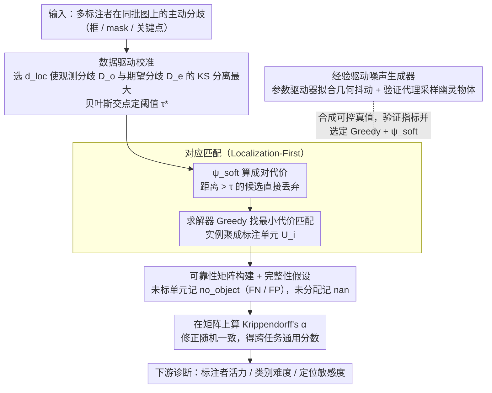

# Kαlos finds Consensus: A Meta-Algorithm for Evaluating Inter-Annotator Agreement in Complex Vision Tasks

**会议**: CVPR 2026  
**arXiv**: [2603.27197](https://arxiv.org/abs/2603.27197)  
**代码**: [GitHub](https://github.com/Madave94/kalos)  
**领域**: 分割  
**关键词**: 标注者间一致性, 数据质量评估, Krippendorff's Alpha, 目标检测, 基准评估

## 一句话总结

提出KαLOS元算法，通过"先定位后分类"原则和数据驱动的参数校准，将复杂的空间-类别标注一致性问题转化为标准名义可靠性矩阵，统一评估目标检测、实例分割、姿态估计等多种视觉任务的标注者间一致性（IAA）。

## 研究背景与动机

目标检测等视觉基准的性能提升正在停滞。现有证据表明，**限制因素不是架构而是标签噪声**：当前模型性能已落入"标签收敛"（label convergence）的置信区间，即人类标注者自身的一致性水平。

评估标注质量面临根本困难：
1. **实例对应问题**：与文本标注不同，视觉任务中需要先匹配不同标注者标注的实例（谁标的框对应谁标的框？），标准IAA指标无法直接处理
2. **验证困境**：不存在标注一致性的客观真值，无法验证IAA指标本身的正确性
3. **社区忽视**：CV社区很少评估数据集质量，即使评估也使用mAP/F1等不修正随机一致性的指标

现有方法要么将目标检测视为像素级分割（丢失实例离散性），要么使用特定启发式解决对应问题但缺乏统一框架。

## 方法详解

### 整体框架

KαLOS 要解决的核心问题是：当多个标注者各自在同一批图像上画框/画 mask/标关键点时，怎么算出他们到底"有多一致"——而且这个分数要能修正掉随机巧合，还要能横跨检测、实例分割、姿态估计等不同任务通用。难点在于视觉标注不像文本那样天然对齐：A 标的第 3 个框对应 B 标的哪个框，本身就是个需要先解的问题。

KαLOS 把这个过程拆成一条流水线串起来。先把标注者之间的"主动分歧"作为输入信号，用数据本身去校准该用什么距离函数、阈值定在哪；再据此用"先定位后分类"（Localization-First）把不同标注者的实例做空间对应匹配，匹配上的实例归为同一个"标注单元"；然后把每个单元上各标注者给出的类别填进一张可靠性矩阵，最后在这张矩阵上算 Krippendorff's α 得到一致性分数，并以此驱动后续的标注者活力、类别难度等诊断分析。整条 pipeline 的关键不在某个模块的算法新意，而在于它把"复杂的空间+类别联合一致性"压回成了一个标准的名义可靠性矩阵，从而能直接套用统计学里成熟的 α。而求解器、代价函数这些组件用什么，则由一个独立的经验噪声生成器在合成可控真值上检验后选定（最终定为 Greedy + ψ_soft）。

### 关键设计

**1. 数据驱动的距离函数与阈值校准：让数据自己定阈值，而不是手调超参**

跨任务通用的最大障碍是：检测用 IoU、姿态用关键点距离、不同任务对"匹配得算近"的尺度完全不同，靠人手调阈值既不可复现也无法跨任务比较。KαLOS 的做法是把分歧拆成两种分布去对比——"观测分歧" $D_o$ 是同一张图上不同标注者之间的差异（这是真正的信号），"期望分歧" $D_e$ 是把不同图像的标注拿来互比得到的差异（这是随机噪声基线）。它先在候选的距离函数里挑出能让这两个分布分离得最开（KS 统计量最大）的那个，再用贝叶斯决策规则找两条密度曲线的交点 $\tau^* = \{\delta \in \mathbb{R} \mid f_{D_o}(\delta) = f_{D_e}(\delta)\}$ 作为校准锚点。这个 $\tau^*$ 之所以有意义：低于它的范围内度量的是"两个标注者是否都认为这里有个物体"（存在性/检测一致），高于它则隔离出"框得准不准"（几何精度/定位），于是阈值不再是拍脑袋的超参，而是从该数据集的分歧分布里读出来的。

**2. Localization-First 对应匹配：先把"谁标的框对应谁"解出来，复杂的空间问题就塌缩成一张名义矩阵**

这是整个元算法的核心一步，也是实验唯一在反复比较的环节。视觉标注没有文本那样的天然对齐：A 标的第 3 个框对应 B 的哪个框，本身就得先解。KαLOS 采用"先定位后分类"（Localization-First）原则——先用空间对应把不同标注者的实例两两配对，再谈类别是否一致。具体做法是对每张图用语义敏感的代价函数 $\psi_{soft}$ 算成对代价（$\psi_{soft}$ 在定位距离之上叠加一个类别敏感项，专门拆解"空间重叠、类别又相近"的歧义实例），并把距离超过 $\tau$ 的候选直接丢弃、形成稀疏代价矩阵；求解器 $\mathcal{S}$ 在循环一致性（cycle-consistency）约束下找总代价最小的匹配集 $M^*$，把各标注者的实例聚成一组互斥的"标注单元" $U_i$。这一步之所以是关键：它把"复杂的空间+类别联合一致性"压成了标准的名义可靠性矩阵，让成熟的 K-α 能当作终端指标直接套用。求解器最终选 Greedy——实验表明，面对结构化的人类噪声，这种简单的局部最优策略反而比全局最优的 MGM 更稳、且完全确定性（同时 SHM、AHC 等先前方法都只是本框架的特定配置）。

**3. 完整性假设与存在性分歧：把漏标、误标当成"显式的不同意见"而非缺失值**

漏标（FN）和误标（FP）是检测一致性最棘手的情况：如果直接当作数据缺失，α 会因为大量空格而失真，惩罚不到该惩罚的错误。KαLOS 引入一个完整性假设——假定每个标注者都已经看过分配给他的全部实例。于是当某标注者在一个被其他人发现的单元上没给标注时，这并不记为"缺数据"，而是记成一个显式的 `no_object` 标签，也就是"我主动认为这里没有物体"的一票。这样 FN/FP 就变成了可靠性矩阵里实打实的类别分歧，会被 α 严格惩罚；真正的缺失值只保留给"这个标注者根本没被分配这张图"这种场景。这一手让 K-α 原生的缺失值机制和检测特有的存在性分歧各司其职，不再混为一谈。

**4. 经验驱动的噪声生成器验证：用建模过的人类噪声，而不是均匀噪声，来检验指标本身**

IAA 评估有个绕不开的死结：没有"一致性的客观真值"，你无法验证自己这个指标算得对不对。常见做法是往标注里注入合成噪声看指标怎么反应，但如果注入的是均匀/各向同性噪声，就和真实人类的犯错方式完全不像，验证出来的结论站不住。KαLOS 改成走一条"经验数据 → 拟合模型 → 统计检验"的闭环，从真实多标注者数据集里把人类误差分布建出来，再拿这个分布去生成可控的合成真值。它分两层：参数驱动器负责拟合几何上的变异——重尾、且随物体尺寸变化的位置/大小抖动；验证代理则用基础模型去采样语义和视觉上有歧义的"幽灵"物体（看着像、容易被误标的目标），模拟人会在哪儿产生分歧。两层合起来，注入的就是非各向同性、贴近真实标注行为的噪声，从而能可信地检验 α 在各种条件下是否表现合理。

### 损失函数 / 训练策略

KαLOS 不涉及训练。最终指标为 Krippendorff's α，在可靠性矩阵上计算：

$$\alpha = 1 - \frac{D_o}{D_e} = \frac{(n-1)\sum_c o_{cc} - \sum_c n_c(n_c - 1)}{n(n-1) - \sum_c n_c(n_c - 1)}$$

α 范围 $[-1, 1]$，0 表示与随机一致无异，≥0.8 视为近乎完美一致。

## 实验关键数据

### 主实验 — 对应求解器对比

| 求解器 | 3标注者Rand Index | 5标注者Rand Index | 稳定性(NuCLS ARI) |
|-------|-----------------|-----------------|------------------|
| Greedy | 最优 | 最优 | 0.99998 |
| SHM | 次优 | 次优 | 0.9327 |
| MGM | 保守 | 中等 | 0.9606 |
| AHC | 最差 | 最差 | — |

### 消融实验 — 代价函数

| 配置 | RI性能 | F1性能 | 说明 |
|------|--------|--------|------|
| ψ_soft | 最优 | 最优 | 语义敏感代价函数 |
| ψ_neg | 次优 | 次优 | 简单负代价函数 |

### 关键发现

- Greedy求解器在所有条件下表现最优且完全确定性——简单的局部最优策略比全局最优MGM更能应对结构化人类噪声
- 所有求解器精度都很高（~0.97-1.0），差异主要在召回率——保守策略（MGM）遗漏了大量有效但低IoU的匹配
- 增加标注者数量遵循递减收益规律：2→6标注者提升显著，6-8之后边际收益递减
- 标注"学派"冲突对一致性的影响大于标注者数量：3-3配置（两派对立）比5-1配置（一个异常值）差得多

## 亮点与洞察

- 将CV任务的IAA评估标准化为统一框架，使得像标注者活力分析、类别难度评估等下游诊断直接可用，无需针对每个任务重新实现
- 噪声生成器的设计理念有独立价值：通过经验建模人类误差分布而非使用简单均匀噪声
- 提出了一个重要论断：目标检测基准的瓶颈不是模型架构而是标签质量
- 数据驱动校准使框架天然可扩展到实例分割、3D体积分割、姿态估计等任务

## 局限与展望

- 需要多标注者元数据，无法对传统单标注者数据集进行事后质量评估
- 解耦架构在空间受限任务（如实验室姿态估计）中需要狭窄的阈值校准
- 经验验证仅限目标检测（数据可得性），姿态/体积分割的结论为外推
- 合成噪声生成器尚未结合图像内容的视觉不确定性

## 相关工作与启发

- **vs Nassar等人**: 像素级K-α无法捕获目标检测的实例离散本质
- **vs Amgad (AHC)和Tschirschwitz (SHM)**: 这两种方法是KαLOS的特殊配置；本文统一了两者并用经验验证找到最优配置（Greedy+ψ_soft）
- **vs Braylan等人**: 他们提出放弃K-α改用分布统计量，本文认为这是过度纠正——K-α的统计严格性应该保留，只需用分布分析做校准

## 评分

- 新颖性: ⭐⭐⭐⭐ 系统地解决了CV领域长期忽视的IAA评估问题，噪声生成器设计有创新
- 实验充分度: ⭐⭐⭐⭐ 合成验证和实际数据集分析全面，但缺少与现有数据集质量评估的大规模对比
- 写作质量: ⭐⭐⭐⭐ 逻辑严密，问题定义清晰，但篇幅较长符号较多
- 价值: ⭐⭐⭐⭐ 对CV基准建设和数据质量评估有长期价值

<!-- RELATED:START -->

## 相关论文

- [\[NeurIPS 2025\] Mars-Bench: A Benchmark for Evaluating Foundation Models for Mars Science Tasks](../../NeurIPS2025/segmentation/mars-bench_a_benchmark_for_evaluating_foundation_models_for_mars_science_tasks.md)
- [\[CVPR 2026\] Metric-Guided Feature Fusion of Visual Foundation Models for Segmentation Tasks](metric-guided_feature_fusion_of_visual_foundation_models_for_segmentation_tasks.md)
- [\[CVPR 2026\] The Missing Point in Vision Transformers for Universal Image Segmentation](the_missing_point_in_vision_transformers_for_universal_image_segmentation.md)
- [\[CVPR 2026\] GKD: Generalizable Knowledge Distillation from Vision Foundation Models for Semantic Segmentation](gkd_generalizable_knowledge_distillation_vfm.md)
- [\[CVPR 2026\] RAVEN: Radar Adaptive Vision Encoders for Efficient Chirp-wise Object Detection and Segmentation](raven_radar_adaptive_vision_encoders_for_efficient_chirp-wise_object_detection_a.md)

<!-- RELATED:END -->
