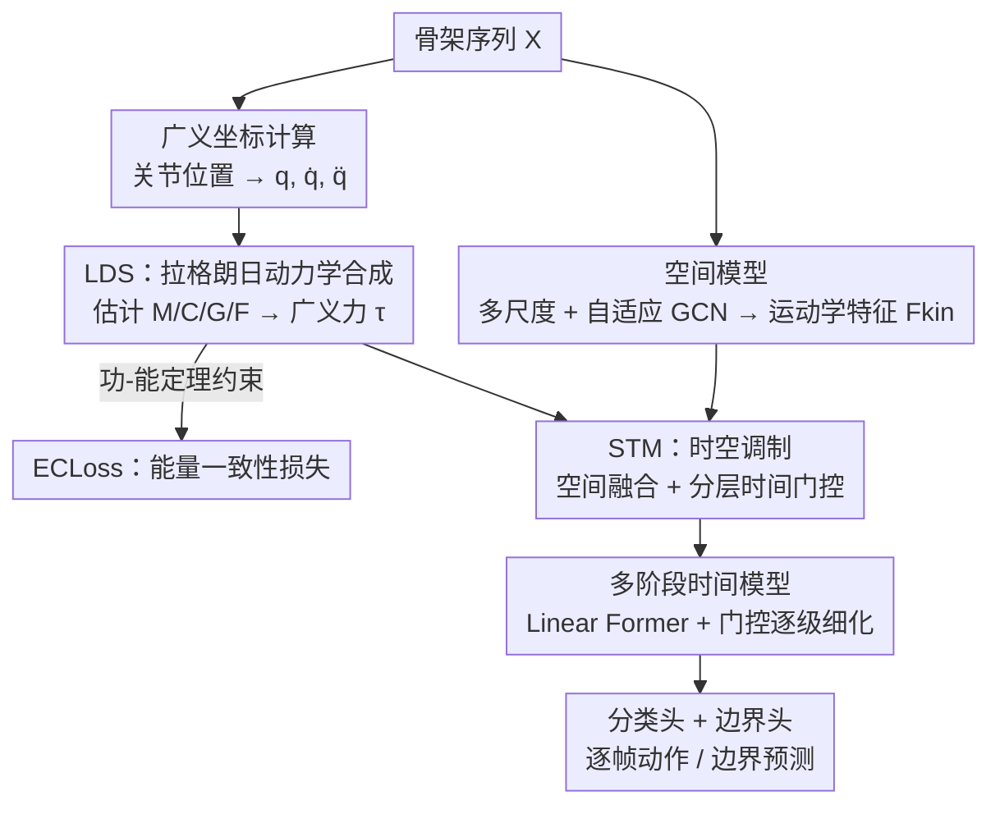

# LaDy: Lagrangian-Dynamic Informed Network for Skeleton-based Action Segmentation via Spatial-Temporal Modulation

**会议**: CVPR 2026  
**论文**: [CVF Open Access](https://openaccess.thecvf.com/content/CVPR2026/html/Ji_LaDy_Lagrangian-Dynamic_Informed_Network_for_Skeleton-based_Action_Segmentation_via_Spatial-Temporal_CVPR_2026_paper.html)  
**代码**: https://github.com/HaoyuJi/LaDy （有）  
**领域**: 视频理解 / 骨架动作分割  
**关键词**: 骨架动作分割、拉格朗日动力学、物理先验、广义力、时间边界定位

## 一句话总结
LaDy 给骨架时序动作分割（STAS）补上了一直被忽视的"物理动力学"维度：它用一条拉格朗日动力学支路从关节坐标显式合成关节广义力（力矩），再用能量一致性损失保证这些力符合功-能定理，最后把力信息分别注入空间特征（融合）和时间特征（分层门控），在六个数据集上刷新 SOTA，尤其在 PKU-MMD v2 上 F1@50 最高提升 5.2%，且只用 1.83M 参数。

## 研究背景与动机
**领域现状**：骨架时序动作分割（Skeleton-based Temporal Action Segmentation, STAS）要把一段未裁剪的骨架序列逐帧标注成动作类别。主流做法（MS-GCN 以来）是"GCN 建空间拓扑 + TCN/Transformer 建长程时序"，后续工作在解耦架构、运动增强、对比学习、多尺度金字塔上不断打磨，本质都是在学**运动学（kinematics）**模式——也就是身体"怎么动、动成什么样"。

**现有痛点**：这些方法几乎只活在运动学空间里，对驱动运动的**动力学（dynamics）**一无所知。但人体运动不只是一串姿态，它是经典力学里"力"作用的物理结果。忽略这层物理基础会丢掉动作的意图与因果信息，带来两个具体问题：（1）**类间可分性差**——运动学上很像、但动力学意图完全不同的动作分不开，比如"推购物车"和"走路"姿态轨迹相似，但前者要持续输出推力；（2）**边界定位不准**——动作切换的本质是力的剖面发生突变，而纯运动学模型常把这种突变抹平，导致边界模糊。

**核心矛盾**：运动学只回答"what/how"，回答不了"why"。同样的轨迹背后可能是完全不同的受力，光看位姿无法消歧；动作边界这种"力突变"事件，在运动学特征里恰恰是被平滑掉的。

**本文目标**：把"为什么这样动"显式建进分割流程——具体拆成：① 从关节运动学反推出每个关节的广义力；② 保证这些反推出来的力物理上自洽（不能是任意拟合的特征）；③ 让力信息真正帮到空间判别和时间边界两件事。

**切入角度**：作者从拉格朗日力学出发——刚体开链系统的广义力可以由"惯性项 + 科里奥利/离心项 + 重力项 + 非保守力"组成（$\tau = M\ddot{q} + C\dot{q} + G + F$）。与其让网络黑盒回归力，不如把这个物理方程的**结构**直接搭进网络，让网络只去填各个物理算子，再用功-能定理当监督，逼网络合成的力符合能量守恒。

**核心 idea**：用"显式合成的关节广义力"代替"只有运动学特征"来做时空调制——动力学告诉你哪里在使劲、力在什么时刻突变，正好对应类间消歧和边界定位两个老大难。

## 方法详解

### 整体框架
LaDy 是双流并行结构。输入是骨架序列 $X \in \mathbb{R}^{C_0 \times T \times V}$（$T$ 帧、$V$ 关节），输出逐帧动作标签。**主支路**是常规时空模型：多尺度 + 自适应 GCN 抽运动学特征 $F_{kin}$，再喂进 $L$ 阶段时间模型（Linear Transformer + 自适应融合）。**辅助支路**（本文创新核心）是拉格朗日动力学模型：先从关节坐标算出广义坐标/速度/加速度 $(q, \dot{q}, \ddot{q}) \in \mathbb{R}^{T \times D}$，送进物理约束的 LDS 模块合成广义力 $\tau \in \mathbb{R}^{D \times T}$，并由 ECLoss 监督其物理自洽性。

两条支路通过**时空调制（STM）**交互：空间上，把力投影/扩展成动态特征 $F_{dyn}$ 与 $F_{kin}$ 拼接得到增强表征 $F_{sp}$；时间上，从力里蒸馏出三路显著动态信号（功率、力矩范数、力矩变化量），对时间模型的每个阶段做分层门控。最后表征送进分类头与边界头，经多阶段细化得到最终预测；整网端到端训练。

### 关键设计

**1. 拉格朗日动力学合成 LDS：把物理方程的结构当网络骨架，从运动学反推广义力**

痛点是纯运动学缺"力"这一维信息，而直接让 MLP 黑盒回归力又没有物理保证。LDS 的做法是把拉格朗日方程 $\tau = M(q)\ddot{q} + C(q,\dot{q})\dot{q} + G(q) + F(q,\dot{q})$ 的每一项都用"带物理约束的可学习算子"来填，而不是整体拟合。具体地，先把骨架建成开运动链：根节点用相邻关节（脊柱中点、左右髋）经 Gram-Schmidt 正交化构造时变局部坐标系，得到根姿态 $q_{root}$ 的轴角表示；其余关节用父骨与子骨方向的轴角对齐得到局部旋转 $q_{local}$，拼起来就是广义坐标 $q$，差分得到 $\dot{q}, \ddot{q}$。

关键在于各物理算子都**内嵌约束**，保证物理合法性而非随便一个矩阵：惯性矩阵 $M(q)$ 必须对称正定，于是网络只输出一个下三角矩阵 $L(q)$、对角元用 $\mathrm{softplus}(L^{low}_{ii}(q)) + \epsilon$ 保正，再令 $M(q) = L(q)L(q)^T$（Cholesky 形式天然 SPD）；科氏矩阵 $C(q,\dot{q})$ 要满足无源性（passivity），即 $\dot{M} - 2C$ 必须反对称，于是网络输出严格上三角向量构造 $N^{up}$，令 $N = N^{up} - (N^{up})^T$ 强制反对称，再由 $C = 0.5(\dot{M} - N)$ 反解（$\dot{M}$ 用有限差分近似），从数学上保证无源性；重力项 $G(q)$ 和非保守力 $F(q,\dot{q})$ 则各用一个 MLP 直接估。这样合成的 $\tau$ 不是任意特征，而是满足刚体动力学结构约束的"准物理量"——这正是它能比纯运动学更有判别力的根因。

**2. 能量一致性损失 ECLoss：用功-能定理给合成的力上一道物理紧箍**

LDS 把方程结构搭好了，但各算子仍是学出来的，合成的力数值上可能不守恒。ECLoss 用功-能定理做正则：净力矩做的功应等于动能变化。在旋转骨架系统里净力矩为 $\tau_{net} = \tau - G - F$（$\tau$ 是预测驱动力，$G/F$ 是负载力矩），离散区间 $[t-1, t]$ 上 $E_K(t) - E_K(t-1) = \int_{t-1}^{t} P(s)\,ds$，其中瞬时功率 $P = \tau_{net} \cdot \dot{q}$。动能取 $E_K(t) = 0.5\,\dot{q}(t)^T M(t)\dot{q}(t)$，功用梯形法 $W(t) = 0.5(P(t) + P(t-1))$ 近似。

直接对 $\Delta E_K$ 与 $W$ 做 L1 会被运动幅度（能量量级）带偏，所以作者设计了**尺度无关的相对能量残差**：

$$r_E(t) = \frac{\Delta E_K(t) - W(t)}{|\Delta E_K(t)| + |W(t)| + \delta} \cdot \mathcal{M}(t)$$

分母做归一化让残差对不同能量尺度鲁棒，$\delta$ 保数值稳定；掩码 $\mathcal{M}(t)$ 在分母接近零（静止或微动相）时直接把残差清零，避免在低能量段放大噪声。最终对 $r_E$ 与 0 算 Huber 损失并按时间平均，进一步抗动态估计里的离群点。消融显示这一项能在已经很强的 +LDS+STM 基础上再稳定涨点，说明"物理自洽"确实让力的表征更精确。

**3. 时空调制 STM：把力分别注入空间判别和时间边界两条路**

合成出的力要真正帮到分割，必须落到空间和时间两个层面。**空间调制**针对类间可分性：把广义力 $\tau \in \mathbb{R}^{D \times T}$ 线性投影到运动学通道维 $C$ 得 $F'_{dyn}$，沿关节维扩展 $V$ 倍成 $F_{dyn} \in \mathbb{R}^{C \times T \times V}$，再与 $F_{kin}$ 沿通道拼成 $F_{sp} \in \mathbb{R}^{2C \times T \times V}$——这个特征同时编码"几何位姿"和"驱动它的因果动力学"，让运动学相似的动作因受力不同而被区分开。

**时间调制**针对边界定位：先从动态状态量蒸馏出三路 1D 显著信号——瞬时功率 $g_P(t) = \|\tau(t) \cdot \dot{q}(t)\|_1$（总能量消耗）、力矩范数 $g_\tau(t) = \|\tau(t)\|_2$（驱动幅度）、力矩变化量 $g_{\dot\tau}(t) = \|\tau(t) - \tau(t-1)\|_2$（动态突变，最能标记边界）。三路信号拼成初始门控 $G^{(0)}_{dyn} \in \mathbb{R}^{3 \times T}$。时间模型有 $L$ 个阶段并行一条门控支路做**分层门控**：每阶段先把三路信号用**各自独立的 1D 卷积 + sigmoid** 精炼（关键是三路分开处理，保留功率/力矩/力矩变化各自的物理语义，不让通道串扰），$g_k^{(l)} = \sigma(\mathcal{G}_k^{(l)}(g_k^{(l-1)}))$；再用每路门控通过广播 Hadamard 积分别调制时间特征 $H^{(l)}_k = H^{(l)}_T \odot g_k^{(l)}$，三路调制结果拼接后 1×1 卷积融合并加残差 $\tilde{H}^{(l)} = \mathcal{F}_{fuse}(\mathrm{Concat}(H^{(l)}_P, H^{(l)}_\tau, H^{(l)}_{\dot\tau})) + H^{(l)}_T$。这样在每个时间尺度上都用动态线索自适应放大对边界敏感的特征。可视化显示三路信号（尤其"力矩变化"）会在真实动作边界处出现尖锐的波谷，正好被网络拿来当边界线索。

### 损失函数 / 训练策略
端到端最小化复合损失 $\mathcal{L}_{total} = \mathcal{L}_{as} + \lambda_1 \mathcal{L}_{br} + \lambda_2 \mathcal{L}_{atc} + \lambda_3 \mathcal{L}_{EC}$，其中 $\mathcal{L}_{as}$ 是作用于所有阶段输出的标准分割损失，$\mathcal{L}_{br}$ 是监督边界预测的二元交叉熵，$\mathcal{L}_{atc}$ 是沿用 LaSA 的动作-文本对比损失，$\mathcal{L}_{EC}$ 即 ECLoss；权重 $\lambda_1=1.0, \lambda_2=0.8, \lambda_3=0.1$。特征维 $C=64$，拉格朗日项估计的线性层用 128 通道；Adam，学习率 $10^{-3}$，多数数据集训 300 epoch（LARa 因收敛快只需 60），单张 RTX 3090 即可训练。

## 实验关键数据

### 主实验
六个 STAS 数据集：PKU-MMD v2（X-view / X-sub）、MCFS-22、MCFS-130、LARa、TCG-15。指标为帧准确率（Acc）、分段编辑距离（Edit）、IoU 阈值 {10,25,50} 下的分段 F1。

| 数据集 | 指标 | LaDy | 前最佳 | 提升 |
|--------|------|------|--------|------|
| PKU-MMD v2 (X-view) | Acc / Edit / F1@50 | 77.0 / 74.7 / 67.6 | ME-ST 74.1 / 70.5 / 62.4 | +2.9 / +4.2 / +5.2 |
| PKU-MMD v2 (X-sub) | Acc / Edit / F1@50 | 76.2 / 75.1 / 67.0 | LaSA 73.5 / 73.4 / 63.6 | +1.5 / +1.7 / +3.4 |
| LARa | Acc / Edit / F1@50 | 75.6 / 65.9 / 59.7 | LaSA 75.3 / 65.7 / 57.9 | +0.3 / +0.2 / +1.8 |
| MCFS-22 | Acc / F1@{10,25,50} | 81.5 / 90.8·86.7·76.7 | — | SOTA |
| MCFS-130 | Acc / F1@{10,25,50} | 72.8 / 80.0·76.8·66.9 | — | SOTA |
| TCG-15 | Acc / F1@{10,25,50} | 89.3 / 82.1·80.1·74.3 | — | SOTA |

LaDy 在几乎所有指标上 SOTA，且效率极高——在 LARa（输入 $\mathbb{R}^{12 \times 6000 \times 19}$）上仅 **13.67G FLOPs、1.83M 参数**，远低于同档精度的 ME-ST（97.07G / 3.16M）和 MTST-GCN（108.87G / 2.58M）。t-SNE + 聚类指标（Silhouette↑、Calinski-Harabasz↑、Davies-Bouldin↓）三项全优，证明学到的表征类内更紧、类间更分。

### 消融实验
在 PKU-MMD v2（X-sub）上逐组件验证。Baseline 是 DeST + CTR-GCN 自适应 GCN + LaSA 的 $\mathcal{L}_{atc}$。

| 配置 | Acc | Edit | F1@50 | 说明 |
|------|-----|------|-------|------|
| Baseline | 73.6 | 73.0 | 64.3 | 纯运动学起点 |
| +LDS+SM | 74.8 | 74.0 | 65.7 | 只加空间调制 |
| +LDS+TM | 74.9 | 73.5 | 65.8 | 只加时间调制 |
| +LDS+STM | 75.9 | 74.6 | 66.3 | 空间+时间协同跳变 |
| +LDS+STM+ECLoss (LaDy) | 76.2 | 75.1 | 67.0 | 完整模型 |

### 关键发现
- **空间调制和时间调制是互补而非冗余**：单加 SM 或 TM 各涨约 1.4–1.5 F1@50，但两者一起（STM）跳到 66.3，呈现协同效应——SM 主攻类间歧义、TM 主攻边界定位，两件事本就不同。
- **ECLoss 是锦上添花的稳定收益**：在已经很强的 +LDS+STM 上再全指标小幅提升（F1@50 66.3→67.0、Acc 75.9→76.2），说明强制物理守恒能进一步精炼力的表征，而不是仅靠拟合涨点。
- **动力学先验可解释**：把每关节力的范数渲染成肢体粗细，敬礼集中在敬礼臂、投掷激活整个上半身、单脚跳正确指向腿部、鼓掌聚焦双手前臂——证明 LDS 合成的是物理合理、且类判别的真力，不是任意特征。
- **三路门控信号在边界处出现尖锐波谷**，尤其"力矩变化"信号与真实边界高度吻合，直观解释了时间调制为何能提升边界感知。

## 亮点与洞察
- **把物理方程的"结构"而非"数值"搬进网络**：不是黑盒回归力，而是让网络去填 $M/C/G/F$ 各算子，并用 Cholesky 保 SPD、反对称构造保无源性——这种"结构化归纳偏置"是物理信息神经网络在骨架任务里非常干净的落地，可迁移到姿态估计、动作生成等任何需要"力/力矩"的人体运动任务。
- **尺度无关的相对能量残差**很巧：动作幅度差异巨大时，绝对能量残差会被大幅运动主导，归一化 + 低能量段掩码让损失在静止和剧烈运动上都稳定——这个 trick 对任何"跨尺度物理量监督"都适用。
- **三路动态信号分通道门控**而非混在一起，刻意保留功率/力矩/力矩变化的物理语义，避免通道串扰——是个值得借鉴的"语义解耦门控"设计。
- 最让人"啊哈"的是把"动作边界 = 力剖面突变"这一物理直觉，转化成"力矩变化信号的波谷"当显式边界线索，理论动机和可视化高度自洽。

## 局限与展望
- **依赖关节连接拓扑与坐标系构造**：广义坐标计算需要明确父子骨关系和根坐标系（靠脊柱/髋关节定义），对不同骨架格式、缺失关节或 2D 骨架的鲁棒性论文未充分讨论。
- **有限差分近似导数**：$\dot{q}, \ddot{q}, \dot{M}$ 都用相邻帧差分得到，对噪声敏感、对低帧率或抖动数据可能放大误差，物理量的精度受采样质量制约。
- **"准物理量"非真实物理量**：合成的力没有真实力学标注做监督，只靠功-能定理自洽约束，无法验证其绝对物理正确性，更多是"物理结构正则化的特征"。
- **提升幅度依数据集而异**：在 PKU-MMD v2 上提升显著，但在 LARa 上相对前最佳仅小幅领先，动力学先验对不同动作类型/采集场景的增益不均衡。
- 可改进方向：引入真实力板/IMU 数据做弱监督校准、把动力学先验扩展到 RGB 视频 TAS、或用更鲁棒的可微分滤波替代裸有限差分。

## 相关工作与启发
- **vs 纯运动学 STAS（MS-GCN / DeST / LaSA / ME-ST）**：它们只在运动学空间建空间拓扑 + 时序依赖，LaDy 额外引入显式动力学支路。区别在于"是否建模力"——LaDy 用更小的模型（1.83M）超过 ME-ST（3.16M）等大模型，说明物理先验比单纯堆容量更高效。
- **vs 物理信息运动建模的三类用法**：以往工作把物理量当（1）辅助特征输入、（2）轨迹/姿态优化的监督正则、（3）调制信息流的控制信号（如用速度门控 LSTM、力矩融进 Graph-GRU）。LaDy 是首个把"完整骨架动力学（拉格朗日方程 + 功-能定理）"系统性用于 STAS 的时空特征处理，三种用法在它身上都有体现（力当特征、能量当损失、动态信号当门控）。
- **启发**：当一个任务里"观测量（位姿）"和"潜在驱动量（力）"存在因果关系，但只有前者可得时，用一套带物理约束的方程结构去反推后者、再用守恒定律自监督，是一条比黑盒拟合更可解释也更省参数的路——可迁移到手势识别、运动质量评估、康复监测等场景。

## 评分
- 新颖性: ⭐⭐⭐⭐⭐ 首个把拉格朗日动力学 + 功-能定理系统性引入骨架动作分割，物理先验落地干净且动机扎实。
- 实验充分度: ⭐⭐⭐⭐⭐ 六数据集 SOTA + 逐组件消融 + 力/门控可视化 + 聚类指标，证据链完整。
- 写作质量: ⭐⭐⭐⭐ 方法严谨、图示清晰，但物理约束公式密集，部分构造（如无源性反解）对非力学背景读者门槛较高。
- 价值: ⭐⭐⭐⭐ 小模型高精度且可解释，物理结构化思路对人体运动类任务有较强迁移价值。

<!-- RELATED:START -->

## 相关论文

- [\[ICCV 2025\] Skeleton Motion Words for Unsupervised Skeleton-Based Temporal Action Segmentation](../../ICCV2025/segmentation/skeleton_motion_words_for_unsupervised_skeleton-based_temporal_action_segmentati.md)
- [\[CVPR 2026\] Hierarchical Action Learning for Weakly-Supervised Action Segmentation](hierarchical_action_learning_for_weakly-supervised_action_segmentation.md)
- [\[CVPR 2026\] Generalizable Co-Salient Object Detection via Mixed Content-Style Modulation](generalizable_co-salient_object_detection_via_mixed_content-style_modulation.md)
- [\[CVPR 2026\] Spatial Matters: Position-Guided 3D Referring Expression Segmentation](spatial_matters_position-guided_3d_referring_expression_segmentation.md)
- [\[CVPR 2026\] CaptionFormer: Unified Segmentation, Tracking, and Captioning for Spatio-Temporal Objects](captionformer_unified_segmentation_tracking_and_captioning_for_spatio-temporal_o.md)

<!-- RELATED:END -->
