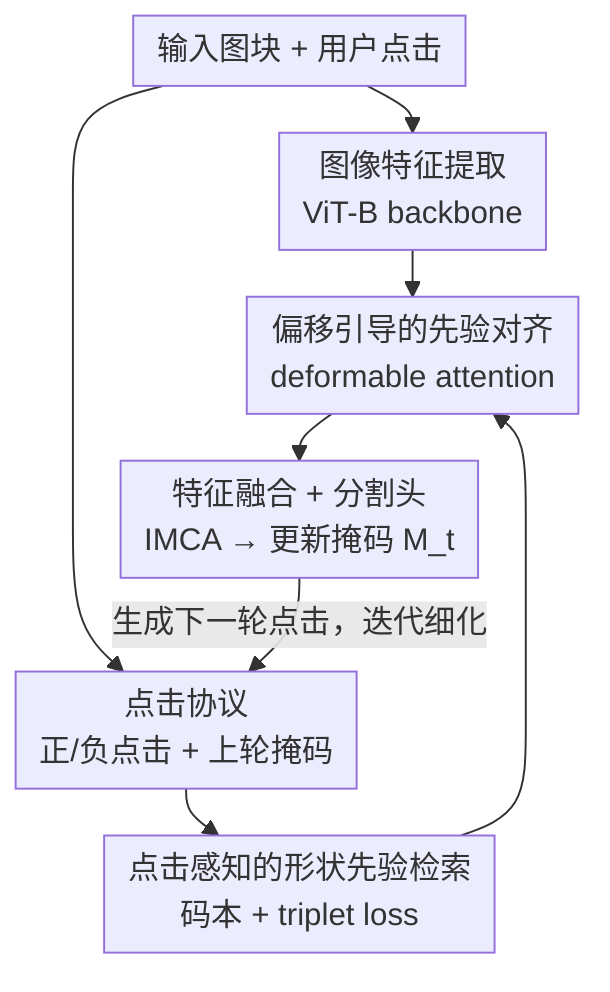

# Learning and Aligning Click-Aware Shape Prior for Interactive Amodal Instance Segmentation

**会议**: CVPR 2026  
**论文**: [CVF Open Access](https://openaccess.thecvf.com/content/CVPR2026/html/Chen_Learning_and_Aligning_Click-Aware_Shape_Prior_for_Interactive_Amodal_Instance_CVPR_2026_paper.html)  
**代码**: https://github.com/chenbys/ClickPriorNet （有）  
**领域**: 图像分割 / 交互式分割  
**关键词**: 非模态分割, 交互式分割, 形状先验, triplet loss, 可变形注意力

## 一句话总结
ClickPriorNet 把非模态实例分割（同时分割可见区域与被遮挡区域）做成交互式任务——用户每点几下，模型就用「上一轮掩码 + 当前点击」去形状码本里检索互补的形状先验，并用可变形注意力把先验对齐到目标实例上，从而在 KINS/D2SA/COCOA 三个数据集上以更少点击拿到更完整的非模态掩码。

## 研究背景与动机

**领域现状**：非模态实例分割（amodal instance segmentation）要求模型不仅分割物体的可见像素，还要补全被其它物体遮挡的部分，这对图像编辑、场景去遮挡、AR 物体摆放都很有用。由于遮挡区域本身没有视觉证据，主流做法是引入各种「推理支撑」：有的建模深度顺序（Zhang et al.），有的像 VRSP 那样用类别专属的形状先验码本（shape prior codebook）去推断遮挡区域，C2F-Seg 则在向量量化的隐空间里由粗到细地学形状先验。

**现有痛点**：这些方法都把形状先验当成一种「全自动、一次性」的支撑，但**测试阶段的目标实例和码本里存的先验经常不兼容**——码本是按训练实例建的，遇到形状奇特或遮挡严重的新实例，检索到的先验未必合适，强行套用反而会误导补全。而且「怎么精确地检索、怎么把检索到的先验对齐到当前实例」这两个问题一直没解决好。

**核心矛盾**：非模态补全本质上是欠定的（遮挡处信息缺失），纯靠图像特征 + 固定码本无法消除歧义；而现有检索靠特征空间里的欧氏距离找「最像 query 的先验」，但**最像的先验往往提供不了互补信息**（你已经分割对的那部分，再找个一样的先验没用），真正需要的是能补全缺失区域的先验。

**本文目标**：(1) 把非模态分割改造成交互式任务，让用户用少量点击直接指出遮挡区域的大致范围；(2) 设计一个能「按点击检索到互补先验」并「把先验对齐到实例」的框架。

**切入角度**：作者观察到用户点击有双重价值——既能直接划定遮挡区域的范围（正点击补前景、负点击压背景），又能作为查询信号帮助检索出更兼容的形状先验。于是把点击同时塞进「检索」和「分割」两条链路。

**核心 idea**：用「上一轮掩码 + 用户点击」联合查询形状码本，并用 triplet loss 监督检索结果与真值的 IoU 要高，再用可变形注意力把先验对齐到目标——一句话就是「点击感知地检索 + 偏移引导地对齐形状先验」。

## 方法详解

### 整体框架

模型叫 **ClickPriorNet**。任务设定沿用 C2F-Seg：给一张裁剪好、含单个实例的图块 $x \in \mathbb{R}^{H_i \times W_i \times 3}$，预测它的非模态掩码 $M^a$（覆盖可见 + 遮挡）。交互协议沿用 MFP：最多 $T \le 24$ 轮，每轮在「上一轮掩码 $M^{t-1}$」和「真值 $M^{gt}$」差异最大的连通误分割区域中心生成一个点击 $C^t$——若漏分（false negative）面积更大就在第一通道生成正点击，反之在第二通道生成负点击；第一轮没有历史掩码，初始化为全零掩码并在图像中心放一个正点击启动交互。

整条流水线在每个交互轮里走四步：(a) 用 ViT-B backbone 抽图像特征 $F^i \in \mathbb{R}^{H \times W \times C}$；(b) 用预训练好的 query 编码器把「上一轮掩码 + 点击」编码成 MC 特征 $F^{mc}$，再去码本检索出 $K$ 个形状先验 $P \in \mathbb{R}^{d \times K}$；(c) 把先验特征 $F^p$ 和 $F^{imc}$（$F^i$ 与 $F^{mc}$ 拼接）一起送进对齐模块，用可变形注意力抽出对齐后的先验特征 $F^a$；(d) 把 $F^{imc}$ 与 $F^a$ 拼接压缩成 IMCA 特征 $F^{imca}$，喂给分割头得到更新掩码 $M^t$。下一轮再据此生成新点击，迭代细化。

### 关键设计

**1. 交互式非模态分割任务与点击协议：给欠定的遮挡补全引入用户监督**

非模态补全天然欠定——遮挡处没有像素证据，模型只能猜。作者的切入点是：与其让模型独自猜，不如让用户用几次点击把遮挡区域的范围直接告诉它。具体协议沿用交互式分割的标准设定（与 MFP/RITM 一致）：每轮比较上一轮掩码 $M^{t-1}$ 和真值 $M^{gt}$，在差异最大的连通区域中心放点击；漏分区域（false negative）大就放**正点击**（高亮缺失前景），过分割区域大就放**负点击**（压制多余背景），点击编码在 $C^t \in \mathbb{R}^{H_i \times W_i \times 2}$ 的两个通道里。这个设计的关键不只是「加了用户输入」，而是让点击同时服务于两件事：既划定遮挡范围，又作为后面检索形状先验的查询信号——这也是后续两个设计能成立的前提。把任务从「全自动」变「交互式」，本身就是论文的第一个贡献。

**2. 点击感知的形状先验检索：用 triplet loss 把「高 IoU 的互补先验」拉到查询附近**

VRSP 那类方法在自编码器特征空间里用欧氏距离检索「最像 query 的先验」，但最像的先验提供的是冗余信息，补全不了缺失区域。作者的做法是改变检索的监督目标：不追求「像」，而追求「检索到的先验与真值 IoU 高」。

先建码本：按类别收集训练实例的真值非模态掩码，每个类别的码本有 $K_s$ 个槽（$K_s=1024$），key 和 value 都是该实例的真值掩码；实例不足就做空间增广补齐，实例过多就对掩码嵌入做 K-Means 取 $K_s$ 个聚类中心。检索时**用「上一轮掩码 $M^q$ + 用户点击 $C^q$」一起编码**成查询向量（注意这里把点击也塞进了 query，是与 VRSP 的关键区别）：

$$v_q = E_q([M^q; C^q])$$

其中 $E_q$ 是六层带下采样的卷积编码器，把 $448\times448$ 输入编成 288 维向量；码本里的真值掩码用结构相同的 key 编码器 $E_k$ 编成 $v_k$。监督上用 triplet loss：先算当前实例真值 $M^{gt}$ 与所有槽内掩码的 IoU，IoU 最高的 top-$N$ 槽作为正集 $S^+$，IoU $<0.8$ 且不在 $S^+$ 里的 top-$N$ 槽作为负集 $S^-$，然后

$$L_{triplet} = \sigma\!\left(\max_{i\in S^+}\lVert v_q - v_k^i\rVert - \min_{i\in S^-}\lVert v_q - v_k^i\rVert + \alpha\right)$$

$\sigma$ 是 ReLU，$\alpha$ 是 margin。直观说就是：把「与真值高 IoU 的先验」拉近 query、把「低 IoU 的先验」推远，于是给定目标实例的掩码和点击，检索到的就是真正能帮上忙的高 IoU 先验，而不是冗余的相似先验。消融里这一步贡献最大（mIoUocc +9.69%）。

**3. 偏移引导的形状先验对齐：用可变形注意力消除先验与实例的位置错配**

即便检索到了兼容的先验，它和目标实例之间仍有不可避免的错配（尺度、姿态、位置都可能差一点），直接拼接会得到次优结果。作者用可变形注意力（deformable attention）来自适应对齐。先把 MC 特征 $F^{mc}$ 与图像特征 $F^i$ 拼成 $F^{imc}$，再与检索到的先验特征 $F^p$ 一起预测采样偏移和注意力权重：

$$[\Phi; A] = F_{deformatt}[F^{imc}; F^p]$$

偏移估计器会让先验去对照上一轮掩码、当前点击、图像特征和先验特征四者，从而估出「该往哪偏」。然后在先验特征图上做可变形注意力抽出对齐特征：

$$F^a = \sum_{z=1}^{Z} W_z \left[\sum_{k=1}^{K} A_{z,k}\cdot W'_z\, F^p(P_{ref}+\Phi_{z,k})\right]$$

$P_{ref}$ 是参考点，$Z$ 是注意力头数，$K$ 是每头采样点数。可变形注意力的好处是采样点能按偏移自适应地挪到该对齐的位置上，相当于把「形状对但位置歪」的先验掰正后再用，弥合检索先验与目标实例的错配——消融显示这步在已有 click-aware 先验基础上再带来 mIoUocc +5.3%。

### 损失函数 / 训练策略

分两阶段。**预训练阶段**：建码本 + 用 triplet loss（式 2）训练 query/key 编码器；为此需要从一个原始模型为每个训练实例预存一些历史掩码和点击作为 query。**正式训练阶段**：对每张图取 $T$ 个交互轮分割损失的平均

$$L_{full} = \frac{1}{T}\sum_t^{T} L_{seg}(M^t, M^{gt})$$

$L_{seg}$ 用归一化 focal loss（同 RITM）。backbone 用 ViT-B，输入统一 resize 到 $448\times448$，Adam（$\beta_1=0.9,\beta_2=0.999$），基础学习率 $5\times10^{-5}$ 多步衰减。推理阶段沿用同一流水线，按用户点击迭代细化掩码。

## 实验关键数据

三个数据集：KINS（KITTI 自动驾驶，7 类）、D2SA（超市商品，60 类）、COCOA cls（COCO，80 类）。重点测**遮挡样本**（遮挡率 >10%）。两套指标：NoC（达到目标 mIoU 所需点击数，越少越好，设 80/85/90% 三档）和 mIoU（full / occ 两种，越高越好）。

### 主实验

与交互式分割基线比 NoC（越低越好，遮挡区域）：

| 方法 | Backbone | KINS NoC80 | KINS NoC85 | KINS NoC90 | D2SA NoC90 | COCOA NoC90 |
|------|----------|-----------|-----------|-----------|-----------|-----------|
| MFP | ViT-B | 1.93 | 2.88 | 4.76 | 3.22 | 6.69 |
| MFP+C2F | ViT-B | 1.81 | 2.62 | 4.65 | 3.02 | 6.12 |
| **Ours** | ViT-B | **1.66** | **2.40** | **4.31** | **2.51** | **5.62** |

在 KINS NoC90 上比最强基线 MFP+C2F 少 0.34 次点击，三个数据集全面领先。

与非模态分割方法比 mIoU（越高越好，固定点击数）：

| 方法 | 点击 | KINS mIoUfull | KINS mIoUocc | D2SA mIoUocc | COCOA mIoUocc |
|------|------|--------------|-------------|-------------|--------------|
| MFP+C2F | 1 | 82.64 | 55.11 | 45.80 | 30.14 |
| **Ours** | 1 | **83.13** | **56.32** | **47.12** | **38.50** |
| MFP+C2F | 5 | 89.82 | 73.35 | 55.25 | 52.22 |
| **Ours** | 5 | **91.97** | **77.72** | **62.67** | **58.30** |

1 击时在 KINS 上 +0.49% mIoUfull / +1.21% mIoUocc；5 击时优势拉大到 +2.15% / +4.37%，说明点击越多本方法越能把先验用好。

### 消融实验

KINS 数据集，mIoUocc 在 3 击下评测：

| Row | 标准形状先验 | 点击感知先验 | 先验对齐 | NoC85 ↓ | mIoUocc ↑ |
|-----|:---:|:---:|:---:|:---:|:---:|
| #1 | | | | 2.85 | 54.02 |
| #2 | √ | | | 2.73 | 58.17 |
| #3 | | √ | | 2.51 | 67.86 |
| #4 | | √ | √ | **2.40** | **73.16** |

### 关键发现
- **点击感知检索是涨点主力**：从 #2（标准先验，+4.15% mIoUocc）到 #3（点击感知先验）一下 +9.69% mIoUocc，远超「用不用先验」本身带来的增益，证明「检索高 IoU 的互补先验」比「检索最像的先验」重要得多。
- **对齐模块锦上添花**：#4 在 #3 基础上再 +5.3% mIoUocc、−0.11 NoC85，说明可变形注意力对齐确实弥合了先验与实例的错配，且与检索模块互补。
- **点击越多优势越大**：从 1 击到 5 击，本方法相对 MFP+C2F 的 mIoUocc 优势从 +1.21% 扩大到 +4.37%（KINS），且 AUC 分数 +1.678，在 1–24 击全程领先（约 15 击后各方法饱和）。
- **超参较鲁棒**：margin $\alpha$、正负集 top-$N$、检索先验数 $K$ 在合理区间内都稳定——$N\ge9$ 时 NoC85 稳定、$K>10$ 后不再提升，作者据此取默认值。

## 亮点与洞察
- **把「检索目标」从相似度换成 IoU**：用 triplet loss 监督「检索到的先验要与真值高 IoU」而非「最像 query」，一针见血地解决了「相似先验提供冗余信息」的老问题，这个思路可迁移到任何用码本/检索做补全的任务。
- **让点击身兼两职**：用户点击既是分割的交互信号，又是检索的查询信号，一份输入两处复用，把交互式分割和形状先验两条线整合到一个框架里——这是论文标题里 "integrally make full use" 的实质。
- **用可变形注意力做先验对齐**：把「检索到但位置不准的先验」当成需要采样偏移去掰正的对象，比直接拼接优雅，也契合非模态任务里先验与实例总有错配的现实。

## 局限与展望
- **依赖预存历史掩码/点击做预训练**：query 编码器需要从一个「原始模型」预存每个训练实例的历史掩码和点击，流程偏重，复现成本高。
- **失败案例暴露语义歧义**：作者自己给出最差案例——两只斑马只给 1 击时模型会混淆实例，20 击后也只到 86.81 IoU，说明纯几何点击对「多个同类实例紧贴」这类语义歧义仍乏力。
- **码本按类别构建**：依赖预训练分类器给的类别来选码本，对开放类别/未知类别的泛化未做讨论；$K_s=1024$ 的码本规模对长尾类别也可能不够。
- **只在裁剪图块上做单实例**：沿用 C2F-Seg 的「裁剪 + 单实例」设定，距离端到端的整图多实例非模态分割还有距离。

## 相关工作与启发
- **vs VRSP**: 都用形状先验码本，但 VRSP 在自编码器特征空间用欧氏距离检索「最相似」先验，本文改用 triplet loss 检索「高 IoU 互补」先验，并额外引入用户点击参与查询——直接针对「相似先验信息冗余」的痛点。
- **vs C2F-Seg**: C2F-Seg 在向量量化隐空间里由粗到细学先验、全自动推断；本文沿用其任务定义但把任务交互化，用点击划定遮挡范围，1 击即超过 C2F-Seg + MFP 组合。
- **vs MFP / RITM（交互式分割）**: 交互式分割范式只分割可见区域，本文借用其点击协议与迭代细化框架，但目标是补全被遮挡的完整非模态掩码，并用形状先验作为遮挡区域的推理支撑。

## 评分
- 新颖性: ⭐⭐⭐⭐ 首次把非模态分割做成交互式任务，且「IoU 监督检索 + 点击参与查询 + 可变形对齐」的组合有清晰针对性。
- 实验充分度: ⭐⭐⭐⭐ 三数据集、两套指标、逐模块消融、点击数曲线、超参分析齐全，但缺端到端整图与开放类别评测。
- 写作质量: ⭐⭐⭐⭐ 动机—方法—消融逻辑清晰，公式与符号基本自洽（个别符号如式 4 的 $W'_z$ 表述略简）。
- 价值: ⭐⭐⭐⭐ 给场景去遮挡/图像编辑等下游提供了可交互、可迭代的非模态分割工具，且检索思路有迁移性。

<!-- RELATED:START -->

## 相关论文

- [\[CVPR 2026\] Live Interactive Training for Video Segmentation](live_interactive_training_for_video_segmentation.md)
- [\[CVPR 2026\] The Power of Prior: Training-Free Open-Vocabulary Semantic Segmentation with LLaVA](the_power_of_prior_training-free_open-vocabulary_semantic_segmentation_with_llav.md)
- [\[CVPR 2025\] Using Diffusion Priors for Video Amodal Segmentation](../../CVPR2025/segmentation/using_diffusion_priors_for_video_amodal_segmentation.md)
- [\[CVPR 2026\] VideoMaMa: Mask-Guided Video Matting via Generative Prior](videomama_mask-guided_video_matting_via_generative_prior.md)
- [\[CVPR 2026\] Universal 3D Shape Matching via Coarse-to-Fine Language Guidance](universal_3d_shape_matching_via_coarse-to-fine_language_guidance.md)

<!-- RELATED:END -->
