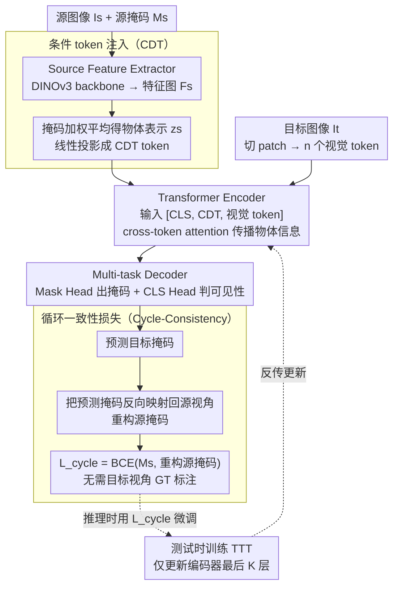

# Learning Cross-View Object Correspondence via Cycle-Consistent Mask Prediction

**会议**: CVPR 2026  
**arXiv**: [2602.18996](https://arxiv.org/abs/2602.18996)  
**代码**: [GitHub](https://github.com/shannany0606/CCMP)  
**领域**: 分割 / 跨视角对应  
**关键词**: 跨视角对应, 循环一致性, 条件分割, 测试时训练, 自我中心视角

## 一句话总结

提出基于条件二值分割的跨视角物体对应框架 CCMP，通过循环一致性约束提供自监督信号并支持测试时训练 (TTT)，在 Ego-Exo4D 上达到 44.57% mIoU 的 SOTA 性能。

## 研究背景与动机

跨视角视觉对应（特别是自我中心/外中心视角之间）是具身智能的核心能力，例如服务机器人需要从佩戴者的第一人称视角指令定位第三人称视角中的物体。这一任务面临三大挑战：

**外观变化剧烈**：自我中心视角抖动、杂乱、运动模糊；外中心视角稳定但可能缺乏细节

**空间上下文差异大**：不同视角下物体周围环境完全不同，无法依赖背景匹配

**时序动态不同**：物体在不同相机视角下的运动和形变差异显著

现有方法要么依赖辅助模块（ObjectRelator），要么需要预生成候选掩码（O-MaMa），架构复杂且难以泛化。

## 方法详解

### 整体框架

端到端的条件二值分割框架：给定源图像 $I_s$、目标图像 $I_t$ 和源掩码 $M_s$，预测目标视角中对应物体的掩码 $M_t$。前向通路由三部分组成——Source Feature Extractor（ConvNeXt-based DINOv3-L）从源图加掩码提取物体特征并投影成一个条件 token（CDT），Transformer Encoder（ViT-based DINOv3-L）借 CDT 在目标图像的视觉 token 上做 cross-token attention，Multi-task Decoder 输出目标掩码并判物体可见性。在这条前向通路之上再叠一条自监督回环：把预测掩码反向映射回源视角、重构源掩码，用循环一致性损失约束往返一致——这条损失既在训练时充当监督信号，也在推理时驱动测试时训练（TTT），是「训练与推理统一」的关键。

### 关键设计

1. **条件 token 注入（Conditioning Token, CDT）**：解决「怎么把源物体信息塞进目标图像编码、又不大改预训练 backbone」的问题。源图像特征经 backbone 提取后，用归一化掩码 $\tilde{M}_s$ 做加权平均得到紧凑的物体表示 $z_s = \sum_{i,j} \tilde{M}_s[i,j] \cdot F_s[:,i,j]$，再线性投影为单个 CDT token，与目标图像的视觉 token、CLS token 拼成 $[\text{CLS}, \text{CDT}, x_1, \dots, x_n]$ 一起送进 Transformer 编码器。CDT 通过 cross-token attention 在目标 token 中传播物体感知信息。它的妙处在于仅增加一个 token，与预训练 backbone 完全兼容、架构改动极小，却把「找哪个物体」的条件信号注入了整张目标图像。

2. **循环一致性损失（Cycle-Consistency Loss）**：核心自监督信号，解决「目标视角没有 GT 掩码、监督从哪来」的问题。源掩码 $M_s$ → 预测目标掩码 $\hat{M}_t$ → 将 $\hat{M}_t$ 反向映射回源视角得到重构掩码 $\hat{M}_s$，约束 $\mathcal{L}_{cycle} = \mathcal{L}_{bce}(M_s, \hat{M}_s)$。关键性质是这条往返约束**不需要目标视角 GT 掩码**，只靠「转过去再转回来要对上」就能逼模型学到视角不变的物体表示；正因为不依赖标注，它在推理阶段同样可用，直接打通了下面的 TTT。

3. **测试时训练（Test-Time Training, TTT）**：解决「测试样本对与训练分布有偏移」的问题，把上面那条循环一致性损失搬到推理时用。对每个测试样本对，用 $\mathcal{L}_{cycle}$ 做少步微调——仅更新 Transformer 编码器最后 $K$ 层、$T$ 步梯度更新、lr = $5 \times 10^{-6}$。Ego2Exo 设 $K=4, T=2$；Exo2Ego 因更难设 $K=11, T=6$。同一条损失在训练时做监督、推理时做自适应，使模型能贴合特定测试对的分布。

### 损失函数 / 训练策略

- **掩码损失** $\mathcal{L}_{mask} = \mathcal{L}_{bce} + \lambda_{dice}\mathcal{L}_{dice}$，$\lambda_{dice}=5$
- **辅助损失** $\mathcal{L}_{aux}$：对倒数第二层 Transformer 输出施加相同掩码损失（深监督）
- **总损失** $\mathcal{L}_{total} = \mathcal{L}_{mask} + \lambda_{aux}\mathcal{L}_{aux} + \lambda_{cycle}\mathcal{L}_{cycle}$，$\lambda_{aux}=1, \lambda_{cycle}=10$
- 训练两阶段：Stage 1 冻结 DINOv3 backbone 训练 64K iter；Stage 2 全量微调 640K iter
- 梯度累积步长 16，8×A800 训练约 72 小时
- 数据增强：统一 Ego2Exo/Exo2Ego 为双向训练、合成同视角对 (Ego2Ego, Exo2Exo)、放松时间对齐

## 实验关键数据

### 主实验

| 数据集 | 指标 | 本文 | 之前SOTA | 提升 |
|--------|------|------|----------|------|
| Ego-Exo4D (Exo Query) | IoU | **47.18** | 44.08 (O-MaMa) | +3.10 |
| Ego-Exo4D (Ego Query) | IoU | 41.95 | 42.57 (O-MaMa) | -0.62 |
| Ego-Exo4D | mIoU | **44.57** | 43.32 (O-MaMa) | +1.25 |
| Ego-Exo4D | CA (Ego) | **0.669** | 0.590 (O-MaMa) | +13.4% |
| HANDAL-X (零样本) | IoU | **78.8** | 42.8 (ObjectRelator) | +36.0 |
| HANDAL-X (微调后) | IoU | **85.0** | 84.7 (ObjectRelator) | +0.3 |

### 消融实验

| 配置 | Ego-IoU | Exo-IoU | mIoU | 说明 |
|------|---------|---------|------|------|
| 完整模型 | 41.95 | 47.18 | **44.57** | 全部组件 |
| w/o $\mathcal{L}_{cycle}$ | 40.28 | 45.82 | 43.05 | 循环一致性关键 |
| w/o $\mathcal{L}_{aux}$ | 40.64 | 43.81 | 42.90 | 深监督辅助 |
| w/o TTT | 41.79 | 44.18 | 42.99 | TTT 提升 +1.58 |
| w/o 同视角增强 | 40.88 | 45.50 | 43.19 | 数据多样性重要 |

### 关键发现

- Ego Query 普遍比 Exo Query 更难，因为外中心视角目标物体更小、环境更杂乱
- SEEM、PSALM 等通用分割模型在此任务上表现很差（IoU < 10%），说明跨视角训练是必要的
- HANDAL-X 零样本 IoU 78.8% 远超所有 baseline，说明在 Ego-Exo4D 上训练后具有强跨域泛化
- 即使用较弱的 DINOv2 特征替代 DINOv3，方法仍优于 "baseline + DINOv3"，证明增益主要来自方法设计而非特征更强

## 亮点与洞察

- **极简设计 + 强效果**：仅引入一个 CDT token 和循环一致性损失，架构修改极小但效果卓越
- 循环一致性实现了"训练和推理的统一"——同一损失在训练时做监督、推理时做 TTT
- TTT 策略是**首次**成功应用于跨视角对应任务，且带来一致性提升
- 数据增强策略（同视角配对、放松时间对齐）简单但有效，值得借鉴

## 局限与展望

- Ego Query 性能略逊于 O-MaMa（41.95 vs 42.57），外中心目标的小物体分割仍有提升空间
- TTT 在推理时需要额外的梯度更新步骤，增加时延
- 可见性预测（CLS Head）采用后训练策略，与主模型分离，可能限制联合优化效果
- 未处理循环中物体不可见的极端情况（尽管在 Ego-Exo4D 中罕见）

## 相关工作与启发

- **O-MaMa**：掩码匹配方法，依赖 FastSAM 预生成候选，本文的端到端方法更简洁
- **ObjectRelator**：融合视觉和文本线索，架构复杂；本文纯视觉方案更泛化（HANDAL-X +36%）
- **TTT 家族** (Sun et al. 2020, 2024)：测试时训练从分类扩展到视频、语言，本文首次用于跨视角
- 启发：循环一致性 + TTT 的组合可推广到其他需要自监督的对应任务（如 3D 点云配准）

## 评分

- 新颖性: ⭐⭐⭐⭐ 循环一致性 + TTT 的组合新颖，CDT 注入简洁有效
- 实验充分度: ⭐⭐⭐⭐ Ego-Exo4D + HANDAL-X 双 benchmark，消融全面
- 写作质量: ⭐⭐⭐⭐ 方法描述清晰，动机和设计逻辑连贯
- 价值: ⭐⭐⭐⭐ 为跨视角对应建立了简洁高效的新 baseline，TTT 策略有广泛适用性

<!-- RELATED:START -->

## 相关论文

- [\[CVPR 2025\] V-CLR: View-Consistent Learning for Open-World Instance Segmentation](../../CVPR2025/segmentation/v-clr_view-consistent_learning_for_open-world_instance_segmentation.md)
- [\[CVPR 2026\] FoV-Net: Rotation-Invariant CAD B-rep Learning via Field-of-View Ray Casting](fov-net_rotation-invariant_cad_b-rep_learning_via_field-of-view_ray_casting.md)
- [\[CVPR 2026\] GenMask: Adapting DiT for Segmentation via Direct Mask Generation](genmask_adapting_dit_for_segmentation_via_direct_mask_generation.md)
- [\[CVPR 2026\] FCL-COD: Weakly Supervised Camouflaged Object Detection with Frequency-aware and Contrastive Learning](fcl-cod_weakly_supervised_camouflaged_object_detection_with_frequency-aware_and_.md)
- [\[ICCV 2025\] O-MaMa: Learning Object Mask Matching between Egocentric and Exocentric Views](../../ICCV2025/segmentation/o-mama_learning_object_mask_matching_between_egocentric_and_exocentric_views.md)

<!-- RELATED:END -->
