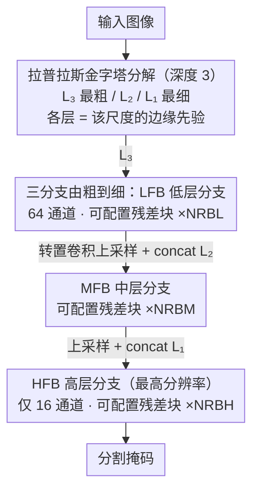

# LEMMA: Laplacian Pyramids for Efficient Marine Semantic Segmentation

**会议**: CVPR 2026  
**arXiv**: [2603.25689](https://arxiv.org/abs/2603.25689)  
**代码**: 无  
**领域**: 语义分割  
**关键词**: 轻量化语义分割, 拉普拉斯金字塔, 海洋语义分割, 边缘检测, 无人水面艇

## 一句话总结

提出LEMMA，一种基于拉普拉斯金字塔的轻量级海洋语义分割模型，通过金字塔分解提取边缘信息来替代深层特征计算，在参数量减少71倍的条件下实现了SOTA级别的分割精度（MaSTr1325上98.97% mIoU）。

## 研究背景与动机

海洋场景的语义分割对于无人水面艇(USV)自主导航和沿海地球观测（如油污检测）至关重要。然而，现有的语义分割方法（如WaSR-T、DeepLabv3等）通常依赖深层CNN或Transformer架构，拥有数千万甚至上亿的参数量和极高的计算开销，难以在无人机、USV等资源受限的边缘设备上实时运行。

核心矛盾在于：海洋场景需要高精度分割（水面反射、薄油膜等低对比度区域），但部署平台（无人机/USV）的算力极为有限。现有方法在精度和效率之间无法兼顾——WaSR-T虽然达到99.80% mIoU，但需要71.4M参数和133.8 GFLOPs。

本文的切入角度是利用拉普拉斯金字塔分解天然提供的边缘信息。金字塔的各层包含了不同分辨率下的边缘细节，这些信息可以在特征提取的早期阶段就被注入，从而避免在深层网络中进行昂贵的特征图计算。核心idea：用拉普拉斯金字塔的边缘先验替代深层特征提取，实现轻量化与高精度的兼得。

## 方法详解

### 整体框架

LEMMA 要解决的问题是：海洋分割既要看清水面反射、薄油膜这类低对比度的边缘，又得跑在无人机/USV 这种几乎没算力的平台上。它的思路是把"提边缘"这件事从网络深处搬到输入端——先用拉普拉斯金字塔把图像拆成不同分辨率的高频细节，再让网络只负责精炼和融合这些现成的边缘，而不是从头学。

具体地，输入图像被分解成深度为 3 的拉普拉斯金字塔 $L_1$、$L_2$、$L_3$（$L_3$ 分辨率最低、$L_1$ 最高），三个分支由低到高接力处理：Low-level Feature Branch (LFB) 先吃下最粗的 $L_3$；Middle-level Feature Branch (MFB) 把 $L_2$ 和 LFB 的输出拼起来继续精炼；High-level Feature Branch (HFB) 再把 $L_1$ 连同前两支的特征一起融合，在最高分辨率上直接生成分割掩码。分支之间靠级联拼接（concat）把粗尺度的语义和细尺度的边缘对齐，靠转置卷积把低分辨率特征上采样回去——整个网络没有深层 backbone，参数量被压到 1M 级别。

### 关键设计

**1. 拉普拉斯金字塔分解：把边缘先验直接喂给网络，省掉深层学边缘的开销**

海洋场景里区分水面、障碍物、油污，靠的几乎全是边缘和高频纹理；而常规做法是堆一个几千万参数的 backbone，让网络在很深的层里慢慢学出这些边缘，代价是巨大的特征图计算。LEMMA 反过来用拉普拉斯金字塔在输入端一次性把多尺度边缘拿出来——金字塔每一层本身就是"原图减去高斯模糊后上采样"的残差，天然存的就是该分辨率下的高频细节，相当于免费的边缘先验。网络拿到的不再是原始 RGB，而是已经分好尺度的边缘图，于是不必再用深度去换边缘表征，这是它能做到 1M 参数还保住精度的根本原因。一个额外的好处是，金字塔做的是高频提取，太阳眩光、水面反射这类缓慢变化的低频光照漂移会被隐式压掉，对海面这种强反光场景尤其有用。

**2. 三分支由粗到细接力 (LFB/MFB/HFB)：把通道预算花在刀刃上**

光有金字塔还不够，关键是怎么把三层边缘融合成一张干净的掩码，同时不让高分辨率层的计算量爆掉。LEMMA 让三个分支按分辨率从低到高接力：LFB 在最粗的 $L_3$ 上用较宽的 64 通道做重处理（这里分辨率低，宽一点也不贵），MFB 承接中间尺度，到了分辨率最高、最吃算力的 HFB，通道数反而砍到只有 16。因为高分辨率特征图上的 GFLOPs 和通道数成正比，把宽度留在小图、把窄通道用在大图，正好避开了最贵的那块开销；而实验也证实 16 通道已经足够在最高分辨率上重建出掩码。分支之间用 concat 而不是相加来融合，是为了原样保留每一层的边缘信息、不被求和稀释掉，再交给后续卷积去取舍。

**3. 可配置的残差块链：用一个旋钮按数据集调精度/参数的平衡**

不同视角的海洋数据对"网络该多深"的需求并不一样——地面 USV 视角和无人机航拍视角的难点分布不同。LEMMA 没有写死深度，而是在每个分支里放可配置数量（NRBL / NRBM / NRBH）的残差块，每个块是 conv–LeakyReLU–conv 再加一条残差连接的标准结构。通过消融可以为每个数据集挑出最优配置：MaSTr1325 是 7/7/1，Oil Spill 是 6/7/4。值得注意的是 MaSTr1325 上 HFB 只配 1 个块——再往 HFB 加块反而掉点，印证了高分辨率层"轻处理就够"的判断；调深度的红利主要在中低分辨率分支上。

### 损失函数 / 训练策略

- 使用Focal Loss作为损失函数，在两个数据集上均优于Dice Loss和CE+Dice组合
- 使用Adam优化器，batch size为8，训练300个epoch
- 在NVIDIA TESLA P100上训练，推理使用NVIDIA 2080和Intel 4-core XEON CPU

## 实验关键数据

### 主实验

| 数据集 | 指标 | 本文(LEMMA) | 之前SOTA | 提升 |
|--------|------|------|----------|------|
| MaSTr1325 | mIoU | 98.97% | 99.91% (BEMRF-Net) | -0.94%（但参数少71x） |
| MaSTr1325 | 参数量 | 1.07M | 71.4M (WaSR-T) | 减少66.7x |
| MaSTr1325 | GFLOPs | 17.83 | 156.0 (BEMRF-Net) | 减少88.5% |
| MaSTr1325 | 推理时间 | 7.3ms | 47.55ms (DeepLabv3) | 减少84.65% |
| Oil Spill | mIoU | 93.42% | 92.66% (R-GSSNet) | +0.76% |
| Oil Spill | 参数量 | 1.01M | 62.6M (R-Segformer) | 减少62x |

### 消融实验

| 配置 | 关键指标 | 说明 |
|------|---------|------|
| 残差块 7/7/1 (MaSTr1325) | mIoU 98.96% | 最优配置，增加HFB块数反而降低性能 |
| 残差块 6/7/4 (Oil Spill) | mIoU 93.42% | 最优配置 |
| Focal Loss vs Dice Loss | 98.97% vs 98.72% | Focal Loss在两个数据集上均最优 |
| Focal Loss vs CE+Dice | 98.97% vs 98.86% | 验证Focal Loss的优势 |

### 关键发现

- LEMMA在参数量仅1M左右的情况下，可以与拥有数千万参数的模型（如WaSR-T的71.4M）性能相当
- 模型在USV地面视角（MaSTr1325）和无人机航拍视角（Oil Spill）两种截然不同的视角下均表现优异，展示了跨平台鲁棒性
- HFB使用16个通道就足够完成高分辨率掩码重建，这是降低计算量的关键设计
- 拉普拉斯金字塔能隐式抑制低频光照漂移（如太阳眩光、水面反射）

## 亮点与洞察

- 将传统图像处理技术（拉普拉斯金字塔）与深度学习残差网络巧妙结合，用物理先验减少学习负担
- 极致的轻量化：1M参数即可达到接近SOTA的精度，适合在无人机/USV等资源受限设备上实时部署
- 跨平台通用性好：同一个架构既适用于地面USV障碍物检测，也适用于航拍油污分割
- 不需要ImageNet预训练，从头训练即可达到高性能

## 局限与展望

- 反射/波浪/眩光等环境因素会影响拉普拉斯金字塔的质量，导致失败（论文展示了反射导致的失败案例）
- 当前使用固定金字塔层数和静态残差块配置，未来可探索自适应金字塔深度分配
- 数据集规模有限（MaSTr1325仅1325张，Oil Spill仅847张），难以验证在大规模场景下的泛化能力
- 与WaSR-T等最强模型在精度上仍有约1%的差距

## 相关工作与启发

- **vs WaSR-T**: WaSR-T使用Transformer达到99.80% mIoU，但需要71.4M参数；LEMMA在1.07M参数下达98.97%，效率提升数十倍
- **vs DeepLabv3**: DeepLabv3达97.67% mIoU需48M参数和123 GFLOPs；LEMMA以1/45参数量超越其性能
- **vs LETNet**: 同为轻量模型，LETNet 83.18% mIoU，LEMMA用相近参数量（1.07M vs 0.94M）提升了近16个百分点
- **启发**: 传统CV技术（金字塔、边缘检测）与深度学习结合可以在特定领域实现极致轻量化

## 评分

- 新颖性: ⭐⭐⭐ 拉普拉斯金字塔用于分割不算全新，但在海洋场景的落地和三分支设计有新意
- 实验充分度: ⭐⭐⭐⭐ 两个数据集、大量baselines对比、详细消融实验
- 写作质量: ⭐⭐⭐⭐ 结构清晰，动机明确，实验分析充分
- 价值: ⭐⭐⭐⭐ 对边缘设备部署的海洋分割有直接实用价值

<!-- RELATED:START -->

## 相关论文

- [\[CVPR 2026\] Differentiable Laplacian Matrix Guided Superpixel Segmentation](differentiable_laplacian_matrix_guided_superpixel_segmentation.md)
- [\[CVPR 2026\] MARIS: Marine Open-Vocabulary Instance Segmentation](maris_marine_open-vocabulary_instance_segmentation.md)
- [\[CVPR 2025\] HFP-SAM: Hierarchical Frequency Prompted SAM for Efficient Marine Animal Segmentation](../../CVPR2025/segmentation/hfp-sam_hierarchical_frequency_prompted_sam_for_efficient_marine_animal_segmenta.md)
- [\[CVPR 2026\] Annotation-Efficient Coreset Selection for Context-dependent Segmentation](annotation-efficient_coreset_selection_for_context-dependent_segmentation.md)
- [\[CVPR 2026\] Efficient Video Object Segmentation and Tracking with Recurrent Dynamic Submodel](efficient_video_object_segmentation_and_tracking_with_recurrent_dynamic_submodel.md)

<!-- RELATED:END -->
