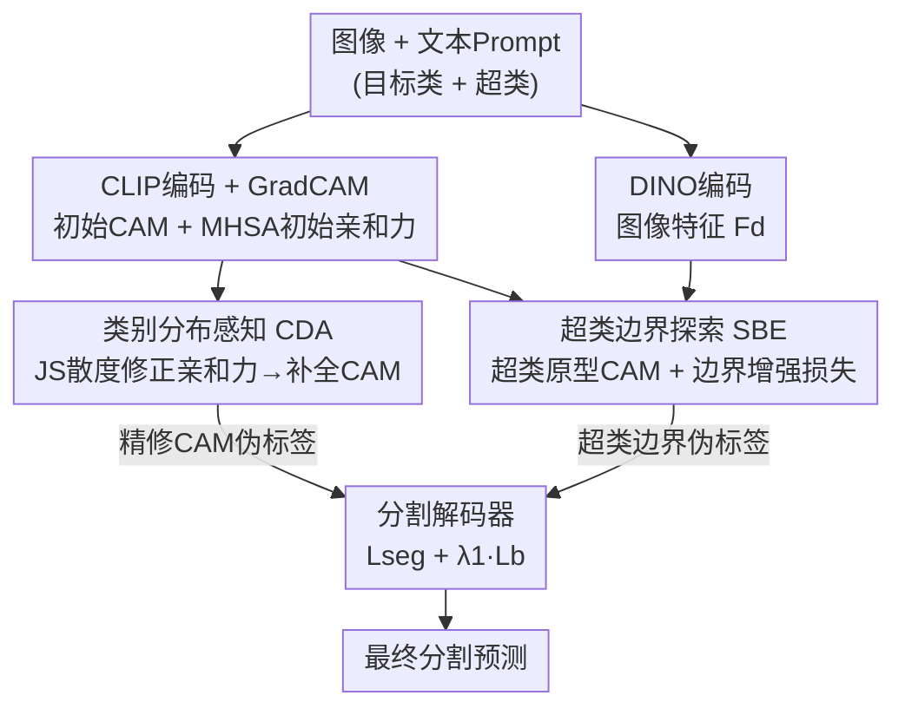

# Leveraging Class Distributions in CLIP for Weakly Supervised Semantic Segmentation

**会议**: CVPR 2026  
**论文**: [CVF Open Access](https://openaccess.thecvf.com/content/CVPR2026/html/Yang_Leveraging_Class_Distributions_in_CLIP_for_Weakly_Supervised_Semantic_Segmentation_CVPR_2026_paper.html)  
**代码**: 有（论文称 "Code is available here"，未给具体地址）  
**领域**: 语义分割 / 弱监督 / CLIP  
**关键词**: 弱监督语义分割, CLIP, 类激活图CAM, 类别分布, JS散度

## 一句话总结
针对 CLIP 生成的 CAM 因 MHSA 亲和力不准而"激活不全"的问题，CD-CLIP 发现"同类 patch 在全部类别上的概率分布高度相似"，用 JS 散度构造分布感知亲和力（CDA）来补全前景，再用 DINO 的超类原型 CAM 提供边界监督（SBE）抑制过激活，单阶段在 PASCAL VOC 拿到 82.5% mIoU、MS COCO 拿到 54.1% mIoU。

## 研究背景与动机
**领域现状**：图像级弱监督语义分割（WSSS）只用"图里有哪些类"这种廉价标注，核心套路是先用分类网络产生类激活图（CAM）当伪标签，再训练分割解码器。近年主流是借 CLIP 这种在 4 亿图文对上预训练的模型来生成 CAM，并用 ViT 编码器里的多头自注意力（MHSA）权重构造 patch 间的语义亲和力，对初始 CAM 做亲和力扩散式的精修，把激活从"最具判别性的小块"扩展到完整物体。

**现有痛点**：作者指出 MHSA 导出的亲和力经常建立不出可靠的"类内"关系——同属一个目标类的两个 patch，亲和力却把它们判为弱相关，导致 CAM 对目标类**激活不全**（under-activation），典型如"人"的头部一直点不亮。亲和力扩散的前提是"相似 patch 强连接"，可这个相似度本身就不准，精修反而把错误关系放大。

**核心矛盾**：以往只盯着"目标类那一个通道的激活值"判断两个 patch 是否同类，可同一类内的两个 patch 在目标类上的响应可以差很多（一个高一个低），单看目标类激活根本判不准类内关系。

**切入角度**：作者做了一个关键观察（图 1b）：虽然前景两个 patch 对目标类响应分歧很大，但它们在**所有类别上的整条概率分布**却高度相似——也就是说，"这个 patch 像 person、有点像 motorbike、不像 boat……"这条完整分布，比单个 person 分数更能刻画语义身份。于是用 Jensen-Shannon 散度衡量两个 patch 的分布相似度，就能可靠地找出类内关系。

**核心 idea**：用"跨全部类别的分布相似度"代替"目标类激活/MHSA 亲和力"来判定 patch 间关系，从而修正亲和力、补全 CAM；同时为补全带来的边界过激活，额外引入 DINO 超类原型提供边界监督。

## 方法详解

### 整体框架
CD-CLIP 是一个**单阶段**框架：图像同时送进冻结的 CLIP 图像编码器和 DINOv2 编码器；文本侧把"目标类 + 设计的超类（如 vehicle、animal）"的 prompt 送进 CLIP 文本编码器。基于图文相似度先产出初始 CAM $M_{init}^c$（含目标类 CAM 和超类 CAM）和 MHSA 初始亲和力 $A_{init}$。随后两个模块接力：**CDA 模块**用类别分布相似度把 $A_{init}$ 修正成更准的 CDA 亲和力 $A_d$，再用它扩散精修 CAM、补全前景；但补全会在不同目标类交界处带来边界过激活，于是 **SBE 模块**借 DINO 特征生成"超类原型 CAM"，只在含多超类的预测上用边界增强损失提供精确边界监督。最终解码器输出分割，由"精修 CAM 的伪标签 + 超类原型 CAM 的边界伪标签"共同监督。

### 关键设计

**1. 类别分布感知亲和力 CDA：用全类别分布相似度修正 MHSA 的错误连接**

这一设计直击"MHSA 亲和力建不出可靠类内关系、导致 CAM 激活不全"的痛点。它不再用目标类的单点激活，而是为每个 patch 估出一条**完整的类别分布**再比相似度。具体地，先算图像特征 $F$ 与全部文本特征 $T_{all}\in\mathbb{R}^{|C+N|\times d}$（目标类 + 超类）的注意力图 $S_a=\mathrm{Min\text{-}max}(\mathrm{CosSim}(F,T_{all}))$；引入超类是为了让分布表示更丰富。然后用 JS 散度衡量任意两 patch 分布的相似度，得到分布相似图：

$$S_d=\frac{1-D_{JS}\big(\mathrm{Softmax}(S_a)\,\|\,\mathrm{Softmax}(S_a)^{\mathrm{T}}\big)}{\tau}$$

其中 Softmax 把注意力转成类别分布概率，$D_{JS}$ 是有限且对称的 JS 散度（分布越像散度越小），$\tau$ 是控制软硬的温度。由于同类 patch 分布高度相似，用 $S_d$ 来"放大同类、压低异类"关系即可修正初始亲和力：$A_d=\mathrm{Softmax}(S_d)\cdot A_{init}$。最后用修正后的亲和力迭代扩散精修 CAM：$M_{re}^c=M_{init}^c\cdot (A_d)^t$（$t$ 为迭代次数）。这样有效的根本原因在于：分布相似度对"同一类内部目标类响应高低不一"这种情况鲁棒——只要两个 patch 在所有类别上"长得像"，就被判为强相关，从而把头部、肢体等弱激活区域一并点亮，解决欠激活。

**2. 超类边界探索 SBE：借 DINO 超类原型 CAM 给边界做精确监督**

CDA 能建好类内关系，却仍可能在**不同目标类交界处过激活**——因为它综合考虑了多类间关系，交界处容易"糊"，给分割监督带来不准的边界。SBE 用 DINO 来补这一刀：DINO 特征对"超类级区域分割"表征能力更强，但它本身不带类别定位，所以先用 CLIP 推出的超类 CAM $M_s^n$ 当类别掩码，在 DINO 特征 $F_d$ 上做类平均池化得到超类原型 $f_s^n=\mathrm{CAP}(M_s^n\odot F_d)$；再用原型与每个 DINO patch 算相似度生成超类原型 CAM $M_p^n=\mathrm{ReLU}(\mathrm{CosSim}(f_s^n,F_d))$。相比初始 CAM，$M_p^n$ 带上 DINO 知识后超类之间的边界激活更准。这个原型 CAM 进而转成边界伪标签 $Y_s$，专门监督超类交界，把过激活压回去。

**3. 按超类数选择性边界监督：只在真有跨超类边界的预测上算损失**

如果对所有图都强加边界损失会引入噪声——单类图里根本没有"跨超类边界"可供监督。于是 SBE 先根据类别标签判断每个预测里出现了哪些超类（如 'cat'→'animal'），得到当前预测的超类集合 $C_p$，只有当 $|C_p|\ge 2$（确实存在跨超类交界）时才用 Dice 损失监督，否则置零：

$$\mathcal{L}_b=\begin{cases}\mathrm{Dice}(P,Y_s),&|C_p|\ge 2\\[2pt]0,&\text{otherwise}\end{cases}$$

这样既节省算力又避免在无边界图上瞎监督。消融（表 4）显示：只在单类图（$|C_p|=1$）上加 $L_b$ 只涨 0.2%，而只在多超类图（$|C_p|\ge 2$）上加能涨到 81.6%，证明"挑对监督对象"是这个损失奏效的关键。

### 损失函数 / 训练策略
总目标为分割损失加权边界增强损失 $\mathcal{L}=\mathcal{L}_{seg}+\lambda_1\mathcal{L}_b$，$\lambda_1=0.6$。CLIP 用冻结的 ViT-Base-16、DINO 用冻结的 DINOv2-ViT-Base-14，解码器沿用 WeCLIP 的轻量 transformer 结构；AdamW 优化，学习率 2e-5、weight decay 0.01；VOC 图像裁到 320×320（DINO 端 308×308），batch 4、30k 步，COCO batch 8、80k 步；推理时叠加 DenseCRF 后处理与 {1.0, 1.5} 多尺度。

## 实验关键数据

### 主实验
PASCAL VOC 2012：单阶段刷到 82.5% / 82.4% mIoU（val/test），比基线 WeCLIP 高 6.1% / 5.2%，并大幅超过依赖额外后处理的多阶段方法。

| 数据集 | 方法 | 类型 | Val | Test |
|--------|------|------|-----|------|
| VOC 2012 | WeCLIP（基线，CVPR'24） | 单阶段 | 76.4 | 77.2 |
| VOC 2012 | ExCEL（CVPR'25） | 单阶段 | 78.4 | 78.5 |
| VOC 2012 | S2C（CVPR'24, SAM） | 多阶段 | 78.2 | 77.5 |
| VOC 2012 | **CD-CLIP（本文）** | 单阶段 | **82.5** | **82.4** |
| COCO 2014 | WeCLIP（CVPR'24） | 单阶段 | 47.1 | — |
| COCO 2014 | ExCEL（CVPR'25） | 单阶段 | 50.3 | — |
| COCO 2014 | **CD-CLIP（本文）** | 单阶段 | **54.1** | — |

MS COCO 2014 上 54.1% mIoU，超 ExCEL 3.8%、超 SeCo 7.4%，在复杂多类场景同样领先。

### 消融实验
模块级消融（表 3，'M'=CAM 的 mIoU，'Seg.'=分割 mIoU），其中 CAA/RFM 是另外两种亲和力模块作对照：

| 配置 | CAM (M) | Seg. | 说明 |
|------|---------|------|------|
| 无 CAM 精修（#0） | 70.1 | 68.8 | 基线 |
| CAA（#1） | 73.2 | 72.8 | 带区域约束掩码的亲和力 |
| RFM（#2） | 77.4 | 76.1 | WeCLIP 的精修模块 |
| CDA（#3） | 80.3 | 80.2 | 单独 CDA，CAM 提升最大 |
| CDA + CAA（#4） | 76.8 | 76.4 | CAA 含区域掩码，叠加反而受限 |
| CDA + RFM（#5） | 80.1 | 80.2 | 与 RFM 协同 |
| CDA + SBE（#6 完整） | 80.8 | 81.6 | 加 SBE 后分割再升 |

边界损失监督对象消融（表 4）：不加 $L_b$ 为 80.2；只在单类图加（$|C_p|=1$）仅 80.4（+0.2）；只在多超类图加（$|C_p|\ge2$）达 81.6；同时加反而回落到 81.4。

### 关键发现
- **贡献最大的是 CDA 模块**：单独用就把 CAM 从 70.1 拉到 80.3、分割到 80.2，远超 CAA（73.2）和 RFM（77.4），验证"全类别分布相似度"确实比目标类激活/普通亲和力更能补全前景。
- **SBE 主要补分割而非 CAM**：#3→#6 的 CAM 只从 80.3 微动到 80.8，但分割从 80.2 升到 81.6，说明 SBE 价值在"修边界监督"而非"扩激活"，与其设计定位一致。
- **边界监督要挑对图**：只对真含跨超类边界的图（$|C_p|\ge2$）加损失才有效，对单类图加几乎没用甚至拖累，印证选择性监督是关键。
- **超类集要"恰到好处"**：5 类的 $D_s$（animal/vehicle/household item/furniture/person）最佳（80.8/81.6）；4 类的 $D_{s2}$ 太泛（80.4/81.1）、7 类的 $D_{s3}$ 引入了像 'kitchenware' 这类与目标类对不齐的超类（80.2/81.0），都更差。$\lambda_1=0.6$ 时分割最优（81.6）。

## 亮点与洞察
- **"看整条分布而非单点激活"是核心洞察**：图 1 的反例很有说服力——同类 patch 目标类分数差很多，但全类别分布几乎重合；把判据从"一个数"换成"一条分布"，再配 JS 散度（对称、有界）做相似度，直接绕开了 MHSA 亲和力不可靠的老问题。这种"用边缘分布相似性判同类"的思路可迁移到任意用注意力/亲和力做扩散精修的弱监督任务。
- **CDA 与 SBE 是"一进一退"的互补设计**：CDA 大胆补全前景（可能过激活），SBE 用异源的 DINO 知识专门收边界，分工清晰；用一个模型的强项（DINO 的区域结构）去补另一个模型的短板（CLIP 边界糊），是很实用的跨模型互补范式。
- **超类既喂 CDA 又喂 SBE**：同一套超类集在 CDA 里"丰富分布表示"、在 SBE 里"引导原型 CAM 生成"，一份设计两处复用，且消融证明超类粒度需与目标类对齐，给"如何设计语义层级"提供了具体经验。

## 局限与展望
- **依赖人工设计的超类集**：$D_s$ 需要按数据集手工划定（VOC 用 5 类、COCO 见附录），且消融显示粒度敏感——换数据集/开放词表时如何自动构造合适超类是开放问题。
- **多 backbone 叠加的成本**：同时跑冻结 CLIP + DINOv2 两个 ViT，推理还叠 DenseCRF 和多尺度，相比纯单 backbone 方法计算与显存开销更高，论文未报告效率对比。
- **作者展望**：未来探索更多"关系用于 CAM 精修"的方式，并验证其他 backbone 的收益。
- **自己的观察**：边界监督只对 $|C_p|\ge2$ 的图生效，对大量单类图 SBE 几乎不贡献；在以单物体为主的场景里 SBE 的增益可能有限。

## 相关工作与启发
- **vs WeCLIP（基线）**: WeCLIP 用冻结 CLIP backbone + RFM 精修模块做单阶段 WSSS；本文换掉精修核心（用 CDA 的分布亲和力替代 MHSA 亲和力）并额外引入 DINO 超类边界监督，在 VOC 上把 76.4 提到 82.5（+6.1）。
- **vs CLIP-ES**: CLIP-ES 用 CAM 当类掩码导出类间亲和力、无需额外训练；本文进一步挖掘 CLIP 里的"全类别分布"来建更精确的关系，并把它系统用于亲和力修正。
- **vs ExCEL（CVPR'25）**: ExCEL 借大语言模型增强单阶段 WSSS；本文不靠 LLM，仅靠分布感知 + DINO 边界监督就反超它（VOC +4.1、COCO +3.8），说明"用对几何/分布先验"未必逊于"堆大模型"。
- **vs 多阶段方法（CPAL/PSDPM/S2C）**: 多阶段需先训分类网再训分割网、还靠 IRN/PSA 等后处理；本文单阶段并行训练即超过它们（如超 CPAL 8.0%/7.7%），结构更简洁。

## 评分
- 新颖性: ⭐⭐⭐⭐ "全类别分布相似度判同类"的观察新颖且有图证据，CDA/SBE 组合自然但非颠覆性框架。
- 实验充分度: ⭐⭐⭐⭐ 双数据集 SOTA + 模块/损失对象/超类集/超参四组消融较扎实，但缺效率与开放词表分析。
- 写作质量: ⭐⭐⭐⭐ 动机用反例图讲得清楚，公式与流程完整，个别符号略密。
- 价值: ⭐⭐⭐⭐ 单阶段刷到 VOC 82.5/COCO 54.1 的强结果，分布亲和力思路对 CLIP 类 WSSS 有直接借鉴价值。

<!-- RELATED:START -->

## 相关论文

- [\[CVPR 2026\] Beyond Text: Visual Description Assembly by Probabilistic Model for CLIP-based Weakly Supervised Semantic Segmentation](beyond_text_visual_description_assembly_by_probabilistic_model_for_clip-based_we.md)
- [\[CVPR 2026\] Frequency-Aware Affinity for Weakly Supervised Semantic Segmentation](frequency-aware_affinity_for_weakly_supervised_semantic_segmentation.md)
- [\[AAAI 2026\] SSR: Semantic and Spatial Rectification for CLIP-based Weakly Supervised Segmentation](../../AAAI2026/segmentation/ssr_semantic_and_spatial_rectification_for_clip-based_weakly_supervised_segmenta.md)
- [\[CVPR 2025\] Exploring CLIP's Dense Knowledge for Weakly Supervised Semantic Segmentation](../../CVPR2025/segmentation/exploring_clips_dense_knowledge_for_weakly_supervised_semantic_segmentation.md)
- [\[CVPR 2026\] Hierarchical Action Learning for Weakly-Supervised Action Segmentation](hierarchical_action_learning_for_weakly-supervised_action_segmentation.md)

<!-- RELATED:END -->
