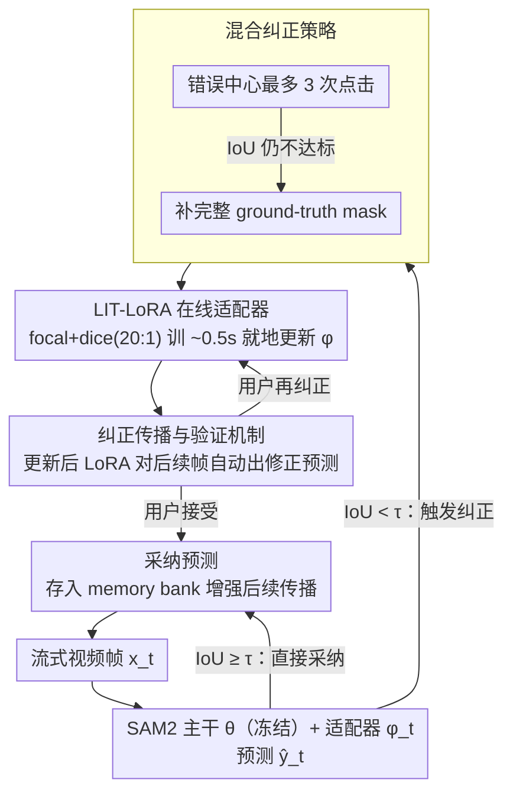

# Live Interactive Training for Video Segmentation

**会议**: CVPR 2026  
**arXiv**: [2603.26929](https://arxiv.org/abs/2603.26929)  
**代码**: [项目页面](https://youngxinyu1802.github.io/projects/LIT/)  
**领域**: 分割 / 视频目标分割  
**关键词**: 交互式视频分割, 在线学习, LoRA适配, SAM2, 用户反馈驱动

## 一句话总结

LIT (Live Interactive Training) 提出了一种让交互式视觉系统（如SAM2）在推理时从用户纠正中在线学习的框架，其轻量实现LIT-LoRA通过实时更新LoRA模块将用户反馈泛化到后续帧，在挑战性VOS基准上减少18-34%用户纠正次数，训练开销仅约0.5秒。

## 研究背景与动机

以SAM2为代表的交互式视频分割模型在复杂场景（遮挡、物体分离、伪装等）中仍需大量用户干预。核心问题在于：**SAM2将用户纠正仅作为即时修复信号或存入记忆库，但模型参数保持冻结，无法真正从这些交互中学习和泛化**。这导致用户陷入反复纠正相同类型错误的低效循环——例如分割分离中的卡片可能需要14次纠正。

理想情况下，系统应当从初始纠正中学习，自主处理后续类似挑战。核心矛盾是：用户提供的纠正信号蕴含丰富的领域适配信息，但现有模型仅将其用于即时预测而非模型改进。

本文的核心idea是：将参数高效微调（PEFT）与在线学习结合，在推理时实时训练轻量级LoRA模块以内化用户反馈，使纠正模式泛化到同一视频的后续帧。这是一个**用户反馈驱动的在线学习范式**——在推理时进行，以人类纠正（而非伪标签）作为监督信号。

## 方法详解

### 整体框架

LIT 要解决的事很具体：让 SAM2 这类交互式分割模型在标注一段视频时，不要把用户的每次纠正都当成"用完即弃"的即时修补，而是边推理边把这些纠正学进一组轻量参数里，让后面遇到同类错误时自己就能改对。为此它把整段视频看成流式输入 $\{x_t\}_{t=1}^T$：主干参数 $\theta$ 始终冻结，只挂一组可训练的轻量适配器 $\phi_t$，模型预测写成 $\hat{y}_t = f_{\theta, \phi_t}(x_t)$。一旦用户对第 $t$ 帧给出纠正 $y_t^*$，适配器就地做一步梯度下降 $\phi_{t+1} \leftarrow \phi_t - \eta \nabla_{\phi_t} \mathcal{L}(f_{\theta,\phi_t}(x_t), y_t^*)$，更新后的 $\phi_{t+1}$ 立刻作用于后续帧。适配器在同一段视频内持续累积纠正，换到新视频时重新初始化——这样既保留了对当前目标的领域适配，又不会把上一段视频的偏置带过来。

### 关键设计

**1. 混合纠正策略：先轻点，不行再上完整 mask**

整个在线学习闭环的起点是一次错误触发——某帧 IoU 低于阈值 $\tau_{\text{IoU}}$ 时，系统才向用户要纠正。触发后先走轻量路径：在错误中心给最多 3 次点击做局部修复；如果点完 IoU 仍不达标，才退而提供完整的 ground-truth mask。点击适合快速修小毛病、代价低，完整 mask 则用来啃那些复杂错误，两级递进既避免了一上来就给整张 mask 的浪费，也保证难帧最终能被纠对——这也贴近真实标注时人的习惯。这一步决定了喂给后面适配器的监督信号是什么。

**2. LIT-LoRA 在线适配器：用 35K 参数把"即时修补"变成"在线学习"**

拿到这帧的纠正后，关键问题是怎么让模型真正记住它——SAM2 把纠正存进 memory bank，但参数一动不动，所以它永远学不会，用户只能对同一类错误反复点。LIT 的做法是向 SAM2 mask decoder 的每一层注入一个低秩残差——把原投影 $W_0$ 改成 $W = W_0 + \Delta W$，其中 $\Delta W = BA$，$A \in \mathbb{R}^{r \times d}$、$B \in \mathbb{R}^{d \times r}$、rank=4，只新增约 35K 可训练参数。每来一次纠正，就用 focal loss + dice loss（权重比 20:1）在这一帧上训练约 0.5 秒，把这帧的纠正信号灌进 $A$、$B$，更新后的适配器立刻作用于后续帧。之所以只动 mask decoder、且只用低秩残差，是因为视觉编码器的通用特征不能破坏，而 LoRA 极小的参数量让它能在 0.5 秒内收敛、几乎不增加交互延迟——既学到了东西，又不会因为微调整个 decoder 而过拟合崩掉（消融里直接微调 decoder 反而恶化，见下文）。

**3. 纠正传播与验证机制：让一次纠正自己滚到后面的帧上去**

光会学还不够，得让学到的东西真正替用户省事。当后续某帧 $F_{t'}$ 又出错时，系统先不打扰用户，而是用已经更新过的 LoRA 直接生成一版修正预测 $M_{t'}^{\mathcal{A}}$ 给用户看。如果用户没再纠正（默认接受），这版预测就被采纳，并存进 memory bank 去增强更后面的传播；如果用户看出新错误又给了纠正，LoRA 就在这帧上再做一次增量更新。整个过程是"纠正 → 学习 → 用户验证 → 接受 / 再纠正"的闭环：每一轮要么帮用户省掉一次手工纠正，要么把模型能力再推进一点，重复错误于是被逐步磨平，而不是像原来那样一帧帧重来。

### 一个完整示例：标注一段"卡片分离"视频

拿原文提到的卡片分离场景走一遍（数字为示意，体现机制流转 ⚠️ 以原文为准）。一叠卡片在视频里逐渐散开，SAM2 原本要对这类分离反复纠正约 14 次。

- **第 5 帧**：卡片开始分离，IoU 跌破 $\tau_{\text{IoU}}=0.5$，触发纠正。用户在裂开处点 3 下；3 击后 IoU 仍不够，于是补一张完整 mask。LIT-LoRA 拿这帧的纠正训练 0.5 秒，$A$、$B$ 里第一次写进了"分离边界该怎么切"的信息。
- **第 12 帧**：又一张卡片分出来。这次系统先不问用户，用更新后的 LoRA 直接出一版 $M_{12}^{\mathcal{A}}$——边界已经切对。用户没纠正，预测被采纳并存进 memory bank。这一帧本来要花的纠正次数省掉了。
- **第 20 帧**：出现一个 LoRA 还没见过的新错误（比如卡片翻转）。用户给一次纠正，LoRA 增量更新，把这类情况也学进去。

一段视频走下来，原本需要的十几次纠正被压到个位数——长尾里那些"反复纠同一类错"的预算正是被这个累积学习吃掉的。

### 损失函数 / 训练策略

在线训练损失：$\mathcal{L} = \lambda_{\text{focal}} \mathcal{L}_{\text{focal}} + \lambda_{\text{dice}} \mathcal{L}_{\text{dice}}$

LoRA配置：rank=4, $\alpha=4$, dropout=0.1, 学习率 $1 \times 10^{-4}$，每次纠正训练40 epoch（with early stopping）。

## 实验关键数据

### 主实验

**用户纠正次数减少 ($\tau_{\text{IoU}}=0.5$)**:

| 数据集 | 原始 | LIT | 减少比例 |
|--------|------|-----|----------|
| VOST | 27.43 | 18.24 | ↓33.51% |
| LVOSv2 | 33.59 | 14.83 | ↓23.35% |
| MOSEv2 | 31.48 | 22.49 | ↓18.22% |
| SA-V Val | 20.66 | 12.90 | ↓18.16% |
| SA-V Test | 20.90 | 13.09 | ↓22.35% |

**标注时间减少 ($\tau_{\text{IoU}}=0.5$)**:

| 数据集 | 原始(min) | LIT(min) | 减少比例 |
|--------|-----------|----------|----------|
| VOST | 18.42 | 12.91 | ↓29.94% |
| LVOSv2 | 14.83 | 11.86 | ↓20.03% |

**跨模型泛化 (VOST)**:

| 模型 | 原始 | LIT | 减少 |
|------|------|-----|------|
| DAM4SAM | 34.60 | 22.46 | ↓35.09% |
| SAMURAI | 26.96 | 21.23 | ↓21.25% |

**跨任务泛化 (CLIP图像分类)**:

| 数据集 | 原始 | LIT | 减少 |
|--------|------|-----|------|
| CUB-200-2011 | 13.04 | 8.53 | ↓34.55% |
| Stanford Cars | 13.38 | 7.57 | ↓43.40% |
| SUN397 | 13.92 | 8.95 | ↓35.70% |

### 消融实验

| 配置 | 纠正次数 | 参数量 | 说明 |
|------|---------|--------|------|
| 原始(无适配) | 27.43 | — | 基线 |
| 替换原始decoder | 32.47 | 35K | 直接微调decoder反而恶化 |
| LoRA(无持续学习) | 21.43 | 35K | 仅首次纠正训练不足 |
| LIT-FT(全decoder) | 17.46 | 3.3M | 更好但参数100倍 |
| LIT-LoRA(3个LoRA) | 17.87 | 105K | 稍好但增加用户认知负担 |
| **LIT-LoRA(ours)** | **18.24** | **35K** | 最佳效率-效果平衡 |

### 关键发现

- 纠正次数呈长尾分布：少数挑战性视频消耗大部分交互预算，这恰好是LIT-LoRA收益最大的场景
- 直接微调原始decoder会过拟合并破坏稳定表示（32.47 > 27.43），确认了LoRA的必要性
- 持续学习（每次纠正都更新）比仅首次纠正训练效果显著更好（18.24 vs 21.43）
- 用户研究（6人×7视频）确认真实场景下纠正次数减少41.92%、时间减少23.04%

## 亮点与洞察

- 核心洞察极有实用价值：现有交互式系统浪费了用户反馈的泛化潜力，仅将其作为即时修复
- 框架设计非常通用——模型无关（SAM2/DAM4SAM/SAMURAI）、任务无关（VOS/图像分类），说明在线适配的普适性
- 35K参数+0.5秒训练的极轻开销使其真正可在实际标注工作流中部署
- 对SAM2 predicted IoU的深入分析揭示了其作为自动质量估计器的不可靠性，是有价值的发现

## 局限与展望

- 依赖用户监控来检测错误，SAM2缺乏可靠的内部质量估计器（predicted IoU与ground truth IoU不对齐）
- 实验主要使用合成用户纠正，真实用户可能有不同的纠正策略和行为模式
- 需要基础模型本身具有较强泛化能力，LoRA适配才能快速收敛
- 对抗性场景（如物体严重伪装、极小目标、剧烈变形）中LoRA适配器的容量可能不足

## 相关工作与启发

- **vs SAM2原生交互**: SAM2将用户纠正存入memory bank但不更新参数，LIT-LoRA通过参数更新实现真正的学习
- **vs SAM2Long/SAMURAI**: 这些方法改进memory设计或引入运动线索，但不利用用户反馈进行适配；LIT-LoRA作为正交方案可叠加使用
- **vs OSVOS/OnAVOS**: OSVOS在第一帧fine-tune（TTT范式），OnAVOS持续用伪标签适配（CTTA范式），LIT-LoRA用真实用户反馈持续适配更可靠
- **启发**: "推理时从用户反馈学习"的范式可推广到所有交互式AI系统，如交互式图像编辑、对话式AI

## 评分

- 新颖性: ⭐⭐⭐⭐ 将在线学习与用户交互结合的思路清晰且有说服力，但核心技术（LoRA+在线微调）不算全新
- 实验充分度: ⭐⭐⭐⭐⭐ 五个VOS数据集+三个分类数据集+三个模型+用户研究+详细消融，非常全面
- 写作质量: ⭐⭐⭐⭐⭐ 问题定义精准、动机说明清晰、实验设计严谨，补充材料详尽
- 价值: ⭐⭐⭐⭐ 对标注工作流有直接实用价值（18-34%纠正减少意味着节省数小时标注时间），框架通用性强

<!-- RELATED:START -->

## 相关论文

- [\[CVPR 2026\] INSID3: Training-Free In-Context Segmentation with DINOv3](insid3_training-free_in-context_segmentation_with_dinov3.md)
- [\[ICLR 2026\] VIRTUE: Visual-Interactive Text-Image Universal Embedder](../../ICLR2026/segmentation/virtue_visual-interactive_text-image_universal_embedder.md)
- [\[CVPR 2026\] Direct Segmentation without Logits Optimization for Training-Free Open-Vocabulary Semantic Segmentation](direct_segmentation_without_logits_optimization_for_training-free_open-vocabular.md)
- [\[CVPR 2026\] PEARL: Geometry Aligns Semantics for Training-Free Open-Vocabulary Semantic Segmentation](pearl_geometry_aligns_semantics_for_training-free_open-vocabulary_semantic_segme.md)
- [\[CVPR 2026\] RobotSeg: A Model and Dataset for Segmenting Robots in Image and Video](robotseg_a_model_and_dataset_for_segmenting_robots_in_image_and_video.md)

<!-- RELATED:END -->
