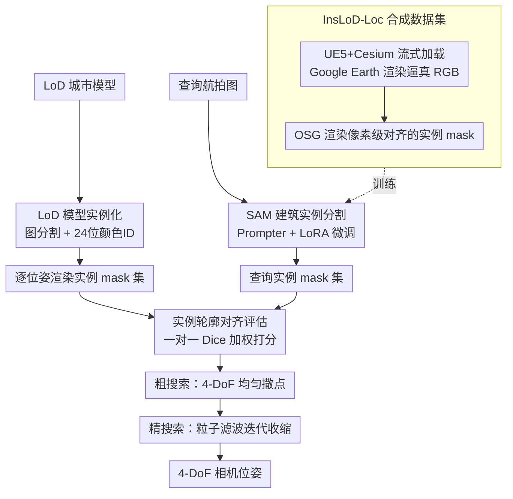

# LoD-Loc v3: Generalized Aerial Localization in Dense Cities using Instance Silhouette Alignment

**会议**: CVPR 2026  
**arXiv**: [2603.19609](https://arxiv.org/abs/2603.19609)  
**代码**: [项目主页](https://nudt-sawlab.github.io/LoD-Locv3/)  
**领域**: 分割 / 无人机定位  
**关键词**: 无人机定位, LoD城市模型, 实例分割, 合成数据, 轮廓对齐

## 一句话总结
本文提出LoD-Loc v3，通过构建10万图像的大规模合成实例分割数据集InsLoD-Loc和将定位范式从语义轮廓对齐升级为实例轮廓对齐，解决了基于LoD城市模型的无人机定位中跨场景泛化差和密集城市歧义两大痛点，在Tokyo-LoDv3密集场景上比SOTA的(2m,2°)精度提升2000%。

## 研究背景与动机
1. **领域现状**：UAV视觉定位的主流方法依赖高精度3D重建（SfM/摄影测量），虽然精度高但模型构建和维护成本大，数据量庞大，且存在隐私和安全问题。基于LoD（Level-of-Detail）城市模型的定位方法是更轻量的替代方案——LoD模型只保留建筑几何结构，遵循CityGML标准，已在美国、中国、日本、德国等国家大规模建设。
2. **现有痛点**：LoD-Loc v2通过将图像中的建筑语义分割轮廓与LoD模型渲染的轮廓对齐来定位，但存在两个关键问题：(1) **泛化差**——在一个城市训练的模型部署到另一个城市时性能严重下降；(2) **密集场景歧义**——在密集城市中，多栋建筑的语义轮廓合并为一大块，不同pose渲染出的语义mask高度相似，导致无法区分。
3. **核心矛盾**：语义分割只区分"建筑"和"背景"，在密集建筑区域所有建筑连成一片，丧失了区分性信息。而不同pose下建筑的实例级排列是唯一的。
4. **本文目标** (1) 通过大规模合成数据解决跨场景泛化问题；(2) 通过实例级对齐解决密集场景的pose歧义问题。
5. **切入角度**：城市中的定位本质上是一个实例对齐过程——需要将图像中每栋可见建筑与LoD模型中的对应建筑实例匹配。
6. **核心 idea**：用实例分割替代语义分割来提取建筑轮廓，并用Dice系数进行实例级一对一匹配来评估pose假设。

## 方法详解

### 整体框架
LoD-Loc v3 要解决的是：给一张无人机航拍图，在只有几何外壳的 LoD 城市模型里反推出相机的 4-DoF 位姿（重力方向已知，求经纬度/高度/航向）。整条 pipeline 分三步走：先把 LoD 模型"实例化"，给每栋楼贴上唯一颜色 ID，这样任意位姿渲染出来都是一张带实例区分的彩色 mask；再用一个 SAM 改造来的分割器，把查询图像里的每栋建筑各自抠成一个独立 mask；最后在 4-DoF 搜索空间里逐个假设位姿、把渲染实例与图像实例做一对一轮廓匹配打分，分高者即为定位结果。位姿搜索本身是粗到精两段——粗阶段在整个位姿空间均匀撒点，精阶段用粒子滤波围着高分区域迭代收缩。

整篇的核心改动其实只有一句话：把 v2 的"语义轮廓对齐"换成"实例轮廓对齐"。语义对齐只分"建筑/背景"，密集城区里楼连成一片，不同位姿渲染出来的 mask 几乎长一样，根本分不开；实例对齐把每栋楼当成独立个体，它们之间的相对排列对每个位姿都是唯一的，歧义自然就消了。

### 关键设计

**1. InsLoD-Loc 合成数据集：用 10 万张多样化合成图像换来跨城市零样本泛化**

v2 只在单个城市训练，换个城市部署就崩——根子是真实标注数据太贵、覆盖面太窄。本文干脆绕开真实数据，搭了一条两段式合成 pipeline：先在 UE5 里用 Cesium 插件流式加载 Google Earth 的 Photorealistic 3D Tileset，配 AirSim 插件渲染出逼真的 RGB 航拍图；再从公开 LoD 数据源取来同一区域的 LoD 模型，统一坐标系后用 OSG 渲染引擎渲出与 RGB 严格对齐的实例 mask。RGB 和 mask 分属两个引擎但像素级对齐，这正是数据可信的关键。最终数据覆盖 6 个国家 40 个飞行区域、3 种相机配置（不同 FOV/分辨率/采样策略）、200–500m 高度，用地类型横跨商业/工业/住宅/教育/医疗/郊区。多样性足够大，模型才能在没见过的城市上零样本工作。

**2. LoD 模型实例化：给每栋建筑一个唯一身份，让渲染天生带实例**

语义分割的输出只有"建筑 vs 非建筑"的二值 mask，一对一匹配无从谈起，所以第一步得先让 LoD 模型本身能区分出每栋楼。做法是把无纹理的 LoD 模型解析成图 $G=(V,E,F)$，几何上每栋独立建筑 $B_i$ 恰好对应图里一个连通分量 $G_i$，于是通过图分割就能把整个模型切成 $M$ 个互不相交的建筑实例。每个实例分配一个唯一的 24 位 RGB 颜色 ID，渲染时颜色即身份，输出直接就是实例 mask，不需要任何额外的实例分割步骤。

**3. 基于 SAM 的建筑实例分割：让 SAM 学会自动认出每一栋楼**

渲染端有了实例 mask，查询图像端也得给出对应的逐栋 mask 才能配对。SAM 的零样本分割能力很强，但它需要人给 prompt、不会自动吐出"每栋建筑一个实例"的结果。本文在 SAM 上加了一个可学习的 Prompter Module：SAM 编码器先提取图像特征 $F_{embed}$，Prompter Module 从中预测出一批 prompt 嵌入，喂给 SAM 解码器，得到实例 mask 集合 $\mathcal{S}_q = \{M_q^j\}_{j=1}^N$。训练时冻结 SAM 编码器、只用 LoRA 微调，同时更新 Prompter Module 和解码器——既保住 SAM 的通用先验，又把它专门调成"自动建筑实例分割器"。

**4. 实例轮廓对齐评估：用一对一 Dice 匹配给每个位姿假设打分**

前三步都是为了把"语义对齐"真正落成"实例对齐"的打分函数。对查询图像里的每个预测实例 $M_q^j$，在该位姿假设渲染出的实例集 $\mathcal{S}_{hyp}$ 中找一个轮廓最贴合的对手（非对称匹配），记下最高 Dice 系数 $d_j^*$；整张图的 cost 就是所有实例匹配分数的加权和。权重给了两种取法——按分割置信度加权，强调模型更确信的实例；或按实例边界框面积加权，强调画面里更显眼的大楼：

$$c_{ins}^{(conf)} = \sum_j \frac{s_j}{\sum_i s_i}\, d_j^* \qquad c_{ins}^{(area)} = \sum_j \frac{A_j}{\sum_i A_i}\, d_j^*$$

正因为打分建立在每栋楼"逐一对上号"之上，哪怕两个位姿的整体建筑轮廓几乎重合，只要楼与楼的相对排列不同，匹配分数就会拉开差距，这就是密集城区里 v3 能把 v2 甩开的根本原因。

### 一个完整示例

设查询图像被分割器抠出 $N=6$ 栋建筑实例。粗阶段在 4-DoF 空间均匀撒下一批候选位姿，对每个候选用实例化的 LoD 模型渲染一张彩色 mask、得到若干渲染实例 $\mathcal{S}_{hyp}$；逐一拿 6 个查询实例去渲染实例里找最高 Dice 的搭档，加权求和得到该候选的 cost。语义对齐下这些候选的得分会挤成一团难分高下，而实例对齐因为还要求"排列对得上"，真值附近的候选分数明显冒头。粗阶段挑出高分区域后，精阶段在其周围用粒子滤波重采样、迭代收缩，位姿一步步逼近真值，直到落入 (2m, 2°) 这样的精度档。整个过程位姿候选从"满空间均匀撒点"逐步收敛到单一解，状态始终在变，这也是为什么把对齐粒度做细能直接换来定位精度的跃升。

### 损失函数 / 训练策略
实例分割器用多任务损失 $L = L_{rpn} + L_{roi}$ 训练：RPN 损失监督候选框生成，RoI 损失监督最终的分类/回归/mask 预测。优化器 AdamW，学习率 $2 \times 10^{-4}$，权重衰减 0.05，余弦退火，训练 20 个 epoch。SAM 编码器加载 ViT-Huge 预训练权重并以 LoRA 微调。

## 实验关键数据

### 主实验（UAVD4L-LoDv2数据集，定位成功率%）

| 方法 | 训练数据 | in-Traj 2m-2° | out-Traj 2m-2° | in-Traj 5m-5° | out-Traj 5m-5° |
|------|---------|--------------|---------------|--------------|---------------|
| MC-Loc(DINOv2) | - | 1.20 | 2.40 | 17.40 | 26.10 |
| LoD-Loc | 分布内† | 49.56 | 54.20 | 89.09 | 89.51 |
| LoD-Loc v2 | 分布内† | 93.70 | 97.90 | 99.50 | 100.00 |
| **LoD-Loc v3** | InsLoD-Loc | **97.60** | **97.40** | **99.70** | **99.40** |

### Tokyo-LoDv3密集场景测试

| 方法 | Grid 2m-2° | Grid 5m-5° | Seq 2m-2° | Seq 5m-5° |
|------|-----------|-----------|----------|----------|
| LoD-Loc v2† | 22.70 | 74.70 | 35.60 | 92.00 |
| **LoD-Loc v3** | **39.30** | **89.90** | **50.30** | **97.30** |

### 消融实验（语义 vs 实例对齐，相同InsLoD-Loc数据训练）

| 对齐方式 | Grid 2m-2°/3m-3°/5m-5° | Seq 2m-2°/3m-3°/5m-5° |
|---------|----------------------|---------------------|
| LoD-Loc v2(语义) | 19.60/39.40/72.10 | 21.50/47.80/89.00 |
| **LoD-Loc v3(实例)** | **38.10/65.40/86.40** | **49.80/79.90/95.80** |

### 关键发现
- **跨场景零样本超越分布内训练**：LoD-Loc v3仅在合成数据InsLoD-Loc上训练，在UAVD4L-LoDv2上超越了分布内训练的LoD-Loc v2。这证明了足够多样化的合成数据可以替代分布内真实数据
- **实例对齐是关键而非数据量**：消融实验中，在相同InsLoD-Loc数据上训练的语义版(19.60%)远不如实例版(38.10%)，确认性能提升来自实例级范式而非数据规模
- **密集场景改善巨大**：Tokyo-LoDv3密集场景中，LoD-Loc v2几乎失败，而v3实现了显著提升，验证了实例对齐在消歧中的核心作用
- **面积加权和置信度加权性能相近**：两种策略各有优劣，面积加权在Swiss-EPFL上稍好
- **CAD-Loc等特征匹配方法完全失败**：所有基于SIFT/SuperPoint/LoFTR的方法在LoD模型上都是0%成功率，因为LoD模型没有纹理

## 亮点与洞察
- **从语义到实例的范式转换**思路简洁但效果巨大：同样的数据、同样的定位框架，只是将轮廓匹配从语义级改为实例级，密集场景性能翻倍。这揭示了在歧义场景中"精细粒度匹配"的重要性
- **UE5+Google Earth+OSG的数据生成pipeline**具有很强的工程价值：RGB渲染和实例mask渲染分别使用不同引擎但精确对齐，可扩展到任何有LoD模型的城市
- **LoD城市模型作为定位基准地图的潜力**：相比SfM点云，LoD模型极其轻量（只有几何外壳），已在全球多国大规模构建，有巨大的实际应用前景

## 局限与展望
- 实例分割在极端恶劣天气下可能失败
- LoD模型的精度本身有限，部分区域存在对齐误差
- 粗-精两阶段搜索在超大搜索空间下效率有限
- 仅在城市场景验证，无法处理非建筑区域（如森林、农田）
- 依赖4-DoF简化假设（重力方向已知），完整6-DoF情况未探索

## 相关工作与启发
- **vs LoD-Loc v2**: 直接前身，v3在v2框架上将语义升级为实例，并用大规模合成数据解决泛化问题
- **vs LoD-Loc**: 最早版本用线框对齐，需要高细节LoD2/3模型，v2/v3降到LoD1
- **vs CAD-Loc/MC-Loc**: 基于特征匹配/对齐的方法在无纹理LoD模型上完全失败
- **vs SAM**: 本文展示了SAM在领域特定任务上的适配方法——加Prompter Module + LoRA微调

## 评分
- 新颖性: ⭐⭐⭐⭐ 语义→实例的范式转换虽非技术突破但洞察深刻，合成数据pipeline设计巧妙
- 实验充分度: ⭐⭐⭐⭐⭐ 三个数据集、7+种baseline、多种消融、密集场景专项测试
- 写作质量: ⭐⭐⭐⭐ 问题定义清晰，技术方案叙述完整
- 价值: ⭐⭐⭐⭐ 对全球范围UAV导航有实际应用潜力，方法可立即部署

<!-- RELATED:START -->

## 相关论文

- [\[CVPR 2026\] Phrase-Instance Alignment for Generalized Referring Segmentation](phrase-instance_alignment_for_generalized_referring_segmentation.md)
- [\[CVPR 2026\] GeoSURGE: Geo-localization using Semantic Fusion with Hierarchy of Geographic Embeddings](geosurge_geo-localization_using_semantic_fusion_with_hierarchy_of_geographic_emb.md)
- [\[CVPR 2026\] GeCo: Geometry-Consistent Regularization for Domain Generalized Semantic Segmentation](geco_geometry-consistent_regularization_for_domain_generalized_semantic_segmenta.md)
- [\[CVPR 2026\] SouPLe: Enhancing Audio-Visual Localization and Segmentation with Learnable Prompt Contexts](souple_enhancing_audio-visual_localization_and_segmentation_with_learnable_promp.md)
- [\[CVPR 2026\] Structure-Aware Representation Distillation for Tiny-Dense Object Segmentation](structure-aware_representation_distillation_for_tiny-dense_object_segmentation.md)

<!-- RELATED:END -->
