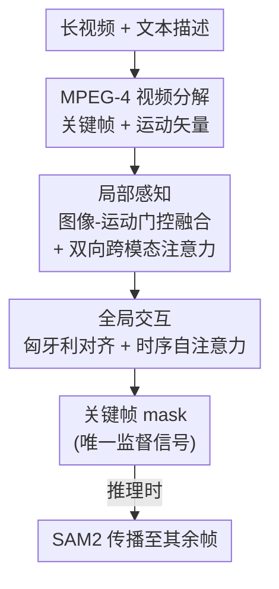

# Long-RVOS: A Comprehensive Benchmark for Long-term Referring Video Object Segmentation

**会议**: CVPR 2026  
**论文**: [CVF Open Access](https://openaccess.thecvf.com/content/CVPR2026/html/Liang_Long-RVOS_A_Comprehensive_Benchmark_for_Long-term_Referring_Video_Object_Segmentation_CVPR_2026_paper.html)  
**代码**: https://isee-laboratory.github.io/Long-RVOS （有）  
**领域**: 视频理解 / 语义分割  
**关键词**: 指代视频对象分割、长视频基准、时序一致性、运动信息、SAM2

## 一句话总结
针对现有指代视频对象分割（RVOS）数据集都只有几秒短片、目标几乎全程可见的问题，作者构建了首个分钟级长视频基准 Long-RVOS（2,193 段平均 60 秒、含频繁遮挡/消失重现/镜头切换的视频，附静态/动态/混合三类描述与 tIoU、vIoU 两个新指标），并提出运动增强的基线 ReferMo（用 MPEG-4 关键帧+运动矢量做"局部感知→全局交互"，只在关键帧上监督、推理时由 SAM2 传播），在长视频场景下显著超过 7 个 SOTA 方法。

## 研究背景与动机
**领域现状**：RVOS 的目标是给一句自然语言描述（如"那只跳下来的猫"），在整段视频里把对应物体识别、跟踪并分割出来。区别于需要首帧 mask 提示的半监督 VOS，RVOS 只靠文本定位目标，因此在视频编辑等应用里很有吸引力，近年又因多模态大模型和 SAM/SAM2 的出现而快速进展。

**现有痛点**：但所有主流数据集（A2D-Sentences、Ref-DAVIS17、Refer-YouTube-VOS、MeViS）都局限在几秒的短片段，目标在绝大多数帧里都清晰可见。短片掩盖了真实场景的两大难点：一是视频一长，干扰物随之增多，而很多描述（如"猫跳下来"那一瞬）只对应视频里极短的一个片段，模型要在海量时空信息里捞出关键帧段就变得极难；二是受显存限制，现有方法训练时每段只采 4∼8 帧、推理时却要吃全部帧，视频越长这个训练-推理鸿沟越明显。由于缺一个长视频基准，这些困难到底有多大一直说不清。

**核心矛盾**：评测指标也有缺陷。现有基准只是把逐帧的空间分割指标（$\mathcal{J}\&\mathcal{F}$）做帧平均。但真实视频里目标因遮挡和镜头限制并不每帧都在——一个稳健的 RVOS 模型不仅要在目标出现时分对，还要在目标缺席时输出空 mask。这种"时序一致性"恰恰被帧平均指标抹掉了。

**本文目标**：作者把问题拆成两件事——（1）造一个真正长、真正难、且能细粒度评估的数据集；（2）给出一个能在长视频里跑得动、跑得好的可行基线。

**切入角度**：长视频的冗余主要来自镜头内相邻帧高度相似，而这种冗余可以用"运动信息"高效刻画。于是与其逐帧塞进高分辨率画面，不如把视频拆成"关键帧 + 廉价运动矢量"的片段，用运动把局部时间窗口撑大，再跨片段做全局交互。

**核心 idea**：用"关键帧承载静态外观 + 运动矢量承载短时动态 + 跨片段交互承载长时依赖"的局部到全局结构，在几乎不增加训练成本的前提下把时间感受野从"多帧"扩展到"多片段"。

## 方法详解

### 整体框架
本文有两条主线：**基准 Long-RVOS** 与 **基线 ReferMo**。基准侧解决"用什么测、怎么测"——它绕开已有 VOS 数据集，从 TAO、VidOR、Ego-Exo4D 三个长视频源里筛选并重新标注，给每个目标配静态/动态/混合三类文本描述，并引入 tIoU、vIoU 两个时序指标。方法侧 ReferMo 解决"长视频里怎么算得动"——它先用 MPEG-4 把视频分解成若干"高分辨率关键帧 + 低分辨率运动矢量"的片段，对每个片段做局部的视觉-语言-运动融合提取目标，再把跨片段的目标特征对齐后做全局时序交互；关键是它**只在关键帧上预测 mask 并监督**，其余帧的 mask 在推理时交给预训练的 SAM2 传播，从而在训练成本和长时理解之间取得平衡。

### 关键设计

**1. Long-RVOS 数据集构建：从长视频源重标、用 SAM2 做检-改闭环**

现有 RVOS 数据集都建在短 VOS 数据集之上，而唯一的长视频 VOS 数据集 LVOS 只有 720 段、且多为单目标，无法支撑大规模多样的指代任务。作者因此绕开 VOS 数据集，直接从 TAO、VidOR、Ego-Exo4D 三个长视频源出发（TAO 本身又融合了 Charades、LaSOT、AVA 等多源），按三条规则筛选：视频时长 >20 秒、剔除背景/歧义/未知类别、每段至少含两个有效目标且至少一个目标不连续可见。初筛得到 3K+ 视频、8K+ 目标，人工质检后定稿 2,193 段视频、6,703 个目标。**Mask 标注**用 SAM2 把源数据集稀疏的 bounding box 当首帧提示来跟踪生成高质量 mask，再走"检查—修正"迭代闭环：验证团队逐目标标记不准的 mask，标注员用基于 SAM2 的交互工具以点/框提示修正、并删除目标缺席帧的 mask，循环直到全部合格。最终数据集平均时长 60.3 秒、总时长 36.7 小时、2.1M mask、163 个物体类别，三项都远超已有数据集（见 Table 1）。

**2. 静态/动态/混合三类描述：拆开评估，防止只靠某种线索作弊**

真实用户查询不可预测——可能指向显著外观，也可能指向某个瞬时动作。如果描述类型混在一起，模型很容易偏向"靠颜色/位置"这种最省事的静态线索而蒙混过关。作者因此让 20 名标注者为每个目标分别写三类描述：**静态型**（外观、相对位置、环境上下文，如"左边那只猫"）、**动态型**（运动、状态随时间变化、与其它实体的交互，如"追老鼠的猫"）、**混合型**（综合静态与动态线索）。核心标注原则是每一条描述无论类型都必须能把目标和其它物体区分开；无法用纯静态或纯动态属性区分的目标，对应类型可跳过。作者刻意不用同义词替换等手段灌水，最终 24,689 条描述在三类间分布均衡（静态 35.0% / 动态 32.5% / 混合 32.5%）。有了显式类型，就能分别报告每类性能，从而暴露模型在动态理解上的短板。

**3. tIoU 与 vIoU：把"目标该出现时出现、该缺席时缺席"量化出来**

帧平均的 $\mathcal{J}\&\mathcal{F}$ 只看"出现的帧分得准不准"，完全不管"模型有没有在目标缺席时正确输出空 mask"。作者借鉴时空视频定位的思路引入两个新指标。设第 $t$ 帧的预测与真值 mask 为 $\hat{M}_t, M_t \in \{0,1\}^{H\times W}$，定义非空 mask 的帧索引集合 $\hat{\mathcal{T}}=\{t \mid \|\hat{M}_t\|_0>0\}$ 和 $\mathcal{T}=\{t \mid \|M_t\|_0>0\}$（$\ell_0$ 范数即非零元素个数）。**时序指标 tIoU** 衡量预测与真值"出现时段"的重叠：

$$\text{tIoU}=\frac{|\mathcal{T}_i|}{|\mathcal{T}_u|},\quad \mathcal{T}_i=\hat{\mathcal{T}}\cap\mathcal{T},\ \mathcal{T}_u=\hat{\mathcal{T}}\cup\mathcal{T}.$$

**时空指标 vIoU** 进一步在时间交集上累加逐帧空间 IoU，刻画时空"体积"的重叠：

$$\text{vIoU}=\frac{1}{|\mathcal{T}_u|}\sum_{t\in\mathcal{T}_i} \mathcal{J}_t,\quad \mathcal{J}_t=\frac{|\hat{M}_t\cap M_t|}{|\hat{M}_t\cup M_t|}.$$

把空间指标 $\mathcal{J}\&\mathcal{F}$、时序指标 tIoU、时空指标 vIoU 组合起来，就构成了能区分"分得准"和"时序一致"两种能力的严格评测协议。实验也证实：$\mathcal{J}\&\mathcal{F}$ 差异很大时 tIoU 反而稳定，说明高 $\mathcal{J}\&\mathcal{F}$ 并不等于强时序一致性，新指标确实把两种能力解耦了。

**4. ReferMo 的局部感知到全局交互：用运动矢量把片段窗口撑大，再跨片段对齐**

逐帧做视觉-语言融合在长视频上既贵又抓不住短时动态。ReferMo 改成**片段级**融合。每段视频经 MPEG-4 解码分成若干 clip，每个 clip 含一个关键帧 $I\in\mathbb{R}^{H\times W\times 3}$ 和后续 $T$ 帧的运动矢量 $M\in\mathbb{R}^{T\times\frac{H}{16}\times\frac{W}{16}\times 2}$——与稠密光流不同，运动矢量在压缩视频解码时直接可得，几乎零额外开销，特别适合大规模长视频。**局部感知**里，运动编码器先把运动矢量投影到 $d$ 维，再沿空间和时间维分别做自注意力（空间维因 token 多而用可变形注意力）；随后做**图像-运动门控融合**，以关键帧多尺度特征 $I_i$ 为 query 沿时间维聚合运动特征得 $\widetilde{M}_i$，再经空间门和通道门抑制运动噪声：

$$M^*_i=\big(\sigma(I_i W^I_{down})\odot(\widetilde{M}_i W^M_{down})\big)W_{up},\qquad F_i=I_i+\gamma_i\odot \max(M^*_i,0)^2,$$

其中 $W^I_{down},W^M_{down}$ 把特征压到低秩 $r$、$W_{up}$ 还原维度，$\sigma$ 为 Sigmoid，$\odot$ 为 Hadamard 积，$\gamma$ 为可学习的通道权重向量。空间门用关键帧的显著度去调制运动、通道门再做一次特征级别的选择，这样融进来的是有用的短时动态而非抖动噪声。**视觉-语言融合**用双向交叉注意力让视觉特征 $F$ 与语言特征 $E$ 互相增强：$F=\text{Softmax}(A)E$、$E=\text{Softmax}(A^\top)F$，其中 $A=FE^\top/\sqrt{d}$。**全局交互**则把各 clip 抽出的目标特征收集起来，按 ReferDINO 的做法用匈牙利算法逐片段对齐同一目标，再做时序自注意力实现长时建模，并把语言信息再注入一次以对齐模态。最终只在每个 clip 的关键帧上预测 instance mask，作为 SAM2 在后续帧传播的锚点。

### 损失函数 / 训练策略
ReferMo 沿用 ReferDINO 的默认超参，backbone 用 Swin-Tiny，SAM2 用 sam2.1_hiera_large。MPEG-4 中每个 clip 含 1 个关键帧 + 至多 11 帧的运动矢量；训练时随机采 6 个 clip、每个用 3 帧运动矢量，且**只用关键帧真值监督**。遵循 MeViS 的设定，不使用 RefCOCO/+/g 等图像分割数据集做预训练。

## 实验关键数据

### 数据集对比

| 数据集 | 年份 | 视频数 | 平均时长 | 总时长 | mask 数 | 物体类别 | 描述数 |
|--------|------|--------|----------|--------|---------|----------|--------|
| A2D-Sentences | 2018 | 3,782 | 4.9s | 5.2h | 58k | 6 | 6,656 |
| Ref-DAVIS17 | 2018 | 90 | 2.9s | 0.1h | 14k | 78 | 1,544 |
| Refer-YouTube-VOS | 2020 | 3,978 | 4.5s | 5.0h | 131k | 94 | 15,009 |
| MeViS | 2023 | 2,006 | 13.2s | 7.3h | 443k | 36 | 28,570 |
| **Long-RVOS (本文)** | 2026 | 2,193 | **60.3s** | **36.7h** | **2.1M** | **163** | 24,689 |

平均时长从 MeViS 的 13.2 秒跳到 60.3 秒（首个分钟级），mask 数量与物体类别数都明显领先，且独有显式描述类型用于细粒度评估。

### 主实验（Long-RVOS test，Overall）

| 方法 | 是否用 SAM2 | $\mathcal{J}\&\mathcal{F}$ | tIoU | vIoU | FPS |
|------|-------------|------|------|------|-----|
| SOC (NeurIPS'23) | 否 | 38.6 | 72.3 | 33.5 | 53.8 |
| MUTR (AAAI'24) | 否 | 42.2 | 72.8 | 38.2 | 20.4 |
| ReferDINO (ICCV'25) | 否 | 48.4 | 73.5 | 43.9 | 46.4 |
| GLUS (CVPR'25) | 是 | 25.7 | 61.6 | 22.0 | 3.6 |
| SAMWISE (CVPR'25) | 是 | 40.9 | 66.6 | 31.1 | 7.0 |
| RGA3 (ICCV'25) | 是 | 22.5 | 60.0 | 17.5 | 8.7 |
| **ReferMo (本文)** | 是 | **52.9** | **73.6** | **45.2** | 52.5 |

ReferMo 在三项指标上全面领先，且 FPS（52.5）远高于其它 SAM2-based 方法（多在个位数到 8.7）。值得注意的是在短视频基准上 SOTA 的 SAM2-based 方法（GLUS/RGA3 仅 22∼26 $\mathcal{J}\&\mathcal{F}$）在长视频里崩得最厉害，说明它们的优势主要来自 SAM2 的跟踪分割能力而非语言-物体理解。

### 消融实验

| 配置 | $\mathcal{J}$ | $\mathcal{F}$ | $\mathcal{J}\&\mathcal{F}$ | 说明 |
|------|------|------|------|------|
| Baseline (ReferDINO) | 48.1 | 49.7 | 48.9 | 全视频逐帧时序推理 |
| + 关键帧分解 | 49.5 | 50.6 | 50.0 | 局部到全局结构 +1.1 |
| + 关键帧 & 运动 | 50.3 | 51.8 | 51.1 | 再加运动信息 +1.1 |

| Mask 传播方法 | $\mathcal{J}\&\mathcal{F}$ |
|---------------|------|
| Xmem++ | 50.4 |
| Cutie | 50.2 |
| SAM2 | 52.9 |

（以上为关键帧/传播相关消融，结果取自 Table 4b/4c。）

### 关键发现
- **运动信息是关键贡献点**：单纯把局部到全局结构搭起来（稀疏关键帧）只带来 +0.2 $\mathcal{J}\&\mathcal{F}$，因为稀疏关键帧给全局推理的上下文太少；一旦注入运动特征把局部窗口撑大，性能立刻 +1.1 $\mathcal{J}\&\mathcal{F}$（Table 5）。这印证了"用运动扩展时间感受野"的核心动机。
- **现有方法对静态线索有强偏置**：多数模型在静态型描述上最好、动态型最差，暴露出动态/时序理解的普遍短板；而 vIoU 在所有模型上都很低，说明过去只靠帧平均指标可能高估了 RVOS 模型的实际鲁棒性。
- **Oracle 分析量化了长时难度**：给 SAM2 喂首帧真值提示，Long-RVOS 的 oracle 上限仅 54.3∼56.6 $\mathcal{J}\&\mathcal{F}$，比 MeViS 的 77.3∼80.6 低近 25 个点，直观说明数据集的长时挑战来自跟踪本身而非仅语言理解。
- **遮挡鲁棒性**：在各遮挡率分桶下 ReferMo 都领先；遮挡率升高时它对采用流式后校正的 SAMWISE 优势收窄，但整体仍显著占优（Table 6）。

## 亮点与洞察
- **用 MPEG-4 运动矢量代替光流/稠密帧**：运动矢量在压缩视频解码时顺带产出、几乎零成本，却能廉价地把短时动态喂给模型。这个"借压缩域信息"的思路可迁移到任何需要长视频时序但又受算力约束的任务（长视频问答、时序定位）。
- **稀疏关键帧监督 + SAM2 传播的解耦**：训练只在关键帧上算 loss，把"逐帧精细分割"外包给现成的 mask 传播器。这让训练成本与视频长度脱钩，是处理分钟级视频的实用工程范式。
- **tIoU/vIoU 把"分得准"和"时序一致"解耦**：实验里 $\mathcal{J}\&\mathcal{F}$ 波动大而 tIoU 稳定，直接证明旧的帧平均指标会掩盖时序能力差异——这个指标设计对整个 RVOS 评测都有借鉴意义。
- **三类描述的诊断价值**：显式区分静态/动态/混合，让"模型其实在靠颜色蒙"这种作弊行为无所遁形，是 benchmark 设计里很值得复用的细粒度评估手法。

## 局限与展望
- **关键帧依赖的脆弱性**：ReferMo 只在关键帧上推理，若目标恰好在所选关键帧里缺席就会出问题；作者也承认在极高遮挡率下对流式后校正方法（SAMWISE）的优势收窄。更智能的关键帧选择策略（论文明确说不是本文重点）值得探索。
- **基线仍"简单"**：ReferMo 定位是 promising baseline 而非追求极致，整体 $\mathcal{J}\&\mathcal{F}$ 也才 52.9，距 oracle 上限（55∼56）和实用还有差距，长视频 RVOS 远未解决。
- **强依赖 SAM2**：传播质量直接决定最终分数（换成 Xmem++/Cutie 掉 2.5 个点），方法的上限被现成 VOS 模型框住。
- **标注成本与可扩展性**：mask 标注靠"SAM2 跟踪 + 人工检-改闭环"，质量高但人力密集，进一步扩规模或迁移到新域时成本不低。

## 相关工作与启发
- **vs MeViS / Refer-YouTube-VOS 等短视频基准**：它们都建在短 VOS 数据集上、目标几乎全程可见、只用帧平均指标；Long-RVOS 是首个分钟级、带遮挡/消失重现/镜头切换、且有显式描述类型与时序指标的基准，把 RVOS 推向更真实的长视频。
- **vs LVOS（长视频 VOS）**：LVOS 也做长视频但规模小（720 段）、多单目标、且**没有文本标注**；Long-RVOS 兼具像素级稠密标注与多样化物体描述。
- **vs ReferDINO（基线骨架）**：ReferMo 沿用 ReferDINO 的对象 grounding 与匈牙利对齐，但把逐帧融合换成"关键帧+运动矢量"的片段级局部到全局结构，并改为关键帧稀疏监督。
- **vs SAM2-based 方法（GLUS / SAMWISE / RGA3 / VideoLISA）**：这类方法在短基准上靠 SAM2 的强跟踪刷分，但在 Long-RVOS 上大幅退化，说明其增益主要来自分割跟踪而非语言-物体理解；ReferMo 在数据效率和速度上都更优。
- **启发**：把压缩域运动信息引入长视频时序建模、用稀疏关键帧监督解耦训练成本与视频长度，这两点对长视频理解的其它任务有直接参考价值。

## 评分
- 新颖性: ⭐⭐⭐⭐ 首个分钟级长视频 RVOS 基准 + 显式描述类型 + 两个时序新指标，benchmark 贡献扎实；ReferMo 的压缩域运动思路新颖但属"组合已有组件"。
- 实验充分度: ⭐⭐⭐⭐⭐ benchmark 了 7 个 SOTA、含 oracle 分析、遮挡分桶、分类型评估与多项消融，论据充分。
- 写作质量: ⭐⭐⭐⭐ 结构清晰、动机与指标推导讲得明白，图表信息密度高。
- 价值: ⭐⭐⭐⭐⭐ 填补长视频 RVOS 的数据集与评测空白，且给出可复现的强基线，对推动领域走向真实长视频很有价值。

<!-- RELATED:START -->

## 相关论文

- [\[CVPR 2026\] InterRVOS: Interaction-Aware Referring Video Object Segmentation](interrvos_interaction-aware_referring_video_object_segmentation.md)
- [\[NeurIPS 2025\] Robust Ego-Exo Correspondence with Long-Term Memory](../../NeurIPS2025/segmentation/robust_ego-exo_correspondence_with_long-term_memory.md)
- [\[CVPR 2026\] DeRVOS: Decoupling Consistent Trajectory Generation and Multimodal Understanding for Referring Video Object Segmentation](dervos_decoupling_consistent_trajectory_generation_and_multimodal_understanding_.md)
- [\[CVPR 2026\] Towards Streaming Referring Video Segmentation via Large Language Model](towards_streaming_referring_video_segmentation_via_large_language_model.md)
- [\[CVPR 2025\] Fractal Calibration for Long-Tailed Object Detection](../../CVPR2025/segmentation/fractal_calibration_for_long-tailed_object_detection.md)

<!-- RELATED:END -->
