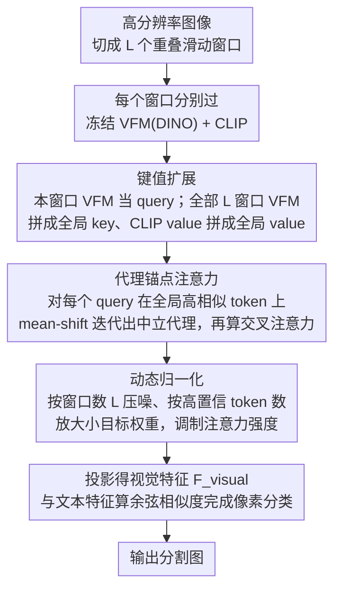

# Looking Beyond the Window: Global-Local Aligned CLIP for Training-free Open-Vocabulary Semantic Segmentation

**会议**: CVPR 2026  
**arXiv**: [2603.23030](https://arxiv.org/abs/2603.23030)  
**代码**: [https://github.com/2btlFe/GLA-CLIP](https://github.com/2btlFe/GLA-CLIP)  
**领域**: 分割 / 多模态VLM  
**关键词**: 开放词汇语义分割, CLIP, 滑动窗口, 无训练, 全局-局部对齐

## 一句话总结

针对无训练开放词汇语义分割中滑动窗口带来的跨窗口语义不一致问题，提出 GLA-CLIP 框架，通过全局键值扩展、代理锚点注意力和动态归一化三个机制实现跨窗口全局上下文整合，在8个基准上取得平均 44.0% mIoU 的 SOTA 表现。

## 研究背景与动机

**领域现状**：开放词汇语义分割（OVSS）利用 CLIP 的视觉-语言对齐空间实现不受固定类别限制的像素级标注。无训练方法因不需要额外训练而受到关注，常见做法包括修改 CLIP 注意力机制（如 MaskCLIP、SCLIP、ClearCLIP）或引入视觉基础模型特征（如 ProxyCLIP 用 DINO）。

**现有痛点**：CLIP 预训练分辨率仅为 224×224，处理高分辨率图像需要采用滑动窗口策略。但每个窗口独立处理，导致窗口间语义不一致——相邻窗口边界处像素预测常常不同，产生可见的网格状伪影。作者定义了 Boundary Error Rate (BER) 来量化这一问题，发现 ProxyCLIP 在窗口边界附近有很高的预测不一致率。

**核心矛盾**：滑动窗口保留了 CLIP 的预训练分辨率优势，但牺牲了全局上下文——特别是当大型或连续的语义区域被分割到多个窗口中时，各窗口无法获取完整的场景信息进行一致判断。

**本文目标** 如何在不需要训练的前提下，让每个窗口在保持局部空间精度的同时获取全局上下文信息，消除跨窗口语义不一致？

**切入角度**：将每个窗口的注意力范围从局部扩展到全局——让 query token 能够 attend 到所有窗口的 key-value token，同时通过代理锚点消除局部偏差，通过动态归一化适应不同尺度的目标。

**核心 idea**：通过跨窗口键值扩展 + 代理锚点 + 动态归一化实现无训练 CLIP 的全局-局部语义对齐。

## 方法详解

### 整体框架

GLA-CLIP 想解决的是一个被以往无训练 OVSS 方法忽略的副作用：为了保住 CLIP 224×224 的预训练分辨率，高分辨率图像必须切成滑动窗口逐块推理，而每个窗口各自为政，导致同一个大物体跨在两个窗口里时两边给出不同的类别，边界处出现网格状伪影。

整体流程是这样转的：输入图像先切成 $L$ 个重叠窗口，每个窗口分别过冻结的 VFM（DINO）和 CLIP。对当前窗口而言，它自己的 VFM 特征当 query，但 key 和 value 不再局限于本窗口——所有窗口的 VFM 特征拼起来当全局 key，所有窗口 CLIP 最后一层 transformer 的 value 拼起来当全局 value。交叉注意力把全局信息聚合进每个 query token，再过投影层得到视觉特征 $\mathbf{F}_{visual}$，最后与文本特征算余弦相似度完成像素分类。三个设计依次解决「拿不到全局」「拿到了却偏心本窗口」「全局信息淹没小目标」三个递进的问题。

### 关键设计

**1. 键值扩展（Key-Value Extension）：把注意力的视野从本窗口拉到全图**

滑动窗口最直接的病根是每个窗口看不到窗口之外的语义，所以跨窗口的同一物体得不到一致判断。键值扩展的做法是不动 query、只扩 key/value：收集全部 $L$ 个窗口的 VFM 特征拼成全局 key $\mathbf{K}_{global} \in \mathbb{R}^{(LN)\times D}$，同步收集 CLIP 最终层的 value 拼成 $\mathbf{V}_{global}$。当前窗口的 query $\mathbf{Q}$ 与全局 key 算注意力 $\mathbf{A}_{ext} = \mathbf{Q}\cdot\mathbf{K}_{global}^\top \in \mathbb{R}^{N\times(LN)}$，再据此聚合全局 value。这样一来局部 query 就能直接利用远处、甚至在别的窗口里的语义相关 token，大物体被切开时两侧也能 attend 到对方，跨窗口的一致性由此而来。

**2. 代理锚点注意力（Proxy Anchor）：消除「query 偏心本窗口」的局部偏差**

光把 key/value 扩成全局还不够：query token 本身是从本窗口特征生成的，算相似度时天然更亲近内窗口的 token，远处真正相关的 token 反而分不到注意力。代理锚点的思路是给每个 query 找一个更中立的替身——对 query token $i$，先在全局 key 里挑出余弦相似度超过阈值 $\rho$ 的高置信 token 集合 $\mathcal{P}_i^{(0)}$，再像 mean-shift 那样迭代聚合这些高相似嵌入，得到代理 $\mathbf{Q}_i^{(T)}$。代理落在高相似嵌入的中心，依据的是语义一致性而非「在不在本窗口」，于是内外窗口的 token 拿到公平的注意力分配，局部偏心被抹平。

**3. 动态归一化（Dynamic Normalization）：按目标尺度调注意力强度，别让小目标被淹没**

扩成全局后又带来一个反向风险：attend 的候选 token 多了，无关 token 的噪声也随之进来，小目标（对应的正样本本就很少）特别容易被一堆无关全局 token 冲淡。动态归一化用两个自适应变量替掉固定超参：偏移变量 $\mathbf{u} = 1 + \lambda_1\log(1+L)$ 随窗口数 $L$ 增大，窗口越多、扩展进来的噪声越多，就越强地压制；缩放变量 $\mathbf{w}_i = 1 + \lambda_2 / |\mathcal{P}_i|$ 与高置信 token 数成反比——小目标的 $|\mathcal{P}_i|$ 小，$\mathbf{w}_i$ 就大，放大那少数相关 token 的权重。这等于把尺度感知做成逐 query 的注意力调制，既救了小目标，又避免了传统方法那种逐数据集手调超参的麻烦。

### 损失函数 / 训练策略

本方法完全无训练，不涉及任何损失函数或训练过程。所有 CLIP 和 DINO 参数完全冻结，仅通过修改推理时的注意力计算实现效果提升。超参数 $\rho=0.6$，代理迭代步数 $T=2$，$\lambda_1=0.3$，$\lambda_2=30$，跨数据集共享。

## 实验关键数据

### 主实验

| 数据集 | 指标 (mIoU) | ProxyCLIP | GLA-CLIP (Ours) | 提升 |
|--------|-----------|-----------|----------------|------|
| Pascal VOC21 | mIoU | 61.3 | 66.3 | +5.0 |
| Pascal Context60 | mIoU | 35.3 | 36.1 | +0.8 |
| COCO-Object | mIoU | 37.5 | 37.7 | +0.2 |
| ADE20K | mIoU | 20.2 | 20.0 | -0.2 |
| Cityscapes | mIoU | 38.1 | 40.8 | +2.7 |
| **8数据集平均** | mIoU | 42.3 | 44.0 | +1.7 |

注：GLA-CLIP 不使用数据集特定超参数，仍超越使用特定调参的 CASS (44.4 with ds-hyp)。

### 消融实验

| 配置 | 平均 mIoU | 说明 |
|------|----------|------|
| 基线（仅内窗口 DINO 注意力） | 30.8 | 无归一化无扩展 |
| + KVE + 动态归一化 | 43.1 | 全局扩展显著提升 |
| + Proxy + 动态归一化（无 KVE） | 43.0 | 代理本身也有效 |
| + KVE + Proxy + 动态归一化 | 44.0 | 完整方法最优 |
| + KVE + Proxy + 数据集特定超参 | 44.3 | 手动调参仅微幅提升 |

### 关键发现

- 动态归一化能自适应不同数据集，消除了逐数据集调参的需求
- 高置信 token 数量与目标尺度高度相关：Cityscapes 中 Road 类约 135 个正样本，Person 类仅约 5 个
- GLA-CLIP 作为插件可提升多种基线方法：ClearCLIP +1.2%，SCLIP +1.6%，ProxyCLIP +0.6%

## 亮点与洞察

- 首次识别并系统解决了滑动窗口推理中跨窗口语义不一致的问题
- 三个组件（KVE、Proxy、动态归一化）层层递进、相互协作：KVE 提供全局信息 → Proxy 消除局部偏差 → 动态归一化处理尺度差异
- 完全无训练、无额外参数，可即插即用到现有方法上扩展感受野
- 用高置信 token 数量作为目标尺度的免费代理信号，巧妙避免了显式尺度估计

## 局限与展望

- 全局键值扩展的计算复杂度为 $O(N \cdot LN)$，窗口数多时注意力计算开销增大
- 代理锚点的迭代构建增加了推理延迟（虽然只需 2 步）
- 动态归一化中 $\lambda_1, \lambda_2$ 仍为全局固定值，更精细的自适应策略可能进一步提升
- 在 ADE20K 等类别极多的数据集上提升有限，可能需要更精细的类别感知机制

## 相关工作与启发

- ProxyCLIP 的代理注意力机制是本文的直接基础，GLA-CLIP 将其从单窗口扩展到全局
- Mean-shift 聚类思想被用于构建代理锚点，适用于其他需要跨区域语义一致性的场景
- 无训练 OVSS 正成为一个活跃方向，避免了训练数据需求和过拟合风险

## 评分

- 新颖性: ⭐⭐⭐⭐ 系统性地解决了滑动窗口语义不一致这一被忽略的问题
- 实验充分度: ⭐⭐⭐⭐⭐ 8 个数据集，多种基线集成，详细的消融和可视化分析
- 写作质量: ⭐⭐⭐⭐⭐ 动机清晰，问题定义精确（BER 指标），方法推导严谨
- 价值: ⭐⭐⭐⭐ 即插即用的通用方案，对无训练 OVSS 领域有实际推动作用

<!-- RELATED:START -->

## 相关论文

- [\[CVPR 2026\] PEARL: Geometry Aligns Semantics for Training-Free Open-Vocabulary Semantic Segmentation](pearl_geometry_aligns_semantics_for_training-free_open-vocabulary_semantic_segme.md)
- [\[CVPR 2026\] The Power of Prior: Training-Free Open-Vocabulary Semantic Segmentation with LLaVA](the_power_of_prior_training-free_open-vocabulary_semantic_segmentation_with_llav.md)
- [\[CVPR 2026\] ReAttnCLIP: Training-Free Open-Vocabulary Remote Sensing Image Segmentation via Re-defined Attention in CLIP](reattnclip_training-free_open-vocabulary_remote_sensing_image_segmentation_via_r.md)
- [\[CVPR 2026\] Direct Segmentation without Logits Optimization for Training-Free Open-Vocabulary Semantic Segmentation](direct_segmentation_without_logits_optimization_for_training-free_open-vocabular.md)
- [\[ICCV 2025\] Training-Free Class Purification for Open-Vocabulary Semantic Segmentation](../../ICCV2025/segmentation/training-free_class_purification_for_open-vocabulary_semantic_segmentation.md)

<!-- RELATED:END -->
