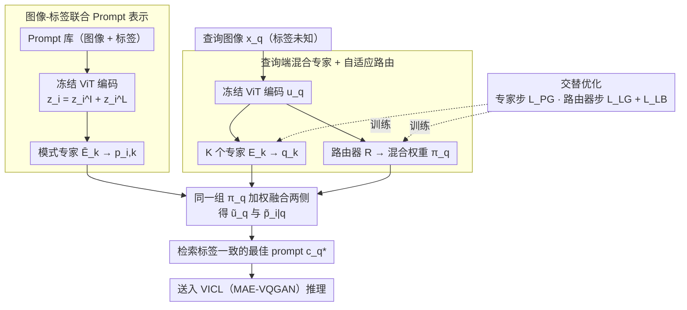

# Love Me, Love My Label: Rethinking the Role of Labels in Prompt Retrieval for Visual In-Context Learning

**会议**: CVPR 2026  
**arXiv**: [2604.03657](https://arxiv.org/abs/2604.03657)  
**代码**: [https://github.com/luotc-why/CVPR26-LaPR](https://github.com/luotc-why/CVPR26-LaPR)  
**领域**: 多模态VLM / 分割  
**关键词**: 视觉上下文学习, 提示检索, 标签一致性, 混合专家, 对比学习

## 一句话总结

揭示了视觉上下文学习（VICL）中 prompt 检索忽略标签信息导致标签不一致的问题，提出 LaPR 框架通过图像-标签联合表示和混合专家机制实现标签感知的 prompt 检索，在前景分割、目标检测和图像着色任务上一致超越 SOTA。

## 研究背景与动机

**领域现状**：视觉上下文学习（VICL）让视觉基础模型通过示范性 prompt（图像+标签对）处理多种任务。典型的 MAE-VQGAN 模型将 VICL 构建为像素修复——输入 2×2 网格，左上为 prompt 图像，右上为 prompt 标签，左下为查询图像，右下待预测。Prompt 的选择对 VICL 性能影响很大，已有工作（SupPR、Partial2Global、RH-Partial2Global）聚焦于基于图像相似度的检索或重排。

**现有痛点**：现有 prompt 检索方法只关注图像相似性而忽略了标签信息。这导致一个典型问题：检索到的 prompt 图像虽然视觉相似，但标签可能不一致。例如，查询图像主体是猫，但检索到的 prompt 虽包含猫，标签却标注的是花，导致 VICL 推理出错。

**核心矛盾**：作者通过实验发现，在图像相似的 prompt 中，query-prompt 的标签一致性与 VICL 性能呈正相关。这说明标签是 prompt 选择中被忽略的关键信号。然而挑战在于：推理时 query 的标签是未知的，无法直接比较标签一致性。

**本文目标**（1）如何在 prompt 表示中显式融入标签信息？（2）如何在 query 标签未知时仍能感知和匹配标签语义？

**切入角度**：将标签信息作为 prompt 表示的一部分——通过图像-标签联合编码为 prompt 构建标签感知嵌入；对 query 端，用混合专家 (MoE) 机制让不同专家捕获不同的标签模式（如长尾、尖角等），路由器根据 query 自适应推测其隐含标签。

**核心 idea**：将标签作为辅助信号纳入 prompt 检索，通过 MoE 机制在 query 标签未知时估计隐含标签模式以实现标签一致的 prompt 选择。

## 方法详解

### 整体框架

LaPR 想解决的是视觉上下文学习（VICL）里一个被长期忽略的问题：检索 prompt 时只看图像像不像，结果挑出来的示范图标签和 query 对不上，VICL 就被带偏。难点在于推理时 query 自己的标签是未知的，没法直接拿标签去比对。LaPR 的整体思路是把标签编进 prompt 的表示里、再用一组专家在 query 端"猜"出它的隐含标签模式。具体地，给定 prompt 数据库 $\mathcal{B}=\{(I_i^p, L_i^p)\}$（图像+标签对）和标签未知的查询图像 $x_q$，流程是：先用冻结的 ViT 把每个 prompt 的图像和标签一起编码成"标签感知"的联合嵌入；再让 query 和 prompt 各过 $K$ 个专家生成模式特定表示，由 query 端的路由器算出一组混合权重把它们融合；最后在融合空间里检索出标签也一致的最佳 prompt $c_q^\star$。训练上专家和路由器交替更新，各自盯着不同的监督信号。

### 关键设计

**1. 图像-标签联合 Prompt 表示：把"标注成什么"也编进嵌入**

传统检索只用图像嵌入 $z_i^I$ 去算相似度，于是"看起来像猫但标成花"的 prompt 会被误选——标签这条关键信号被整个丢掉了。LaPR 的做法是让标签也参与构建表示：用冻结的特征提取器 $f$（如 CLIP ViT）分别编码 prompt 图像和标签，得到 $z_i^I = f(I_i^p)$ 和 $z_i^L = f(L_i^p)$，再相加融合成 $z_i = z_i^I + z_i^L$，最后过模式特定专家 $\bar{E}_k$ 得到各模式下的 prompt 表示 $p_{i,k} = \bar{E}_k(z_i)$。这样每个 prompt 嵌入里同时携带了"看起来像什么"和"被标注成什么"两层信息，检索时才有可能区分视觉相近但语义不同的候选。

**2. 查询端混合专家 + 自适应路由：在标签未知时把它"软"估出来**

query 端的真正麻烦是它的标签 $y_q$ 推理时根本拿不到，没法直接和 prompt 的标签比。LaPR 不去硬判断 query 属于哪一类，而是用 $K$ 个专家 $E_k$ 把 query 特征 $u_q = f(x_q)$ 映射到各自的模式特定表示 $q_k = E_k(u_q)$，再由路由器 $R$ 输出一个概率分布 $\pi_q = R(u_q) \in \Delta^K$ 表示 query 在各模式上的隶属权重。关键一步是这组权重**同时**作用到两侧——

$$\tilde{u}_q = \sum_k \pi_{q,k}\, q_k, \qquad \tilde{p}_{i|q} = \sum_k \pi_{q,k}\, p_{i,k}$$

也就是说 query 选了哪些模式，prompt 也用同一组权重在相同模式上被重新加权，检索因此自适应于 query 的隐含标签。直觉上不同 query 关注 prompt 的不同侧面（动物形态的 query 更看重某些专家，植物纹理的 query 更看重另一些），路由器学的就是这个"软分配"，用一个连续的混合权重代替"猜一个硬标签"，规避了标签未知带来的不确定性。

**3. 交替优化策略：专家和路由器各盯一个监督信号**

专家要学到强的模式特定表示，路由器要学到准确的模式分配，这两个目标若塞进一个损失里联合优化会互相干扰、训练不稳。LaPR 把每个 mini-batch 拆成两步交替更新。专家步冻结路由器，用性能引导对比损失 $\mathcal{L}_{PG}$ 训练专家，正负样本直接由 VICL 的实际推理分数定——候选池里实测效果最好的 top-5 当正样本、最差的 top-5 当负样本，让表示直接对齐"真能提升 VICL 的 prompt"。路由器步则冻结专家，用标签引导对比损失 $\mathcal{L}_{LG}$ 训练路由器，正负样本按 prompt 与 query 的标签匹配分数选取，并加一项负载均衡损失 $\mathcal{L}_{LB} = \mathrm{KL}(\bar{\pi}\,\|\,r)$ 防止少数专家被反复选、其余被闲置。两个信号分属两步、互不打架，比单阶段联合训练更稳（消融里联合训练分割 mIoU 从 41.36 掉到 39.86）。

### 一个完整示例：一张猫的 query 怎么被匹配

假设 query 是一张主体为猫的图像，标签未知。先用 $f$ 编码得到 $u_q$，$K=10$ 个专家把它映射成 $q_1,\dots,q_{10}$，路由器读 $u_q$ 后输出权重 $\pi_q$，比如在"动物形态"对应的几个专家上权重偏高、"植物纹理"专家上接近 0。候选池此前已用预训练特征 top-50 检索粗筛出 50 个 prompt，每个 prompt 的图像+标签早被编成 $p_{i,1},\dots,p_{i,10}$。现在用同一组 $\pi_q$ 把 query 侧融成 $\tilde{u}_q$、把每个候选融成 $\tilde{p}_{i|q}$——一个"图像也是猫、但标签标成花"的候选，因为它在"动物语义"模式上的 $p_{i,k}$ 与 query 的高权重模式对不上，融合后相似度被压低；而"图像是猫、标签也是猫"的候选则在被强调的模式上高度吻合，排到最前，最终选作 $c_q^\star$ 送进 VICL。整个过程没有显式判定过 query 的类别，标签一致性是靠"同一组路由权重作用于两侧"间接实现的。

### 损失函数 / 训练策略

专家步损失：$\mathcal{L}_{PG}$ = InfoNCE 对比损失，正样本为 VICL 评分最高的 prompt。路由器步损失：$\mathcal{L}_R = \mathcal{L}_{LG} + \mathcal{L}_{LB}$，$\mathcal{L}_{LG}$ 是标签匹配引导的对比损失，$\mathcal{L}_{LB}$ 是 KL 散度负载均衡。训练使用 SGD 优化器，学习率 0.005，batch size 64，200 epochs，单卡 A100。专家数 $K=10$。

## 实验关键数据

### 主实验

| 任务 | 指标 | RH-Partial2Global | LaPR (Ours) | 提升 |
|------|------|-------------------|-------------|------|
| 前景分割 (平均 mIoU) | mIoU↑ | 39.02 | **41.36** | +6.0% |
| 目标检测 | mIoU↑ | 30.94 | **32.01** | +3.5% |
| 图像着色 | MSE↓ | 0.56 | 0.60 | -7.1% |
| 分割+投票 | mIoU↑ | 43.08 | 42.27 | -1.9% |
| 检测+投票 | mIoU↑ | 33.28 | **34.64** | +4.1% |

注：LaPR 是检索方法，在无投票设置下全面领先；在投票设置下检测仍领先。着色任务 MSE 略高但差距小。

### 消融实验

| 配置 | 分割 mIoU | 检测 mIoU | 说明 |
|------|----------|----------|------|
| 完整 LaPR | 41.36 | 32.01 | 基准 |
| w/o 路由器（均匀分布） | 38.20 | 29.69 | 自适应路由至关重要 |
| w/o Prompt 标签 | 39.19 | 30.94 | 标签注入有效 |
| CLIP→DINOv2 特征 | 41.39 | 32.06 | 跨编码器泛化良好 |
| 单阶段联合训练 | 39.86 | 31.21 | 交替优化优于联合训练 |
| w/o $\mathcal{L}_{PG}$ | 35.05 | 27.30 | 性能引导损失是核心监督 |
| w/o $\mathcal{L}_{LG}$ | 39.67 | 30.14 | 标签引导损失提供重要辅助 |

### 关键发现

- 跨 fold 迁移性显著优于基线：LaPR 平均跨 fold mIoU 39.87，SupPR 仅 33.42，提升 19.3%
- MoE 专家激活模式分析显示，语义相近的类别（如 dog 和 horse）共享相似的专家激活分布
- 可视化证实 LaPR 检索的 prompt 在标签上比 SupPR 更一致

## 亮点与洞察

- 首次系统揭示了标签在 VICL prompt 检索中的重要性，填补了一个被广泛忽略的研究空白
- MoE + 路由器的设计巧妙解决了"query 标签未知"的核心难题——用软混合代替硬判断
- 交替优化策略设计合理，专家和路由器各司其职，训练更稳定
- 方法跨特征提取器泛化良好（CLIP / DINOv2 性能一致）

## 局限与展望

- 专家数 $K=10$ 是固定超参数，最优值可能随任务变化
- 图像-标签融合仅用简单加法 $z_i = z_i^I + z_i^L$，更复杂的融合策略（如跨注意力）可能更有效
- 着色任务提升有限，可能因为着色的标签（彩色图像）与图像的视觉相似度本身就高
- 候选池构建仍依赖预训练特征的 top-50 检索，可能遗漏标签匹配但图像不太相似的 prompt
- 训练需要运行 MAE-VQGAN 获取每个候选的 VICL 分数，数据准备开销大

## 相关工作与启发

- SupPR 首次将对比学习引入 VICL 检索优化，LaPR 在此基础上引入标签维度
- MoE 机制在 NLP 的 ICL（如 MOICL、MoD）中已有应用，本文首次将其用于视觉 ICL 的 prompt 检索
- 标签一致性的重要性发现可能启发其他 ICL 场景（如 NLP 中的 few-shot 检索）重新审视标签角色

## 评分

- 新颖性: ⭐⭐⭐⭐ 首次关注标签在 VICL 检索中的作用，问题发现有洞察
- 实验充分度: ⭐⭐⭐⭐⭐ 三个任务、跨 fold 迁移、跨编码器泛化、详尽消融
- 写作质量: ⭐⭐⭐⭐ 动机清晰，实验设计系统化，图示直观
- 价值: ⭐⭐⭐⭐ 为 VICL prompt 选择提供了新视角与新框架，可推广到其他 ICL 场景

<!-- RELATED:START -->

## 相关论文

- [\[CVPR 2026\] SouPLe: Enhancing Audio-Visual Localization and Segmentation with Learnable Prompt Contexts](souple_enhancing_audio-visual_localization_and_segmentation_with_learnable_promp.md)
- [\[CVPR 2025\] SAM2-LOVE: Segment Anything Model 2 in Language-Aided Audio-Visual Scenes](../../CVPR2025/segmentation/sam2-love_segment_anything_model_2_in_language-aided_audio-visual_scenes.md)
- [\[CVPR 2026\] PR-MaGIC: Prompt Refinement Via Mask Decoder Gradient Flow For In-Context Segmentation](pr-magic_prompt_refinement_via_mask_decoder_gradient_flow_for_in-context_segment.md)
- [\[CVPR 2026\] EReCu: Pseudo-label Evolution Fusion and Refinement with Multi-Cue Learning for Unsupervised Camouflage Detection](erecu_pseudolabel_evolution_unsupervised_camouflage.md)
- [\[CVPR 2026\] ROSE: Retrieval-Oriented Segmentation Enhancement](rose_retrieval-oriented_segmentation_enhancement.md)

<!-- RELATED:END -->
