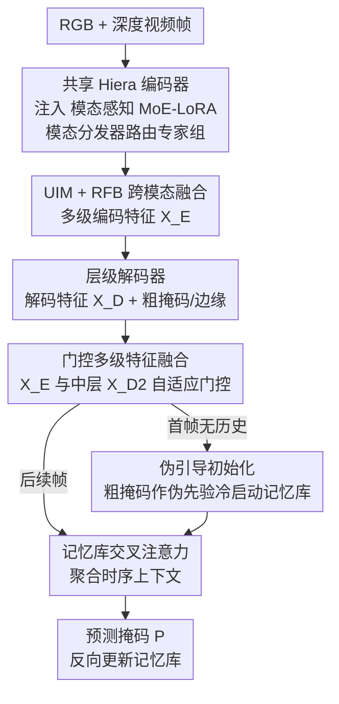

# M4-SAM: Multi-Modal Mixture-of-Experts with Memory-Augmented SAM for RGB-D Video Salient Object Detection

**会议**: CVPR 2026  
**论文**: [CVF Open Access](https://openaccess.thecvf.com/content/CVPR2026/html/Liu_M4-SAM_Multi-Modal_Mixture-of-Experts_with_Memory-Augmented_SAM_for_RGB-D_Video_Salient_CVPR_2026_paper.html)  
**代码**: https://github.com/HankLiu2020/M4-SAM  
**领域**: 视频理解 / 分割  
**关键词**: RGB-D 视频显著目标检测, SAM2, MoE-LoRA, 参数高效微调, 时序记忆

## 一句话总结
为了把 SAM2 高效迁移到 RGB-D 视频显著目标检测（RGB-D VSOD），M4-SAM 给冻结的 SAM2 编码器注入「模态感知 MoE-LoRA」做参数高效微调、用「门控多级特征融合 + 记忆库」聚合多尺度时序信息、再用「伪引导初始化」摆脱对人工 prompt 的依赖，在三个 RGB-D VSOD 数据集上全指标 SOTA，且整套训练只需约 5 小时两张 4090。

## 研究背景与动机

**领域现状**：显著目标检测要把场景里最吸引注意力的物体抠出来。RGB-D VSOD 同时引入深度（提供几何线索）与视频时序（保证跨帧一致性），是其中最难的一档设定。最近 SAM / SAM2 凭借大规模预训练表征和强零样本泛化横扫分割领域，SAM2 还自带记忆库机制把能力延伸到了视频，自然成了改造 RGB-D VSOD 的诱人底座。

**现有痛点**：作者指出直接把 SAM2 套到 RGB-D VSOD 上有三个具体障碍。其一，SAM2 体量大、VSOD 数据集又小，全参数微调不现实；而常用的 PEFT 手段——尤其是 LoRA——只用线性低秩投影，既缺空间先验也没有模态专属设计，捕捉不了局部结构、也利用不了 RGB 与深度的互补性。其二，现有方法没有充分用上 SAM 编码器的多尺度特征，难以兼顾空间细节与语义上下文。其三，SAM2 的记忆库要靠第一帧的显式 prompt（用户点击框或真值掩码）来初始化，而 VSOD 是要做零样本、无人工交互的稠密预测，这个依赖直接卡住了落地。

**核心矛盾**：根子在于 SAM2 是为「线性 PEFT + 单模态 + prompt 驱动」的范式设计的，而 RGB-D VSOD 要的是「带空间先验的高效微调 + 双模态自适应融合 + 全自动初始化」。两套假设错位，所以不能简单拿来即用。

**本文目标**：把上述三个障碍逐一拆掉——让 PEFT 既轻量又懂空间和模态、让多尺度特征在时序里被充分利用、让记忆库不靠人工 prompt 也能冷启动。

**核心 idea**：用「卷积专家组成的 MoE-LoRA + 模态分发器」替换线性 LoRA，用「门控多级融合 + 记忆库」做时序聚合，用「伪掩码引导初始化」替掉显式 prompt，三件套一起把 SAM2 改造成 prompt-free 的 RGB-D VSOD 模型。

## 方法详解

### 整体框架
M4-SAM 的输入是一段 RGB-D 视频的逐帧 RGB 图与深度图（深度归一化到 [0,1] 并复制成三通道），输出是每帧的高质量显著性掩码。整条管线的关键是「一套编码器同时吃两个模态」：RGB 和深度共享同一个 Hiera 编码器（来自 SAM2.1 的 SAM-L，主体冻结），编码器里注入了 Modality-Aware MoE-LoRA，靠模态专属的专家组激活分别为两个模态提取四级特征。两个模态的多级特征经 Universal Interaction Module（UIM）与 Receptive Field Block（RFB）融合，得到统一的多级编码特征 $\{X_E^i\}_{i=1}^4$。

编码特征随后经一串解码块逐级上采样重建空间细节，得到解码特征 $\{X_D^i\}_{i=1}^4$。核心的时序部分是 Pseudo-Guided Temporal Memory：它先用 Gated Multi-Level Feature Fusion 把多级编码特征 $\{X_E^i\}$ 与中层解码特征 $X_D^2$ 融成富表征，再让当前帧与记忆库里存的历史帧做交叉注意力，得到时序聚合特征并产出预测掩码 $P$。每帧预测完成后，记忆库用最新的预测与特征反向更新，维持时序一致性并适应场景变化。对第一帧没有历史信息的问题，用 Pseudo-Guided Initialization 把粗掩码当伪先验来冷启动记忆库。

### 关键设计

**1. 模态感知 MoE-LoRA：用卷积专家 + 模态分发器替掉线性 LoRA**

针对「线性 LoRA 缺空间先验、缺模态设计」这个痛点，作者把每条 LoRA 分支从线性投影改写成一组卷积专家。具体设计三类专家：两个标准卷积专家（核 $3\times3$ 与 $5\times5$）负责捕捉不同感受野下的空间模式，外加一个深度可分离 + 逐点卷积专家做高效推理。卷积天然带局部空间先验，比线性投影更贴合视觉结构；这些专家的输出再由一个轻量 MoE Gating 按输入表征动态选出 top-K 个相关专家加权聚合（实验里 top-2 最优）。前向写成 $h = W_0 x + \Delta W x = W_0 x + BAx + B\,\mathcal{D}(Ax)$，其中 $W_0$ 是冻结主干权重，$BA$ 是常规低秩项，$\mathcal{D}(\cdot)$ 是模态分发器。

更关键的是模态分发器 $\mathcal{D}(\cdot)$：作者把专家分成 RGB、depth、fusion 三组，RGB/depth 两组强化各自模态的 intra-modal 表征，fusion 组负责跨模态交互且参数被两条流共享。分发器根据当前输入模态动态路由——RGB 流激活 RGB+fusion 组，深度流激活 depth+fusion 组。这样一个统一编码器分支就能处理两个模态，而 Adapter / LoRA 因为没有动态建模能力，必须为额外模态单开一条编码器分支，训练显存开销大得多（见表 3：Adapter 14.66GB、LoRA 14.25GB，本文仅 11.62GB，性能反而最好）。

**2. 门控多级特征融合：自适应平衡空间细节与语义上下文**

针对「SAM 多尺度特征没被充分利用」的痛点，Gated-MLF 先把四级编码特征 $\{X_E^i\}$ 拼接、用 FFN 压成统一上下文表征 $X_c$，再用双重注意力做空间-通道增强：$X_e = \mathrm{Conv}_{sp}(\mathrm{Mean}(X_c)) \cdot [\mathrm{Conv}_{ch}(P_{avg}(X_c)) \cdot X_c]$，其中 $\mathrm{Mean}$ 沿通道求均值（$C\times H\times W \to 1\times H\times W$）、$P_{avg}$ 做全局平均池化（$C\times H\times W \to C\times1\times1$）。然后用一个门控权重 $G$ 自适应平衡浅层与增强特征：

$$G = \mathrm{Conv}_{gate}(\mathrm{Concat}(X_E^1, X_e)),\quad \tilde{X}_E = \mathrm{FFN}(G\cdot X_e + (1-G)\cdot X_E^1)$$

最后把融合编码表征与解码特征拼成 $X_F = \mathrm{Concat}(\tilde{X}_E, X_D^2)$。这里一个值得注意的细节是：作者刻意选**中层**解码特征 $X_D^2$ 而非最后一层来融合——因为已有观察发现基础模型的最后一层会抑制局部空间信息、不利于稠密预测，中层特征在细粒度细节与语义丰富度间更平衡（表 6 验证：单用 $X_D^2$ 优于单用 $X_D^1$ 或两者合用）。

**3. 伪引导初始化：用粗掩码当伪先验，让记忆库无需 prompt 冷启动**

针对「SAM2 记忆库依赖第一帧显式 prompt」这个落地障碍，作者让记忆库在第一帧用模型自己产出的粗掩码当伪先验来启动，彻底去掉人工交互。常规时序更新里，记忆库用查询嵌入 $Q_t$、融合特征 $X_{F,t}$、预测 $P_t$ 生成键值 $k_{m,t}=Q_t$、$v_{m,t}=\mathrm{ValueEncoder}(X_{F,t}, P_t)$，再让当前帧与记忆做交叉注意力 $\tilde{X}_F = \mathrm{softmax}(QK_m^T/\sqrt{d})\cdot V_m$，记忆库滚动保留最近 $T$ 帧。第一帧没有历史，于是把第一帧由 $X_D^1$ 生成的粗掩码 $P_{c,0}^1$ 经两个线性投影变成初始键值：

$$\tilde{k}_{m,0} = \mathrm{Linear}_k(X_{F,0}),\quad \tilde{v}_{m,0} = \mathrm{Linear}_v(X_{F,0}\cdot P_{c,0}^1)$$

其中 value 投影与后续的 value encoder 共享参数，保证初始化与时序建模处于统一特征空间。这一招与 SAM2、XMem 形成对比——后两者要么靠用户 prompt、要么靠首帧真值。作者还点出一个巧妙的容错性：记忆库基于注意力，即便伪掩码带噪声，噪声键会自然得到低 affinity 分数，从而抑制错误权重、防止误差沿时序传播。

### 损失函数 / 训练策略
总损失 $L_{total} = L_{pred} + L_{aux} + L_{moe}$。$L_{pred}$ 用 structure loss 拉近最终预测与真值；$L_{aux} = \sum_{i=1}^{3}(L_{predc}^i + L_{edge}^i)$ 对解码器各级施加中间监督，粗掩码 $P_c^i$ 由真值监督、边缘图 $P_e^i$ 由 Sobel 伪边缘监督，促进多尺度细化与边界精度；$L_{moe} = \lambda[(\sigma(I)/\mu(I))^2 + (\sigma(L)/\mu(L))^2]$（$\lambda=10^{-2}$）是负载均衡损失，保证专家利用均匀、防止专家坍缩。训练用 AdamW，MoE-LoRA 与其余参数分别用 $1\times10^{-4}$、$1\times10^{-3}$ 学习率，weight decay $5\times10^{-4}$，rank $r=4$、每组 3 专家激活 top-2，352×352 输入、每段 $T=4$ 帧、50 epoch，两张 RTX 4090，约 5 小时完成。

## 实验关键数据

### 主实验
在 DViSal、RDVS、ViDSOD-100 三个 RGB-D VSOD 基准上，对 13 个 SOTA 方法做对比，四项指标 E-measure（$E_\xi$↑）、S-measure（$S_\alpha$↑）、F-measure（$F_\beta$↑）、MAE（$M$↓）全胜。

| 数据集 | 指标 | M4-SAM | 次优方法 | 提升 |
|--------|------|--------|----------|------|
| DViSal | $E_\xi$ ↑ / $F_\beta$ ↑ | 0.925 / 0.828 | KAN-SAM | +4.5% / +5.7% |
| RDVS | $E_\xi$ ↑ | 0.927 | DCTNet+ | +2.0% |
| ViDSOD-100 | $E_\xi$ ↑ / $M$ ↓ | 0.936 / 0.016 | KAN-SAM | +2.6% / −0.009 |

为说明增益不只来自 SAM2 底座，作者还专门和 SAM 系基线（MDSAM、SAM2-UNet、KAN-SAM）比，三个数据集平均 E-measure 分别再领先 6.9%、7.6%、2.9%。

### 消融实验（均在 RDVS 上）

| 配置 | $E_\xi$↑ | $S_\alpha$↑ | $F_\beta$↑ | $M$↓ | 说明 |
|------|------|------|------|------|------|
| 完整模型 | 0.927 | 0.878 | 0.802 | 0.027 | Full model |
| Pseudo(Copy) 深度 | 0.858 | 0.740 | 0.623 | 0.047 | 用 RGB 当深度，掉 6.9 点 E |
| Pseudo(Black) 深度 | 0.895 | 0.857 | 0.768 | 0.029 | 全零深度，仍掉 3.2 点 E |
| PEFT=None（冻结不微调） | 0.839 | 0.816 | 0.693 | 0.033 | 不微调编码器最差 |
| PEFT=LoRA | 0.904 | 0.864 | 0.764 | 0.031 | 但需双编码器，14.25GB |
| PEFT=Conv-LoRA | 0.900 | 0.861 | 0.761 | 0.032 | 浅专家融合能力受限 |
| Baseline（仅粗掩码） | 0.908 | 0.874 | 0.775 | 0.030 | 无时序记忆 |
| +Memory | 0.910 | 0.871 | 0.787 | 0.029 | 加记忆库 |
| +Memory+Gated-MLF | 0.927 | 0.878 | 0.802 | 0.027 | 再加多级融合，显著提升 |

### 关键发现
- **深度模态确有贡献**：把 RGB 直接当深度（Pseudo Copy）E-measure 从 0.927 暴跌到 0.858，证明深度提供的几何互补信息不可替代；连全零深度（0.895）都比 Copy 好，说明错误的深度比"没有深度"更伤。
- **模态感知 MoE-LoRA 是显存与性能双赢**：相比要双编码器的 Adapter/LoRA（14+GB），本文统一分支仅 11.62GB，性能反而最高，验证模态分发器的价值。
- **top-K=2 最优**：K=1 专家多样性不足（0.903），K=3 特征冗余（0.914），2 个专家在专精与互补间最平衡。
- **Gated-MLF 是时序部分的主要增益来源**：单加记忆库只从 0.908 升到 0.910，再加多级融合才跳到 0.927，说明充分利用多尺度特征比单纯加记忆更关键。
- **中层解码特征 $X_D^2$ 最适合喂记忆**：单用 $X_D^2$（0.927）优于单用 $X_D^1$（0.918）或两者合用（0.909），印证最后层抑制局部信息、中层更均衡的假设。
- **训练片段长度 $T=4$ 最优**：$T=2$ 时序依赖不足（0.897），$T=6$ 反而退化（0.908）；测试时记忆库从 $T=4$ 放大到 $T=32$ 精度稳定。

## 亮点与洞察
- **把 MoE 揉进 LoRA 并用模态分发器统一双流**，是这篇最巧的地方：既保留了 LoRA 的轻量，又用卷积专家补回空间先验，还靠分发器让一套编码器吃两个模态，省掉了双编码器的显存。这个"模态路由 + 共享 fusion 组"的思路可迁移到任何需要双模态 PEFT 的任务（RGB-T、RGB-event 等）。
- **伪引导初始化里"噪声键自然低 affinity"的论证很有说服力**：它把记忆库的注意力机制当成天然的误差抑制器，让 prompt-free 冷启动既可行又鲁棒——这是把 SAM2 真正做成全自动稠密预测的关键钥匙。
- **刻意用中层而非末层解码特征**这个细节，呼应了"基础模型末层抑制局部空间信息"的近期观察，是一个容易被忽略但实测有效的工程洞察。

## 局限与展望
- 作者承认未来需进一步优化泛化性，并扩展到更多下游多模态视频理解任务——暗示当前模型仍较专于 VSOD 这一任务设定。
- 整套方法强依赖 SAM2 的 Hiera 编码器与记忆库机制，方法本身的可迁移性与"换底座"后还成不成立没有验证。
- 深度消融只测了 Copy / Black 两种退化形态，没有系统评估真实场景里噪声/缺失深度（传感器误差、远距离失效）下的鲁棒性，而这正是 RGB-D 落地最常见的难点。
- 伪引导初始化用首帧粗掩码冷启动，若首帧本身显著性预测严重失败（如极端低光、目标极小），误差是否真能被注意力完全抑制、还是会污染后续记忆，文中只给了定性论证，缺定量压力测试。

## 相关工作与启发
- **vs 普通 LoRA / Adapter**：它们用线性低秩投影、无模态设计，扩展到双模态必须双编码器导致显存暴涨（14+GB）；本文用卷积专家 + 模态分发器把空间先验和模态路由都补进 PEFT，单分支搞定双模态，11.62GB 还更准。
- **vs Conv-LoRA**：同样引入卷积 MoE，但专家设计偏浅、跨模态融合能力弱（0.900）；本文用三类不同感受野专家 + 三组（RGB/depth/fusion）结构，融合能力更强。
- **vs SAM2 / XMem 的记忆初始化**：二者靠用户 prompt 或首帧真值冷启动；本文用模型自产的粗掩码当伪先验，实现真正 prompt-free 的零样本 VSOD。
- **vs 传统 RGB-D VSOD（DCTNet+、KAN-SAM 等）**：它们多在小规模数据上从头训、泛化受限；本文站在 SAM2 大规模预训练表征之上做高效 PEFT，全指标领先且训练仅约 5 小时。

## 评分
- 新颖性: ⭐⭐⭐⭐ 模态感知 MoE-LoRA + 伪引导初始化的组合在 RGB-D VSOD 适配 SAM2 上是有针对性的新设计，但各组件（MoE-LoRA、记忆库、门控融合）多为已有思路的巧妙重组。
- 实验充分度: ⭐⭐⭐⭐ 三数据集全指标对比 13 个方法 + 七组消融覆盖深度/PEFT/top-K/记忆/特征层/片段长，较扎实；缺真实噪声深度与换底座的鲁棒性验证。
- 写作质量: ⭐⭐⭐⭐ 三大挑战→三大设计对应清晰，公式与消融对得上，逻辑顺畅。
- 价值: ⭐⭐⭐⭐ 给出一条 prompt-free 高效适配 SAM2 到 RGB-D VSOD 的实用方案，代码开源、训练成本低，对多模态稠密预测落地有参考价值。

<!-- RELATED:START -->

## 相关论文

- [\[CVPR 2026\] V²-SAM: Marrying SAM2 with Multi-Prompt Experts for Cross-View Object Correspondence](v2-sam_marrying_sam2_with_multi-prompt_experts_for_cross-view_object_corresponde.md)
- [\[AAAI 2026\] SAM-DAQ: Segment Anything Model with Depth-guided Adaptive Queries for RGB-D Video Salient Object Detection](../../AAAI2026/segmentation/sam-daq_segment_anything_model_with_depth-guided_adaptive_queries_for_rgb-d_vide.md)
- [\[CVPR 2026\] Uncertainty-Aware Modality Fusion for Unaligned RGB-T Salient Object Detection](uncertainty-aware_modality_fusion_for_unaligned_rgb-t_salient_object_detection.md)
- [\[CVPR 2026\] Spatial-SAM: Spatially Consistent 3D Electron Microscopy Segmentation with SDF Memory and Semi-Supervised Learning](spatial-sam_spatially_consistent_3d_electron_microscopy_segmentation_with_sdf_me.md)
- [\[CVPR 2026\] PromptMoE: A Segmentation Refinement Framework Leveraging Mixture of Experts for Improved Prompting](promptmoe_a_segmentation_refinement_framework_leveraging_mixture_of_experts_for_.md)

<!-- RELATED:END -->
