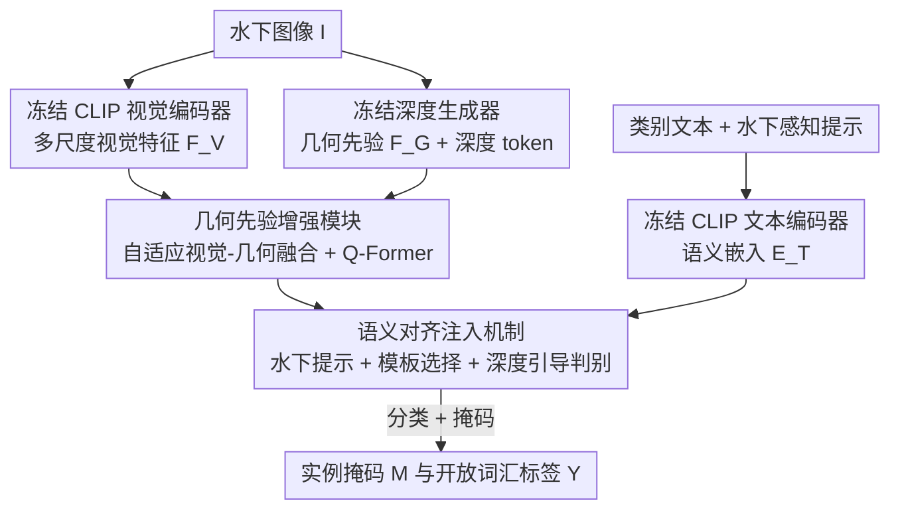

# MARIS: Marine Open-Vocabulary Instance Segmentation

**会议**: CVPR 2026  
**论文**: [CVF Open Access](https://openaccess.thecvf.com/content/CVPR2026/html/Li_MARIS_Marine_Open-Vocabulary_Instance_Segmentation_CVPR_2026_paper.html)  
**代码**: https://github.com/LiBingyu01/MARIS  
**领域**: 语义分割 / 开放词汇 / 水下视觉  
**关键词**: 水下实例分割, 开放词汇, 几何先验, 语义对齐, CLIP

## 一句话总结
这篇论文一手做了第一个细粒度的水下开放词汇实例分割基准 MARIS（16K 图、158 个细类），一手提出由几何先验增强模块（GPEM）和语义对齐注入机制（SAIM）组成的统一框架，用深度图几何先验对抗水下视觉退化、用水下感知的文本提示对抗语义错位，在 in-domain 与 cross-domain 两种设置下都显著超过现有 OV 分割基线。

## 研究背景与动机
**领域现状**：开放词汇（OV）实例分割在自然图像上已经相当成熟，主流做法是借 CLIP 这类视觉-语言模型把像素特征和类别文本嵌入对齐，从而识别训练时没见过的类别。水下场景（珊瑚监测、水下机器人、生态保护）也急需这种能力，因为逐像素标注极其昂贵、且海洋物种本身就是长尾、开放的。

**现有痛点**：作者指出把自然图像上的 OV 方法直接搬到水下会同时踩两个坑。其一是**数据层面**——现有水下分割数据集（UIIS、USIS10K）类别数都不到 20 个，而且把大量物种粗暴地归进 "fish""plants" 这种超类，根本无法评测模型对细粒度、未见类别的泛化能力。其二是**方法层面**——水下成像存在严重的颜色衰减、低对比度、光散射，物体外观被破坏；同时通用语言提示（"a photo of {class}"）默认的是自然场景语义，缺少水下专属的类别定义，导致视觉特征和文本嵌入之间出现语义错位（VLM 经常 "I don't know"）。

**核心矛盾**：视觉退化让纹理这类外观线索不可靠，而 OV 识别又恰恰依赖外观特征和文本对齐——退化越重，跨域 OV 越失效；同时通用文本嵌入无法描述"在浑浊低光下的某物种"，使得未见类别尤其难判。

**本文目标**：(1) 提供一个真正细粒度、能严格评测水下 OV 实例分割（UOVIS）的基准；(2) 设计一个既能抗视觉退化、又能补水下语义的统一框架。

**切入角度**：作者的关键观察是——纹理在水下会退化，但**几何结构是稳定线索**：珊瑚即使表面纹理被破坏，仍保持其特征性的几何生长形态；鱼的部件级结构也比颜色更鲁棒。因此用单目深度估计出的几何先验，可以在外观失效时充当锚点。语义那一侧，则用显式描述水下环境的提示去"翻译"通用文本嵌入。

**核心 idea**：用稳定的几何先验补救退化的视觉、用水下感知的文本提示补救错位的语义，两路互补地把 OV 分割迁移到水下。

## 方法详解

### 整体框架
给定一张水下图像 $\mathbf{I}$ 和一组类别文本描述 $\mathcal{C}=\{c_1,\dots,c_n\}$，模型要输出实例掩码集合 $\mathbf{M}$ 与对应标签 $\mathbf{Y}$（标签可以是训练中未见的类别）。整个 pipeline 的两条主线是：先用冻结的 CLIP 视觉编码器和冻结的深度生成器（Geo-Generator）分别抽出视觉特征 $\mathbf{F}_V$ 和几何先验 $\mathbf{F}_G$，由 GPEM 把两者融合成几何增强的视觉表征 $\mathbf{F}_{VG}$；再由 SAIM 用 CLIP 文本编码器产生的（经水下提示增强的）语义嵌入 $\mathbf{E}_T$ 去对齐 $\mathbf{F}_{VG}$，得到分类预测 $\mathbf{Y}_{\text{cls}}$ 和掩码 $\mathbf{M}$，最后用分类损失 $\mathcal{L}_{\text{cls}}$ 和掩码损失 $\mathcal{L}_{\text{mask}}$ 联合监督。形式上：

$$\mathbf{F}_G = \mathcal{E}_G(\mathbf{I}),\quad \mathbf{F}_V = \mathcal{E}_V(\mathbf{I})$$

$$\mathbf{F}_{VG} = \mathcal{F}_{VG}\big(\mathcal{D}_V(\mathbf{F}_V),\,\mathbf{F}_G\big),\qquad (\mathbf{Y}_{\text{cls}},\mathbf{M}) = \text{SAIM}(\mathbf{F}_{VG},\mathbf{E}_T)$$

其中 CLIP 编码器、深度编码器、CLIP 文本编码器都是冻结的，只训练融合与对齐部分，这让框架可以直接继承 CLIP 的开放词汇能力，同时把适配集中在水下特有的退化与语义问题上。

### 关键设计

**1. MARIS 基准：把"粗类、少类"的水下数据升级为细粒度 OV 评测台**

水下 OV 一直没法被认真评测，根子在数据：现有基准类别不到 20 个，还把上百种生物塞进 "fish""plants" 等超类，模型即便记住超类也谈不上泛化到未见的细类。作者从多个公开水下数据集（UIIS、USIS10K 及若干新发布数据）系统性重标注、扩展，构建出 MARIS——超过 16K 张水下图、9 个超类、158 个细粒度子类（例如 "fish" 超类被细分成 76 个物种），全部提供实例级、像素精确的掩码。数据集划分为 5,712 训练图与 10,439 验证图，类别比初设为 1:2；由于每图多实例，最终训练集有 84 类、验证集 115 类、41 类重叠，使得训练集有 43 个独占类、测试集有 74 个独占类，从而天然形成"未见类别"。在此之上定义两种设置：**In-domain**（MARIS 训练、MARIS 验证）和更难的 **Cross-domain**（在 COCO 上训练、在 MARIS 上评测，二者类别零重叠，严格检验从通用域到水下域的迁移能力）。这个基准本身就是论文最实在的贡献——它把"水下 OV 能不能做"变成了一个可量化的问题。

**2. GPEM：用深度几何先验给退化的视觉特征打"结构锚点"**

针对颜色衰减、低对比这类视觉退化让外观线索失效的痛点，GPEM 的思路是引入一条不依赖纹理、相对稳定的几何信息流。它先用多尺度可变形注意力（MS-DeformAttn）细化 CLIP 的多尺度视觉特征 $\{\mathbf{F}_V^{(l)}\}_{l=1}^L$，得到增强特征与全局视觉表征 $\mathbf{F}_m$；同时用冻结的深度编码器产出多尺度几何特征 $\{\mathbf{F}_G^{(l)}\}$ 和一个全局深度 token $\mathbf{g}_{\text{cls}}$。融合不是简单相加，而是**自适应加权**：两路先投影到共享隐空间 $\hat{\mathbf{F}}_V^{(l)}=W_V^{(l)}\tilde{\mathbf{F}}_V^{(l)}$、$\hat{\mathbf{F}}_G^{(l)}=W_G^{(l)}\mathbf{F}_G^{(l)}$，再按尺度算出门控权重 $\alpha^{(l)}=\sigma\!\big(W_\alpha^{(l)}[\hat{\mathbf{F}}_V^{(l)}\,\|\,\hat{\mathbf{F}}_G^{(l)}]\big)$，最终融合为

$$\mathbf{F}_{VG}^{(l)} = \mathrm{MLP}\Big(\hat{\mathbf{F}}_V^{(l)} + \alpha^{(l)}\odot\hat{\mathbf{F}}_G^{(l)}\Big)$$

其中 $\sigma$ 是 sigmoid、$\|$ 是拼接、$\odot$ 是逐元素相乘。这个 $\alpha^{(l)}$ 是关键：它让模型按尺度、按位置决定"几何线索该注入多少"——视觉可靠时少注入、退化严重时多依赖几何，避免几何噪声反而污染清晰区域。融合后的 $\mathbf{F}_{VG}^{(l)}$ 再过一个轻量 Q-Former（N 层 transformer，常用于桥接视觉与语义）更新查询嵌入 $\mathbf{Q}\in\mathbb{R}^{N_Q\times C}$，跨尺度聚合得到几何感知的查询。之所以有效，是因为它把"什么时候信外观、什么时候信结构"做成了可学习的自适应决策，而不是固定权重硬融合。

**3. SAIM：用水下感知提示与深度引导判别补齐错位的语义**

通用 VLM 提示（"a photo of {class}"）默认自然场景语义，碰上水下散射、低对比、变色就对不上号，未见类别尤其难判。SAIM 从两个互补角度修这件事。其一是**水下感知的文本提示 + 自适应模板选择**：作者设计描述五类水下要素的提示（环境上下文、水体与能见度、光照与感知、深度线索、场景交互），把环境先验注入文本编码器，让文本嵌入与水下视觉特征一致。但作者进一步发现并非所有模板都有用——某些模板在退化条件下反而引入噪声（如低光图本该匹配 "a {class} in low visibility conditions"，却被其它无关模板平均掉），于是对每个类别计算视觉特征与所有模板的相似度、按空间位置平均后排序，**选 top-N 个最可靠模板**而非全平均。其二是**几何引导的类别判别**：把全局深度 token $\mathbf{g}_{\text{cls}}$ 与聚合掩码特征 $\mathbf{F}_m$ 融合得到增强表征 $\mathbf{F}_f$，池化得 $\mathbf{F}_c=\text{Pool}(\mathbf{F}_f)$，再与适配后的文本嵌入结合产生分类预测

$$\mathbf{Y}_{\text{cls}} = \mathbf{F}_c \odot \hat{\mathbf{E}} \in \mathbb{R}^{Q\times C}$$

同时 $\mathbf{g}_{\text{cls}}$ 与 $\mathbf{F}_m$ 融合去引导查询 $\mathbf{Q}$ 生成掩码 $\mathbf{M}\in\mathbb{R}^{Q\times H\times W}$。这样语义对齐既吃到了水下专属的文本先验，又被深度几何信息加持，未见物种的识别因此更稳。

### 损失函数 / 训练策略
训练用分类损失与掩码损失联合监督。分类损失实现为预测类别与真值之间的二元交叉熵：

$$\mathcal{L}_{\text{cls}} = \text{CrossEntropy}(\mathbf{Y}_{\text{cls}}, \mathbf{Y}_{\text{gt}})$$

掩码损失沿用 MaskFormer 的形式，Dice 与 BCE 相加：

$$\mathcal{L}_{\text{mask}} = \text{DiceLoss}(\mathbf{M}, \mathbf{M}_{\text{gt}}) + \text{BCE}(\mathbf{M}, \mathbf{M}_{\text{gt}})$$

两者结合引导模型同时做准类别识别和精确空间分割。所有实验在 4 张 RTX 4090（24GB）上进行，batch size 16。

## 实验关键数据

### 主实验
**In-domain**（在 MARIS 训练与验证，mAP，节选 ConvNeXt-L backbone）：

| 方法 | Backbone | 交集类 mAP | OV 类 mAP | 总体 mAP |
|------|----------|-----------|-----------|----------|
| FC-CLIP (NeurIPS'23) | ConvNeXt-L | 54.29 | 50.99 | 52.17 |
| MAFT+ (ECCV'24) | ConvNeXt-L | 55.32 | 51.54 | 53.41 |
| EOVSeg (AAAI'25) | ConvNeXt-L | 51.72 | 48.32 | 49.53 |
| **MARIS (本文)** | ConvNeXt-L | **61.55** | **54.02** | **56.71** |
| vs 次优 | — | ↑6.23 | ↑2.48 | ↑3.30 |

ConvNeXt-B 下本文也达 52.68 / 39.77 / 44.37 mAP，在交集类上比最强基线高出 4+ 点，AP75 提升尤为明显。

**Cross-domain**（COCO 训练、MARIS 验证，总体 mAP）：

| 方法 | ConvNeXt-B | ConvNeXt-L |
|------|-----------|-----------|
| FC-CLIP | 29.79 | 39.46 |
| MAFT+ | 30.05 | 40.27 |
| EOVSeg | 18.90 | 35.90 |
| **MARIS (本文)** | **32.62** | **46.18** |

跨域设置下所有方法都明显掉点（域差大），但本文仍以一致优势领先，ConvNeXt-L 上从 40.27 拉到 46.18（↑5.91）。

### 消融实验
GPEM 与 SAIM 的组件消融（ConvNeXt-L，大 backbone）：

| GPEM | SAIM | 交集类 mAP | OV 类 mAP | 总体 mAP |
|------|------|-----------|-----------|----------|
| ✗ | ✗ | 54.29 | 50.99 | 52.17 |
| ✓ | ✗ | 60.05 | 52.19 | 54.99 |
| ✗ | ✓ | 60.88 | 52.16 | 55.27 |
| ✓ | ✓ | **61.55** | **54.02** | **56.71** |

提示策略消融（base 模型）：纯通用模板总体 mAP 42.91，加水下提示（UW）升到 43.89，再加模板选择（Selection）到 44.54，OV 类 mAP 也从 37.92 升到 39.40。

### 关键发现
- **两模块互补、缺一不可**：单独加 GPEM 或 SAIM 总体 mAP 各自从 52.17 升到 54.99 / 55.27，二者合用才到 56.71；单模块对交集类提升大（约 +6 点），但对 OV 类的增益要两者协同才显著（50.99→54.02），印证了"几何抗退化 + 语义补错位"是从两个角度共同解决 OV 泛化。
- **模板别全平均、要选**：水下提示有效，但把所有模板取平均会被无关模板稀释，top-N 选择带来一致提升，说明退化条件下模板质量参差、需要按相似度筛。
- **几何编码器容量与泛化的 trade-off**：更大的 $\mathcal{E}_G$（vitl）在 in-domain 最好，但 vitb 在 cross-domain 反而更优——大容量在同分布下吃容量红利，小容量在跨域时更不易过拟合到 in-domain 模式。
- **类别表现两极**：海龟、鹦鹉螺、大白鲨等结构鲜明的类 AP 很高；而塑料袋、某些外观相近的鱼类 AP 极低（个位数），暴露了外观高度退化或类间相似时仍然困难。

## 亮点与洞察
- **"纹理会退化、几何更稳定"是个朴素但好用的观察**：把单目深度的几何先验当作外观失效时的锚点，并用按尺度按位置的自适应门控 $\alpha^{(l)}$ 决定注入多少，避免几何噪声污染清晰区——这个自适应融合思路可以迁移到任何"成像质量不稳定"的领域（雾天、夜间、医学超声）。
- **模板选择而非模板平均**：很多 OV 工作默认对一堆 prompt 取平均，本文指出退化场景下这会被噪声模板拖累，改成按视觉-文本相似度选 top-N，是个低成本、即插即用的 trick。
- **benchmark 与方法一体推进**：先把"水下 OV 无法评测"这个真问题用 16K 图、158 细类的 MARIS 解决，再在其上验证方法，使得贡献既有数据基建价值又有方法价值。

## 局限与展望
- **依赖单目深度的几何先验质量**：GPEM 的几何流来自冻结深度生成器，水下散射本身也会干扰深度估计，若深度先验在浑浊场景退化，"结构锚点"也会失准——论文未深入分析深度先验出错时的鲁棒性。
- **最差类别仍是硬伤**：塑料袋、外观高度相似的近缘物种 AP 仍为个位数，说明当外观退化叠加类间相似时，几何 + 语义两路都救不回来，细粒度近缘物种区分仍是开放问题。
- **文本侧偏工程**：五类水下提示要素与 top-N 模板选择带一定人工先验设计成分，跨到其它退化域（如内窥镜）时这套提示是否还适用、能否自动构造，论文没有展开。
- **训练-测试类别比、域设置较人为**：1:2 的 seen/unseen 比例和 COCO→MARIS 的跨域设置是人为划定的，真实开放世界里类别分布更长尾，泛化结论的外推需谨慎。

## 相关工作与启发
- **vs FC-CLIP / MAFT+**：这些是自然图像上的强 OV 分割基线（冻结 CLIP + mask 生成 + 文本对齐），本文直接复用其范式但针对水下加了几何先验与水下语义提示，在 MARIS 上一致超过它们，说明通用 OV 方法迁到水下确实需要域特定补强。
- **vs EOVSeg**：EOVSeg 在 in-domain 尚可，但 cross-domain 严重崩盘（ConvNeXt-B 仅 18.90 mAP），作者认为它过度依赖域特定线索，反衬出本文几何 + 语义双路在跨域时更鲁棒。
- **vs UIIS / USIS10K 等水下数据集**：它们类别少、标注粗（<20 类、超类聚合），无法评测细粒度 OV；MARIS 用 158 细类、独占的 seen/unseen 划分把评测做严，是对水下分割数据基建的实质推进。

## 评分
- 新颖性: ⭐⭐⭐⭐ 几何先验抗退化 + 水下提示补语义的组合切中水下 OV 痛点，模板选择和自适应融合是有针对性的小创新，但单模块技术（可变形注意力、Q-Former、CLIP 对齐）多为已有部件的组合。
- 实验充分度: ⭐⭐⭐⭐ in/cross-domain 双设置、多 backbone、组件与提示策略、几何编码器容量等消融较完整，最差类别分析也诚实；缺深度先验失准时的鲁棒性专门分析。
- 写作质量: ⭐⭐⭐ 动机与方法清晰、图表充分，但缓存文本里公式 OCR 错乱、个别表述（GPEM/SAIM 描述）略有重复和笔误。
- 价值: ⭐⭐⭐⭐ MARIS 基准填补了水下细粒度 OV 评测空白，方法与代码开源，对水下感知社区有实在的基建与基线价值。

<!-- RELATED:START -->

## 相关论文

- [\[CVPR 2026\] Semantic Alignment in Hyperbolic Space for Open-Vocabulary Semantic Segmentation](semantic_alignment_in_hyperbolic_space_for_open-vocabulary_semantic_segmentation.md)
- [\[CVPR 2026\] S2C2Seg: Semantic-Spatial Consistency and Category Optimization for Open-Vocabulary Segmentation](s2c2seg_semantic-spatial_consistency_and_category_optimization_for_open-vocabula.md)
- [\[CVPR 2026\] GeoGuide: Hierarchical Geometric Guidance for Open-Vocabulary 3D Semantic Segmentation](geoguide_hierarchical_geometric_guidance_for_open-vocabulary_3d_semantic_segment.md)
- [\[CVPR 2026\] Mitigating Objectness Bias and Region-to-Text Misalignment for Open-Vocabulary Panoptic Segmentation](mitigating_objectness_bias_and_region-to-text_misalignment_for_open-vocabulary_p.md)
- [\[CVPR 2026\] PEARL: Geometry Aligns Semantics for Training-Free Open-Vocabulary Semantic Segmentation](pearl_geometry_aligns_semantics_for_training-free_open-vocabulary_semantic_segme.md)

<!-- RELATED:END -->
