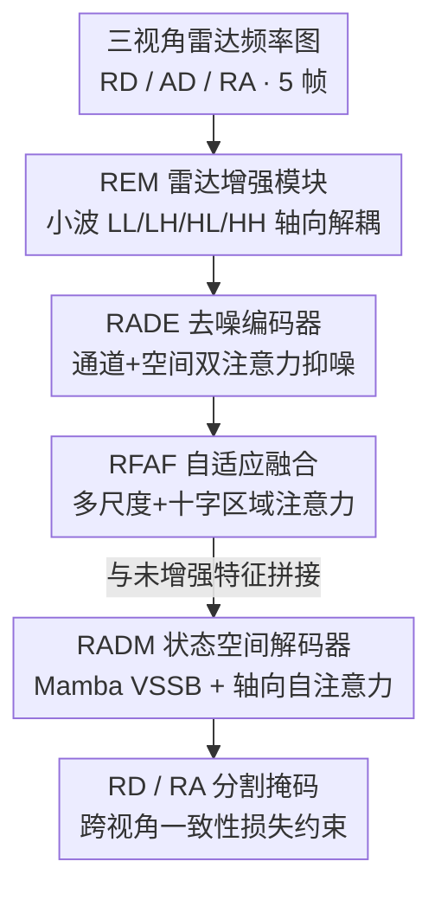

# MARSS: Radar Semantic Segmentation via Modular Attention and State Space Models

**会议**: CVPR 2026  
**论文**: [CVF Open Access](https://openaccess.thecvf.com/content/CVPR2026/html/Chen_MARSS_Radar_Semantic_Segmentation_via_Modular_Attention_and_State_Space_CVPR_2026_paper.html)  
**领域**: 语义分割  
**关键词**: 雷达语义分割, 各向异性, 状态空间模型(Mamba), 轴向注意力, 多视角融合

## 一句话总结
针对雷达频率图"各向异性、多尺度、稀疏噪声"三大特性，MARSS 用三个为雷达量身定制的模块（去噪编码 RADE、自适应多尺度融合 RFAF、Mamba+轴向注意力的状态空间解码 RADM）替换通用 CNN/Transformer 算子，在 CARRADA 上以 9.3M 参数把 RA 视角 mIoU 从 44.3% 提到 46.97%，对小而快目标尤其鲁棒。

## 研究背景与动机

**领域现状**：雷达语义分割（RSS）的输入不是 RGB 图像，而是 FMCW 毫米波雷达经 FFT 得到的频率域图（Range-Doppler、Range-Angle、Angle-Doppler 等视角）。它在恶劣天气、低能见度下比相机鲁棒，因此在自动驾驶和机器人感知里越来越重要。主流做法是把相机图像的分割管线（U-Net、DeepLab、各类 Transformer）直接搬过来，或把雷达回波投影成点云再用稀疏 3D CNN 处理。

**现有痛点**：这些为自然图像设计的架构在雷达上水土不服。雷达频率图有三个相机图像没有的特性：一是**各向异性**——横轴和纵轴代表不同的物理量（距离 vs 速度），同一个目标沿 range 和 Doppler 方向的纹理形态完全不同，而自然图像的纹理是各向同性的，普通卷积的方形感受野无法处理这种方向性失衡；二是**多尺度**——大而慢的目标在 range 上铺得宽、在 Doppler 上很窄（低频宽块），小而快的目标则在 range 上很尖、在 Doppler 上拖出长条（高频条纹），固定感受野顾此失彼；三是**稀疏 + 强噪声**——FFT 图绝大多数像素是黑背景，只有零星峰值是真实反射，叠加 speckle 噪声和多径伪影，信噪比极低，小目标常常只比噪声地板高一点点。

**核心矛盾**：通用视觉骨干隐含的归纳偏置（各向同性纹理、稠密语义、固定感受野）和雷达数据的物理特性（方向性、稀疏峰值、动态范围大）根本对不上，于是在最难的 RA 视角和小快目标上掉点严重。

**本文目标**：不是再堆一个更大的通用网络，而是把"各向异性解耦、噪声抑制、多尺度区域选择、长程依赖建模"这些雷达专属先验，分别嵌进编码、特征融合、解码三个阶段。

**核心 idea**：用一组"雷达专用算子"替换通用算子——小波变换做轴向频带解耦、CBAM 式双注意力做去噪、十字形区域注意力做多尺度方向选择、Mamba 状态空间模型配轴向自注意力做各向异性长程解码，让每个阶段都带上雷达感知的归纳偏置。

## 方法详解

### 整体框架
MARSS 是一个编码器-解码器架构，但在每个阶段都塞进了雷达专用模块。输入是雷达频率图的**三个透视视角**（Range-Doppler、Angle-Doppler、Range-Angle），各走一条独立分支；输出是 RD 和 RA 两个视角的语义分割掩码（4 类：行人、骑车人、车、背景）。每条分支先用 REM 做小波轴向解耦、再经 RADE 去噪编码，中间层用 RFAF 做多尺度区域融合并与未增强特征拼接，最后送入 RADM 解码器用状态空间模型重建掩码。整条管线为了利用时序，输入是连续 5 帧。

### 关键设计

**1. REM：用小波变换把各向异性"按方向"拆开**

雷达图的各向异性意味着横向（Doppler）和纵向（range）的频率内容截然不同，但普通卷积用方形核一视同仁地混着处理，无法分别建模。REM（Radar Enhancement Module）借 2D 离散小波变换（DWT）天然的多分辨率、多方向能力来解决：DWT 把信号分解成 LL（低频）、LH、HL（水平/垂直高频）、HH（对角高频）四个子带，每个分支只专注一个子带的雷达特性。具体地，LL 分支用 $1\times1$ 卷积提供全局低频信息，HH 分支再加 $3\times3$ 卷积建模对角高频；关键是 LH 分支先用竖向 $1\times3$ 轴向卷积抓垂直低频、再接横向 $3\times1$ 卷积聚合水平高频，HL 分支做相反的顺序。这种"轴向可分离卷积 + 子带分流"让网络在编码和融合阶段就把方向性信息解耦开，而不是等到后面再被迫从混杂特征里硬分。

**2. RADE：通道+空间双注意力做"先去噪再编码"**

雷达频谱低信噪比、杂波呈各向异性分布，既有通道层面的失真（某些接收机/频段被干扰、多径衰落），也有空间层面的杂波，如果不先压噪直接编码，后续层学到的全是被污染的特征。RADE（Radar-Aware Denoising Encoder）插在 REM 之后，用 CBAM 式的双注意力做两步净化。先做通道校准，用 squeeze-and-excitation 风格的权重压低被噪声主导的通道：

$$X_c = \sigma_{sig}\big(f_{MLP}(\text{GAP}(X))\big) \odot X$$

其中 GAP 抽取全局频谱统计、$f_{MLP}$ 输出通道重要性系数，作用是稳定那些受干扰或多径衰落影响的频率 bin。再做空间注意力，从通道聚合的描述子里算出空间掩码，凸显距离-多普勒网格里几何有意义的区域：

$$X_s = \sigma_{sig}\big(\text{Conv}_{7\times7}([\text{AvgPool}; \text{MaxPool}](X_c))\big) \odot X_c$$

这一步强化的是目标边界、微动条纹这类对分割至关重要的局部反射结构。两步串起来——通道注意力压住接收机/频段层面的不稳定，空间注意力在杂波中强调连贯的目标形态——让送进 3D CNN 编码器的是一份低噪、保结构的特征，而不是原始的噪声图。

**3. RFAF：多尺度融合 + 十字形区域注意力，专治"大慢/小快共存"**

中间层的雷达特征同时包含多种尺度模式（宽低频块和尖高频条纹），既要跨尺度处理又要对重要区域加权。RFAF（Radar Feature Adaptive Fusion）先用 atrous/池化层在多个分辨率上抽特征融成 $x_{fused}$，然后分两个并行阶段处理。**多尺度融合阶段**把 $x_{fused}$ 送进通道注意力分支（GAP→$1\times1$ 瓶颈→ReLU→$1\times1$ 扩张→sigmoid 得 $ch_{attn}$）和空间注意力分支（$7\times7$ 卷积+sigmoid 得 $sp_{attn}$），两路调制后逐元素相加再 $1\times1$ 融合。**区域注意力阶段**是为雷达各向异性专门加的：它把水平和垂直邻域分开处理，形成一个十字形感受野，一个分支做区域级注意力、另一个做多尺度膨胀，拼接后投影回 C 通道：

$$Y = g\big([\,\text{RegAtt}(X_{c+s}) \,\|\, \text{MS-Dilated}(X_{c+s})\,]\big)$$

这种注意力堆叠显式地捕捉雷达谱里常见的方向模式——水平的多普勒拖尾、纵向拉长的距离响应、小目标斑点——让网络按每个区域的各向异性区别对待，从而在重叠的各向异性谱里把不同频带和空间模式分离开。这正是 RFAF 在最难的 RA 视角带来 +3.66% mIoU 的原因。

**4. RADM：Mamba 状态空间 + 轴向自注意力做各向异性解码**

解码阶段要在重建掩码的同时处理各向异性和长程依赖。普通解码器的全局注意力会把 range 和 Doppler 轴的信息混在一起算，既贵又破坏方向结构。RADM（Radar State Space Decoder）把输入 $(B, C, H, W)$ 拆成几条捕捉不同交互的分支：**空间分支**重排成 $(B\times W, H, C)$、线性降到 $c_1$ 通道，先用基于 Mamba 的视觉状态空间块 VSSB 做局部空间-通道交互（选择性状态空间机制能聚焦重要特征且保持线性复杂度），再沿剩余轴做轴向自注意力 ASA 建长程依赖；**Doppler 分支**则把高度轴展平成 $(B\times H, W, C)$、降到 $c_2$ 通道后同样走 VSSB+轴向注意力。如此一来，range 轴和 Doppler 轴的依赖被分别建模，而不是被全局注意力搅成一团。三条分支（通道 $c_1, c_2, c_1$）拼成 $(B, 2c_1+c_2, H, W)$，用 $1\times1$ 卷积融回 C 通道并加残差。状态空间模型负责长序列特性下的线性复杂度高效建模、轴向注意力负责分轴向处理各向异性、多分支结构提供互补的多维上下文——这套组合是消融里单模块贡献最大的一项（RA 视角 +4.29% mIoU）。

### 损失函数 / 训练策略
每个视角的损失结合加权交叉熵、Dice 损失和时序一致性损失。整体损失把 RD、RA 两视角的各项加权求和：

$$L = \lambda_{wCE}\big(L^{RD}_{wCE} + L^{RA}_{wCE}\big) + \lambda_{SDice}\big(L^{RD}_{SDice} + L^{RA}_{SDice}\big) + \lambda_{CoL}L_{CoL}$$

其中加权交叉熵的类别权重 $w_k$ 与训练集类别频率成反比，缓解雷达数据里背景占绝大多数的类别不平衡。跨视角一致性损失约束 RD 和 RA 预测在共享维度聚合后的一致：

$$L_{CoL}(p_{RD}, p_{RA}) = \|\hat{p}_{RD} - \hat{p}_{RA}\|^2_F$$

$\hat{p}_{RD}$、$\hat{p}_{RA}$ 是沿各自非共享轴（Doppler 或 angle 维）做 $\max(\cdot)$ 聚合后的特征图。这一项强迫网络利用雷达频率图的多维结构、提升跨视角一致性。训练用 Adam、初始学习率 0.0001、指数退火、300 epoch、batch size 3，在两块 RTX 3090 上完成。

## 实验关键数据

### 主实验
在 CARRADA（FMCW 毫米波雷达，4 类，256×256×64 的 RAD 张量）上，按与前作一致的划分做严格对比：

| 数据集 | 视角/指标 | MARSS | 之前SOTA(AdaPKCξ-NetFiT) | 提升 |
|--------|-----------|-------|--------------------------|------|
| CARRADA | RD mIoU | 63.26% | 62.10% | +1.16% |
| CARRADA | RD mDice | 75.18% | 74.00% | +1.18% |
| CARRADA | RA mIoU | 46.97% | 44.30% | +2.67% |
| CARRADA | RA mDice | 58.78% | 55.50% | +3.28% |
| CARRADA-RAC | Global mIoU | 55.2% | 54.8% | +0.4% |
| CARRADA-RAC | RA mIoU | 49.0% | 48.8% | +0.2% |

最大增益落在最难的 RA 视角（+2.67% mIoU），正对应论文主张的"通用方法在 range/angle 方向性失衡上吃亏"。参数量只有 9.3M，远小于 T-RODNet 的 162.0M，却效果更好，体现的是模块设计而非堆参数。

### 消融实验
Table 3 在 CARRADA 上逐个开关 RADE/RFAF/RADM（基线为三个都不用）：

| 配置 (RADE/RFAF/RADM) | RD mIoU | RA mIoU | 说明 |
|------------------------|---------|---------|------|
| baseline（全关） | 61.16% | 41.04% | 通用编解码 |
| 仅 RADE | 62.35% | 41.57% | RD +1.19%，去噪主要帮 RD |
| 仅 RFAF | 62.45% | 44.70% | RA +3.66%，多尺度方向选择 |
| 仅 RADM | 62.52% | 45.33% | RA +4.29%，单模块最强 |
| RADE+RFAF | 62.89% | 45.33% | 两模块最佳 RA |
| 全开 (Full) | 63.26% | 46.97% | 比最佳两模块再 +1.64% RA |

### 关键发现
- **RADM 单模块贡献最大**：仅用 RADM 就把 RA mIoU 拉高 +4.29%，验证 Mamba 状态空间 + 轴向注意力对各向异性长程依赖的建模确实是核心；RADE 单独主要提升 RD（+1.19%），因为去噪对噪声主导的 RD 谱更关键。
- **三模块互补、缺一不可**：完整 MARSS 在 RA 上比最强的两模块组合再涨 +1.64%，说明噪声抑制（RADE）、多尺度区域选择（RFAF）、方向依赖建模（RADM）分别对应不同的雷达难点，合起来才覆盖完整。
- **小而快目标更鲁棒**：这类目标在谱图里是尖锐高频条纹，MARSS 比基线能更好地把它们从背景杂波和 speckle 伪影里分出来，掩码时序也更一致。
- **效率高**：9.3M 参数对比 T-RODNet 的 162.0M，得益于 RADM 的线性复杂度状态空间机制，避免了全局注意力的二次代价。

## 亮点与洞察
- **"按物理量定制算子"的思路很干净**：不是把雷达图当成奇怪的图像硬塞通用网络，而是承认 range/Doppler/angle 是不同物理量、用小波轴向解耦 + 轴向卷积/注意力分轴向处理，这套"把各向异性当一等公民"的做法可迁移到任何多物理量的频谱/张量数据（如声呐、超声、时频谱）。
- **Mamba 用对了地方**：状态空间模型的线性复杂度恰好匹配雷达数据"长序列 + 稀疏峰值"的特性，配轴向注意力分别建 range/Doppler 依赖，既省算力又保住方向结构——这是参数量小但 RA 涨点多的直接来源。
- **跨视角一致性损失是巧妙的免费监督**：RD 和 RA 是同一场景的不同投影，用 $\max$ 聚合后做 Frobenius 距离约束，等于让两视角互相校验，不需要额外标注就提升一致性。

## 局限与展望
- **只在 CARRADA / CARRADA-RAC 两个数据集验证**：都是 4 类、同一采集设备，泛化到其他雷达型号、更多类别、更复杂场景（多目标密集、强多径）尚未验证。
- **模块偏"组装"**：REM/RADE/RFAF/RADM 大多是把已有思想（小波、CBAM、区域注意力、Mamba、轴向注意力）按雷达特性重新搭配，单个组件的新颖性有限，贡献主要在"针对雷达的系统化适配"。
- **三视角三分支带来的开销**：虽然总参数 9.3M 不大，但三视角并行 + 5 帧时序输入的实际推理延迟、显存占用论文未给出，部署到车载实时系统的代价不明。
- **改进方向**：可探索把三视角融合从拼接升级为可学习的跨视角注意力；或把时序一致性从损失项提升为显式的时序状态传播（让 Mamba 跨帧建模）。

## 相关工作与启发
- **vs AdaPKC / PeakConv 系列**：它们用雷达定制算子强调峰值响应和时序连贯，是 RSS 的强 baseline；MARSS 不只盯峰值，而是显式解耦方向分量（小波 + 轴向 + 区域注意力），在最难的 RA 视角上比 AdaPKCξ-NetFiT 高 +2.67% mIoU。
- **vs TransRSS / TransRadar（Transformer 类）**：它们靠全局注意力建上下文、多视角融合做跨视角一致，但全局注意力会把各向异性轴混算且复杂度高；MARSS 用 Mamba 状态空间替代全局注意力的长程建模，线性复杂度且分轴向，9.3M 参数即超过它们。
- **vs RAMP-CNN / RSS-Net（CNN 类）**：早期把图像/点云管线搬到雷达，固定感受野无法应对多尺度方向内容；MARSS 的 RFAF 用十字形区域注意力 + 多尺度膨胀直接针对这点，RA 视角单模块就 +3.66%。

## 评分
- 新颖性: ⭐⭐⭐⭐ 单组件多为已有思想重组，但"按雷达物理特性系统化定制三阶段算子"的整体设计成立且自洽
- 实验充分度: ⭐⭐⭐ CARRADA + CARRADA-RAC 充分对比 + 完整三模块消融，但仅两数据集、缺延迟/显存实测
- 写作质量: ⭐⭐⭐⭐ 动机与雷达特性的对应关系讲得清楚，模块设计目标明确，公式齐全
- 价值: ⭐⭐⭐⭐ 9.3M 参数刷新 CARRADA RA 视角 SOTA，对小快目标鲁棒，对雷达感知工程有直接参考价值

<!-- RELATED:START -->

## 相关论文

- [\[CVPR 2026\] RS-SSM: Refining Forgotten Specifics in State Space Model for Video Semantic Segmentation](rs-ssm_refining_forgotten_specifics_in_state_space_model_for_video_semantic_segm.md)
- [\[CVPR 2026\] Semantic Alignment in Hyperbolic Space for Open-Vocabulary Semantic Segmentation](semantic_alignment_in_hyperbolic_space_for_open-vocabulary_semantic_segmentation.md)
- [\[CVPR 2025\] Exploiting Temporal State Space Sharing for Video Semantic Segmentation](../../CVPR2025/segmentation/exploiting_temporal_state_space_sharing_for_video_semantic_segmentation.md)
- [\[CVPR 2026\] RAVEN: Radar Adaptive Vision Encoders for Efficient Chirp-wise Object Detection and Segmentation](raven_radar_adaptive_vision_encoders_for_efficient_chirp-wise_object_detection_a.md)
- [\[CVPR 2026\] SAMosaic3D: Modular Scene Assembly for Real-Time 3D Segment Anything](samosaic3d_modular_scene_assembly_for_real-time_3d_segment_anything.md)

<!-- RELATED:END -->
