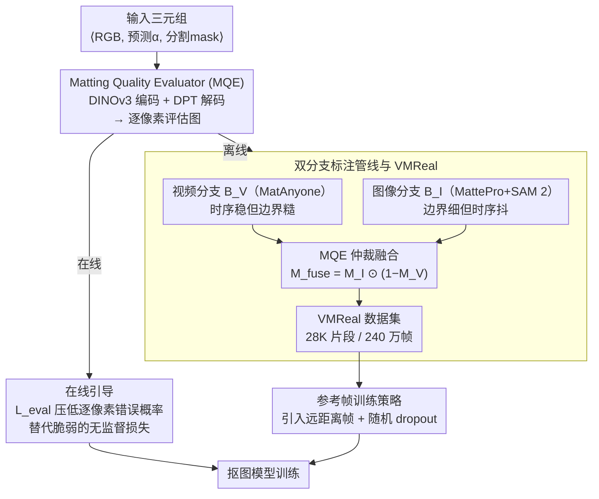

<!-- 由 src/gen_stubs.py 自动生成 -->
# MatAnyone 2: Scaling Video Matting via a Learned Quality Evaluator

**会议**: CVPR2026  
**arXiv**: [2512.11782](https://arxiv.org/abs/2512.11782)  
**代码**: [项目主页](https://pq-yang.github.io/projects/MatAnyone2/)  
**领域**: 语义分割 / 视频抠图  
**关键词**: video matting, quality evaluator, alpha matte, dataset curation, reference-frame strategy

## 一句话总结

提出学习型 Matting Quality Evaluator (MQE)，在无 ground-truth 条件下逐像素评估 alpha 质量，既作为在线训练引导又作为离线数据筛选器，构建了 28K 片段 / 240 万帧的真实世界视频抠图数据集 VMReal，配合参考帧训练策略，显著超越所有现有方法。

## 背景与动机

1. **视频抠图数据稀缺**：最大的视频抠图数据集 VM800 仅有 826 个序列，约为 SAM 2 所用 VOS 数据集的 1/60，严重限制模型训练。
2. **合成数据存在域差距**：传统通过 RGBA 混合将前景合成到随机背景上，导致光照不一致和边界不自然，泛化到真实场景时效果下降。
3. **分割预训练后抠图退化**：利用分割模型/数据预训练后在抠图数据上微调，由于高质量抠图数据过少，分割能力在微调后反而退化。
4. **联合训练的边界监督薄弱**：MatAnyone 等方法在非边界区域使用分割标签、在边界区域使用无监督损失，后者假设过强，导致预测 alpha 退化为分割 mask。
5. **边界细节与语义精度难以兼顾**：现有方法在抠图精度和分割精度之间做取舍，无法同时提升。
6. **长视频外观剧烈变化**：基于传播的方法在训练窗口有限时无法建模人物外观的大幅度变化（如新出现的衣物/身体部位）。

## 方法详解

### 整体框架

MatAnyone 2 想解决的根本问题是视频抠图数据太少、且没有 alpha 真值就无法判断预测质量。它的核心是一个学习型质量评估器 MQE（Matting Quality Evaluator）：输入 RGB 帧、预测 alpha 和分割 mask 的三元组 $\langle I_{rgb}, \hat{\alpha}, M^{seg} \rangle$，输出逐像素二值评估图 $M^{eval} \in \{0,1\}^{H \times W}$（1=可靠、0=错误）。围绕 MQE，论文同时打通了在线与离线两条路：在线时用它给抠图训练实时提供边界监督，离线时用它当质量仲裁器，融合视频与图像抠图模型的互补优势、自动筛出一个 28K 片段 / 240 万帧的真实数据集 VMReal，再配合参考帧训练策略建模长视频里的大幅外观变化。

### 关键设计

**1. Matting Quality Evaluator（MQE）：没有 alpha 真值也能逐像素判断质量**

抠图标注的最大瓶颈是高质量 alpha 真值极其稀缺，无从评估预测好坏。MQE 用预训练 DINOv3 当编码器提特征、DPT 解码器输出评估图，绕开了对真值的依赖：训练标签基于 P3M-10k 图像抠图数据集，在局部 patch 内用 MAD 和 Grad 两个度量算预测 $\hat{\alpha}$ 与 $\alpha_{gt}$ 的差异 $\mathcal{D}(\cdot)$，阈值化后得到二值监督；由于可靠区域远多于错误区域，训练用 Focal Loss 缓解正负类不均衡。训练好后，MQE 推理时只需 RGB、预测 alpha 和分割 mask 就能逐像素标出哪里可靠、哪里出错，这正是后面在线引导和离线筛选都能成立的前提。

**2. 在线引导：给边界区域换上比无监督损失更靠谱的信号**

MatAnyone 这类方法在边界区域用无监督损失，假设过强，结果预测 alpha 容易退化成分割 mask。在线模式下直接把 MQE 接进训练回路：以 MQE 输出的逐像素错误概率图 $P^{(0)}_{eval}$ 构造引导损失

$$\mathcal{L}_{eval} = \|P^{(0)}_{eval}\|_1$$

鼓励网络压低每个像素的错误概率。相比原来的无监督损失，它为边界和核心区域提供了动态、更稳定的学习信号，从源头上抑制了 alpha 向分割 mask 退化。

**3. 双分支标注管线与 VMReal：用 MQE 当仲裁融合两种模型的长短板**

合成数据有域差、真实数据又稀缺。这里让 MQE 在离线当质量仲裁器，融合两条互补分支：

| 分支 | 模型 | 优势 | 劣势 |
|------|------|------|------|
| $B_V$（视频分支） | MatAnyone | 时序稳定、语义一致 | 边界细节不足 |
| $B_I$（图像分支） | MattePro + SAM 2 | 边界锐利、细节丰富 | 时序不稳定 |

MQE 分别评估两分支的 alpha 得到 $M_V^{eval}$、$M_I^{eval}$，构造融合掩码 $M^{fuse} = M_I^{eval} \odot (1 - M_V^{eval})$——也就是"图像分支可靠、而视频分支不可靠"的那些像素，经高斯模糊平滑后按

$$\alpha = \alpha_V \odot (1 - M^{fuse}) + \alpha_I \odot M^{fuse}$$

混合：时序稳的地方信视频分支、边界细的地方信图像分支。由此自动筛出 VMReal 数据集，约 28K 片段、240 万帧，其中 4.5K 高质量片段为 1080p（含丰富头发细节），其余来自 SA-V 人物子集（720p），规模比此前最大的 VM800 大约 35 倍。

**4. 参考帧训练策略：不加显存也能建模长视频外观大变化**

基于传播的方法训练窗口有限（这里是 8 帧），无法覆盖长视频里新出现的衣物、身体部位等大幅外观变化。策略是在训练窗口之外额外引入一帧远距离参考帧写入记忆库，模拟这种长时变化；同时配合随机 dropout 增强（随机遮挡 RGB 和 alpha 的局部 patch），减少模型对历史记忆的过度依赖。它通过"引入远距离帧"而非"加长训练序列"来建模长时变化，几乎不增加显存。

## 实验关键数据

### 合成基准 VideoMatte (1920×1080)

| 方法 | MAD↓ | MSE↓ | Grad↓ | dtSSD↓ |
|------|------|------|-------|--------|
| MatAnyone | 4.24 | 0.33 | 4.00 | 1.19 |
| GVM (扩散先验) | 6.33 | 2.08 | 8.04 | 1.59 |
| MaGGIe (逐帧mask) | 4.42 | 0.40 | 4.03 | 1.31 |
| **MatAnyone 2** | **4.10** | **0.28** | **3.45** | **1.15** |

### 真实基准 CRGNN (手工标注)

| 方法 | MAD↓ | MSE↓ | Grad↓ | dtSSD↓ |
|------|------|------|-------|--------|
| MatAnyone | 5.76 | 3.04 | 15.55 | 5.44 |
| GVM | 5.03 | 2.15 | 14.28 | 4.86 |
| **MatAnyone 2** | **4.24** | **2.00** | **11.74** | **4.54** |

### 消融实验 (YoutubeMatte 1920×1080)

| 配置 | MAD↓ | MSE↓ | Grad↓ | dtSSD↓ |
|------|------|------|-------|--------|
| (a) 基线 MatAnyone | 1.99 | 0.71 | 8.91 | 1.65 |
| (b) +在线引导 $\mathcal{L}_{eval}$ | 1.90 | 0.62 | 8.20 | 1.63 |
| (c) +VMReal | 1.76 | 0.61 | 7.65 | 1.54 |
| (d) +参考帧策略 | **1.61** | **0.50** | **7.13** | **1.53** |

三个组件逐步叠加均有一致提升，相比基线 MAD 降低 19.1%、Grad 降低 20.0%。

## 亮点

- **MQE 一石二鸟**：同一评估器既提供在线训练信号又用于离线数据筛选，设计优雅
- **无需 GT 的质量评估**：MQE 仅需分割 mask 即可逐像素判断 alpha 质量，突破了抠图标注的瓶颈
- **首个大规模真实世界视频抠图数据集**：VMReal 28K 片段 / 240 万帧，比 VM800 大 35 倍
- **纯 CNN 超越扩散方法**：不依赖视频扩散先验，仅需首帧 mask 即超越 GVM 等扩散方法
- **参考帧策略零额外显存**：通过引入远距离帧而非加长训练序列来建模长时变化

## 局限与展望

- MQE 训练依赖静态图像抠图数据集 P3M-10k，可能对极端场景（如透明材质、烟雾）泛化不足
- 双分支标注管线的质量上限受限于 MatAnyone 和 MattePro，若基础模型失败则 MQE 也无法修复
- VMReal 仅聚焦人物抠图，未覆盖动物/物体等非人类场景
- 论文未讨论推理速度和实时性，纯 CNN 的效率优势未量化
- 参考帧策略的 dropout 比例等超参数对性能的敏感度未充分分析

## 与相关工作的对比

| 维度 | MatAnyone | GVM | MaGGIe | MatAnyone 2 |
|------|-----------|-----|--------|-------------|
| 骨干网络 | CNN (SAM 2 基) | 视频扩散模型 | CNN | CNN (SAM 2 基) |
| 输入引导 | 首帧 mask | 无 | 逐帧 instance mask | 首帧 mask |
| 边界监督 | 无监督损失 | 扩散先验 | 分割标签 | MQE 在线引导 |
| 训练数据 | VM800 + 分割数据 | VM800 + 4K渲染 | VM800 | VMReal (28K clips) |
| 长视频处理 | 局部窗口记忆 | 无 | 无 | 参考帧策略 |

## 评分

- 新颖性: ⭐⭐⭐⭐ — MQE 的 online/offline 双模式使用方式和自动标注管线设计新颖
- 实验充分度: ⭐⭐⭐⭐⭐ — 合成+真实基准全覆盖，逐组件消融清晰完整
- 写作质量: ⭐⭐⭐⭐ — 结构清晰，图示直观，动机阐述充分
- 价值: ⭐⭐⭐⭐⭐ — VMReal 数据集和 MQE 方法论对视频抠图领域有重要推动作用

<!-- RELATED:START -->

## 相关论文

- [\[CVPR 2025\] MatAnyone: Stable Video Matting with Consistent Memory Propagation](../../CVPR2025/segmentation/matanyone_stable_video_matting_with_consistent_memory_propagation.md)
- [\[CVPR 2026\] VideoMaMa: Mask-Guided Video Matting via Generative Prior](videomama_mask-guided_video_matting_via_generative_prior.md)
- [\[CVPR 2026\] Towards High-Quality Image Segmentation: Improving Topology Accuracy by Penalizing Neighbor Pixels](towards_high-quality_image_segmentation_improving_topology_accuracy_by_penalizin.md)
- [\[CVPR 2026\] VidEoMT: Your ViT is Secretly Also a Video Segmentation Model](videomt_your_vit_is_secretly_also_a_video_segmentation_model.md)
- [\[CVPR 2026\] 3M-TI: High-Quality Mobile Thermal Imaging via Calibration-free Multi-Camera Cross-Modal Diffusion](3m-ti_high-quality_mobile_thermal_imaging_via_calibration-free_multi-camera_cros.md)

<!-- RELATED:END -->
