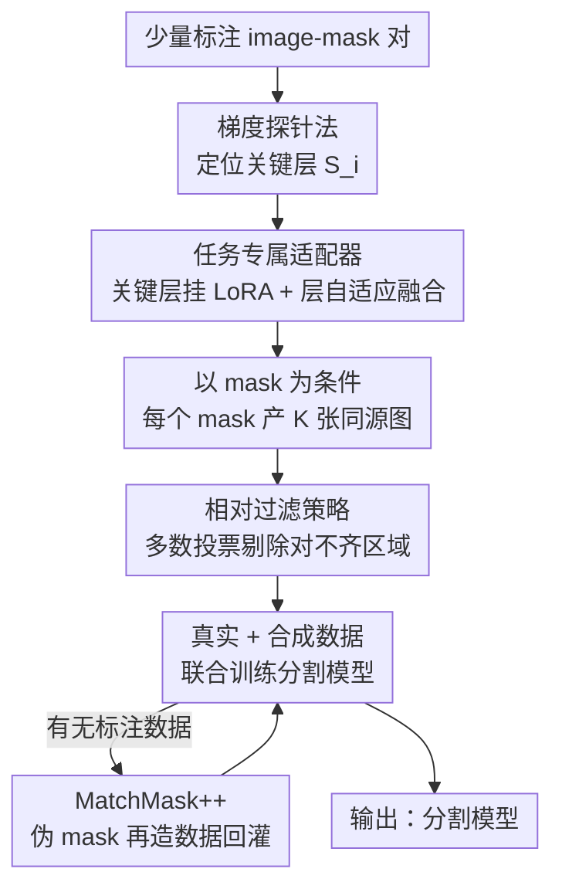

# MatchMask: Mask-Centric Generative Data Augmentation for Label-Scarce Semantic Segmentation

**会议**: CVPR 2026  
**论文**: [CVF Open Access](https://openaccess.thecvf.com/content/CVPR2026/html/Lin_MatchMask_Mask-Centric_Generative_Data_Augmentation_for_Label-Scarce_Semantic_Segmentation_CVPR_2026_paper.html)  
**代码**: 有（论文称已开源，链接见原文）  
**领域**: 语义分割 / 半监督  
**关键词**: 生成式数据增强, mask-to-image, 标注稀缺, 扩散模型, LoRA

## 一句话总结
MatchMask 只用极少量带标注的 mask，先用「梯度探针」找出扩散模型里真正负责空间控制的少数关键层，再给这些层挂一个 0.7M 参数的 LoRA 适配器做 mask-to-image 合成，并用「相对过滤」剔除合成图里对不齐的噪声区域，从而在标注稀缺场景下把语义分割性能显著拉高（VOC 1/8 标注下 +6.8% mIoU）。

## 研究背景与动机
**领域现状**：语义分割极度依赖逐像素人工标注，成本高到很多场景根本标不起。生成式数据增强（GDA）想用生成模型批量造「图像-mask 对」来扩充训练集。现有 GDA 主流是**文本中心**（text-centric）的：DiffuMask、Dataset Diffusion、DatasetDM 等靠精心设计的文本 prompt 配合扩散模型的 cross-attention 来同时产图和产 mask。

**现有痛点**：文本中心范式有两个硬伤。其一，文字描述无法精确传达复杂场景的空间布局，生成的图常出现物体缺失、关系错乱，分布与真实数据不一致；其二，由此产出的图像-mask 对经常对不齐（论文 Fig.1 的 table 类就是例子），相当于给分割模型喂了错误监督。另一条路线是**mask 中心**（mask-centric），用 dense map（如分割 mask）直接控制生成，对齐质量好得多——但 FreeMask（微调整个 U-Net，约 850M 可训练参数）和 SegGen（ControlNet 加任务分支，约 360M 参数）都是为**全监督**设计的，需要大量标注来撑住这么大的可训练参数量。

**核心矛盾**：mask 中心范式对齐好但参数量大，一旦标注稀缺就会严重过拟合（论文 Fig.2 显示 FreestyleNet 在少样本下生成图丢失了预训练先验、多样性崩塌）。也就是说，「mask 控制带来的高对齐」和「少样本下不过拟合」之间存在直接冲突。

**切入角度**：作者的观察是——**并非所有参数都对 mask-to-image 这个任务重要**。如果只有一小撮层真正负责把 mask 的空间信息注入生成，那就只去适配这一小撮层，可训练参数就能压到极小，自然不会在少样本下过拟合。论文进一步发现这些关键层是**跨数据集一致的**（dataset-agnostic），说明这个稀疏结构是任务固有的、可被先验利用的。

**核心 idea**：用「梯度探针定位关键层 + 在关键层上挂轻量 LoRA」把 mask 中心 GDA 搬进标注稀缺场景，再用「相对过滤」把合成数据里对不齐的区域屏蔽掉，避免脏监督。

## 方法详解

### 整体框架
MatchMask 是一条「先训一个轻量 mask-to-image 生成器 → 用它批量造数据 → 拿增强数据训分割模型」的四阶段流水线，目标是在只有少量标注 mask 的前提下，造出又多样、又真实、又对齐的图像-mask 对。

第一阶段，在少样本设置下训练语义图像合成模型：用梯度探针找到扩散模型里对空间控制最关键的层，只在这些层上挂 LoRA 适配器（配合 layer-adaptive cross-attention fusion），冻住其余参数。第二阶段，用训好的生成器以给定 mask 为条件批量产图，每个 mask 产 K 张同源图，经相对过滤剔除噪声区域后得到干净的图像-mask 对。第三阶段，把合成数据与真实数据联合训练分割模型。第四阶段（可选，即 MatchMask++）在半监督场景下，用前面训好的分割模型对无标注图产伪 mask，再喂回生成器造更多数据，进一步增益。

### 关键设计

**1. 梯度探针法（Gradient Probe Method）：用极少样本定位「真正管空间控制」的少数层**

痛点是直接微调整个 U-Net（FreestyleNet）或大控制分支（ControlNet）在少样本下必然过拟合，但又不知道到底该只调哪些层。作者借鉴模型剪枝里「并非所有参数都对下游任务必要」的结论，提出用**训练中的梯度量级**来给每层打分。考虑到单步梯度不稳，他们以 epoch 为单位统计每层参数的整体变化，定义层重要性分数

$$S_i = \frac{\|\theta_i - \theta_i'\|}{\|\theta_i'\|},$$

其中 $\theta_i'$ 是预训练模型第 $i$ 层的原始参数、$\theta_i$ 是微调后的参数，分数高说明该层为完成 mask-to-image 任务被「拽动」得多、因而更关键。实测（Fig.3/5/6）发现只有少数层分数突出，且这些显著层**跨 ADE 与 VOC 数据集一致**；进一步看，时间相关层和 cross-attention 层优先级最高，U-Net 首尾几个**高分辨率** block 比中间低分辨率 block 重要得多——这很合理，因为高分辨率特征图保留了足够的空间信息，最适合做基于 mask 的 rectified cross-attention。这一步把「该适配谁」从拍脑袋变成了有数据支撑的筛选，是后面能压到 0.7M 参数的前提。

**2. 任务专属适配器 + 层自适应交叉注意力融合：在关键层上做参数极省、还能自动调强弱的注入**

定位到关键层后，作者没有直接微调这些层，而是给它们挂 **LoRA** 风格的低秩适配器，理由有二：一是比微调部分层更省参（最终只有 0.7M 可训练参数），二是 LoRA 本身有正则效果，能在少样本下抑制过拟合、促进泛化。这直接化解了「mask 控制要对齐、又不能在少样本下过拟合」的核心矛盾——可训练参数小两三个数量级，自然就稳了。

回顾 mask 中心生成的机制：FreestyleNet 用分割 mask 去「修正」cross-attention，把每个概念的注意力强行限制在对应区域。记 $A=\frac{QK^T}{\sqrt d}$，rectified 注意力为

$$\hat{A}^k_{i,j} = \begin{cases} A^k_{i,j}, & M^k_{i,j}=1 \\ -\infty, & M^k_{i,j}=0 \end{cases}$$

即 mask 外的位置被置 $-\infty$、softmax 后归零。但作者从 Fig.5 观察到**同一类参数在不同 block 里对空间控制的影响并不一样**，一刀切地用 rectified 注意力会丢掉全局上下文。于是引入**层自适应融合**：每个 cross-attention block 的输入先过一个线性层预测融合系数 $\alpha$，再把原始注意力 $\text{Attn}_{ori}$（式 1）和修正注意力 $\text{Attn}_{rec}$（式 2）按层动态混合：

$$\text{Attention} = \alpha\,\text{Attn}_{ori} + (1-\alpha)\,\text{Attn}_{rec}.$$

这样每个 token 既能跟局部空间 mask 对齐、又能保留全局语境，让该强约束的层强约束、该留余地的层留余地，从而合成出细节更高质量的图。

**3. 相对过滤策略（Relative Filtering）：靠「同源图互相投票」剔除对不齐的脏区域**

即便用了上面的生成器，合成图仍会有瑕疵（如背景冒出莫名物体、外观失真），这些区域会污染分割训练。常规做法是拿分割模型 softmax 置信度过滤低置信像素，但它**依赖一个训得好的分割模型**——在数据稀缺时这个模型本身不可靠，还会因 confirmation bias 累积错误监督。作者的洞察是：同一个 mask 生成的 $K$ 张**同源图**理应给出一致的预测，于是用「相对差异」而非绝对置信度来找离群。具体地，给定语义 mask $SM$ 产 $K$ 张图，各自用分割模型预测伪 mask $PM_k$，再逐像素**多数投票**得到原型

$$\hat{PM}(i,j) = \arg\max_{c} \sum_{k=1}^{K} \mathbb{1}\{PM_k(i,j)=c\},$$

然后把第 $k$ 张图中与原型不一致的像素标为 255（忽略）：

$$SM^{filtered}_k(i,j) = \begin{cases} SM(i,j), & PM_k(i,j)=\hat{PM}(i,j) \\ 255, & \text{else} \end{cases}$$

这种投票式过滤不依赖单个模型的绝对置信，能把诸如「凭空多出的狗爪、冗余的羊」之类不一致区域屏蔽掉，对 confirmation bias 更鲁棒。

**4. MatchMask++：把范式无缝扩到半监督，用伪 mask 二次造数据**

当还有额外无标注数据时，作者不重训生成器，而是用「在标注数据（已被 MatchMask 增强）上训好的分割模型」给无标注图打**伪 mask**，再把这些伪 mask 喂回适配后的生成器去造图像-mask 对。关键点有两个：其一，Adapter 无需重训，直接复用；其二，即便伪 mask 有噪声，mask-to-image 模型也能让生成图与这些（哪怕带噪的）mask 对齐（Fig.7b），所以产出的对仍然质量高、监督有效。这等于把「无标注数据」也变成了可用的高质量合成监督来源。

### 损失函数 / 训练策略
mask-to-image 用 Stable Diffusion V1-4 作预训练模型，只微调 Adapter，batch size 4，训 100k 次迭代，base lr 4e-5；生成用 50 步 PLMS 采样、classifier-free guidance scale 2，单张 A100(80GB) 即可完成。分割侧在 mmsegmentation 框架内：VOC/COCO 用 DeepLabV3+（ResNet101），ADE20K 用 Mask2Former（Swin-B）；每个 mask 默认产 $K=5$ 张合成图。

## 实验关键数据

### 主实验
在 VOC、COCO、ADE20K 的标注稀缺设置下评测（括号内为各数据集全监督上限）。下表节选数据受限设置的代表性结果：联合用真实+合成数据时，少标注场景增益最明显。

| 数据集 | 设置（标注数） | Baseline(仅真实) | 仅合成 | MatchMask(真实+合成) | 提升 |
|--------|----------------|------------------|--------|----------------------|------|
| VOC (79.9) | 1/16 (92) | 51.7 | 52.5 | 57.1 | +5.4 |
| VOC | 1/8 (183) | 58.6 | 58.0 | 65.4 | +6.8 |
| VOC | 1/4 (366) | 67.5 | 66.6 | 72.1 | +4.6 |
| COCO (57.3) | 1/128 (925) | 36.0 | 35.8 | 39.7 | +3.7 |
| ADE (52.4) | 1% (200) | 18.6 | 19.6 | 21.4 | +2.8 |

值得注意的是，在 VOC 1/16 这类极端少样本下，**仅用合成数据**(52.5)就能略超**仅用真实数据**(51.7)，说明合成图本身已具备可用的监督信息。

和 mask-to-image 全监督方法的对比最能体现「参数省」的价值（VOC 不同标注比例 mIoU）：

| 方法 | 1/16 | 1/8 | 1/4 | 1/2 | 可训练参数 |
|------|------|-----|-----|-----|-----------|
| FreeMask | 54.1 | 62.8 | 71.1 | 75.0 | 850M |
| SegGen | 52.5 | 61.9 | 70.2 | 74.2 | 360M |
| MatchMask | **57.1** | **65.4** | **72.1** | **75.9** | **0.7M** |

MatchMask 在所有比例上都领先，且可训练参数比对手少约三个数量级，越是极端少样本领先越大——正面印证了「只调关键层避免过拟合」的设计动机。对比文本中心方法（VOC 366 标注），MatchMask 仅用 1.1k–1.8k 合成图就超过 DatasetDM 用 40k 图的结果（joint training 72.1 vs 68.2），靠的是更真实、对齐更准的图像-mask 对。

### 消融实验
| 配置 | 关键指标 | 说明 |
|------|---------|------|
| 无过滤 (Original) | 64.7 mIoU | 不过滤合成噪声 |
| 置信度过滤 | 64.9 mIoU | 仅 +0.2，受 confirmation bias 拖累 |
| 相对过滤 (本文) | 66.6 mIoU | +1.9，投票式更鲁棒 |
| Original | 57.2/47.2 (Train/Val) | 无层自适应融合（ADE，DINO 相似度衡量画质） |
| + 层自适应融合 | 58.0/47.5 | 提升合成图质量 |
| 半监督 Self-Training | 72.6 / 22.7 (VOC/ADE) | 仅自训练基线 |
| + MatchMask | 73.5 / 22.9 | 叠加增强 |
| + MatchMask++ | **74.3 / 24.6** | 伪 mask 回灌再增益 |

### 关键发现
- **相对过滤是过滤策略里最关键的一环**：置信度过滤几乎不涨（64.7→64.9），而相对过滤涨到 66.6，证明「同源图多数投票」比「单模型绝对置信」更抗 confirmation bias，这在标注稀缺、分割模型本身不可靠时尤为重要。
- **关键层稀疏且跨数据集一致**：梯度探针显示只有少数高分辨率 block 的 cross-attention 层真正管空间控制，且 ADE 与 VOC 上结论一致，这是能把可训练参数压到 0.7M 还不掉点的根本原因。
- **合成图数量 K 收益递减**：随 K 增大性能先升后饱和，作者折中取 $K=5$ 平衡效果与开销。
- **可与现有 SSSS 方法叠加**：接到 Unimatch 上，MatchMask/MatchMask++ 把 VOC 从 78.3 提到 79.0/79.6，逼近全监督 79.9，说明它是正交的数据增强手段而非替代品。

## 亮点与洞察
- **把「调哪些层」从经验变成可测量**：梯度探针用 $S_i=\|\theta_i-\theta_i'\|/\|\theta_i'\|$ 量化每层对任务的重要性，还发现关键层 dataset-agnostic——这个稀疏一致性结论本身就有迁移价值，可复用到其他「想给扩散模型做少样本任务适配」的场景。
- **相对过滤的视角很巧**：不去问「这个像素对不对」（绝对置信），而问「同一个 mask 的几张图彼此一致吗」（相对一致），绕开了对单一可靠模型的依赖，是少样本/自训练里对抗 confirmation bias 的可复用 trick。
- **层自适应融合**用一个标量 $\alpha$ 在「严格按 mask 约束」和「保留全局语境」之间逐层动态权衡，避免了 rectified attention 一刀切丢上下文，思路可迁移到其他需要在「条件控制强度」上做层级差异化的生成任务。
- 0.7M vs 850M 的对比极有冲击力：同一范式下把可训练参数砍三个数量级反而效果更好，直接说明少样本下「少即是多」。

## 局限与展望
- **依赖一个先验充足的预训练扩散模型**（SD V1-4）：关键层是否真稀疏、是否跨数据集一致，可能与具体底模强相关，换到结构差异大的生成器上结论未必成立。
- **相对过滤需要每个 mask 产 K 张图并各跑一次分割预测**，第二、三阶段有额外推理开销；$K$ 增大收益又递减，实际是用算力换干净监督。
- **伪 mask 质量的下界没有充分讨论**：MatchMask++ 声称即便伪 mask 有噪也能对齐生成，但当无标注数据分布与标注数据差距很大、伪 mask 系统性出错时，回灌是否会放大偏差，论文未深入。
- 评测集中在 VOC/COCO/ADE 这类常见语义分割基准，**对长尾类别、跨域、医学/遥感等特殊域**的泛化还需验证。

## 相关工作与启发
- **vs FreeMask / SegGen（mask 中心、全监督）**：它们分别微调整个 U-Net(850M)或 ControlNet 分支(360M)，对齐好但少样本下严重过拟合；MatchMask 只在梯度探针选出的关键层挂 0.7M LoRA，把同一范式搬进标注稀缺场景，且各比例全面反超。
- **vs DatasetDM / Dataset-Diffusion（文本中心）**：它们靠文本 prompt 产图，空间布局难精确控制、图像-mask 易对不齐，需 40k 合成图；MatchMask 用 mask 直接条件化，1k–2k 图就更优，根因是 mask 中心范式天然对齐更准、信息更密。
- **vs 置信度过滤（如基于 softmax 的伪标签过滤）**：依赖可靠分割模型、在数据稀缺时累积错误；MatchMask 的相对过滤用同源图投票绕开这一依赖，消融上 +1.9 mIoU。
- **vs 传统图像中心增强（crop/flip/colorjitter）**：受限于源图变异小、增益边际（VOC 1/4 上 64.8→67.5）；叠加 MatchMask 后再涨 4–7 个点，说明生成式多样性是关键补充。

## 评分
- 新颖性: ⭐⭐⭐⭐ 「梯度探针定位关键层 + 相对过滤投票」组合新颖，把 mask 中心 GDA 首次扎实地做进标注稀缺设置。
- 实验充分度: ⭐⭐⭐⭐ 三个基准、多标注比例、与文本/mask/图像中心方法全面对比，消融到位；但域外与长尾验证偏少。
- 写作质量: ⭐⭐⭐⭐ 动机—观察—方法链条清晰，公式与图表支撑充分，少数表格排版略乱。
- 价值: ⭐⭐⭐⭐ 0.7M 参数即可超 850M 方法，实用性强，相对过滤与关键层稀疏性的洞察可迁移。

<!-- RELATED:START -->

## 相关论文

- [\[CVPR 2026\] VideoMaMa: Mask-Guided Video Matting via Generative Prior](videomama_mask-guided_video_matting_via_generative_prior.md)
- [\[CVPR 2026\] SemLayer: Semantic-aware Generative Segmentation and Layer Construction for Abstract Icons](semlayer_semantic-aware_generative_segmentation_and_layer_construction_for_abstr.md)
- [\[CVPR 2026\] Task-Oriented Data Synthesis and Control-Rectify Sampling for Remote Sensing Semantic Segmentation](task-oriented_data_synthesis_and_control-rectify_sampling_for_remote_sensing_sem.md)
- [\[CVPR 2026\] SGMA: Semantic-Guided Modality-Aware Segmentation for Remote Sensing with Incomplete Multimodal Data](sgma_semantic-guided_modality-aware_segmentation_for_remote_sensing_with_incompl.md)
- [\[AAAI 2026\] A²LC: Active and Automated Label Correction for Semantic Segmentation](../../AAAI2026/segmentation/a2lc_active_and_automated_label_correction_for_semantic_segm.md)

<!-- RELATED:END -->
