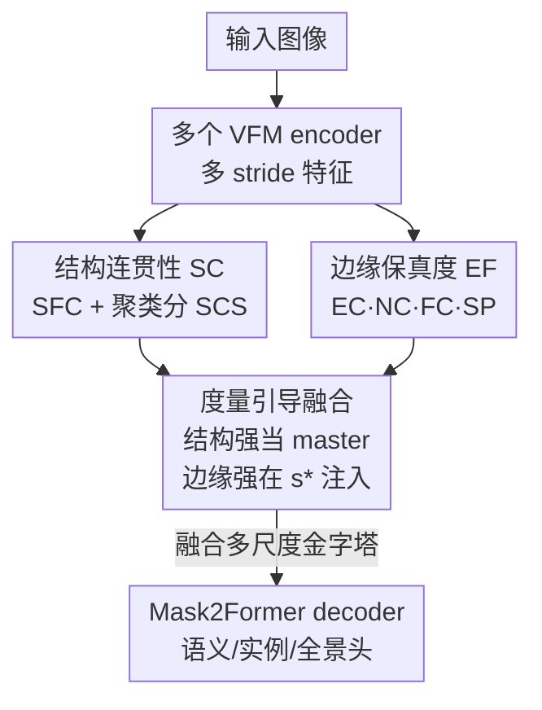

# Metric-Guided Feature Fusion of Visual Foundation Models for Segmentation Tasks

**会议**: CVPR 2026  
**arXiv**: [2605.16864](https://arxiv.org/abs/2605.16864)  
**代码**: https://github.com/gyc-code/metric-guided-fusion (有)  
**领域**: 语义/实例分割 · 视觉基础模型 · 特征融合  
**关键词**: VFM 融合, 无标签特征评估, 结构-边缘偏置, master-auxiliary, 密集预测  

## 一句话总结
针对不同视觉基础模型（VFM）在表征上各有偏好（SAM2 偏边界、DINOv3 偏物体结构）的现象，本文设计一套**无标签**的特征评估指标（结构连贯性 SC + 边缘保真度 EF），用分数自动挑出互补的 encoder 对、并确定从哪个 stride 注入哪类特征，再用极简的 master–auxiliary 融合在单阶段训练里把互补特征拼起来，让 COCO/Cityscapes 等多个分割任务一致涨点。

## 研究背景与动机
**领域现状**：VFM（CLIP、DINO 系、SAM 系）已成为下游视觉任务的默认起点，凭大规模预训练带来强迁移性。直觉上它们也应该在实例分割这类既要精确边界、又要实例级语义区分的密集预测任务上表现优异。

**现有痛点**：作者的预实验给出一个反直觉结果——把冻结的 DINO / SAM encoder 接到标准 Mask2Former 解码器上做实例分割，二者竟然**显著输给** ImageNet 预训练的 Swin Transformer。具体失败模式是：SAM 系在复杂场景里出现类别混淆，DINO 则倾向把一个物体过度分割成多个实例。

**核心矛盾**：不同 VFM 因预训练目标不同而带有**系统性表征偏置**——SAM 用 mask 监督，特征对边界敏感（edge-strong）；DINO 用自监督自蒸馏，特征偏向物体内部结构一致（structure-strong）。单个 encoder 总在「边界精度」和「结构语义」之间顾此失彼。一个自然想法是融合多个 VFM 取长补短，但**朴素多 encoder 融合往往不涨点**，而且缺少可解释的原则说明「为什么这一对有效、该在哪融合」。

**本文目标**：拆成两个子问题——(i) 如何**无标签、低成本**地判定某个 VFM encoder 偏边界还是偏结构？(ii) 拿到这个判断后，如何用它指导融合来一致提升下游密集预测？

**切入角度**：既然偏置可以从冻结特征里直接观测（SAM2 激活集中在边界、DINOv3 激活铺满物体内部），那就把它**量化成可计算的分数**，让分数来驱动「选哪两个 encoder、在哪个 stride 注入」的决策，而不是靠堆模块和多阶段训练去碰运气。

**核心 idea**：用一套无标签的结构/边缘特征指标，把 VFM 的偏置显式打分，再据此做「结构强 encoder 当主、边缘强 encoder 在最佳 stride 注入」的 master–auxiliary 单阶段融合。

## 方法详解

### 整体框架
方法分两段：**(a) 结构/边缘感知的特征评估**——对每个 VFM encoder 在多个输出 stride（OS∈{4,8,16,32}）上抽特征，用无标签的 SC、EF 指标打分，得到「每个 encoder 在每个 stride 偏结构还是偏边缘」的画像，据此挑出一对互补 encoder（一个 structure-strong、一个 edge-strong）并定位最佳注入 stride；**(b) 度量引导的特征融合**——把 SC 高的 encoder（DINOv3-B）设为可训练的 master 提供主特征金字塔，把 EF 高的 encoder（SAM2-B）冻结作为 auxiliary，只在 EF 评分最高的那一个 stride $s^*$ 把它的特征替换进主金字塔，融合后的多尺度金字塔喂给 Mask2Former 的任务专属 decoder。整套方法**不改架构、单阶段训练**，唯一改动就是 encoder 端的设计。

### 关键设计

**1. 结构连贯性 SC：无标签量化「特征是否内部一致、簇间可分」**

要判断一个 encoder 是不是 structure-strong，传统做法要么依赖 ground-truth label，要么只能定性看激活图。本文从两个互补角度构造无标签分数。其一是**结构化特征对比 SFC**：把多通道特征图压成单通道强度图后切成 $K\times K$ 网格，比较「块间差异」与「块内噪声」——$\mathrm{SFC}=\frac{\mathrm{Var}(\{\mu_p\})}{\mathrm{Var}(\{\mu_p\})+\mathrm{Mean}(\{\sigma_p^2\})}\in[0,1]$，分子是各块均值的方差（块间结构对比），分母再加上块内平均方差（局部噪声）；SFC 高说明区域既连贯又彼此分明。其二是**结构聚类分 SCS**：把空间维展平、PCA 降维后对一组 $k$ 值跑 k-means，用 Silhouette 系数衡量簇是否紧致可分，取中位数让它对单一 $k$ 鲁棒——$\mathrm{SCS}=(\mathrm{median}(\{\mathcal{S}_k\})+1)/2$。最终 $\mathrm{SC}=\sqrt{\mathrm{SFC}\cdot\mathrm{SCS}}$ 用几何平均把两者合起来。这套分数完全不用标签就能在下游训练前直接从冻结特征算出 encoder 的结构偏好，作者还用带标签的有监督版 $\mathrm{SC}_{\text{GT}}$ 验证它保持了相同的 encoder 排序（Spearman $\rho=0.726$）

**2. 边缘保真度 EF：四个互补子指标共同刻画「边界是否锐利、定位是否准」**

光有结构分还不够，密集预测同样吃边界精度。EF 从三方面、四个子指标度量特征对图像边缘的还原能力，都先用 Sobel 在缩放后的图上提边缘中心线再算。**空间集中度**有两个：边缘集中度 EC 衡量梯度能量落在边缘核心带 $A_{\text{in}}$（半径 $r_{\text{in}}$ 内）的比例，近边集中度 NC 则只看核心带之外的窄带 $A_{\text{near}}$，刻意排除 EC 已奖励的中心、避免重复打分并惩罚 spillover。**频率特性** FC 对 L2 范数图加 Hann 窗后做 2D 功率谱，量化高于低频阈值 $\rho_{\text{low}}$ 的能量占比（边缘集中在中高频）。**空间精度** SP 用「平移敏感性」测锐度：把特征图沿 8 个方向平移并算归一化互相关 NCC，找到使平均 NCC 跌破阈值 $\tau$ 的最小平移 $r_\tau$，$\mathrm{SP}=1/(1+\gamma\cdot r_\tau)$——锐利边缘一移就 decorrelate，模糊响应则在更大位移下仍相关。四者**乘性**合成 $\mathrm{EF}=\alpha\cdot\mathrm{EC}\cdot\mathrm{NC}\cdot\mathrm{FC}\cdot\mathrm{SP}$，任一维度弱都会大幅拉低总分，从而严格筛出真正 edge-strong 的特征。实测 SAM2 的 EF 在 OS=16 出现尖峰（17.13），正好预言了最佳注入位置

**3. 度量引导的 master–auxiliary 融合：让分数直接决定「谁当主、在哪注入」**

有了 SC/EF 画像，融合就不再靠堆模块。原则是「master 匹配任务主需求、auxiliary 补它的短板」：分割任务重语义，所以选 SC 高的 DINOv3-B 当**可训练 master** 提供主金字塔，选 EF 高的 SAM2-B 当**冻结 auxiliary**，并把注入位置定在 auxiliary 的 EF 峰值 stride $s^*=\arg\max_s \mathrm{EF}_{\text{aux}}(s)$。融合就是在该 stride 用 auxiliary 特征替换、其余 stride 保留 master：$F^{(s)}=F_{\text{aux}}^{(s)}$ 若 $s=s^*$，否则 $F_{\text{master}}^{(s)}$。这样既单阶段训练、几乎零架构改动，又能把边缘强特征「重新平衡」进结构强主干。**为什么冻结 auxiliary 很关键**：RQ5 显示一旦微调 auxiliary，SAM2 的 EF 峰会被压平、SC 反而上升，互补性被破坏；冻结才能保住度量引导赖以选 stride 的预训练模式。框架还能反向泛化——边缘为中心的任务可改用 EF 主干 + SC 注入（Ours-S2D3），实验中它确实主要改善大刚性物体

## 实验关键数据

骨干统一用 Base 规模 ViT（DINO 系 ViT-B、SAM2 用 Hiera-B+），全部接同一 Mask2Former 解码器、分割头从零初始化，使性能差异完全归因于 backbone 特征。FT/FZ 表示 encoder 可训练/冻结，Hybrid 表示「微调 master + 冻结 auxiliary」。

### 主实验

COCO 实例分割（Table 1）：Ours-D3S2（DINOv3 master + SAM2 aux）在各指标全面超过单 encoder baseline，尤其小物体 APs 提升明显。

| 方法 | Backbone | 模式 | AP | AP50 | AP75 | APs |
|------|----------|------|----|------|------|-----|
| Mask2Former | Swin-B | FT | 44.1 | 66.8 | 47.1 | 22.8 |
| SAM2 | Hiera-B+ | FZ | 35.8 | 57.0 | 37.6 | 19.2 |
| DINOv3 | ViT-B | FT | 46.0 | 69.9 | 49.3 | 24.2 |
| **Ours-D3S2** | ViT-B | Hybrid | **47.3** | **70.8** | **51.4** | **27.3** |

跨数据集/任务/尺度泛化（Table 3，D3=DINOv3, S2=SAM2）：

| 数据集 | 任务(指标) | D3 | S2 | Ours-D3S2 |
|--------|-----------|----|----|-----------|
| ADE20K | 语义(mIoU) | 56.1 | 46.9 | **57.5** |
| KITTI-360 | 实例(AP) | 19.9 | 14.3 | **21.9** |
| COCO | 全景(PQ) | 55.6 | 43.7 | **56.9** |
| Urbansyn→CS (ViT-L) | 实例(AP) | 30.0 | 27.8 | **32.5** |
| Synscapes→CS (ViT-L) | 实例(AP) | 30.4 | 22.5 | **33.4** |

Cityscapes 上 Ours-D3S2 实例 AP=39.5、语义 mIoU=82.8，均超过 DINOv3（35.6/81.2）与 SAM2（35.8/79.7），甚至以 ViT-Base 规模超过若干 ViT-g 等大得多的骨干。

### 消融实验

注入 stride 消融（Table 6，Cityscapes 实例 AP，下划线=EF 建议 stride，粗体=逐行 oracle 最优）：度量预测的 stride 在 4 个设置中 3 个**正好命中**经验最优，且「微调 master + 冻结 aux」（Setting A）整体最好。

| 设置 | master | aux | OS=4 | OS=8 | OS=16 | OS=32 |
|------|--------|-----|------|------|-------|-------|
| A (D3 master, S2 aux) | FT | FZ | 37.0 | 34.2 | **39.1**（s*） | 35.3 |
| B (D3 master, S2 aux) | FZ | FZ | 27.1 | 32.0 | 35.4（s*） | 29.2 |
| C (S2 master, D3 aux) | FT | FZ | 29.4 | 31.2 | 34.1 | 32.2 |
| D (S2 master, D3 aux) | FZ | FZ | 33.9 | 34.7 | 35.8 | 37.2 |

SC/EF 与真值/性能的相关性（Table 7）：无标签 SC 与有监督 $\mathrm{SC}_{\text{GT}}$ 的 encoder 排序一致（Spearman $\rho=0.726$, $p<10^{-4}$）；逐 stride 的 EF 与「注入 SAM2 后的 $\Delta$AP」同趋势（$\rho=0.80$），均在 OS=16 达到峰值（EF=17.89, $\Delta$AP=+11.1）。

### 关键发现
- **方向性互补被实证**（RQ1, Table 4）：Ours-D3S2（边缘注入结构主干）在边界敏感类（person/rider/mbike/bicycle）涨得最多，平均 AP 30.1→39.1；反向的 Ours-S2D3（结构注入边缘主干）则主要改善大刚性物体——证明融合是在「选择性补短板」。
- **冻结 auxiliary 是必需而非偷懒**（RQ5, Table 8）：微调会把 SAM2 在 OS=16 的 EF 峰从 17.13 压平到 9.30、SC 从 0.11 抬到 0.46，互补性被抹掉；冻结才保住度量引导选 stride 的依据。
- **SC/EF 可在训练前预测最优配置**：无需穷举 stride，直接用 auxiliary 的 EF 峰即可定位注入点，省去昂贵的网格搜索。

## 亮点与洞察
- **把「玄学融合」变成可解释决策**：以往多 encoder 融合靠堆模块+多阶段训练，本文用一套无标签分数回答「选谁、在哪融」，并用 ground-truth 与下游 $\Delta$AP 双重验证分数有效（$\rho=0.726$ / $0.80$），这种「先量化偏置再据此设计」的范式可迁移到任意需要挑/配预训练 encoder 的场景。
- **EF 的乘性合成很巧**：EC·NC·FC·SP 相乘意味着任一维度（集中度/频率/锐度）塌了总分就塌，天然排除「某一项虚高但整体不锐利」的伪边缘特征，比加权和更能逼出真正 edge-strong 的 stage。
- **NC 刻意排除 EC 的核心带**避免重复奖励边缘中心、转而度量近边带的干净程度，这种「指标间去冗余」的设计思路在自定义评估体系里很值得借鉴。
- **decoder-agnostic + 单阶段 + 几乎零架构改动**，唯一变量是 encoder 端，工程上极易接到现成 Mask2Former 流水线。

## 局限与展望
- **只在单一 stride 注入单个 auxiliary**：融合形式相对保守（替换式），是否多 stride、多 auxiliary 协同能进一步涨点、会不会引入冲突，论文未充分探索。
- **master/aux 角色由任务先验人工指定**（分割→SC 当主），虽给出反向泛化的例子（边缘任务用 EF 当主），但「该选谁当主」仍未做成由指标自动判定的闭环。
- **EF/SC 指标含较多超参**（$K$、PCA 维数、$r_{\text{in}}/r_{\text{out}}$、$\rho_{\text{low}}$、$\tau$、$\gamma$、$\alpha$），作者称补充材料的敏感性分析显示鲁棒，但跨数据集/分辨率的稳定性仍需更广验证。
- 评估目前聚焦分割类密集预测，是否能推广到检测、深度估计等其他密集任务有待验证。

## 相关工作与启发
- **vs 单 encoder 参数高效微调（ViT-Adapter / 各类 PEFT）**：他们只调一个 VFM 主干，受限于该 encoder 固有的结构-边缘偏置；本文用第二个互补 encoder 补短板，且通过冻结 aux 保住其边缘先验，AP 上明显更高。
- **vs 既有多 encoder 融合（CLIP+SAM / SAM+DINO / CLIP+DINO）**：这些方法常需多阶段训练 + 复杂集成模块，且说不清「为什么这一对有效」；本文以无标签 SC/EF 指标给出可解释的配对与注入 stride 选择，换来轻量单阶段融合。
- **vs 以往 VFM 特征评估（多为 object-centric、依赖标签）**：先前评估常把失败归因到具体物体属性、需要 ground-truth；本文提供无标签、基于聚类/梯度/频率等经典视觉原理的特征级评估工具，刻画的是「模型内部如何偏置」而非「任务为什么难」。

## 评分
- 新颖性: ⭐⭐⭐⭐ 把 VFM 表征偏置量化成无标签 SC/EF 分数并用其驱动融合，视角与可解释性都新颖
- 实验充分度: ⭐⭐⭐⭐ 覆盖 COCO/Cityscapes/ADE20K/KITTI-360 多任务 + 5 个 RQ + 真值相关性验证，较扎实
- 写作质量: ⭐⭐⭐⭐ 结构清晰、用 RQ 串起分析，指标定义完整
- 价值: ⭐⭐⭐⭐ 给「如何选配预训练 encoder」提供可复用的度量范式，且工程接入成本低

<!-- RELATED:START -->

## 相关论文

- [\[CVPR 2026\] AG-VAS: Anchor-Guided Zero-Shot Visual Anomaly Segmentation with Large Multimodal Models](ag-vas_anchor-guided_zero-shot_visual_anomaly_segmentation_with_large_multimodal.md)
- [\[CVPR 2026\] GKD: Generalizable Knowledge Distillation from Vision Foundation Models for Semantic Segmentation](gkd_generalizable_knowledge_distillation_vfm.md)
- [\[NeurIPS 2025\] Mars-Bench: A Benchmark for Evaluating Foundation Models for Mars Science Tasks](../../NeurIPS2025/segmentation/mars-bench_a_benchmark_for_evaluating_foundation_models_for_mars_science_tasks.md)
- [\[CVPR 2026\] Selective, Regularized, and Calibrated: Harnessing Vision Foundation Models for Cross-Domain Few-Shot Semantic Segmentation](selective_regularized_and_calibrated_harnessing_vision_foundation_models_for_cro.md)
- [\[ICCV 2025\] TAViS: Text-bridged Audio-Visual Segmentation with Foundation Models](../../ICCV2025/segmentation/tavis_text-bridged_audio-visual_segmentation_with_foundation_models.md)

<!-- RELATED:END -->
