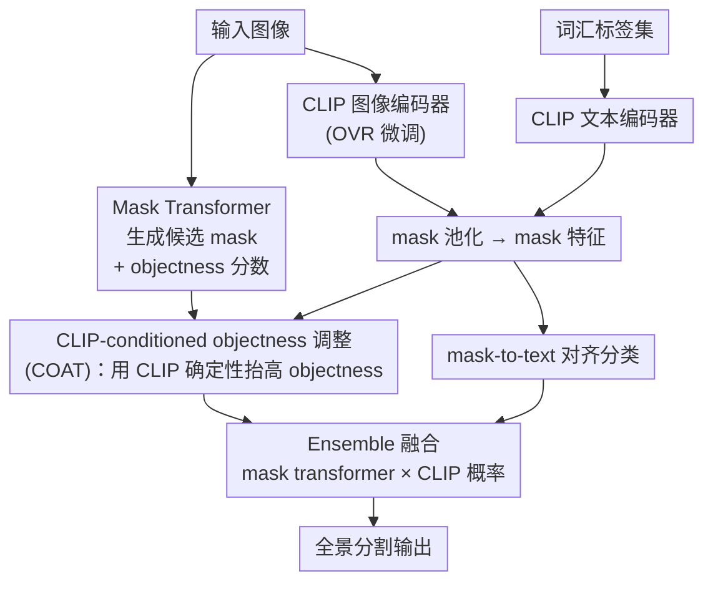

# Mitigating Objectness Bias and Region-to-Text Misalignment for Open-Vocabulary Panoptic Segmentation

**会议**: CVPR 2026  
**论文**: [CVF Open Access](https://openaccess.thecvf.com/content/CVPR2026/html/Kormushev_Mitigating_Objectness_Bias_and_Region-to-Text_Misalignment_for_Open-Vocabulary_Panoptic_Segmentation_CVPR_2026_paper.html)  
**代码**: 有（论文称已开源，仓库地址原文未给出，⚠️ 以原文为准）  
**领域**: 开放词汇全景分割 / 视觉-语言模型  
**关键词**: 开放词汇全景分割, objectness 偏置, CLIP, mask-to-text 对齐, FC-CLIP

## 一句话总结
OVRCOAT 用一个轻量的「CLIP 置信度反向修正 mask transformer 的 objectness 分数（COAT）」+「mask 级别的图文对齐微调（OVR）」两件套，专治开放词汇全景分割里"训练时没见过的物体被当成背景丢弃"和"CLIP 区域特征对不准类别"两个老毛病，在 ADE20K 上把 PQ 推到新 SOTA（相对 +5.5%），且比之前的全量微调方案省显存。

## 研究背景与动机

**领域现状**：开放词汇全景分割（open-vocabulary panoptic segmentation）的主流范式是"mask transformer 提候选 mask + 用 objectness 分数过滤 + 用 CLIP/ALIGN 这类 VLM 给保留下来的 mask 分类"。代表工作 FC-CLIP 用一个冻结的卷积 CLIP backbone 同时做特征提取和分类，MAFT+ 进一步微调 backbone 来提升 mask 分类。

**现有痛点**：作者指出这一范式被两个互相耦合的问题卡住。其一是 **mask selection bias（mask 选择偏置）**：objectness 头是在闭词汇数据（如 COCO）上训出来的，遇到训练时没标注过的类别，往往给出很低的 objectness 分数，于是这些 mask 在分类前就被早早丢掉、归到背景。论文图 1 的例子很直观——FC-CLIP / MAFT+ 在没有 painting（画作）这个训练类别时，会直接把墙上的画当背景扔掉。其二是 **CLIP 的区域理解弱**：CLIP 是为"整图"的图文检索/分类优化的，对比损失只强制全局图文对齐，落到 mask/像素这种局部区域时特征对不准边界，mask 级分类精度差。

**核心矛盾**：objectness 分数本质上是 mask 全局特征与一个预训练 **void token** 的归一化相似度，这个 void token 天然偏向训练词汇——如果测试类别恰好出现在训练图像的"未标注区域"，void token 就更倾向把它判成背景。而 VLM 微调路线为了救区域对齐，又会因为全景训练数据少、词汇窄而过拟合，反过来削弱 CLIP 本来的开放词汇泛化能力。也就是说，**修 objectness 偏置**和**修区域对齐**这两件事，之前要么没碰、要么一碰就掉泛化。

**本文目标**：在不破坏 CLIP 大规模预训练带来的开放性的前提下，同时缓解 objectness 偏置（保住 OOV mask）和区域-文本错配（提升 mask 分类），并且要比已有微调方案更省显存、更易插拔。

**核心 idea**：用 CLIP 自身的分类确定性去"反向松绑"mask transformer 那个被训练词汇绑死的 objectness 分数；再设计一个只在 mask 级别做图文对齐、并配两阶段冻结策略的轻量微调，让 CLIP 学会看局部、又不丢全局泛化。

## 方法详解

### 整体框架
OVRCOAT 沿用"mask transformer + 冻结/微调 CLIP"的全景分割骨架（backbone 为 OpenCLIP 的 ConvNeXt-Large，mask transformer 用 Mask2Former），但在两处插入贡献模块。输入一张图，mask transformer 产生若干候选 mask 及其 objectness 分数；同时 CLIP 图像编码器（经 OVR 微调）对每个 mask 做局部池化得到 mask 特征，与 CLIP 文本编码器编码的词汇 embedding 算相似度得到分类分布。**COAT** 在 objectness 这一路：用 CLIP 的分类确定性把过低的 objectness 往上抬，避免 OOV mask 被误丢；**OVR** 在分类这一路：通过一个 mask-to-text 微调目标，让 CLIP 的区域特征和文本对齐得更准。最后把 mask transformer 分类概率和 CLIP 分类概率做 ensemble，输出全景结果。两个模块都是"加挂"式的，互补但解耦。

### 关键设计

**1. COAT：用 CLIP 确定性给 objectness 分数松绑**

针对的痛点是 objectness 头被训练词汇绑死、把 OOV mask 当背景丢。作者先点明这套范式里 objectness 是怎么起作用的：分类用的概率密度被定义为 $\mathbf{p}_\mathrm{cls} = [\mathbf{p}_\mathrm{ens}\cdot p_\mathrm{obj},\, 1 - p_\mathrm{obj}]$，其中 $\mathbf{p}_\mathrm{ens}$ 是逐类的集成概率，$p_\mathrm{obj}$ 是 objectness 分数（通常 $p_\mathrm{obj} = 1 - p_\mathrm{void}$），它是一个门控——$p_\mathrm{obj}$ 一低，这个 mask 还没分类就被当成背景 void 拒掉。问题就出在 $p_\mathrm{obj}$ 来自 mask 特征与 void token 的相似度，而 void token 偏向训练词汇。

COAT 的做法是引入一个"不带这种偏置"的第二意见——CLIP。对候选 mask $\mathbf{M}_i$，先全局 mask 池化得到特征 $\mathbf{F}_{\mathrm{seg},i} = \frac{\sum_{u,v}\mathbf{M}_i(u,v)\cdot\mathbf{F}_\mathrm{img}(u,v)}{\sum_{u,v}\mathbf{M}_i(u,v)}$，再与 CLIP 文本 embedding $\mathbf{F}_\mathrm{txt}$ 做点积 + softmax 得到 $\mathbf{p}_{\mathrm{CLIP},i}=\mathrm{softmax}(\mathbf{F}_{\mathrm{seg},i}\mathbf{F}_\mathrm{txt}^\top)$。直觉是：若 mask 和某个类别强匹配，对应概率会很高；若谁都不像，分布趋于均匀、最大值就低。于是把 CLIP 的"分类确定性"定义为 $p_\mathrm{cer}=\max_i p_{\mathrm{CLIP},i}$，并据此修正 objectness：

$$p_\mathrm{obj}' = 1 - (1 - \gamma\, p_\mathrm{cer})(1 - p_\mathrm{obj})$$

这里 $\gamma$ 是"CLIP 信任因子"。这个式子的妙处在于 $p_\mathrm{cer}$ 给修正后的 $p_\mathrm{obj}'$ 设了上界：CLIP 越确定（$p_\mathrm{cer}$ 越高），就越敢把一个原本被 mask transformer 低估的 OOV mask 的 objectness 抬上来，从而保住它不被丢；而 CLIP 也不确定时就不乱动。因为 CLIP 区域特征本身有定位噪声，作者把信任因子设得偏保守 $\gamma=0.5$，避免被 CLIP 的噪声相似度带偏。整套修正是**测试时**生效、零额外训练。

**2. OVR：mask 级别的图文对齐微调，专补 CLIP 的区域短板**

针对 CLIP 全局图文对齐、区域特征对不准类别的痛点。OVR 是一个微调协议：训练时对 mask transformer 生成的每个候选 mask，用 CLIP 图像编码器特征做**局部池化**得到 mask embedding，与词汇文本 embedding 匹配、softmax 得到逐类概率，再用交叉熵 $\mathcal{L}_\mathrm{cls}$ 监督（ground-truth 类别由候选 mask 和真值 mask 的匈牙利匹配得到）。同时保留经典 mask transformer 损失 $\mathcal{L}_\mathrm{M2F}$ 来监督 mask 生成，合成总损失：

$$\mathcal{L} = \alpha\,\mathcal{L}_\mathrm{cls} + \mathcal{L}_\mathrm{M2F}$$

其中 $\alpha=0.1$。与 ODISE/早期方法"裁剪 mask 区域反复跑 CLIP backbone"相比，OVR 只需提一次特征、用 mask 池化复用，因此显存开销显著低于此前的全量微调方案——这也是论文强调的"simple、memory-efficient"卖点。关键是它直接在 mask 粒度上拉近图文特征，而不是停留在整图级别，从而同时改善 seen 和 unseen 类的分类。

**3. 两阶段冻结训练：在小数据微调下保住 CLIP 的开放词汇泛化**

针对 OVR 微调的隐患：全景训练集小、词汇窄，直接放开 CLIP 图像编码器很容易过拟合、把 CLIP 原有的图文对齐空间搞坏，丢掉开放性。作者用两阶段训练化解：第一阶段**冻结 CLIP 图像编码器**，只预训练 mask 生成，绝不扰动 CLIP 的 embedding 空间；第二阶段**解冻 CLIP 图像编码器**联合微调 embedding-mask 对齐与 mask proposal 精度，但和 MAFT+ 一样把最后的投影 MLP 和归一化层冻住做"受限训练"。这种"先稳住表示、再小步对齐"的顺序，让模型既学到了局部对齐、又没把预训练知识洗掉，是 OVR 能保泛化的关键配套。

### 损失函数 / 训练策略
总损失即上面的 $\mathcal{L}=\alpha\mathcal{L}_\mathrm{cls}+\mathcal{L}_\mathrm{M2F}$（$\alpha=0.1$）。优化器 AdamW，权重衰减 0.05；第一阶段学习率 $1\times10^{-4}$，第二阶段 $5\times10^{-5}$；信任因子 $\gamma=0.5$。训练只用 COCO 闭词汇全景数据，3 张 A100（40GB）、batch size 9。评测时在 ADE20K / Cityscapes / Mapillary Vistas 等 OOV 数据集上零样本迁移。

## 实验关键数据

### 主实验
统一在 COCO 上训练，在三个 OOV 全景数据集 + COCO 上评测（PQ/SQ/RQ）。OVRCOAT 在所有 OOV 数据集上稳定超过此前 SOTA，平均 PQ 相对 MAFT+ 高约 16%；只有在 COCO（seen 词汇）上略逊 ODISE 1.4%——这是 COAT 用 CLIP 替换专门为 COCO 训练的 objectness 评估带来的可预期 trade-off。

| 数据集 | 指标 | 本文 OVRCOAT | FC-CLIP | MAFT+pan |
|--------|------|------|----------|----------|
| ADE20K | PQ | **28.6** | 26.8 | 27.1 |
| ADE20K | SQ | 77.3 | 71.2 | 73.5 |
| Mapillary Vistas | PQ | **19.6** | 18.3 | 15.7 |
| Mapillary Vistas | SQ | **65.7** | 56.0 | 55.5 |
| Cityscapes | PQ | **45.3** | 44.0 | 38.3 |
| COCO（seen） | PQ | 54.6 | 54.4 | 50.3 |

注：摘要里 ADE20K +5.5% / Mapillary +7.1% / Cityscapes +3% 是**相对**提升（如 ADE20K 28.6 对 MAFT+pan 27.1 约 +5.5%）。Mapillary 上 SQ 相对 MAFT+ 提升约 18%，显示跨域泛化尤其强。

### 消融实验
逐个加回 COAT / OVR（基线为 FC-CLIP）：

| COAT | OVR | ADE20K | Mapillary | Cityscapes | COCO |
|------|-----|--------|-----------|------------|------|
| ✗ | ✗ | 26.8 | 18.3 | 44.0 | 54.4 |
| ✓ | ✗ | 27.6 | 18.8 | 44.6 | 53.7 |
| ✗ | ✓ | 27.6 | 19.2 | 44.5 | **55.5** |
| ✓ | ✓ | **28.6** | **19.6** | **45.3** | 54.6 |

单独 COAT 在所有 OOV 数据集上稳定提 PQ（约 1.4%–3% 相对），单独 OVR 也能比基线提 1%–5%，两者叠加才拿到最佳，证明二者互补。代价是 COAT 在 COCO（seen）上略掉点（54.4→53.7），因为它替换掉了专门为 COCO 训的 objectness。

另一组 mask 分类器验证（表 4）显示：ensemble + COAT（即完整 OVRCOAT）优于所有变体——把 mask transformer 当 seen 类的"专家"和 CLIP 集成，比只用 CLIP 相对提升约 14% PQ，而 COAT 对 ensemble 和单独 CLIP 分类器都有提升。

| Mask 分类器 | COAT | PQ | SQ | RQ |
|-------------|------|----|----|----|
| CLIP_OVR | ✗ | 24.2 | 75.9 | 29.2 |
| CLIP_OVR | ✓ | 24.9 | 78.4 | 30.2 |
| Ensemble | ✗ | 27.6 | 74.1 | 33.4 |
| Ensemble | ✓ | **28.6** | **77.3** | **34.7** |

### 关键发现
- **unseen 类受益最大**：按 ADE20K 逐类 PQ 拆开看，unseen 类平均 +3.9pp、平均相对提升约 25%，其中 painting 这种常被当背景的类相对提升高达 192%；而 seen 类平均仅 -0.05pp，几乎无损。说明增益主要来自"救回 OOV mask"，且没牺牲已知类。
- **训练频次决定 seen 类走向**：seen 类里训练样本少的（apparel/boat/counter，约 5000 mask）反而涨，样本多的（约 14000 mask）小幅降，整体抵消。
- **COAT 只在全景任务有用**：迁到语义分割时 OVR 仍能在 5 个数据集里的 4 个上超基线，但再加 COAT 反而略降——因为语义分割不丢弃任何 mask、所有 mask 都聚合进逐像素分布，调 objectness 没有实际选择效果，反而引入 CLIP 定位噪声。这是一个诚实且有解释力的负结果。

## 亮点与洞察
- **把 objectness 偏置归因到 void token 偏向训练词汇**，这个诊断很精准，也直接指向解法：不重训 objectness 头，而是用一个无此偏置的 CLIP 在测试时反向修正。零训练、可插拔，思路干净。
- **修正公式自带"上界"语义**：$p_\mathrm{obj}'=1-(1-\gamma p_\mathrm{cer})(1-p_\mathrm{obj})$ 让 CLIP 只能"抬"不能乱压，且抬多少由 CLIP 自己的确定性决定，比硬加阈值/重加权优雅。
- **mask 池化复用特征**省去了 ODISE 式"裁剪后反复跑 CLIP"，显存友好——这让该方法更容易嫁接到别的 mask-transformer 方法上。
- **COAT 在语义分割上失效的分析**是难得的诚实负例，把"为什么有效/为什么这里无效"讲透了，比一味报涨点更有说服力，也提示读者这类 objectness 修正天然只适配"会拒绝 mask"的任务。

## 局限与展望
- **seen 类（COCO）有可测量的 trade-off**：COAT 替换专用 objectness 后在 COCO PQ 略降、并被 ODISE 反超 1.4%，说明在已知词汇为主的部署里收益有限甚至负向。
- **依赖 CLIP 区域相似度的质量**：信任因子被迫压到 $\gamma=0.5$ 正是因为 CLIP 区域特征噪声大；若换更弱的 VLM 或更难定位的场景，COAT 的修正可能不稳。
- **不适配语义分割**：方法明确只在"需要丢弃 mask"的全景设定下成立，泛化范围受限。
- **改进方向**：可探索让 $\gamma$ 随 mask 质量/类别自适应，或把 COAT 的"第二意见"换成更强的区域级 VLM（如 region-aware 预训练模型），有望同时拿回 seen 类的损失。

## 相关工作与启发
- **vs FC-CLIP**：FC-CLIP 用单个冻结卷积 CLIP backbone 做特征+分类，是本文的基线；OVRCOAT 不改其骨架，只加挂 COAT（救 objectness）+ OVR（补区域对齐），在所有 OOV 数据集上稳超 FC-CLIP，且把它点名的 objectness 偏置当作主攻问题。
- **vs MAFT+**：MAFT+ 走"微调 backbone 做 mask 分类"的重路线，但在 ADE20K 外的数据上 PQ 明显退化（凸显微调的泛化代价）；OVRCOAT 用更简单、更省显存的两阶段受限微调 + 测试时 objectness 修正，跨域泛化更稳（Mapillary SQ 相对 +18%）。
- **vs ODISE**：ODISE 在 COCO（seen）上更强，但需要裁剪 mask 反复评估 CLIP、开销大；OVRCOAT 在其余所有数据集上大幅领先（Cityscapes 最高相对 +90%），以更低成本换取更强开放词汇泛化。

## 评分
- 新颖性: ⭐⭐⭐⭐ 把 objectness 偏置精准归因到 void token 并用 CLIP 确定性测试时修正，角度新且解法简洁，但属"在成熟范式上加两个模块"。
- 实验充分度: ⭐⭐⭐⭐ 三个 OOV 数据集 + 语义分割 + 逐类拆解 + oracle 验证齐全，还诚实报告了 seen 类 trade-off 与语义分割负结果。
- 写作质量: ⭐⭐⭐⭐ 问题诊断—解法—验证链条清晰，公式与动机对得上，负结果分析到位。
- 价值: ⭐⭐⭐⭐ 模块即插即用、省显存、刷新 ADE20K SOTA，对开放词汇分割社区实用性强。

<!-- RELATED:START -->

## 相关论文

- [\[CVPR 2026\] MARIS: Marine Open-Vocabulary Instance Segmentation](maris_marine_open-vocabulary_instance_segmentation.md)
- [\[CVPR 2026\] S2C2Seg: Semantic-Spatial Consistency and Category Optimization for Open-Vocabulary Segmentation](s2c2seg_semantic-spatial_consistency_and_category_optimization_for_open-vocabula.md)
- [\[CVPR 2026\] PEARL: Geometry Aligns Semantics for Training-Free Open-Vocabulary Semantic Segmentation](pearl_geometry_aligns_semantics_for_training-free_open-vocabulary_semantic_segme.md)
- [\[CVPR 2026\] Seeing Both Sides: Towards Bidirectional Semantic Alignment for Open-Vocabulary Camouflaged Object Segmentation](seeing_both_sides_towards_bidirectional_semantic_alignment_for_open-vocabulary_c.md)
- [\[CVPR 2026\] Test-Time Multi-Prompt Adaptation for Open-Vocabulary Remote Sensing Image Segmentation](test-time_multi-prompt_adaptation_for_open-vocabulary_remote_sensing_image_segme.md)

<!-- RELATED:END -->
